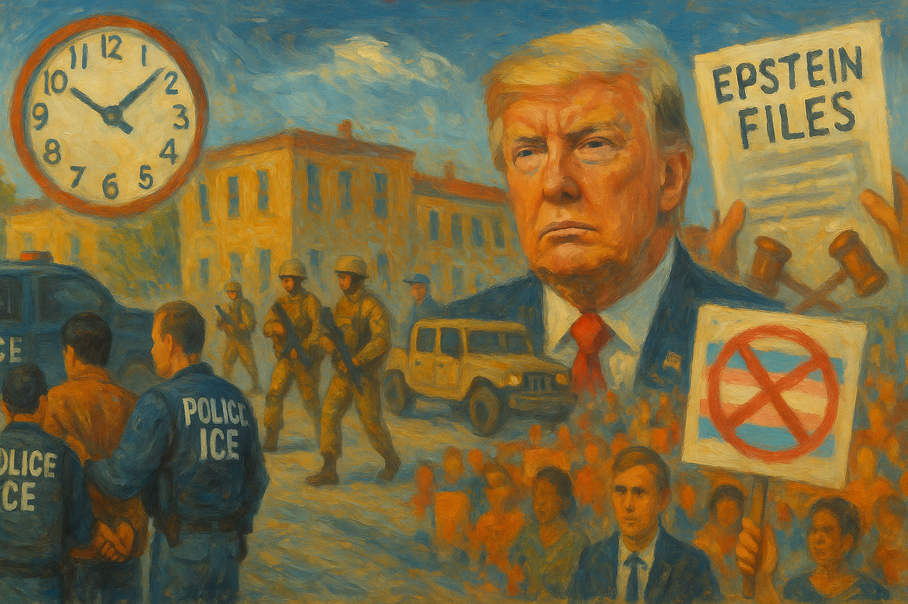

<!-- Generated by build_publish_week_v1 -->
<!-- Header image: image_wide_week44.png -->

# Week 44: Sedition Charge, Files Forced Open

*A presidential call for execution of dissenting lawmakers and a veto-proof transparency law collided this week, leaving the clock nearly frozen.*

The week Congress finally forced the Epstein files into daylight, the president called for the execution of six of his own Congress's members. Both things happened. Neither canceled the other out. That is the shape Week 44 takes: real institutional friction and real judicial pushback, sitting alongside a rhetorical escalation with no precedent in the modern presidency. The Democracy Clock, which has spent the autumn edging steadily toward midnight, held almost still this week. That stillness is not comfort. It is the arithmetic of two forces pulling hard in opposite directions.

At the close of last week the clock stood at 7:42 p.m. It closed this week at 7:42 p.m. as well, a net movement of one-fifth of a minute. Effectively no change. But that is not the same as nothing happening. A rare bipartisan legislative victory, several sharp court rulings, and continued grassroots resistance pushed the hands backward. A president's public call for the arrest and execution of dissenting lawmakers, a widening web of pardons tied to personal enrichment, and a nationwide immigration surge pushed them forward. The two nearly canceled. What remains is a system straining in both directions at once, its outcome undecided.

The week's defining action began before dawn on a Saturday, when federal agents flooded into Charlotte, North Carolina, under the banner of Operation Charlotte's Web. Over several days the operation produced more than 250 arrests. Agents raided an after-school program serving immigrant children. They detained a naturalized U.S. citizen, Willy Aceituno, throwing him to the ground and disbelieving him even as he presented his citizenship papers. Schools closed. Businesses shuttered. The Charlotte-Mecklenburg Police Department, notably, refused to take part.

The operation was not contained to Charlotte. Federal officials signaled New Orleans, another Democratic-led city, as the next target. The enforcement surge worked as a template, not a one-time response to local conditions. Community groups organized rapid legal defense networks within days, and hundreds protested in the streets. The contrast was stark: a federal government moving with overwhelming force against ordinary residents, and citizenship itself proving an insufficient shield against it.

Then came the moment that will likely define this week in any future accounting. On November 20, after six Democratic lawmakers released a video reminding U.S. troops of their legal duty to refuse illegal orders, the president called their statement seditious, "punishable by death." He called for their arrest. White House officials, rather than walking the comment back, amplified it, recasting a statement of settled military law as incitement to insurrection.

No indictment followed. No formal action was taken against the six lawmakers. But the absence of consequence is itself the measure of the moment. A sitting president threatened the physical safety of members of a co-equal branch of government over protected speech, and the machinery of accountability simply did not engage. The president repeated the threat the next day. This was not a single outburst. It was a sustained pressure campaign against elected officials, conducted in public, without institutional pushback.

Set against this, the week also produced one of the term's most significant transparency victories. Weeks of mounting pressure, capped by a discharge petition, forced a House vote on the Epstein Files Transparency Act. It passed 427 to 1. The Senate passed it by unanimous consent a day later. The president, who had resisted release for months, reversed course and signed the bill. House Oversight had already released more than twenty thousand pages of Epstein estate documents. For a week defined by executive resistance to scrutiny, this was a rare moment when ordinary legislative mechanics simply overpowered that resistance.

The victory did not stand unqualified. Within days of signing the law, the president directed the Department of Justice to open investigations into Epstein-linked figures, including political rivals such as Bill Clinton and Larry Summers. The timing served a specific function. An active investigation creates a standard legal basis for withholding documents from public release. Congress had voted, almost unanimously, to compel disclosure. The executive branch answered by building the very exemption that could gut the law's purpose. Ghislaine Maxwell's subsequent refusal to answer questions before House Oversight closed off another avenue of accountability. Compliance with the letter of the law, evasion of its intent. The same pattern surfaced again and again this week.

The courts, for their part, kept working. A federal magistrate found that a Trump-appointed prosecutor, Lindsey Halligan, had made false statements to the grand jury that indicted former FBI Director James Comey. Further hearings revealed the grand jury never actually reviewed the final indictment. A three-judge panel struck down Texas's mid-decade congressional map as an unconstitutional racial gerrymander, over a dissent from one judge that veered into unsubstantiated claims about outside influence. A separate court found the deployment of National Guard troops in Washington, D.C. unlawful, though it stayed its own ruling pending appeal, letting the deployment continue even as its illegality was formally established.

These rulings matter. They show courts still willing to name overreach when they see it, even under sustained political pressure. But the National Guard case captures the week's central tension precisely: a court can find something unlawful and still allow it to continue. The finding exists. The remedy waits.

Elsewhere, the president turned on members of his own party with a ferocity usually reserved for opponents. He withdrew his endorsement of Rep. Marjorie Taylor Greene, called her a "ranting lunatic," and backed a primary challenger against her. He attacked Reps. Massie and Paul over personal matters, including one lawmaker's remarriage after his wife's death. He threatened Indiana state senators with primaries for refusing to redraw districts on his timeline. By week's end, Greene had announced her resignation from Congress. Some of the president's own supporters burned MAGA merchandise in protest, a small but visible crack in the coalition.

This is loyalty enforced through fear rather than shared purpose. It costs the party experienced voices and independent judgment, replacing them with officials who weigh every position against the risk of presidential displeasure. Opposition inside the president's own party, not just outside it, grew measurably weaker this week.

A parallel pattern of self-dealing ran through the week's business and clemency decisions. The president pardoned Binance founder Changpeng Zhao shortly after Zhao's company struck a lucrative deal with a Trump-linked crypto venture. He launched his own cryptocurrency business while easing regulation of that same industry. The Trump Organization pursued real estate deals in Saudi Arabia and the Maldives even as the administration elevated Saudi Arabia to major non-NATO ally status and approved F-35 sales over Pentagon and intelligence objections. The president publicly dismissed U.S. intelligence findings implicating the Saudi crown prince in the murder of journalist Jamal Khashoggi, calling it a matter of "things happen," while hosting him at the White House.

Each of these events might be explained alone. Together, they describe personal financial interest and official state decisions running on parallel, closely timed tracks. Separately, Bill Pulte, head of the Federal Housing Finance Agency, fired officials who were investigating his own conduct—a small but telling instance of an agency head removing the people assigned to watch him rather than answering their questions.

Immigration enforcement, the intra-party purges, and the Epstein pretext all found their echo in a broader assault on the press. The president threatened to sue the BBC for as much as five billion dollars despite the network's apology. He threatened to revoke ABC's broadcast license after a reporter asked about Khashoggi. He called a Bloomberg reporter "piggy" on Air Force One and berated two other female reporters by name. He demanded NBC fire Seth Meyers and that ABC fire Jimmy Kimmel. Vice President Vance publicly suggested Jeff Bezos install a far-right commentator atop the Washington Post's political coverage. White House officials separately discussed CNN staffing changes with a prospective corporate buyer of its parent company.

No single one of these acts changes the media landscape by itself. Their accumulation does. Each is a small lesson to journalists and executives about the cost of unfavorable coverage, and each nudges outlets toward caution rather than confrontation.

Economic data told its own story of strain. Grocery prices reached record highs. Unemployment climbed to its worst level since 2021. A Fox News poll found rising numbers of Americans, including many Republicans, rating the economy negatively. Against this, administration officials kept describing a "Golden Age" economy, and Agriculture Secretary Brooke Rollins offered an explanation for beef prices that was quickly and factually disputed. The Labor Department, meanwhile, cancelled the October inflation report entirely and delayed the November release, removing the very data that might have settled the dispute. When the government controls both the claim and the evidence, the public loses its independent referee.

Two developments deserve final note for what they say about resilience rather than damage. Charlotte's police department declined to assist a federal operation it viewed as outside its mission. A jury in Washington acquitted a veteran protester, and prosecutors dropped charges against another, over conduct at anti-ICE demonstrations. These are small institutional acts, taken by people close to the ground rather than by senior officials. They matter precisely because they show that professional judgment and independent conscience have not been fully absorbed into the machinery above them.

Week 44 does not resolve into a single verdict. It holds a veto-proof act of Congress and a presidential call for the execution of Congress members in the same seven days. It holds a court that found a deployment unlawful and let it continue anyway. It holds a citizen thrown to the ground while holding his own citizenship papers, and a police department that said no. The period's meaning lies less in any one of these events than in their coexistence: an institutional structure still capable of friction, still generating real checks, straining against a presidency willing to test limits that, until now, no occupant of the office had tested in public. More often than not this week, nothing stopped him.

<!-- Synopses for cross-posting -->
Long Synopsis: Week 44 held two irreconcilable facts. Congress forced the Epstein Files Transparency Act through 427-1 and by unanimous Senate consent, compelling a presidential signature after months of resistance. Days later, President Trump publicly called for the arrest and execution of six Democratic lawmakers who had reminded troops of their duty to refuse illegal orders, calling their statement seditious, "punishable by death." No consequence followed either the threat or its repetition. Meanwhile, federal agents swept through Charlotte, North Carolina, arresting more than 250 people, detaining a naturalized citizen despite his papers, and raiding a children's after-school program. Courts found prosecutorial misconduct in the Comey case, struck down a Texas gerrymander, and ruled a National Guard deployment unlawful, though they let it continue. Pardons followed business deals. The president turned on his own party, driving Rep. Greene from Congress. The Democracy Clock moved one-fifth of a minute, netting to a virtual standstill between real institutional friction and unprecedented executive escalation.
Short Synopsis: Congress forced Epstein transparency into law while the president called for the execution of dissenting lawmakers. Courts pushed back, immigration raids swept a city, and pardons followed business deals. The clock barely moved, caught between real resistance and new extremes.

