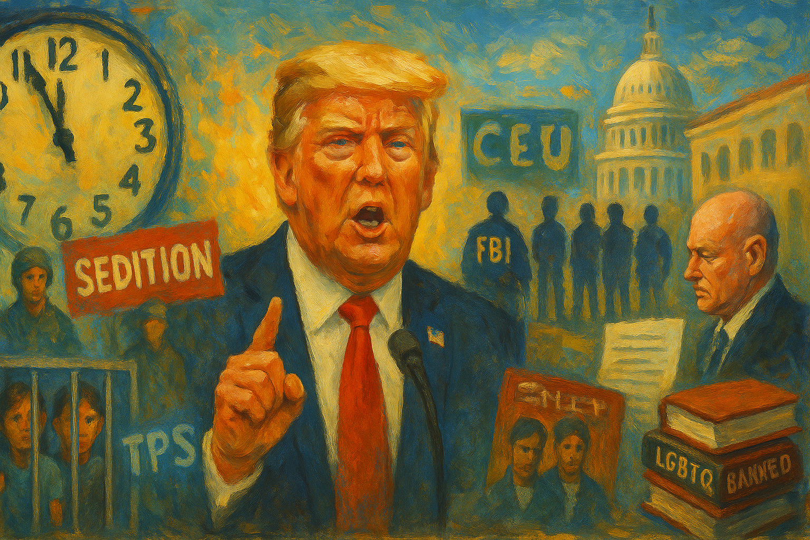

<!-- Generated by build_publish_week_v1 -->
<!-- Header image: image_wide_week45.png -->

# Week 45: Law as Sorting Mechanism

*A week of static clock hands but deepening habits, as law, borders, and information are used to decide who counts and who may speak.*

> The forms of liberty may remain long after the spirit has vanished. — Anonymous observer of fading republics
> Power is most secure when it convinces its subjects that fear is simply the weather. — From a twentieth-century dissident
> The gravest danger is not the single outrage, but the quiet agreement that this is how things are now done. — Contemporary constitutional scholar

The forty-fifth week of Trump’s second term did not hinge on a single shock. It unfolded as a dense layering of moves that pressed on law, borders, information, and memory at once. The pattern was not new, but its confidence was. Law was bent toward enemies and away from friends. Immigration rules and security forces were used to sort who belonged. Data and books and broadcast licenses became levers in the same struggle. The week’s story is less about a fresh descent than about the settling-in of a way of rule.

At the close of the prior period, the Democracy Clock stood at 8:11 p.m. It ended this week at 8:11 p.m., a net change of zero minutes. The stillness in the measure does not mean stasis in the field. It reflects a balance: heavy new damage to the moral floor and institutional independence, offset by pockets of judicial resistance and civil pushback strong enough to keep the hands from moving, but not to reverse course. The week deepened existing grooves rather than cutting new ones.

The clearest line of that groove ran through the treatment of dissent. Six Democratic veteran lawmakers released a video reminding service members of a basic rule: they must refuse unlawful orders. In a healthy system, such a statement would be unremarkable, even expected from those who had worn the uniform. Here it became the trigger for a campaign. Trump denounced the video as “seditious,” called for the lawmakers’ arrest, and suggested their conduct was punishable by death. The language of treason and execution, once reserved for the gravest betrayals, was turned on routine oversight speech.

Institutions followed the cue. At the Pentagon and the newly renamed Department of War, officials opened investigations that could recall Senator Mark Kelly to active duty for court-martial over his role in the video. Military law, designed to govern conduct in uniform, was stretched toward punishing civilian political speech. At the Justice Department, the FBI’s counterterrorism arm opened probes into the six lawmakers, treating their reminder about illegal orders as a potential security threat. The machinery built to track terrorists was pointed at elected representatives. It was a sharp turn.

At the same time, the president used his formal powers to erase consequences for those who had attacked the electoral system on his behalf. He issued a sweeping pardon whose language appeared broad enough to cover many 2020 election-related offenses, signaling that loyalty in that effort could secure immunity. In Georgia, prosecutors and courts dismissed the last racketeering case over Trump’s 2020 interference after the elected district attorney was disqualified. A central avenue for legal reckoning over the attempt to overturn an election simply vanished.

Inside the Justice Department, structure shifted to match these choices. Thousands of lawyers left or were pushed out, especially in civil rights, voting, and public integrity sections. The public integrity unit was reduced to two lawyers and redirected away from corruption cases. Voting-rights enforcement was steered to back maps that favored Republicans and to oppose those that might aid Democrats. The department that once claimed to stand above party was remade to protect the regime and harry its critics. Law became less a limit than a set of tools.

Courts did not move in one direction. A federal judge dismissed prosecutions of James Comey and New York Attorney General Letitia James, finding that the interim U.S. attorney who brought the cases had been appointed illegally. The ruling reaffirmed constitutional appointment rules and blocked a clear attempt to criminalize two of Trump’s long-standing foes. The Eleventh Circuit upheld nearly a million dollars in sanctions against Trump and his lawyer for a frivolous racketeering suit, signaling that at least some benches would not allow their dockets to become weapons. Yet these pockets of resistance stood alongside the Georgia dismissal and other decisions that eased pressure on the president and his allies. The net effect was uneven law: sharp for some, soft for others.

The same week, Trump announced a pardon for former Honduran president Juan Orlando Hernández, convicted in U.S. courts of major drug trafficking. The move cut across years of transnational anti-corruption work and told foreign elites that ties to the White House could outweigh verdicts in American courts. Trump also called for the release of Tina Peters, a Colorado election official convicted for compromising voting equipment in service of his fraud claims, casting her as a whistleblower rather than a saboteur. Those who broke the law on his behalf were recast as victims or heroes.

If law was being repurposed, so too was the presidency’s unilateral reach. Trump moved to cancel all executive orders signed by autopen during the Biden administration and announced plans to void most of his predecessor’s directives. The stated rationale was technical—questioning the use of a mechanical signature—but the effect was sweeping. It asserted a power to retroactively invalidate prior presidential actions on a novel theory, destabilizing legal continuity and signaling that one president’s pen could simply erase another’s work.

This fit into a broader pattern of 2025 executive orders that pushed past traditional limits. Orders challenged the independence of the Federal Reserve, threatened media companies, and prodded courts. They were framed as necessary corrections or urgent responses, but taken together they moved decision-making inward, toward the Oval Office, and away from shared institutions. Management language masked a shift in where power actually sat.

Emergency powers, once meant for rare crises, were drawn into routine policy. The administration invoked a national energy emergency to force Consumers Energy to keep a Michigan coal plant operating despite plans to retire it and state-level objections. The order shifted an estimated $113 million in costs onto regional ratepayers and prolonged local pollution. It treated an aging plant’s profitability and grid role as grounds for overriding state policy, using emergency law to settle what had been a regulatory and economic question.

Abroad, the Office of Legal Counsel issued a memo justifying lethal boat strikes in the Caribbean as collective self-defense that did not require congressional approval. The opinion widened the president’s ability to use force without going to Congress, reading existing authorizations and self-defense doctrines in the broadest possible way. War powers crept outward not through new statutes, but through interpretation. The boundary moved quietly.

Other executive moves filled in the picture. Trump launched the Genesis Mission, centralizing federal AI development and data use under his direction. The project promised efficiency and innovation, but it also concentrated control over powerful analytical tools that could shape surveillance, policy modeling, and information flows. He designated certain Muslim Brotherhood chapters as foreign terrorist organizations, a unilateral step with far-reaching implications for foreign policy, sanctions, and domestic surveillance. He terminated Temporary Protected Status for Myanmar nationals and ordered broad refugee status reviews, making life-altering decisions about legal presence subject to shifting political winds.

Economic policy followed the same unilateral and selective logic. The administration canceled release of the third-quarter GDP advanced estimate, depriving the public and markets of a standard measure of economic performance in the midst of a severe affordability crisis. Reports described nearly ten percent annual price increases and widespread hardship, yet the data that might anchor debate was withheld. At the same time, the White House rolled out a $12 billion bailout for farmers hurt by its own trade policies, socializing the costs of its tariff choices while leaving the underlying strategy intact. Emergency orders and subsidies became tools to reward favored sectors and allies, embedding crony priorities into infrastructure and energy decisions that would be hard to unwind.

Immigration and citizenship policy formed another central strand of the week. At the top level, Trump threatened to de‑naturalize immigrants he deemed “non‑compatible with Western civilization,” suggesting that even citizenship could be stripped based on cultural or ideological judgments. DHS and USCIS expanded asylum case reviews, re‑examined green cards, and halted processing of Afghan residency applications, including for those who had aided U.S. forces. Temporary Protected Status for Myanmar nationals was ended, and TPS for Somalis was placed under review after political pledges to terminate it. Humanitarian protections that had once been relatively stable were recast as contingent favors.

On the ground, enforcement grew harsher and more error-prone. ICE increased detention of immigrant children in federal shelters, often after family separations, using custody practices that deterred migrants from asserting rights or seeking protection. Agents detained a seventeen-year-old U.S. citizen student in Oregon during his lunch break, despite his assertions of citizenship. They detained Bruna Ferreira, a Brazilian mother with deep U.S. family ties, for a visa overstay, and Maher Tarabishi, a longtime resident and caregiver, as a suspected criminal alien despite no record. In another incident, ICE officers detained Native American actor Elaine Miles after deeming her tribal ID fake, blurring the line between tribal sovereignty and immigration enforcement.

Deportation logistics revealed another layer. ICE continued deportation flights under contested contracts while facing a legal challenge from CSI Aviation, underscoring how removal operations were embedded in lucrative private arrangements that could outlast policy shifts. Airport protests, retail boycotts, and consumer campaigns targeted companies profiting from ICE work, showing civil society’s attempt to check coercive practices through market pressure. Yet the flights continued.

Fear was not limited to noncitizens. In North Carolina, masked Border Patrol agents conducted street operations that residents described as kidnappings. People stayed home from work and school. Protests followed, but the immediate effect was to suppress everyday movement and, by extension, political participation. In Georgia, ICE raided a South Korean-owned battery factory, apparently driven by arrest quotas, triggering a diplomatic incident and raising questions about who set enforcement priorities. The spectacle of force served both domestic theater and broader political aims.

In Indiana, the tools of intimidation reached into the legislature itself. As Trump pressed for mid-decade redistricting to secure more GOP-leaning districts, state senator Michael Bohacek publicly opposed the plan, citing Trump’s insults toward people with disabilities. Around the same time, lawmakers reluctant to back the maps were hit with swatting attacks—false emergency calls that sent armed police to their homes. Police became unwitting instruments in a campaign to raise the personal cost of resisting partisan gerrymanders. The message was clear: even core rules of representation would be settled under pressure.

Against this backdrop, lawsuits and rights claims tried to carve out limits. Coalitions of states and the District of Columbia sued to block SNAP eligibility limits for certain legal immigrants and to challenge HUD homelessness program changes that harmed trans and nonbinary people. Chicago faith leaders filed a First Amendment suit over clergy access to detained immigrants, arguing that DHS could not wall off spiritual support. These cases did not stop the broader drift, but they kept alive alternative readings of law and obligation.

Information and memory were contested just as fiercely. The GDP report cancellation was one piece. Another came at the Centers for Disease Control and Prevention, where Health and Human Services Secretary Robert F. Kennedy Jr. directed changes to vaccine–autism web content that ran against scientific consensus. The edits, later acknowledged, politicized core public health messaging and risked eroding trust in evidence-based guidance. National reading and math test results were released, showing large shares of students below basic levels, even as school districts and universities adopted no-zeros grading and dropped standardized tests. The combination produced a strange landscape: stark data on decline alongside policies that made it harder to measure performance honestly.

Media and cultural institutions felt direct pressure. Trump again threatened to have the FCC revoke ABC’s license over unfavorable coverage, despite lacking that authority, continuing a pattern of using regulatory language to intimidate critical outlets. He verbally attacked female reporters during a press conference, adding gendered abuse to the cost of asking hard questions. The FCC, for its part, opened inquiries into how national programmers affect local stations’ public-interest duties and sought comment on E‑Rate paperwork, modest steps that at least acknowledged structural strains on local news and school connectivity.

In entertainment, political pressure led to Jimmy Kimmel’s suspension, prompting millions of Disney and Hulu subscribers to cancel their services in protest. The episode showed how regulatory intimidation could distort media markets, but also how consumers could push back. A poll reported that more than half of Americans would avoid buying Tesla for political reasons, illustrating how corporate political activity fed back into consumer choices and, indirectly, into the distribution of economic and communicative power.

The struggle over memory was even more explicit in Tennessee. Secretary of State Tre Hargett ordered 181 public libraries to review and remove LGBTQ-themed books under anti-DEI and “gender ideology” rules. The directive imposed viewpoint-based censorship on local institutions, erasing certain identities from public collections and signaling that state power would decide which lives could appear on the shelves. In North Carolina, the House Oversight Committee summoned the Chapel Hill School District over pronoun use and DEI policies, using the threat of sanctions to police inclusive practices and pressure educators to suppress support for transgender students.

At the federal level, the State Department moved to exclude universities with DEI hiring from its Diplomacy Lab program, wielding partnership power to shape internal academic policies. Trump met cordially with New York City mayor-elect Zohran Mamdani after earlier threatening to withhold funds if he won, demonstrating how federal resources could be dangled or withdrawn based on local political choices. Together, these moves embedded culture-war enforcement into education and municipal governance, narrowing the space for pluralism.

The week’s foreign-policy and security decisions carried the imprint of outside authoritarian interests and domestic elites. U.S. officials advanced and disputed a 28-point Ukraine peace plan reportedly drafted with Russian input. Conflicting statements and leaks repackaged Russian-authored terms as American proposals, leaving unclear who was actually setting U.S. policy. At the same time, the administration leaked false claims of a completed peace deal, manipulating media narratives and sowing confusion among allies and the public.

The State Department designated Venezuela-linked Cartel de los Soles as a terrorist organization, expanding legal tools for action against Caracas and raising the specter of escalatory moves with limited congressional input. Trump’s order labeling certain Muslim Brotherhood chapters as foreign terrorist organizations similarly widened the scope of unilateral security labeling, with downstream effects on diplomacy, sanctions, and domestic surveillance. These designations, while framed as counterterrorism, also aligned with broader ideological and geopolitical aims.

Private infrastructure sat at the heart of some of these choices. Elon Musk’s company xAI relied on Chinese-made transformers for a military-linked AI supercomputer, exposing supply-chain vulnerabilities in a system underpinning national security. A lawsuit alleged that a Russian-linked subcontractor had breached data center security by photographing and sharing images of the facility. The Genesis Mission’s centralization of federal AI and data under executive control, combined with these private vulnerabilities, created a landscape where foreign and domestic elites could shape both security posture and infrastructure for profit.

Economic hardship formed the backdrop to all of this. Analysts documented rising electricity prices and increased power shutoffs tied to grid upgrades for data centers, showing how infrastructure investment choices shifted costs onto vulnerable households. The affordability crisis deepened, with little in the way of mitigating policy. Public risk was offloaded onto ratepayers and taxpayers, while profits and strategic gains accrued to those closest to power.

Courts, again, offered a mixed picture. A federal appeals court blocked expansion of rapid deportation policy for recent immigrants, affirming due process protections and checking executive overreach in immigration enforcement. A federal court enjoined Texas’s mid-decade congressional redistricting that added GOP-leaning districts, preserving existing lines pending Supreme Court review and slowing a key part of Trump’s plan to lock in House control. The Florida Supreme Court ruled that Marsy’s Law did not automatically grant anonymity to police officers in fatal incidents, strengthening transparency in use-of-force cases, while the Ohio Supreme Court issued split decisions that showed ongoing struggle over the same issue.

Judges also ordered the Justice Department to expedite FOIA processing on Epstein-related records and, together with DOJ, moved to unseal grand jury materials and investigation files. These steps increased public access to information about elite abuse networks, countering secrecy around powerful figures. Yet in North Dakota, the state supreme court reinstated a felony abortion ban with limited and vague exceptions, curtailing reproductive autonomy and aligning with conservative legislative preferences. The dismissal of the Georgia election case, already noted, removed a major path for holding Trump to account. The judiciary remained a site of contest, not a settled bulwark.

Amid these cross-currents, some actors tried to illuminate the landscape. Social media platform X introduced a transparency tool revealing foreign origins of prominent MAGA accounts, shedding light on cross-border influence operations in U.S. politics. The move did not fix the disinformation ecosystem, but it gave users more context about the sources of polarizing content. In a week when the administration itself leaked misleading stories about Ukraine and floated restrictions on speech after Charlie Kirk’s assassination, any added transparency carried weight.

No single scheduled event loomed over the week, but several processes set in motion here were already on the calendar of institutions: pending Supreme Court review of the Texas maps, ongoing state and faith-leader lawsuits over SNAP, HUD, and detention access, and the internal timelines for Genesis Mission build-out and coal-plant emergency implementation. Each would carry forward the choices made in these days into future rulings, budgets, and infrastructures.

Taken together, Week 45 marked not a pause in erosion but a consolidation of method. Executive orders and emergency claims widened unilateral power. Law enforcement and military tools were turned against lawmakers and migrants while pardons and dismissals sheltered allies. Borders and citizenship became instruments for sorting who could live without fear. Data, science, books, and broadcasts were curated to favor the regime’s story. Courts and civil society pushed back in places, enough to hold the Democracy Clock where it was, but not enough to restore ground. The system still bore the forms of democracy, yet using them now demanded more courage and carried greater risk.

<!-- Synopses for cross-posting -->
Long Synopsis: Week 45 of Trump’s second term left the Democracy Clock unmoved at 8:11 p.m., but only because damage and resistance briefly balanced. The administration intensified its use of law and security institutions against opponents, branding a veterans’ video on unlawful orders as “seditious,” unleashing Pentagon and FBI investigations into six Democratic lawmakers, and dangling court-martial for Senator Mark Kelly. At the same time, Trump issued sweeping pardons that likely cover 2020 election crimes, while Georgia courts dismissed the last racketeering case over his interference. Inside the Justice Department, purges hollowed civil-rights and public-integrity work, even as some courts sanctioned Trump for frivolous suits, blocked Texas gerrymanders, and protected due process in deportations. Immigration and citizenship became tools of stratification: TPS terminations, mass status reviews, child detentions, and threats to de‑naturalize “non‑compatible” citizens. Executive orders, emergency powers, and curated information--from coal-plant mandates and lethal boat strikes to canceled GDP data, CDC edits, and LGBTQ book purges--consolidated a method of rule that relies on fear, opacity, and selective protection.
Short Synopsis: The clock stayed at 8:11 p.m. as Trump’s administration deepened habits of rule: weaponizing law and immigration, normalizing emergency powers, and curating information and memory, while courts and civil society mounted uneven resistance.

