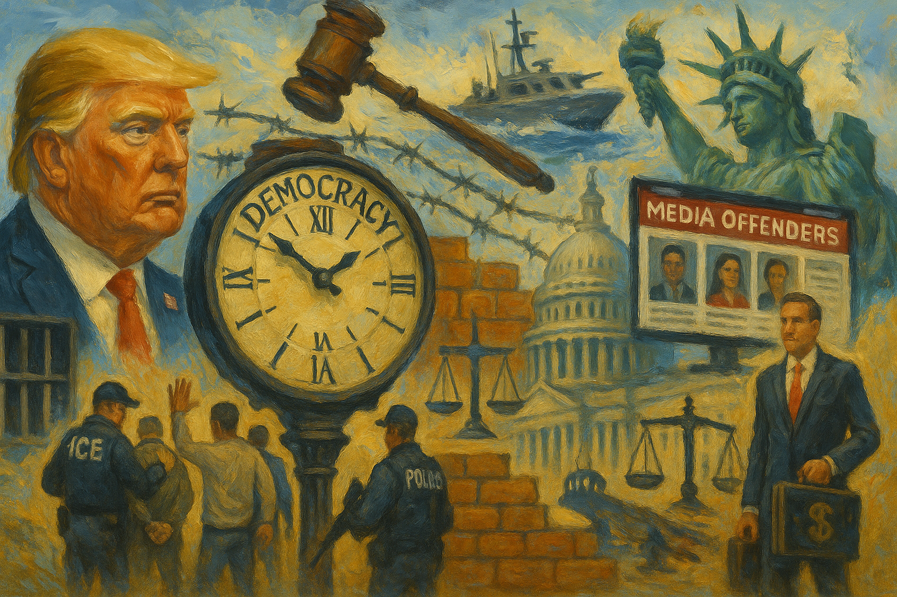

<!-- Generated by build_publish_week_v1 -->
<!-- Header image: image_wide_week46.png -->

# Week 46: Citizenship Frozen, Clemency Weaponized

*Immigration status hardened into a political instrument this week while pardons shielded allies, leaving the Democracy Clock nearly still amid intense pressure.*

The week opened where the last one closed, with government running on the same track. The Democracy Clock had settled at 7:43 p.m., and it stayed there in all but the smallest degree. What moved this week was not the hour but the pressure building behind it. Citizenship, punishment, and mercy blended further into instruments of personal rule. The story of Week 46 is not one of rupture. It is one of accumulation, the kind that rarely announces itself but leaves the ground changed underfoot.

At the close of the previous period, the clock stood at 7:43 p.m. It closed this week at the same time, moving just one-tenth of a minute. The number itself is nearly invisible. But it sits atop fifteen separate trait shifts, several of them large, pointing toward greater concentration of power and greater exclusion of the vulnerable. The clock barely ticked because damage and resistance ran close to even this week. Aggressive executive action pushed on one side. Courts, prosecutors, and congressional committees pushed back on the other, with real if partial effect. The stillness of the hour hides a week that was anything but quiet.

The clearest throughline ran through immigration policy, which hardened from talk into architecture. It began with a president who, after a shooting involving an Afghan national, threatened to strip citizenship from some naturalized Americans and floated halting migration from entire countries. Within days the administration suspended asylum processing and visa issuance for Afghan nationals outright, then extended the freeze to nineteen countries, ordering fresh review of cases already approved. By week's end, the Homeland Security secretary was signaling plans to expand the list past thirty nations. Legal status, for hundreds of thousands of people, became something a president could pause on a whim rather than something secured by settled law.

This was not merely policy. It was narrative. Stephen Miller argued publicly that Afghan immigrants should be judged as a group, not as individuals. The president used slurs about Somali immigrants from the Oval Office, and a Homeland Security spokesperson declined to challenge the remarks, instead repeating unverified fraud claims. A new National Security Strategy echoed language tied to far-right demographic conspiracy theories about Europe. Together these acts built the scaffolding beneath the policy freeze. Citizenship was recast not as a legal status but as a conditional favor, extended or withdrawn by origin and use. The Supreme Court's move to take up the birthright citizenship dispute before lower courts had finished their work signaled that this fight would not stay confined to executive orders. It was headed for constitutional reckoning.

Enforcement matched the rhetoric with bodies on the ground. More than a hundred raids hit Los Angeles car washes. A new operation, dubbed Catahoula Crunch, opened in New Orleans. Minneapolis and St. Paul saw concentrated pressure against Somali residents specifically, following the president's remarks. In New York, protesters blocked ICE vehicles during a Chinatown raid and several were arrested, a small skirmish that captured the larger contest between enforcement and the right to resist it. In Tucson, ICE agents pepper-sprayed demonstrators, among them a sitting member of Congress. In one case that cut through legal process entirely, ICE deported a college student, Any Lucia López Belloza, despite a judge's order temporarily blocking her removal. Court orders, in that moment, proved no match for agency will.

The economic edges of this crackdown showed themselves too. The commerce secretary admitted that mass deportation was suppressing private-sector job numbers, turning enforcement policy into a visible drag on the labor market. Reports of falling sales in Latino neighborhoods, driven by fear rather than law, pointed to the same dynamic reaching into ordinary commerce. Enforcement, once framed as security, was beginning to show its cost in the economy it claimed to protect.

A second major story ran through the presidency's use of clemency. In quick succession, the president pardoned former Honduran president Juan Orlando Hernández, convicted of drug trafficking; commuted the sentence of fraud executive David Gentile; pardoned indicted congressman Henry Cuellar in a foreign bribery case; and pardoned entertainment executive Tim Leiweke, who had faced a corruption indictment from the president's own Justice Department. Reports described the broader pace of pardons and commutations as unprecedented, edging toward routine. What had once been an exceptional constitutional power, reserved for rare acts of mercy, now looked like a standing tool for shielding the connected and the useful from consequence.

The pattern's weight lay less in any single pardon than in their clustering. A foreign leader convicted of trafficking, a sitting congressman facing bribery charges, a corporate executive indicted by the president's own prosecutors: each pardon alone might be defended on its facts. Together they formed a pattern in which proximity to power, not innocence, decided outcome. The message to anyone weighing corruption on the president's behalf was not subtle.

A third development centered on the boat-strike scandal, which widened from a single disputed military action into a multifront fight over oversight and evidence. The Senate Armed Services Committee opened an investigation into the September strikes. House and Senate committees jointly pressed for a classified briefing with the admiral who had ordered them. Former military lawyers, organized as the Former JAGs Working Group, called for prosecution if reports of an unlawful "no survivors" order proved true. The White House press secretary defended the second strike's legality without releasing supporting evidence, while the president and his defense secretary appeared to distance themselves as pressure built.

Then came the inspector general's findings: Hegseth had shared sensitive strike information over Signal, and messages relevant to the incident had been auto-deleted. The reports did not resolve whether war crimes had occurred. But they raised a second concern — that the very record needed to answer the question was disappearing through negligence or convenience. Congress kept pressing. The executive kept explaining. Neither side fully prevailed, and the matter carried unresolved into the following week.

Retaliation against critics formed a fourth pattern, sharper for how directly it touched dissent itself. The FBI opened a counterterrorism investigation into lawmakers who had urged service members to refuse unlawful orders, treating political speech about military obedience as a possible security threat. A broader retaliation campaign against perceived enemies was reported inside the administration. FBI agents and analysts, meanwhile, prepared their own report for Congress criticizing Kash Patel's leadership, describing an agency adrift under politicized command. The Department of Veterans Affairs built a database on noncitizen employees with plans to share it across agencies, pushing surveillance-style tools into ordinary civil-service ranks. Each act alone might pass as security housekeeping. Together they showed investigative power turning inward against critics and vulnerable employees alike.

Information control tightened in parallel. The White House launched an official website cataloging and attacking media outlets by name, turning informal grievance into structured state messaging. The New York Times sued the Pentagon over press-access rules that appeared to favor pro-Trump influencers over traditional reporters. And in a smaller but telling episode, the White House used Sabrina Carpenter's song in an ICE enforcement video without her consent; she objected publicly, and the video came down. The incident showed both the administration's taste for propaganda dressed as popular culture and the real limits it could hit when a public figure pushed back. Access to legitimacy remained contested even as the state tried to claim more of it for itself.

Transparency suffered its own quiet damage. The administration stopped publishing key federal economic indicators, a nationwide cut to the public record used to judge the economy and the effects of policy on it. Steve Witkoff's financial disclosure form stayed unsigned and incomplete past its deadline while he kept serving as a special envoy with active foreign-policy influence. The inspector general's Signal findings, discussed above, doubled as a transparency story: messages that should have documented military decision-making had simply vanished. Each of these acts shrank, in a different domain, the record by which the public or future investigators might hold government to account.

Yet the week was not one-sided. Courts and Congress mounted a real, if uneven, resistance. The Third Circuit upheld the disqualification of Alina Habba as interim U.S. attorney for New Jersey. A federal judge ruled that Lindsey Halligan's appointment as U.S. attorney for the Eastern District of Virginia had been unlawful. Another federal judge blocked widespread warrantless immigration arrests in Washington, D.C., requiring probable-cause documentation going forward. Costco sued the administration over tariffs imposed under emergency powers, testing the statutory limits of that authority in court. In California, a judge questioned the administration's continued control over the state's National Guard, probing the line between federal and state authority over domestic troops.

These rulings did not reverse the week's central movements. They arrived after the fact, answering executive actions that had already reshaped the field. But they mattered nonetheless. Each one affirmed that legal process could still impose real costs on overreach: appointments could be undone, arrests checked, emergency powers challenged in open court. The Supreme Court's decision to hear the birthright citizenship case, and its approval of Texas's contested congressional maps, showed an institution still setting the terms of major disputes, for better and for worse, rather than simply deferring to the executive.

Nothing this week, taken alone, marked a clean break from what preceded it. The pardons extended a pattern already visible in earlier periods. The immigration freezes built on architecture partly constructed before. The retaliation against critics followed contours drawn in prior months. What set Week 46 apart was density: how many of these threads pulled taut in the same seven days, and how narrowly resistance managed to hold its ground against them.

The clock's near-stillness reflects that balance more than it reflects calm. Executive action pushed hard against citizenship, transparency, and dissent. Courts and committees pushed back, unevenly but persistently, often too late to prevent harm but not too late to name it. The period closes without resolution on the boat strikes, without final word on the citizenship case now before the Supreme Court, and without any sign that the pace of pardons or immigration restriction has reached its ceiling. What the week leaves behind is not a verdict. It is a record of how much can shift in seven days while the public clock, for the moment, holds its place.

<!-- Synopses for cross-posting -->
Long Synopsis: Week 46 saw the Democracy Clock move by a mere tenth of a minute, from 7:43 p.m. to 7:43 p.m., masking fifteen significant trait shifts beneath its placid surface. The administration suspended asylum processing and visas for Afghan nationals and eighteen other countries, threatened denaturalization, and floated expanding travel bans past thirty nations, while officials publicly stigmatized Somali and Afghan immigrants. A cluster of pardons for a convicted foreign president, an indicted congressman, a fraud executive, and a corruption defendant deepened concerns that clemency now serves loyalty rather than justice. The boat-strike scandal widened into a records and oversight fight after Hegseth's Signal messages were found auto-deleted. Meanwhile courts and Congress pushed back: disqualifying unlawful U.S. attorney appointments, blocking warrantless arrests, and agreeing to hear the birthright citizenship case.
Short Synopsis: Immigration policy hardened into group-based exclusion, pardons shielded politically connected figures, and a military scandal exposed missing records, while courts and Congress mounted uneven but real resistance—leaving the clock nearly frozen.

