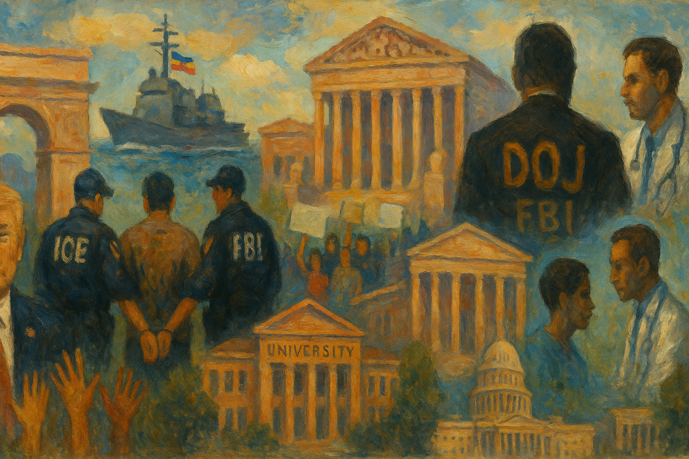

<!-- Generated by build_publish_week_v1 (appendix post) -->
<!-- Header image: image_wide_week48_appendix.png -->

# Week 48 Appendix: Memory As Instrument

*Law, force, and narrative tightened around the presidency, turning immigration, archives, and media into coordinated tools of control rather than constraint.*

This was an acute authoritarian-consolidation week. The Trump administration simultaneously expanded hard power (Venezuela blockade, fentanyl-as-WMD order, travel-ban expansion) and soft control over information, memory, and the civil service. Immigration enforcement and Supreme Court doctrine moved decisively toward racialized, discretionary power, while DOJ and FBI tools were redirected against perceived ideological enemies (anti-ICE activists, former intelligence officials) and away from elite accountability (Epstein files noncompliance, selective grant distribution). Regulatory agencies were aggressively captured or repurposed: EPA weakened carcinogen protections, NCAR dismantling advanced, and billions in university research funding were frozen, even as Trump’s own media company pursued a fusion-energy merger under his regulatory umbrella. Symbolic politics—biased presidential plaques, renaming the Kennedy Center, a triumphal arch—were funded and staged alongside material attacks on healthcare, LGBTQ+ care, and immigrant rights. Congress showed pockets of resistance (ACA subsidy discharge petition, Epstein transparency pressure), and courts occasionally checked executive overreach on immigration bonds and university funding, but these were outweighed by structural moves that entrench executive impunity, politicize the bureaucracy, and normalize emergency-style national security framing for domestic policy.

Power and Authority

1. President Trump oversaw release of a new National Security Strategy reframing immigration and alliances (2025-12-13): The strategy elevated immigration and civilizational conflict as security threats and revived a hard-edged Monroe Doctrine, signaling a more unilateral, identity-driven use of U.S. power abroad.

2. Trump administration froze asylum decisions and halted immigration applications for Afghans and nationals of travel-ban countries (2025-12-13): The freeze abruptly cut off legal pathways for thousands of immigrants and asylum seekers, expanding executive control over who can access U.S. protection and status.

3. President Trump signed an executive order designating illicit fentanyl and its precursors as weapons of mass destruction (2025-12-15): Recasting fentanyl as a WMD allowed national-security and military tools to be deployed in domestic drug enforcement, blurring lines between policing and war powers.

4. President Trump expanded the travel ban to additional African and Middle Eastern countries and Palestinian document holders (2025-12-16): The broader ban further restricted mobility for targeted nationalities and deepened a tiered system of access to the U.S. based on origin and perceived security risk.

5. President Trump ordered a naval blockade of Venezuelan oil tankers and labeled the Maduro government a terrorist organization (2025-12-17): Designating a sovereign state as a terrorist entity and blockading its oil exports escalated U.S. coercive power, stretching terrorism frameworks and risking conflict without clear congressional authorization.

6. President Trump publicly floated the idea of serving a third presidential term and had aides praise it (2025-12-18): By entertaining a third term and amplifying legal arguments that the 22nd Amendment is unclear, the White House normalized discussion of breaching constitutional term limits.

7. President Trump announced a one-time $1,776 "warrior dividend" for service members funded from existing housing allowances (2025-12-18): Repurposing congressionally appropriated housing funds into a branded cash bonus used the military payroll as a political tool while undermining long-term housing support.

8. President Trump signed executive orders reclassifying marijuana and directing expanded cannabis research (2025-12-18): Rescheduling marijuana to facilitate research and easing access for medical uses shifted federal drug policy, modestly reducing criminalization and expanding executive influence over health regulation.

9. President Trump issued an executive order closing federal executive agencies on December 24 and 26, 2025 (2025-12-18): The closure order adjusted federal operations and pay around the holidays, illustrating presidential discretion over basic government service availability.

10. President Trump ordered government-wide adjustments to federal civilian and military pay rates for 2026 (2025-12-18): The pay order reset compensation structures across branches and services, affecting public-sector labor conditions and budget priorities.

11. President Trump issued an executive order setting an expansive national space superiority agenda (2025-12-18): The directive framed space exploration and defense as arenas for U.S. dominance, committing national resources and security policy to long-term strategic projects.

12. Trump administration moved to dismantle the National Center for Atmospheric Research and cancel its grants (2025-12-18): Targeting a major climate research hub for closure weakened federal scientific capacity on weather and climate risks, reducing expert input into policy decisions.

13. Trump administration announced plans to dismantle NCAR and redirect activities citing ideological concerns (2025-12-17): Labeling core climate science work as "woke" and moving to shut it down signaled direct ideological control over which research the federal government supports.

14. Trump administration proposed seizing California land along the southern border for expanded military control (2025-12-19): The proposal to convert state land into federal military zones along the border would extend military authority into civilian areas and override state preferences.

Institutions and Governance

1. House Republican leadership advanced a healthcare plan that omitted extension of enhanced ACA tax credits (2025-12-13): By excluding extended marketplace subsidies, House leaders set up a lapse in support that would raise premiums for millions, using legislative design to reshape access to health coverage.

2. House Speaker Mike Johnson blocked and delayed floor votes on extending ACA premium subsidies despite majority support (2025-12-18): Using procedural control to prevent a vote on widely supported subsidies showed how leadership can thwart majority will on core welfare policy.

3. Bipartisan House coalition used a discharge petition to force a future vote on extending ACA subsidies (2025-12-17): Republicans joining Democrats to trigger a discharge petition demonstrated legislators using rare procedural tools to bypass leadership and secure a vote on health affordability.

4. U.S. Congress enacted the Secure Rural Schools Reauthorization Act of 2025 (2025-12-18): Reauthorizing Secure Rural Schools funding sustained federal support for rural education and infrastructure, reinforcing intergovernmental fiscal ties and local service capacity.

5. U.S. Congress enacted the National Defense Authorization Act for Fiscal Year 2026 (2025-12-18): The NDAA set nearly $901 billion in defense policy and funding, including DEI rollbacks and new oversight demands on boat-strike footage, shaping civil-military relations and accountability.

6. House of Representatives passed a measure to restore federal employee union rights previously curtailed (2025-12-15): The vote sought to reverse an earlier executive rollback of collective bargaining in federal agencies, reasserting legislative support for organized labor in the civil service.

7. Senate Democrats announced they would block civilian nominations until briefed on Epstein files release (2025-12-16): Tying confirmation of nominees to compliance with a transparency law used Senate powers to pressure DOJ to release politically sensitive records.

8. House Oversight Democrats released additional photographs from Jeffrey Epstein’s estate ahead of a DOJ deadline (2025-12-18): Publishing new Epstein materials kept public and political pressure on DOJ to comply with statutory disclosure requirements about elite-linked crimes.

9. Department of Justice released only heavily redacted Epstein files despite a law requiring broad disclosure (2025-12-19): By slow-walking and heavily redacting Epstein records beyond what the statute allows, DOJ appeared to defy a transparency mandate concerning powerful figures’ misconduct.

10. U.S. District Court blocked the administration from withholding funding and imposing fines on the University of California (2025-12-15): The ruling curtailed use of civil-rights investigations as a pretext to coerce universities into ideological changes by threatening massive financial penalties.

11. Federal courts repeatedly ruled against mandatory immigration detention policies that denied bond hearings (2025-12-15): Nationwide decisions requiring bond hearings for many detained immigrants checked executive attempts to impose blanket detention without individualized review.

12. U.S. District Judge Paula Xinis and the Supreme Court ordered Kilmar Ábrego Garcia’s release and directed the government to facilitate his return (2025-12-15): The rulings enforced procedural protections in a contested deportation case, underscoring judicial oversight of immigration enforcement and executive compliance with prior orders.

13. National Trust for Historic Preservation and allied plaintiffs filed lawsuits challenging Trump’s demolition and expansion plans at historic federal buildings (2025-12-15): The suits argued that the president bypassed required review and public input to alter major federal properties, testing legal limits on unilateral changes to shared civic spaces.

14. Department of Justice defended Trump’s White House ballroom project in court on national security grounds (2025-12-17): Invoking security to justify bypassing preservation and public-process requirements blurred the line between legitimate protection needs and shielding presidential building projects from scrutiny.

15. Georgia State Senate special committee investigated District Attorney Fani Willis over her prosecution of Trump (2025-12-17): The inquiry into a local prosecutor handling a former president’s election case highlighted how partisan state bodies can pressure independent legal actors.

16. Congressional Democrats demanded full video and legal justification for U.S. boat strikes in the eastern Pacific (2025-12-17): Lawmakers criticized classified briefings that omitted unedited footage of strikes with civilian casualties, underscoring tensions over transparency and war powers.

17. Senator Andy Kim called for public hearings on Trump’s threatened military actions against Venezuela (2025-12-17): The demand for open hearings sought to subject potential foreign military escalation to democratic debate and congressional oversight.

18. Special Counsel Jack Smith testified to Congress about Trump’s criminal scheme to overturn the 2020 election and sought public release of his deposition (2025-12-18): Smith’s evidence and push for transparency highlighted both the depth of alleged election subversion and congressional reluctance to air the findings publicly.

19. Department of Justice filed a court brief asserting it could lawfully direct federal grants only to Republican-led states (2025-12-18): Arguing that partisan allocation of federal funds is constitutional signaled a willingness to weaponize fiscal tools against disfavored jurisdictions.

20. Supreme Court of the United States issued a ruling effectively legalizing racial profiling in immigration enforcement (2025-12-18): The decision empowered ICE and CBP to conduct aggressive, race-based raids, reshaping constitutional protections for immigrants and communities of color.

21. Wisconsin jury convicted Judge Hannah Dugan of obstruction for helping an immigrant avoid ICE arrest (2025-12-19): The conviction of a sitting judge for actions in her courthouse underscored heightened conflict between local judicial discretion and federal immigration enforcement.

22. Australian Classification Review Board overturned a block on viewing Charlie Kirk shooting footage on social media (2025-12-17): Reclassifying the video as viewable for adults balanced concerns over graphic content with recognition of its political and historical significance.

23. California state government banned legacy admissions at institutions receiving state funds (2025-12-18): Ending preferential treatment for alumni and donor children at publicly supported universities aimed to make admissions more merit-based and equitable.

24. U.S. House of Representatives passed a bill criminalizing gender-affirming care for minors nationwide (2025-12-18): Creating a federal felony for providing gender-affirming care to minors extended congressional power into medical decisions and targeted transgender youth and providers.

25. FCC Chair Brendan Carr told the Senate that the FCC is not independent and aligned it with the administration (2025-12-17): Disavowing agency independence and scrubbing it from the mission statement signaled executive encroachment on a key communications regulator.

26. National Archives and Records Administration solicited public comments on proposed federal records disposition schedules (2025-12-15): Inviting input on which records agencies may destroy or retain gave the public a role in shaping the documentary basis for future accountability.

27. National Archives and Records Administration announced a meeting of the State, Local, Tribal, and Private Sector Policy Advisory Committee on classified information (2025-12-16): The open advisory meeting aimed to coordinate how non-federal entities handle classified information, affecting transparency and security practices across levels of government.

Economic Structure

1. Prairie Band Potawatomi Nation’s KPB Services signed and then moved to exit a major ICE detention facility design contract (2025-12-13): The $29.9 million contract illustrated how federal detention infrastructure is outsourced, while tribal backlash highlighted ethical and sovereignty concerns around profiting from immigration enforcement.

2. Trump administration prioritized building a triumphal arch in Washington DC as a signature domestic project (2025-12-14): Focusing federal attention on a monumental arch amid affordability and health crises showed public resources being steered toward symbolic glorification over pressing social needs.

3. Trump administration advanced a healthcare bill incentivizing AI in rural hospitals while cutting Medicaid by an estimated $911 billion (2025-12-14): Pairing tech incentives with deep Medicaid reductions restructured health financing in ways likely to reduce care for low-income and rural patients.

4. Trump administration proposed major cuts to Alaska’s High Intensity Drug Trafficking Area funding (2025-12-15): Reducing HIDTA support risked weakening coordinated drug enforcement and overdose prevention capacity in a high-need region.

5. Environmental Protection Agency proposed nearly doubling the formaldehyde exposure level deemed safe (2025-12-15): Relaxing formaldehyde risk thresholds after industry lobbying would ease regulatory burdens on polluters while increasing potential cancer risks for the public.

6. Department of Veterans Affairs announced plans to cut up to 35,000 healthcare positions (2025-12-15): Shrinking the VA workforce by about 10% shifted care away from public provision toward private options, potentially reducing access and continuity for veterans.

7. Stephen Miller sold MP Materials stock shortly after a favorable administration deal boosted its price (2025-12-14): The well-timed sale raised conflict-of-interest concerns about senior officials potentially profiting from policy decisions affecting specific companies.

8. President Trump pressed the Federal Reserve to cut interest rates further to boost asset values (2025-12-14): Political pressure for looser monetary policy risked higher inflation while benefiting holders of financial assets, including the president’s family.

9. Federal Communications Commission permanently debarred Q Link Wireless and Issa Asad from Lifeline and universal service programs (2025-12-15): Removing entities convicted of fraud from subsidy programs aimed to protect public funds and maintain integrity in communications assistance for low-income users.

10. Federal Communications Commission rescinded a prior cybersecurity rulemaking and emphasized collaboration with carriers (2025-12-15): Rolling back a misinterpreted cybersecurity initiative shifted the FCC toward a more voluntary, industry-friendly approach to protecting communications networks.

11. Federal Communications Commission sought extensive public comment on multiple information collections and wireless siting policies (2025-12-15): The FCC’s paperwork and siting notices affected how broadcasters, telecoms, and localities document compliance and expand broadband infrastructure.

12. Centers for Disease Control and Prevention submitted and sought comment on several information collection requests and overdose data projects (2025-12-15): CDC’s PRA submissions on formative research, project monitoring, and overdose data shaped how health agencies gather evidence to guide interventions.

13. Environmental Protection Agency released and sought comment on multiple pesticide risk assessments, registrations, and tolerances (2025-12-15): EPA’s actions on metrafenone, unregistered pesticide exports, new active ingredients, and crop uses governed how agricultural chemicals enter markets and affect health and ecosystems.

14. Drug Enforcement Administration extended Schedule I status for four synthetic cannabinoids and processed new controlled-substance import and manufacturing applications (2025-12-16): Maintaining strict controls on certain synthetics while reviewing new importers and manufacturers shaped the legal drug supply chain and research environment.

15. Food and Drug Administration issued multiple guidances and determinations on drug and device safety reporting, recalls, and approvals (2025-12-16): Updated FDA guidance on clinical safety reporting, cosmetics recalls, real-world evidence, and specific products refined regulatory expectations and pathways for industry.

16. General Services Administration aligned Federal Management Regulation and acquisition reporting rules with deregulatory priorities (2025-12-16): Streamlining management and transactional data reporting requirements altered how federal property and contracting are overseen, potentially reducing transparency burdens and some safeguards.

17. Occupational Safety and Health Administration extended OMB approvals for multiple workplace safety information collections (2025-12-17): Renewing data requirements for fall protection, cranes, manlifts, silica, and butadiene standards maintained reporting obligations that underpin enforcement of worker safety rules.

18. Federal Communications Commission launched a new computer matching program to verify Lifeline and ACP eligibility (2025-12-17): Automated cross-checks with state benefit data aimed to reduce fraud and ensure that communications subsidies reach eligible low-income households.

19. Environmental Protection Agency approved Arizona’s PM2.5 air quality plan and delegated enforcement authority to Louisiana and Oklahoma (2025-12-18): Approving state plans and delegations shifted day-to-day enforcement of federal air standards to state agencies, affecting local control and capacity.

20. Federal Communications Commission held an open meeting to update robocall, low-power TV, and obsolete rules (2025-12-18): The agenda targeted consumer protection from robocalls, clarified broadcaster obligations, and removed outdated regulations, adjusting the communications regulatory landscape.

21. Office of Federal Procurement Policy and partner agencies sought comment on contract audit and foreign-purchase reporting requirements (2025-12-18): Extending data collections on contract records and foreign sourcing supported oversight of procurement integrity and compliance with Buy American and trade rules.

22. Michigan Public Service Commission and DTE Energy entered a regulatory fight over fast-tracking approval of a large data center project (2025-12-18): DTE’s request for an ex parte approval and the attorney general’s push for a contested case highlighted tensions between corporate development, ratepayer protection, and climate law compliance.

23. Trump administration froze billions in federal research funding for universities (2025-12-18): Halting research grants as part of an ideological higher-education agenda threatened universities’ financial stability and their role in independent knowledge production.

24. President Trump announced a new drug pricing program branded "Trump RX.gov" (2025-12-18): The initiative promised lower drug prices but lacked clear mechanisms, using presidential branding to claim credit for prospective cost relief.

25. Trump Media & Technology Group announced a multibillion-dollar merger with a speculative fusion energy company (2025-12-18): Merging the president’s media firm with an energy venture dependent on federal approvals raised acute conflict-of-interest concerns about policy being used to enrich a sitting leader.

26. U.S. Census Bureau sought comment on revisions to the American Community Survey and Puerto Rico Community Survey (2025-12-19): Updating ACS and PRCS methods, including online response and race/ethnicity questions, will influence demographic data that underpins representation and funding decisions.

27. Environmental Protection Agency published notices of availability for several major environmental impact statements (2025-12-19): Making EIS documents available for projects like pipeline crossings and military training informed public and stakeholder engagement on large federal actions.

28. Federal Communications Commission modified TV allotments by moving a channel from Fort Bragg to Cloverdale, California (2025-12-19): Reassigning a broadcast channel altered local media markets and access to over-the-air television service in affected communities.

29. Food and Drug Administration announced OMB approval of multiple information collections across drug, device, and food programs (2025-12-19): Maintaining these data collections ensured continued regulatory oversight of safety and compliance in several health-related industries.

30. Trump administration misrepresented inflation data that used shutdown-driven placeholders to claim housing costs were flat (2025-12-18): Citing artificially zeroed housing components as proof of no inflation distorted economic reality and undermined trust in official statistics.

31. Trump Media & Technology Group announced another merger with a fusion energy company, spiking its stock despite weak fundamentals (2025-12-19): The deal, reliant on Department of Energy decisions, highlighted how presidential business ventures can intersect with regulatory power and market speculation.

32. Indian government implemented sweeping labor law reforms to increase flexibility and social protections (2025-12-18): Consolidating labor statutes, easing hiring and firing, and expanding safety and social security aimed to attract investment while reshaping worker protections.

33. Indian government passed a financial reform package allowing full foreign ownership of insurance firms and overhauling capital markets (2025-12-18): The reforms sought to channel domestic savings into productive investment and deepen financial markets as part of a long-term growth strategy.

34. Japanese government set ambitious FDI targets and created institutions to attract high-tech investment (2025-12-17): Japan’s FDI council, sectoral subsidies, and outreach to semiconductor and AI firms aimed to revitalize its industrial base and technological capacity.

35. Albanian legislature changed law to allow development on protected Sazan Island for a Kushner resort project (2025-12-17): Granting "strategic investor" status to Kushner’s firm to build in a protected area showed how private foreign interests can drive legal changes with environmental and EU-accession implications.

36. Affinity Partners and Serbian authorities abandoned a Trump Tower Belgrade redevelopment amid a corruption scandal (2025-12-17): The collapse of a project tied to forged cultural-protection documents exposed risks when politically connected investors pursue deals involving heritage sites.

37. Trump administration imposed tariffs that significantly raised costs for small U.S. manufacturers (2025-12-17): Tariff-driven input cost increases forced firms to absorb losses and delay hiring, undercutting stated goals of reshoring while harming local economies.

38. U.S. labor market lost approximately 41,000 jobs over two months (2025-12-15): The reported job losses signaled emerging economic weakness that could strain public finances and social safety nets.

39. Tricolor Holdings executives were charged with large-scale fraud in subprime auto lending (2025-12-17): The alleged billion-dollar scheme involving falsified loan data and double-pledged collateral highlighted vulnerabilities in financial oversight and consumer finance.

40. Dollar General and Family Dollar faced a congressional inquiry over widespread price discrepancies and forced arbitration (2025-12-19): Lawmakers’ demand for internal documents on shelf-versus-register pricing and arbitration practices targeted potential exploitation of low-income shoppers.

41. DTE Energy sought expedited, ex parte approval for a Michigan data center project (2025-12-18): The utility’s attempt to limit regulatory scrutiny over rate and climate impacts prompted legal pushback, illustrating conflicts between corporate timelines and public review.

Civil Rights and Dissent

1. Immigration and Customs Enforcement apprehended and detained U.S. citizens and demanded they carry immigration papers (2025-12-14): Detaining citizens and treating them as undocumented blurred legal distinctions in enforcement, undermining civil liberties and equal protection.

2. Immigration and Customs Enforcement stopped Representative Ilhan Omar’s son during a targeted operation against Somali communities (2025-12-15): The stop, part of "Operation Metro Surge," raised concerns about racial profiling and the use of federal power to intimidate a minority community and its elected representative.

3. Hilda Ramirez Sanan filed a lawsuit alleging violent, warrantless detention by ICE agents (2025-12-15): Claims that officers shattered car windows and seized a lawful resident and her citizen children without identifying themselves spotlighted alleged abuses in immigration enforcement.

4. Bucks County voters elected Danny Ceisler sheriff on a platform of ending a 287(g) partnership with ICE (2025-12-15): Replacing a sheriff who had deputized local officers as immigration agents signaled local resistance to entangling county policing with federal deportation efforts.

5. Department of Homeland Security launched an "ARRESTED: WORST OF THE WORST" website spotlighting alleged criminal "illegal aliens" (2025-12-15): The site selectively highlighted extreme cases while ICE data show most detainees lack criminal records, stoking fear and dehumanizing immigrants.

6. Cities and advocacy groups across the U.S. coordinated grassroots efforts to resist ICE raids and educate residents on their rights (2025-12-16): Know-your-rights trainings, whistle distribution, and cross-city organizing aimed to protect immigrant communities from aggressive federal enforcement.

7. Durham City Council declared Durham a "Fourth Amendment workplace" requiring warrants for certain enforcement entries (2025-12-17): The resolution sought to shield workers and immigrants from warrantless ICE intrusions into private spaces, reinforcing local constitutional protections.

8. Immigration and Customs Enforcement doubled arrests in North Carolina as part of a statewide campaign (2025-12-17): The surge in arrests, often by agents in tactical gear in public spaces, heightened fear in Latino communities and strained trust in law enforcement.

9. Federal prosecutors in Texas charged 18 anti-ICE protesters as a terrorism cell after a detention center protest (2025-12-18): Using terrorism statutes against demonstrators at an ICE facility risked criminalizing protest and chilling dissent around immigration policy.

10. American Civil Liberties Union of Minnesota sued DHS over alleged rights violations during ICE raids and protests (2025-12-18): The suit claimed federal agents targeted observers and protesters, raising questions about retaliation against those documenting enforcement actions.

11. Federal Bureau of Investigation opened domestic terrorism investigations into anti-ICE activity in at least 23 regions (2025-12-19): Framing anti-fascist and anti-ICE organizing as potential terrorism under a Trump directive risked treating political opposition as a security threat.

12. National Immigrant Justice Center and partners challenged a CBP advisal pressuring unaccompanied children to self-deport (2025-12-19): The lawsuit argued that threatening prolonged detention and sponsor prosecution coerced vulnerable minors into abandoning legal protections.

13. Department of Defense’s TRICARE program finalized a policy excluding hormone therapy for gender dysphoria in minors (2025-12-18): The exclusion removed coverage for transgender dependents in military families, narrowing healthcare rights for a vulnerable group tied to federal service.

14. House of Representatives passed a bill making gender-affirming care for minors a federal felony (2025-12-18): Criminalizing providers of gender-affirming care nationwide would sharply restrict medical autonomy for transgender youth and their families.

15. Department of Defense and Congress linked TRICARE’s exclusion of gender dysphoria care for minors to NDAA and executive actions (2025-12-19): Embedding coverage limits for transgender dependents in defense policy intertwined civil rights restrictions with core military legislation.

16. National Union of the Homeless and allies organized Longest Night vigils to honor people who died from poverty (2025-12-19): The vigils used public space and ritual to highlight homelessness and economic injustice, pressing for policy attention to basic social rights.

17. Indivisible and allied activists encouraged primary challenges to Democratic incumbents seen as too corporate or weak against Trump (2025-12-19): The campaign sought to use intra-party elections to increase accountability and ensure representatives more strongly defend democratic norms.

18. National Union of the Homeless (Durham chapter) called for community participation in vigils and delegations on homelessness and poverty (2025-12-19): Mobilizing residents to confront local officials about poverty aimed to translate remembrance into political pressure for policy change.

19. Department of Justice charged a Texas "antifa cell" with terrorism after a protest at an ICE detention center (2025-12-18): Applying terrorism charges to a protest that included fireworks and an officer’s shooting blurred lines between political activism and terrorism in federal law.

20. Federal and local law enforcement conducted aggressive immigration operations in Chicago neighborhoods using chemical agents (2025-12-17): Video of officials mocking residents and using force in immigrant communities underscored the intimidating nature of some enforcement tactics.

21. Federal agents and prosecutors pursued terrorism and domestic-terror investigations tied to anti-ICE activity nationwide (2025-12-19): The combined use of terrorism frameworks and domestic-terror probes against immigration-related dissent risked normalizing extraordinary charges for protest.

Information, Memory and Manipulation

1. White House and President Trump installed partisan plaques under presidential portraits and removed Biden’s image in favor of an autopen (2025-12-17): Rewriting descriptions of recent presidents inside the White House and symbolically erasing Biden recast official history to reflect Trump’s personal narrative.

2. Trump-appointed Kennedy Center board voted to rename the Kennedy Center after Trump despite lacking congressional authority (2025-12-17): Attempting to rebrand a national cultural memorial without proper approval used institutional naming to elevate the sitting president’s legacy.

3. President Trump attacked Rob Reiner posthumously and politicized his murder on social media (2025-12-16): Using a critic’s death to mock "Trump derangement syndrome" and score political points degraded public discourse and framed dissent as pathological.

4. Robert F. Kennedy Jr. as HHS Secretary spread false claims about the measles vaccine and removed CDC language debunking vaccine-autism links (2025-12-14): Official anti-vaccine messaging and alteration of CDC content undermined scientific consensus and contributed to a measles epidemic.

5. RFK Jr. as HHS Secretary replaced all voting members of the CDC’s vaccine advisory committee with anti-vaccine advocates and appointed a non-expert acting CDC head (2025-12-15): Stacking key public health bodies with skeptics of vaccines politicized expert advice and threatened evidence-based immunization policy.

6. Centers for Disease Control and Prevention ended its recommendation that all U.S. newborns receive the hepatitis B vaccine at birth (2025-12-17): Shifting from universal to selective newborn vaccination, under an RFK Jr.-influenced panel, risked higher hepatitis B transmission and reflected politicized health guidance.

7. Department of Homeland Security launched a sensational "ARRESTED: WORST OF THE WORST" immigration website promoted by the White House (2025-12-15): Highlighting extreme immigrant crimes while omitting context from ICE data used selective information to portray immigrants as broadly dangerous.

8. Trump administration misrepresented inflation statistics that used shutdown placeholders to claim zero housing inflation (2025-12-18): Citing distorted CPI components as evidence of economic success weaponized official data to mislead the public about cost-of-living pressures.

9. ABC News settled a defamation lawsuit with Trump by paying his library and legal fees (2025-12-18): The sizable settlement over a relatively weak claim suggested major media outlets may capitulate to legal pressure from powerful political figures.

10. CBS and Paramount/Skydance settled a Trump lawsuit and restructured CBS News leadership with pro-Trump and anti-woke figures (2025-12-18): The settlement and subsequent appointments of a pro-Trump ombudsman and Bari Weiss as editor-in-chief raised concerns about political influence over editorial independence.

11. Major broadcast networks aired a highly partisan Trump primetime address despite past refusals for similar Democratic speeches (2025-12-18): Breaking precedent to carry an overtly political presidential speech suggested asymmetric media deference that can shape public narratives.

12. Department of Justice failed to fully comply with the Epstein Files Transparency Act and heavily redacted released documents (2025-12-19): Partial, delayed, and redacted releases of Epstein records limited public understanding of elite abuse networks and signaled resistance to statutory transparency.

13. Federal Communications Commission sought comment on Wireless Emergency Alerts performance and corrected multilingual alert rule timelines (2025-12-18): Evaluating and clarifying WEA data collection and implementation schedules affected how accurately and equitably emergency information reaches the public.

14. NC Representative Brenden Jones held a confrontational school board session mischaracterizing children’s books as part of political theater (2025-12-19): Using false claims about school library content to attack local officials exemplified culture-war tactics that distort educational debates.

15. Alliance Defending Freedom International expanded global spending on litigation and campaigns promoting conservative Christian legal agendas (2025-12-19): Increased funding for cross-border cases aimed to reshape laws on religious freedom, LGBTQ+ rights, and gender norms beyond U.S. borders.

16. Food and Drug Administration opened comment on cigarette warning label information collection (2025-12-19): Reviewing data needs for graphic cigarette warnings affected how strongly public health messages about smoking risks are communicated.

17. Federal Bureau of Investigation Director Kash Patel prematurely announced detention of a Brown University shooting suspect on social media (2025-12-17): The erroneous announcement, later reversed, damaged investigative credibility and highlighted risks when law enforcement communicates unverified claims.

18. President Trump used social media to blame Rob Reiner’s death on his opposition to Trump (2025-12-15): Politicizing a private tragedy to attack a critic further blurred boundaries between personal grief and partisan messaging.

19. Federal Communications Commission held an open meeting to strengthen robocall rules and update broadcasting regulations (2025-12-18): Actions to curb robocalls and modernize low-power TV rules affected how citizens receive and trust communications from both private and public sources.

