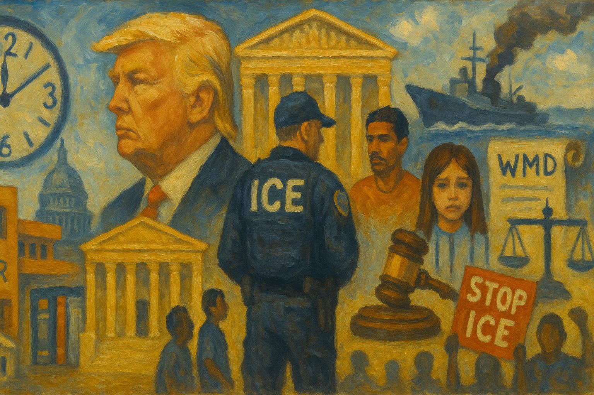

<!-- Generated by build_publish_week_v1 -->
<!-- Header image: image_wide_week48.png -->

# Week 48: The Quiet Accumulation of Control

*Immigration crackdowns, executive claims over agencies, and symbolic self-glorification deepened together in a week without a single defining rupture.*

The week did not announce itself with a single rupture. It arrived instead as a long accumulation of small, deliberate acts, each defensible alone, each part of a pattern once placed beside the others. Immigration enforcement widened. Executive claims over independent agencies hardened. Congress pressed for records it did not receive. Public memory bent toward one man's image. None of this required a crisis. It only required time, and a government willing to use it.

At the close of last week, the Democracy Clock stood at 7:43 p.m. It closes this week at the same public time, 7:43 p.m., though the underlying measure shifted by one tenth of a minute. That is a movement too small to change the displayed hour, but large enough to register. The stillness on the clock face hides real motion beneath it. This was not a week of retreat. It was a week of deepening pressure, consolidation rather than a leap. The traits that moved did so by modest degrees, spread across many domains rather than concentrated in one.

Immigration policy carried the heaviest weight of the week. The administration expanded its travel ban to new countries and to Palestinian Authority travel documents. At the same time, it froze asylum decisions and immigration applications for Afghans and nationals from banned countries. These were not adjustments at the margins. They removed legal pathways for people already in the queue, deepening a system that treats belonging as conditional on origin. The freeze reached backward, too. Officials pushed to reopen immigration cases that judges had already paused, raising deportation risk for people who believed their status was settled.

The consequences showed up on the ground within days. ICE detained citizens and green-card holders and demanded proof of citizenship, including a stop involving the son of a sitting member of Congress. A green-card holder sued over what she described as a violent assault by agents. Twenty-two Cuban immigrants were transferred to Guantánamo Bay, extending offshore detention to a new population. In North Carolina and Chicago, arrests doubled and tactical patrols intensified. Fear spread through immigrant neighborhoods far from any specific enforcement target. Border officials pressed unaccompanied children with documents warning of detention and consequences for their sponsors if they did not agree to return home. Each event, alone, might read as an isolated excess. Together, they described a system reaching past its stated purpose and into the daily lives of citizens and children alike.

Some of this pressure met resistance. Federal courts kept blocking a policy that denied bond hearings to many detained immigrants. A judge barred ICE from rearresting Kilmar Abrego Garcia pending a hearing, after the Supreme Court had already ordered the government to facilitate his return. A separate ruling lifted limits on when lawmakers could visit ICE facilities, protecting oversight access the administration had tried to slow with a seven-day notice rule. Voters in Bucks County elected a sheriff who ran on ending the county's ICE partnership. Cities organized mutual aid networks to help each other prepare for raids. None of this reversed the week's direction. It showed, instead, that the machinery of checks had not gone silent, even as the pressure against it grew heavier.

The line between enforcement and punishment for opposing it blurred further as the week went on. Eighteen people connected to a protest at the Prairieland detention center were charged with terrorism-related offenses. The FBI opened domestic-terrorism investigations into anti-ICE activity across at least twenty-three regions of the country. Representative LaMonica McIver was charged with interfering in an immigration arrest during what she described as an oversight visit, a charge she said was meant to make an example of her. Protest, oversight, and journalism began to look, in official framing, less like democratic activity and more like security threats. That reframing did not arrive as a single decree. It arrived case by case, each one adding weight to the next.

Executive claims to unilateral authority found their clearest form in a fentanyl executive order. It formally designated the drug a weapon of mass destruction and authorized intelligence and Pentagon support for domestic drug enforcement. Whatever the merits of the underlying policy, the order pulled national-security logic into an area of ordinary law enforcement. Emergency powers are being used as permanent tools rather than temporary responses. Days later, the FCC's own chair told the Senate that his agency was not independent, and the agency quietly dropped that word from its public identity. A body created by Congress to sit apart from partisan control now described itself, in its own chair's words, as answering to the White House. Separately, the White House said the country would be lucky if the president stayed for a third term. That language treats the twenty-second amendment as a subject open to negotiation rather than settled law.

Congress tried, with mixed success, to reclaim visibility into executive conduct. The Senate passed a nine-hundred-billion-dollar defense bill requiring release of boat-strike footage, a demand born from months of frustration over the Pentagon's silence on lethal strikes at sea. Yet defense officials confirmed they would not release the full video, even after briefing lawmakers. Jack Smith testified before the House Judiciary Committee that his team had developed proof beyond a reasonable doubt of a criminal scheme to overturn the 2020 election. He added his account to the public record even as House Republicans sought to limit his testimony to closed session. The Department of Justice released only part of the Epstein files despite a statutory deadline requiring broader disclosure, briefly removing a photograph connecting Trump to the case before restoring it. In each instance, transparency law existed. Compliance did not follow automatically. It followed pressure, delay, and partial concession.

Truth itself absorbed steady damage. The president wrongly claimed a Brown University shooting suspect was in custody, then walked it back amid a chaotic and shifting official account. He repeated unsupported claims that California's 2024 election results were rigged. He delivered a primetime address filled with false claims about the economy and immigration, misrepresenting inflation data distorted by a government shutdown's placeholder housing figures. None of these falsehoods required new machinery. They used old tools, applied more often, with less friction than before.

Memory and symbolism absorbed a parallel pressure. White House officials installed partisan plaques and altered presidential portraits inside the building itself, rewriting the physical record of who had occupied the office and how. Allies at the Kennedy Center moved to rename the institution for Trump without clear congressional authority, an attempt to fold a national cultural memorial into one man's personal brand. The president announced that building a triumphal arch in Washington would be a top domestic priority. Meanwhile the Justice Department defended a four-hundred-million-dollar White House ballroom project on national-security grounds. These were not hidden acts. They were public, even celebratory: a use of state resources and state spaces to press a single figure's image into the fabric of national memory.

Institutional capacity eroded in quieter ways. The administration restricted top performance ratings for federal workers across agencies, a tool that weakens merit protections and creates new grounds for future demotions or purges. Robert F. Kennedy Jr. installed anti-vaccine activists on a vaccine advisory panel and placed a non-expert in an acting role atop the CDC. The agency ended its guidance recommending hepatitis B vaccination for all newborns within a day of birth. The administration announced plans to dismantle the National Center for Atmospheric Research, paused new NIH grants tied to health equity and structural racism, and canceled grants to the American Academy of Pediatrics. The EPA proposed nearly doubling the amount of formaldehyde considered safe to inhale, a change reportedly shaped by chemical-industry input. The General Services Administration issued a rule further aligning federal property management with deregulatory goals. None of these actions carried the drama of a single firing or a single scandal. Together, they described a slow narrowing of expertise inside the machinery meant to protect public health and safety.

Contracting and personal enrichment moved along a parallel track. The Department of Homeland Security fast-tracked a nearly billion-dollar contract to a company with donor ties. Stephen Miller sold stock after a government deal boosted its value. A politically connected contractor with experience running a controversial detention facility reportedly held an inside track on postwar reconstruction planning in Gaza. Trump Media announced a multibillion-dollar merger with a fusion energy company, raising conflict-of-interest questions for a sitting president's business interests. None of these deals broke new legal ground. They simply extended a pattern in which nearness to power kept turning into financial advantage, with little separating governance from personal gain.

Universities felt a version of the same pressure applied to a different sector. The administration froze billions in federal research funding, using money as leverage over campus policy. A federal judge blocked an earlier attempt to withhold University of California funding on similar grounds. The court's intervention limited the immediate effect, but the underlying strategy remained visible: federal dollars used not to fund research, but to discipline institutions seen as insufficiently compliant.

Civil courts, too, became an instrument of pressure rather than a neutral forum. The president filed a ten-billion-dollar lawsuit against the BBC over a documentary's editing of his January 6 speech, a filing whose scale suggested intimidation as much as legal remedy. He publicly demanded the January 6 committee pay a very steep price, and turned the death of Rob Reiner into a partisan attack rather than an occasion for restraint. Colorado's governor was baselessly accused over the case of Tina Peters. In each instance, disagreement was treated less as a normal feature of democratic life and more as evidence of corruption or disloyalty.

Several matters remained pending as the week closed. The Department of Justice had committed to further disclosure under the Epstein Files Transparency Act, having missed its full deadline. Congressional Democrats said they would keep blocking civilian nominations until briefed further on that release. Jack Smith's closed-door testimony to House Republicans remained a subject of ongoing dispute over whether it should instead be made public.

This week did not mark a turning point so much as a deepening of grooves already worn into the system. Executive claims over independent agencies, quiet damage to civil-service protections, pressure on universities and the press, and a widening definition of dissent as security threat all moved forward together. None stood in isolation. None reversed. Courts and some local officials still pushed back, and Congress still found narrow paths to disclosure, proof that the machinery of accountability had not gone still. But the balance of effort kept running one direction. The period closes not with rupture, but with the quiet, cumulative confidence of a government that has learned how much can be done without ever needing to call it extraordinary.

<!-- Synopses for cross-posting -->
Long Synopsis: This week brought no single crisis, only accumulation. The administration widened its travel ban, froze asylum decisions for Afghans and banned-country nationals, and pushed to reopen paused immigration cases. ICE detained citizens and green-card holders, transferred Cuban immigrants to Guantánamo, and pressured unaccompanied children toward self-deportation. Eighteen protesters faced terrorism charges; the FBI opened domestic-terrorism probes into anti-ICE activity nationwide. The FCC's chair said his agency wasn't independent. The White House floated a third Trump term. A fentanyl executive order extended national-security logic into ordinary enforcement. Congress won partial disclosures on boat-strike footage and Epstein files but met resistance throughout. Courts blocked some detention policies and protected oversight access. White House portraits and plaques rewrote presidential memory. The Democracy Clock held at 7:43 p.m., its underlying measure shifting only a tenth of a minute—stillness masking real, distributed pressure.
Short Synopsis: Immigration enforcement widened, executive claims over independent agencies hardened, and public memory bent toward one man's image. Courts and Congress pushed back in narrow ways, but the week's cumulative weight moved steadily in one direction without needing a single dramatic rupture.

