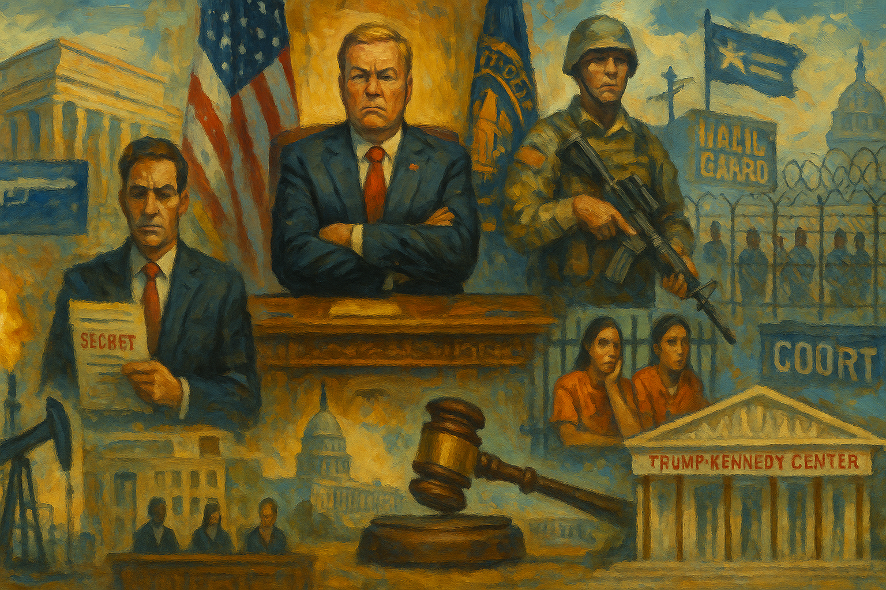

<!-- Generated by build_publish_week_v1 (appendix post) -->
<!-- Header image: image_wide_week49_appendix.png -->

# Week 49 Appendix: The Week Power Moved Quietly

*A near-motionless clock concealed eighteen structural shifts toward erosion, driven by delayed disclosure, expanded detention, and legal process turned political.*

This was a high-pressure week centered on executive opacity, politicized law enforcement, and the use of state machinery to manage information while escalating coercive immigration governance. The dominant pattern was the Justice Department’s handling of the Epstein files: missed legal deadlines, selective release, unexplained removals, heavy redactions, and evidence of White House influence over DOJ communications together created unusually strong pressure on transparency, equal justice, archival integrity, and the idea that law constrains power. A second major theme was the expansion and normalization of immigration enforcement as a governing system, including massive new detention infrastructure, record ICE detention levels, threats to states, holiday propaganda, and continued military-adjacent deployments. Courts and some legislators did provide meaningful checks—especially Supreme Court and lower-court rulings blocking Guard deployments and coercive funding cuts, plus congressional efforts to compel disclosure—but these were mostly defensive interventions against a larger pattern of executive overreach, politicization, and institutional degradation.

Power and Authority

1. The Trump administration canceled offshore wind funding and suspended five offshore wind projects (2025-12-20): The move used executive power to halt major clean-energy projects, overriding prior investment plans and weakening predictable, accountable administration of public policy.

2. The Trump administration terminated a $7 billion solar program for low-income communities (2025-12-20) *[single source]*: Ending the program cut public support for energy access in poorer communities and showed executive control over who receives federal benefits.

3. The Trump administration blocked California's ban on new gas-powered car sales (2025-12-20): The action used federal power to override a state's policy choice, testing state autonomy and federal limits in environmental rulemaking.

4. The Trump administration directed attacks on small boats from Venezuela (2025-12-20): The directive expanded executive use of lethal force in a migration and cartel context, raising rule-of-law concerns over military power and legal authority.

5. The Trump administration announced a $170 billion expansion of immigration enforcement infrastructure (2025-12-22): The plan greatly expanded detention and deportation capacity, increasing the state's coercive reach over migrants through executive action.

6. Transportation Secretary Sean Duffy threatened to withhold federal funds from states issuing driver's licenses to non-citizens (2025-12-22): The threat used federal money as leverage to pressure state policy, testing limits on coercive executive influence over state governments.

7. The Department of Veterans Affairs ended abortion and abortion counseling services and allowed staff opt-outs (2025-12-22) *[single source]*: The policy narrowed access to care for veterans and used executive authority to reshape bodily autonomy and equal treatment in public health services.

8. The Trump administration moved to dismantle environmental rules and climate information systems (2025-12-26) *[single source]*: The broad rollback concentrated executive control over science, regulation, and public information, weakening checks on policy made in favor of fossil fuel interests.

9. President Trump deployed national guard troops to cities for immigration enforcement (2025-12-26): Using troops in domestic immigration operations expanded direct state force in civilian life and raised concerns about politicized military power.

Institutions and Governance

1. California lawmakers maintained the state's renewable energy mandate as a governing framework (2025-12-20) *[single source]*: The law showed a state legislature using formal policy tools to set long-term public goals despite federal resistance.

2. House Republicans and Democrats forced Speaker Mike Johnson to hold a vote on extending Affordable Care Act premium tax credits (2025-12-20): The move showed rank-and-file lawmakers using procedure to compel action on a blocked issue, testing internal legislative accountability.

3. Speaker Mike Johnson sent House members home for the holidays (2025-12-20) *[single source]*: The scheduling move limited deliberation on pending oversight and policy disputes, showing leadership control over whether Congress acts at all.

4. Former special counsel Jack Smith testified to the House Judiciary Committee and asked for his testimony to be released publicly (2025-12-20) *[single source]*: The episode tested whether Congress would use oversight to inform the public or keep politically important evidence from public view.

5. Congressional Democrats criticized the Justice Department for missing the Epstein files deadline and threatened legal consequences (2025-12-21): The response showed Congress trying to enforce a transparency law against executive noncompliance through oversight and possible sanctions.

6. Senator Chuck Schumer announced a Senate resolution to authorize legal action against the Justice Department over the Epstein files (2025-12-22): The proposal used institutional tools to defend legislative oversight and compel executive compliance with a disclosure law.

7. Representatives Jamie Raskin and Ted Lieu demanded a Justice Department investigation into a Caribbean strike (2025-12-22) *[single source]*: The letter asserted congressional oversight over military force and sought accountability for a potentially unlawful killing.

8. The Supreme Court blocked the Trump administration from deploying the National Guard in Illinois for immigration enforcement (2025-12-23): The ruling checked executive use of military power at home and reinforced legal limits on federal action against a state.

9. John Brennan's lawyer accused the Justice Department of leaking grand jury information and judge shopping (2025-12-22) *[single source]*: The accusation raised concerns that legal process was being manipulated for political advantage rather than neutral justice.

10. The Justice Department sued the District of Columbia over its AR-15 ban and related gun laws (2025-12-22) *[single source]*: The lawsuit used federal legal power to challenge local lawmaking authority, testing the balance between national and local governance.

11. Representative Joyce Beatty sued to block the Kennedy Center name change (2025-12-22) *[single source]*: The suit challenged whether executive allies could alter a federally governed institution without lawful process or congressional approval.

12. Associate Justice Samuel Alito issued an administrative stay in PG Publishing Co. v. National Labor Relations Board (2025-12-22): The stay paused lower-court orders and showed the Supreme Court's emergency power to alter institutional outcomes before full review.

13. The FCC renewed the World Radiocommunication Conference Advisory Committee charter (2025-12-22): The renewal preserved a formal advisory process for public telecommunications policy, supporting continuity in administrative governance.

14. A federal judge blocked ICE from re-detaining Kilmar Abrego Garcia through Christmas (2025-12-22): The order showed courts enforcing due process limits on immigration detention against executive agencies.

15. Judge James Boasberg ordered the Trump administration to facilitate the return of deported Venezuelans or let them challenge removal in court (2025-12-22) *[single source]*: The ruling enforced judicial review over deportation decisions and protected access to courts for people removed by the state.

16. The House of Representatives passed a bill to restore collective bargaining rights for federal workers (2025-12-25): The bill used legislative power to reverse executive restrictions on worker representation inside government.

17. A federal judge blocked the White House from cutting homeland security funds to states over immigration policy (2025-12-24) *[single source]*: The ruling limited executive attempts to coerce states through grants and reinforced legal boundaries on federal funding power.

18. A federal judge ruled that the Justice Department unlawfully seized attorney-client communications in the James Comey case (2025-12-26) *[single source]*: The decision found the department had breached basic legal safeguards, underscoring the judiciary's role in policing prosecutorial misconduct.

Economic Structure

1. Dollar General agreed to a $15 million settlement over price-gouging claims (2025-12-20) *[single source]*: The settlement imposed accountability for retail overcharges and addressed how market power can harm consumers with limited means.

2. The CDC submitted the GAIN HIV testing study for OMB review (2025-12-22): The filing advanced a public-health research process that depends on transparent regulatory review and public comment.

3. The DEA published notice of IsoSciences' application to manufacture controlled substances for testing (2025-12-22): The notice showed routine regulatory control over sensitive substances through public process and licensing.

4. The FCC sought comments on accounting for judgments and litigation costs (2025-12-22): The notice used administrative procedure to shape compliance burdens and reporting rules for regulated entities.

5. The FCC sought comments on terminal equipment connection rules under Part 68 (2025-12-22): The review affected how communications infrastructure is regulated and how firms meet public network standards.

6. The FCC sought comments on payphone reclassification and pole attachment information collections (2025-12-22): The notice shaped infrastructure access and compliance rules that affect communications markets and local service provision.

7. The FCC sought comments on franchising authority rate decisions and related information collection (2025-12-22): The review affected oversight of cable service rates and the administrative burdens tied to local communications regulation.

8. Myonex LLC applied to import controlled substances for research and clinical trials (2025-12-22): The application entered a public regulatory process that governs access to tightly controlled research materials.

9. The National Center for Natural Products Research applied to import marihuana and tetrahydrocannabinols for research and manufacturing (2025-12-22): The filing showed how federal licensing rules shape research capacity and market entry in controlled-substance sectors.

10. Navinta LLC applied for registration to manufacture remifentanil in bulk (2025-12-22): The application moved through a public licensing process that governs production of high-risk medical substances.

11. OSHA transferred safety oversight authority for Oak Ridge parcels to Tennessee OSHA (2025-12-22): The addendum reassigned regulatory authority over worker safety, affecting how public oversight is carried out after privatization.

12. The Trump administration announced it would garnish wages of borrowers in default on student loans (2025-12-22) *[single source]*: The policy expanded federal debt collection against households, shifting economic strain onto borrowers through administrative power.

13. Media companies and universities used diversity hiring practices that changed hiring patterns (2025-12-22) *[single source]*: The reported practices raised questions about fairness, equal treatment, and how institutions balance inclusion goals with anti-discrimination norms.

14. Deputy Attorney General Todd Blanche ended crypto investigations while holding crypto investments (2025-12-22): The reported conflict of interest suggested regulatory enforcement could be shaped by insider financial interests rather than neutral public standards.

15. The DEA placed two synthetic opioids in Schedule I (2025-12-23): The final order used formal rulemaking to impose strict controls on dangerous substances under domestic and treaty obligations.

16. The FCC amended the FM allotments table to restore vacant channels (2025-12-23): The rule change affected access to broadcast spectrum and the structure of local media markets.

17. The FCC finalized procedures for Auction 113 of AWS-3 licenses (2025-12-23): The auction framework shaped how valuable public spectrum would be allocated, affecting market structure and communications capacity.

18. The FDA issued final guidance on dispute resolution for drug administrative orders (2025-12-23): The guidance set formal procedures for resolving regulatory disputes, affecting fairness and predictability in drug oversight.

19. The FDA submitted an information collection request on postmarket surveillance of medical devices (2025-12-23): The request supported ongoing oversight of device safety through structured reporting and review requirements.

20. The General Services Administration sought comments on reinstating its ombudsman inquiry instrument (2025-12-23): The notice aimed to improve accountability and problem reporting in federal procurement processes.

21. The European Union considered export subsidies for European manufacturers (2025-12-24) *[single source]*: The proposal showed governments using industrial policy to shape market competition and protect domestic production capacity.

22. The European Union considered protectionist measures against Chinese imports (2025-12-24) *[single source]*: The discussion reflected how trade barriers can be used to defend domestic industry and alter economic power between states.

23. The European Union considered encouraging or requiring joint ventures with Chinese companies (2025-12-24) *[single source]*: The idea used market access as leverage to shape technology transfer and industrial development.

24. The European Union considered implementing Buy European rules (2025-12-24) *[single source]*: The proposal would use procurement and market preference rules to shift economic benefits toward domestic producers.

25. President Trump celebrated the elimination of hundreds of thousands of federal jobs (2025-12-26) *[single source]*: The reduction weakened state capacity to deliver public services and shifted economic costs onto workers and communities.

Civil Rights and Dissent

1. Artists and civic groups in Los Angeles launched a public art project protesting ICE raids (2025-12-20): The project used public expression to contest immigration enforcement and defend civil liberties for targeted communities.

2. A gunman carried out a mass shooting at Brown University (2025-12-20): The attack underscored the threat of gun violence to public safety and open civic life in educational spaces.

3. ICE continued detaining Louisiana nursing graduate Vilma Palacios while her asylum case was pending (2025-12-21) *[single source]*: The detention showed how immigration enforcement can deprive people of liberty and security even without criminal convictions.

4. The 50501 Movement and the Women's March announced the Free America Walkout for January 20 (2025-12-22): The planned action organized mass protest against perceived authoritarianism and affirmed collective dissent as a democratic tool.

5. The FBI rerouted resources away from far-right extremism investigations (2025-12-22) *[single source]*: The shift reduced attention to violent extremist threats, affecting equal protection and public safety in the face of political violence.

6. ICE reported a record high detention population (2025-12-22): The record numbers showed a broad expansion of state custody over migrants, including many without criminal records, with major rights implications.

7. The Freedom of the Press Foundation reported a sharp rise in violence against journalists (2025-12-23) *[single source]*: The increase in assaults threatened press freedom by making reporting on protests and state actions more dangerous.

8. ICE deported Lucía Pedro Juan while her husband was hospitalized and later died (2025-12-24): The deportation showed how immigration enforcement can sever family ties and deny humane treatment in moments of crisis.

9. ICE planned to detain up to 80,000 immigrants in warehouse facilities (2025-12-24): The plan pointed to large-scale confinement under harsh conditions, expanding state control over migrants' bodily security and due process.

10. President Trump amplified ICE posts celebrating Christmas Day deportations (2025-12-25) *[single source]*: The messaging normalized punitive immigration enforcement as public spectacle, reinforcing a rights-restrictive approach to migrants.

Information, Memory and Manipulation

1. The Justice Department released only part of the Epstein files with heavy redactions and missed the legal deadline (2025-12-20): The partial release weakened transparency and accountability by withholding legally required records in a matter involving powerful figures.

2. President Trump posted that Rob Reiner's death was tied to political opposition to him (2025-12-20): The post injected false or inflammatory political framing into public discourse, degrading basic standards of truth in democratic debate.

3. President Trump delivered an economic speech containing numerous false claims (2025-12-20) *[single source]*: False claims from the presidency distorted public understanding of government performance and weakened informed democratic judgment.

4. The Kennedy Center board voted to rename the center to the Trump-Kennedy Center amid a disputed process (2025-12-20): The renaming fight raised concerns about using public cultural institutions for leader glorification and about whether formal process was bypassed.

5. The Justice Department removed Epstein-related files and a Trump photo from its website and later restored some of them (2025-12-20): The removals and restorations suggested politically sensitive management of public records, undermining trust in archival integrity.

6. CBS News leadership pulled a vetted 60 Minutes segment on migrant transfers to El Salvador's prison system (2025-12-21): The decision limited reporting on alleged abuses and showed how political pressure can narrow what major media outlets air.

7. Vice President J.D. Vance said at AmericaFest that the United States is a Christian nation (2025-12-22): The statement promoted a sectarian view of national identity that can narrow equal civic standing in public life.

8. President Trump called the New York Times a national security threat (2025-12-22): The attack cast independent journalism as dangerous to the state, increasing pressure on press freedom and legitimate criticism.

9. The Justice Department said a purported Epstein letter to Larry Nassar was fake (2025-12-23): The announcement addressed misinformation risks in a politically charged document release and showed how false material can distort public understanding.

10. The Justice Department released later batches of Epstein files that included references to Trump and disclaimers about unverified claims (2025-12-22): The staggered releases kept politically sensitive records under managed disclosure, complicating public scrutiny of a major accountability issue.

11. The White House took control of the Justice Department's social media accounts (2025-12-24) *[single source]*: The move blurred the line between law enforcement communication and political messaging, weakening the department's perceived independence.

12. The White House and ICE posted and amplified a Christmas Eve self-deportation meme aimed at migrants (2025-12-24) *[single source]*: Using official channels for demeaning propaganda turned government communication into a tool for intimidation and dehumanization.

13. The Justice Department announced that it had uncovered more than one million additional Epstein documents and needed more time to review them (2025-12-24): The late disclosure deepened doubts about competence and candor in a legally mandated records release, frustrating public accountability.

14. President Trump called for the prosecution of former President Obama (2025-12-25): The demand used public rhetoric to frame a political opponent as criminal without presented evidence, eroding norms of lawful accountability.

15. President Trump promoted a conspiracy video claiming COVID-19 was used to steal the 2020 election (2025-12-25) *[single source]*: The promotion spread election and public-health disinformation that undermined trust in voting and factual governance.

