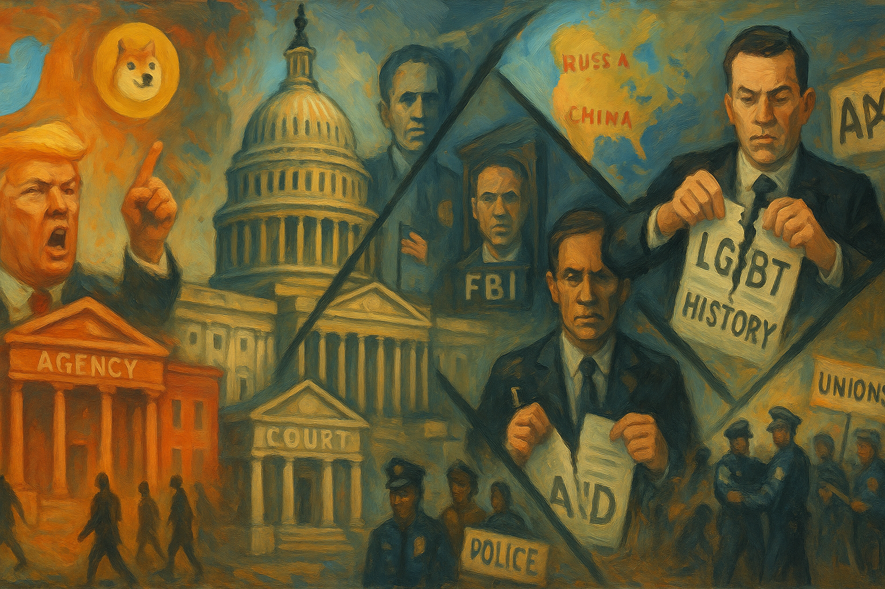

<!-- Generated by build_publish_week_v1 (appendix post) -->
<!-- Header image: image_wide_week5_appendix.png -->

# Week 5 Appendix: The State as Personal Instrument

*Mass firings, data seizures, and cultural erasures turned the federal government into a more personal, less accountable tool of rule in a single dense week.*

This week reads like a concentrated stress test of nearly every democratic safeguard at once. The Trump–Musk DOGE project accelerates into a de facto parallel state: mass firings across health, environmental, safety, and foreign-aid agencies; aggressive efforts to seize IRS, SSA, and education data; and court rulings that largely greenlight the purge. Executive orders centralize control over independent regulators, reinterpret legality via the unitary executive, and weaponize budget freezes and deregulation against Congress’s appropriations power. Simultaneously, the justice system is bent toward impunity for allies and pressure on critics: corruption charges against Eric Adams are dropped under political pressure, whistleblower and watchdog protections are attacked, and Kash Patel is installed to redirect the FBI’s focus. Information control intensifies through bans and lawsuits against AP, ideological cleansing of military schools and federal websites, and erasure of LGBTQ+ and Black history. Abroad, U.S. policy tilts toward Russia and China at Ukraine’s expense, with mineral-grab diplomacy and exclusionary peace talks. Civil society, unions, states, and some courts push back, but the structural pressure this week overwhelmingly entrenches authoritarian drift.

Power and Authority

1. President Trump signed an executive order empowering Elon Musk's Doge committee to shrink the federal workforce (2025-02-15): Granting a private-led committee authority over federal staffing concentrated executive power in an unelected actor and weakened normal civil service and oversight channels.

2. President Trump announced mass layoffs in federal health agencies including CDC and HHS (2025-02-15): Firing thousands of health officials, including epidemic intelligence officers, reduced state capacity to manage disease threats and increased executive leverage over a weakened bureaucracy.

3. President Trump threatened to revoke parole and Temporary Protected Status programs for Ukrainians and ordered a TPS review (2025-02-15): Threatening legal status for Ukrainians and other TPS holders used immigration powers to create insecurity for large groups whose rights depend on executive discretion.

4. President Trump denied Georgia's request to extend the deadline for federal disaster assistance applications after Hurricane Helene (2025-02-15): Refusing more time for Georgia communities to seek disaster aid showed how federal relief can be used selectively, affecting equal treatment of states and localities.

5. President Trump issued an order ending federal support for school COVID-19 vaccine mandates tied to discretionary funds (2025-02-15): Barring federal funds for schools with COVID-19 vaccine mandates shifted public health decisions toward ideological control and constrained local authorities’ ability to protect students.

6. President Trump froze federal spending in defiance of statutory program requirements (2025-02-16): Imposing an across-the-board spending freeze contrary to appropriations law undermined Congress’s power of the purse and normalized unilateral budget control.

7. President Trump oversaw mass firings of federal employees across multiple agencies under a workforce reduction initiative (2025-02-16): Sweeping dismissals at agencies like Agriculture, EPA, VA, Forest Service, HHS and others weakened neutral administration and increased political dependence among remaining staff.

8. President Trump called for the immediate closure of the Department of Education (2025-02-16): Seeking to abolish the Education Department threatened federal support for low-income and disabled students and signaled hostility to a key public institution.

9. President Trump signed an executive order appointing Elon Musk to oversee large federal workforce reductions (2025-02-11): Delegating broad downsizing authority to a private ally blurred lines between public office and private influence and accelerated politicization of the civil service.

10. President Trump declared "Gulf of America Day" and ordered the Gulf of Mexico renamed (2025-02-09): Unilaterally renaming a major body of water asserted symbolic control over national language and pressured institutions and media to adopt politically driven terminology.

11. President Trump instituted a federal spending freeze affecting disaster and other aid programs (2025-02-16): Using a freeze to halt congressionally mandated programs challenged legal limits on executive impoundment and risked withholding essential services for political or ideological reasons.

12. President Trump ordered the Justice Department to dismiss all remaining Biden-appointed US attorneys (2025-02-19): Forcing out prosecutors appointed by the prior administration consolidated presidential control over federal prosecutions and weakened norms of Justice Department independence.

13. President Trump issued an executive order directing agencies to rescind or ignore regulations deemed unconstitutional or beyond statutory authority (2025-02-19): Telling agencies to unilaterally downgrade or stop enforcing rules reinterpreted constitutional limits through the executive branch, bypassing courts and Congress.

14. President Trump issued an executive order to reduce the federal bureaucracy and shrink or terminate several entities (2025-02-19): Ordering cuts to entities like the African Development Foundation and Institute of Peace restructured public functions by decree, reducing independent policy capacity.

15. President Trump signed an executive order restricting access to federal benefits for undocumented immigrants (2025-02-19): Tightening benefit eligibility for undocumented residents used social programs as an enforcement tool and deepened stratification of rights by legal status.

16. President Trump suggested publicly that he might run for a third presidential term (2025-02-20): Questioning constitutional term limits in front of an audience normalized the idea of extending personal rule beyond established democratic constraints.

17. President Trump threatened to cut federal funding to Maine over compliance with his transgender sports ban (2025-02-21): Using federal funds to coerce a state into adopting contested social policy challenged state autonomy and targeted transgender participation in public life.

18. President Trump oversaw pardons for individuals convicted in the January 6 Capitol attack (2025-02-20): Granting clemency to January 6 offenders signaled tolerance for violence against democratic institutions and weakened deterrence for future attacks.

19. President Trump fired Joint Chiefs of Staff chair CQ Brown Jr. and other top military officials (2025-02-21): Removing senior military leaders over diversity and ideological disagreements risked politicizing the chain of command and undermining professional military norms.

Institutions and Governance

1. US Forest Service and National Park Service terminated thousands of probationary employees under a federal spending cut initiative (2025-02-15): Large-scale layoffs at land management agencies reduced capacity for park maintenance and wildfire response, weakening long-term stewardship of public lands.

2. Congressional Republicans and Democrats entered a standoff over a funding bill with a looming government shutdown (2025-02-15): A partisan impasse over funding, amid executive freezes and cuts, threatened basic government operations and highlighted stress on budgetary governance.

3. Federal court approved Elon Musk's voluntary buyout offer for most federal employees (2025-02-15): Judicial approval of mass buyouts facilitated rapid downsizing of the civil service, reinforcing executive-led restructuring of the bureaucracy.

4. Trump administration defied multiple federal court orders intended to halt contested executive actions (2025-02-15): Ignoring injunctions against policies like funding freezes and citizenship changes eroded judicial authority and the expectation that court rulings bind the executive.

5. Department of Justice leadership pressured Public Integrity Section lawyers to choose who would dismiss the Eric Adams indictment under threat of firing (2025-02-14): Forcing prosecutors to pick a colleague to drop a corruption case under duress politicized prosecutorial decisions and undermined internal ethical safeguards.

6. Public Integrity Section lawyers resigned after being ordered to dismiss corruption charges against New York Mayor Eric Adams (2025-02-14): Mass resignations in response to political interference signaled internal resistance but also left the Justice Department with fewer independent voices.

7. Acting US Attorney Danielle Sassoon resigned in protest over the order to drop federal corruption charges against Mayor Eric Adams (2025-02-14): A top prosecutor’s resignation over a politically driven dismissal highlighted threats to prosecutorial independence in high-profile cases.

8. DC Court of Appeals rejected Trump's request to lift an injunction protecting Hampton Dellinger from firing (2025-02-15): By keeping the whistleblower watchdog in place, the appeals court temporarily preserved an independent check on executive abuses affecting federal employees.

9. Judge Tanya Chutkan scheduled an emergency hearing on states' motion to block DOGE job and program cuts (2025-02-15): Fast-tracking review of DOGE-driven cuts showed courts acting as a venue for states to contest sweeping executive restructuring of federal programs.

10. Equal Employment Opportunity Commission moved to dismiss six gender-identity discrimination cases citing a new sex-definition order (2025-02-16): Abandoning pending cases narrowed federal enforcement of workplace protections for transgender workers and reinterpreted civil rights law along executive lines.

11. Government employee unions filed lawsuits challenging mass federal workforce reductions as procedurally unlawful (2025-02-16): Union suits sought to enforce reduction-in-force rules and preserve due process in federal employment against rapid politically driven purges.

12. Trump administration appealed to the Supreme Court to uphold firing of whistleblower watchdog Hampton Dellinger (2025-02-17): Asking the Court to validate removal of the Office of Special Counsel chief tested limits on presidential power over independent oversight bodies.

13. Denise Cheung resigned as Criminal Division Chief in DC after refusing to open a politically ordered probe (2025-02-17): Her resignation over an unsupported investigation into a prior administration contract underscored pressure to weaponize prosecutions for partisan ends.

14. Federal judge declined to block DOGE from accessing Education Department data systems (2025-02-17): Allowing continued access to sensitive education data by a politically directed unit weakened judicial checks on executive data consolidation.

15. Federal judge temporarily blocked firing of 11 DEI staffers at CIA and ODNI (2025-02-18): Protecting diversity staff from immediate dismissal signaled judicial concern over potentially discriminatory purges in national security agencies.

16. US Department of Justice moved to dismiss the corruption indictment of New York Mayor Eric Adams, prompting judicial scrutiny (2025-02-19): Seeking dismissal of a major corruption case for policy reasons, and facing pointed questions from the judge, highlighted tensions over politicized prosecutorial discretion.

17. Joshua Fisher, Director of the Office of Administration told a court that Elon Musk is only a senior advisor without formal decision-making authority (2025-02-19): Downplaying Musk’s formal role in litigation sought to shield extensive de facto influence from constitutional scrutiny and Senate confirmation requirements.

18. Federal judge declined to issue a restraining order blocking mass federal worker firings (2025-02-19): Refusing to halt the purge allowed the administration’s restructuring of the civil service to proceed while unions were redirected to slower administrative channels.

19. House Budget Committee Republicans advanced a budget blueprint extending tax cuts and cutting Medicare, Medicaid and nutrition programs (2025-02-16): The proposed budget shifted fiscal priorities toward high-income taxpayers while reducing social safety nets, reshaping distributive policy through partisan control.

20. Representative Claudia Tenney introduced legislation to make Donald Trump's birthday a federal holiday (2025-02-16): Proposing a personal holiday for a sitting president used statutory symbolism to elevate an individual leader within national civic rituals.

21. Vermont and New York legislatures enacted climate superfund laws making fossil fuel companies pay for climate damages (2025-02-18): State laws to recover climate costs from polluters asserted subnational authority to regulate powerful industries when federal policy moved in the opposite direction.

22. Coalition of 22 red states and oil trade groups sued to block New York's climate superfund law (2025-02-18): The lawsuit sought to curb state-level climate accountability and preserve industry-friendly regulatory baselines, testing federalism boundaries.

23. Federal judge rejected youth climate activists' lawsuit against the EPA (2025-02-18): Dismissing claims that EPA climate policy violated youths’ constitutional rights underscored the difficulty of using courts to force systemic climate action.

24. Federal appeals courts denied the Trump administration's attempts to reinstate a birthright citizenship ban (2025-02-20): Keeping injunctions in place preserved 14th Amendment birthright citizenship and checked an executive effort to redefine constitutional membership.

25. Federal judge allowed the Trump administration to furlough over 2,000 USAid workers (2025-02-21): Permitting large furloughs at the foreign aid agency weakened US development capacity and signaled judicial deference to executive staffing decisions.

26. Senators Ron Wyden and Elizabeth Warren demanded information from the IRS about DOGE's access to taxpayer data (2025-02-17): Senate oversight letters challenged opaque data-sharing with a politically connected unit, seeking to reassert legislative control over sensitive information.

27. North Carolina legislature advanced SB 58 to limit the state attorney general's power to challenge presidential actions (2025-02-19): Restricting the attorney general’s authority to sue over federal illegality weakened a key state-level check on executive overreach.

28. Congress previously passed a law requiring Senate approval before any US withdrawal from NATO (2023-12-01): Statutory limits on unilateral NATO exit strengthened legislative control over treaty commitments amid renewed presidential threats to alliances.

29. Senate Republicans and President Trump clashed over competing budget plans as Trump endorsed a House proposal with deep benefit cuts (2025-02-19): The president’s backing of a more extreme House budget disrupted Senate negotiations and increased the risk of a shutdown-driven governance crisis.

30. Federal Election Commission scheduled a closed Sunshine Act meeting on enforcement and civil actions (2025-02-20): The FEC’s planned compliance meeting reflected ongoing, if opaque, enforcement of campaign finance rules central to electoral integrity.

31. National Archives and Records Administration announced a FOIA Advisory Committee meeting to discuss reform and implementation (2025-02-18): Convening a FOIA advisory meeting supported transparency norms and public input on access-to-records policy amid broader secrecy pressures.

Economic Structure

1. National Endowment for the Arts under the Trump administration canceled diversity, equity and inclusion-focused grants and barred DEI-related programs from funding (2025-02-16): Restricting arts grants based on DEI content steered public cultural funding away from marginalized communities and toward ideologically favored projects.

2. House Budget Committee Republicans and President Trump promoted budget plans extending tax cuts for the wealthy while cutting social programs (2025-02-16): Budget blueprints that expand deficits through high-end tax cuts and reduce Medicare, Medicaid and nutrition aid entrenched inequality and favored capital over labor.

3. Trump administration prepared new tariffs on trading partners despite inflation concerns (2025-02-16): Planned tariffs risked trade retaliation and job losses, using trade policy as a blunt political tool with broad economic consequences.

4. Department of Government Efficiency sought access to sensitive IRS taxpayer information systems (2025-02-16): Efforts to tap IRS data for a politically directed unit raised risks that financial information could be used to reward allies or target opponents.

5. Trump administration took control of the Kennedy Center and installed loyalists in leadership (2025-02-16): A hostile takeover of a major cultural institution redirected public arts resources toward regime-aligned narratives and away from independent governance.

6. Tesla sued Chinese car owners, bloggers and media over complaints and criticism (2025-02-15): Using courts in an authoritarian context to punish critics illustrated how corporate power can leverage state systems to chill consumer speech.

7. Trump Media & Technology Group reported large financial losses and minimal revenue (2025-02-15): Persistent losses at a politically connected media firm highlighted dependence on investor enthusiasm rather than sustainable market demand.

8. USDA and FDA leadership fired staff reviewing Elon Musk's Neuralink operations (2025-02-17): Removing regulators overseeing a politically connected company risked weakening safety oversight in favor of private interests.

9. SpaceX representatives visited the FAA command center to review air traffic control systems (2025-02-17): Allowing a regulated company close access to core regulatory systems blurred boundaries between regulator and regulated, raising conflict-of-interest concerns.

10. Louis DeJoy resigned early as Postmaster General (2025-02-17): His early departure opened the way for new leadership at USPS amid reports of plans to restructure governance and potential executive takeover.

11. Trump administration canceled collective bargaining agreements and rescinded protections for federal workers and contractors (2025-02-18): Unilaterally voiding labor agreements and protections weakened worker bargaining power and made federal employment more precarious.

12. Trump administration rolled back environmental protections and pledged expanded oil drilling (2025-01-20): Scaling back climate safeguards and favoring fossil fuel extraction shifted regulatory benefits toward powerful energy interests at public expense.

13. President Trump signed an executive order expanding access to in vitro fertilization by seeking ways to reduce costs (2025-02-18): Directing policy work to lower IVF costs modestly expanded access to a reproductive technology, though without immediate funding commitments.

14. Trump administration fast-tracked fossil fuel infrastructure permits under an "energy emergency" designation (2025-02-19): Creating an emergency permit track for hundreds of projects weakened environmental review and favored rapid private development over public input.

15. Federal Aviation Administration fired hundreds of employees responsible for air traffic communications and systems (2025-02-16): Cutting key technical staff risked degrading aviation safety and showed how workforce reductions can endanger critical infrastructure.

16. USDA mistakenly fired bird flu response officials as part of workforce cuts and then tried to rehire them (2025-02-19): Erroneous dismissals during a disease outbreak illustrated how rushed downsizing can undermine essential public health functions.

17. Elon Musk called for defunding the International Space Station after a dispute over astronaut return plans (2025-02-19): Urging cuts to a major international research platform highlighted tensions between private space interests and publicly funded scientific cooperation.

18. Trump administration moved to revoke federal approval for New York City's congestion pricing program (2025-02-19): Threatening a locally designed congestion-pricing scheme used federal leverage to block a city’s environmental and revenue policy.

19. President Trump froze funding for electric vehicle subsidies and CHIPS Act implementation (2025-02-20): Halting support for EVs and semiconductor manufacturing reversed industrial policy aimed at technological competitiveness and climate goals.

20. Congressman Nick Begich told constituents he was powerless to stop DOGE-driven budget cuts while supporting the DOGE caucus (2025-02-20): A lawmaker’s deference to executive cuts that cost local federal jobs illustrated how representation can be subordinated to centralized fiscal agendas.

21. Trump administration proposed cuts to Social Security, Medicare, Medicaid and food assistance programs (2025-02-21): Targeting core social insurance programs for reductions shifted fiscal burdens onto vulnerable populations while citing unsubstantiated waste claims.

22. University of Michigan survey researchers reported a sharp drop in US consumer confidence linked to tariff concerns (2025-02-20): Falling consumer sentiment in response to tariff policy signaled public anxiety about economic management and potential downturn risks.

23. Defense Secretary Pete Hegseth ordered Pentagon leaders to plan for an 8% defense budget cut over five years (2025-02-20): Planning sizable defense cuts while publicly backing higher spending created uncertainty about long-term military capacity and strategic commitments.

24. Trump administration considered repealing tariffs on China in exchange for purchase promises (2025-02-20): Potentially trading away leverage for unenforceable purchase pledges risked favoring Chinese economic interests without clear gains for US workers.

25. President Trump proposed a US-China deal to halve military spending for both countries (2025-02-20): Suggesting symmetric cuts despite opaque Chinese budgets risked weakening US deterrence more than China’s, with implications for global security.

26. Drug Enforcement Administration and multiple pharmaceutical firms processed applications for manufacturing and importing controlled substances for research and commerce (2025-02-18): Routine DEA registration notices for controlled substances reflected ongoing regulatory oversight of pharmaceutical supply and research.

27. Occupational Safety and Health Administration extended OMB approval for information collection under the MDA construction standard (2025-02-18): Maintaining data collection for a hazardous chemical standard supported enforcement of workplace safety rules in construction.

28. Federal Communications Commission amended the FM allotments table to remove and reinstate various channels (2025-02-19): Technical updates to FM frequency allocations adjusted broadcasting markets and spectrum use without major policy shifts.

29. US Census Bureau sought public comment on the 2026 Government Units Survey and CPS 2025 field test (2025-02-20): Planned surveys to update government unit data and modernize population survey methods underpinned evidence-based policymaking.

30. Environmental Protection Agency withdrew a direct final rule on Utah's hazardous waste program after adverse comments (2025-02-20): Pulling back a rule in response to feedback showed environmental regulation still subject to public comment and revision processes.

31. Environmental Protection Agency extended comment periods and announced availability of environmental impact statements for major projects (2025-02-21): Extending comment windows and publishing EIS notices supported public participation in environmental decision-making on water quality and infrastructure.

32. Federal Communications Commission finalized rules improving accessibility of video programming interfaces for people with hearing disabilities (2025-02-21): Requiring accessible caption controls advanced disability rights and inclusive access to media services.

Civil Rights and Dissent

1. Department of Justice fired more than two dozen immigration judges and candidates amid a case backlog (2025-02-15): Removing immigration judges and new hires strained adjudication capacity and risked politicizing decisions affecting immigrants’ legal rights.

2. Protesters in New York City demonstrated against removal of "TQ+" from the Stonewall National Monument website (2025-02-15): Public protest over erasing transgender references from a landmark site defended LGBTQ+ recognition and historical memory.

3. Students at a Department of Defense school in Germany walked out during Pete Hegseth's visit to oppose DEI content removals (2025-02-15): A student walkout challenged top-down censorship of diversity materials in military schools and asserted youth voice in education policy.

4. Five defendants in New York were charged with the murder of transgender man Sam Nordquist after prolonged abuse (2025-02-16): The prosecution of a brutal killing of a transgender man highlighted ongoing violence against LGBTQ+ people and the justice system’s role in addressing hate-motivated crimes.

5. Democratic leaders and grassroots groups organized nationwide protests against DOGE-driven budget cuts (2025-02-16): Coordinated demonstrations outside congressional offices and Tesla dealerships showed organized resistance to perceived illegal austerity measures.

6. Immigration and Customs Enforcement detained immigrants at courthouses and check-ins, including DACA recipients, under daily arrest quotas (2025-02-18): Arresting people who complied with legal processes at courts and check-ins weaponized enforcement in ways likely to deter participation in the justice system.

7. National Labor Relations Board under the Trump administration fired board member Gwynne Wilcox in an unlawful manner (2025-02-18): Removing a pro-worker NLRB member weakened enforcement of labor rights and signaled hostility to union protections.

8. Department of Defense Education Activity ordered censorship of curricula and removal of materials on women, minorities and LGBTQ people in military schools (2025-02-18): Banning content on gender, race and civil rights in DoD schools curtailed students’ exposure to diverse histories and identities under government authority.

9. Occupational Safety and Health Administration ordered destruction and removal of workplace safety publications flagged for DEIA-related terms (2025-02-17): Purging safety documents, including one on transgender restroom access, reduced access to guidance and intertwined workplace safety with ideological censorship.

10. Trump administration cut off legal aid for unaccompanied immigrant children before later reversing the decision (2025-02-18): Temporarily denying counsel to unaccompanied minors in immigration proceedings exposed a vulnerable group to proceedings without adequate legal protection.

11. General Services Administration staff resigned after a Musk ally sought access to Notify.gov messaging data (2025-02-19): Resignations over a request for mass-messaging access reflected internal alarm about potential misuse of citizen contact data for political purposes.

12. Federal workers and Representative Alexandria Ocasio-Cortez rallied outside the SpaceX building in Washington to protest Musk's policies (2025-02-19): A large demonstration by federal employees against DOGE cuts highlighted workplace dissent against perceived privatization and profiteering.

13. Protesters across the United States held mass demonstrations against Trump administration actions seen as undermining democracy and alliances (2025-02-19): Nationwide protests signaled broad civic mobilization in defense of democratic norms and international commitments.

14. National Park Service removed references to transgender people from Stonewall National Monument webpages (2025-02-16): Erasing transgender references from a key LGBTQ+ historic site diminished official recognition of a marginalized group’s role in civil rights history.

15. Federal agencies scrubbed mentions of Black people from some federal websites during Black History Month (2025-02-19): Removing Black history content from official sites during a commemorative month signaled state-driven marginalization of racial minorities’ contributions.

16. President Trump and Senate Republicans secured Senate passage of a budget resolution funding a mass deportation plan (2025-02-21): Allocating $175 billion for border security and deportations embedded large-scale removal of immigrants into federal spending priorities.

17. President Trump ended federal benefits for undocumented immigrants through executive order (2025-02-20): Cutting access to public benefits for undocumented residents deepened a tiered system of rights and heightened vulnerability for targeted communities.

18. President Trump oversaw reassignment and firing of top ICE officials to increase deportations (2025-02-21): Leadership changes at ICE aimed at boosting arrest numbers reinforced a punitive enforcement posture toward immigrants.

19. US Marshals Service deputized Elon Musk's private security guards to carry weapons on federal property (2025-02-20): Granting law enforcement powers to private security blurred lines between public policing and private protection of elite figures.

20. DC US Attorney Ed Martin launched Operation Whirlwind to investigate threats against officials, including inquiries into critical lawmakers (2025-02-19): A threat-focused initiative that scrutinized critical speech by legislators and media risked chilling political expression under the guise of security.

21. Enrique Tarrio was arrested for assaulting a protester near the US Capitol after receiving clemency for January 6 crimes (2025-02-21): The re-arrest of a pardoned January 6 leader underscored ongoing tensions around accountability for political violence and the effects of earlier clemency.

22. CPAC organizers ejected several January 6 defendants from the conference without explanation (2025-02-20): Removing January 6 participants from a major conservative gathering reflected internal disputes over how openly to embrace those involved in the attack.

23. Trump administration fired hundreds of federal employees including many veterans amid health crises (2025-02-19): Targeting probationary staff and veterans at agencies like USDA and CDC during outbreaks weakened both worker security and public health response.

24. Veterans Affairs and DOGE fired disabled veteran and VA employee Luke Graziani (2025-02-17): Dismissing a disabled veteran working at VA raised concerns about how workforce cuts affected those the agency is meant to serve.

Information, Memory and Manipulation

1. Doge committee representatives gained access to sensitive payment and contracting systems at health agencies (2025-02-15): Allowing a politically directed unit into core health IT systems risked misuse of data and undermined established safeguards on federal information.

2. White House and Trump administration banned Associated Press journalists from the White House, Oval Office and Air Force One over naming disputes (2025-02-16): Excluding a major newswire for refusing to adopt "Gulf of America" punished independent editorial standards and narrowed press access to power.

3. Elon Musk called for imprisonment of journalists over critical coverage of the administration (2025-02-16): Publicly urging jail for reporters signaled elite hostility to investigative journalism and could intimidate media scrutiny.

4. President Trump misrepresented the 14th Amendment as only covering formerly enslaved people (2025-02-16): Falsely narrowing the scope of birthright citizenship on social media spread constitutional misinformation that could justify restrictive policies.

5. State Department leadership ordered global diplomatic posts to cancel most media subscriptions deemed non-mission critical (2025-02-19): Cutting off broad media access for diplomats limited their information sources and increased reliance on centrally approved narratives.

6. Occupational Safety and Health Administration removed and destroyed online and physical safety publications flagged for DEIA-related terms (2025-02-17): Deleting safety documents, many unrelated to DEI, sanitized official records and reduced public access to workplace guidance.

7. Department of Defense Education Activity ordered book removals and curriculum changes to eliminate materials on gender and equity ideology (2025-02-18): Purging books and lessons on gender, Black history and LGBTQ topics from military school libraries reshaped civic education toward a narrower, state-approved narrative.

8. National Park Service under the Trump administration removed transgender references from Stonewall National Monument webpages (2025-02-16): Editing official descriptions of Stonewall to omit transgender people rewrote public history of the LGBTQ+ rights movement.

9. President Trump renamed the Gulf of Mexico as the Gulf of America and promoted the change through proclamations (2025-02-09): Imposing a new name on a major geographic feature sought to reshape national symbolism and test media compliance with executive language.

10. Michelle King, acting SSA Commissioner resigned rather than grant DOGE access to Social Security beneficiaries' sensitive data (2025-02-17): Her departure highlighted internal resistance to expansive data sharing that could enable surveillance or targeting of millions of Americans.

11. Senators and journalists exposed inaccuracies in DOGE's claims of canceling $16 billion in wasteful contracts (2025-02-19): Revelations that touted savings were vastly overstated undermined official narratives used to justify aggressive cuts and data grabs.

12. Congressman Nick Begich amplified false claims that millions of centenarians receive Social Security benefits and that DOGE uncovered massive illegality (2025-02-20): Spreading debunked statistics about Social Security beneficiaries fueled distrust in public programs and bolstered DOGE’s justification for cuts.

13. Robert F. Kennedy Jr. as HHS Secretary continued anti-vaccine rhetoric and announced a panel to review childhood vaccine schedules (2025-02-19): Using a top health post to question established vaccination science risked undermining public trust and uptake during active outbreaks.

14. Heather Cox Richardson and commentators reflected on presidential honesty and disinformation on Presidents Day (2025-02-18): Public commentary contrasted historic expectations of truthful leadership with current disinformation, helping contextualize democratic norms for readers.

15. Federal Communications Commission announced a CSRIC IX meeting on communications security and reliability (2025-02-20): Advisory work on communications resilience supported secure information infrastructure, a prerequisite for reliable public communication.

16. Associated Press filed lawsuits challenging its exclusion from White House events (2025-02-20): AP’s legal actions sought judicial protection for press access and signaled institutional pushback against retaliatory bans.

17. Vice President J.D. Vance was accused of spreading Russia-aligned propaganda undermining Western democracy (2025-02-19): Allegations that the vice president echoed adversary narratives raised concerns about elite-driven disinformation shaping foreign policy debates.

18. Trump administration removed grants and support for scientific research using the term "climate" and scrubbed climate references from websites (2025-02-21): Defunding and erasing climate-related research and language suppressed scientific information about environmental risks from public view.

19. Trump administration removed references to Black Americans from some federal websites during Black History Month (2025-02-19): Scrubbing Black history content from official sites during a commemorative period exemplified state curation of memory that sidelines disfavored narratives.

20. Trump administration issued executive orders reshaping NIH, including communication blackouts and blocking grant review committees (2025-02-20): Restricting NIH communications and peer review processes disrupted scientific information flows and centralized control over research agendas.

21. Federal Communications Commission corrected a date error in a hazardous air pollutant rule (2025-02-19): Fixing a regulatory typo ensured accurate implementation of air quality standards, supporting clarity in environmental information.

