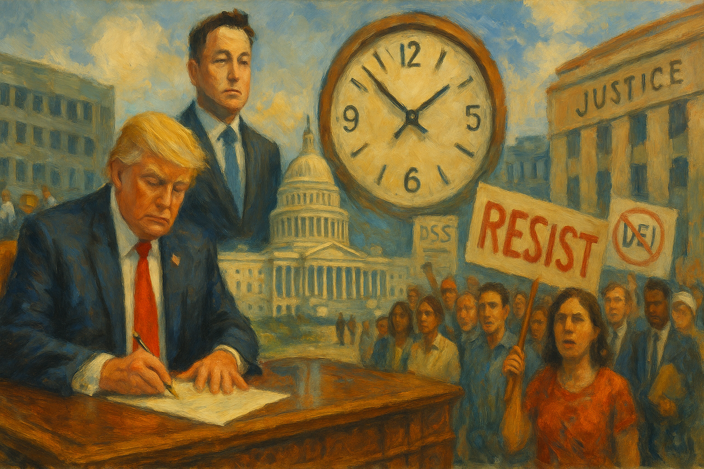

<!-- Generated by build_publish_week_v1 -->
<!-- Header image: image_wide_week5.png -->

# Week 5: Pressure Without Breakage

*A week of concentrated executive power, mass resignations, and mixed judicial resistance leaves the democratic balance unmoved but badly strained.*

The week did not open with a single blow. It opened with paperwork, personnel memos, and executive orders that read, on their face, like routine housekeeping. By its end, the pattern beneath the paperwork was unmistakable. Power moved inward, toward the presidency and its immediate circle. The mechanisms built to check that power worked, sometimes, and failed, often, without ever fully giving way. The Democracy Clock recorded this as a week of pressure without breakage.

At the close of the prior period, the clock stood at 7:32 p.m. It remains there now. The net movement for the week is zero minutes. That stillness is not calm. It reflects a week in which serious efforts to concentrate power collided with serious efforts to resist it, and neither side won outright. Courts blocked some actions and allowed others. Officials resigned rather than comply, even as replacements were found. The traits most affected — executive oversight, civil service politicization, protections for corruption investigations — all moved sharply in one direction. But other parts of the record, court rulings, resignations, legislative pushback, supplied enough friction to hold the line. The clock's stillness is the residue of that friction, not the absence of danger.

The week's central story began with a prosecution dropped. The Justice Department moved to dismiss corruption charges against New York Mayor Eric Adams. The timing followed his public cooperation on immigration enforcement. Career prosecutors saw the arrangement for what it appeared to be. Danielle Sassoon, Hagan Scotten, and Denise Cheung resigned rather than sign off on the dismissal. Five more lawyers in the Public Integrity Section were reportedly threatened with termination if they refused the same order.

The resignations did not stop the dismissal. Acting deputy attorney general Emil Bove defended the motion in court, and the case moved forward despite judicial skepticism about the government's rationale. The episode revealed a Justice Department willing to trade prosecutorial independence for political cooperation. It also revealed enough career attorneys unwilling to be party to the trade that the resistance became visible, if not victorious. Power shifted toward the executive's ability to use prosecution as leverage. It shifted away from the norm that criminal charges answer to evidence, not deals.

A second front opened through executive order. Trump signed directives asserting direct presidential review over independent regulatory agencies, including the SEC and FTC, bodies Congress had designed to sit at arm's length from the White House. A companion order stripped removal protections from administrative law judges, the officials who settle disputes inside federal agencies. Another eliminated federal entities and advisory committees outright. A fourth created the Department of Government Efficiency by decree and installed Elon Musk, an unelected private citizen, to lead it.

Senator Angus King called the pattern the most serious assault on the Constitution he had witnessed in his career. Whether or not that framing proves durable, the substance was clear enough. Agencies built to stay insulated from political pressure were being pulled inside the president's direct chain of command. The buffer between elected authority and technical administration narrowed by executive signature alone. Not a single vote in Congress was cast.

The week's third major thread ran through data. DOGE, Musk's new vehicle, gained access to CDC and CMS payment systems, sought entry to IRS taxpayer records, and pushed into Treasury payment infrastructure and Social Security data. Each expansion drew immediate legal challenge. Senators Wyden and Warren demanded answers from the IRS. Democracy Forward and Public Citizen sued to block access to Labor, Education, and Treasury data. Unions representing federal workers filed their own suit over Social Security records.

The courts split. A judge blocked DOGE from Treasury's most sensitive payment systems, at least for now. Other requests for injunctions failed. What stayed constant was the direction of travel: an unaccountable operation, never confirmed by the Senate, reaching deeper into the government's most sensitive stores of personal data. Litigation could slow the advance. It could not fully stop it.

Alongside the data fights came a wave of firings across the civil service. Roughly 4,400 employees at the Forest Service and Park Service lost their jobs. Twenty-five percent of the USDA's animal health laboratory staff were cut amid an active bird flu outbreak. The cuts landed so carelessly that the agency fired the very personnel monitoring the outbreak, then scrambled to rehire them days later. A similar reversal followed at the Pentagon, where a plan to cut eight percent from the defense budget evaporated into a budget increase within days.

These reversals matter as much as the cuts themselves. They suggest an operation moving fast, without care, a purge run by formula rather than judgment. The federal workforce, roughly two million strong, absorbed the disruption regardless of whether it made sense. A court allowed the firings to continue pending further litigation. The judge overseeing the case openly voiced frustration that the Justice Department could not confirm basic facts about its own personnel actions.

Immigration enforcement sharpened in a different key this week. ICE detained a Venezuelan asylum seeker at a routine check-in he had attended faithfully for two years. A Harvard researcher fleeing political persecution in Russia was detained at Boston's airport over a paperwork error. A disabled green-card applicant, holding a state pardon for a decades-old conviction, remained in custody after fourteen months. Trump signed an order attempting to end birthright citizenship by executive reinterpretation of the Fourteenth Amendment. An appeals court rejected the claim days later, upholding the existing injunction against it.

The through-line in these cases is not chaos but selection. People who complied with the law, who showed up, who followed the rules of their own cases, found that compliance offered no protection. The birthright citizenship order, blocked for now, sought to make citizenship itself a matter of executive discretion rather than constitutional guarantee. That the courts stopped it this week does not erase the attempt. It marks the attempt as contested rather than settled.

The judiciary's role this week deserves its own accounting. It cannot be reduced to either resistance or surrender. Courts blocked DOGE's Treasury access. Courts allowed the mass firings to continue. An appeals court preserved birthright citizenship. A different court cleared the way for thousands of USAID workers to be placed on leave. The D.C. Circuit, and later the Supreme Court itself, rejected the administration's bid to remove Special Counsel Hampton Dellinger, a rare instance of the judiciary holding firm against an explicit attempt to fire an independent watchdog.

Taken together, these rulings describe a judiciary still working as a genuine check, but an uneven one. Some doctrines held. Others gave way. The docket became a record of contest rather than one of uniform compliance or uniform defiance. This is not a courts system rolled over. It is a courts system straining under volume, working case by case, with no guarantee the next ruling falls the same way as the last.

Personnel changes at the top of two institutions rounded out the week's structural story. Trump fired Air Force General CQ Brown as Chairman of the Joint Chiefs, along with other senior officers and top service lawyers, in what critics linked to his opposition to diversity policy within the ranks. Days earlier, the acting director of ICE was removed for insufficient deportation numbers. The Senate confirmed Kash Patel as FBI Director on a near party-line vote, installing an election denier atop the nation's premier law enforcement agency.

Each removal followed its own logic — defense policy, immigration enforcement, federal law enforcement. But the pattern across all three was the same. Leadership positions meant to operate with professional distance from politics were filled or vacated based on loyalty rather than the ordinary standards of the office. The military's civilian chain of command remains intact on paper. Its senior leadership now answers more directly to presidential preference than it did a week before.

Press access and public memory absorbed their own pressures. The Associated Press remained barred indefinitely from White House briefings and Air Force One, punished for declining to adopt the administration's preferred name for the Gulf of Mexico. The State Department ordered its outposts abroad to cancel subscriptions to independent news organizations. Federal websites scrubbed references to Black Americans during Black History Month and removed transgender history from National Park Service pages describing the Stonewall uprising. Protesters gathered at the site itself to object.

Amid this narrowing, one reversal moved the other way. Trump signed an order releasing classified files related to the assassination of Martin Luther King Jr., a rare expansion of historical disclosure, though the King family voiced concern about selective framing. The week's balance sheet on memory and information tilted toward erasure. Even so, it held at least one act of opening, a reminder that contraction rarely comes without exceptions.

Federal power turned pointedly against those seen as adversaries. Georgia Governor Brian Kemp's request to extend a disaster aid deadline after Hurricane Helene was denied, a decision widely read as tied to a personal grievance rather than the merits of the request. Maine Governor Janet Mills was told bluntly, "we are the federal law," after her state declined to comply with a ban on transgender athletes; multi-agency investigations into Maine followed within days. A newly appointed U.S. Attorney launched inquiries into a senator and a representative over past public statements.

None of these actions required new legal authority. They required only the will to use existing federal leverage — funding, investigative power, regulatory attention — against specific, named opponents. That will was present. Whether the leverage produces lasting consequence depends on litigation still unresolved at week's end.

Congress offered its own quiet counterpoint. Mitch McConnell announced he would not seek reelection in 2026, closing out the longest tenure of any Senate party leader. Senator Wicker publicly criticized the administration's posture toward Ukraine's NATO membership. Murkowski and Sullivan introduced legislation to restore the name Denali, a direct rebuke of a presidential renaming order. These were not victories in any structural sense. They were signs that the legislative branch, however constrained, had not gone entirely silent.

Litigation over Dellinger's firing reached the Supreme Court this week and was rejected there. It is a resolved matter worth noting precisely because it shows one place where the highest court drew a line, at least for now, against an explicit attempt to remove an independent watchdog by presidential fiat.

The record this week does not describe a government that broke. It describes one that pushed harder against its own restraints, in more places at once, than in prior weeks. Those restraints — courts, resigning officials, congressional voices, state governments — pushed back with enough force to hold the line roughly where it stood. Whether that balance holds depends on what happens next: the cases still pending, the data fights still unresolved, the personnel purges still working their way through a government that keeps functioning, unevenly, under strain.

<!-- Synopses for cross-posting -->
Long Synopsis: The week brought no single rupture, only accumulating pressure. The Justice Department dropped corruption charges against New York's mayor after his cooperation on immigration, prompting a wave of prosecutor resignations. Executive orders pulled independent regulatory agencies and administrative law judges under direct presidential control, while DOGE pushed into Treasury, IRS, and Social Security data despite lawsuits and partial court blocks. Mass firings swept federal health, land management, and defense agencies, some reversed within days amid chaos. Trump fired the Joint Chiefs chairman, ICE's acting director, and pursued birthright citizenship's end by executive order, blocked by an appeals court. Courts split throughout, rejecting a bid to remove an independent watchdog while allowing other firings to proceed. Congress offered scattered resistance. The Democracy Clock held at 7:32 p.m., its stillness reflecting contest rather than calm.
Short Synopsis: Executive power pushed hard against oversight this week, testing prosecutors, agencies, courts, and career civil servants alike. Resistance held the line without stopping the advance, leaving the Democracy Clock unchanged at 7:32 p.m., a stillness born of friction, not safety.

