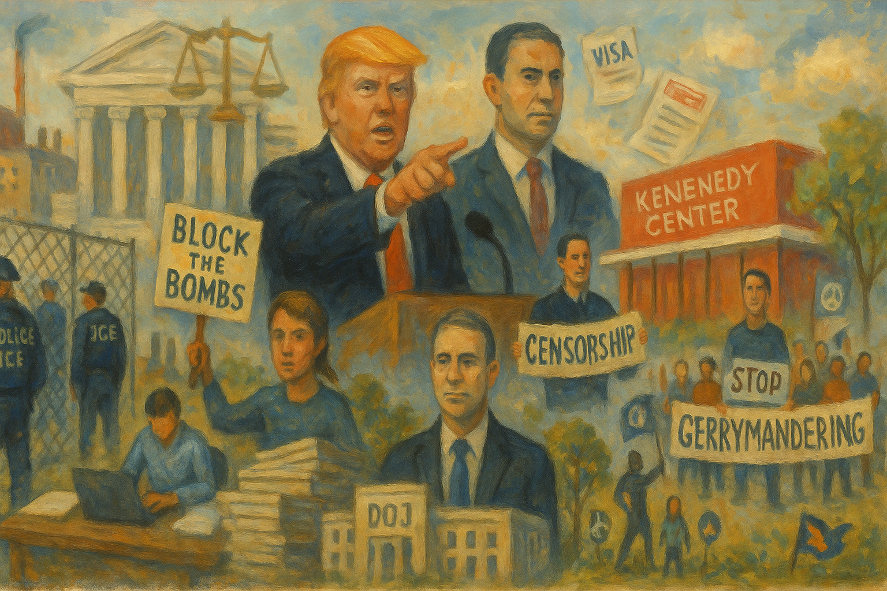

<!-- Generated by build_publish_week_v1 (appendix post) -->
<!-- Header image: image_wide_week50_appendix.png -->

# Week 50 Appendix: Consolidation as Governance

*With the clock frozen, the administration deepened its use of law, security, and narrative to personalize power and stratify rights without new formal shocks.*

This week shows an executive-centered system increasingly willing to use law, security forces, and cultural institutions as instruments of political power. Immigration enforcement is being industrialized and ideologized—via denaturalization quotas, warehouse detention, and a $100m ICE recruitment blitz—while courts intermittently push back, as in the TikTok streamer dismissal and the CFPB funding order. Trump’s retaliatory vetoes of unanimously passed water and Everglades bills, and selective punishment of Colorado and tribal interests, exemplify federal power weaponized against disfavored regions. The Kennedy Center bylaw change and renaming, combined with background-check shortcuts for a border czar, highlight patronage and symbolic dominance over independent governance. Information manipulation is overt: censorship of investigative reporting, visa bans on anti-disinformation figures, and repeated presidential disinformation campaigns. Simultaneously, the Justice Department’s opaque handling of Epstein files and massive but delayed document reviews deepen mistrust of elite accountability. State and civil society responses—climate superfund laws, anti-gerrymandering marches, Block the Bombs advocacy—signal pockets of democratic resistance, but the structural pressure this week runs heavily toward entrenching executive impunity, stratified citizenship, and chaotic, retaliatory governance.

Power and Authority

1. President Donald Trump urged Republican senators to eliminate the Senate filibuster (2025-12-27): Trump’s push to scrap the filibuster would weaken minority-party leverage in the Senate, making it easier for a simple majority to pass sweeping laws and concentrate legislative power.

2. Indivisible mobilized the public to press the Senate to block unauthorized attacks on Venezuela (2025-12-27): The call for Senate action sought to reassert Congress’s war powers and prevent unilateral executive military action, reinforcing checks on presidential use of force.

3. President Donald Trump vetoed a bipartisan clean water bill for Colorado (2025-12-31): By vetoing unanimously passed drinking water legislation apparently tied to political grievances, Trump used veto power in a retaliatory way that jeopardized public health and undercut bipartisan governance.

4. President Donald Trump vetoed a bill funding an Everglades project benefiting the Miccosukee Tribe (2026-01-01): The veto blocked environmental protection and tribal interests on stated ideological grounds, signaling willingness to wield executive power against disfavored communities and court rulings.

5. President Donald Trump asserted personal control over immigration, criminal law, and forcible renditions (2026-01-02): Claims that the president personally directs immigration and criminal enforcement, including renditions, point to erosion of institutional checks and concentration of coercive power in the executive.

6. President Donald Trump threatened military action against Iran over protest repression (2026-01-01): Trump’s public threat of intervention in Iran, made outside formal processes, risked escalating conflict and showcased personalized use of military signaling in foreign policy.

Institutions and Governance

1. U.S. House of Representatives censured Representative Al Green for interrupting Trump during a joint session (2025-12-27): The censure punished a member’s floor speech against the president, illustrating how disciplinary tools can be used to chill outspoken legislative dissent without removing formal voting rights.

2. U.S. House of Representatives passed a resolution disapproving Representative Chuy Garcia’s retirement timing (2025-12-27): The resolution condemned Garcia’s alleged maneuvering to aid a successor, signaling congressional willingness to police perceived election manipulation within its own ranks.

3. Tennessee House of Representatives expelled Justin Pearson and Justin Jones for leading a gun policy protest (2026-01-02): The expulsions of lawmakers for floor protest over gun violence showed a state legislature using its removal power against dissenting members, raising concerns about representation and protest rights.

4. U.S. House Judiciary Committee held testimony and released a transcript from former special counsel Jack Smith (2025-12-31): Smith’s testimony and deposition detailed evidence against Trump and affirmed prosecutorial independence, providing congressional oversight of high-level criminal investigations involving a former president.

5. Federal district court granted Imran Ahmed a temporary restraining order against detention (2025-12-29): The TRO protected an anti-disinformation advocate from government detention while his suit proceeds, underscoring judicial capacity to check executive actions affecting critics.

6. Federal district court dismissed with prejudice an indictment against TikTok streamer Carlitos Ricardo Parias (2025-12-29): The court threw out charges over alleged assault on federal agents after finding due process violations, reinforcing constitutional protections in immigration-related prosecutions.

7. Judge Amy Berman Jackson ordered the administration to continue funding the Consumer Financial Protection Bureau (2025-12-30): By compelling continued CFPB funding despite executive resistance, the ruling defended Congress’s creation of an independent consumer watchdog against de facto defunding.

8. U.S. Court of Appeals allowed the administration to end Medicaid funding for Planned Parenthood in 22 states and DC (2025-12-31): The appellate decision enabled a statutory provision cutting Medicaid reimbursements to Planned Parenthood, curbing access to reproductive care and reflecting ideological influence on health funding.

9. U.S. Department of Justice undertook a large-scale review of over 5 million Jeffrey Epstein documents (2025-12-31): DOJ’s massive, delayed review of Epstein records, far exceeding earlier estimates, raised questions about transparency, resource allocation, and potential shielding of powerful figures.

10. U.S. Department of Justice acknowledged millions of additional undisclosed Epstein-related documents (2026-01-01): The late acknowledgment of roughly five million more Epstein documents fueled congressional accusations of unlawful withholding and deepened mistrust in DOJ’s handling of elite-linked crimes.

11. National Links Trust had its lease to manage Washington DC public golf courses terminated by the administration (2026-01-01): Ending the public–private lease without a clear successor plan disrupted public amenities and raised concerns about contractual stability and potential self-dealing in federal property decisions.

12. Kennedy Center Board of Trustees changed bylaws to restrict voting to Trump-appointed trustees and approved renaming to include Trump (2025-12-31): Concentrating voting power in Trump appointees and renaming a congressionally chartered arts institution around the sitting president blurred lines between public governance and personal glorification.

13. EPA Local Government Advisory Committee had its charter renewed and sought new local government members (2026-01-02): Renewing the LGAC and recruiting members preserved a formal channel for local input into federal environmental policy, supporting multi-level governance and representation.

14. EPA and Oklahoma Department of Environmental Quality finalized delegation of certain hazardous air pollutant standards to Oklahoma (2026-01-02): Delegating NESHAP enforcement to Oklahoma expanded state control over air quality regulation, with implications for local accountability and consistency of federal protections.

15. EPA revoked a 2024 rule on reclassification of major pollution sources under the Clean Air Act (2026-01-02): By restoring a more flexible 2020 standard after congressional disapproval of the 2024 rule, EPA shifted hazardous air pollutant regulation in a direction favored by industry, affecting environmental safeguards.

16. EPA published a notice of availability for recent Environmental Impact Statements (2026-01-02): Making EIS documents and EPA comments publicly available, including for a major solar project, supported transparency and public participation in federal environmental decisions.

17. EPA approved revisions to Colorado’s air plan procedural rules (2026-01-02): Approving Colorado’s administrative updates to its air plan ensured state procedures remained aligned with federal Clean Air Act requirements, maintaining regulatory clarity.

18. EPA finalized revisions to the Taconite Federal Implementation Plan for Michigan and Minnesota (2026-01-02): New NOx and SO2 limits and reporting rules for taconite plants tightened industrial emission controls, reinforcing federal authority to enforce air quality standards.

19. EPA approved South Carolina’s regional haze plan (2025-12-30): Endorsing South Carolina’s haze plan locked in state commitments to reduce emissions affecting visibility in protected areas, illustrating cooperative federalism in environmental governance.

20. EPA granted a no-migration variance for hazardous waste disposal at Clean Harbors Lone Mountain (2025-12-30): Allowing an exception to land disposal restrictions conditioned on no waste migration adjusted enforcement of hazardous waste rules, balancing industry flexibility with environmental risk.

21. EPA corrected an editorial error in federal fuel regulations (2025-12-31): Technical corrections to fuel regulation text improved legal clarity, which is important for consistent enforcement and regulated entities’ compliance.

22. National Institute for Occupational Safety and Health began evaluating a petition for Special Exposure Cohort status for United Nuclear workers (2025-12-30): NIOSH’s review could extend compensation to a class of nuclear workers, reflecting institutional mechanisms for redressing historic occupational harms.

23. Centers for Disease Control and Prevention announced a meeting of the Advisory Board on Radiation and Worker Health subcommittee (2025-12-29): The open advisory meeting on radiation and worker health procedures maintained expert and public input into compensation and safety standards for exposed workers.

24. Occupational Safety and Health Administration granted permanent variances for compressed-air tunneling projects in DC and Ohio (2025-12-29): OSHA’s variances for two tunneling projects modified standard safety rules, illustrating how regulators adjust protections in response to specialized industrial practices.

25. Occupational Safety and Health Administration expanded recognition of DEKRA Certification Inc. and UL LLC as testing laboratories (2025-12-31): By broadening NRTL scopes for DEKRA and UL, OSHA increased third-party capacity to certify product safety, supporting enforcement of workplace and consumer standards.

26. Occupational Safety and Health Administration sought comment on extending information collections for rigging equipment and training grants (2025-12-31): Extending data collection for rigging safety and the Susan Harwood Training Grant Program preserved oversight of workplace hazards and grant performance.

27. Nemko North America, Inc. applied for expansion of OSHA Nationally Recognized Testing Laboratory status (2025-12-31): Nemko’s bid to test additional standards, subject to public comment, reflected procedural checks on private entities’ roles in federal safety certification.

28. Federal Communications Commission requested public comment on several information collection practices (2025-12-29): FCC notices on discrimination complaint data and tariff review plans invited scrutiny of how regulatory data are gathered, affecting transparency and administrative burden.

29. U.S. Census Bureau sought OMB clearance for continued questionnaire pretesting research (2025-12-30): Renewing authority for survey pretesting supported the quality of federal statistics, which underpin fair representation and policy design.

30. Transportation Security Administration revised its pipeline security information collection and sought public comment (2026-01-02): Updating data requirements for pipeline security and cybersecurity oversight affected how critical infrastructure operators are monitored and held accountable.

31. General Services Administration updated federal mileage reimbursement rates and minimal value for foreign gifts (2026-01-02): Adjusting travel reimbursements and the threshold for reportable foreign gifts maintained statutory compliance and transparency in federal employee benefits and ethics rules.

32. North Carolina General Assembly planned new tax cuts for wealthy individuals and corporations despite budget delays (2026-01-02): The planned cuts, expected to worsen budget shortfalls and strain childcare and healthcare, illustrated how fiscal choices can weaken public services and social infrastructure.

33. New York and Vermont legislatures enacted climate superfund laws requiring polluters to fund resilience and emissions cuts (2026-01-01): These state laws shifted climate costs onto major emitters, demonstrating subnational innovation in environmental accountability despite federal opposition.

34. North Carolina Select Committee on Oversight and Reform attacked the Chapel Hill School District in an oversight campaign (2026-01-02): The committee’s actions, seen as part of a broader effort to undermine public education, highlighted how legislative oversight can be used to pressure school systems.

Economic Structure

1. U.S. Department of Homeland Security adjusted civil monetary penalties for inflation (2025-12-29): Updating DHS civil penalties preserved their deterrent value, supporting enforcement of safety and security regulations without new legislation.

2. Food and Drug Administration set OTC monograph order request fees for fiscal year 2026 (2025-12-29): New user fee levels for OTC drug monograph changes shifted some regulatory costs to industry, funding FDA oversight that protects public health.

3. Food and Drug Administration announced a roundtable on premarket tobacco applications for ENDS products (2025-12-29): The ENDS roundtable aimed to clarify regulatory expectations for small manufacturers, affecting how e-cigarette products enter the market and are scrutinized for safety.

4. Food and Drug Administration authorized emergency use of two animal drugs for New World screwworm infestations (2025-12-29): Emergency authorizations for animal drugs responded to a declared public health emergency, illustrating flexible regulatory tools to protect animal and indirectly human health.

5. Food and Drug Administration determined regulatory review periods for several biologic and drug products for patent extension (2025-12-29): FDA’s review-period determinations for ADZYNMA, ALHEMO, LEQEMBI, OJEMDA, ROMVIMZA, and ZELSUVMI shaped potential patent extensions, influencing drug market exclusivity and pricing.

6. Food and Drug Administration proposed exempting certain radiology devices from premarket notification (2025-12-29): Easing premarket requirements for some computer-aided radiology devices could speed innovation and market entry while relying more on post-market controls.

7. Food and Drug Administration proposed withdrawing approval of three generic drugs for reporting failures (2025-12-29): Threatening to pull ANDA approvals for firms that failed to file annual reports enforced compliance obligations but risked reducing availability of some generics.

8. Food and Drug Administration submitted information collection on PET drug manufacturing practices to OMB (2025-12-29): Maintaining data collection on PET drug manufacturing supported quality standards for specialized pharmaceuticals used in diagnostics.

9. Food and Drug Administration revoked EUAs for two Lucira by Pfizer COVID-19 and flu tests (2026-01-02): Ending emergency authorizations for unavailable COVID-19 tests adjusted the diagnostic market and signaled a shift in pandemic-era regulatory flexibilities.

10. Food and Drug Administration determined that MYSOLINE suspension was withdrawn from sale for safety reasons (2026-01-02): Finding that a primidone suspension left the market due to contamination concerns barred generic copies, prioritizing safety over expanded competition.

11. Occupational Safety and Health Administration extended OMB approval for rigging equipment information collection (2025-12-31): Continuing paperwork requirements for rigging equipment standards preserved OSHA’s ability to monitor compliance and workplace safety in material handling.

12. Occupational Safety and Health Administration extended OMB approval for the Susan Harwood Training Grant Program information collection (2025-12-31): Maintaining data collection for safety training grants supported oversight of federally funded worker-protection programs.

13. Environmental Protection Agency submitted multiple environmental information collection renewals to OMB (2025-12-30): EPA’s renewals for airbags, grain elevators, kraft pulp mills, nonroad engines, TSCA reviews, and pesticide data call-ins sustained reporting frameworks that underpin environmental enforcement.

14. Drug Enforcement Administration and Department of Health and Human Services extended COVID-19 telemedicine flexibilities for prescribing controlled substances (2025-12-31): The fourth temporary extension allowed remote prescribing of controlled drugs through 2026, preserving access to care while prolonging emergency-style regulatory conditions.

15. General Services Administration updated 2026 mileage reimbursement rates for privately owned vehicles (2026-01-02): Aligning federal mileage rates with IRS standards affected travel reimbursements and operating costs for federal employees and contractors.

16. Transportation Security Administration revised pipeline security data collection requirements (2026-01-02): The updated information collection for pipeline security and cybersecurity imposed significant reporting burdens on operators, shaping the cost and rigor of critical infrastructure protection.

17. Social Security Administration experienced severe caseload backlogs after budget cuts (2025-12-30): Backlogs exceeding six million cases, attributed to funding cuts, undermined timely access to benefits for vulnerable Americans and eroded trust in a key social insurance institution.

18. Trump administration implemented large budget cuts to healthcare, science, and anti-hunger programs (2025-12-27): Reductions in health, research, and food assistance funding weakened public goods and disproportionately harmed low-income and vulnerable populations.

19. Trump administration allowed enhanced Affordable Care Act tax credits to expire after a prolonged shutdown (2026-01-01): Letting expanded ACA subsidies lapse raised health insurance costs for millions, worsening inequality in access to care after a 43-day budget standoff.

20. Trump administration delayed tariff increases on furniture and cabinets and reduced antidumping duties on Italian pasta (2026-01-01): Last-minute delays and reductions in planned tariffs, following exporter and foreign lobbying, softened economic impacts while revealing how trade policy responds to organized interests.

21. China imposed a 55% tariff on U.S. beef and cut soybean purchases (2025-12-31): China’s steep tariffs and reduced agricultural imports intensified pressure on U.S. farmers, illustrating how trade conflicts can economically punish domestic constituencies.

22. Trump administration implemented tariff carve-outs that reduced effective rates on some imports (2025-12-30): Extensive exemptions, such as lower real tariffs on semiconductors, mitigated headline trade measures’ impact and showed selective relief for influential sectors.

23. U.S. economy experienced rising corporate bankruptcies and household financial stress (2025-12-30): Increased bankruptcies and household strain signaled underlying economic fragility, with potential to heighten public discontent and vulnerability to populist appeals.

24. China advanced rapidly in electric and autonomous vehicle technologies (2025-12-30): China’s regulatory support and investment in EVs and autonomy bolstered its technological and industrial position, challenging other democracies’ economic competitiveness.

25. Trump administration terminated the National Links Trust lease for DC public golf courses without a successor plan (2026-01-01): Ending the lease mid-renovation disrupted public recreation services and raised suspicions of paving the way for politically connected control of public land.

26. China reduced purchases of U.S. soybeans in favor of other suppliers (2025-12-31): Diversifying away from U.S. soybeans further squeezed American farmers, illustrating long-term costs of trade tensions for rural economies.

27. U.S. housing developers and city governments increased housing construction leading to rent drops in several cities (2025-12-30): Expanded market-rate housing supply contributed to lower rents, supporting the idea that building more units can improve affordability and economic stability.

28. Biden administration uncovered a large welfare fraud scheme in Minnesota (2025-12-30): Exposing a $250 million Medicaid fraud case highlighted vulnerabilities in social programs but also demonstrated federal oversight capacity to protect public funds.

29. Local politicians in U.S. cities promoted reducing regulatory costs to support small businesses (2025-12-30): Efforts to streamline permits and lower compliance costs aimed to boost small business formation, with implications for local economic dynamism and opportunity.

30. Japan’s government pursued multiple reforms to attract foreign direct investment and modernize its economy (2025-12-30): Japan’s push for greenfield FDI, semiconductor subsidies, eased immigration, and ambitious FDI targets sought to revitalize growth and technological capacity in a democratic ally.

31. Trump administration delayed higher tariffs on various consumer goods after exporter warnings (2026-01-02): Postponing tariff hikes on items like furniture and cabinets, while touting tariffs as a success, revealed tensions between protectionist rhetoric and economic risk management.

Civil Rights and Dissent

1. Immigration and Customs Enforcement detained and deported Oregon vineyard manager Moises Sotelo (2025-12-27): Sotelo’s deportation disrupted his family and local business, illustrating how aggressive immigration enforcement can destabilize communities and livelihoods.

2. Immigration enforcement officers forcibly removed immigrants from cars and courthouse hallways (2025-12-27): Reports of immigrants being seized in public and judicial spaces highlighted due process concerns and the chilling effect on accessing courts and services.

3. Indivisible organized public comments opposing administration policies targeting trans youth (2025-12-27): The campaign mobilized civic participation to resist policies seen as undermining transgender rights, reflecting civil society’s role in defending vulnerable groups.

4. Department of Justice and USCIS prioritized and dramatically expanded denaturalization case referrals (2025-12-30): Guidance to generate 100–200 denaturalization cases per month signaled a shift toward systematically challenging naturalized citizens’ status, heightening insecurity for immigrant communities.

5. USCIS paused immigration proceedings for nationals of 19 travel-ban countries (2025-12-30): Halting naturalization ceremonies and green-card interviews for listed nationalities, justified on security grounds, effectively froze many immigrants’ paths to status based on origin.

6. Federal magistrate judge ordered DC pipe bomb suspect Brian Cole Jr. held in pretrial detention (2026-01-02): Detaining a January 5 pipe bomb suspect pending trial underscored the judiciary’s role in addressing threats tied to the Capitol attack while balancing public safety and rights.

7. Federal court held a detention hearing for DC pipe bomb suspect Brian Cole Jr. (2025-12-30): The hearing weighed Cole’s mental health and risk factors, reflecting procedural safeguards even in politically charged domestic terrorism cases.

8. Immigration and Customs Enforcement planned to expand detention capacity using warehouse-style facilities near logistics hubs (2025-12-29): ICE’s move toward large warehouse detention centers, backed by long-term funding, industrialized immigration detention and raised concerns about due process and humane treatment.

9. FBI deployed additional resources to Minnesota to investigate large-scale fraud schemes (2025-12-29): Targeting fraud linked to Somali communities, including referrals for denaturalization, risked stigmatizing an immigrant group while pursuing legitimate financial crimes.

10. Immigration and Customs Enforcement launched a $100 million media recruitment campaign for new agents (2025-12-31): ICE’s ideologically targeted “wartime” recruitment drive, funded by a massive enforcement budget, expanded the state’s capacity to detain and deport, especially affecting immigrant communities.

11. Trump administration expanded National Guard and militarized federal deployments to cities and later withdrew them after court rulings (2025-12-31): Attempts to deploy, then withdraw, National Guard troops in Democratic-led cities over protests highlighted tensions between federal authority, state control, and the use of military force in civil contexts.

12. Federal agents were deployed in military fatigues with assault rifles in major U.S. cities (2025-12-27): The visible militarization of federal agents responding to protests raised fears of intimidation and suppression of lawful dissent.

13. CIA conducted a drone strike on a Venezuelan port facility (2025-12-30): The reported CIA strike, part of regime-change efforts, extended U.S. coercive power abroad and risked escalation without transparent authorization.

14. U.S. military carried out strikes in Nigeria and Syria against Islamic State-linked militants (2025-12-28): Framing the strikes as a “Christmas present” for IS militants and tied to protecting Christians, officials used religious rhetoric to justify ongoing overseas military operations.

15. U.S. military attempted and failed to seize the oil tanker Bella 1 en route to Venezuela (2026-01-01): The failed seizure, followed by Russian protection of the tanker, escalated tensions and illustrated risks of using military tools in economic and sanctions enforcement.

16. President Donald Trump and Iranian officials exchanged threats amid protests and prior U.S. strikes on Iranian nuclear sites (2026-01-01): Mutual threats between Trump and Iran’s leadership during deadly protests heightened the risk of broader conflict and framed foreign dissent within great-power confrontation.

17. Kentucky State Police and prosecutors arrested Melinda S Spencer and charged her with fetal homicide after a self-managed abortion (2026-01-02): Charging a woman for inducing her own abortion, despite state law not banning self-managed abortions, exposed how criminal law can be stretched to police reproductive autonomy.

18. U.S. appeals court and Trump administration enabled defunding of Planned Parenthood Medicaid reimbursements in many states (2025-12-31): Ending Medicaid funding for Planned Parenthood in 22 states and DC threatened access to reproductive and basic health services, especially for low-income women.

19. Indivisible and allied activists organized a planned Long March against racial gerrymandering in North Carolina (2026-01-02): The multi-day march aimed to spotlight Black voter disenfranchisement under the state’s maps, using protest to demand fair representation.

20. Indivisible and other advocates urged support for the Block The Bombs Act to end U.S. funding for Israeli military actions (2026-01-02): The campaign sought to leverage congressional power over foreign military financing to address humanitarian concerns in Palestine.

21. Artists and performers canceled shows at the newly renamed Trump Kennedy Center in protest (2025-12-30): Artist boycotts of the renamed cultural institution signaled resistance to perceived politicization and personal branding of a public arts venue.

22. Public School Strong and allied groups organized to defend North Carolina public schools from legislative attacks (2026-01-02): Grassroots organizing against state-level efforts to undermine public education highlighted civil society’s role in protecting civic institutions.

23. U.S. law enforcement thwarted a planned New Year’s Eve terrorist attack in North Carolina (2026-01-02): The arrest of a radicalized teenager planning attacks on Jews, Christians, and LGBTQ+ people showed counterterrorism efforts protecting targeted minorities and public safety.

24. Cody Wayne Adams and Oklahoma authorities saw Adams charged with manslaughter after a negligent shooting killed a neighbor (2025-12-28): The prosecution for a fatal stray bullet during target practice underscored legal accountability for unsafe gun use and broader debates over firearm regulation.

25. U.S. criminal justice system recorded declining murder and violent crime rates since 2021–2022 (2025-12-27): Falling murder and violence rates improved public safety conditions, potentially easing pressure for punitive policies that can erode civil liberties.

26. U.S. public health system and society achieved significant increases in life expectancy after prior declines (2025-12-27): Rising life expectancy, driven by fewer overdoses, suicides, murders, and accidents, reflected improved health and safety outcomes that support social stability.

27. Zohran Mamdani was sworn in as Mayor of New York City (2026-01-01): The inauguration of a new NYC mayor marked a democratic transfer of local executive power and potential policy shifts in a major city.

28. National Links Trust workers and DC residents faced job and service uncertainty after lease termination of public golf courses (2026-01-01): The abrupt end of the golf course lease left workers and users in limbo, illustrating how governance decisions can quickly affect livelihoods and access to public space.

29. Jeffrey Epstein and Mar-a-Lago staff were implicated in allegations of trafficking and exploitation involving spa workers (2025-12-31): Reports that young spa workers were sent from Mar-a-Lago to Epstein’s home for sexual exploitation raised serious concerns about complicity and protection of vulnerable women and minors.

Information, Memory and Manipulation

1. CBS and 60 Minutes censored and removed an investigative report on CICOT from official channels (2025-12-27): Pulling the CICOT investigation from broadcast and archives, despite viral bootlegs, highlighted how powerful media outlets can suppress reporting that may be politically sensitive.

2. U.S. Department of Justice was accused of unlawfully limiting release of Jeffrey Epstein files through redactions and delays (2025-12-27): Advocates charged that DOJ’s handling of Epstein records violated transparency laws, suggesting institutional reluctance to fully expose elite-linked wrongdoing.

3. Trump administration imposed visa bans on European anti-disinformation figures, labeling their work as censorship (2025-12-29): Targeting foreign anti-disinformation advocates with visa bans sought to delegitimize and deter efforts to enforce platform rules and counter propaganda.

4. Donald Trump and allies used deceptive fundraising emails disguised as surveys and threats about tariff rebate checks (2025-12-30): Misleading supporters into donation funnels under the guise of surveys and false economic claims eroded trust and weaponized disinformation for political finance.

5. President Donald Trump and the White House shared misleading images claiming wind turbines killed a bald eagle in the U.S. (2025-12-31): Posting old foreign images as evidence of domestic wind turbine harms spread falsehoods about renewable energy from official channels, distorting environmental policy debates.

6. U.S. Department of Homeland Security used Japanese artist Hiroshi Nagai’s work without permission in a deportation-themed post (2026-01-02): DHS’s unauthorized use of artwork to depict a tranquil post-deportation America raised ethical and legal concerns about state propaganda and intellectual property.

7. Trump administration was accused of underreporting and delaying disclosure of millions of Epstein documents (2025-12-31): Shifting estimates and extended timelines for Epstein file releases suggested selective control over sensitive historical records involving powerful individuals.

8. Trump administration amplified Kremlin narratives by falsely accusing Ukraine of attacking Putin’s residence (2025-12-30): Trump’s repetition of debunked Russian claims about a Ukrainian attack undermined U.S. credibility and aligned domestic discourse with an authoritarian adversary’s propaganda.

9. Trump administration celebrated tariffs publicly while quietly implementing carve-outs and delays (2025-12-30): The gap between tariff rhetoric and practice, including reduced effective rates and postponements, reflected manipulation of economic narratives for political gain.

10. Republican leaders of the NC Select Committee on Oversight and Reform framed oversight attacks on Chapel Hill schools as reform (2026-01-02): Portraying aggressive scrutiny of a school district as necessary oversight contributed to a narrative that delegitimizes public education under the guise of accountability.

