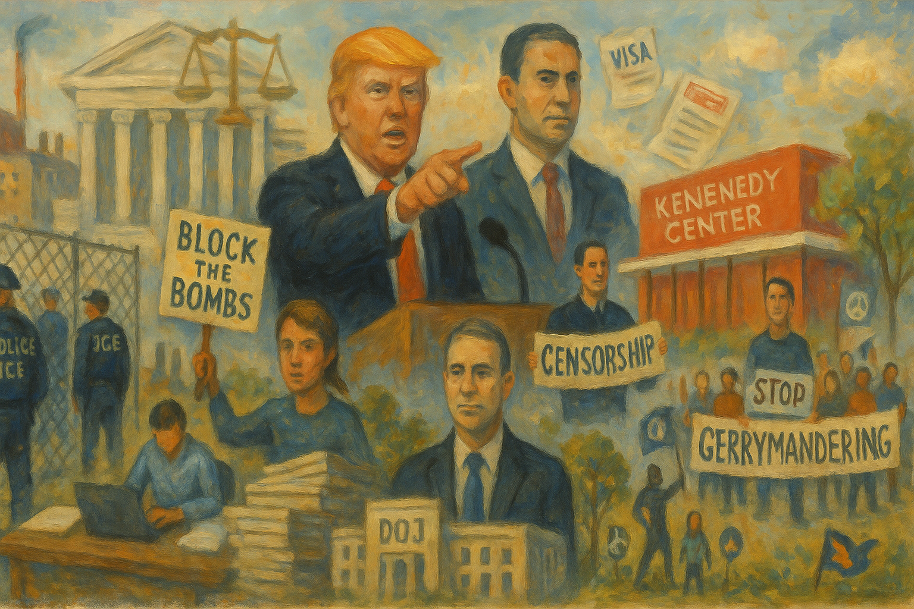

<!-- Generated by build_publish_week_v1 (appendix post) -->
<!-- Header image: image_wide_week50_appendix.png -->

# Week 50 Appendix: A Week Measured by What Held

*Immigration enforcement widened, vetoes punished disfavored places, and a cultural institution changed its own rules — while courts and one peaceful inauguration held the line.*

This was a high-pressure week defined less by a single constitutional rupture than by a broad pattern of executive aggrandizement, coercive immigration governance, retaliatory use of state power, and symbolic capture of public institutions. The strongest pressures fell on traits involving rule by executive fiat, stratified citizenship, weaponized law, politicized civil service, and federal punishment of disfavored communities or jurisdictions. Immigration was the clearest structural arena: denaturalization quotas, paused proceedings for nationals of 19 countries, aggressive street and courthouse enforcement, and a major ICE recruitment expansion all pushed toward a system where legal status is contingent and coercive. At the same time, Trump-linked vetoes of bipartisan water and Everglades measures suggested retaliation as a governing method, while the Kennedy Center bylaw change showed how institutional rules can be rewritten to convert public bodies into instruments of personal glorification. Courts provided some countervailing repair, especially in the CFPB funding order and the dismissal of charges in an ICE-related case, but those checks were partial and reactive rather than system-setting.

Power and Authority

1. Donald Trump urged Senate Republicans to eliminate the filibuster (2025-12-27): The push targeted a key minority check in the Senate and would have made it easier for a governing majority to pass laws without cross-party restraint.

2. Federal agents deployed in military fatigues in major cities (2025-12-27) *[single source]*: The use of heavily armed federal personnel in civilian spaces signaled a more coercive federal posture toward protest and local unrest.

3. The U.S. military conducted strikes in Nigeria and Syria (2025-12-28): The strikes extended executive use of force abroad and raised oversight questions about how military action was framed and authorized.

4. USCIS issued guidance seeking 100 to 200 denaturalization case referrals per month (2025-12-30): The guidance expanded the state's capacity to strip citizenship, increasing insecurity for naturalized Americans and widening executive leverage over legal status.

5. USCIS paused immigration proceedings for nationals of 19 countries (2025-12-30) *[single source]*: The pause blocked paths to citizenship and residency for targeted nationalities, concentrating executive control over who could complete lawful status processes.

6. ICE announced a $100 million recruitment campaign for new agents (2025-12-31): The campaign aimed to rapidly expand deportation capacity, deepening the federal government's coercive reach in immigration enforcement.

7. The Kennedy Center board changed its bylaws to limit voting to Trump-appointed trustees (2025-12-31): The bylaw change narrowed outside oversight and concentrated control of a public cultural institution in a politically aligned bloc.

8. Donald Trump ended efforts to deploy National Guard troops in Democratic-led cities (2025-12-31) *[single source]*: The reversal followed court setbacks and highlighted how federal troop deployment had been used as leverage against disfavored local governments.

9. Donald Trump vetoed an Everglades project bill affecting the Miccosukee Tribe (2026-01-01) *[single source]*: The veto withheld federal support from a tribal and environmental project, showing executive power used in a way that burdened a disfavored community.

10. Donald Trump vetoed a bipartisan Colorado drinking water bill (2026-01-01): The veto blocked a unanimously passed public works measure and raised concerns that federal power was being used to punish political opponents.

11. President Trump issued an executive order blocking HieFo Corporation from acquiring Emcore assets (2026-01-02): The order showed direct presidential intervention in a private transaction on national security grounds, reinforcing broad executive control over strategic assets.

12. The White House asserted personal control over immigration policy, criminal law, and renditions (2026-01-02) *[single source]*: The reported posture blurred legal and institutional limits by concentrating coercive state functions in the presidency.

Institutions and Governance

1. The House of Representatives passed a censure resolution against Al Green (2025-12-27): The censure used formal House discipline against a member's protest during a joint session, testing how dissent is handled inside Congress.

2. The House of Representatives passed a resolution condemning Chuy Garcia's alleged election manipulation (2025-12-27): The resolution addressed a lawmaker's conduct tied to succession and electoral fairness, using House procedure to police representation norms.

3. Indivisible urged the Senate to block unauthorized attacks on Venezuela (2025-12-27): The appeal centered on Congress's role in checking unilateral military action and preserving legislative oversight of war powers.

4. FBI Director Kash Patel announced that the FBI would close the J. Edgar Hoover Building and relocate headquarters functions (2025-12-27): The move affected a major federal law enforcement institution's structure and spending after years of failed relocation efforts and legal dispute.

5. The Centers for Disease Control and Prevention announced a meeting of the Advisory Board on Radiation and Worker Health subcommittee (2025-12-29): The notice maintained an advisory process that lets outside experts and the public weigh in on worker compensation and safety policy.

6. A federal judge dismissed the indictment against Carlitos Ricardo Parias with prejudice (2025-12-29): The ruling enforced due process limits on immigration-related prosecution and barred the government from refiling the same charges.

7. A federal magistrate judge held a detention hearing for Brian Cole Jr. in the D.C. pipe bomb case (2025-12-30): The hearing showed the courts continuing to process major January 6-related criminal allegations through ordinary judicial procedures.

8. Judge Amy Berman Jackson ordered the Trump administration to continue funding the CFPB (2025-12-30): The order checked an executive effort to starve a congressionally created agency and reaffirmed judicial enforcement of statutory design.

9. The House Judiciary Committee heard Jack Smith's testimony and released his deposition transcript (2025-12-31): The testimony and transcript added oversight transparency around the prosecution of a former president and the evidence behind those cases.

10. The U.S. Court of Appeals allowed the administration to end Medicaid funding for Planned Parenthood in 22 states and Washington, D.C. (2025-12-31): The ruling let a major funding cutoff take effect, showing how appellate courts can reshape access to services through institutional review.

11. Vermont and New York enacted climate superfund laws requiring polluters to help pay for climate costs (2026-01-01) *[single source]*: The laws used state legislative power to impose accountability on major emitters and shift some climate costs away from the public.

12. Zohran Mamdani was sworn in as mayor of New York City (2026-01-01): The inauguration marked a lawful transfer of local executive authority through electoral succession.

13. The Environmental Protection Agency renewed the Local Government Advisory Committee charter and sought nominations for its small communities subcommittee (2026-01-02): The renewal preserved a formal channel for local governments to advise a federal agency, supporting representation in administrative policymaking.

14. Tennessee House Republicans expelled Justin Pearson and Justin Jones after their gun policy protest (2026-01-02): The expulsions showed legislative discipline being used against floor protest, raising questions about representation and internal democratic tolerance.

15. A federal judge ruled that Brian Cole Jr. must remain in jail before trial (2026-01-02) *[single source]*: The detention ruling reflected the judiciary's role in balancing due process with public safety in a high-profile political violence case.

16. The court in American Federation of Government Employees v. Office of Management and Budget granted the government's motion to dismiss the appeal (2026-01-02): The order marked a concrete litigation step in a challenge involving federal administrative action and judicial review.

17. The parties in American Oversight v. U.S. Department of Homeland Security filed a joint status report on progress responding to FOIA requests (2026-01-02): The filing documented court-supervised agency compliance efforts in a records dispute, reinforcing procedural accountability.

18. The parties in Kettlewell v. Noem voluntarily dismissed the appeal of preliminary injunction orders (2026-01-02): The dismissal changed the posture of an ongoing legal challenge and left the lower court's injunction-related rulings in place.

19. The plaintiffs in Shapiro v. Department of Agriculture appealed the district court's December 3 order to the Third Circuit (2026-01-02): The appeal moved an administrative dispute into a higher court, continuing institutional review of federal action.

20. The defendants in State of California v. United States Department of Transportation appealed to the First Circuit (2026-01-02): The appeal extended a federal-state legal conflict into the appellate system, showing continued judicial contest over agency authority.

Economic Structure

1. ICE deported Oregon vineyard manager Moises Sotelo to Mexico (2025-12-27) *[single source]*: The deportation disrupted a family business and local labor stability, showing how enforcement decisions can reshape economic security in a community.

2. The United States recorded declining murder rates through 2025 (2025-12-27) *[single source]*: Lower violent crime can strengthen public confidence and civic life by reducing fear and improving everyday security in communities.

3. The Trump administration implemented major cuts to healthcare, science, and anti-hunger programs (2025-12-27) *[single source]*: The cuts reduced support for core public goods, weakening the material conditions that help people participate in civic and political life.

4. The United States recorded an increase in life expectancy (2025-12-27) *[single source]*: Improved life expectancy reflected stronger social conditions that support public well-being and the capacity for stable civic participation.

5. The Department of Homeland Security adjusted civil monetary penalties for inflation (2025-12-29): The rule maintained the real value of federal penalties, preserving the state's enforcement capacity in regulated sectors.

6. The Federal Communications Commission sought comments on a workplace discrimination complaint information collection (2025-12-29): The notice affected how a federal regulator gathers data needed to process discrimination complaints and oversee compliance.

7. The Food and Drug Administration announced fiscal year 2026 OTC monograph order request fee rates (2025-12-29): The fee notice shaped the cost of market access for drug makers and funded federal oversight of over-the-counter products.

8. The Food and Drug Administration announced a roundtable on premarket tobacco applications for electronic nicotine products (2025-12-29): The roundtable opened a regulatory channel for industry input on product approval rules that affect public health and market entry.

9. The Food and Drug Administration authorized emergency use of two animal drugs for New World screwworm treatment (2025-12-29): The authorizations expanded emergency regulatory power to address an animal health threat with economic and public health effects.

10. The Food and Drug Administration determined regulatory review periods for ADZYNMA, ALHEMO, LEQEMBI, OJEMDA, ROMVIMZA, and ZELSUVMI (2025-12-29): The determinations affected possible patent extensions, shaping drug exclusivity, competition, and future pricing power.

11. The Food and Drug Administration proposed exempting certain radiology devices from premarket notification requirements (2025-12-29): The proposal would ease market entry for some devices while relying more on post-market controls than preclearance.

12. The Food and Drug Administration proposed withdrawing approval of three abbreviated new drug applications (2025-12-29): The proposal enforced reporting compliance by threatening removal of products from the legal market.

13. The Food and Drug Administration submitted an information collection on PET drug manufacturing practices for OMB review (2025-12-29): The submission sustained federal oversight of manufacturing standards that govern safety and quality in a specialized drug sector.

14. OSHA granted permanent compressed-air variances for two tunnel projects (2025-12-29): The variances altered baseline worker safety rules for major construction projects, balancing regulatory flexibility against uniform protections.

15. The FBI deployed additional resources to Minnesota to investigate large fraud schemes (2025-12-29): The move expanded federal enforcement around misuse of public funds, with implications for trust in government programs and equal treatment.

16. Corporate bankruptcies and household finances showed rising stress (2025-12-30) *[single source]*: Growing insolvency and household strain pointed to weaker economic security, which can narrow citizens' room to engage in public life.

17. The Census Bureau submitted a questionnaire pretesting information collection request to OMB (2025-12-30): The request supported federal survey design capacity that underpins reliable public data for representation and policy decisions.

18. The Environmental Protection Agency approved South Carolina's regional haze plan (2025-12-30): The approval enforced a state air quality strategy, showing continued federal-state regulation of pollution affecting shared public resources.

19. The Environmental Protection Agency granted Clean Harbors Lone Mountain a no-migration variance from land disposal restrictions (2025-12-30): The variance relaxed standard hazardous waste limits for one facility, illustrating how regulators can tailor compliance burdens for industry.

20. The Environmental Protection Agency submitted five information collection requests to OMB on airbags, grain elevators, kraft pulp mills, nonroad engines, and TSCA review (2025-12-30): The submissions preserved reporting systems that let regulators monitor compliance across transportation, manufacturing, and chemical sectors.

21. The Environmental Protection Agency submitted a pesticide data call-in information collection request to OMB (2025-12-30): The request sustained the data pipeline regulators use to assess pesticide safety and enforce federal standards.

22. NIOSH began evaluating a petition for Special Exposure Cohort designation for former United Nuclear Corporation workers (2025-12-30): The review could expand compensation for workers harmed by past exposure, linking administrative process to state accountability for labor risk.

23. The Federal Communications Commission sought comments on tariff review plan information collection (2025-12-30): The notice affected how telecom rate data is gathered and reviewed, shaping oversight of incumbent carriers.

24. The Social Security Administration faced backlogs exceeding 6 million cases (2025-12-30) *[single source]*: Large delays in a core benefits agency weakened access to public services that many people need for basic economic stability.

25. Japan's government and firms advanced a broad set of investment, labor, governance, semiconductor, and immigration changes (2025-12-30) *[single source]*: The developments showed how state policy can reshape labor markets, foreign investment, and industrial capacity through coordinated economic governance.

26. Local politicians embraced reducing regulatory costs for small businesses (2025-12-30) *[single source]*: The push aimed to lower barriers to entry, affecting who can participate in local economic life and benefit from city policy.

27. U.S. cities saw rents fall as housing supply increased (2025-12-30) *[single source]*: Lower rents from added housing suggested that land-use and building policy can materially widen economic access in urban areas.

28. The U.S. government used tariff carve-outs that reduced the impact of announced tariff rates (2025-12-30) *[single source]*: The carve-outs showed executive trade policy being adjusted through exemptions that changed who bore the costs of tariffs.

29. OSHA expanded or proposed expanding Nationally Recognized Testing Laboratory authority and extended two information collections (2025-12-31): The actions updated the private testing and paperwork framework through which workplace and product safety rules are administered.

30. The Environmental Protection Agency corrected fuel regulations and extended compliance deadlines for steam electric power plants (2025-12-31): The actions adjusted the timing and clarity of environmental compliance duties for major energy and fuel sectors.

31. The DEA and HHS extended COVID-era telemedicine flexibilities for prescribing controlled substances through 2026 (2025-12-31): The extension preserved remote access to care while delaying a stricter in-person regulatory model for controlled medications.

32. China imposed a 55 percent tariff on U.S. beef and reduced soybean purchases (2025-12-31) *[single source]*: The trade move increased pressure on U.S. farmers and showed how foreign tariff policy can reshape domestic economic constituencies.

33. Enhanced Affordable Care Act tax credits expired and raised health insurance costs for millions (2026-01-01): The expiration made coverage less affordable, weakening a public support structure that affects equal access to health and economic security.

34. The Trump administration terminated the National Links Trust lease for public golf courses in Washington, D.C. (2026-01-01): The termination disrupted management of a public asset and raised concerns about arbitrary control over public land and contracts.

35. The Trump administration delayed higher tariffs on furniture and cabinets and reduced planned duties on Italian pasta (2026-01-01) *[single source]*: The tariff changes showed discretionary trade policymaking that can quickly shift costs for firms, consumers, and foreign partners.

36. The Environmental Protection Agency approved Colorado air plan revisions, delegated NESHAP authority to Oklahoma, revised the taconite plan, and revoked a 2024 source reclassification rule (2026-01-02): The package changed how air pollution rules are allocated and enforced across states and industries, affecting both local control and compliance burdens.

37. The Food and Drug Administration revoked two COVID-19 test authorizations and barred generic approval for MYSOLINE suspension after finding it was withdrawn for safety reasons (2026-01-02): The actions removed products from the regulatory pathway in the name of safety, shaping access to diagnostics and medicines.

38. The General Services Administration updated mileage reimbursement rates and raised the minimal value threshold for foreign gifts (2026-01-02): The updates changed routine federal compensation and ethics administration rules that structure everyday government operations.

39. The Transportation Security Administration revised its pipeline security information collection (2026-01-02): The revision strengthened the reporting framework used to oversee cybersecurity and security practices in critical energy infrastructure.

40. The North Carolina General Assembly planned another round of tax cuts while delaying a full state budget (2026-01-02) *[single source]*: The plan shifted fiscal priorities toward tax reduction while putting pressure on child care, health costs, and other public services.

Civil Rights and Dissent

1. Immigration enforcement officers dragged immigrants from cars and courthouse hallways (2025-12-27): The tactics raised due process concerns by using force in spaces where people seek transit or legal process, increasing fear around basic civic access.

2. Indivisible urged the public to oppose administration policies targeting trans youth (2025-12-27) *[single source]*: The call reflected organized resistance to policies seen as narrowing equal treatment and bodily autonomy for a vulnerable group.

3. An Oklahoma prosecutor charged Cody Wayne Adams with first-degree manslaughter after a fatal stray-bullet shooting (2025-12-28): The charge showed ordinary criminal accountability being applied after negligent gun use caused a civilian death.

4. Artists canceled performances at the Kennedy Center in protest (2025-12-30): The cancellations used cultural withdrawal as dissent against political control of a public institution.

5. Mar-a-Lago staff and former employees described allegations that young spa workers were sent to Jeffrey Epstein for house calls (2025-12-31): The allegations pointed to possible exploitation of young women within an elite social setting, raising questions about protection and accountability.

6. An off-duty ICE agent killed Keith Porter Jr. (2026-01-01): The killing intensified scrutiny of immigration enforcement personnel and became a focal point for protest over state violence and accountability.

7. The FBI announced it had thwarted a planned New Year's Eve attack in North Carolina (2026-01-02): The case involved a plot targeting Jews, Christians, and LGBTQ+ people, underscoring the state's role in protecting vulnerable groups from political violence.

8. North Carolina voting rights activists planned a Long March against gerrymandering (2026-01-02) *[single source]*: The planned march challenged racial disenfranchisement and used public protest to demand fair representation.

Information, Memory and Manipulation

1. CBS removed an investigative report on CICOT from official channels (2025-12-27): The removal limited access to reporting on a matter of public concern and highlighted pressure points in media gatekeeping.

2. The Department of Justice was accused of redacting and limiting the release of Epstein files (2025-12-27): The dispute raised concerns that politically sensitive records were being managed in ways that weakened transparency and public trust.

3. Donald Trump claimed Israel's president had said a pardon for Benjamin Netanyahu was on its way (2025-12-30): The disputed claim inserted an unverified statement into a sensitive rule-of-law matter involving a foreign leader facing criminal charges.

4. Donald Trump amplified false Kremlin claims about Volodymyr Zelenskyy and Vladimir Putin (2025-12-30) *[single source]*: Repeating a fabricated foreign narrative distorted public understanding of an international conflict and weakened information integrity.

5. Trump allies and campaign-linked senders used deceptive fundraising emails and surveys (2025-12-30) *[single source]*: The tactics blurred political communication and fraud-like solicitation, undermining trust in campaign messaging and informed consent.

6. The Department of Justice reviewed more than 5 million pages of Epstein-related documents and acknowledged additional undisclosed records (2025-12-31): The scale and delay of the review raised accountability concerns about whether politically sensitive records were being fully and promptly disclosed.

7. Donald Trump and an official White House account shared false imagery about wind turbines killing bald eagles (2025-12-31) *[single source]*: The posts spread false visual claims from high-level political channels, distorting public debate on energy policy.

8. The Department of Homeland Security used a Japanese artist's work without permission in deportation messaging (2026-01-02): The use of appropriated art in official propaganda-style messaging showed the state shaping public sentiment through unauthorized cultural imagery.

9. Republican leaders of the North Carolina Select Committee on Oversight and Reform attacked the Chapel Hill school district (2026-01-02) *[single source]*: The attack targeted a public education institution in a way that could chill local control over curriculum and school governance.

10. The Environmental Protection Agency published a notice of availability for environmental impact statements (2026-01-02): The notice preserved public access to environmental review records, supporting informed participation in federal decision-making.

11. Donald Trump shopped for luxury stone for a White House ballroom (2026-01-02): The episode drew attention to symbolic use of the presidency and how official space can be shaped around personal image and display.

12. The House Oversight and Judiciary ecosystem around Jack Smith and Epstein records generated competing disclosures and accusations over politically sensitive documents (2025-12-31) *[single source]*: The week's document fights showed how control of records can become a central arena for shaping public memory and accountability.

