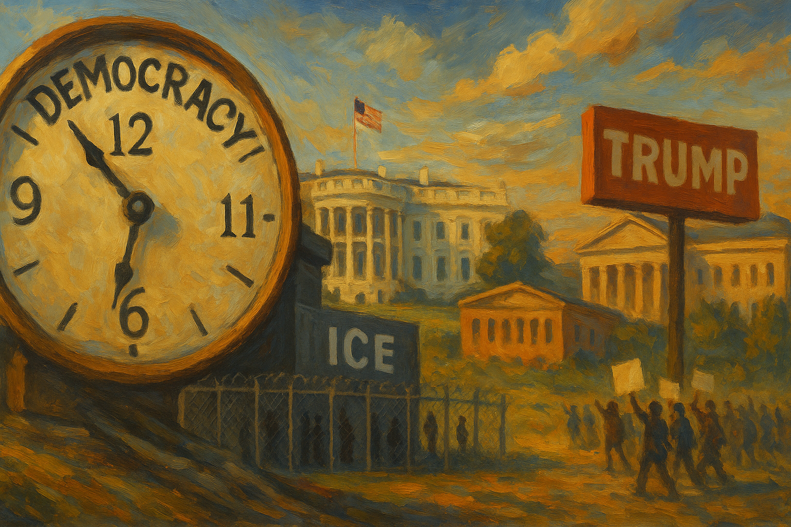

<!-- Generated by build_publish_week_v1 -->
<!-- Header image: image_wide_week50.png -->

# Week 50: A Week Measured by What Held

*Immigration enforcement widened, vetoes punished disfavored places, and a cultural institution changed its own rules — while courts and one peaceful inauguration held the line.*

The week did not arrive as rupture. It arrived as accumulation: the same tools applied again, with more confidence and less friction than before. Immigration enforcement widened its reach. A cultural institution changed its rules. Vetoes fell on disfavored places. Records stayed locked or half-released. None of it announced itself as extraordinary. That absence of drama was itself the week's quiet signal.

At the close of the prior period, the Democracy Clock stood at 7:43 p.m. It closed this week at the same time, a net movement of zero minutes. The pressures were real and widely spread. Executive reach over citizenship expanded. Politicization of federal law enforcement deepened. The line between administration and retaliation kept stretching. But these forces met a counterweight: continuing judicial checks, a peaceful mayoral inauguration, and legislative oversight that still functioned, however imperfectly. The clock held because escalation and resistance moved in near balance, not because the week was calm.

The most significant thread ran through immigration. USCIS guidance sought one hundred to two hundred denaturalization referrals a month, treating citizenship as a renewable permission rather than a settled fact. Alongside it came a pause on immigration proceedings for nationals of nineteen countries, freezing green cards and naturalization applications by country of origin. These were not isolated bureaucratic notices. They arrived the same week federal agents dragged people from cars and courthouse hallways, and the same week ICE announced a hundred-million-dollar, yearlong recruitment campaign styled as wartime mobilization. Together they described a system in which legal status had become conditional, tied to nationality, and enforced by force in the very places where people expect due process to hold.

The human cost of that enforcement showed itself starkly. An off-duty ICE agent killed Keith Porter Jr. on New Year's Eve. The killing sharpened public scrutiny of who enforcement agents are and what accountability applies to them. A vineyard manager in Oregon was deported, unraveling a family business built over years. These were not policy abstractions. They were consequences, delivered to particular people, inside a system that had grown less patient with individual circumstance.

Yet the same week produced a genuine institutional check. A federal judge dismissed, with prejudice, the indictment against a TikTok streamer shot by a federal agent, barring the government from refiling. That ruling mattered. It showed courts still able to enforce due process limits on immigration-related prosecution, even as the machinery around it grew more coercive. The White House, for its part, was reported to be asserting direct personal control over immigration policy, criminal law, and renditions — a posture that blurred the line between administration and command.

Federal power moved in a second, related direction: retaliation against disfavored places. Trump vetoed a bipartisan Colorado drinking water bill that had passed unanimously, a veto tied explicitly to a grudge against the state's governor. He vetoed a bill funding an Everglades restoration project benefiting the Miccosukee Tribe. Both measures had cleared normal legislative process. Both were blocked anyway. Around the same time, an effort to send National Guard troops into Democratic-led cities was abandoned, following court setbacks that made the deployment increasingly untenable. An executive order blocked a private acquisition of Emcore assets on national security grounds, extending the same discretionary reach into commercial transactions.

None of these actions required new law. Each relied on power the presidency already held, applied with a visible eye toward who had earned favor and who had not. The pattern is not chaos; it is selectivity, dressed in the language of neutral administration. Congress attempted an override of the water bill veto and failed, leaving the veto standing. Even a bipartisan check could be absorbed without consequence.

The Kennedy Center offered a different register of the same instinct. Its board rewrote bylaws to limit voting rights to Trump-appointed trustees, clearing the way to add the president's name to the institution. Artists responded by canceling performances, a form of dissent that withdrew cultural participation rather than petitioned for change. The bylaw revision needed no legislation, no emergency powers — only patience and control of the board, a quieter method of capture that turned a public cultural body into an instrument of personal display. That same week, Trump was seen personally selecting marble and onyx for a new White House ballroom, a small but telling echo of the same impulse toward monument-building with public resources.

Records control became its own contested arena. The Department of Justice acknowledged reviewing more than five million pages of Epstein-related documents, far beyond earlier disclosed figures, while facing accusations of redacting and delaying release of materials touching politically sensitive names. The scale of the review complicates any simple story of suppression, since genuine capacity limits may explain some of the delay. But the pattern held: incomplete disclosure touching the powerful deepened suspicion that transparency bends around elite interests. In parallel, the House Judiciary Committee heard testimony from former special counsel Jack Smith and released his deposition transcript, a competing thread in which disclosure, not concealment, prevailed. The week's information conflict was less about any single scandal than about who controls the record, and on what timeline.

Falsehoods moved through more ordinary channels as well. Trump claimed Israel's president had said a pardon for Benjamin Netanyahu was imminent, a claim the Israeli president's office disputed. He amplified a fabricated Kremlin story accusing Ukraine of attacking Putin's residence. Deceptive fundraising emails disguised as public surveys kept circulating through campaign-linked channels. A false image claiming wind turbines had killed a bald eagle spread through an official White House account. None of these alone reshaped policy. Together they showed that the highest political channels remained willing instruments for distortion, not just fringe noise.

Legislative bodies turned their disciplinary tools against dissent inside their own chambers. The House censured Al Green for disrupting a joint session. Tennessee Republicans expelled Justin Pearson and Justin Jones after a gun policy protest on the House floor. These were formal, procedurally sound actions. They fell on members whose offense was disruption in service of a cause, not any breach of ordinary conduct. Outside the chambers, resistance continued on its own terms. North Carolina voting rights activists planned a Long March against gerrymandering. Indivisible urged public opposition to policies targeting transgender youth. Dissent did not disappear; it shifted arenas, moving from the floor to the street.

Courts, for their part, kept functioning as a partial brake rather than a decisive one. Judge Amy Berman Jackson ordered the administration to continue funding the Consumer Financial Protection Bureau, checking an executive effort to starve a congressionally created agency of its statutory resources. A federal magistrate proceeded normally with a detention hearing in the January 6-era pipe bomb case. Multiple appellate matters, touching federal employee unions, FOIA compliance, and agency authority, moved through ordinary channels of review. None of these rulings reversed the week's larger direction, but their persistence mattered. The machinery of judicial review had not stopped, even where it could not fully counter what it reviewed.

Not every judicial outcome cut against executive power. An appeals court allowed the administration to end Medicaid funding for Planned Parenthood in twenty-two states and Washington, D.C. The ruling let a major funding cutoff take effect and reduced access to services for people who depended on them. It stood as a reminder that the courts' checks were uneven, not uniformly protective, and that appellate review could as easily ratify executive action as restrain it.

Beneath these episodes ran a steadier, quieter erosion of material security. The administration cut healthcare, science, and anti-hunger programs. Enhanced Affordable Care Act tax credits expired on schedule, raising insurance costs for millions of people. The Social Security Administration faced a backlog exceeding six million cases. Corporate bankruptcies and household financial stress both climbed. None of this required a single dramatic decision. It accumulated instead, narrowing the everyday margin that lets people take part fully in civic life when their material footing is secure.

One moment stood apart from the week's general drift. Zohran Mamdani was sworn in as mayor of New York City, a lawful transfer of local executive power completed without incident. It was a small, ordinary thing, the kind of event that barely registers as news in a healthy system. In a week defined mostly by executive assertion and institutional strain, its very unremarkability was worth noting.

The House Judiciary Committee's Jack Smith hearing and the detention proceedings in the D.C. pipe bomb case are already scheduled to continue. Further testimony and rulings are expected as those records and cases move forward.

Week 50 closed without a single defining rupture, and that absence is itself part of the record. Citizenship grew more conditional. Federal power fell more often on disfavored states, tribes, and institutions. A cultural body was quietly refashioned into an instrument of personal glorification. Courts still checked some of this, unevenly and reactively, but not none of it. What emerges across these developments is not collapse but consolidation, proceeding through guidance memos, bylaw changes, and vetoes rather than any single dramatic seizure of power. That form of erosion is harder to name. For the same reason, it is harder to resist.

<!-- Synopses for cross-posting -->
Long Synopsis: Week 50 brought no single rupture, only accumulation. USCIS sought mass denaturalization referrals and paused immigration proceedings for nationals of nineteen countries, while ICE launched a hundred-million-dollar recruitment drive and agents made aggressive arrests in courthouses and streets. An off-duty ICE agent killed Keith Porter Jr. Trump vetoed bipartisan Colorado and Everglades bills tied to personal grievance, and the Kennedy Center rewrote its bylaws to concentrate control among his appointees, prompting artist cancellations. The DOJ acknowledged reviewing over five million Epstein-related pages amid redaction disputes, while the House Judiciary Committee released Jack Smith's testimony. Courts pushed back selectively: a judge protected CFPB funding, another dismissed an ICE-related prosecution with prejudice. Zohran Mamdani's inauguration proceeded without incident. The Democracy Clock held at 7:43 p.m., unmoved, as escalation and resistance roughly balanced.
Short Synopsis: Citizenship grew more conditional, federal power fell harder on disfavored places and institutions, and a cultural body was quietly repurposed for personal glorification. Courts and ordinary process still checked some of it. The clock held at 7:43 p.m. — not calm, but balanced.

