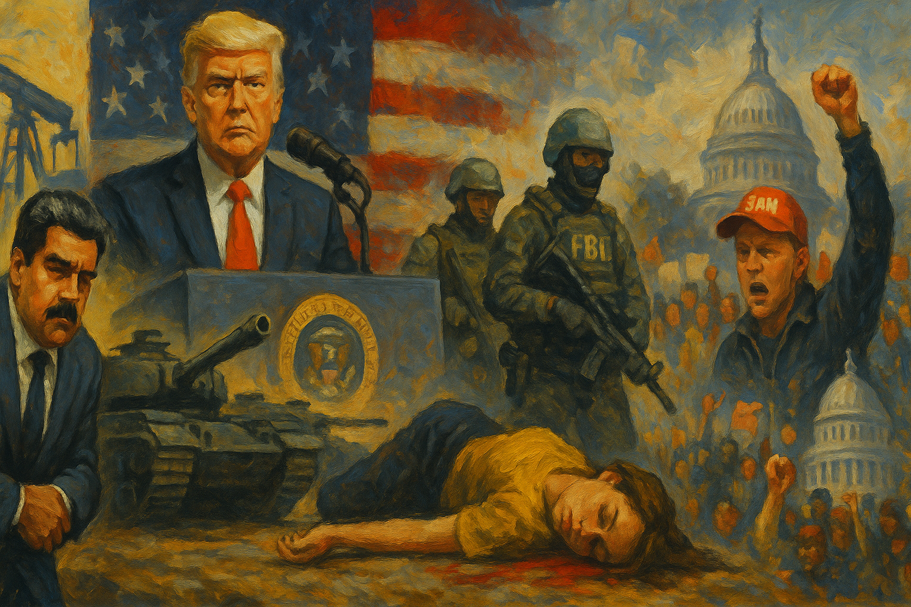

<!-- Generated by build_publish_week_v1 (appendix post) -->
<!-- Header image: image_wide_week51_appendix.png -->

# Week 51 Appendix: One Week, Two Directions, No Motion

*The executive reached further than ever into war powers and enforcement while courts, senators, and Minnesota pushed back just enough to hold the clock still.*

This was a high-pressure week for democratic structure, defined by two overlapping patterns: unilateral executive action abroad and coercive federal enforcement at home. The most consequential development was the Venezuela operation, in which the administration used military force without meaningful congressional consultation, then openly discussed control of Venezuelan oil and dismissed international-law constraints. That cluster sharply worsened traits tied to unchecked executive power, separation of powers, rule-of-law limits, crony capitalism, and the use of crisis for insider gain. Domestically, the fatal ICE shooting of Renee Nicole Good in Minneapolis became a second major pressure point: a large federal immigration surge, disputed official accounts, exclusion of state investigators, and top-level rhetorical defense of the shooting all intensified concerns about politicized law enforcement, stratified citizenship, suppression of dissent, and state narrative control. A third theme was institutional opacity and retaliation, especially the firing of DOJ’s senior ethics attorney and the DOJ’s continued failure to comply with the Epstein Files Transparency Act. Countervailing democratic repair existed, but mostly through resistance rather than system self-correction: courts checked some executive claims, Congress advanced a War Powers response, and state and local officials publicly challenged federal narratives.

Power and Authority

1. Mayor Zohran Mamdani revoked executive orders issued by former mayor Eric Adams after September 26, 2024 (2026-01-03): The move reversed orders tied to a corruption-shadowed prior administration and signaled a reset on executive accountability in city government.

2. President Trump posted that the United States would come to the rescue if Iran violently suppressed peaceful protesters (2026-01-03) *[single source]*: The statement signaled a willingness to threaten force abroad through personal executive messaging rather than formal democratic process.

3. The Trump administration cut climate-resilience funding, reduced NOAA and National Weather Service staffing, disbanded advisory councils, restricted FEMA spending, and suspended resilience grant programs (2026-01-04): These executive actions weakened disaster readiness, reduced expert input, and narrowed the state’s capacity to protect the public through accountable administration.

4. President Trump ordered the capture of Nicolás Maduro without notifying Congress (2026-01-04): The operation tested war-powers limits by using military force without prior legislative notice or approval, concentrating foreign-policy power in the presidency.

5. President Trump ignored the Impoundment Control Act and asserted executive control over funds and troop deployments (2026-01-06) *[single source]*: Defying spending law and bypassing Congress on force claims expanded unilateral executive authority at the expense of legislative control.

6. The White House claimed January 6 attackers were peaceful patriotic protesters (2026-01-07) *[single source]*: The statement used executive messaging to recast a violent attack on constitutional transfer of power, weakening accountability for anti-democratic conduct.

7. President Trump issued an executive order on defense contracting performance and contractor payouts (2026-01-07): The order used direct presidential power to reshape contractor behavior in a core national-security sector without legislative action.

8. The Trump administration drafted plans to cut FEMA staffing by more than half (2026-01-08): The proposed cuts would centralize crisis response through a weakened agency, reducing state capacity and public protection during emergencies.

9. President Trump captured Nicolás Maduro without congressional authorization (2026-01-09) *[single source]*: The administration continued to frame a unilateral military seizure as routine executive action, further eroding congressional checks on force.

10. President Trump signed an executive order shielding Venezuelan oil revenue from court process and placing disbursement under executive control (2026-01-09): The order concentrated control over foreign-linked funds in the executive branch and limited outside legal review of those assets.

11. The administration publicly defended the ICE agent who killed Renee Good (2026-01-09): Top-level defense of a disputed federal shooting signaled executive backing for coercive force before independent review was complete.

Institutions and Governance

1. Democracy Docket reported on Trump-related legal challenges affecting election rules and democratic access (2026-01-03) *[single source]*: The litigation roundup showed that court fights over Trump-related actions remained a live channel for shaping election administration and access.

2. The Ninth Circuit ruled California's open-carry ban in large counties was unconstitutional (2026-01-03) *[single source]*: The ruling altered the balance between state regulatory authority and constitutional rights through appellate judicial review.

3. Attorney General Pam Bondi fired DOJ senior ethics attorney Joseph Tirrell (2026-01-03): Removing a senior ethics official without explanation weakened internal safeguards meant to keep law enforcement administration impartial and accountable.

4. The House of Representatives did not take immediate impeachment action over the Venezuela operation (2026-01-04) *[single source]*: Congressional delay highlighted the weakness of legislative oversight at a moment of disputed executive military action.

5. Judge Hannah Dugan resigned after her obstruction conviction in an immigration enforcement case (2026-01-04): The resignation underscored how criminal proceedings against a judge can reshape judicial independence and accountability debates.

6. The Supreme Court left in place limits on Trump's National Guard deployment and prompted troop removal from several cities (2026-01-04): The decision reinforced judicial limits on domestic military use and checked executive claims of unilateral deployment power.

7. The Department of Justice missed the deadline to justify withheld Epstein files to Congress (2026-01-04): Missing a statutory reporting deadline weakened transparency compliance and frustrated legislative oversight of a high-profile records release.

8. The Environmental Protection Agency sought nominations for Science Advisory Committee on Chemicals peer reviewers and committee members (2026-01-05): The notices opened a formal public process for scientific appointments and review, supporting procedural transparency in agency governance.

9. Members of Congress reported they had not been briefed on the Venezuela strikes (2026-01-05): The lack of briefing showed a breakdown in routine oversight channels for military action and intelligence notification.

10. Nicolás Maduro was arraigned in federal court in New York and pleaded not guilty (2026-01-05): The court proceeding placed a foreign head-of-state seizure into the U.S. judicial system, testing legal process and institutional legitimacy.

11. American Oversight sued the FBI and DOJ over unanswered FOIA requests (2026-01-05): The suit used the courts to challenge executive secrecy and enforce records law against federal law-enforcement agencies.

12. The District of Oregon stayed remaining claims in Oregon v. Trump pending Ninth Circuit appeals (2026-01-05): The stay paused lower-court proceedings and shifted the pace of institutional review to the appellate process.

13. The Rhode Island Coalition Against Domestic Violence voluntarily dismissed its appeal in litigation against Kennedy (2026-01-05): The dismissal narrowed one active appellate challenge and changed the litigation path for oversight of executive action.

14. The Arizona Supreme Court evacuated its building after an explosive package was found (2026-01-05): A direct security threat disrupted a state high court and underscored the vulnerability of judicial institutions to intimidation.

15. The Department of Justice sued 22 states for refusing to turn over complete voter lists (2026-01-05) *[single source]*: The lawsuits pressed federal power into state-run election administration and raised privacy and voter-roll purge concerns.

16. Democracy Docket published an opinion arguing that major law firms were retreating from democracy-related work (2026-01-05) *[single source]*: The commentary highlighted how elite legal institutions can shape the capacity of democratic actors to defend voting and constitutional norms.

17. The House balance of power shifted after Representative Doug LaMalfa's death (2026-01-06) *[single source]*: The vacancy narrowed the governing majority and changed the arithmetic for passing legislation and sustaining party discipline.

18. The Department of Justice revealed in court filings that it had released less than 1% of the Epstein files (2026-01-06): The disclosure showed continued noncompliance with a transparency law and deepened concerns about executive resistance to mandated disclosure.

19. The National Rifle Association sued the NRA Foundation over control and alleged misuse of donations (2026-01-06): The case exposed governance conflict inside a major advocacy group whose institutional credibility affects public-policy influence.

20. The Trump administration sued California cities over local natural-gas restrictions (2026-01-06): The lawsuit challenged local policymaking authority and tested the boundary between federal preemption and municipal self-government.

21. Defendants in Zaid v. Executive Office of the President appealed a district court order to the D.C. Circuit (2026-01-06): The appeal moved a dispute over executive-office records or authority into a higher court, extending institutional review.

22. Democratic senators demanded an accounting of law-enforcement personnel reassigned to ICE (2026-01-07) *[single source]*: The letter sought oversight of executive resource shifts that may have weakened other public-safety investigations.

23. Representatives Ro Khanna and Thomas Massie pursued contempt action against Attorney General Bondi over the Epstein files law (2026-01-07): The move asserted Congress's enforcement power against executive noncompliance with a statutory disclosure mandate.

24. A federal judge ordered Lindsey Halligan to justify using the title of U.S. attorney after an unlawful-appointment ruling (2026-01-07): The order tested whether executive appointees could keep exercising prosecutorial authority after a court found their appointment unlawful.

25. The Asbestos Disease Awareness Organization sued federal agencies over unanswered FOIA requests tied to the White House East Wing demolition (2026-01-07): The case sought judicial enforcement of records access where agencies had not responded within statutory deadlines.

26. The Supreme Court denied a stay application in PG Publishing Co. v. NLRB (2026-01-07): The order let an NLRB action proceed and showed the Court's role in shaping the immediate force of agency decisions.

27. Representatives Ro Khanna and Thomas Massie asked a judge to appoint a special master to oversee Epstein file releases (2026-01-08): The request sought judicial supervision of executive compliance after Congress's disclosure mandate was not met.

28. The House of Representatives passed a bill to extend Affordable Care Act subsidies (2026-01-08): The vote showed Congress using ordinary legislation to preserve a major public-benefits program through bipartisan support.

29. Governor Tim Walz called for a full state investigation into the Renee Good shooting (2026-01-08): The announcement asserted state oversight over a disputed federal use-of-force case and pressed for independent accountability.

30. The Senate advanced a War Powers resolution restricting further military action in Venezuela without authorization (2026-01-08): The vote represented a legislative attempt to reclaim constitutional authority over the use of force.

31. The Center for Biological Diversity sued the Fish and Wildlife Service over its refusal to protect the Rio Grande cooter (2026-01-08): The suit challenged agency decision-making through the courts and sought review of whether statutory duties were lawfully carried out.

32. The Colorado Attorney General filed an amended complaint alleging a campaign of retribution by the administration (2026-01-08): The amended filing expanded a state-led court challenge to alleged retaliatory federal conduct.

33. Spouses of H-1B visa holders sued DHS over a rule ending automatic work-permit extensions during renewals (2026-01-08): The case challenged an immigration rule through judicial review and tested procedural fairness in agency policymaking.

34. Defendants in National TPS Alliance v. Noem appealed to the Ninth Circuit (2026-01-08): The appeal extended judicial review of a major immigration-status dispute into the federal appellate system.

35. A federal judge disqualified John Sarcone from investigating Letitia James because his appointment was unlawful (2026-01-08): The ruling reinforced that prosecutorial authority depends on lawful appointment, not political backing alone.

36. The FBI took full control of the Renee Good shooting investigation and excluded Minnesota investigators (2026-01-08): Federal control over the case narrowed outside scrutiny and raised doubts about the independence of the investigative process.

37. Representative Robin Kelly filed articles of impeachment against Homeland Security Secretary Kristi Noem (2026-01-09): The filing used a core legislative accountability tool to challenge executive-branch conduct in immigration enforcement.

38. The U.S. District Court for the District of Columbia dismissed America First Legal Foundation's FOIA suit against the GAO (2026-01-09): The ruling clarified that a legislative-branch agency fell outside FOIA, defining the limits of records access law.

39. The parties in American Oversight v. ICE filed a status report on planned document production (2026-01-09): The filing showed ongoing court-managed oversight of federal records disclosure in immigration enforcement matters.

40. Defendants in Center for Constitutional Rights v. Department of Defense filed a status report on narrowing FOIA requests and response progress (2026-01-09): The report reflected judicially supervised negotiation over the scope and pace of federal records disclosure.

41. The parties in Freedom of the Press Foundation v. DHS reported that DHS and DOJ found no responsive records (2026-01-09): The filing highlighted how records searches themselves can become a contested part of accountability and transparency litigation.

42. The District Court for the District of Columbia stayed International Brotherhood of Electrical Workers v. Trump (2026-01-09): The stay paused one challenge to executive action and delayed a merits ruling on the underlying dispute.

43. The District Court for the District of Columbia stayed National Treasury Employees Union v. Trump (2026-01-09): The stay delayed judicial resolution in a case involving federal employees and executive authority.

44. The Southern District of New York granted a temporary restraining order blocking a funding freeze on child care, TANF, and social-services grants (2026-01-09): The order checked executive control over congressionally authorized funds and protected states' access to public-benefit programs.

45. Judge Chun permanently enjoined parts of Executive Order 14,248 as violating separation of powers (2026-01-09): The ruling reaffirmed that courts can strike executive directives that intrude on legislative authority.

46. The First Circuit granted a limited remand in Victim Rights Law Center v. Department of Education (2026-01-09): The remand reopened district-court consideration of an injunction and showed appellate management of executive-policy litigation.

47. The Supreme Court granted certiorari in several cases, consolidated FCC v. AT&T with Verizon v. FCC, allowed divided argument in Wolford v. Lopez, and released an opinion in Bowe v. United States (2026-01-09): The Court shaped the national legal agenda through case selection, procedure, and a new opinion with binding effect.

48. The EEOC announced a public Sunshine Act meeting on voting procedures and organizational roles (2026-01-09): The notice preserved public visibility into agency governance decisions and procedural changes.

Economic Structure

1. Zohran Mamdani was sworn in as mayor of New York City (2026-01-03): The transition marked a change in control over a major city government with broad consequences for public spending and service priorities.

2. The United States expanded the Earned Income Tax Credit and Child Tax Credit in the policy history discussed this week (2026-01-04): The cited expansion showed how tax policy can redistribute income and reduce poverty through state action.

3. The United States reduced the uninsured rate to 8% in the policy history discussed this week (2026-01-04) *[single source]*: The cited decline showed how public policy can widen access to health coverage and reduce economic insecurity.

4. Blue states spent heavily on infrastructure projects with limited visible results in the policy history discussed this week (2026-01-04) *[single source]*: The account raised accountability questions about whether public spending translated into effective delivery of public goods.

5. California used environmental mandates that underperformed compared with looser-regulation states in the policy history discussed this week (2026-01-04) *[single source]*: The comparison highlighted how regulatory design affects state capacity to deliver energy transition goals.

6. The labor market showed a reduced Black-white employment gap in the policy history discussed this week (2026-01-04) *[single source]*: The cited change pointed to measurable movement in economic inclusion and equal access to work.

7. The DEA set 2026 production quotas for controlled substances and listed chemicals (2026-01-05): The order used federal regulatory power to balance medical supply, research needs, and diversion control in a sensitive market.

8. The EPA approved tribal gasoline-facility permits, issued pesticide guidance notices, finalized chemical risk evaluations, and published new-chemical findings and review notices (2026-01-05): These actions showed routine federal regulation of environmental and chemical markets through notice, review, and risk management.

9. The FDA set regulatory review periods for several drugs and a medical device for patent-extension purposes (2026-01-05): The determinations affected market exclusivity and the economic value of pharmaceutical and device patents.

10. A Hilton hotel in Minnesota canceled reservations for ICE agents and later apologized (2026-01-05): The dispute showed how private firms can become entangled in contested state enforcement activity and public accountability pressures.

11. Paul Singer and Elliott Investment Management acquired Citgo at a discounted price and were reported to benefit from the Venezuela raid (2026-01-05): The overlap between foreign-policy upheaval and private gain raised concerns about insider advantage and policy-driven enrichment.

12. The EPA approved multiple air-plan revisions, expanded an ozone nonattainment area, extended a regional haze deadline, finalized phthalate risk evaluations, handled TSCA confidentiality claims, and withdrew a Michigan SIP rule after comments (2026-01-06): The actions reflected ordinary federal rulemaking and state oversight in environmental governance, including public-comment responsiveness.

13. The FCC tightened robocall mitigation database rules and penalties (2026-01-06): The rule strengthened regulatory enforcement over telecom actors and aimed to protect the public from abusive communications practices.

14. The FDA set the regulatory review period for ZURZUVAE (2026-01-06): The determination affected patent-extension timing and the economic terms of drug market exclusivity.

15. President Trump predicted U.S. oil investment in Venezuela and said taxpayers would help revive its oil industry (2026-01-06): The plan tied public resources and foreign intervention to prospective private energy investment, raising fairness and conflict concerns.

16. The Trump administration proposed a new food pyramid that removed vaccine guidance and encouraged alcohol use (2026-01-07) *[single source]*: The proposal suggested political control over public-health guidance, affecting how state information shapes health and labor outcomes.

17. The Trump administration revoked billions of dollars in child-care funding (2026-01-07) *[single source]*: The cut threatened access to a core support for working families and shifted economic strain onto households and local providers.

18. The DEA opened importer registration processes for controlled substances for several companies (2026-01-08): The notices showed federal gatekeeping over who may enter tightly regulated drug markets and for what purposes.

19. The EPA approved more state air-plan revisions and published new-chemical findings (2026-01-08): The actions continued routine environmental oversight through federal-state coordination and chemical review.

20. OSHA issued corrections to the Hazard Communication Standard (2026-01-08): The corrections maintained clarity in workplace safety rules that govern employer duties and worker protections.

21. World Liberty Financial applied for a national banking license (2026-01-08) *[single source]*: A banking application by a Trump family venture raised conflict-of-interest concerns where private finance and political power may intersect.

22. President Trump and congressional Republicans proposed increasing the military budget to $1.5 trillion (2026-01-08) *[single source]*: The proposal would redirect vast public resources toward defense and away from competing domestic priorities through budget politics.

23. Donald Trump requested $6.2 million from Fulton County for legal fees after charges were dismissed (2026-01-08): The request sought to shift private legal costs onto public funds, raising questions about fiscal accountability.

24. New York City and New York State announced a universal child-care plan (2026-01-08): The plan expanded a public good that can widen economic participation and reduce family dependence on private care markets.

25. President Trump relaxed the Venezuelan oil embargo and announced large oil shipments to the United States (2026-01-08) *[single source]*: The policy shift changed market access in a way that appeared to benefit connected refinery and investment interests after military intervention.

26. The EPA published environmental impact statement notices, approved more state air actions, delegated landfill authority to Ohio, proposed a Superfund settlement, sought comments on hazardous-waste permits, updated New Hampshire SIP materials, and withdrew a hazardous-chemical reporting rule after comments (2026-01-09): These notices showed ongoing regulatory governance through public comment, delegation, settlement, and rule revision.

27. The December jobs report showed weak job growth and downward revisions (2026-01-09) *[single source]*: The report shaped public understanding of economic performance and the policy debate over labor-market stewardship.

28. Ford shifted production plans from electric vehicles toward gas-powered vehicles (2026-01-09) *[single source]*: The move reflected how policy incentives and market signals can redirect industrial strategy and climate-related investment.

29. The Trump administration canceled electric-vehicle subsidies (2026-01-09) *[single source]*: Ending subsidies changed the state's role in steering industrial transition and consumer access to cleaner technology.

Civil Rights and Dissent

1. A Texas detainee in ICE custody died in a case likely to be ruled a homicide (2026-01-03) *[single source]*: A likely homicide finding in immigration detention raised urgent questions about bodily safety and accountability in federal custody.

2. The Answer Coalition and other organizers planned and held protests against U.S. military action in Venezuela (2026-01-03): The demonstrations asserted public dissent against unilateral war-making and demanded constitutional oversight of force.

3. A Kentucky prosecutor and state police charged a woman with fetal homicide after a self-managed abortion (2026-01-05) *[single source]*: The prosecution showed how criminal law can be used to police reproductive autonomy and bodily security.

4. Stanford students faced felony trial over a pro-Palestinian protest (2026-01-05) *[single source]*: The case raised the cost of campus protest and tested the line between criminal enforcement and deterrence of political dissent.

5. The Trump administration deployed about 2,000 immigration agents to Minnesota in Operation Metro Surge (2026-01-06): The surge intensified federal pressure on immigrant communities and expanded coercive enforcement in a targeted state operation.

6. The Trump administration was reported to seize people off the streets and prosecute perceived enemies (2026-01-06) *[single source]*: The reported pattern suggested arbitrary enforcement that threatened due process and equal protection against state coercion.

7. Residents of Sand Springs protested a data-center development and land annexation (2026-01-06) *[single source]*: The protest reflected local resistance to opaque land-use decisions and the defense of community voice against concentrated private power.

8. An ICE agent fatally shot Renee Nicole Good during a Minneapolis immigration operation (2026-01-07): The killing raised major civil-rights concerns about lethal force, immigrant-targeted policing, and accountability for federal agents.

9. Federal officers shot a man in the leg during an arrest attempt in Minneapolis (2026-01-07): A second shooting during the same enforcement climate deepened concerns about escalating force in immigration-related operations.

10. The Venezuelan government detained journalists and restricted protests after Maduro's removal (2026-01-07): The crackdown showed how political crisis can quickly narrow protest rights and press freedom.

11. Governor Tim Walz and Mayor Jacob Frey publicly challenged the federal account of the Renee Good shooting and demanded accountability (2026-01-07): Their pushback defended local democratic oversight and the right to contest federal force narratives in public.

12. Protesters and organizers mobilized vigils and nationwide demonstrations after Renee Good's killing (2026-01-07): The protests showed broad civic resistance to immigration enforcement violence and asserted the legitimacy of public dissent.

13. Jessica Plichta was arrested after speaking about anti-war protest activity in Grand Rapids (2026-01-08) *[single source]*: The arrest raised concerns that misdemeanor enforcement was being used to chill protest organizing and speech.

14. The Department of Homeland Security released a U.S. citizen after 25 days in immigration detention despite evidence of citizenship (2026-01-08) *[single source]*: The detention showed how immigration enforcement can strip liberty from citizens and place proof burdens on the detained.

15. The 50501 Movement announced a Free America Walkout and nationwide anti-ICE protests (2026-01-09): The planned actions expanded organized noncooperation and protest against coercive federal immigration policy.

16. A 21-year-old anti-ICE protester was permanently blinded by non-lethal ammunition (2026-01-09): The injury showed the severe physical risks protesters faced from force used during public dissent.

17. Community organizers announced ICE Watch verifier and dispatcher training (2026-01-09): The training reflected civil-society efforts to monitor state power and protect vulnerable communities through organized observation.

18. Moral Monday organizers planned a protest against Senator Ted Budd over healthcare, SNAP, and immigrant detention policies (2026-01-09) *[single source]*: The planned protest linked social-welfare policy and immigrant treatment to demands for legislative accountability.

Information, Memory and Manipulation

1. Noah Smith described progressive education policy changes that lowered curricula and testing standards (2026-01-04) *[single source]*: The account framed education standards as part of a broader struggle over what public institutions teach and how civic knowledge is shaped.

2. Public polling showed broad opposition to military intervention in Venezuela (2026-01-05): The polling highlighted a gap between public opinion and executive action, making information about consent and legitimacy democratically salient.

3. Reuters verified video that contradicted the federal account of the Renee Good shooting (2026-01-07): Independent verification challenged an official use-of-force narrative and preserved an evidence-based public record.

4. Vice President JD Vance defended the ICE officer in the Minneapolis shooting and attacked media coverage (2026-01-08): The remarks used official messaging to discredit press scrutiny and shape public understanding of a disputed killing.

5. The Department of Homeland Security claimed Renee Good had tried to run over officers and labeled the incident domestic terrorism (2026-01-08): The statement sought to fix a contested narrative before full evidence release, affecting public trust and accountability.

6. Donald Trump falsely called Renee Good a professional agitator and said the shooting was self-defense (2026-01-08): The false claim used a high-profile platform to stigmatize a dead civilian and pre-shape public judgment of state violence.

7. The Trump administration spread falsehoods after the Renee Good shooting (2026-01-09): Coordinated misleading claims by senior officials distorted the public record around a federal killing and weakened informed democratic debate.

8. Donald Trump was accused of leaking confidential jobs data before its official release (2026-01-09) *[single source]*: A premature release of sensitive economic data would undermine trust in neutral state information and fair market access.

