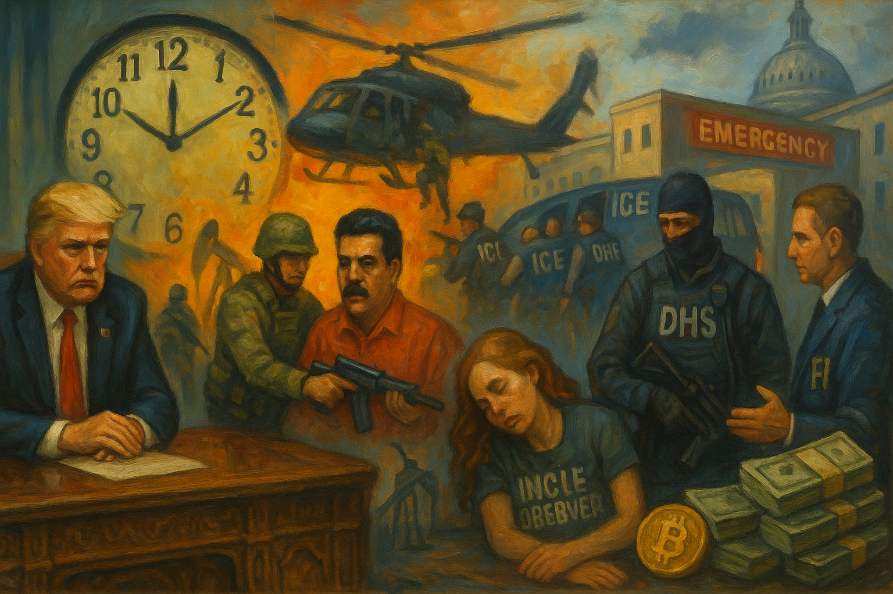

<!-- Generated by build_publish_week_v1 -->
<!-- Header image: image_wide_week51.png -->

# Week 51: War, Oil, and Enforcement as Rule

*A near-static clock masks a week when war powers, immigration raids, and economic policy were fused into a single project of personalized executive rule.*

> The forms of law may remain long after the spirit has fled. — Anonymous jurist
> When force and wealth move in tandem, the republic must ask whom its power now serves. — Modern civic reflection
> The first step toward unfreedom is not the knock at the door, but the decision that some lives need no explanation. — From a dissident’s notebook

The week unfolded as a study in concentrated power. War, immigration enforcement, economic policy, and public narrative all bent toward the same center. What might once have been separate domains—foreign intervention, domestic policing, budget choices, and information—were treated as tools in a single project. The pattern did not rely on new laws. It relied on will, speed, and the ability to decide which rules would be followed and which would be ignored.

At the close of the previous period, the Democracy Clock stood at 8:11 p.m. By the end of Week 51, it still read 8:11 p.m., with a net movement of 0.2 minutes. The face did not jump, but the mechanism inside shifted. Executive power was asserted over war and oil without prior authorization. Security forces acted as if their primary client were the regime, not the public. Law and transparency bent around elite interests. Courts, Congress, and civil society registered resistance—war-powers votes, impeachment articles, protests, and investigative reporting—but mostly after the fact, and rarely with the leverage to reverse what had already been done. The balance tilted further toward rule by decree.

The clearest expression of this posture came in Venezuela. Early in the week, President Trump ordered a military operation to seize Nicolás Maduro, treating the capture of a sitting foreign head of state as a matter of presidential discretion. The operation was framed as a law-enforcement action against narco-terrorism, but it involved lethal maritime strikes that killed thirteen people and a covert incursion to remove a leader from his own territory. Congress was not consulted in advance. Intelligence briefings that statutes require for such actions did not reach key members. The presidency acted first and explained later, if at all.

Around that kinetic core, a broader design emerged. The administration announced plans for the United States to seize and control tens of millions of barrels of Venezuelan oil. Sanctions were relaxed not to restore Venezuelan sovereignty but to route crude through U.S.-controlled channels. Energy Secretary Chris Wright and the president described a future in which American taxpayers would finance the revival of Venezuela’s oil infrastructure, with companies later reimbursing costs and reaping profits. In parallel, billionaire Paul Singer acquired Citgo at a steep discount, a windfall made possible by the very instability U.S. actions had helped create. Oil and force moved in tandem.

Trump did not hide the logic. He claimed authority to use military force to take other countries’ oil and spoke of Greenland as a potential target for coercive acquisition, even floating the idea of payments to residents. He dismissed international law as a meaningful constraint, saying his own morality, not treaties, defined the limits of his power. In this telling, Venezuela was a failed state in need of rebuilding, and U.S. control of its resources would benefit both nations. The language of humanitarian rescue and reconstruction masked a simple fact: war powers and sanctions policy were being used to secure assets for a tight circle of allies and firms.

Institutions reacted, but on a delay. Members of Congress reported that they had received no briefings on the Venezuela strikes despite legal notification requirements. Representative Ted Lieu publicly declared the attack illegal without congressional authorization. The Senate advanced a bipartisan War Powers Resolution to restrict further military action in Venezuela, reasserting that the power to declare war rests with the legislature. At the same time, the Supreme Court, in a separate case, rejected Trump’s claim of authority to deploy federalized National Guard troops in Chicago, signaling that there were still judicial limits on domestic force. Yet Maduro was already in a New York courtroom, arraigned on narco-terrorism and related charges, and Venezuelan authorities, in the post-coup vacuum, were detaining journalists and cracking down on protests. Courts and foreign civic space were pulled into the slipstream of an operation they had not authorized.

If Venezuela showed how military and economic power could be fused abroad, Minnesota showed how security forces could be turned inward. The Department of Homeland Security and ICE deployed roughly two thousand federal agents to the state in an extraordinary surge, framed around alleged Somali-linked fraud. The operation pushed detention facilities beyond capacity. Most of the new detainees had no criminal convictions. Communities experienced the surge not as targeted law enforcement but as an occupying force, with agents on streets, in neighborhoods, and outside hospitals. The scale felt like a domestic deployment, not routine policing.

In Minneapolis, the surge culminated in the killing of Renee Nicole Good, a U.S. citizen and legal observer, during an ICE operation. Federal agents claimed she had weaponized her car and posed an imminent threat. Video later verified by independent outlets showed her driving away from agents, not toward them. On the ground, medics and a physician were blocked from reaching her after she was shot. She died without timely aid, in a scene controlled entirely by federal officers. The message to those who monitored state power was stark: proximity to enforcement could be fatal, and even basic duties of care were negotiable.

The Minnesota operation did not stand alone. In the same week, DHS detained Dulce Consuelo Díaz Morales, a U.S. citizen, for twenty-five days despite evidence of her citizenship, and Border Patrol agents shot two people outside a Portland hospital during an immigration-related stop. ICE and Border Patrol operations across the country produced at least nine shootings and multiple deaths in custody. Detention numbers swelled with people who had no criminal records. Enforcement was no longer confined to borders or high-risk targets. It reached into cities, hospitals, and homes, treating presence itself as grounds for suspicion.

The public response was immediate and wide. Local leaders in Minneapolis demanded that ICE leave the city. Protests and vigils for Renee Good spread across the country, organized by groups like Indivisible and broader coalitions under banners such as “ICE OUT FOR GOOD.” Demonstrators gathered at federal buildings to protest immigrant detentions at Guantanamo Bay and to challenge senators’ votes on social programs and immigrant treatment. Calls to abolish ICE moved from the margins to the center of the debate. Communities organized ICE Watch trainings, teaching volunteers how to verify and document enforcement actions in real time. Yet even as this civic infrastructure grew, DHS sent more agents into Minnesota, and detention facilities remained overcrowded.

Control over the story of what had happened became its own battleground. DHS and the Trump administration labeled Renee Good a domestic terrorist, asserting that she had weaponized her vehicle and was part of a broader left-wing threat. Vice President JD Vance attacked media coverage, accusing reporters of misrepresenting the incident and suggesting links to a terror network. The administration released selective bodycam and cellphone footage that supported its narrative while withholding other evidence and blocking state investigators from accessing the full record. The FBI took sole control of the shooting investigation, excluding Minnesota’s Bureau of Criminal Apprehension.

Independent journalists and outlets pushed back. Reuters and others verified video showing Good driving away, not charging agents. Their work underscored the role of investigative reporting in checking official claims about state violence. But the cost of that work rose. Reporters who challenged the DHS account were smeared as biased or dangerous. The administration’s approach—curated evidence, sweeping labels, and attacks on the press—signaled that those who documented abuses would themselves be treated as adversaries.

The same pattern appeared in how the administration handled January 6. On the anniversary, Trump issued sweeping pardons and commutations for participants in the Capitol attack. He described them as peaceful patriotic protesters and cast Democrats who certified the election as villains. Official channels portrayed the insurrection as a grave injustice against its supporters rather than an assault on constitutional order. The White House narrative, amplified by aligned media, recast an attempt to block the transfer of power as an act of loyalty and courage.

Here, too, there was institutional pushback. The Senate unanimously approved a resolution to install a plaque honoring Capitol Police officers who defended the building on January 6. The plaque served as a physical assertion that the attack was real and that those who resisted it were in the right. Yet the administration’s mass pardons and revisionist rhetoric had already altered the landscape. Paramilitary-style violence aligned with regime interests now carried a presumption of impunity, while those who opposed it risked being labeled unpatriotic or corrupt.

Beyond these headline episodes, law itself was increasingly used as a weapon rather than a limit. Reports emerged of federal agents seizing individuals off the streets as perceived enemies of the state, blurring the line between lawful arrest and political abduction. In Kentucky, prosecutors charged Melinda S Spencer with fetal homicide after a self-managed abortion, stretching a statute that did not apply to the pregnant person herself. At Stanford, university prosecutors pursued felony conspiracy and vandalism charges against students over a pro-Palestinian protest, signaling a willingness to treat campus dissent as a criminal matter rather than a disciplinary one. The reach of criminal law widened as its neutrality narrowed.

Inside the state, those who questioned or constrained this trajectory faced retaliation. Defense Secretary Pete Hegseth issued a formal censure of Senator Mark Kelly and initiated proceedings to strip his retired rank and pension after Kelly urged service members to refuse unlawful orders. The move used military disciplinary tools against a sitting senator, chilling lawful dissent and blurring civilian–military boundaries. At the Justice Department, Trump fired senior ethics attorney Joseph Tirrell without stated cause, removing a career official whose role was to enforce internal legal norms. These actions sent a clear signal: internal critics of illegality or overreach would pay a personal price.

The saga of unlawfully appointed U.S. attorneys showed both the reach of politicized appointments and the residual strength of judicial checks. Trump-installed lawyer Lindsey Halligan continued to act as a U.S. attorney even after her appointment was ruled unlawful, prompting federal courts to order her to justify her use of the title. In New York, Judge Lorna Schofield ruled that acting U.S. attorney John Sarcone did not lawfully hold his position. The Justice Department, meanwhile, appealed dismissals of charges brought by these invalid appointees against political figures, prolonging uncertainty over prosecutions that had been tainted from the start. Courts were willing to enforce appointment rules, but the executive’s willingness to push past them had already shaped who was charged and how.

Economic policy moved in lockstep with these assertions of power. The Venezuela operation was not only about regime change; it was also about money. Singer’s bargain purchase of Citgo, the relaxation of the oil embargo, and the administration’s plan to manage Venezuelan crude exports placed key assets under the influence of politically connected investors. Trump met with oil company executives at the White House and promised them “total safety and security” for investments in Venezuela, pledging state power to protect private ventures abroad. He proposed that U.S. taxpayers fund the revival of Venezuela’s oil industry, with companies later reimbursing costs, shifting political and financial risk onto the public while preserving upside for firms.

At home, the administration proposed increasing the U.S. military budget from $1 trillion to $1.5 trillion for 2027, with Republican lawmakers and Treasury Secretary Scott Bessent suggesting that speculative fraud cuts would cover the difference. At the same time, Trump revoked billions of dollars in childcare funding and directed plans for deep workforce cuts at FEMA, threatening the federal capacity to respond to disasters. An executive order tightened rules on defense contractors’ stock buybacks and dividends, ostensibly to ensure performance, but also deepened executive control over a sector already intertwined with state power. A Trump family cryptocurrency venture, World Liberty Financial, applied for a national banking license, raising the prospect that businesses tied to the president’s family would receive favorable regulatory treatment.

Corporate money flowed back into politics in ways that reinforced this alignment. Some firms, like Airbnb, maintained pledges to withhold donations from lawmakers who opposed certifying the 2020 election, signaling a continued concern for democratic norms. Others, including major insurers and media companies, resumed funding election deniers, normalizing their role in the political system. In contrast, New York City and State announced a universal childcare plan providing two years of free care for two-year-olds, and California advocates proposed a one-time 5 percent tax on billionaires to fund education, food, and health services. These local initiatives offered a different model, one in which public resources were directed toward broad social infrastructure rather than militarization and foreign extraction.

Transparency, a basic condition for democratic oversight, came under direct strain. Under the Epstein Files Transparency Act, Congress required the Justice Department to release documents related to Jeffrey Epstein and to justify any redactions or withholdings. DOJ, led by Attorney General Pam Bondi, released less than 1 percent of the documents and missed statutory deadlines. It failed to provide the required justifications or reports to Congress. Names of politically exposed individuals remained hidden. In response, Representatives Ro Khanna and Thomas Massie, from opposite parties, moved toward using inherent contempt against Bondi and asked a federal judge to appoint a special master to oversee the releases. The fight was not about a single case. It was about whether the executive could ignore a transparency law with impunity.

A similar pattern played out in Minneapolis. The FBI took exclusive control of the investigation into Renee Good’s killing, shutting out Minnesota’s Bureau of Criminal Apprehension and blocking state investigators from accessing evidence. DHS was accused of lying about the circumstances of the shooting and of misrepresenting key facts in public statements. Selective release of video footage allowed the administration to shape the narrative while keeping the full record out of independent hands. Here, too, Congress responded: House Democrats filed articles of impeachment against DHS Secretary Kristi Noem, alleging obstruction and abuse in the handling of the case, and lawmakers threatened to withhold DHS funding unless ICE reformed its practices. Yet the underlying investigations remained in federal hands.

Not all transparency mechanisms failed. The Equal Employment Opportunity Commission announced a public Sunshine Act meeting on voting procedures and organizational changes, adhering to open-meeting norms. The Environmental Protection Agency published notices on environmental impact statements, hazardous waste permit information collection, and Superfund settlements, inviting public comment and scrutiny. These routine acts of disclosure showed that the machinery of open government still functioned in many domains. But they also highlighted the selectivity of opacity: when elite crimes, politically sensitive archives, or controversial uses of force were at stake, the same government that could publish technical rules on chemicals and air quality chose instead to seal, delay, or sanitize.

Federal power was also wielded unevenly across the map. The Justice Department sued twenty-two states for refusing to provide complete voter lists, including sensitive data, advancing a national voter file project that could facilitate aggressive roll purges. The administration sued California cities over local natural gas restrictions in new construction, challenging their climate policies. In Minnesota, DHS framed its extraordinary enforcement operation as a response to Somali-linked fraud, targeting a specific ethnic community and pushing detention facilities beyond capacity. These moves used legal and security tools to pressure disfavored jurisdictions and demographics, often those that leaned against the administration politically.

Legislators and local leaders sought ways to push back. House Democrats, led by Representative Robin Kelly, filed impeachment articles against Secretary Noem over the Minneapolis shooting. Members of Congress threatened to withhold DHS funding unless ICE changed course. The Senate’s War Powers Resolution on Venezuela, though subject to veto, reasserted a constitutional boundary. In New York City, Mayor Zohran Mamdani was sworn in and immediately revoked all executive orders issued by his indicted predecessor after the indictment date, signaling a break with perceived corruption and a different vision of executive power. Protest networks, from antiwar organizers in Grand Rapids to nationwide ICE vigils, asserted alternative models of security and care. These efforts showed that federalism and civil society still offered tools of resistance, even as the costs of using them rose.

Information control extended beyond security and scandal into health, economics, and climate. The administration removed federal guidance on childhood vaccines and backed a new food pyramid that encouraged alcohol use as a social lubricant, sidelining evidence-based public health advice in favor of ideological and economic narratives. Allegations surfaced that Trump had leaked confidential jobs data before its official release, giving insiders an advantage and undermining trust in the neutrality of economic statistics. The December jobs report itself was weak, and advisors downplayed its significance by suggesting data issues rather than policy failure. In the same week, the administration withdrew the United States from the UN Framework Convention on Climate Change and dozens of other international organizations via presidential memorandum, reducing U.S. engagement in cooperative rule-making and weakening global frameworks for shared problems.

Against this high-profile retreat, agencies like EPA continued their technocratic work: reviewing industrial chemicals, adjusting state air quality plans, and seeking nominations for scientific advisory committees. These actions suggested a split state. On one side, headline policy and presidential memoranda reoriented the country away from multilateral commitments and evidence-based guidance. On the other, career staff and regulatory processes carried on, maintaining a baseline of environmental and procedural governance. The tension between these layers defined much of the week’s texture.

Several scheduled and pending actions hung over the period. The Senate’s War Powers Resolution on Venezuela awaited final disposition and possible veto. The House Judiciary Committee planned forthcoming testimony from former Special Counsel Jack Smith, offering another venue to examine past executive conduct. In the Epstein matter, the request for a special master and talk of inherent contempt set up a confrontation between Congress, the courts, and DOJ over compliance with the transparency statute. Impeachment articles against Secretary Noem and threats to DHS funding signaled that immigration enforcement practices would remain under formal scrutiny.

In the arc of Trump’s second term, Week 51 did not introduce new methods so much as it applied familiar ones with greater confidence and reach. Security forces were used to protect power rather than people, both in a foreign capital and on American streets. Law was stretched and targeted to punish enemies and shield allies. Economic decisions around oil, defense, and social spending deepened the fusion of governance with a narrow business network. Transparency laws and investigative norms bent under pressure, especially where elite exposure was at stake. At the same time, courts, legislators, journalists, and protestors continued to act, preserving lines of accountability that had not yet been erased. The week’s small movement on the clock reflected this uneasy balance: a deepening erosion of guardrails, offset but not reversed by institutions still willing to contest how power is used.

<!-- Synopses for cross-posting -->
Long Synopsis: Week 51 unfolds as a portrait of concentrated executive power rather than a dramatic lurch on the Democracy Clock. The time holds at 8:11 p.m., but the gears shift: Trump orders a unilateral operation to seize Venezuela’s president, couples lethal strikes with plans to control Venezuelan oil, and openly dismisses international law. At home, an unprecedented ICE surge in Minnesota culminates in the killing of legal observer Renee Nicole Good, wrongful detentions, and shootings near a hospital, while DHS and the FBI seize control of the narrative and investigation. Law is stretched to punish enemies and internal critics, from fetal homicide charges and campus felonies to retaliation against Senator Mark Kelly and the firing of DOJ’s ethics chief. Economic policy and foreign intervention converge to enrich allies through Citgo, oil schemes, defense budgets, and a Trump family crypto bank bid. Transparency laws buckle under Epstein-file stonewalling and federal opacity, even as courts, Congress, journalists, and protest networks mount delayed, partial resistance. The week’s tiny numerical erosion masks a deepening normalization of rule by decree, selective legality, and curated memory.
Short Synopsis: The clock barely moves, but power does. Unilateral war in Venezuela, a lethal ICE surge in Minnesota, crony oil deals, and defiance of transparency laws deepen personalized executive rule, while courts, Congress, and civil society struggle to contest the narrative and reclaim oversight.

