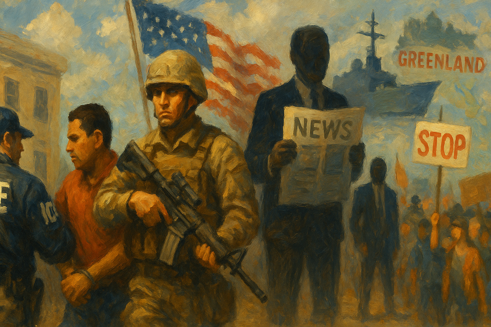

<!-- Generated by build_publish_week_v1 (appendix post) -->
<!-- Header image: image_wide_week52_appendix.png -->

# Week 52 Appendix: Occupation as Governance

*A federal immigration surge turns Minnesota into a test site for domestic force, legal impunity, and curated memory, even as states and courts push back.*

This week shows an acute convergence of authoritarian tools around immigration enforcement, foreign adventurism, and information control. The Minneapolis–St Paul ICE surge, the killing of Renee Nicole Good, and subsequent shootings are the central axis: federal agents deployed at unprecedented scale, used lethal force, altered crime scenes, blocked state investigators, and were shielded by DOJ decisions and smear campaigns. That cluster drives heavy pressure on traits 4, 8, 9, 11, 41, 42, 43, 47, 50 and 53. Parallel moves—threatening the Fed chair with criminal charges, politicized probes of lawmakers and whistleblower counsel, and the FBI raid on a Washington Post reporter—extend the weaponization of law and security institutions (traits 1, 4, 6, 14, 18, 22, 23, 42). Internationally, the Venezuela operation, seizure of oil revenues, and open talk of invading or annexing Greenland, backed by tariffs and NATO-skeptical rhetoric, reveal an expansionist, transactional foreign policy that fuses crony capitalism with militarized leverage (traits 1, 10, 38, 40, 56). There is meaningful resistance—state lawsuits, ACLU class actions, congressional field hearings, impeachment articles, and mass protests—but these operate as reactive brakes against a rapidly consolidating executive-centered regime.

Power and Authority

1. Trump administration seized control of Venezuelan oil and its revenues without full congressional involvement (2026-01-10): The administration’s unilateral seizure and personal control of Venezuelan oil revenue bypassed normal congressional oversight, concentrating foreign economic power in the executive and weakening checks on how seized assets are used.

2. President Donald Trump withheld $129 billion in federal funding from Minnesota citing alleged fraud (2026-01-10): Trump’s move to cut massive federal funds to Minnesota in the midst of an immigration crackdown used fiscal power to punish a disfavored state, pressuring local authorities and residents through economic coercion.

3. President Donald Trump declared a national emergency over Venezuelan oil revenue and blocked repayments (2026-01-12): By framing Venezuelan oil revenue as a national emergency and blocking repayments via executive order, Trump expanded emergency economic powers with limited oversight, normalizing crisis tools for long-term foreign asset control.

4. President Donald Trump threatened criminal charges against Federal Reserve Chair Jerome Powell over interest rates (2026-01-12): Trump’s threat to criminally prosecute the Fed chair for not cutting rates politicized independent monetary policy, signaling willingness to use prosecutorial power to coerce economic decisions that should be insulated from partisan demands.

5. Department of Homeland Security created a Program Executive Office for unmanned aircraft and counter‑UAS systems (2026-01-12): DHS’s new drone and counter‑drone office expanded federal surveillance and enforcement capabilities, increasing executive tools for monitoring and controlling borders and domestic airspace with limited external oversight.

6. President Donald Trump announced a 25% tariff on any country doing business with Iran (2026-01-12): Trump’s unilateral global tariff threat against countries trading with Iran used U.S. market power as a coercive foreign policy tool, risking trade retaliation and bypassing broader legislative debate on sanctions strategy.

7. Defense Secretary Pete Hegseth formally censured Senator Mark Kelly and ordered an investigation into reducing his retirement grade (2026-01-13): Hegseth’s censure and push to downgrade Senator Kelly’s military rank for criticizing unlawful orders blurred lines between civilian oversight and military discipline, signaling executive willingness to punish legislators through military channels.

8. President Donald Trump publicly threatened Minnesota with a coming "day of reckoning and retribution" (2026-01-13): Trump’s threat of a "day of reckoning" for Minnesota amid ICE operations used presidential rhetoric to intimidate a dissenting state, reinforcing the idea that federal power may be wielded punitively against political opponents.

9. President Donald Trump threatened to invoke the Insurrection Act in Minnesota to respond to protests (2026-01-15): Trump’s repeated threats to deploy the military under the Insurrection Act against Minnesota protesters signaled readiness to treat civil dissent as insurrection, eroding norms that separate domestic policing from military force.

10. President Donald Trump refused to extend Affordable Care Act premium subsidies (2026-01-16): The administration’s refusal to extend ACA subsidies risked pricing many people out of coverage, using executive inaction on health policy to reshape access to care without new legislation.

11. President Donald Trump publicly defended the ICE agent who killed Renee Good and labeled her a domestic terrorist (2026-01-16): By defending the ICE agent and branding Renee Good and her wife as "domestic terrorists" before investigations concluded, Trump signaled executive backing for lethal force and framed critics as enemies of the state.

Institutions and Governance

1. Department of Homeland Security Secretary Kristi Noem implemented a policy restricting congressional oversight visits to ICE facilities (2026-01-10): Noem’s policy limiting members of Congress from visiting ICE facilities curtailed legislative oversight of detention conditions, weakening a key accountability mechanism over federal enforcement operations.

2. UK Justice Secretary David Lammy prepared reforms that would cancel thousands of jury trials (2026-01-10): Planned UK court reforms to cancel large numbers of jury trials raised concerns about access to impartial adjudication and the preservation of a core check on state power in criminal proceedings.

3. US Congress enacted the Epstein Files Transparency Act mandating DOJ release of Epstein records (2026-01-12): Congress’s Epstein Files Transparency Act sought to force disclosure of sensitive investigative records, but DOJ’s noncompliance highlighted tensions between legislative transparency mandates and executive secrecy.

4. Representatives Ro Khanna and Thomas Massie asked a federal judge to appoint a special master and monitor to enforce Epstein files law (2026-01-12): Bipartisan lawmakers turned to the courts to compel DOJ compliance with the Epstein transparency statute, underscoring legislative reliance on judicial remedies when executive agencies ignore disclosure laws.

5. US Senate advanced a bill to limit Trump’s ability to take military action in Venezuela without approval (2026-01-12): The Senate’s move to require congressional authorization for further Venezuela military action attempted to reassert war powers, though its later defeat showed the fragility of legislative checks on executive force.

6. US Senate unanimously approved installing a plaque honoring Capitol Police for January 6 defense (2026-01-12): The Senate’s unanimous decision to honor Capitol Police for defending Congress on January 6 symbolically reinforced institutional memory of the insurrection and support for those who protected the legislature.

7. House Judiciary Committee Republicans released the transcript of former special counsel Jack Smith’s testimony (2026-01-12): Publishing Jack Smith’s testimony, which asserted proof beyond a reasonable doubt of Trump’s criminal schemes, injected detailed allegations into the public record and congressional discourse about presidential accountability.

8. House committee led by Rep. Jamie Raskin opened an investigation into whether pardoned January 6 rioters were hired by ICE (2026-01-12): The House inquiry into possible hiring of pardoned insurrectionists by ICE probed whether federal enforcement agencies were being staffed with individuals who had attacked democratic institutions.

9. House Minority Leader Hakeem Jeffries warned Democrats might oppose DHS supplemental funding absent ICE accountability measures (2026-01-12): Jeffries’ stance tied DHS funding to reforms on ICE conduct, using budget leverage to demand that immigration enforcement align with broader law‑enforcement norms and transparency.

10. Department of Justice subpoenaed the Federal Reserve in a criminal investigation of Chair Jerome Powell (2026-01-12): DOJ’s subpoena of the Fed over building renovations, amid presidential pressure on rates, blurred lines between legitimate oversight and political intimidation of an independent central bank.

11. US Supreme Court rejected Trump’s claim of authority to deploy federalized National Guard in Illinois (2025-12-23): The Court’s decision limiting Trump’s ability to federalize National Guard troops for domestic deployment reinforced judicial checks on unilateral presidential use of military forces inside the country.

12. US Senate defeated a war powers resolution restricting further military action in Venezuela (2026-01-15): The Senate’s narrow rejection of a resolution to require approval for Venezuela operations, after administration lobbying, preserved broad presidential discretion over foreign military actions.

13. House Oversight Committee Chair James Comer moved to hold Bill and Hillary Clinton in contempt for defying Epstein subpoenas (2026-01-14): Comer’s push to hold the Clintons in contempt for ignoring Epstein‑related subpoenas highlighted partisan use of congressional contempt powers amid broader disputes over DOJ’s failure to release Epstein files.

14. US Congress considered the Save NATO Act to limit presidential authority to invade NATO allies (2026-01-14): The Save NATO Act sought to constrain Trump’s ability to attack NATO partners unilaterally, reflecting legislative concern that presidential war powers could be used to undermine core alliances.

15. US Supreme Court heard challenges to state bans on transgender girls in girls’ sports (2026-01-12): The Court’s review of trans athlete bans in Idaho and West Virginia put federal equal protection and Title IX interpretations at stake, with potential to reshape civil rights protections for transgender students nationwide.

16. US Supreme Court heard a case on Trump’s global trade tariffs under emergency economic powers (2026-01-13): By taking up challenges to Trump’s sweeping tariffs imposed via emergency powers, the Court confronted how far presidents can go in reshaping trade policy without new legislation.

17. US Supreme Court revived a Republican challenge to Illinois’s extended mail‑in ballot deadline (2026-01-14): The Court’s decision granting candidates standing to contest Illinois’s mail‑ballot receipt window opened new avenues for partisan litigation over election rules, potentially affecting mail voting nationwide.

18. US Supreme Court agreed to hear cases on state bans of transgender athletes in girls’ sports (2026-01-13): Oral arguments on trans athlete bans signaled the Court’s willingness to revisit how sex discrimination laws apply to gender identity, with implications for school policies and civil rights enforcement.

19. US District Judge Amir H Ali ordered restoration of whistleblower attorney Mark Zaid’s security clearance (2026-01-13): Judge Ali’s injunction reversing the politically motivated revocation of Mark Zaid’s clearance reaffirmed judicial checks on executive retaliation against lawyers representing whistleblowers and government critics.

20. US District Judge Paul Engelmayer ordered DOJ to explain noncompliance with the Epstein Files Transparency Act (2026-01-13): Engelmayer’s order requiring DOJ to justify its failure to release Epstein records underscored judicial willingness to enforce transparency statutes against a resistant executive branch.

21. US Court of Appeals for the Ninth Circuit upheld California’s Prop 50 redistricting maps favoring Latino representation (2026-01-14): The appeals court’s decision to uphold Prop 50’s temporary congressional maps validated a state‑level effort to adjust districts in ways that could benefit Latino voters and Democrats, intensifying partisan redistricting battles.

22. US Supreme Court allowed a lawsuit challenging Illinois mail‑in ballot law to proceed (2026-01-14): By reviving Rep. Mike Bost’s suit over Illinois mail‑ballot counting rules, the Court expanded candidate standing to contest election administration, potentially inviting more litigation over state voting laws.

23. US District Judge William Young announced a protective order for noncitizen academics targeted over pro‑Palestinian speech (2026-01-16): Judge Young’s planned order shielding noncitizen academics from retaliatory immigration actions for their speech checked executive attempts to use immigration powers to silence political expression.

24. US District Court in California rejected DOJ’s demand for sensitive voter data from the state (2026-01-16): A federal judge’s ruling that DOJ was not entitled to Californians’ birth dates and partial Social Security numbers to police voter rolls protected state control over election data and voter privacy from federal overreach.

25. US Department of Justice declined to open a civil‑rights investigation into the killing of Renee Nicole Good (2026-01-16): DOJ’s refusal to investigate the ICE killing of Renee Good as a civil‑rights matter, despite internal resignations, signaled institutional reluctance to scrutinize federal agents’ use of force against civilians.

26. State of Minnesota and cities of Minneapolis and St. Paul filed lawsuits to halt DHS’s Operation Metro Surge immigration crackdown (2026-01-16): Minnesota and its major cities sued to stop Operation Metro Surge, alleging unconstitutional stops, detentions, and racial profiling, using the courts to contest federal immigration tactics in their communities.

27. US Department of Justice investigated the shooting of Renee Good as an assault on a federal officer rather than a civil‑rights case (2026-01-14): By framing the Good shooting primarily as an assault on a federal officer, DOJ prioritized protection of federal agents over examination of potential civil‑rights violations, shaping legal accountability pathways.

28. State of Illinois sued DHS over alleged unlawful and dangerous tactics in Operation Midway Blitz (2026-01-14): Illinois’s lawsuit accusing CBP and ICE of warrantless violent detentions and chemical weapon use during Operation Midway Blitz highlighted state efforts to check federal enforcement practices through litigation.

29. US Department of Justice Civil Rights Division leadership resigned after being barred from investigating the Renee Good shooting (2026-01-12): Resignations by senior Civil Rights Division officials over orders not to probe the Good killing exposed internal resistance to politicized decision‑making and weakened DOJ’s capacity to enforce civil‑rights law.

30. US Department of Justice fired a senior federal prosecutor who refused to prosecute James Comey (2026-01-12): DOJ’s dismissal of Robert McBride after he declined to prosecute former FBI Director Comey, amid questions about the U.S. attorney’s appointment, suggested political interference in prosecutorial decisions.

31. US Attorney’s Office for the District of Columbia opened a criminal investigation into Federal Reserve Chair Jerome Powell over building renovations (2026-01-12): The criminal probe into Powell’s testimony about Fed renovations, launched amid Trump’s rate‑cut demands, raised concerns that prosecutorial tools were being used to pressure an independent economic institution.

32. US Department of Justice sued 23 states and DC to obtain sensitive voter information for roll reviews (2026-01-15): DOJ’s lawsuits seeking detailed voter data, including partial Social Security numbers, under the banner of roll accuracy alarmed states and advocates who saw the effort as a pretext for voter intimidation and centralization.

33. US Department of Justice appealed an injunction limiting DHS dispersal of journalists at protests (2026-01-12): DHS’s appeal of a court order protecting journalists from dispersal at protests challenged judicial safeguards for press freedom in protest coverage, seeking broader discretion for federal officers.

34. Federal judiciary issued an injunction barring DHS from dispersing known journalists without probable cause (2026-01-12): The injunction restricting DHS from dispersing journalists absent independent probable cause strengthened legal protections for newsgathering at protests against arbitrary federal interference.

35. US District Court of Appeals for the Third Circuit reversed a ruling that freed Palestinian activist Mahmoud Khalil from ICE detention (2026-01-15): The appeals court’s decision that lower courts lacked jurisdiction over Khalil’s detention claims deferred to restrictive immigration statutes, limiting judicial avenues for activists contesting politically tinged deportations.

36. US District Court in Florida received BBC’s motion to dismiss Trump’s $10 billion defamation lawsuit (2026-01-13): The BBC’s motion to dismiss Trump’s massive defamation suit over January 6 coverage tested how courts balance public‑figure speech protections against attempts by powerful actors to chill investigative reporting.

37. US Department of Justice investigated Democratic lawmakers over a video urging troops to refuse illegal orders (2026-01-15): Federal prosecutors’ investigation of House Democrats for a video emphasizing duty to disobey unlawful orders used criminal inquiry tools against protected political speech about military law and oversight.

38. US Department of War and Navy leadership investigated Senator Mark Kelly for alleged misconduct over comments on illegal orders (2025-11-24): Military investigations into Senator Kelly’s public remarks about refusing illegal orders risked turning military justice mechanisms into instruments for disciplining civilian legislators’ oversight speech.

39. US Equal Employment Opportunity Commission scheduled public meetings to revise internal voting procedures and harassment guidance (2026-01-13): EEOC’s announced meetings on rescinding voting procedures and harassment guidance signaled potential shifts in how the agency makes decisions and enforces workplace protections.

40. US Congress enacted the Whole Milk for Healthy Kids Act allowing whole milk in schools (2026-01-14): The new law permitting whole milk in school meals illustrated congressional involvement in detailed nutrition policy, with implications for public health standards in federally supported programs.

41. US Congress in 1784 ratified the Treaty of Paris recognizing US independence (1784-01-14): The 1784 ratification of the Treaty of Paris formally established US sovereignty and set early precedents for congressional authority over foreign agreements and national boundaries.

42. US Department of Justice released less than 1% of Epstein files despite a statutory deadline (2026-01-16): DOJ’s minimal release of Epstein records in defiance of a clear legal deadline exemplified executive resistance to transparency mandates in cases implicating powerful figures.

Economic Structure

1. Drug Enforcement Administration permanently placed two nitazene‑class opioids into Schedule I (2026-01-12): DEA’s scheduling of N‑Pyrrolidino Metonitazene and N‑Pyrrolidino Protonitazene as Schedule I tightened federal control over emerging synthetic opioids, affecting medical research and criminal penalties.

2. Food and Drug Administration issued draft guidance on using Bayesian methods in clinical trials (2026-01-12): FDA’s draft guidance on Bayesian trial design could reshape how drug efficacy and safety are evaluated, influencing the speed and rigor of bringing new therapies to market.

3. Peter Thiel donated $3 million to oppose California’s proposed billionaire tax initiative (2026-01-12): Thiel’s multimillion‑dollar contribution against a one‑time billionaire tax illustrated how concentrated wealth can shape state tax policy debates and constrain redistributive measures.

4. Trump Organization sought to hire foreign workers at reduced wages after a federal rule change (2026-01-12): The Trump Organization’s move to hire foreign workers at lower wages, enabled by its own administration’s labor rule change, highlighted how policy shifts can directly benefit connected employers at workers’ expense.

5. US Department of Labor Inspector General investigated top aides to the Labor Secretary for misuse of official travel (2026-01-12): Placing two senior Labor Department aides on leave over alleged misuse of official events for personal travel reflected internal checks on ethical conduct within an agency central to worker protections.

6. Drug Enforcement Administration scheduled 4‑fluoroamphetamine as a Schedule I controlled substance (2026-01-15): DEA’s decision to classify 4‑FA as Schedule I imposed strict controls on its manufacture and use, aligning US drug policy with international obligations and affecting criminal enforcement.

7. Environmental Protection Agency set new pesticide residue tolerances for permethrin and pyriofenone (2026-01-14): EPA’s updated tolerances for permethrin and pyriofenone residues on crops adjusted the balance between agricultural productivity and consumer safety in the food supply.

8. Federal Communications Commission implemented spectrum allocation changes from WRC‑15 and repealed obsolete safety rules (2026-01-14): FCC’s spectrum reallocations and repeal of outdated public safety rules modernized communications regulation, with implications for emergency services, broadcasters, and wireless providers.

9. Central banks worldwide issued a joint statement supporting Jerome Powell and warning against political interference (2026-01-13): Global central bankers’ public backing of Powell underscored international concern that US political attacks on the Fed could destabilize monetary policy and financial markets.

10. US Department of Justice threatened the Federal Reserve with criminal indictment over renovation spending (2026-01-13): DOJ’s threat of indictment over Fed building renovations, seen as leverage on interest‑rate policy, blurred oversight with coercion and risked undermining central bank independence.

11. Andrea Lucas, EEOC Chair publicly encouraged white men to file workplace discrimination complaints (2026-01-13): The EEOC chair’s call for white men to bring discrimination claims signaled a shift in enforcement emphasis that could redirect limited civil‑rights resources away from historically marginalized groups.

12. Peter Thiel and California Governor Gavin Newsom mobilized against a California billionaire tax ballot initiative (2026-01-13): Opposition from both a major tech donor and the governor to a one‑time billionaire tax showed how elite economic and political actors can align to block redistributive fiscal reforms.

13. Centers for Disease Control and Prevention sought public comment on multiple health data collection initiatives (2026-01-13): CDC’s proposed surveys on lead poisoning, cancer control, disease surveillance, traveler genomics, aviation and land illness, maritime reporting, poison centers, and breastfeeding practices aimed to strengthen evidence‑based public health policy.

14. Occupational Safety and Health Administration extended compliance deadlines for the updated Hazard Communication Standard (2026-01-15): OSHA’s four‑month extension for hazard communication compliance gave employers more time to adapt labeling and training, balancing worker safety goals with industry implementation capacity.

15. Transportation Security Administration proposed revisions to the TSA PreCheck application information collection (2026-01-15): TSA’s planned changes to PreCheck data collection and customer portals aimed to streamline traveler vetting while raising questions about data security and privacy in expedited screening programs.

16. US Environmental Protection Agency granted SRC, Inc. access to confidential pesticide data under strict safeguards (2026-01-15): EPA’s contract allowing a private firm access to confidential pesticide data for regulatory work highlighted reliance on contractors in technical oversight and the need for strong confidentiality protections.

17. General Services Administration proposed revisions to Federal Audit Clearinghouse data collection (2026-01-15): GSA’s plan to add structured fields and fraud indicators to the Federal Audit Clearinghouse sought to improve federal oversight of grant spending without increasing reporting burdens.

18. Transportation Security Administration announced revisions to TSA PreCheck information collection and ID system (2026-01-15): The introduction of a MyTSA PreCheck ID and customer portal aimed to modernize traveler identity management, with implications for convenience and centralized personal data handling.

19. CNN and polling organizations reported widespread public disapproval of Trump’s economic performance (2026-01-15): Polling showing most Americans view Trump’s first year as an economic failure reflected public judgment on policies affecting cost of living and could influence future economic decision‑making and elections.

20. Trump administration implemented high tariffs that coincided with declining manufacturing employment (2026-01-15): Reports that manufacturing jobs fell despite Trump’s tariffs undercut claims that protectionist trade policy was reviving industry, raising questions about who benefits from tariff‑driven strategies.

21. US government sold Venezuelan crude oil to a firm linked to a major Trump donor (2026-01-15): The first US sale of Venezuelan oil to Vitol, whose executive heavily funded Trump‑aligned PACs, blurred lines between foreign asset management and donor enrichment in energy policy.

22. Trump Organization entered multi‑billion‑dollar development deals with Saudi‑backed Dar Global (2026-01-14): Trump’s $7 billion Diriyah and $3 billion Jeddah projects, funded by Saudi state entities, deepened financial ties between the president’s business and a foreign government with major security interests.

23. Food and Drug Administration sought OMB approval for tobacco product warning plan submissions (2026-01-16): FDA’s request to collect tobacco warning plans supported enforcement of statutory health warnings, shaping how risks are communicated to consumers and constraining industry marketing.

24. Drug Enforcement Administration received an application from Siegfried USA to bulk‑manufacture controlled substances (2026-01-16): DEA’s notice of Siegfried USA’s application to manufacture multiple controlled substances highlighted regulatory scrutiny over pharmaceutical supply chains and potential diversion risks.

25. Environmental Protection Agency issued multiple environmental regulatory notices and settlements (2026-01-16): EPA’s environmental impact statement notices, CERCLA settlement, land‑ban exemption, Brownfields reporting changes, and related actions showed ongoing use of regulatory tools to manage pollution and cleanup costs.

26. Federal Communications Commission updated the FM allotments table to reflect licensed stations (2026-01-16): FCC’s editorial update to remove vacant FM allotments aligned regulatory records with actual licenses, supporting accurate management of broadcast spectrum.

27. China and Canada finalized a $1 trillion strategic trade partnership (2026-01-16): The China‑Canada trade pact, including tariff cuts on EVs and agriculture, signaled shifting global trade alignments that could marginalize US economic influence amid its own tariff disputes.

28. People’s Republic of China restricted technology transfers needed for India’s battery industry (2026-01-14): China’s export controls blocking battery tech transfers to India used industrial policy as a geopolitical tool, constraining a rival’s development in a strategic sector.

29. Islamic Republic of Iran faced severe water and economic crises exacerbated by sanctions (2026-01-14): Iran’s collapsing aquifers, rationing, and high inflation, worsened by sanctions, fueled domestic unrest and illustrated how economic pressure can destabilize regimes and societies.

30. Russian Federation experienced understated inflation and shrinking real GDP amid war (2026-01-14): Evidence that Russia overstated growth while real incomes fell suggested war‑related economic strain and data manipulation, affecting its capacity to sustain military operations.

31. US Department of Agriculture and HHS released dietary guidelines emphasizing red meat and full‑fat dairy (2026-01-15): New federal dietary guidelines favoring red meat and saturated fats, despite cost‑of‑living pressures, raised questions about alignment with nutrition science and industry influence on public health advice.

32. US Department of Health and Human Services changed flu vaccine recommendations for children to shared decision‑making (2026-01-16): HHS’s shift to a softer flu vaccine recommendation for children during a severe season risked lowering uptake, with economic and health consequences from preventable illness.

33. US Department of Health and Human Services under RFK Jr. appointed vaccine skeptics to the CDC’s immunization advisory committee (2026-01-14): Installing vaccine skeptics on the CDC’s key immunization panel threatened to politicize scientific guidance, potentially undermining confidence in vaccination programs and public health.

34. US Department of Health and Human Services failed to extend ACA subsidies, risking coverage losses (2026-01-16): The administration’s refusal to continue ACA subsidies jeopardized affordable coverage for many, using federal health policy levers in ways that could widen economic and health inequality.

Civil Rights and Dissent

1. ICE and facility operators near Minneapolis blocked members of Congress from visiting a detention center despite a court ruling (2026-01-10): Denying entry to Representatives Omar, Morrison, and Craig at an ICE facility, contrary to a judge’s ruling, impeded congressional oversight of detainee treatment and transparency in immigration enforcement.

2. Homeland Security Investigations and ICE conducted large‑scale door‑to‑door immigration raids in Minneapolis–St. Paul (2026-01-10): Operation Metro Surge’s business and residential raids by thousands of agents created an atmosphere of intimidation, raising due‑process concerns and chilling daily life in immigrant communities.

3. FBI and Department of Justice took over the investigation of Renee Good’s killing and excluded state authorities (2026-01-10): By sidelining Minnesota’s Bureau of Criminal Apprehension and limiting local access to evidence in the Good case, federal authorities undermined independent scrutiny of lethal force by an ICE agent.

4. FBI limited cooperation with local law enforcement in the Renee Good shooting case (2026-01-10): FBI’s restricted sharing of evidence with local prosecutors in the Good shooting complicated potential charges against the ICE agent, weakening local capacity to hold federal officers accountable.

5. Oregon Attorney General Dan Rayfield opened a state investigation into federal agents’ shooting of undocumented immigrants (2026-01-10): Oregon’s probe into border agents’ shooting of two undocumented people in Portland asserted state interest in policing federal use of force and protecting civil liberties.

6. White House publicly defended ICE agent Jonathan Ross’s killing of Renee Good as self‑defense (2026-01-10): The administration’s early defense of the ICE shooter, despite conflicting video evidence, signaled institutional bias toward agents and discouraged impartial investigation of lethal force.

7. ICE detained four members of the Oglala Lakota Nation in Minnesota (2026-01-10): ICE’s detention of Indigenous Oglala Lakota members during the Minnesota surge highlighted how aggressive enforcement disproportionately affects marginalized communities with historic vulnerabilities.

8. Protesters and community groups nationwide organized over 1,000 "ICE Out For Good" protests and vigils (2026-01-10): Coordinated protests across the country against ICE raids and deaths in custody demonstrated large‑scale civic mobilization challenging federal enforcement practices and demanding immigrant protections.

9. Protesters in Portland, Oregon demonstrated against border patrol shootings and saw six arrests (2026-01-10): Portland protests over border agents shooting two undocumented immigrants, and the arrest of six demonstrators, underscored tensions between federal enforcement and local communities’ rights to assemble.

10. Minnesota Attorney General Keith Ellison and Hennepin County Attorney Mary Moriarty launched a state investigation into the ICE killing of Renee Good (2026-01-11): Minnesota’s decision to investigate Good’s killing challenged federal claims of "absolute immunity" for officers and asserted state jurisdiction over lethal force used on its residents.

11. ICE deported Randall Gamboa Esquivel to Costa Rica while he was in a vegetative state (2026-01-11): ICE’s deportation of a gravely ill detainee who soon died raised serious concerns about medical neglect, humane treatment, and transparency toward families in immigration detention.

12. ICE recorded four migrant deaths in custody in the first ten days of 2026 (2026-01-12): A spate of early‑year deaths in ICE detention, following a record fatality year, highlighted systemic problems in detention conditions and oversight of detainee health and safety.

13. Department of Justice Civil Rights Division and Minnesota federal prosecutors saw mass resignations over refusal to investigate the Renee Good shooting (2026-01-13): Resignations by DOJ civil‑rights leaders and Minnesota prosecutors after orders not to probe Good’s killing signaled internal alarm that civil‑rights enforcement was being subordinated to political protection of ICE.

14. Department of Justice rescinded guidance discouraging prosecution of simple cannabis possession (2026-01-12): DOJ’s rollback of Biden‑era cannabis guidance reopened the door to federal prosecutions for simple possession, with disproportionate impacts likely on marginalized communities already over‑policed.

15. Siskiyou County, California agreed to policing reforms and independent oversight after racial profiling lawsuit (2026-01-13): Siskiyou County’s settlement with Hmong residents mandated policy changes, body cameras, and interpreters, addressing systemic discrimination and improving safeguards for minority communities.

16. US Department of Homeland Security and ICE expanded ICE workforce and enforcement reach amid rhetoric of protection from consequences (2026-01-13): ICE’s expansion, coupled with leadership rhetoric suggesting agents would be shielded from accountability, deepened fears that immigration enforcement was evolving into a politicized domestic security force.

17. US Department of Justice declined a civil‑rights investigation into an ICE shooting in Minneapolis (2026-01-14): DOJ’s decision that there was "no basis" for a civil‑rights probe into an ICE shooting, despite ongoing FBI inquiries, signaled a narrowing of federal willingness to examine potential abuses by its own agents.

18. FBI and Department of Justice raided the home of Washington Post reporter Hannah Natanson and seized devices (2026-01-14): The FBI’s search of a reporter’s home in a leak investigation, despite claims she was not a target, raised alarms about chilling effects on sources and press freedom in national security reporting.

19. US Department of Justice investigated Senator Elissa Slotkin over a video urging refusal of illegal orders (2026-01-14): The federal investigation into Slotkin’s participation in a video about disobeying unlawful orders used prosecutorial tools against speech on constitutional military obligations, potentially chilling legislative dissent.

20. US Department of Justice investigated three House Democrats over a video on military duty and illegal orders (2026-01-15): Probes of Reps. Crow, Goodlander, and Houlahan for a video affirming troops’ duty to refuse illegal orders suggested DOJ was being used to intimidate lawmakers who question executive military decisions.

21. ICE and DHS agents used tear gas, flash‑bangs, and arrests against protesters in Minneapolis (2026-01-13): Federal agents’ deployment of chemical munitions and flash‑bangs on largely peaceful protesters in Minneapolis escalated crowd control into militarized suppression of dissent.

22. ICE shot and killed Renee Nicole Good during an immigration enforcement operation (2026-01-07): The fatal shooting of US citizen Renee Good by an ICE agent during a large‑scale operation became a flashpoint over lethal force, labeling of dissenters as terrorists, and accountability for federal officers.

23. ICE and DHS detained and rapidly deported or transferred over 2,400 people in Minnesota, including some with legal status (2026-01-16): Mass arrests and swift removals during the Minnesota surge, affecting even visa holders and refugees, raised serious due‑process and family‑separation concerns.

24. ICE detention staff at Camp East Montana were implicated in the asphyxia death of detainee Geraldo Lunas Campos (2026-01-16): A medical examiner’s finding of asphyxia in an ICE detainee’s death, potentially a homicide, spotlighted allegations of lethal abuse and conflicting official narratives about what occurred in custody.

25. US Department of Homeland Security and ICE were accused in an ACLU class‑action of racial profiling and unlawful arrests in Minnesota (2026-01-15): The ACLU’s class‑action suit alleging ICE targeted Somali and Latino communities through race‑based stops and arrests challenged the legality of federal operations reshaping civic life in Minnesota.

26. American Civil Liberties Union of Minnesota filed a class‑action lawsuit over immigration agents’ constitutional violations (2026-01-15): The ACLU’s suit on behalf of community members alleged that immigration agents violated constitutional rights during Minnesota raids, using litigation to defend residents against federal overreach.

27. US Department of Justice sought sensitive voter data from states under the guise of roll accuracy (2026-01-15): DOJ’s push for detailed voter information from dozens of states, later rebuffed in California, raised fears of voter intimidation and data misuse under the banner of election integrity.

28. North Carolina Board of Elections eliminated campus polling sites and Sunday voting in some counties (2026-01-15): The partisan North Carolina board’s removal of college polling places and Sunday voting disproportionately burdened young, Black, and poor voters, functioning as targeted voter suppression.

29. Trump administration indefinitely suspended visa processing for 75 countries including Brazil (2026-01-14): The broad suspension of visas for residents of 75 countries, justified by welfare concerns, sharply restricted mobility and signaled a sweeping, status‑based barrier to entry into the US.

30. US Department of Homeland Security and ICE were sued by Minnesota and the ACLU for racial profiling and unconstitutional enforcement (2026-01-16): Parallel suits by Minnesota and civil‑rights groups alleged that DHS’s Minnesota operation relied on racial profiling and unlawful arrests, testing judicial willingness to curb federal enforcement excesses.

31. US Department of Homeland Security appealed an injunction protecting journalists at protests (2026-01-12): DHS’s appeal of protections for journalists at protests sought to restore broader authority to disperse or detain reporters, potentially chilling coverage of demonstrations.

32. US Department of Labor and union critics were accused of echoing Nazi‑style rhetoric in official messaging (2026-01-14): Labor Department posts using slogans reminiscent of Nazi propaganda alarmed unions, who warned that such rhetoric from a federal agency normalizes exclusionary nationalism and undermines worker solidarity.

33. US Department of Labor and the White House used white supremacist‑coded language in official social media posts (2026-01-14): A White House post referencing "Which way, Greenland man?" and similar messaging drew criticism for echoing white supremacist literature, signaling tolerance of extremist cues in government communication.

34. US Department of Labor and White House were criticized by union leaders for white supremacist‑tinged rhetoric (2026-01-14): Union leaders’ condemnation of administration rhetoric as echoing Nazi slogans highlighted fears that official language was being used to legitimize exclusionary, ethnonationalist politics.

35. US Department of Homeland Security and ICE were the target of a proposed Abolish ICE Act in Congress (2026-01-16): Rep. Shri Thanedar’s planned Abolish ICE Act responded to deaths in custody and the Good shooting by seeking to dismantle the agency’s current enforcement authority through legislation.

36. US public showed plurality support for abolishing ICE in national polling (2026-01-14): A poll finding 46% support for abolishing ICE reflected a major shift in public attitudes toward federal immigration enforcement and could reshape future policy debates.

37. Latino voters in focus groups expressed regret over supporting Trump due to immigration tactics and economy (2026-01-15): Latino focus‑group participants’ disillusionment with Trump’s immigration and economic policies suggested that aggressive enforcement may be eroding support among key constituencies.

38. US Department of Homeland Security and ICE were the subject of a congressional field hearing in St. Paul on abuses in Minnesota (2026-01-16): Democratic lawmakers’ field hearing titled "Kidnapped and Disappeared" documented trauma from ICE’s Minnesota surge and warned DHS to preserve records, signaling future accountability efforts.

39. California legislature enacted laws allowing arrest of federal agents for certain abuses (2026-01-16): New California laws authorizing arrests of federal agents for specified misconduct asserted state power to hold federal officers accountable for abuses on state soil.

40. Illinois Governor and state officials created an accountability commission for federal immigration officers (2026-01-16): Illinois’s new commission to gather complaints and oversee federal immigration officers reflected state‑level innovation in monitoring federal agents’ impact on residents’ rights.

41. New York Attorney General launched a portal to collect evidence of federal agent misconduct (2026-01-16): New York’s evidence portal for federal abuses empowered residents to document misconduct, potentially supporting future civil or criminal actions against rights‑violating agents.

42. US Department of Homeland Security and ICE were sued in a class action for racial profiling and unlawful arrests in Minnesota (2026-01-16): The class‑action suit alleging ICE agents stopped people based on race and demanded papers in Minnesota highlighted systemic profiling concerns in federal immigration enforcement.

43. US Department of Justice declined to investigate the Renee Good killing as a civil‑rights case despite public outcry (2026-01-16): DOJ’s refusal to open a civil‑rights probe into Good’s death, even as protests and resignations mounted, signaled institutional reluctance to confront potential abuses by federal law enforcement.

44. US Department of Homeland Security and ICE were the focus of an ACLU class‑action alleging racial profiling and unlawful arrests (2026-01-16): The ACLU’s class‑action complaint detailed how ICE allegedly targeted Somali and Latino residents in Minnesota, challenging the legality of enforcement practices reshaping civic life.

45. US Department of Homeland Security and ICE were sued by Minnesota and civil‑rights groups over Operation Metro Surge (2026-01-16): Combined lawsuits by Minnesota and the ACLU against Operation Metro Surge framed the federal crackdown as a "federal invasion" violating constitutional protections and state sovereignty.

Information, Memory and Manipulation

1. President Donald Trump endorsed a baseless claim that Renee Good was part of a paid leftwing agitator network (2026-01-10): Trump’s amplification of unfounded allegations that Good was a paid agitator cast genuine protest as orchestrated subversion, undermining public trust in grassroots dissent.

2. UK government and Ofcom considered banning X over AI‑generated sexualized images and accelerated investigations (2026-01-10): UK deliberations on blocking X for AI‑generated abuse highlighted tensions between platform regulation, child protection, and free expression in the digital public sphere.

3. Immigration and Customs Enforcement resisted disclosing updated use‑of‑force policies, heavily redacting FOIA releases (2026-01-10): ICE’s refusal to meaningfully disclose its use‑of‑force rules, even under FOIA, limited public understanding of when agents may use lethal force and impeded informed oversight.

4. Trump administration openly flouted the Epstein Transparency Act’s disclosure requirements (2026-01-10): Reports that the administration ignored the Epstein transparency law reflected a broader pattern of resisting statutory disclosure obligations in cases involving powerful figures.

5. Pentagon and Department of Defense imposed restrictive conditions that led mainstream reporters to resign from the Pentagon press corps (2026-01-11): New Pentagon rules limiting reporting to official information drove traditional journalists out and opened space for partisan influencers, weakening independent scrutiny of military affairs.

6. Vice President J.D. Vance and Department of Homeland Security released and amplified a selectively framed video of Renee Good’s shooting (2026-01-11): The administration’s release of a short video portraying the ICE shooter as a victim, first leaked to a partisan outlet, exemplified selective evidence use to shape public perception of state violence.

7. Federal government officials selectively leaked evidence in the Good case to partisan media outlets (2026-01-12): Leaking a 47‑second shooting video to a right‑wing outlet before official release allowed the government to seed a favorable narrative, undermining neutral information dissemination about a contested killing.

8. President Donald Trump and Vice President J.D. Vance conducted a smear campaign falsely labeling Renee Good a terrorist who tried to run over an agent (2026-01-12): Top officials’ false claims that Good attempted vehicular assault and was a domestic terrorist, contrary to video evidence, weaponized disinformation to justify lethal force and delegitimize protest.

9. US Department of Justice and FBI altered and controlled access to the Good shooting crime scene and body‑cam evidence (2026-01-12): Reports that agents left and potentially altered the Good shooting scene and withheld body‑cam footage raised doubts about evidence integrity and transparency in a politically sensitive case.

10. US Department of Justice released less than 1% of Epstein files despite a statutory deadline (2026-01-16): DOJ’s minimal release of Epstein records, in defiance of a clear legal deadline, kept potentially explosive information about elite networks largely hidden from public view.

11. US Department of Defense announced it would assume editorial control over Stars and Stripes (2026-01-14): The Pentagon’s move to control Stars and Stripes’ content and remove independent editorial safeguards threatened the paper’s role as an autonomous watchdog for service members.

12. US Department of Labor and White House used rhetoric and imagery echoing white supremacist literature in official posts (2026-01-14): Government social media posts echoing Nazi‑style slogans and referencing white supremacist texts normalized extremist codes in official messaging, shaping identity politics in the public sphere.

13. White House Press Secretary Karoline Leavitt attacked a reporter as a "leftwing activist" during a briefing on ICE actions (2026-01-15): Leavitt’s public denunciation of a reporter questioning ICE’s defense as a partisan activist exemplified efforts to delegitimize critical journalism and frame scrutiny as ideological bias.

14. CBS News and anonymous US officials faced internal dissent over a report seen as echoing administration leaks on an ICE shooting (2026-01-15): CBS staff concerns that a report on an ICE officer’s condition relied on politicized leaks highlighted newsroom struggles to avoid amplifying government spin in contentious cases.

15. US Department of Justice and FBI raided a Washington Post reporter’s home in a leak investigation (2026-01-14): The search of Hannah Natanson’s home and seizure of devices, targeting a journalist with many federal sources, risked deterring whistleblowers and constraining investigative reporting on government conduct.

16. US Department of Justice appealed a court order protecting journalists from dispersal at protests (2026-01-12): DHS’s appeal of an injunction shielding journalists at protests sought to restore broader authority to move or detain reporters, potentially limiting independent coverage of demonstrations.

17. US Department of Justice sued states to obtain sensitive voter data under voting laws (2026-01-15): DOJ’s lawsuits for detailed voter records, later rebuffed in California, raised fears that centralized data could be used to challenge or intimidate voters under the guise of roll maintenance.

18. US Department of Labor was accused by unions of echoing Nazi rhetoric in official communications (2026-01-14): Union leaders’ criticism that Labor Department messaging mirrored Nazi slogans highlighted how official language choices can signal ideological alignment and influence public narratives about nation and work.

19. President Donald Trump claimed credit for halting Iranian executions based on a Fox News report (2026-01-15): Trump’s unsubstantiated claim that he stopped Iranian executions, despite ongoing regime violence, exemplified self‑serving misinformation about foreign events to bolster his image.

20. Trump administration and internal GOP pollsters reviewed polling showing declining support for immigration policies (2026-01-15): Internal polling that showed erosion of support for Trump’s immigration agenda among key voter blocs informed discussions about messaging, illustrating how opinion data shapes political narratives.

21. US National Archives and Records Administration invited public comment on proposed federal records disposition schedules (2026-01-15): NARA’s notice on records schedules allowed public input on which federal records are preserved or destroyed, affecting long‑term transparency and historical accountability.

22. US Department of Health and Human Services under RFK Jr. changed flu vaccine guidance in ways likely to reduce uptake despite severe season (2026-01-16): Shifting flu vaccine recommendations to "shared decision‑making" amid a bad season risked confusing the public and undermining trust in evidence‑based health messaging.

23. National Science Foundation launched the Tech Labs initiative to fund large, long‑term research teams (2026-01-14): NSF’s Tech Labs program promised more stable, large‑scale funding for scientific teams outside traditional academia, potentially reshaping the institutional landscape of knowledge production.

24. US Department of Labor and White House used white supremacist‑coded language in official communications about Greenland (2026-01-14): A White House cartoon referencing "Which way, Greenland man?" echoed extremist literature, signaling to far‑right audiences and raising concerns about normalization of such codes in state messaging.

25. US Department of Defense announced plans to take editorial control of Stars and Stripes (2026-01-14): DoD’s plan to direct Stars and Stripes’ editorial content threatened the paper’s independence and could limit critical reporting available to service members about their own institution.

