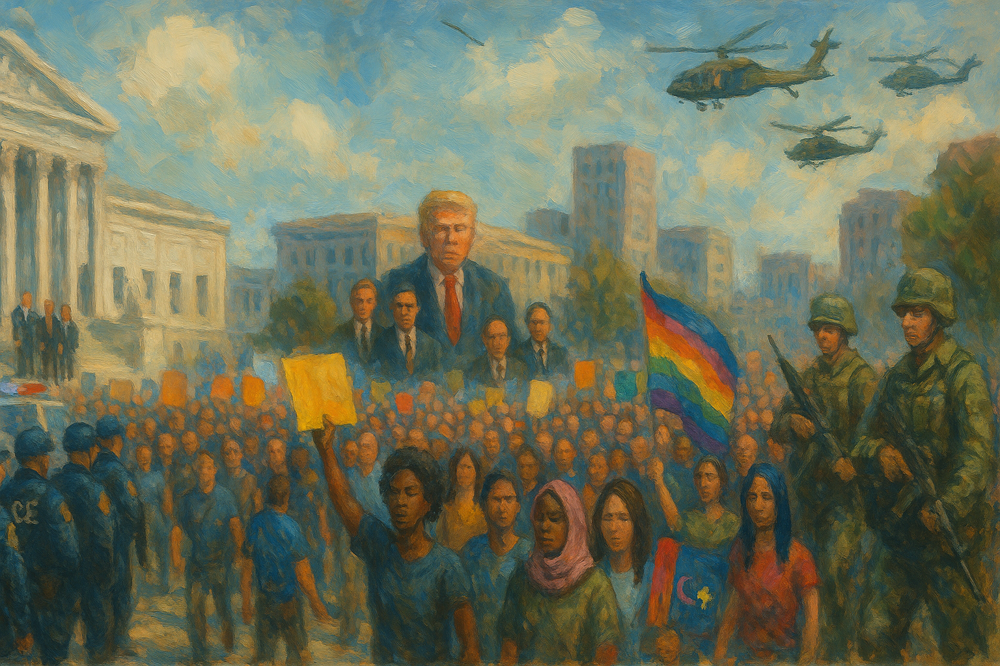

<!-- Generated by build_publish_week_v1 (appendix post) -->
<!-- Header image: image_wide_week53_appendix.png -->

# Week 53 Appendix: Raids and Pardons as Governance

*A week of warrantless raids, emergency decrees, and pay-to-play clemency showed how federal power now rewards loyalty and punishes defiance.*

This was an acute rupture week: the presidency is openly using law enforcement, foreign policy, and regulatory power as instruments of personal rule, while civil society mounts unusually large, coordinated resistance. Structurally, the heaviest pressure falls on rule-of-law traits: DOJ and ICE are weaponized against immigrants, state officials, protesters, journalists, and disfavored law firms, while elite financial and crypto actors receive pardons, deregulation, and bespoke legislation. Emergency logic and militarized responses (Insurrection Act threats, troop alerts, global strikes from Venezuela to Iran) normalize exceptional powers. Federal power is concentrated and targeted at blue jurisdictions (Minnesota, sanctuary cities) and vulnerable groups (immigrants, LGBTQ+ people, minorities, pregnant women), entrenching stratified citizenship. Information manipulation escalates: AI-altered protest images, doctored narratives about ICE abuses, misuse of Social Security data for voter-fraud myths, and continued election lies. Internationally, the "Board of Peace," Greenland brinkmanship, and sanctions on ICC judges signal an attempt to replace rules-based multilateralism with a Trump-centered patronage system. Countervailing forces—federal judges, congressional oversight, mass walkouts, and state-level resistance—are visible but outmatched by the breadth and speed of executive-driven decay.

Power and Authority

1. President Trump declared a national emergency at the southern border and launched mass deportation measures (2026-01-20): By invoking a border emergency to justify mass deportations, troop deployments, and use of the Alien Enemies Act, the president concentrated discretionary power over immigration and civil liberties with limited legislative or judicial constraint.

2. President Trump rapidly dismissed 17 independent inspectors general (2026-01-20): Firing 17 inspectors general weakened internal watchdogs that investigate waste, fraud, and abuse, reducing independent oversight of executive agencies and making it harder to hold officials accountable.

3. President Trump signed an executive order eliminating federal DEI programs and enforcing a two-sex definition in government policy (2026-01-20): Eliminating diversity, equity, and inclusion programs and imposing a restrictive gender definition centralized cultural policy in the executive branch and curtailed protections for marginalized groups within federal institutions.

4. President Trump ordered the Department of Justice to investigate named political opponents and former officials (2026-01-20): Directing DOJ to pursue investigations of specific critics and former officials blurred the line between neutral law enforcement and personal retribution, undermining the norm that prosecutorial decisions are insulated from political command.

5. President Trump threatened to halt all federal payments to sanctuary cities (2026-01-21): Threatening to cut off federal funds to sanctuary cities used fiscal coercion to force local governments to align with federal immigration priorities, pressuring local autonomy and the equal provision of public services.

6. President Trump threatened prosecution of DOJ officials over the 2020 election outcome (2026-01-22): Threatening to prosecute Justice Department officials for not aiding efforts to overturn the 2020 election signaled willingness to punish civil servants for upholding lawful processes, eroding independence within the executive branch.

7. President Trump publicly labeled Minnesota protesters and Democratic officials as agitators, insurrectionists, and corrupt (2026-01-21): Branding protesters and named elected officials as insurrectionists and corrupt framed dissent and opposition governance as illegitimate threats, justifying harsher federal responses and stigmatizing political rivals.

8. President Trump expanded defamation litigation against the New York Times over polling and prior coverage (2026-01-22): Escalating a multibillion-dollar defamation suit against a major newspaper over unfavorable polling and reporting used civil courts as a tool to intimidate critical media and chill robust scrutiny of those in power.

9. President Trump filed a $5bn lawsuit against JPMorgan Chase alleging politically motivated debanking (2026-01-22): Suing a major bank for alleged politically motivated account closures blurred private dispute and political grievance, signaling that powerful officeholders may use litigation to pressure financial institutions’ risk decisions.

10. President Trump called for impeachment of federal judge James Boasberg after an adverse immigration ruling (2026-01-22): Calling for impeachment of a judge who blocked deportations to a dangerous foreign prison directly attacked judicial independence and encouraged political retaliation against courts that constrain executive policy.

11. President Trump pardoned Binance founder Changpeng Zhao following his anti–money laundering conviction (2026-01-23): Pardoning a convicted crypto executive soon after a large investment deal with a Trump-linked firm raised concerns that clemency powers were being used to reward financial allies rather than advance impartial justice.

12. President Trump fired all members of the Commission on Fine Arts and replaced them with loyalists (2026-01-23): Removing an entire federal arts commission and appointing loyalists to oversee a personal White House project weakened independent review of public design decisions and suggested use of appointments for private benefit.

Institutions and Governance

1. U.S. Supreme Court heard arguments in a case on transgender students’ participation in school sports (2026-01-17): The Court’s consideration of West Virginia v BPJ will shape how equal protection and Title IX apply to transgender students, influencing nationwide standards for inclusion and anti-discrimination in education.

2. U.S. Supreme Court heard arguments on Hawaii’s gun-carry restrictions on private property open to the public (2026-01-20): By reviewing Hawaii’s rule that guns are barred from most public-facing private property absent owner consent, the Court is poised to clarify the balance between Second Amendment rights and property owners’ control.

3. U.S. Supreme Court heard a case on President Trump’s attempt to remove Federal Reserve Governor Lisa Cook (2026-01-21): The Court’s review of Cook’s contested removal will determine how insulated the Federal Reserve is from presidential firing power, affecting central bank independence and protection from political retaliation.

4. Federal courts in Minnesota issued and then saw stays of injunctions limiting ICE retaliation against protesters (2026-01-19): District court orders restricting ICE use of pepper spray and retaliatory arrests, followed by an appeals court stay, showed both judicial willingness and limits in constraining federal enforcement tactics against demonstrators.

5. U.S. Department of Justice failed to meet statutory deadlines to release Epstein investigative files (2026-01-19): DOJ’s noncompliance with the Epstein Files Transparency Act, despite millions of unreleased documents, undermined congressionally mandated transparency and fueled perceptions that politically sensitive cases are shielded from scrutiny.

6. Federal court in the Ghislaine Maxwell case denied appointment of a special master to oversee Epstein records release (2026-01-22): Refusing to appoint an independent monitor left enforcement of the Epstein records law in DOJ’s hands, highlighting judicial reluctance to directly manage executive transparency obligations even amid missed deadlines.

7. U.S. District Court for the District of Columbia allowed DHS to require advance notice before lawmakers inspect ICE facilities (2026-01-20): Permitting DHS to demand a week’s notice for congressional visits to immigration detention centers narrowed real-time legislative oversight of confinement conditions and federal enforcement practices.

8. Federal judiciary forced the resignation of U.S. attorney Lindsey Halligan over unlawful appointment (2026-01-21): Judicial findings that Halligan’s interim U.S. attorney role exceeded statutory limits, prompting her departure, demonstrated courts’ capacity to check politicized appointments that bypass Senate confirmation.

9. Federal magistrate judge in Minnesota refused to approve criminal charges against journalist Don Lemon over protest coverage (2026-01-22): Declining to sign a warrant against a journalist who covered a church protest signaled judicial resistance to efforts that could criminalize reporting on demonstrations and chilled press freedom.

10. New York State Supreme Court Justice Jeffrey Pearlman ordered New York to redraw a congressional district map to protect minority representation (2026-01-22): Requiring a new map for New York’s 11th congressional district to comply with state protections for racial and language minorities reinforced judicial enforcement of fair representation standards in redistricting.

11. California Republican Party filed an emergency Supreme Court application to block a voter-approved congressional map (2026-01-21): Seeking to halt a new California map on racial grounds placed federal courts at the center of partisan redistricting disputes and could affect the partisan balance of the U.S. House.

12. U.S. House of Representatives passed a Department of Homeland Security funding bill maintaining ICE’s budget (2026-01-22): Approving DHS funding that preserves ICE’s $10 billion budget despite concerns over abuses showed Congress sustaining core enforcement capacity while making only modest operational adjustments like body cameras.

13. U.S. House of Representatives rejected a resolution to bar Trump from deploying troops to or keeping troops in Venezuela (2026-01-22): Defeating a war powers resolution left presidential authority over military operations in Venezuela largely unchecked, underscoring congressional reluctance to assert its constitutional role in authorizing force.

14. Congressional committees held hearings with Jack Smith and health insurance executives on Trump-era conduct and costs (2026-01-22): Testimony from former special counsel Jack Smith on Trump’s election-related conduct and from insurance executives on rising healthcare costs illustrated Congress’s oversight role, even as partisan conflict limited remedial action.

15. Senator Richard Blumenthal demanded accountability over ICE’s secret memo authorizing warrantless home entries (2026-01-22): By publicly condemning ICE’s warrantless-entry memo as unconstitutional and seeking details on its use, a senator exercised legislative oversight to defend Fourth Amendment protections against executive overreach.

16. Democratic lawmakers led by Senator Elizabeth Warren requested watchdog investigations into diversion of agents from white-collar crime to immigration enforcement (2026-01-23): Calling for probes into the reassignment of tens of thousands of agents away from financial crime toward immigration enforcement highlighted concerns that enforcement priorities were being skewed for political aims.

17. City of Philadelphia sued the federal government over removal of a slavery-related exhibit at Independence National Historical Park (2026-01-23): Challenging the dismantling of an exhibit on Washington’s enslaved workers sought judicial protection for inclusive public history and limits on unilateral federal alteration of civic memory sites.

18. General Services Administration ratified deregulatory rules revising federal management and travel regulations (2026-01-20): GSA’s ratification of broad deregulatory changes to management and travel rules streamlined procedures but also concentrated discretion over federal operations in line with the administration’s priorities.

19. General Services Administration removed its own conduct-on-federal-property rules in favor of DHS regulations (2026-01-20): Eliminating GSA’s conduct rules and deferring to DHS centralized authority over behavior on federal property within a security-focused department, potentially affecting how protests and access are managed.

20. Federal Communications Commission rescinded E-Rate support for off-premises Wi‑Fi and adjusted multiple information collections (2026-01-21): Rolling back E‑Rate funding for off-campus Wi‑Fi while seeking comment on several data collections altered how federal communications support and oversight reach students, small businesses, and media operators.

21. Food and Drug Administration issued multiple guidances, approvals, and enforcement actions on drugs and devices (2026-01-21): FDA’s draft guidances on oncology endpoints, cuffless blood pressure devices, cosmetics records, and pediatric disease vouchers, plus a debarment order, showed ongoing technical regulation that shapes access, safety, and industry behavior.

22. Environmental Protection Agency approved Ohio’s ozone plan and advanced hazardous waste and Superfund decisions (2026-01-20): EPA’s approval of Ohio’s ozone SIP revisions, a hazardous waste injection exemption, a Superfund settlement, and publication of environmental impact statements reflected routine but consequential environmental governance affecting public health.

23. Centers for Disease Control and Prevention and Census Bureau advanced national survey and surveillance data collections (2026-01-20): CDC’s Rapid Surveys System and disease surveillance requests, along with Census revisions to the Annual Integrated Economic Survey, strengthened federal data infrastructure that underpins evidence-based policy.

24. U.S. Congress and President enacted three veterans’ support and accountability laws (2026-01-20): New statutes on disabled veterans’ housing, VA budget shortfall accountability, and service improvements expanded legal guarantees and oversight for veteran care within federal programs.

Economic Structure

1. Trump administration blocked construction of multiple offshore windfarms and rolled back renewable incentives (2026-01-17): Halting major wind projects and eliminating home energy-efficiency tax credits favored fossil fuel interests, constrained clean-energy investment, and contributed to higher electricity costs for households.

2. Trump administration redirected federal housing vouchers from permanent housing to temporary shelters (2026-01-19): Shifting Continuum of Care funds away from permanent supportive housing toward short-term shelters risked increasing homelessness and instability for tens of thousands of vulnerable people.

3. Trump administration imposed broad tariffs under the International Emergency Economic Powers Act (2026-01-20): Using emergency economic powers to levy sweeping import taxes on many countries expanded unilateral executive control over trade policy, with downstream effects on prices, jobs, and alliances.

4. Trump administration implemented tariffs and immigration crackdowns that undercut manufacturing and labor outcomes (2026-01-18): Protectionist tariffs and immigration restrictions, intended to boost native-born employment, instead coincided with manufacturing job losses and weaker outcomes for workers, illustrating how zero-sum economic policies can backfire.

5. President Trump issued an executive order limiting large investors’ purchases of single-family homes (2026-01-20): Restricting institutional investors from buying single-family homes aimed to tilt housing markets toward owner-occupants, potentially easing access to homeownership but also expanding federal influence over private real estate transactions.

6. Trump administration halted payments for detainee medical treatment after ending a VA processing agreement (2026-01-20): Stopping payment flows for detainee healthcare and seeking a private contractor disrupted medical access for people in federal custody, illustrating how outsourcing and contract disputes can endanger basic rights.

7. President Trump and Congress enacted the Genius Act and eased SEC oversight of cryptocurrencies (2026-01-23): Creating a light-touch stablecoin framework and loosening crypto regulation while Trump-linked firms held large stakes raised concerns that financial rules were being written to favor connected actors over consumer and systemic safeguards.

8. Trump administration allowed Affordable Care Act subsidies to lapse and advanced Medicaid and ACA cuts (2026-01-23): Letting ACA subsidies expire and pushing legislation projected to leave millions uninsured shifted health and financial risk onto lower-income households and strained hospitals, deepening inequality in access to care.

9. European Union institutions moved to block a new U.S. trade deal and considered anti-coercion measures in response to Trump tariffs (2026-01-18): EU lawmakers’ refusal to ratify a trade agreement and exploration of countermeasures signaled that U.S. tariff threats were reshaping global trade governance and could trigger retaliatory economic blocs.

10. Financial markets reacted sharply to Trump’s Greenland-related tariff and military threats and later moderated after he backed down (2026-01-23): Stock selloffs, a weaker dollar, and rising Treasury yields following Greenland threats—and partial recovery after de-escalation—showed how investor behavior can constrain or channel aggressive foreign economic policy.

11. Trump administration threatened and imposed tariffs on European allies tied to demands over Greenland (2026-01-21): Using tariffs on European goods, including wine and champagne, as leverage to pressure allies over Greenland linked trade policy to territorial ambitions, risking economic retaliation and politicizing market access.

12. Trump administration and Congress diverted more than 25,000 federal agents from white-collar crime to immigration enforcement (2026-01-23): Reassigning large numbers of investigators away from complex financial crimes toward immigration cases weakened capacity to police corporate fraud and money laundering, advantaging sophisticated economic offenders.

13. Drug Enforcement Administration processed multiple controlled-substance import and manufacturing applications (2026-01-21): DEA’s handling of applications to import and manufacture opioids, anesthetics, and cannabis-related substances shaped the legal supply chain for powerful drugs, balancing medical needs with diversion risks.

14. Federal Communications Commission finalized rule changes for low power television and sought feedback on service delivery (2026-01-23): Updating rules for low power TV and collecting qualitative feedback on FCC services affected how smaller broadcasters operate and how the agency adapts its regulatory approach to stakeholder needs.

15. Noah Smith and collaborators proposed creating a Fertility Policy Research Center to study declining birth rates (2026-01-22): The proposal for a well-funded fertility research center highlighted how large-scale demographic shifts could drive new public–private research institutions with long-term economic and social policy implications.

Civil Rights and Dissent

1. Trump administration reversed LGBTQ+ protections via executive orders affecting healthcare, passports, and federal information (2026-01-17): Rolling back LGBTQ+ protections, including funding for gender-affirming care and recognition on passports, curtailed equal access to services and signaled state disfavor toward transgender people’s rights.

2. Trump administration terminated Temporary Protected Status for over 500,000 Venezuelans (2026-01-22): Ending TPS for Venezuelans forced hundreds of thousands of residents with deep U.S. ties toward possible deportation, illustrating how immigration status can be abruptly politicized and rights stratified by origin.

3. Trump administration and allied institutions pressured hospitals and universities to halt gender-affirming care for minors (2026-01-23): Federal denunciations and settlements that led major hospitals to stop pediatric gender-affirming care reduced medical options for transgender youth and showed how political pressure can override clinical judgment.

4. Trump administration expanded the Mexico City policy to bar foreign aid recipients from funding DEI and trans rights work (2026-01-22): Extending funding bans to overseas DEI and so-called gender ideology programs exported domestic culture-war priorities into U.S. foreign aid, constraining civil society and rights advocacy abroad.

5. Trump administration issued executive orders restricting DEI efforts among federally funded medical and advocacy groups (2026-01-23): New DEI restrictions pushed organizations like ACOG to forgo federal funds rather than dilute equity work, pressuring professional bodies to align with administration ideology or lose resources.

6. Centers for Disease Control and Prevention stopped recommending Covid vaccination for pregnant women (2026-01-23): Reversing guidance on Covid vaccination in pregnancy against the advice of medical groups undermined evidence-based care and could increase health risks for pregnant patients and infants.

7. Centers for Disease Control and Prevention and Trump administration moved to block federally funded overdose-prevention messaging such as “never use alone” (2026-01-23): Restricting harm-reduction messaging under an executive order against “crime and disorder” limited public health tools to prevent overdoses, prioritizing punitive framing over evidence-based strategies.

8. Trump administration cut Medicaid and ACA support through the One Big Beautiful Bill Act (2026-01-23): Legislated reductions in Medicaid and ACA coverage projected to leave 10 million uninsured threatened access to essential healthcare, especially for low-income, pregnant, and rural populations.

9. Trump administration ended NIH funding for research using fetal tissue from elective abortions (2026-01-22): Banning NIH support for fetal tissue research curtailed lines of biomedical inquiry, reflecting ideological control over science policy with implications for future treatments and public health.

10. Trump administration threatened law firms representing perceived enemies with loss of federal contracts and clearances (2026-01-22): Targeting specific law firms for their clients by threatening to strip contracts and access undermined the independence of the legal profession and could deter representation in politically sensitive cases.

11. Department of Justice filed criminal complaints against church protesters and considered charges against journalist Don Lemon (2026-01-21): Pursuing charges against protesters and attempting to charge a journalist over a church demonstration blurred lines between protecting worship and punishing dissent, raising First Amendment concerns.

12. Department of Justice announced an investigation into protesters who disrupted a Minnesota church service (2026-01-19): Opening a federal civil-rights investigation into protesters at a church where an ICE official pastors highlighted tensions between protecting worship spaces and safeguarding protest rights against government retaliation.

13. Trump administration and ICE used warrantless home entries, child detentions, and aggressive raids against immigrant communities (2026-01-22): Leaked memos authorizing home entries without judicial warrants, use of a five-year-old as bait, and school-area arrests in Minnesota and Maine showed immigration enforcement tactics that eroded due process and traumatized families.

14. Department of Justice under Deputy Attorney General Todd Blanche declined to investigate the fatal ICE shooting of Renee Good, prompting prosecutor resignations (2026-01-18): Refusing to open a federal criminal probe into Renee Good’s killing despite disputed evidence, and the ensuing resignations, signaled selective non-enforcement when federal agents use lethal force.

15. Immigration and Customs Enforcement experienced a spike in detainee deaths amid halted medical payments and poor conditions (2026-01-22): At least six detainee deaths in early 2026, including a homicide by guards and suspected suicides, underscored systemic neglect and abuse in ICE facilities, raising grave human-rights concerns.

16. Trump administration and DHS dismissed numerous career DOJ lawyers and politicized key legal appointments (2026-01-22): Firing career Justice Department lawyers tied to prior Trump prosecutions and installing inexperienced loyalists weakened professional independence in federal law enforcement and prosecution.

17. Department of Government Efficiency staffers misused Social Security data and sought voter files to pursue alleged fraud (2026-01-22): Secret agreements to share SSA data with a political group and to cross-check voter rolls for fraud weaponized government databases for partisan aims and threatened privacy and electoral confidence.

18. Brandon Wright sued DHS alleging he was fired for privately criticizing Secretary Kristi Noem (2026-01-21): A DHS employee’s lawsuit claiming termination for private political speech raised questions about whether civil servants can safely criticize leadership without facing retaliatory job loss.

19. U.S. Department of Justice investigated Minnesota Governor Tim Walz and Mayor Jacob Frey for allegedly impeding ICE (2026-01-19): Criminal investigations and subpoenas targeting Minnesota officials who opposed ICE tactics suggested federal law enforcement was being used to intimidate state and local leaders resisting administration policies.

20. Immigration and Customs Enforcement conducted targeted crackdowns on Somali communities in Maine and immigrant students in New Haven (2026-01-21): Operations focusing on Somali immigrants in Maine and easier ICE access to schools in Connecticut heightened fear, disrupted education, and reinforced perceptions that enforcement targets specific ethnic and immigrant groups.

21. Trump administration planned deportations of at least 40 Iranian nationals, including LGBTQ+ individuals, despite safety concerns (2026-01-22): Scheduling deportations to Iran for people, including gay men facing capital punishment, prioritized rigid enforcement over non-refoulement and human-rights obligations toward vulnerable asylum seekers.

22. North Carolina officials and activists convened an elections board meeting and organized a Long March for voting rights (2026-01-18): A GOP-controlled elections board meeting and a planned Long March protesting racial gerrymandering in North Carolina highlighted institutional and grassroots struggles over fair representation for Black voters.

23. Civil society organizations organized nationwide Free America Walkouts and Minnesota economic blackouts against authoritarian policies (2026-01-20): Coordinated walkouts, strikes, and economic blackouts across states, especially in Minnesota, demonstrated large-scale noncooperation as a tool to contest perceived authoritarian drift and immigration abuses.

24. Showing Up for Racial Justice and allied groups held trainings and solidarity efforts in response to Twin Cities crackdowns (2026-01-18): Organizing trainings to support communities facing racialized enforcement in Minnesota built grassroots capacity to document abuses and advocate for civil rights under pressure.

25. Women’s March and allied activists organized a national walkout against perceived government oppression (2026-01-20): A nationwide walkout coordinated by the Women’s March mobilized citizens to protest policies seen as undermining democratic norms, signaling broad-based civic resistance.

26. U.S. District Judge Katherine Menendez barred DHS from retaliating against peaceful protesters and using less-lethal weapons on them (2026-01-18): A federal order protecting peaceful protesters from DHS retaliation and chemical agents affirmed judicial support for assembly rights amid aggressive federal enforcement.

27. Trump administration and ICE conducted large-scale enforcement surges in Minnesota and Maine with thousands of agents (2026-01-20): Deploying thousands of federal agents in Minnesota and over 100 arrests in Maine turned immigration enforcement into a quasi-military presence, heightening fear and straining relations with local authorities.

28. Vice President J.D. Vance publicly defended ICE’s conduct in Minnesota despite widespread disapproval (2026-01-23): Defending ICE actions after controversial shootings and raids, while acknowledging only isolated mistakes, signaled executive backing for aggressive enforcement despite public concern.

29. New Haven Public Schools implemented policies to limit ICE access to schools amid deportation fears (2026-01-23): Requiring legal verification before admitting ICE officers into schools sought to protect immigrant students’ access to education and reduce the chilling effect of enforcement on attendance.

30. U.S. courts in Chicago acquitted Juan Espinoza Martinez in a murder-for-hire case targeting a border official (2026-01-23): A jury’s acquittal in a high-profile alleged plot against a border commander, one of many failed prosecutions, raised questions about the strength and framing of federal cases tied to immigration enforcement.

31. Local and federal law enforcement investigated and prosecuted violent attacks on judges and clergy abuse cases (2026-01-18): Arrests in the shooting of an Indiana judge and prosecution of a Louisiana priest for abuse showed criminal justice systems addressing threats to judicial safety and longstanding institutional misconduct.

Information, Memory and Manipulation

1. White House and Press Secretary Karoline Leavitt threatened legal action against CBS if a Trump interview was edited (2026-01-18): Warning a network to air an interview unedited under threat of litigation pressured editorial independence and signaled a willingness to use legal tools to shape media presentation of the president.

2. President Trump signed an executive order framed as ending government censorship while freezing university funds and targeting law firms (2026-01-20): An order ostensibly defending free expression that froze funding for universities and targeted certain law firms effectively punished institutions whose speech or clients displeased the administration.

3. President Trump dismissed unfavorable polling on Greenland as fake and attacked broader polling and media (2026-01-17): Labeling independent polls as fake and expanding lawsuits against outlets like the New York Times undermined trust in empirical measures of public opinion and sought to delegitimize critical coverage.

4. President Trump reposted long-debunked conspiracy theories about 2020 election fraud (2026-01-21): Reviving false claims about vote flipping and foreign interference continued to erode confidence in electoral integrity and provided rhetorical cover for efforts to weaken election administration.

5. Department of Government Efficiency and associated staffers improperly accessed and shared Social Security data with a political group and spread false voter-fraud claims (2026-01-22): Secret data-sharing agreements and public speeches misusing SSA records to allege mass noncitizen voting turned administrative data into a partisan weapon and fueled disinformation about elections.

6. White House communications staff posted AI-altered images of arrested activist Nekima Levy Armstrong to depict her as hysterical and distressed (2026-01-22): Publishing digitally altered photos of a Black protest leader, including darkened skin and exaggerated emotion, manipulated public perception of her character and could prejudice legal proceedings.

7. President Trump publicly released private messages and texts from foreign leaders, including Emmanuel Macron (2026-01-20): Leaking confidential diplomatic communications on social media broke norms of discretion, undermining trust among allies and signaling that private exchanges could be weaponized for domestic politics.

8. Trump administration and National Park Service removed a slavery-related exhibit at the President’s House site in Philadelphia (2026-01-23): Dismantling an exhibit about people enslaved by George Washington at a key historic site altered public memory of the presidency and slavery, prompting legal action to restore the narrative.

9. Trump administration sanctioned 11 International Criminal Court judges over investigations into U.S. and Israeli conduct (2026-01-22): Imposing sanctions on ICC judges for pursuing war-crimes inquiries signaled hostility to independent international accountability mechanisms and sought to deter legal scrutiny of allied actions.

10. Federal Communications Commission set a compliance date for multilingual Wireless Emergency Alerts (2026-01-20): Requiring emergency alerts in multiple languages and sign language expanded inclusive access to critical information, strengthening equitable communication during crises.

11. Federal Communications Commission sought public comment on FOIA/Privacy Act information collection processes (2026-01-22): Reviewing how it handles FOIA and Privacy Act requests offered an opportunity to improve transparency and reduce burdens for those seeking information from the agency.

12. Federal Communications Commission invited feedback on qualitative service-delivery surveys (2026-01-23): Collecting qualitative feedback on FCC services aimed to refine how the agency communicates and responds to stakeholders, potentially improving public trust in regulatory processes.

13. Mark Davis, Florida House candidate redirected the domain nazis.us to the Department of Homeland Security website (2026-01-17): Pointing a provocative domain at DHS’s site used symbolic digital protest to criticize perceived authoritarian tendencies in immigration enforcement and the Republican Party.

14. Nick Sortor and allied rightwing media figures circulated narratives celebrating aggressive ICE tactics and disputed a vehicle incident with protesters (2026-01-19): Influencer coverage that glorified force against protesters and framed a car-driving incident as self-defense contributed to polarized narratives around federal crackdowns and protest legitimacy.

15. Trump administration continued to promote conspiracy theories about the 2020 election while enjoying broad legal immunity (2026-01-23): Ongoing promotion of debunked election narratives, combined with Supreme Court immunity rulings, entrenched a disinformation environment in which powerful actors face few consequences for undermining democratic outcomes.

