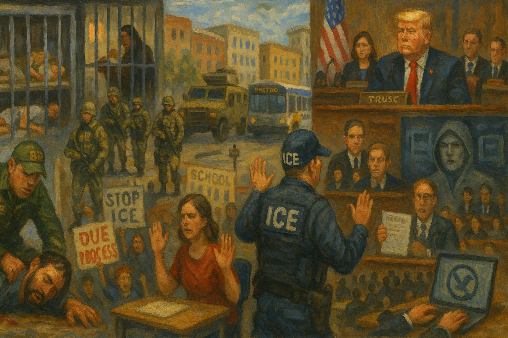

<!-- Generated by build_publish_week_v1 -->
<!-- Header image: image_wide_week54.png -->

# Week 54: Occupation as Governance

*A federal security apparatus turns cities and elections into contested territory, while courts, Congress, and civil society fight to keep law and memory intact.*

> The instruments of security, once unmoored from law, do not merely defend the state; they begin to define it. — Anonymous legal scholar
> The line between order and occupation is crossed quietly, when those who are governed no longer recognize the force that claims to protect them. — Observer of internal conflicts
> Every regime decides which memories to preserve and which to erase; that choice is itself an act of power. — Historian of modern states

The fifty-fourth week of Trump’s second term unfolded as a study in saturation. Power did not move through a single decree or a single scandal. It moved through a dense mesh of raids, court orders, propaganda images, budget fights, and street protests, all layered on top of one another. The pattern that emerged was of a security state acting as a domestic occupying force in opposition strongholds, while courts, legislators, and civil society tried—unevenly—to draw lines that still held. It felt less like a single crisis than a pressure system settling in.

At the close of the previous period, the Democracy Clock stood at 8:12 p.m. By the end of this week, it remained at 8:12 p.m., a net shift of 0.1 minutes. The hands barely moved, but not because the week was quiet. The near-hold reflected two opposing currents: an executive branch that widened its use of force and law in Minneapolis, in immigration detention, and in election administration, and a set of counter-moves—by judges, by Congress, by local officials and mass movements—that slowed, exposed, or partially blocked those advances. The balance did not restore lost ground. It kept further erosion from registering as a larger step toward midnight.

The clearest expression of federal power this week was Operation Metro Surge. In Minneapolis, thousands of ICE and Border Patrol agents arrived under a security banner, turning a Democratic-led city into something closer to a federal occupation zone. The operation’s stated aim was to restore order and enforce immigration law. On the ground, it meant armored vehicles in residential neighborhoods, checkpoints near schools, and agents moving through streets and transit hubs with broad discretion and little local input. The city’s own police and elected officials were pushed to the margins of decisions that shaped daily life. That was the point.

Within that frame, tactics that might once have been reserved for rare emergencies became routine. Agents conducted raids at schools and churches, entering spaces that communities had long treated as safe. Warrantless home entries, justified as hot pursuits or exigent circumstances, became a recurring feature of the operation. Families woke to doors broken open and children taken into custody. Some were transferred out of state within hours, moved through a network of detention centers that made it hard for lawyers and relatives to track them. The line between immigration enforcement and collective punishment blurred.

Children were at the center of several of the week’s most jarring cases. ICE detained schoolchildren swept up in neighborhood raids, and a child who was a U.S. citizen was deported in apparent defiance of both policy and court expectations. In Minnesota, students and families linked to school communities found themselves targeted, with one case involving a child taken from a bus stop and another involving a family separated after a traffic stop. These incidents did not occur in isolation. They were part of a broader pattern in which immigration status and perceived ethnicity determined who could count on basic protections.

State and local authorities did not simply accept this. Minnesota officials sought court orders to limit ICE’s reach, to require warrants for home entries, and to ensure access to counsel for those detained. Judges issued emergency rulings blocking certain deportations and halting the transfer of refugees, at least temporarily. One order cataloged dozens of prior ICE violations, signaling that the courts were no longer willing to treat noncompliance as isolated mistakes. The state attorney general moved to unmask federal agents involved in controversial shootings, and local police in Minneapolis at times refused to cooperate with federal directives they viewed as unlawful. Resistance was uneven, but it was real.

The federal response to this pushback was not to retreat, but to adjust leadership. At Border Patrol and ICE, senior officials were reshuffled. Tom Homan, a hardline immigration figure, was installed after the removal of Jason Bovino. Other leadership changes at DHS and within the immigration enforcement hierarchy emphasized loyalty to Trump’s narratives on immigration and elections over neutral competence. These moves signaled that the administration saw the clash with courts and states not as a warning, but as a test of how far it could push a security-first model of governance in disfavored jurisdictions.

The killings of Alex Pretti and Renee Good in Minneapolis brought the underlying conflict into sharp relief. Pretti, a local resident, was shot by federal agents during a street operation tied to Metro Surge. Renee Good, a nurse, was killed in a separate incident when agents opened fire near a protest. In both cases, initial DHS accounts framed the victims as threats and suggested that agents had acted in self-defense. Those narratives were quickly challenged by witnesses, local officials, and emerging video evidence. The gap between what people saw and what the federal government said became impossible to ignore.

As more details surfaced, the pattern of misrepresentation and obstruction grew clearer. DHS issued misleading statements about the circumstances of the shootings, downplaying the level of force used and omitting key facts. Federal officials attempted to block state investigators from accessing evidence, including surveillance footage and ballistic reports. At one point, there were credible fears that records might be destroyed or sanitized before independent review. State courts intervened, issuing orders to preserve evidence and to allow local investigators into federal-controlled scenes. Those orders were themselves met with delay and partial compliance.

The response spread beyond Minnesota. Local police in some jurisdictions refused to participate in joint operations they viewed as reckless. Lawsuits were filed on behalf of the victims’ families and on behalf of protesters who had been teargassed or beaten during demonstrations that followed the killings. Judges in multiple districts issued rulings that not only halted specific actions but also criticized DHS and ICE for serial defiance of prior orders. In Congress, bipartisan calls for hearings grew louder. Republicans who had supported strong enforcement now demanded explanations for why a nurse and a bystander had died in operations that seemed far removed from any imminent threat.

Public grief and anger turned the deaths into national symbols. Vigils were held in churches and public squares, with clergy and community leaders naming Pretti and Good alongside earlier victims of state violence. Protests spread from Minneapolis to other cities, including airport demonstrations and marches that blocked major roads. The government’s effort to label some of these gatherings as riots or domestic terrorism only deepened the sense that dissent itself was being treated as a security problem. When the Justice Department finally announced a civil-rights probe into the killings, it did so under pressure, not as an act of spontaneous oversight.

Beyond Minneapolis, the week revealed a broader pattern inside ICE’s detention and deportation system. A cluster of deaths in custody came to light, including cases where detainees had been denied timely medical care or had been held in conditions that violated prior court orders. Refugees and asylum seekers were detained in facilities far from legal aid, and some were moved repeatedly, making it difficult for lawyers to maintain contact. Reports surfaced of a refugee child separated from family and held without clear justification. Each case was tragic on its own. Together, they suggested a system in which life and due process were contingent on status and race.

Legal advocates responded with a coordinated offensive. A class action challenged ICE’s restrictions on access to counsel, arguing that detainees were being effectively denied their right to representation. Federal judges in different circuits issued emergency stays on deportations, particularly in cases involving children and refugees. One judge, Patrick Schiltz, issued an order cataloging ninety-six separate ICE violations of prior rulings and raised the prospect of contempt sanctions against both the agency and individual officials. His language was unusually direct, reflecting frustration with an executive branch that treated court orders as suggestions.

Yet even these judicial moves were ad hoc and reactive. They did not amount to a coherent regime of oversight. ICE continued to defy or skirt some rulings, shifting detainees to new facilities or reclassifying operations to avoid specific constraints. The agency’s leadership, backed by the White House, framed the courts as obstacles to national security and public safety. In this way, the immigration system functioned as a parallel justice track, one in which constitutional norms applied only when advocates could marshal enough resources and attention to force a judge’s hand. The default was impunity.

In Washington, Congress and the courts tried to convert outrage into structural leverage. Senate Democrats refused to approve a full-year DHS budget without reforms to ICE’s practices. They pushed instead for a separate, time-limited funding track for the department, tying appropriations to specific changes in enforcement and detention. This move risked a partial shutdown and drew sharp criticism from the White House, but it also signaled that at least one chamber was willing to use the power of the purse to challenge a security apparatus that had become central to the president’s political project.

In the House, attention focused on DHS leadership and on Kristi Noem, whose role in the administration’s immigration and security agenda had drawn scrutiny. Impeachment threats circulated, and committees opened inquiries into her conduct and into DHS appropriations more broadly. Bipartisan oversight hearings were scheduled to examine ICE’s defiance of court orders and the deaths in custody. These hearings did not guarantee change, but they created a public record and forced agency heads to answer questions under oath. The contrast between the administration’s rhetoric and the facts on the ground became harder to paper over.

The judiciary’s role in this counteroffensive was crystallized in Schiltz’s order and in related rulings. By documenting nearly a hundred instances in which ICE had ignored or violated prior court instructions, the order transformed what might have been seen as isolated lapses into evidence of a systemic pattern. Other judges echoed this concern, warning that continued noncompliance could lead to sanctions or even criminal referrals. For the first time in this term, there was a visible, coordinated judicial effort to confront executive noncompliance in the immigration domain. Whether that effort would be sustained remained an open question.

At the same time, intra-party friction and shutdown brinkmanship revealed the limits of legislative resolve. Some Republicans balked at the prospect of a DHS funding lapse, while others urged an even harder line in support of ICE. Democrats themselves were divided over how far to push conditions on appropriations. The result was a compromise that split off DHS funding but did not yet impose the full suite of reforms advocates sought. Congress had moved beyond pure performance, but it had not yet demonstrated that it could impose durable constraints on a security state aligned with the president.

While immigration and protest dominated the streets, another front opened around elections. In Georgia, the Justice Department and FBI executed sweeping raids on Fulton County’s 2020 election records. Agents seized ballots, voter files, and other materials under the banner of investigating alleged fraud. The operation was notable not only for its scope but also for the presence and later reassignment of the Director of National Intelligence, who had been redirected to hunt for evidence of foreign interference in support of Trump’s long-standing claim that the 2020 election had been stolen. Intelligence work was pulled into a domestic political story.

The Fulton County raids did not occur in a vacuum. They were part of a broader campaign in which the federal government demanded voter-roll data from states, pressed for access to local election systems, and framed these efforts as necessary for “election integrity.” An election denier was elevated to a key role inside DHS, with responsibilities touching on election security. At the same time, the Atlanta FBI special agent in charge, who had raised concerns about the legal basis for some of these actions, was removed from his post. The message to internal skeptics was clear. Alignment with the fraud narrative was now a condition of advancement.

These moves blurred the line between law enforcement and partisan power. By treating settled election results as open criminal questions, and by putting intelligence and security agencies in service of that story, the administration undermined confidence in both past and future elections. The seizure of ballots and voter data, combined with the sidelining of officials who questioned the effort, suggested that the goal was not neutral fact-finding but the construction of a federal narrative that could justify tighter control over election machinery in key jurisdictions.

Information control was not limited to elections. The White House and its allies escalated their use of AI-generated propaganda to shape public perception of protests, immigration, and the economy. One altered image smeared Nekima Levy Armstrong, a prominent protest leader, by depicting her in a way designed to inflame racial resentment and cast her as a threat. Other AI images portrayed Trump as a quasi-religious figure—a pope, a king—standing above adoring crowds. Still others showed a fictitious economic “golden age,” with gleaming factories and happy workers, bearing little relation to actual conditions.

These images circulated through state-aligned media and social platforms, often amplified by algorithms that favored engagement over accuracy. At the same time, tools that citizens used to monitor and resist abuses came under pressure. Meta and major app stores removed ICE-tracking applications that had helped communities document raids and share real-time information. TikTok blocked or down-ranked videos that showed ICE abuses or criticized the administration’s immigration policies. In several cases, these platform decisions followed quiet outreach or public pressure from the Justice Department, which framed the tools as security risks or facilitators of doxing.

Behind the scenes, corporate data and telecom giants deepened their role in the enforcement infrastructure. Amazon’s cloud systems hosted ICE databases and analytics tools, making it easier to track and target individuals across jurisdictions. AT&T provided priority networks that ensured ICE and CBP communications would remain robust even when local systems were strained. Banks financed private prison operators that ran detention centers, tying profit streams to the volume and duration of detentions. These arrangements placed core coercive functions in the hands of private entities that were not subject to the same transparency or accountability as public agencies.

The result was an ecosystem in which the same networks that carried AI propaganda also carried the data and communications that made raids and detentions possible. State narratives about security and order spread quickly, while images and tools that might have challenged those narratives were throttled or removed. Ordinary citizens found themselves more visible to the state—through surveillance, data sharing, and algorithmic profiling—while elite misconduct, such as corrupt oil deals or abuses inside detention centers, remained opaque. Surveillance increased downward. Opacity thickened upward.

Against this backdrop, resistance did not fade. It adapted. In Minnesota, mass street protests continued despite arrests and the use of teargas. Clergy led processions and occupied public spaces, framing their actions as both moral witness and constitutional defense. Airport protests disrupted travel and drew national media attention, linking local grievances to broader concerns about federal overreach. Organizers planned a national strike and shutdown, urging businesses and workers to pause normal activity in solidarity with those targeted by ICE and CBP. These plans were ambitious. They reflected a belief that only economic disruption could force a change in course.

Local officials joined this effort in more formal ways. Governors and mayors in several states demanded the withdrawal of federal forces or at least the scaling back of operations. Some refused to allow their police to participate in joint task forces. A coalition of prosecutors, informally dubbed the F.A.F.O. group, pledged to scrutinize federal cases arising from protests and to decline prosecutions they viewed as politically motivated. Bipartisan calls for investigations into ICE and DHS grew, with some Republicans framing their concern in terms of federalism and local control rather than civil liberties. Public opinion polls showed support for ICE dropping, especially among younger voters and in urban areas.

The administration responded to this resistance by reframing dissent itself. Officials labeled protesters as rioters, extremists, or even domestic terrorists. A Justice Department memo targeted antifa and other loosely defined groups, signaling that participation in certain kinds of protest could draw federal scrutiny. Don Lemon, a high-profile journalist, was charged with civil-rights crimes over his role in a church protest, a move that many saw as an attempt to intimidate both the press and religious communities that had aligned with demonstrators. In this way, the state sought not only to suppress specific actions but to redefine the act of protest as inherently suspect.

While these domestic struggles played out, Trump continued to wield executive power and foreign policy tools in ways that personalized the state and rewarded allies. A concentrated wave of clemency benefited fraudsters and white-collar offenders with political and financial ties to Trump-aligned networks. Some had been involved in half-billion-dollar Venezuelan oil deals that also generated campaign donations. Others were linked to figures in Trump’s inner circle. At the same time, the Justice Department cut resources for child-exploitation enforcement, signaling a shift in priorities away from protecting vulnerable victims and toward shielding well-connected offenders.

Executive orders extended this pattern into other domains. One order asserted national emergency powers over Cuba, including tariff authority, under the banner of security and hardline foreign policy. Another order on rebuilding Los Angeles after disasters overrode state processes and environmental safeguards, centralizing control in the White House and opening the door for contracts to flow to favored firms. Climate and alliance withdrawals continued, pulling the United States out of cooperative global frameworks and aligning it more closely with authoritarian leaders abroad. A widely circulated photo of Trump with Vladimir Putin, framed as a symbol of strong leadership, underscored this shift.

Cultural institutions were not spared. The Kennedy Center was overhauled and renamed to include Trump’s name, with board appointments stacked with loyalists. AI imagery cast Trump as a monarch-like figure presiding over national culture. Public funds supported these symbolic projects, turning what had been a quasi-independent arts institution into a stage for personal glorification. Outreach to separatist movements in places like Alberta hinted at a foreign policy that favored fragmentation and grievance over stability and rule-based order. In all of this, the boundary between state interest and personal or factional interest grew thinner.

Taken together, the week’s developments showed a government that increasingly used security forces, law, information, and symbols to protect itself and punish opponents, while still facing pockets of resistance strong enough to slow but not reverse that trend. Federal power was most aggressively deployed in disfavored regions and communities—Minneapolis, immigrant neighborhoods, opposition-led jurisdictions—where lethal force, raids, and ballot seizures were justified as necessary for order and integrity. Courts, Congress, local officials, and civil society responded with tools that remained available to them: injunctions, budget conditions, hearings, protests, and economic pressure.

The near-stasis of the Democracy Clock in this period does not mean the week was neutral. It means that deepening abuses met with real, if fragile, countervailing forces. Judicial orders preserved evidence that might otherwise have vanished. Congressional maneuvers carved out space to demand reforms. Mass movements kept public attention on deaths that might have been buried under official narratives. Yet the structural direction of travel remained clear. Security forces aligned more tightly with elite preservation. Dissent was more often cast as extremism. Data and algorithms served power rather than the public.

In this sense, Week 54 marked not a turning point but an intensification of an existing pattern. The executive branch tested how far it could go in treating parts of the country as occupied territory and parts of the electorate as suspect. Other institutions, still functioning but under strain, pushed back just enough to keep the clock from lurching forward. The question left hanging at the week’s end was whether those institutions could sustain that resistance as the costs of defiance rose and the tools of manipulation grew more refined.

<!-- Synopses for cross-posting -->
Long Synopsis: Week 54 of Trump’s second term is less a single crisis than a pressure system settling in. Operation Metro Surge turns Minneapolis into a de facto occupation zone, with ICE and Border Patrol conducting raids in homes, schools, and churches, killing Alex Pretti and Renee Good, and obstructing state investigations. Parallel abuses inside ICE detention, including deaths in custody and child deportations, reveal a national enforcement system where status and race shape who receives due process. Courts and advocates mount an ad hoc counteroffensive: emergency stays, class actions, and Judge Schiltz’s order cataloging ninety‑six ICE violations. In Washington, Congress uses DHS funding and hearings to probe ICE and Kristi Noem, even as Trump reshapes security leadership, redirects intelligence toward 2020 “fraud,” and elevates an election denier at DHS. AI propaganda, platform suppression of anti‑ICE tools, and corporate surveillance infrastructure fuse information control with enforcement. The Democracy Clock barely moves, not for lack of danger, but because resistance still slows the slide.
Short Synopsis: Federal power saturates Minneapolis, detention centers, and election offices, using security, law, and AI propaganda as tools of control. Courts, Congress, and mass movements respond with injunctions, budget leverage, and street resistance, holding the Democracy Clock at 8:12 p.m. even as occupation-style tactics normalize.

