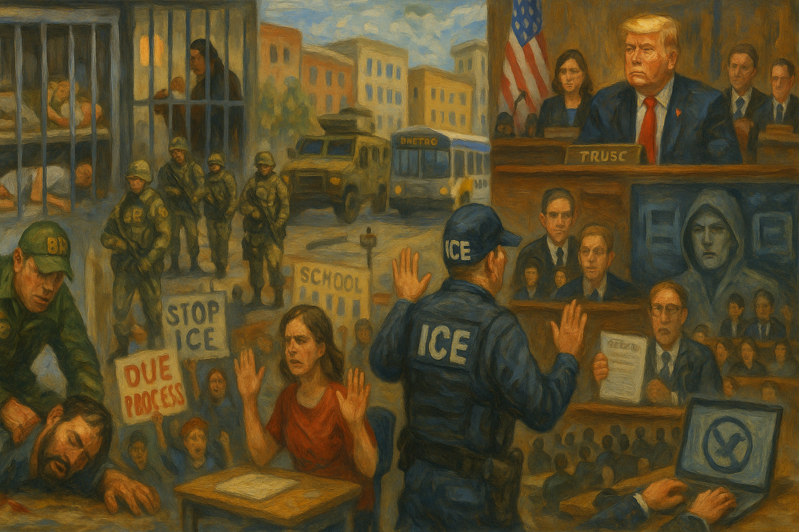

<!-- Generated by build_publish_week_v1 -->
<!-- Header image: image_wide_week54.png -->

# Week 54: Minneapolis Absorbs a Nation's Pressure

*A week of raids, a killing, and courtroom battles moved the clock only slightly while nearly everything moved at once.*

Federal agents detained a five-year-old boy, Liam Ramos, and his father. Days later, an operation swept up two more children from the boy's school, along with their mother. These were not isolated incidents.

The week did not announce itself with a single fracture. Instead, it arrived as an accumulation: dozens of separate actions in courtrooms, agencies, city streets, and congressional hearing rooms that, taken together, showed a government pressing harder against the people it governed. Yet the needle of formal law barely moved. The Democracy Clock, which tracks structural drift rather than scandal, registered this week as a story of intensity without acceleration. Enormous pressure came from many directions at once. Courts and citizens, for now, still found room to push back.

At the close of the previous period the clock read 7:43 p.m. It closed this week at the same time, a movement of six one-hundredths of a minute. The number is nearly still. But stillness here does not mean calm. Ferocious activity in Minnesota, in the EPA, in Congress, and in the federal courts pulled in different directions at once. Some of it deepened the erosion of restraint; some held a line against it. The two nearly canceled out. The week was loud. The clock stayed patient.

The center of the week's gravity was Minneapolis. Federal agents detained a five-year-old boy and his father, then swept up two more children from the boy's school days later, along with their mother. These were not isolated acts. They came inside a broader campaign of raids that reached churches, a Target store, and school-adjacent neighborhoods, spreading fear through immigrant households far beyond any narrow legal target. Judges intervened again and again, ordering releases and blocking deportations. But the pattern itself told its own story: families seized near school buses, a child used as what local officials called bait. The enforcement apparatus showed little concern for who stood in its path. Citizenship, in practice, had become a matter of proof and luck rather than a settled fact.

The raids did not stay contained to immigration status. They widened into direct confrontation with local institutions. Advocacy groups sued over blocked attorney access at detention sites. State investigators found themselves obstructed by federal officials even as they tried to examine potential wrongdoing. A federal judge in Minnesota catalogued nearly one hundred violations of his own court's orders by ICE. The record was so stark that he warned publicly that the agency was not a law unto itself. The volume of litigation was itself a signal: courts were not settling disputes so much as trying to contain an operation that kept outrunning judicial restraint.

Then came the killing of Alex Pretti. His death at the hands of federal agents became the week's second center of gravity, pulling together threads that had been separate: protest, politics, and public trust. The president moved quickly to blame Democratic officials for the death. Justice Department leadership, more soberly, called it a tragedy and opened a civil rights inquiry. Video evidence surfacing in the following days complicated the government's own account. Minnesota's corrections department built a website simply to rebut the federal narrative — an extraordinary step, a state agency standing up its own record against the word of federal officials.

The political aftershocks spread quickly. Members of Congress from both parties called for investigations. Some pushed to impeach the Homeland Security secretary. The president dispatched his border czar to manage the crisis directly, then reversed course days later, discussing troop withdrawals after a call with Minnesota's governor. A Republican candidate for governor withdrew from his race, saying he could not defend what he called an unconstitutional operation. Former presidents from both parties condemned the violence. Rarely does a single local death generate this much elite cross-current. The killing had become a referendum on the administration's entire enforcement posture.

Against this pressure, courts acted as the most consistent brake. A federal judge ordered evidence in the Pretti shooting preserved, over reported federal resistance. Another judge summoned ICE's acting director to appear in person, threatening contempt for what looked like defiance of prior orders. The Eleventh Circuit and a Minnesota court both intervened to block detentions and demand due process for refugee families. None of these rulings reversed the underlying operation; they worked instead as emergency dampers, applied after harm had already occurred. The judiciary's vigor this week was real. But it was reactive.

Congress, too, found itself drawn into the fight, this time through the power of the purse. Senate Democrats threatened to strip Homeland Security funding from a broader spending package unless immigration practices changed. Senator Rand Paul summoned immigration officials to testify. The dispute nearly triggered a government shutdown before negotiators split off Homeland Security funding to keep the rest of government open. The underlying fight over ICE practices stayed unresolved. The episode showed a legislature willing to use appropriations as leverage. It also showed how quickly that leverage could be traded away to avoid a shutdown.

Civil society did not wait for institutions to act. Minneapolis residents organized patrols, food support, and legal aid networks in the raids' wake. Clergy were arrested protesting at the airport. Business owners across the state closed their doors in solidarity. National organizations coordinated a broader wave of walkouts and demonstrations aimed at pushing ICE "out of everywhere." A composer withdrew a symphony premiere from the Kennedy Center in protest of its political direction. None of this halted federal operations. But it showed a public still willing to spend its own resources, professional and financial, to register dissent. Repression had not yet produced quiet.

Alongside the raids ran a quieter campaign to control the story. The White House posted a digitally altered image of an arrested protester, a crude but telling use of official channels to shape perception. Homeland Security's account of the Pretti shooting conflicted with video evidence that later surfaced. ICE expanded biometric and drone surveillance of protest networks. Reporters covering the church protests, including a well-known former news anchor, were arrested. Meta removed a Facebook group tracking ICE activity; TikTok users reported suppressed uploads about the shooting. None of this amounted to a single lie. Together, it made verifying what the government did harder, and documenting it riskier.

Election administration, usually a separate track, bent into the same current this week. Attorney General Bondi tied Minnesota's access to federal cooperation, ending the deployment of agents, to state cooperation on voter-roll data — an explicit linkage of coercive federal presence to electoral administration. In Georgia, an appeals court upheld a law letting the state take over local election offices, while a Fulton County judge ordered the county to turn over 2020 election records to state officials, years after that vote had been certified. The director of national intelligence was reportedly redirected to investigate old fraud claims. None of these actions changed an election outcome. But each extended state and federal reach into the machinery that runs elections, using integrity as the rationale.

A parallel story unfolded inside the Environmental Protection Agency, distinct from the immigration fight but following a similar logic. The agency rescinded the scientific finding underlying federal greenhouse gas regulation, removing a legal foundation built over more than a decade. It announced it would stop counting certain health costs in air-pollution rulemaking, shifting the calculus toward industry burden rather than public harm. Enforcement actions against polluters dropped to what watchdogs called a record low. When one hundred forty staff members signed an open letter objecting to the agency's direction, the agency suspended them. The message to civil servants was direct: dissent from inside carries a cost.

Money moved quietly through the week's margins in ways that reinforced its center. Private companies — cloud providers, telecom firms, a regional bank — were shown to be materially enabling ICE's surveillance, communications, and detention capacity, an ecosystem of contractors profiting from the same operations drawing so much protest. Clemency was granted to several people convicted of fraud, raising familiar questions about who benefits from presidential mercy. Venezuelan oil deals were approved involving trading houses with troubled histories. None of these threads alone defines the week. Together they suggest the line between public enforcement and private gain kept thinning, in the same period public accountability was under the most strain.

What is notable, and worth stating plainly, is what did not happen. There was no singular seizure of power, no dramatic override of a court order that stuck, no wholesale suspension of an election. The week's damage was cumulative and procedural: raids that outran their legal justification, information that could not be trusted at face value, dissent that carried professional risk, agencies retooled to punish internal correction. The countervailing forces — judges, an unusually energized Congress, a mobilized public — held much of this in check. That is why the clock barely moved. It is not evidence that nothing happened. It is evidence that nearly everything happened, in both directions, at once.

There is a pending question the record leaves open rather than resolves. The administration's partial retreat in Minnesota — withdrawing agents, permitting a state investigation, discussing troop reductions — arrived alongside the continuation of the same enforcement model elsewhere. Whether this was a genuine course correction or a tactical pause to relieve short-term pressure is not yet answered by this week's record. The presence of senior national security officials around the Fulton County election-records seizure raises a similar unresolved question: how deeply intelligence functions were drawn into a politically charged inquiry into a five-year-old election.

Seen from a distance, the week fits a familiar pattern in this term's arc: force applied at the edges of law, met by institutions still functioning enough to slow it, but not yet strong enough to reverse it. The killing of a protester, the detention of a child, the suspension of scientists who objected — none of these became a turning point in the sense of altering the government's course. But each added to a ledger that courts, journalists, and citizens kept anyway, often at real cost to themselves. The fight over Minnesota did not end this week. It simply revealed, in unusually sharp relief, how much of the strain on American democracy now runs through ordinary people, standing in doorways, in courtrooms, and in the street, absorbing pressure that formal checks have not yet found a way to stop at its source.

<!-- Synopses for cross-posting -->
Long Synopsis: Federal agents detained a five-year-old boy and his father, then swept up two more children from his school days later. These acts were part of a broader Minneapolis campaign of raids reaching churches, businesses, and immigrant neighborhoods. The killing of Alex Pretti by federal agents became a second flashpoint, drawing bipartisan calls for investigation, a state agency's own rebuttal website, and a presidential dispatch of his border czar. Courts intervened repeatedly, ordering releases and preserving evidence, while Congress used funding leverage over Homeland Security. Meanwhile, the EPA rescinded its climate finding and suspended dissenting staff, and election administration in Minnesota and Georgia absorbed new federal pressure. The Democracy Clock barely moved, reflecting intense, canceling pressures from multiple directions rather than a single decisive shift.
Short Synopsis: Minneapolis became the center of a week defined by child detentions, a fatal shooting by federal agents, and fierce institutional pushback. Courts, Congress, and citizens pressed back hard against expanding federal power, holding the needle nearly still even as intensity surged on every front.

