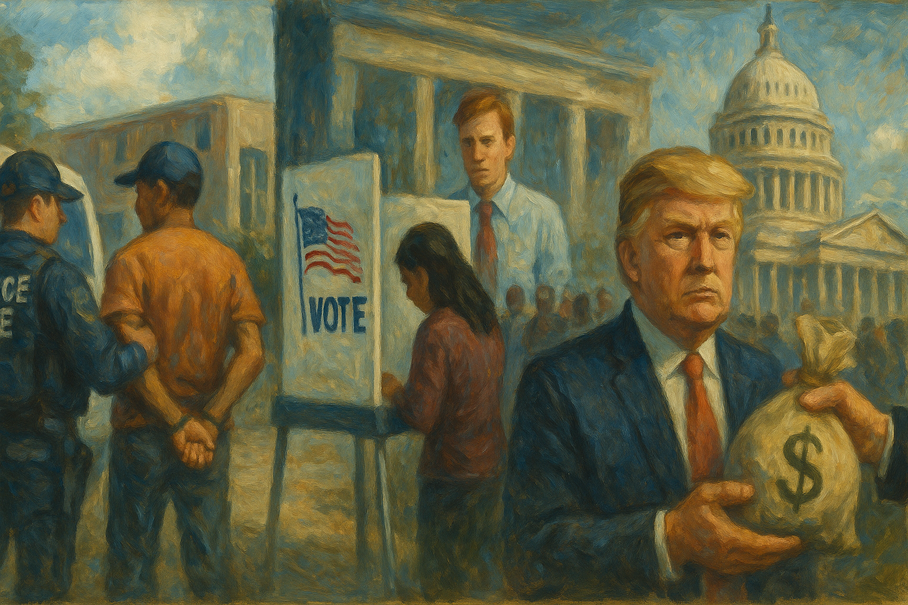

<!-- Generated by build_publish_week_v1 (appendix post) -->
<!-- Header image: image_wide_week55_appendix.png -->

# Week 55 Appendix: Security As Everyday Governance

*Immigration raids, election seizures, and curated history showed a state using law, force, and narrative to shape who belongs and who may watch.*

This was an exceptionally heavy week for structural democratic stress, centered on three converging fronts: immigration enforcement as a domestic security tool, federal encroachment on elections, and the fusion of public power with private enrichment. ICE and DHS operations in Minneapolis, Portland, schools, and detention centers—paired with lethal force, child detentions, secretive deportation flights, and aggressive tactics against protesters and journalists—pushed traits 9, 11, 22, 41, 42, and 50 sharply toward authoritarian policing. Simultaneously, the Trump administration’s multi-pronged effort to nationalize election control—DOJ lawsuits for voter rolls, FBI raids on Fulton County, proof-of-citizenship orders, SAVE Act pushes, and open talk of ICE at polling places—exerted major pressure on voter access and state control (traits 1, 4, 11, 45, 52). Executive moves to strip civil service protections, weaponize funding (Harvard, Gateway project, arts grants), and monetize foreign and crypto ties entrenched crony capitalism and unchecked executive power (traits 1, 7, 16, 22, 24, 38). Countervailing forces—federal courts blocking TPS termination and ICE tear gas, state-level voting-rights bills, redistricting wins, and mass protests—registered as meaningful but outweighed defensive responses rather than structural repair.

Power and Authority

1. Chicago Mayor Brandon Johnson issued an executive order directing city police to investigate alleged illegal ICE activity (2026-01-31): The order empowered local police to document and pursue potential crimes by federal immigration agents, asserting municipal authority over federal operations and strengthening accountability for abuses of power in immigration enforcement.

2. President Donald Trump retreated from aides’ false description of Alex Pretti as a domestic terrorist after video evidence emerged (2026-01-31): The White House’s reversal under public and bipartisan pressure showed that independent evidence and scrutiny can still constrain executive narrative control over lethal law-enforcement incidents.

3. President Donald Trump announced the Freedom 250 Grand Prix in Washington, D.C., as part of the US semiquincentennial (2026-01-31): By centering a large state-backed spectacle around patriotic themes, the administration used symbolic events to shape national identity and divert attention from contentious governance issues.

4. President Donald Trump demoted the head of the Border Patrol amid backlash over immigration enforcement tactics (2026-02-03): Reassigning the Border Patrol chief signaled executive willingness to reshuffle security leadership in response to public outrage while retaining centralized control over aggressive immigration operations.

5. President Donald Trump signed an executive order requiring proof of citizenship for federal voter registration (2026-02-03): The order sought to federalize voter eligibility rules and risked disenfranchising millions lacking specific documents, shifting power over election access from states toward the executive branch.

6. President Donald Trump threatened Harvard University with a $1bn civil-rights damages claim and funding pressure (2026-02-03): Using federal civil-rights enforcement and research funding as leverage against a critical university blurred the line between legitimate oversight and coercive use of state power to shape academic governance.

7. President Donald Trump issued a rule to ease firing protections for tens of thousands of federal workers (2026-02-05): Reclassifying about 50,000 civil servants to make them easier to dismiss and weakening independent whistleblower channels concentrated personnel power in the presidency and undermined a neutral professional bureaucracy.

8. President Donald Trump publicly called for nationalizing control of elections in selected jurisdictions (2026-02-04): Trump’s repeated calls for federal takeover of state-run elections challenged constitutional allocations of authority and signaled an ambition to centralize control over voting infrastructure.

9. President Donald Trump used the National Prayer Breakfast to question the faith of Democrats and repeat false election claims (2026-02-06): Invoking religious identity at a bipartisan event to delegitimize political opponents and insist the 2020 election was rigged fused partisan loyalty with faith and eroded shared acceptance of electoral outcomes.

10. President Donald Trump issued an executive order establishing an America First Arms Transfer Strategy (2026-02-06): The order centralized decisions on arms exports around domestic industrial and geopolitical priorities, expanding executive discretion to use weapons sales as a tool of foreign influence and economic policy.

11. President Donald Trump issued an executive order imposing tariffs on countries trading with Iran (2026-02-06): By authorizing tariffs on third countries that trade with Iran, the administration broadened unilateral economic coercion powers, intertwining trade policy with security designations under executive control.

12. President Donald Trump issued an executive order eliminating additional duties on imports from India after policy concessions (2026-02-06): Lifting a 25% tariff on Indian imports in exchange for India’s agreement to stop buying Russian oil showed how the executive can trade tariff relief for foreign policy alignment without direct legislative input.

13. President Donald Trump issued an executive order expanding DHS access to criminal records for border and immigration enforcement (2026-02-06): The order deepened data-sharing between federal criminal databases and immigration systems, strengthening executive capacity to screen, exclude, or deport noncitizens based on broad security rationales.

Institutions and Governance

1. U.S. Senate advanced and approved government funding bills while debating ICE reforms (2026-01-31): Senators moved spending bills to avert a shutdown and passed a funding package with a DHS stopgap, using appropriations leverage to press for oversight and conduct rules on ICE operations.

2. U.S. Department of Justice released millions of pages of Epstein investigation files with major delays and redaction failures (2026-01-31): DOJ’s late, partially withheld, and error-ridden Epstein disclosures—exposing victims while shielding many powerful figures—undermined statutory transparency and trust in equal application of justice.

3. U.S. Congress allowed a partial government shutdown over DHS funding and then passed a $1.2tn appropriations bill (2026-02-03): Budget brinkmanship over immigration enforcement produced a short shutdown before Congress and Trump enacted a large appropriations law, illustrating how core services are used as leverage in policy disputes.

4. U.S. Senate narrowly rejected Bernie Sanders’s amendment to cut ICE funding and redirect it to Medicaid (2026-01-31): The failed 49–51 vote showed growing but insufficient congressional support for shifting resources from immigration enforcement toward health care, clarifying institutional priorities in federal spending.

5. U.S. District Judge Fred Biery ordered the release of asylum seeker Adrian Conejo Arias and his five-year-old son from detention (2026-01-31): By freeing a detained family and criticizing officials for ignoring constitutional principles, the court asserted judicial checks on immigration enforcement and protected due process for vulnerable migrants.

6. U.S. District Judge Kate Menendez denied Minnesota’s request to halt Operation Metro Surge immigration raids (2026-01-31): The ruling upheld a large federal enforcement surge over state and city objections, reinforcing federal primacy in immigration operations despite local concerns about deaths and community harm.

7. Federal appellate chief judge Jeffrey Sutton dismissed a DOJ-filed judicial misconduct complaint against Judge James Boasberg (2026-02-01): Rejecting DOJ officials’ complaint over deportation litigation signaled internal judicial resistance to political pressure on judges handling contentious immigration cases.

8. Federal courts in Washington, D.C. temporarily blocked the Trump administration from terminating Temporary Protected Status for Haitians (2026-02-03): Judges halted DHS plans to strip TPS from hundreds of thousands of Haitians, emphasizing likely legal violations and ideological bias, and preserving lawful status while litigation proceeds.

9. U.S. Department of Justice pursued error-filled lawsuits against states and D.C. to obtain complete voter rolls (2026-02-03): DOJ’s suits demanding sensitive voter data, despite weak statutory basis and drafting errors, used federal litigation to pressure states toward a national voter roll, straining election federalism.

10. U.S. Department of Justice appealed a ruling blocking cancellation of $2.2bn in Harvard research grants (2026-02-03): Challenging a court decision that protected university research funding extended the administration’s effort to use federal grants as leverage in a broader conflict over campus governance and speech.

11. U.S. Department of Justice faced judicial criticism over noncompliance with court orders in immigration cases (2026-02-02): A DOJ attorney’s request to be held in contempt and remarks about a broken system highlighted internal strain and raised questions about the department’s ability or willingness to obey court mandates.

12. National Archives and Records Administration invited public comment on proposed federal records disposition schedules (2026-02-02): By seeking input on how agencies may destroy or retain records, NARA maintained a participatory process that helps safeguard archival transparency and historical accountability.

13. House Oversight Committee leadership secured Bill and Hillary Clinton’s agreement to testify in its Epstein investigation (2026-02-02): The Clintons’ decision to comply with subpoenas under threat of contempt underscored Congress’s formal oversight powers while also reflecting the partisan framing of high-profile inquiries.

14. North Carolina General Assembly leadership failed to pass a 2026 state budget amid political calculations, causing service gaps (2026-02-02): The budget stalemate, driven partly by electoral strategy, left teachers without raises and threatened health and welfare programs, showing how legislative inaction can erode basic governance.

15. Georgia state and local officials moved to challenge the FBI’s seizure of 2020 election documents from Fulton County (2026-02-02): By contesting a federal raid that took original ballots and records beyond prior court limits, county officials sought to defend state control over election materials and the integrity of evidence.

16. Georgia prosecutors appealed dismissal of RICO charges against Cop City protesters (2026-02-02): The appeal aimed to revive expansive racketeering charges against activists, testing how far state authorities can stretch criminal law to deter organized protest movements.

17. Coalition of immigration advocates and U.S. citizens sued Secretary of State Marco Rubio and the State Department over a broad visa ban (2026-02-02): The lawsuit challenged a suspension of immigrant visas for citizens of 75 countries as discriminatory and unlawful, using the courts to contest sweeping executive control over migration.

18. U.S. District Judge Michael Simon considered and then granted temporary limits on federal agents’ use of force at Portland protests (2026-02-04): By weighing and issuing a restraining order on ICE’s use of teargas and projectiles, the court intervened to protect protest rights and set boundaries on federal crowd-control tactics.

19. Whistleblower against DNI Tulsi Gabbard filed a classified complaint that has been withheld from Congress amid privilege claims (2026-02-01): The unresolved, highly classified complaint and alleged stonewalling by Gabbard’s office highlighted tensions between intelligence oversight and executive secrecy in potential misconduct cases.

20. Oregon Supreme Court ordered dismissal of over 1,400 criminal cases due to lack of public defenders (2026-02-05): The mass dismissal for failure to provide timely counsel underscored a constitutional crisis in indigent defense and forced the state to confront systemic underfunding of the right to representation.

21. U.S. Supreme Court allowed California to use a new voter-approved congressional map despite GOP challenge (2026-02-04): By letting California’s map stand, the Court enabled potential Democratic gains and signaled some judicial tolerance for state-level counterweights to partisan gerrymanders elsewhere.

22. Oregon and Louisiana lawmakers and courts expanded legal avenues for survivors of clergy and child sexual abuse to seek justice (2026-02-06): Louisiana’s removal of filing deadlines and Oregon’s enforcement actions against abusers and institutions strengthened accountability mechanisms for long-suppressed abuse cases within powerful religious bodies.

23. Senate Democratic leaders Chuck Schumer and Hakeem Jeffries sent formal DHS funding demands tying money to civil-rights safeguards (2026-02-06): Their letter conditioned additional DHS appropriations on requirements like judicial warrants and bans on racial profiling, using budget authority to push institutional reforms in federal enforcement.

24. Senator Ron Wyden publicly flagged serious but classified concerns in a letter to the CIA director (2026-02-06): Wyden’s cryptic public letter signaled unresolved oversight issues with CIA activities while creating a record that the agency had been warned, reinforcing congressional scrutiny of secret programs.

25. U.S. District Judge Theodore Chuang allowed depositions of Elon Musk and former USAID officials in a suit over dismantling the agency (2026-02-06): By refusing to block high-level testimony, the court affirmed that powerful private and public actors can be compelled to explain alleged interference with a development agency’s mission.

Economic Structure

1. People’s Republic of China accelerated development of yuan-based payment systems and stockpiled gold while weakening its currency (2026-01-31): China’s moves to reduce reliance on the dollar system and build yuan-centered finance signaled a potential long-term shift in global monetary power that could dilute U.S. economic leverage.

2. U.S. and European governments imposed sweeping financial sanctions cutting Russian entities from global payment systems (2026-01-31): Using access to SWIFT and international finance as a sanction tool underscored how control over economic infrastructure functions as a key instrument of geopolitical power.

3. DraftKings and FanDuel dramatically increased federal political spending and lobbying around gambling regulation and prediction markets (2026-02-02): The gambling firms’ multimillion-dollar donations and opposition to advertising limits and addiction funding showed how concentrated corporate money seeks to shape federal rules governing emerging markets.

4. North Carolina General Assembly leadership pursued a proposal to reduce the state corporate tax rate to zero (2026-02-02): Eliminating corporate income tax amid budget shortfalls would shift the fiscal burden away from businesses, constraining resources for public services and deepening structural inequality.

5. United Arab Emirates and Trump-linked crypto firm completed a $500m investment coinciding with U.S. approval of advanced AI chip sales (2026-02-01): The large foreign investment in a Trump-associated company alongside strategic tech deals raised concerns that U.S. economic and security policy is being intertwined with the president’s private financial interests.

6. U.S. Department of Transportation and related agencies saw the Gateway rail project’s federal funding withheld pending symbolic concessions to Trump (2026-02-05): Conditioning critical infrastructure funding on renaming major transport hubs after the president politicized capital allocation and risked jobs and mobility for personal branding.

7. Treasury Secretary Scott Bessent acknowledged that Treasury could be ordered to pay Trump up to $10bn over leaked tax returns (2026-02-05): The potential for a massive taxpayer-funded payout to the sitting president over disclosures about his finances highlighted risks of using civil claims and public coffers for personal enrichment.

8. Treasury Secretary Scott Bessent gave misleading congressional testimony about his prior statements on tariffs and inflation (2026-02-04): Contradicting his own earlier letter on tariffs’ inflationary effects undermined confidence in official economic messaging and suggested political spin in place of candid analysis.

9. U.S. employers and labor market announced over 108,000 layoffs in January amid falling job openings and weak hiring (2026-02-05): The sharp rise in job cuts and stagnant hiring signaled mounting economic stress that can reshape political attitudes and strain support for incumbent policies.

10. Cryptocurrency markets and Trump family business experienced a $2tn market value collapse affecting Trump-linked holdings (2026-02-05): The steep crypto downturn, including losses for a Trump family venture, illustrated the volatility of speculative assets and the exposure of politically connected actors to market swings.

11. AI startup Anthropic PBC released a legal-review tool that contributed to a selloff in software stocks (2026-02-05): The tool’s impact on investor expectations highlighted how advances in AI can rapidly disrupt white-collar labor markets and business models, shifting economic power toward technology owners.

12. Trump administration canceled roughly 560 federal arts grants totaling over $27m (2026-02-05): Cutting support for cultural institutions and artists reduced public investment in independent expression and civic culture, weakening a sector that often scrutinizes those in power.

13. U.S. Drug Enforcement Administration and multiple pharmaceutical firms processed new registrations for importing and manufacturing controlled substances for research (2026-02-02): DEA’s approvals and solicitations for controlled-substance imports and production shaped the legal drug research market, balancing public health safeguards with industry and scientific interests.

14. U.S. Environmental Protection Agency advanced multiple regulatory actions on pesticides, fuels, air quality, and hazardous waste tracking (2026-02-02): EPA’s notices on pesticide registrations, gasoline volatility waivers, regional haze plans, and e-Manifest governance shaped environmental standards that affect public health and industrial costs.

15. U.S. Food and Drug Administration issued multiple rules and guidance on drugs, devices, color additives, and patent review periods (2026-02-06): FDA’s regulatory updates and patent-review determinations influenced market entry, exclusivity, and safety standards for medicines and devices, with implications for innovation and consumer protection.

16. Federal Communications Commission advanced information-collection rules related to national security and robocall mitigation (2026-02-03): FCC’s paperwork and database changes sought to strengthen oversight of telecom networks and robocall controls, affecting compliance burdens and consumer protections in communications markets.

17. U.S. Census Bureau sought OMB approval for major business and census-related surveys and tests (2026-02-06): By refining business and operational surveys, the Bureau aimed to improve data that underpins representation, resource allocation, and economic policymaking.

18. Occupational Safety and Health Administration expanded and updated recognition of several Nationally Recognized Testing Laboratories (2026-02-03): OSHA’s adjustments to NRTL scopes and standards affected which private labs can certify product safety, shaping the interface between regulation, industry, and workplace protections.

Civil Rights and Dissent

1. Federal immigration and border agents conducted aggressive enforcement operations in Minneapolis and near schools, resulting in killings and child detentions (2026-01-31): Operation Metro Surge and related actions—including lethal shootings, arrests of minors, and raids near schools—created a climate of fear for immigrant communities and raised serious civil-rights concerns.

2. Federal agents in Portland, Oregon used tear gas and projectiles against largely peaceful protesters outside an ICE facility (2026-02-01): Deploying chemical agents and munitions on demonstrators, including children, escalated protest policing and prompted litigation over excessive force and First Amendment violations.

3. U.S. Department of Justice and federal agents arrested journalists Don Lemon and Georgia Fort and charged them under the FACE Act for covering a church protest (2026-01-31): Charging reporters with civil-rights crimes for filming protests signaled a troubling use of federal law to intimidate independent journalism and chill coverage of immigration enforcement.

4. Federal and local law enforcement in Minneapolis arrested four Black journalists and other observers while they covered anti-ICE protests (2026-01-31): Targeting Black journalists and observers at demonstrations compounded racial disparities in policing and undermined the press’s ability to document state use of force.

5. Nationwide protesters and organizers held coordinated anti-ICE demonstrations, strikes, and economic actions across U.S. cities (2026-01-31): Large, synchronized protests against immigration raids and killings showed robust civil mobilization but also drew heavy-handed responses, testing the resilience of assembly and protest rights.

6. Immigration advocates and local communities secured court-ordered releases of detained children and families from ICE custody (2026-02-04): Successful legal challenges that freed detained minors and their parents highlighted both the severity of family detention practices and the capacity of organized advocacy to protect basic rights.

7. North Carolina House Speaker Destin Hall publicly endorsed ICE operations and invited the agency back to the state (2026-02-02): State leadership’s embrace of aggressive federal immigration enforcement signaled political support for policies that many residents view as threatening immigrant communities’ safety and rights.

8. Mississippi legislators Zakiya Summers and Johnny DuPree introduced a state-level Voting Rights Act to protect minority voters (2026-02-02): Creating a Mississippi voting-rights commission with preclearance requirements sought to restore protections weakened at the federal level and guard against local voter suppression.

9. Texas lawmakers and litigants used a new Texas law to sue a California doctor for mailing abortion pills into the state (2026-02-04): The cross-state civil suit under Texas’s abortion statute tested the reach of restrictive laws beyond state borders and threatened access to reproductive care via private enforcement.

10. Federal immigration authorities and private jet owner Gil Dezer used a privately owned aircraft to deport Palestinians from the U.S. to the West Bank (2026-02-05): Secretive deportation flights on a Trump associate’s jet, with shackled passengers and family separations, illustrated opaque, outsourced enforcement practices affecting a politically vulnerable group.

11. ICE and DHS leadership reduced the number of federal immigration officers in Minnesota while deepening jail cooperation (2026-02-05): Cutting 700 agents but expanding coordination with local jails shifted enforcement from street raids to custodial transfers, altering but not necessarily reducing the system’s reach into immigrant lives.

12. U.S. Department of Justice civil-rights unit for law-enforcement prosecutions lost two-thirds of its prosecutors and was ordered to scale back excessive-force investigations (2026-02-05): The sharp reduction in staff and mandate weakened federal capacity to hold police and agents accountable for abuses, eroding a key safeguard against rights violations.

13. Federal and local law enforcement clashed violently with protesters in Minneapolis parks and streets despite de-escalation rhetoric (2026-02-05): Videos of agents tackling, pointing guns at, and gassing unarmed protesters contradicted official claims of restraint and highlighted ongoing risks to the right to protest.

14. Steve Bannon and allied figures advocated deploying ICE around polling places during the midterms (2026-02-05): Calls to surround polls with immigration agents framed as anti-fraud measures threatened to intimidate voters, especially immigrants and minorities, and blur lines between policing and electoral participation.

15. Republican lawmakers introduced a new SAVE Act imposing strict citizenship ID requirements for voting (2026-02-05): Requiring passports or enhanced licenses that many eligible voters lack risked disenfranchising citizens under the banner of election integrity, particularly in marginalized communities.

16. Texas ICE detention center officials faced calls from Congressman Joaquin Castro to shut down a family facility amid a measles outbreak (2026-02-05): The outbreak in a crowded family detention center underscored how immigration custody conditions can endanger detainees’ health and surrounding communities, prompting demands for closure.

17. Former January 6 participant Jake Lang was arrested for vandalizing an anti-ICE sculpture and destroying an anti-ICE sign (2026-02-05): Lang’s attacks on protest art at the Minnesota capitol reflected ongoing confrontations over immigration policy and the continued activism of individuals previously involved in anti-democratic violence.

18. President Donald Trump used the National Prayer Breakfast to question whether people of faith could support Democrats (2026-02-05): Politicizing a bipartisan religious event to cast one party as incompatible with faith deepened cultural polarization and framed political dissent as moral deviance.

19. Christopher Moynihan, a pardoned January 6 rioter pleaded guilty to harassing and threatening to kill House Minority Leader Hakeem Jeffries (2026-02-06): The case showed how threats against elected officials continue in the wake of January 6, and that state courts are still willing to prosecute such intimidation as criminal conduct.

20. Mississippi Haitian community and federal courts secured a ruling halting TPS termination that would have rendered many Haitians undocumented (2026-02-03): The injunction preserved lawful status for hundreds of thousands of Haitians, mitigating immediate deportation threats and affirming judicial willingness to scrutinize discriminatory immigration decisions.

Information, Memory and Manipulation

1. U.S. Department of Justice and FBI released and then partially withdrew Epstein files, exposing victims while obscuring elite networks (2026-02-02): The chaotic handling of millions of Epstein documents—delays, unredacted victim names, and withheld records—distorted public understanding of elite misconduct and damaged trust in official transparency.

2. U.S. Department of Homeland Security and ICE issued a press release mischaracterizing California’s cooperation on transferring convicted noncitizens (2026-02-06): DHS’s claim that California planned to release 33,000 convicted immigrants, disputed by state officials, illustrated how federal messaging can frame states as soft on crime to justify enforcement agendas.

3. Director of National Intelligence Tulsi Gabbard and FBI leadership conducted and publicly framed a separate 2020 election inquiry alongside a high-profile raid in Georgia (2026-02-03): Gabbard’s unusual presence at the Fulton County raid and her parallel review of voting machines blurred intelligence and law-enforcement roles, feeding narratives of politicized election investigations.

4. U.S. Department of Justice sued multiple states to obtain full, unredacted voter rolls including sensitive identifiers (2026-02-04): The lawsuits sought to compel disclosure of detailed voter data under a contested reading of federal law, raising fears that centralized lists could be used for partisan purges or intimidation.

5. President Donald Trump and allies promoted false narratives of widespread voter fraud and called for nationalizing elections (2026-02-05): Persistent claims that the 2020 election was stolen and that undocumented people vote in large numbers undermined confidence in electoral outcomes and justified intrusive federal control proposals.

6. Steve Bannon and right-wing media ecosystem advocated ICE presence at polling places while amplifying fraud narratives (2026-02-05): Bannon’s calls to deploy immigration agents to polls, framed as anti-fraud, weaponized fear of enforcement to shape turnout and public perception of election legitimacy.

7. Stephen Miller, White House deputy chief of staff publicly rejected Haitians’ belonging in Ohio communities despite their legal status (2026-02-01): Miller’s rhetoric portrayed Haitian residents as a labor class without political rights, reinforcing exclusionary narratives that justify restrictive policies and social stratification.

8. President Donald Trump threatened to sue Grammy host Trevor Noah over comments about Epstein Island (2026-02-01): Threatening litigation against a comedian for critical remarks signaled a willingness to use defamation claims to chill commentary about the president’s associations.

9. National Park Service under Trump administration removed an exhibit on enslaved people at Independence National Historical Park (2026-02-02): Eliminating the display about enslaved individuals at the President’s House recast a key historic site to emphasize triumph over injustice, narrowing public memory of slavery’s role in the founding.

10. Florida Republican legislators advanced a bill to ban the term “West Bank” in schools and state agencies in favor of “Judea and Samaria” (2026-02-04): Mandating specific geopolitical terminology in curricula and official communications sought to align state language with a particular foreign policy narrative and constrain how history is taught.

11. Washington Post ownership and management announced plans to cut about one-third of newsroom staff (2026-02-04): Major layoffs at a leading national paper reduced investigative capacity and weakened an important check on government and corporate power.

12. Former President Donald Trump posted and then removed a racist video depicting the Obamas as apes (2026-02-05): Sharing dehumanizing imagery of Black leaders from a presidential platform inflamed racial tensions and normalized bigoted content in mainstream political discourse.

13. French law enforcement and regulators raided Elon Musk’s X offices over alleged algorithm abuse and harmful content distribution (2026-02-02): Investigating X for fraudulent data extraction and deepfake-related offenses highlighted growing concern that opaque algorithms can facilitate rights violations and information manipulation.

14. Centers for Disease Control and Prevention’s ACIP and Florida legislature reconsidered vaccine recommendations and advanced broader exemptions for schoolchildren (2026-02-01): Federal and state moves questioning routine vaccination and expanding opt-outs risked undermining science-based public-health norms and increasing susceptibility to preventable disease outbreaks.

15. President Donald Trump and Ken Griffin were implicated in public claims that administration policies enriched Trump’s family businesses (2026-02-04): Griffin’s criticism that decisions favored Trump family crypto ventures and foreign investors spotlighted how economic policy and messaging may be shaped to benefit insiders rather than the public.

16. President Donald Trump claimed to have secured a ceasefire with Vladimir Putin that was immediately contradicted by new Russian attacks (2026-02-02): The gap between Trump’s ceasefire announcement and subsequent strikes on Kyiv raised doubts about the accuracy and reliability of presidential statements on critical foreign-policy matters.

17. U.S. Election Assistance Commission scheduled a public Sunshine Act meeting on election audit standards (2026-02-02): By openly discussing audit principles and inviting public comment, the EAC sought to bolster transparency and technical confidence in post-election verification processes.

18. Democracy Docket and allied organizations maintained live trackers and analysis of redistricting and election-related litigation (2026-02-05): Centralized tracking of voting and mapping cases provided the public with accessible information about legal changes that shape representation and ballot access.

19. Hillary Clinton called for public, transparent hearings on the Epstein investigation and pledged to testify under oath (2026-02-05): Her demand for open proceedings pushed back against closed-door, partisan handling of the case and emphasized the value of public fact-finding in high-profile scandals.

20. National Institute for Occupational Safety and Health and EPA solicited public input on firefighter safety and hazardous waste e-Manifest topics (2026-02-02): Requests for comment on research priorities and hazardous waste tracking topics opened technical policy discussions to broader stakeholder input, supporting more informed governance.

