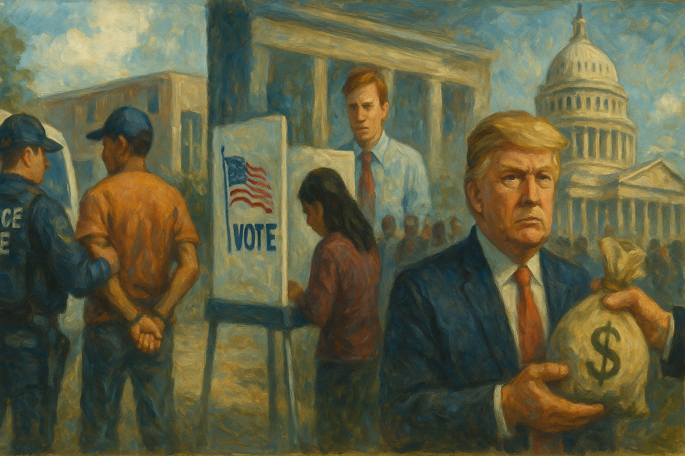

<!-- Generated by build_publish_week_v1 (appendix post) -->
<!-- Header image: image_wide_week55_appendix.png -->

# Week 55 Appendix: Stillness That Masks Real Motion

*A week of federal enforcement, judicial resistance, and equal pressure on both sides leaves the Democracy Clock exactly where it stood.*

This was a high-pressure week defined by the fusion of immigration enforcement, election administration, and executive retaliation into a broader pattern of democratic hardening. The most consequential developments were not isolated abuses but linked moves: aggressive federal operations in Minnesota and Portland, arrests and searches targeting journalists, federal raids and lawsuits aimed at state election machinery, and a major OPM rule designed to strip protections from tens of thousands of civil servants while weakening whistleblower channels. At the same time, the administration and its allies continued to normalize federal control over elections through voter-roll demands, nationalization rhetoric, and suggestions of ICE presence at polling places. Several courts provided meaningful resistance—blocking Haitian TPS termination, restricting force against protesters, protecting congressional oversight visits, and ordering releases from detention—but these were largely defensive interventions against executive overreach rather than affirmative institutional repair. The week also showed a parallel memory-and-culture front: historical exhibits were removed, universities were threatened, and public resources were bent toward vanity, patronage, and narrative control.

Power and Authority

1. Chicago Mayor Brandon Johnson ordered city police to investigate and document alleged illegal actions by ICE agents in Chicago (2026-01-31) *[single source]*: The order asserted local oversight over federal immigration enforcement and tested the balance between municipal accountability and federal coercive power.

2. President Trump announced the Freedom 250 Grand Prix in Washington, D.C. (2026-01-31) *[single source]*: The announcement showed the White House using presidential attention and symbolic state power for a celebratory project rather than a governance action.

3. The Trump administration distanced itself from the claim that Alex Pretti was a domestic terrorist after video contradicted it (2026-01-31): The retreat showed that official narratives around a federal killing were politically managed and vulnerable to outside pressure rather than fixed by transparent fact-finding.

4. The Advisory Committee on Immunization Practices reconsidered all federal vaccine recommendations (2026-02-01) *[single source]*: The review signaled a major executive-branch shift in public health policy with broad effects on state mandates, public trust, and evidence-based governance.

5. Trump administration officials removed a slavery exhibit from Independence National Historical Park (2026-02-02): The removal used executive control over public institutions to reshape national memory and limit how the state presents the country’s past.

6. President Trump sought $1 billion in damages from Harvard University (2026-02-03): The demand used executive leverage against a university and raised concerns about coercing academic institutions through federal power and funding threats.

7. President Trump demoted the head of Border Patrol after backlash over the Minnesota operation (2026-02-03): The personnel move showed the White House adjusting a high-profile enforcement campaign through direct command rather than independent review.

8. The Trump administration moved to ease the firing of about 50,000 federal workers through an OPM rule (2026-02-05) *[single source]*: The rule expanded presidential control over the civil service and weakened independent protections that help keep federal administration nonpartisan.

9. The Department of Homeland Security issued a press release pressing California to honor ICE detainers for 33,000 prisoners (2026-02-06) *[single source]*: The statement used federal messaging to pressure a state on immigration enforcement and sharpened conflict over state autonomy and federal claims.

10. President Trump issued an executive order establishing an America First arms transfer strategy (2026-02-06): The order concentrated foreign-policy and industrial priorities in the executive branch by tying arms sales more directly to presidential strategy.

11. President Trump issued an executive order imposing tariffs on countries that traded with Iran (2026-02-06): The order used unilateral economic power to pressure foreign states, showing how trade tools can be deployed as executive coercion.

12. President Trump issued an executive order ending the extra 25% duty on Indian imports (2026-02-06): The order showed the executive branch using tariff authority to reward foreign policy alignment without legislative action.

13. President Trump issued an executive order expanding criminal-history information sharing for border and visa screening (2026-02-06): The order broadened executive control over security data flows in immigration policy, increasing state surveillance capacity at the border.

Institutions and Governance

1. Representatives Ro Khanna and Thomas Massie demanded unredacted Epstein files from the Justice Department (2026-01-31): The request asserted Congress’s oversight role over a politically sensitive Justice Department disclosure process.

2. Senate Democrats advanced government spending bills while pressing for ICE reforms in DHS funding (2026-01-31): The move used appropriations procedure to seek policy limits on federal enforcement agencies and avoid a broader shutdown.

3. Congress allowed a partial government shutdown to begin during the DHS funding standoff (2026-01-31): The shutdown showed how legislative deadlock over immigration enforcement disrupted routine governance and federal operations.

4. The Senate approved a government funding package with temporary DHS funding (2026-01-31): The vote kept most government functions moving while leaving immigration enforcement policy unresolved in later negotiations.

5. The Senate rejected Bernie Sanders’s amendment to cut $75 billion in ICE funding (2026-01-31) *[single source]*: The failed amendment showed that congressional scrutiny of ICE had grown but had not yet changed the chamber’s funding choices.

6. Florida Republicans advanced a bill to broaden vaccine exemptions for schoolchildren (2026-02-01) *[single source]*: The committee vote showed state lawmakers using legislative power to weaken a public-health rule that shapes access to schools and collective safety.

7. Representative Anna Paulina Luna threatened to block a funding bill unless it included the SAVE Act (2026-02-01): The threat used shutdown leverage to attach election-policy demands to must-pass spending legislation.

8. President Trump urged lawmakers to pass the Senate funding bill without changes (2026-02-01) *[single source]*: The intervention showed a president trying to steer congressional procedure during a shutdown fight.

9. Mississippi lawmakers introduced a state-level Voting Rights Act bill (2026-02-02) *[single source]*: The proposal sought to rebuild voting protections at the state level through institutional rules after federal safeguards weakened.

10. Bill and Hillary Clinton agreed to testify in the House Epstein investigation (2026-02-02): The agreement reinforced Congress’s subpoena and oversight power in a politically charged investigation.

11. The North Carolina General Assembly failed to pass a 2026 budget (2026-02-02) *[single source]*: The stalemate weakened routine governance by delaying pay, school funding, and other public services tied to legislative budgeting.

12. The House of Representatives passed a funding bill that ended the partial shutdown and extended DHS funding briefly (2026-02-03): The vote restored normal operations while preserving Congress’s leverage over future DHS policy conditions.

13. The Democratic National Committee launched the Local Listeners voter outreach initiative (2026-02-04): The program aimed to strengthen electoral participation through party organizing rather than state action, affecting representation through turnout.

14. Democratic lawmakers held a congressional hearing on violent encounters with federal agents (2026-02-04) *[single source]*: The hearing used legislative oversight to document alleged abuses by federal officers and press for accountability.

15. The Florida House State Affairs Committee advanced a bill to ban the term West Bank in schools and state agencies (2026-02-04) *[single source]*: The bill showed lawmakers using state institutions to direct official language and shape public education and records.

16. Representative Nancy Mace asked the House Oversight Committee to subpoena Bill Gates (2026-02-04): The request sought to extend congressional investigative power to another prominent figure tied to the Epstein inquiry.

17. Treasury Secretary Scott Bessent faced congressional questioning over possible market manipulation tied to Trump’s social media activity (2026-02-04) *[single source]*: The hearing tested Congress’s ability to oversee executive-branch ethics and financial conduct affecting public markets.

18. Treasury Secretary Scott Bessent gave testimony that conflicted with his earlier written statements on tariffs (2026-02-04) *[single source]*: Conflicting testimony raised accountability concerns about truthfulness to Congress in economic oversight proceedings.

19. Representative Joaquin Castro called for the Dilley family detention center to shut down after measles cases were confirmed (2026-02-05): The demand used congressional voice to challenge detention conditions that affected both public health and detainee welfare.

20. Congressional Democratic leaders issued ten demands for ICE and DHS reforms in funding talks (2026-02-05): The demands used appropriations leverage to seek procedural limits, oversight, and accountability for federal immigration enforcement.

21. Louisiana lawmakers eliminated filing deadlines for childhood sexual abuse lawsuits (2026-02-06) *[single source]*: The change expanded access to courts for survivors and altered how institutions can be held accountable for past abuse.

22. Senator Ron Wyden sent a public letter to the CIA director raising concerns about agency conduct (2026-02-06): The letter signaled legislative oversight of intelligence activity and created a public record of concern about executive secrecy.

Economic Structure

1. The Trump family sold a 49% stake in its cryptocurrency venture to an Abu Dhabi-backed buyer (2026-01-31) *[single source]*: The deal blurred the line between private family business and public power by inviting foreign money into a politically connected enterprise.

2. The Trump administration proposed large Washington vanity projects including a Grand Prix course and monument plans (2026-01-31) *[single source]*: The proposals suggested public attention and possible resources could be steered toward symbolic projects instead of ordinary public needs.

3. China increased its gold reserves amid financial uncertainty (2026-01-31) *[single source]*: The move reflected weakening confidence in the dollar-centered order and highlighted how U.S. instability can shift global economic power.

4. Global central banks and investors bought more gold in response to Trump administration financial policies (2026-01-31) *[single source]*: The shift signaled that erratic U.S. policy could erode trust in American economic stewardship and weaken the country’s structural influence.

5. President Trump nominated Kevin Warsh to lead the Federal Reserve (2026-01-31): The nomination mattered because control of the central bank shapes monetary independence and the balance between politics and economic governance.

6. The Environmental Protection Agency opened comment on applications for new pesticide active ingredients (2026-02-02): The notice showed routine regulatory gatekeeping over products that affect public health, agriculture, and environmental risk.

7. The Environmental Protection Agency opened comment on applications for new pesticide uses (2026-02-02): The action reflected how federal regulators shape market access and safety standards through administrative review.

8. Medi-Physics Inc. applied to import cocaine derivatives for diagnostic manufacturing (2026-02-02): The application showed federal licensing power over controlled-substance supply chains used in medical production.

9. Mylan Inc. applied to import controlled substances for testing and clinical trials (2026-02-02): The filing highlighted how federal approvals govern pharmaceutical research inputs and market development.

10. NIOSH requested public input on firefighter safety and health priorities (2026-02-02): The request showed a federal agency using consultation to shape workplace safety research for a critical public workforce.

11. Promega Corporation applied to manufacture psilocybin and psilocyn in bulk (2026-02-02): The application illustrated how federal drug controls structure emerging pharmaceutical markets and research capacity.

12. Sharp Clinical Services applied to import Schedule I substances for distribution and trials (2026-02-02): The filing showed federal control over research supply chains for tightly regulated substances.

13. North Carolina lawmakers planned to reduce the corporate tax rate to zero (2026-02-02) *[single source]*: The proposal would shift state fiscal priorities toward business tax relief while public services faced funding strain.

14. DraftKings and FanDuel expanded into prediction markets and increased federal lobbying and political spending (2026-02-02) *[single source]*: The moves showed regulated firms using money and market expansion to shape federal rules in a growing sector tied to politics and information.

15. President Trump announced lower tariffs on Indian exports after India agreed to stop buying Russian oil (2026-02-02): The tariff change showed trade policy being used as a bargaining tool that linked economic access to foreign-policy compliance.

16. The Centers for Disease Control and Prevention submitted an information collection request to assess CDC fellowship programs (2026-02-03): The request affected how the federal government evaluates and allocates resources for public-health workforce development.

17. OSHA advanced or approved several expansions of Nationally Recognized Testing Laboratory authority (2026-02-03): The actions adjusted which private labs can certify products, shaping market access and the delegated structure of safety regulation.

18. The Federal Communications Commission submitted an information collection request for OMB review (2026-02-03): The filing reflected routine federal control over compliance burdens that affect regulated firms, especially smaller businesses.

19. Commentators and policymakers proposed stricter enforcement against employers who hired undocumented workers (2026-02-03) *[single source]*: The proposal framed labor-market regulation as a tool for immigration control, linking workplace enforcement to broader state power.

20. The Environmental Protection Agency reinstated Ohio’s gasoline volatility waiver for E10 fuel (2026-02-04): The decision changed fuel-market rules in one state and showed how federal regulators can alter regional economic conditions.

21. S and B Pharma LLC and Sterling Pharma USA LLC applied to manufacture controlled substances in bulk (2026-02-04): The applications showed federal licensing power over sensitive drug manufacturing and research markets.

22. The Drug Enforcement Administration finalized a rule creating a registration system for EMS agencies handling controlled substances (2026-02-05): The rule changed how emergency medical providers can store and use controlled drugs, affecting public-service capacity and oversight.

23. The Federal Communications Commission set the effective date for robocall mitigation database amendments (2026-02-05): The rule tightened compliance duties for telecom providers and used regulation to protect consumers from abusive communications markets.

24. The Trump administration canceled about 560 arts grants (2026-02-05) *[single source]*: The cuts withdrew federal support from cultural institutions and shifted public funding away from independent artistic activity.

25. The cryptocurrency market lost more than $2 trillion in value as Trump-linked firms also sold at a loss (2026-02-05) *[single source]*: The collapse showed the instability of a politically entangled financial sector and its wider effects on investors and confidence.

26. U.S. employers announced more than 108,000 layoffs in January while hiring weakened (2026-02-05): The labor data pointed to economic strain that can shape political power by increasing insecurity and dependence.

27. Treasury Secretary Scott Bessent acknowledged that the government could be ordered to pay Trump $10 billion over his tax-return claim (2026-02-05) *[single source]*: The possibility raised concerns that public funds could be redirected to a president’s personal legal dispute.

28. The Trump administration withheld Gateway project funds while demanding Trump-related renamings (2026-02-05) *[single source]*: The move used infrastructure money as political leverage, tying public investment to personal branding demands.

29. Anthropic released an AI legal-work tool that unsettled software markets (2026-02-05) *[single source]*: The launch highlighted how new technology can shift economic power and labor demand in knowledge industries.

30. The Census Bureau submitted the Annual Business Survey for OMB review (2026-02-06): The survey supports federal economic measurement that informs policy, representation of business conditions, and public decision-making.

31. The Environmental Protection Agency published environmental impact statement notices for major projects (2026-02-06): The notice preserved public review in federal project approval processes that shape land use, infrastructure, and environmental accountability.

32. The Environmental Protection Agency approved parts of Nevada’s regional haze plan (2026-02-06): The approval showed federal oversight of state environmental compliance under national clean-air rules.

33. The Environmental Protection Agency sought nominations and public input for the e-Manifest advisory process (2026-02-06): The actions used participatory rulemaking to shape hazardous-waste tracking and administrative modernization.

34. The Food and Drug Administration amended animal drug and food color additive regulations (2026-02-06): The rule changes showed routine federal control over product standards that affect food safety and pharmaceutical markets.

35. The Food and Drug Administration set regulatory review periods for several medical products for patent extension purposes (2026-02-06): The determinations affected how long firms may keep exclusive rights, shaping competition and access in health markets.

36. The Food and Drug Administration opened comment on patient preference studies, Class II device exemptions, and expedited approval information collection (2026-02-06): The notices showed regulators adjusting how quickly products can reach market and how much oversight firms must meet.

Civil Rights and Dissent

1. Judge Fred Biery ordered the release of Liam Conejo Ramos and his father from ICE detention (2026-01-31): The ruling checked family detention practices and protected bodily liberty for a child and parent facing immigration custody.

2. Judge Kate Menendez refused to halt Operation Metro Surge in Minneapolis (2026-01-31): The ruling allowed a large federal immigration operation to continue despite claims of local harm, profiling, and state-rights violations.

3. Federal immigration agents intensified enforcement around Minneapolis schools and nearby communities (2026-01-31): The activity spread fear through schools and families, affecting attendance, safety, and the practical exercise of rights by immigrant communities.

4. Federal agents arrested Don Lemon, Georgia Fort, and other protest participants tied to a Minneapolis church protest (2026-01-31): The arrests raised First Amendment concerns by using criminal process against journalists and demonstrators covering or joining dissent.

5. Federal agents arrested minors, bystanders, and other residents during Minneapolis operations (2026-01-31): The arrests showed how broad enforcement tactics can sweep up vulnerable people and chill ordinary community life.

6. Protesters across the United States held nationwide anti-ICE demonstrations, strikes, and walkouts (2026-01-31): The coordinated actions showed large-scale public dissent against federal immigration enforcement and used protest to demand accountability.

7. A federal appellate chief judge dismissed a misconduct complaint against Judge James Boasberg (2026-02-01): The dismissal protected judicial independence against an executive-branch complaint tied to immigration litigation.

8. The Justice Department opened a civil rights investigation into the fatal shooting of Alex Pretti (2026-02-01): The investigation acknowledged possible abuse of force by federal agents and created a formal accountability channel after public protest.

9. Federal officers used tear gas and flashbangs against peaceful protesters in Portland (2026-02-01): The force raised direct concerns about the right to assemble and the state’s treatment of dissent.

10. Júnior Pena was arrested by ICE in New Jersey (2026-02-02) *[single source]*: The detention showed the reach of immigration enforcement into settled communities and the insecurity it creates for noncitizens.

11. Homeland Security Secretary Kristi Noem ordered federal agents in Minneapolis to begin wearing body cameras (2026-02-02): The order responded to public concern over federal force and aimed to improve accountability in immigration policing.

12. ICE detained Maher Tarabishi and denied him permission to attend his son’s funeral (2026-02-02): The detention showed how immigration custody decisions can sever family unity and impose severe human consequences without meaningful relief.

13. Protesters in Minneapolis demonstrated inside a Target store against cooperation with federal agents (2026-02-02): The action showed civil resistance aimed at private actors seen as enabling state enforcement against immigrants.

14. A coalition of immigration groups and affected individuals sued the State Department over the suspension of immigrant visa approvals for 75 countries (2026-02-02): The lawsuit challenged a sweeping visa freeze that affected family unity, equal treatment, and access to lawful immigration.

15. Judge Michael Simon considered and then temporarily restricted federal agents’ use of force against Portland protesters (2026-02-02) *[single source]*: The court intervention protected protest rights by limiting chemical and projectile force absent imminent physical threat.

16. Judge Ana Reyes temporarily blocked the termination of Temporary Protected Status for Haitians (2026-02-03): The ruling protected hundreds of thousands of Haitian residents from immediate loss of status, detention, and deportation.

17. The American Association of University Professors and visa applicants sued over the Gold Card visa program (2026-02-03): The case challenged an immigration system that allegedly favored wealth over statutory standards, raising equal-access concerns.

18. Federal officials and political allies called for nationalized elections, floated ICE presence at polling places, and pushed new citizenship-based voter ID rules (2026-02-03): The combined push threatened voter access by linking election administration to immigration enforcement and stricter proof-of-citizenship demands.

19. The Department of Justice sought state voter rolls and sued states that refused to provide them (2026-02-03) *[single source]*: The campaign risked chilling participation and centralizing sensitive voter data in ways that could support exclusionary election enforcement.

20. Attorney General Pam Bondi pressed Minnesota to cooperate with federal voter-roll demands after the Alex Pretti killing (2026-02-03) *[single source]*: The pressure linked a law-enforcement crisis to election administration demands, raising concerns about coercion of a state government.

21. Federal agents used aggressive tactics against activists, observers, and protesters in Minneapolis (2026-02-05) *[single source]*: The tactics showed federal force being used in ways that could deter protest, observation, and community self-defense around enforcement actions.

22. ICE and private flight contractors deported Palestinians from the United States to the West Bank on a private jet (2026-02-05) *[single source]*: The operation raised due-process and family-separation concerns while showing coercive deportation power carried out through private assets.

23. Tom Homan and the Trump administration reduced but continued the large federal immigration deployment in Minnesota (2026-02-05) *[single source]*: The partial drawdown left a heavy federal presence in place, sustaining pressure on immigrant communities and local autonomy.

24. Elizabeth Zuna Caisaguano was released from ICE custody after a month in detention (2026-02-04) *[single source]*: The release highlighted the rights stakes of detaining children and families with active asylum claims.

25. Florida required all driver’s license exams to be given only in English (2026-02-06) *[single source]*: The rule created a language barrier to a basic public service and disproportionately burdened immigrant and limited-English communities.

Information, Memory and Manipulation

1. The Justice Department released about 3 million Epstein files and then faced criticism over redaction failures and withheld material (2026-01-31): The release tested transparency and privacy at once by exposing sensitive records while failing to protect victims and leaving questions about selective disclosure.

2. The Department of Homeland Security encouraged the public to report undocumented immigrants through an ICE hotline message (2026-01-31): The message used official communications to mobilize public suspicion against a vulnerable group and shape the information environment around immigration.

3. The Trump administration promoted a misleading op-ed about the economy as if it were validation of its record (2026-01-31) *[single source]*: The promotion used state-aligned messaging to distort public understanding of economic conditions and policy effects.

4. Stephen Miller said Haitians living legally in Ohio should not be treated as part of the community or future citizenry (2026-02-01): The statement used exclusionary rhetoric to redefine belonging and normalize a hierarchy of political membership.

5. The Department of Justice released documents that included claims linking Steve Bannon to Clive Palmer’s 2019 Australian election strategy (2026-02-02) *[single source]*: The documents fed debate over elite influence, disinformation, and cross-border manipulation in democratic campaigns.

6. The FCC requested comments on a national-security information collection tied to communications networks (2026-02-03): The notice showed the state expanding information-gathering structures in the name of network security and foreign-risk management.

7. The Washington Post announced plans to cut about one-third of its staff (2026-02-04): The cuts weakened a major news institution’s reporting capacity and reduced independent scrutiny of powerful actors.

8. The Justice Department released more Epstein-related documents, including FBI material on David Copperfield and communications involving William Burns (2026-02-02): The disclosures expanded public access to elite networks but also showed how sensitive records can be released in ways that mix accountability with spectacle.

9. Donald Trump posted racist imagery of Barack and Michelle Obama and later removed it after backlash (2026-02-05): The post injected dehumanizing racial propaganda into national political discourse and showed how elite speech can poison the public sphere.

10. Donald Trump repeated false claims that the 2020 election was rigged at the National Prayer Breakfast (2026-02-06) *[single source]*: The remarks continued elite-driven election disinformation that undermines trust in voting and democratic legitimacy.

