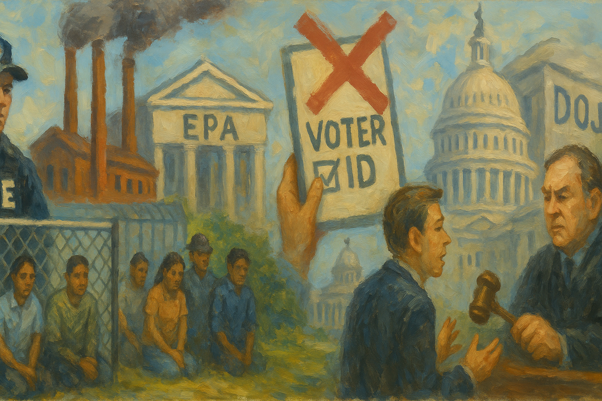

<!-- Generated by build_publish_week_v1 (appendix post) -->
<!-- Header image: image_wide_week56_appendix.png -->

# Week 56 Appendix: Detention Beds as Infrastructure

*A week of hardened structures, where mass detention, regulatory capture, and curated memory deepened existing grooves without yet moving the Democracy Clock.*

This was an exceptionally heavy week of structural pressure toward authoritarianism, centered on three domains: immigration enforcement, climate and regulatory rollback, and the weaponization of law and information. The administration moved aggressively to expand and entrench a vast detention infrastructure, with new warehouse camps, record ICE populations, mass-detention policies upheld by courts, and case-routing to hardline immigration judges. Simultaneously, the EPA and energy policy were reoriented to dismantle greenhouse-gas authority and prop up coal, while environmental enforcement collapsed—classic regulatory capture benefiting fossil and corporate interests. On elections, the House passage of the SAVE America Act, coupled with misidentifying citizenship tools and threats to federalize state elections, marked a serious escalation in voter suppression rationalized as “integrity.” The Department of Justice emerged as a central problem: dropping Bannon’s case, surveilling congressional oversight, mishandling Epstein files, and pursuing journalists and protesters while ICE officers lying under oath faced only belated correction. Countervailing forces—federal judges checking some abuses, congressional and grassroots pushback, and transparency wins on Epstein—were real but outweighed by the breadth and depth of authoritarian-leaning moves.

Power and Authority

1. Office of Personnel Management issued a rule stripping civil service protections from tens of thousands of federal employees (2026-02-07): OPM’s new employment category removed job protections and shifted whistleblower handling in-house for about 50,000 federal workers, making it easier to purge nonpartisan staff and weakening internal checks on executive power.

2. President Donald Trump withheld and appealed funding for the Gateway/Hudson rail tunnel while seeking personal naming concessions (2026-02-09): Trump’s freeze and appeal over $16 billion in tunnel funding, reportedly tied to renaming major transit hubs after him, used critical infrastructure money as leverage for personal glorification rather than neutral policy goals.

3. President Donald Trump expanded mass immigration detention through new facilities and policies (2026-02-08): The administration funded large new detention centers, raised the detained population above 70,000, and relied on private warehouse conversions, entrenching a vast coercive apparatus with limited external accountability.

4. President Donald Trump directed a major expansion of coal use through executive orders and defense framing (2026-02-11): Trump ordered the military to buy coal-fired power and framed coal plants as national defense assets while his EPA moved to revoke greenhouse-gas authority, tying core state power to fossil interests and sidelining climate protections.

5. President Donald Trump rescinded the EPA’s 2009 endangerment finding on greenhouse gases (2026-02-12): Revoking the scientific finding that greenhouse gases endanger health removed the legal basis for federal climate regulation, weakening environmental safeguards and signaling that economic and ideological goals override scientific risk assessments.

6. President Donald Trump pardoned January 6 participant Andrew Paul Johnson and other Capitol attackers (2026-02-11): Trump’s clemency for a Capitol rioter, part of a broader wave of pardons for January 6 defendants, undercut accountability for violence aimed at overturning an election and signaled tolerance for future anti-democratic force.

7. President Donald Trump threatened to block opening of the Gordie Howe International Bridge to pressure Canada (2026-02-10): By threatening to keep a key US–Canada bridge closed until the US is "fully compensated" and treated with "respect," Trump used border control powers as leverage in trade and political disputes with an ally.

8. President Donald Trump promoted Great Replacement rhetoric at the United Nations (2026-02-09): Trump’s UN speech warning of elites replacing white populations with nonwhite immigrants exported nativist conspiracy narratives into diplomacy, legitimizing exclusionary politics and hardline migration policies at home and abroad.

9. President Donald Trump captured Venezuela’s leader Nicolás Maduro (2026-02-13): The US capture of Venezuelan leader Nicolás Maduro represented an extraordinary use of force against a foreign head of state, raising questions about adherence to international law and precedent for regime-change operations.

10. President Donald Trump supported Israel’s military campaign in Gaza despite human rights concerns (2026-02-13): US backing for Israel’s war in Gaza, criticized as disregarding human rights and international law, aligned American power with a controversial campaign, affecting global perceptions of US commitment to democratic norms abroad.

11. President Donald Trump threatened to annex Greenland in foreign policy rhetoric (2026-02-13): Trump’s threats to annex Greenland, cited by critics at the Munich Security Conference, exemplified a willingness to challenge established borders and norms, unsettling allies and signaling a more unilateral approach to sovereignty.

12. President Donald Trump threatened to seize control of state-run elections via executive order (2026-02-12): Trump’s threat to federalize elections by executive order if Congress did not pass the SAVE Act challenged constitutional allocations of election authority and raised the prospect of centralized partisan control over voting.

13. President Donald Trump used emergency powers and tariffs against Canada in a disputed drug-trafficking rationale (2026-02-12): Trump’s national-emergency-based tariffs on Canada, later challenged by the House, showed how emergency authorities can be stretched to justify trade measures with limited oversight.

14. President Donald Trump pressured Republicans to kill bipartisan immigration reform for electoral advantage (2026-02-09): Trump’s successful push to block a bipartisan immigration bill with border funding and asylum reforms prioritized campaign messaging over negotiated policy, reinforcing personalized control over party strategy and legislative outcomes.

15. President Donald Trump pardoned or signaled potential clemency for allies linked to January 6 and Epstein (2026-02-09): Trump’s prior pardon of Steve Bannon and signals around possible clemency for Ghislaine Maxwell, combined with DOJ moves to dismiss Bannon’s case, blurred lines between justice and personal loyalty.

16. Department of Homeland Security leadership oversaw chaotic and politicized management of DHS under Secretary Kristi Noem (2026-02-13): Reports of intimidation, arbitrary personnel actions, and efforts to arm political appointees at DHS indicated growing politicization of internal security structures under Secretary Noem.

Institutions and Governance

1. US Congress cut $125 million from lead pipe replacement funding in a broader spending bill (2026-02-07): By reducing funds for replacing toxic lead pipes, Congress slowed remediation of dangerous infrastructure, with disproportionate effects on children and low-income communities reliant on federal investment decisions.

2. US House of Representatives passed the SAVE America Act imposing strict proof-of-citizenship and ID rules for voting (2026-02-12): The House-approved SAVE America Act would require documentary proof of citizenship and narrow acceptable IDs, risking disenfranchisement of millions of eligible voters, especially minorities, women, and Americans abroad.

3. North Carolina State Board of Elections proposed rules enabling individual challenges to voter citizenship status (2026-02-07): Newly proposed rules in North Carolina would allow citizens to challenge others’ citizenship, forcing targeted voters to prove eligibility and opening the door to organized suppression of minority and immigrant communities.

4. Federal Bureau of Investigation scheduled a national coordination call with election officials on midterm security (2026-02-09): The FBI’s planned briefing for election officials aimed to coordinate federal and state efforts to protect upcoming midterms from threats, reflecting institutional attention to election integrity amid politicized disputes.

5. US House of Representatives voted to rescind Trump’s emergency-based tariffs on Canada (2026-02-12): The House’s bipartisan resolution to terminate Trump’s Canada tariffs challenged his use of national emergency powers for trade, asserting legislative authority over economic measures framed as security actions.

6. Senate Democrats blocked Department of Homeland Security funding over ICE transparency demands (2026-02-12): Senate Democrats filibustered DHS funding to press for requirements like body cameras and visible identification for ICE agents, using budget leverage to seek more accountable enforcement practices.

7. US Congress failed to agree on DHS appropriations, triggering a looming shutdown (2026-02-12): A funding stalemate left DHS on the brink of shutdown, putting 260,000 employees in limbo and illustrating how partisan gridlock can disrupt core security and administrative functions.

8. House Judiciary Committee and Attorney General Pam Bondi clashed over DOJ’s handling and redaction of Epstein files (2026-02-11): Bondi’s combative testimony and refusal to explain why survivor names were exposed while alleged abusers were shielded deepened concerns that DOJ is obstructing mandated transparency in a major elite-abuse case.

9. Department of Justice released millions of pages of Epstein-related files under a transparency law (2026-02-10): DOJ’s release of 3 million Epstein files, including accounts of Trump’s knowledge and comments, partially fulfilled statutory transparency requirements while fueling debate over selective redactions and elite accountability.

10. Reps. Ro Khanna and Thomas Massie forced DOJ to unredact names of wealthy men in Epstein files (2026-02-10): Bipartisan pressure from Khanna and Massie compelled DOJ to reveal six previously hidden names likely implicated in Epstein’s crimes, demonstrating how legislative oversight can pierce protective redactions for powerful figures.

11. House Oversight and Judiciary Committees deposed Ghislaine Maxwell, who invoked the Fifth Amendment and sought clemency (2026-02-08): Maxwell’s refusal to answer questions about Epstein’s network unless granted clemency from Trump frustrated congressional efforts to uncover elite complicity and raised fears of political interference in accountability.

12. Attorney General Pam Bondi and US Attorney’s Office moved to dismiss Steve Bannon’s contempt of Congress case (2026-02-09): DOJ’s motion to dismiss Bannon’s conviction for defying the January 6 committee signaled a willingness to undo prior accountability for obstructing legislative investigations into an attack on the transfer of power.

13. Reps. Pramila Jayapal and Jamie Raskin demanded investigations into DOJ surveillance of congressional Epstein-file searches (2026-02-11): Jayapal’s planned letter and Raskin’s IG referral challenged DOJ’s logging of lawmakers’ document searches, framing it as executive surveillance of oversight that threatens separation of powers.

14. Senator Jacky Rosen announced a Senate resolution opposing clemency for Ghislaine Maxwell (2026-02-11): Rosen’s planned resolution to oppose any pardon for Maxwell sought to put the Senate on record against using presidential clemency to shield a convicted sex trafficker tied to powerful networks.

15. Senate Democrats introduced Virginia’s Law to eliminate civil statutes of limitations for sexual abuse (2026-02-11): Virginia’s Law would remove time limits on civil sexual abuse claims, expanding survivors’ access to courts and countering legal structures that have historically shielded abusers, including elites.

16. Senate Democrats introduced a bill to sharply curb LNG exports to address domestic energy costs (2026-02-10): The Lowering American Energy Costs Act sought to limit LNG exports linked to higher US electricity prices, asserting legislative control over energy trade policy shaped by executive export priorities.

17. Representative Ro Khanna sent an oversight letter ahead of Ghislaine Maxwell’s deposition (2026-02-07): Khanna’s letter flagged Maxwell’s plan to invoke the Fifth Amendment broadly and outlined questions on her prior statements, aiming to preserve a record and press for truthful testimony in a politically sensitive case.

18. Senate Appropriations Committee held hearings on Commerce Secretary Howard Lutnick’s Epstein ties (2026-02-10): Senators questioned Lutnick about previously undisclosed visits to Epstein’s island and business dealings, testing whether high-level appointees can retain office despite misleading statements about relationships with a convicted sex offender.

19. Department of Justice unredacted additional FBI files in the Epstein investigation (2026-02-09): DOJ’s decision to unredact more Epstein-related FBI documents, naming co-conspirators and powerful figures, modestly increased transparency after criticism that earlier releases protected elites more than victims.

20. Department of Justice filed a motion to dismiss charges against two men falsely accused of attacking an ICE officer (2026-02-12): After discovering ICE officers lied under oath, DOJ moved to drop charges against two wrongly accused men, acknowledging investigative misconduct but also exposing how easily law enforcement falsehoods can drive prosecutions.

21. National Governors Association canceled its annual bipartisan meeting with President Trump after he disinvited Democrats (2026-02-11): The governors’ group scrapped its White House meeting when Trump excluded two Democratic governors, underscoring how partisan gatekeeping by the executive can erode routine intergovernmental consultation.

22. US Congress enacted the Ending Improper Payments to Deceased People Act (2026-02-10): The new law tightened controls to prevent federal payments to deceased individuals, aiming to improve fiscal stewardship and public confidence in government benefit administration.

23. Senator Chris Murphy and Representative Jamie Raskin conducted surprise oversight visits to ICE detention facilities (2026-02-12): Murphy and Raskin’s unannounced inspections documented overcrowding and psychological harm to children, using congressional access to expose conditions and pressure DHS to align detention practices with constitutional standards.

24. Senator Rand Paul pressed DHS officials on use-of-force standards during Minnesota immigration operations (2026-02-12): Paul’s questioning elicited DHS admissions that yelling at officers and filming ICE or Border Patrol are not crimes, clarifying rights during federal operations and challenging expansive interpretations of assault.

25. Senate and House committees held hearings on DHS and ICE conduct in Minnesota and VA restructuring (2026-02-11): Testimony from Minnesota AG Keith Ellison and VA Secretary Doug Collins highlighted concerns about federal "occupation" tactics, misinformation about a killed VA nurse, and large-scale VA staff losses, raising alarms about politicized security and veteran care.

26. US Department of Veterans Affairs terminated its agreement to provide medical care for ICE detainees (2026-02-08): VA’s abrupt end to detainee medical support, driven by political pressure and misinformation, left many immigrants without needed medications or off-site care, showing how veterans’ policy debates can spill into immigration health access.

27. US Department of Justice withheld a Kushner-related whistleblower complaint from Congress (2026-02-12): DNI Tulsi Gabbard’s initial refusal to transmit a complaint about foreign discussions involving Jared Kushner to Congress raised concerns that politically sensitive intelligence was being kept from mandated oversight channels.

28. US Department of Justice monitored congressional searches of controlled Epstein records (2026-02-11): Evidence that DOJ tracked which Epstein documents lawmakers viewed in a secure system suggested executive monitoring of oversight behavior, blurring lines between necessary security logging and surveillance of a coequal branch.

29. US Department of Justice refused to fully comply with the Epstein Files Transparency Act (2026-02-12): DOJ’s failure to release all required Epstein materials, despite statutory mandates, showed how executive agencies can blunt transparency laws through delay and selective disclosure.

30. US Department of Justice Antitrust Division forced out its antitrust chief after conflicts over major mergers (2026-02-13): The ouster of antitrust head Gail/Abigail Slater following her opposition to a large tech merger signaled political interference in competition enforcement and a tilt toward corporate consolidation.

31. National Governors Association and Governor Kevin Stitt canceled a bipartisan governors’ trip to Washington after Trump excluded Democrats (2026-02-12): Stitt’s cancellation of a planned bipartisan visit in response to Trump’s refusal to recognize Democratic governors underscored how partisan gatekeeping by the White House can fracture cooperative federalism.

32. US Congress held hearings and took testimony on DHS funding stalemate and potential shutdown (2026-02-12): As DHS faced a shutdown, lawmakers debated whether to condition funding on changes to ICE practices, revealing deep divisions over how to balance security operations with civil-rights safeguards.

33. US Congress granted members controlled access to unredacted Epstein files at DOJ (2026-02-11): Allowing Judiciary members to review unredacted Epstein records in a secure DOJ facility partially addressed complaints about over-redaction, while the 24-hour notice requirement and logging raised new oversight concerns.

34. US Congress sent a bipartisan letter seeking information on immigration policy’s impact on childcare (2026-02-13): Forty-eight Democrats asked HHS how Trump’s immigration raids and TPS terminations are worsening childcare shortages, linking enforcement policy to labor supply and family economic stability.

35. US Congress held hearings on Pam Bondi’s conduct and potential perjury (2026-02-12): Members accused Bondi of lying under oath and using prepared insults at a Judiciary hearing, highlighting concerns that the attorney general is treating oversight as partisan combat rather than a constitutional obligation.

36. US Congress used historical examples of McCarthyism to frame current anti-communist rhetoric (2026-02-09): Historical accounts of Senator McCarthy’s baseless accusations and televised downfall were invoked to contextualize modern campaigns that weaponize fear and loyalty investigations against political opponents.

Economic Structure

1. Environmental Protection Agency under Administrator Lee Zeldin reduced enforcement of environmental laws and extended compliance deadlines for polluters (2026-02-13): EPA’s sharp drop in Clean Air, Clean Water, and Superfund enforcement, combined with extended coal-ash deadlines, weakened deterrence for major polluters and shifted environmental and health costs onto communities.

2. US Immigration and Customs Enforcement and private prison companies expanded use of for-profit and warehouse-style detention centers for immigrants (2026-02-13): ICE’s record detention population, heavy reliance on CoreCivic, and $38 billion plan to convert warehouses into camps deepened the privatization and monetization of deprivation of liberty.

3. Trump administration ended Temporary Protected Status for Somali nationals and reassigned their cases to a hardline judge (2026-02-09): Terminating TPS for Somalis and routing their asylum cases to a judge with a 95% denial rate increased deportation risk for 2,400 people, using procedural control to narrow humanitarian relief.

4. Texas Governor Greg Abbott barred public institutions from hiring H-1B workers (2026-02-07): Abbott’s halt on H-1B hiring by state agencies and universities restricted access to skilled immigrant labor, risking service capacity and economic competitiveness to satisfy nativist politics.

5. Trump administration dramatically increased H-1B visa fees, prompting tech offshoring (2026-02-11): Raising H-1B fees toward six figures per application pushed firms like Alphabet to expand abroad, weakening the US high-skill labor market while signaling hostility to legal immigration.

6. Uline and its owners used a cross-border shuttle program to underpay Mexican workers in US warehouses (2026-02-10): Uline’s shuttle program brought Mexican workers on training visas for lower pay and harsher conditions, illustrating how politically connected firms can exploit immigration and labor gaps for profit.

7. Major corporations sponsoring Freedom 250 funded pro-Trump semiofficial events while seeking regulatory and contract advantages (2026-02-11): Mastercard, Deloitte, ExxonMobil and others bankrolled Freedom 250 events that amplify Trump’s narratives, while simultaneously pursuing favorable contracts and regulatory outcomes, blurring civic celebration with influence-buying.

8. Deloitte secured over $100 million in ICE and CBP contracts while sponsoring pro-Trump events (2026-02-11): Deloitte’s lucrative enforcement contracts alongside Freedom 250 sponsorship raised concerns that consulting firms are using political spending to entrench roles in controversial surveillance and targeting operations.

9. Kevin Hassett and the National Economic Council warned of job losses amid immigration crackdowns and productivity gains (2026-02-09): Hassett’s comments that immigration crackdowns could cost jobs, even as corporate profits rise, highlighted tensions between the administration’s enforcement agenda and economic well-being for non-college workers.

10. US statistical agencies revised 2025 jobs data downward by nearly one million positions (2026-02-11): Large downward revisions to 2025 job creation figures, turning several months of reported gains into losses, raised questions about prior economic messaging and the reliability of official data for democratic accountability.

11. Bay Area Rapid Transit installed fare gates that reduced crime and maintenance burdens (2026-02-11): BART’s new fare gates cut train crime by over half and reduced disorder-related maintenance, showing how targeted infrastructure investments can improve public safety and service quality.

12. US Congress and federal agencies approved multiple EPA, FCC, OSHA, FDA, CDC, DEA and Census regulatory actions and data collections (2026-02-11): A series of routine rulemakings and data-collection notices across environmental, communications, health, and controlled-substance policy illustrated ongoing technocratic governance even amid high-profile political conflict.

13. Environmental Protection Agency issued multiple pesticide tolerance and exemption rules (2026-02-13): EPA’s new and revised tolerances for several pesticides and inert ingredients adjusted permissible residue levels on food and surfaces, balancing agricultural and industrial interests with public health protections.

14. Food and Drug Administration set regulatory review periods for multiple drugs and biologics affecting patent terms (2026-02-13): FDA determinations of review periods for drugs like ALYFTREK, AMTAGVI, ATTRUBY, AUCATZYL, BLUJEPA, CRENESSITY, KEBILIDI, and RYTELO shaped how long manufacturers can enjoy market exclusivity before generic competition.

15. Food and Drug Administration issued guidance on antimicrobial drug use in food animals to curb resistance (2026-02-13): FDA’s final guidance requiring defined durations of use for medically important antimicrobials in feed aimed to slow resistance, balancing agricultural practices with long-term public health.

16. Drug Enforcement Administration processed applications for importing and manufacturing controlled substances for research and industry (2026-02-13): DEA notices on imports and bulk manufacturing of substances like ANPP, tapentadol, marijuana, psilocybin, ecgonine and others reflected ongoing regulation of controlled substances for medical, research, and industrial uses.

17. US tariffs policy toward China reduced the bilateral trade deficit and import dependence on Chinese goods (2026-02-11): US tariffs contributed to a sharp drop in imports from China and a smaller bilateral deficit, advancing economic decoupling that may reduce geopolitical risk but also reshape global supply chains.

18. Kalshi prediction market announced measures to curb insider trading in event markets (2026-02-11): Kalshi’s new surveillance and compliance steps to detect trading on material nonpublic information highlighted regulatory gaps and fairness concerns in emerging prediction markets overseen by a resource-limited CFTC.

19. US Food and Drug Administration refused to review Moderna’s mRNA flu vaccine application over trial design (2026-02-13): FDA’s refusal to consider Moderna’s mRNA flu shot, criticized as reflecting an anti-vaccine agenda, may slow adoption of new vaccine technologies and raises questions about whether scientific or political criteria are driving review standards.

20. US childcare and immigration policy makers faced scrutiny over immigration enforcement’s impact on childcare labor supply (2026-02-13): Lawmakers’ inquiry into how raids and TPS terminations worsen childcare shortages underscored how restrictive immigration policies can destabilize essential low-wage care sectors.

Civil Rights and Dissent

1. US Immigration and Customs Enforcement conducted aggressive nationwide raids and mass operations targeting immigrants (2026-02-07): ICE’s smash-and-grab arrests, warrantless sweeps, and large surges in cities like Portland, Maine, and Minnesota spread fear in immigrant communities and raised due process and profiling concerns.

2. US courts issued rulings both enabling and constraining mass immigration detention and enforcement abuses (2026-02-09): While the Fifth Circuit upheld a no-bond mass detention policy, other judges ordered medical care and legal access for detainees, freed unlawfully held migrants, and blocked ICE’s use of teargas on protesters, illustrating contested judicial checks.

3. US Immigration and Customs Enforcement halted payments to outside medical providers for detainees (2026-02-08): ICE’s suspension of payments to third-party medical providers led some clinics to deny care to detainees, exacerbating health risks and raising questions about basic rights in custody.

4. Department of Veterans Affairs and ICE ended detainee access to VA medical services, worsening health care gaps (2026-02-08): The VA’s termination of its ICE care agreement, combined with ICE’s payment halt, left many detainees without medications or specialist care, showing how political narratives about veterans can harm noncitizens’ health rights.

5. US Immigration and Customs Enforcement detained lawful residents and work-permit holders for months despite court orders (2026-02-09): Cases like Seamus Culleton’s prolonged detention despite a valid work permit and bond approval highlighted how ICE can effectively override immigration judges and trap people in limbo.

6. US Department of Homeland Security and ICE targeted student activists and restricted gender-affirming care in immigration decisions (2026-02-10): Deportation efforts against students engaged in political activism and moves to restrict gender-affirming care on campuses used immigration powers to chill speech and LGBTQ+ rights.

7. US Department of Homeland Security and ICE planned and then ended a large deportation surge in Minnesota after public backlash (2026-02-12): Operation Metro Surge’s drawdown, following protests and documentation of abuses, showed both the scale of federal enforcement power and the capacity of local resistance to force partial retreats.

8. US Department of Justice and ICE brought conspiracy charges against protesters and journalists after anti-ICE demonstrations (2026-02-09): Federal conspiracy charges against nine protesters and indictments of journalists like Don Lemon for covering church protests against ICE signaled a readiness to criminalize dissent and press activity around immigration enforcement.

9. US courts dismissed politically charged protest cases and blocked retaliation against Senator Mark Kelly (2026-02-12): Judges threw out charges against LA protester Jonathon Redondo-Rosales and barred the Pentagon from cutting Senator Kelly’s rank and pension over a video on unlawful orders, reinforcing protections for protest and political speech.

10. US Immigration and Customs Enforcement officers lied under oath in a case against two men accused of attacking an ICE agent (2026-02-12): ICE Director Todd Lyons admitted officers gave false sworn statements that led to wrongful charges, underscoring how perjury by enforcement agents can endanger civil liberties until exposed.

11. American Civil Liberties Union filed a civil rights lawsuit over a mass immigration raid in Idaho (2026-02-11): The ACLU’s suit challenging a raid that detained 105 undocumented workers and temporarily held 375 citizens and residents sought judicial limits on sweeping enforcement tactics that ensnare large numbers of bystanders.

12. New Jersey Governor Mikie Sherrill barred immigration agents from non-public state property without judicial warrants (2026-02-12): Sherrill’s order restricting ICE access to state facilities and creating a portal to document raids used state authority to shield residents from warrantless enforcement and increase transparency.

13. High school students across the United States staged walkouts to protest ICE actions and immigration policies (2026-02-09): Student walkouts in multiple states against ICE practices showed youth mobilization in defense of immigrant communities and tested school and local tolerance for political expression.

14. Residents of Surprise, Arizona and other communities organized against proposed federal detention centers and warehouse conversions (2026-02-08): Large local turnouts at council meetings and public opposition to new detention warehouses reflected community resistance to becoming nodes in an expanded detention state.

15. Healthcare advocacy group Protect Our Care called for Health Secretary Robert F. Kennedy Jr.’s resignation over anti-vaccine remarks (2026-02-13): Advocates argued that Kennedy’s downplaying of COVID risks and anti-vaccine positions undermined public health leadership and trust, pressing for accountability in a key health post.

16. New York City officials and LGBTQ+ advocates reinstated the Pride flag at Stonewall after its federal removal (2026-02-13): Local leaders re-raised the Pride flag at Stonewall National Monument in defiance of Interior Department guidance, asserting the importance of LGBTQ+ history and symbolism against federal efforts to narrow acceptable displays.

17. Bad Bunny and cultural institutions used major performances to highlight Puerto Rican and Latin American identity (2026-02-10): Bad Bunny’s Grammy win and Super Bowl halftime show foregrounded Puerto Rican history and colonialism to a massive audience, challenging narratives that marginalize US territories and Latin American communities.

18. Marist Poll reported that a large majority of Americans believe ICE has overstepped its bounds (2026-02-07): Polling showing 65% of Americans think ICE has gone too far suggested broad public concern about immigration enforcement tactics, potentially shaping future policy and electoral accountability.

19. US courts and prosecutors pursued and then dropped charges in cases involving protest and immigration enforcement violence (2026-02-12): From dismissing charges against an LA protester to lifting protective orders in a Chicago shooting case, courts exposed questionable enforcement narratives and emphasized the need for evidence-based prosecutions.

20. US Department of Homeland Security and ICE considered opening seven new detention centers in North Carolina (2026-02-13): Plans for multiple new ICE facilities in North Carolina, criticized for harsh conditions, would further concentrate enforcement infrastructure in one state and intensify local civil-rights concerns.

21. US courts blocked disciplinary and criminal proceedings against lawmakers over a video on unlawful orders (2026-02-11): A grand jury’s refusal to indict six Democrats and a judge’s bar on punishing Senator Kelly for reminding troops to refuse illegal orders protected speech that checks potential abuses of military power.

22. US courts and law firms secured injunctions limiting ICE’s use of force against protesters (2026-02-09): An injunction obtained by Singleton Schreiber temporarily barred ICE from using teargas and projectiles on Portland protesters, reinforcing judicial oversight of crowd-control tactics.

23. US courts ordered improved conditions and oversight at California immigration detention center (2026-02-11): A federal judge mandated adequate medical care, attorney access, clothing, and monitoring at California City detention center, recognizing detainees’ basic rights despite their immigration status.

24. US courts ruled that ICE’s detention of Joswar Torres violated constitutional rights (2026-02-09): A judge’s finding that Torres’s seven-month detention without individualized consideration was an abuse of discretion underscored judicial willingness to check arbitrary immigration confinement.

25. US courts criticized ICE and DOJ for detaining individuals without lawful authority (2026-02-07): Judge Jerry Blackwell’s rebuke of unlawful detentions during an immigration operation emphasized that constitutional limits apply even in aggressive enforcement campaigns.

26. US courts blocked California’s attempt to ban masks for federal immigration agents (2026-02-10): Judge Christina Snyder’s ruling that California’s mask ban discriminated against federal agents preserved federal operational practices while leaving in place ID display requirements, highlighting tensions over transparency and safety.

27. US courts lifted a protective order on evidence in a border patrol shooting of a US citizen (2026-02-12): Releasing emails, texts, and video in the Marimar Martinez case exposed internal praise for an agent who rammed her car, enabling public scrutiny of federal use-of-force decisions.

28. US courts handled high-profile civil rights and housing cases involving vulnerable communities (2026-02-13): From Toledo tenants suing over unsafe housing to civil-rights charges against a New York school safety chief, courts served as venues for challenging abuses affecting poor and marginalized groups.

Information, Memory and Manipulation

1. President Donald Trump and his staff posted and then deleted a racist video depicting the Obamas as apes while spreading election misinformation (2026-02-07): Trump’s Truth Social post combining racist imagery of Barack and Michelle Obama with debunked 2020 fraud claims used the presidential megaphone to normalize bigotry and undermine trust in elections.

2. Democracy Docket and allied analysts documented Trump-aligned conspiracy theories about midterm election attacks (2026-02-07): Tracking false narratives about voting system attacks highlighted how repeated conspiracy claims from Trump and allies can erode public confidence in election integrity.

3. Federal Communications Commission investigated ABC’s The View for potential equal-time violations after a candidate appearance (2026-02-07): The FCC’s probe into The View’s treatment of a Senate candidate underscored how broadcast rules can be invoked in ways that may chill political discussion on popular programs.

4. Director of National Intelligence Tulsi Gabbard blocked and delayed distribution of a sensitive intelligence report involving a Trump associate (2026-02-07): A whistleblower alleged that Gabbard restricted an Iran-related intercept touching someone close to Trump, limiting Congress’s access and raising fears of politicized control over intelligence flows.

5. US Department of State announced removal of all pre-2025 social media posts from public view (2026-02-07): State’s plan to archive but hide pre-Trump-return social media, accessible only via FOIA, reduced public access to historical communications and allowed greater executive control over the visible record.

6. Advocates and members of Congress demanded full release of Epstein files and public hearings (2026-02-07): Calls for unredacted Epstein records and open hearings sought to counter selective disclosure that appears to protect powerful abusers while exposing victims.

7. National Parks Foundation and Freedom 250 organizers kept corporate donors to pro-Trump semiofficial events anonymous upon request (2026-02-11): Allowing major sponsors of Freedom 250 to remain undisclosed obscured who is financing patriotic-branded events that promote Trump’s agenda, weakening transparency around political influence.

8. US Defense Secretary Pete Hegseth reposted a video suggesting women should not vote (2026-02-11): Hegseth’s amplification of content advocating household voting, effectively disenfranchising women, normalized misogynistic ideas from a senior national-security official and signaled tolerance for anti-equality rhetoric.

9. White House communications staff deleted Vice President JD Vance’s post recognizing the Armenian genocide (2026-02-11): The removal of Vance’s reference to the Armenian genocide, reportedly due to staff error and foreign sensitivities, showed how historical acknowledgment can be reversed to avoid diplomatic friction.

10. US Department of Justice and Attorney General Pam Bondi tracked and possibly used lawmakers’ Epstein-file search histories in oversight hearings (2026-02-11): Bondi’s possession of a document listing Rep. Jayapal’s search history suggested DOJ used internal logging of document access to prepare for and potentially intimidate congressional questioners.

11. US Department of Justice improperly redacted Epstein files by exposing victims while hiding alleged perpetrators (2026-02-13): Critics charged that DOJ’s redactions named survivors but obscured abusers, inverting privacy norms and fueling suspicion that redaction power is being used to shield elites from scrutiny.

12. US Environmental Protection Agency and Trump administration rescinded and attacked climate science findings as a "con job" (2026-02-13): By revoking the endangerment finding and dismissing climate science, EPA leadership undermined evidence-based policymaking and framed regulatory rollback as correcting a hoax.

13. US Department of Justice and foreign governments handled a murder-for-hire case targeting a US-based Sikh activist (2026-02-13): Nikhil Gupta’s guilty plea in a plot allegedly directed by an Indian agent to kill a US activist highlighted foreign attempts to silence speech on American soil and the need for robust legal responses.

14. US Department of Justice and Council of Europe enabled corruption charges against former Norwegian PM Thorbjørn Jagland over Epstein ties (2026-02-13): Lifting Jagland’s immunity so Norway could charge him for corruption linked to Epstein showed international institutions moving to hold high-level figures accountable despite political sensitivities.

15. US Department of Justice and European officials imposed visa sanctions on digital-regulation advocates, including a US resident (2026-02-11): Sanctioning European figures for pushing platform regulation, and targeting a US permanent resident, framed foreign content rules as censorship and used immigration tools to punish perceived threats to US speech norms.

16. US Department of Justice and media organizations pursued civil rights charges against journalist Don Lemon for covering a protest (2026-02-13): Charging Lemon with conspiracy and rights interference for livestreaming an anti-ICE protest at a church blurred the line between reporting and participation, potentially chilling investigative coverage of state violence.

17. US Department of Health and Human Services and CDC advanced multiple data-collection and transparency initiatives (2026-02-11): CDC’s proposed ME/CFS surveillance, feedback collection, data-management templates, opioid material kits, and LRN reporting reflected efforts to improve public-health information and service delivery.

18. US Food and Drug Administration requested information on the safety of food additive BHA (2026-02-11): FDA’s call for updated data on butylated hydroxyanisole use and safety signaled ongoing reassessment of food additives based on current science and exposure patterns.

19. US Environmental Protection Agency published notices of Environmental Impact Statements and comment periods (2026-02-13): EPA’s EIS availability notice and extended comment windows for pesticide guidance and registration processes supported public participation in environmental decision-making.

20. US Federal Communications Commission sought public comment on multiple information-collection and reporting requirements (2026-02-09): FCC notices on data collections for broadcasters, contraband interdiction, amateur radio, and submarine cables reflected ongoing regulation of communications infrastructure and transparency about paperwork burdens.

21. US Department of Transportation Security Administration revised information collection for armed law enforcement officers flying (2026-02-11): TSA’s updated forms for armed and unarmed LEO escorts aimed to better document specialized screening while inviting public comment on the process.

22. Centers for Disease Control and Prevention solicited nominations for a tuberculosis advisory council (2026-02-11): CDC’s call for experts to serve on the TB advisory council sought to bring specialized knowledge into federal health policy on a persistent infectious disease.

23. Environmental Protection Agency requested nominations for the National Environmental Education Advisory Council (2026-02-12): EPA’s search for members of its environmental education council aimed to shape how environmental issues are taught and communicated across sectors.

24. US Department of Justice and international institutions oversaw fallout from Epstein files leading to resignations and charges abroad (2026-02-13): Resignations and charges against figures like Kathy Ruemmler, Sultan Ahmed bin Sulayem, and Thorbjørn Jagland showed how released Epstein records are reshaping elite accountability beyond US borders.

25. US Department of Justice and media handled high-profile narratives around Alex Pretti’s killing and labeled him a terrorist (2026-02-11): VA Secretary Doug Collins’s repetition of false claims that slain nurse Alex Pretti was a terrorist, and refusal to correct them, illustrated how official narratives can stigmatize victims and deflect scrutiny.

26. US Department of Justice and Freedom 250 organizers used patriotic branding to advance Trump’s political narratives (2026-02-11): Freedom 250 events, marketed as nonpartisan celebrations of America’s 250th birthday, were structured to promote Trump’s claims about election integrity and executive orders, blending civic commemoration with partisan messaging.

27. US Department of Justice and media outlets faced criticism for selective transparency and chaotic handling of multiple scandals (2026-02-12): Simultaneous controversies over Epstein files, Bannon’s case, ICE abuses, and environmental rollbacks created overlapping scandals that fragmented public focus and complicated sustained accountability.

