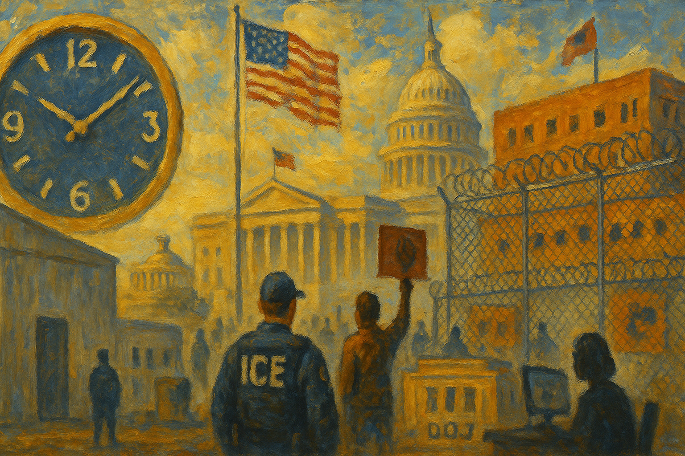

<!-- Generated by build_publish_week_v1 -->
<!-- Header image: image_wide_week56.png -->

# Week 56: A Week That Held Its Ground

*Executive power converted earlier gains into standing rule this week, while courts and Congress applied friction without reversing the underlying trend.*

The clock has not moved this week. It rests where it stood seven days ago, at 7:43 p.m., and that stillness is itself a kind of statement. Nothing this week reversed course. Nothing broke new legal ground so much as it deepened ground already broken. Power claimed in earlier weeks was now built into rule, into personnel, into the routine machinery of agencies. The pattern was consolidation, not conquest.

Week 56 opened and closed at the same hour: 7:43 p.m., unchanged from the week before, a net movement of zero minutes. The absence of clock motion did not mean an absence of consequence. This week's actions roughly balanced each other: aggressive expansions of executive reach on one side, repeated judicial and legislative pushback on the other. The scale did not tip. It strained.

The clearest structural move of the week came from the Office of Personnel Management, which finalized a rule stripping civil-service protections from about fifty thousand federal employees. This was not rhetoric. It was rule. Career staff who once had independent standing inside their agencies now answer more directly to political leadership. Whistleblower complaints that once traveled outward now often stay inside the chain of command. What had been a threat to the neutral civil service became, this week, an architecture. The Pentagon's move to cut ties with Harvard over ideological objections, and its demand that federally funded research align with administration priorities, showed the same instinct applied to universities. The ouster of the Justice Department's antitrust chief, after disputes over merger scrutiny, showed it applied to enforcement itself. The promotion of an immigration judge known for an extremely high asylum denial rate to oversee a major detention hub showed it applied to adjudication. Different agencies, same logic: loyalty over independence, alignment over neutrality.

Immigration enforcement supplied the week's largest operational story. ICE conducted broad raids under names like Operation Catch of the Day, sweeping through Maine communities in ways that residents described as terrorizing. Temporary Protected Status was ended for Somali nationals and, separately, for people from Yemen, stripping legal footing from thousands who had built lives under its protection. Detention capacity kept expanding. Warehouse conversions and new facilities fed a system already straining under a record population. Fort Bliss's Camp East Montana was reported to be violating dozens of federal standards. The Department of Veterans Affairs quietly ended its detainee care agreement, and ICE stopped paying outside medical providers, leaving people in custody with even less access to treatment.

Individual cases made the pattern concrete. A five-year-old asylum seeker was targeted for deportation despite a release order. Seamus Culleton, an Irishman with a valid work permit, spent months in detention facing what his wife called dire conditions. Leqaa Kordia remained in ICE custody for nearly a year despite bond rulings that should have freed her, her continued detention tangled with a history of protest-linked activity. These were not isolated errors; they were the visible edge of a system built to hold people longer, with fewer guarantees, regardless of what courts or paperwork said. Only late in the week did New Jersey's governor push back directly, signing an order that barred immigration agents from non-public state property without a judicial warrant. It was a reminder that state power could still draw a line, even a narrow one.

Yet courts did not stand by silently. Judges intervened repeatedly, and their interventions were not symbolic. One ordered the release of a detainee named Joswar Torres, finding his detention unconstitutional. Another temporarily barred ICE from using teargas and projectiles against Portland protesters. A third dismissed weak charges against a Los Angeles demonstrator after his prosecution turned out to rest on distorted evidence. A judge in Minnesota ordered ICE to give detainees meaningful access to counsel during a large enforcement operation. Days later, that operation itself wound down, with administration officials announcing a drawdown after weeks of protest and litigation. A judge blocked the Pentagon from punishing Senator Mark Kelly for his speech by reducing his military rank or pension. Another restored frozen Gateway tunnel funding that the White House had sought to leverage into a naming concession. None of these rulings reversed the broader trend, but together they showed that the judiciary, this week at least, still had teeth. Public resistance could still force a tactical retreat even amid expansion.

Election administration moved in a more openly restrictive direction. The House passed the SAVE America Act, a national framework imposing proof-of-citizenship and other new voting requirements. Critics warned it would burden eligible voters, especially naturalized citizens and those without easy access to specific documents. The concern was not abstract: a federal tool meant to screen for noncitizen voters was found to be misidentifying actual citizens on the rolls. North Carolina considered rules that would expand who could challenge a voter's eligibility. President Trump renewed his threat to federalize elections by executive order if the SAVE Act failed to pass, an assertion that state control of voting could simply be overridden. And in Georgia, the FBI raided the Fulton County election office and seized hundreds of boxes of materials tied to long-debunked 2020 fraud claims, using law enforcement power to revisit a settled dispute rather than to answer any live question.

The Epstein files became, this week, less a scandal about one dead man's crimes than a test of executive secrecy. Ghislaine Maxwell invoked the Fifth Amendment throughout a closed congressional deposition, giving lawmakers little to work with. The Department of Justice released additional unredacted material after sustained pressure, but lawmakers accused the department of protecting powerful men's names while exposing the names of victims, a redaction pattern that looked less like caution than curation. Then came the sharper turn: members of Congress from both parties, including the Speaker of the House, objected after learning the Justice Department had been tracking lawmakers' own searches within the records system. Oversight itself had become a surveilled activity. That detail, more than any hearing theater, marked the week's clearest instance of the executive reaching into a coequal branch's constitutional function.

Dissent met a harder edge in several forms at once. Federal prosecutors charged anti-ICE protesters in Portland with conspiracy, treating a demonstration as an organized criminal enterprise. Don Lemon was indicted, alongside other participants, over his coverage of an anti-ICE church protest, extending legal risk from the people in the street to the person recording them. Student activists were targeted for deportation over their political activity, tying campus speech directly to immigration status. High school students who walked out to protest ICE operations faced disciplinary threats in several states. None of these actions, alone, rewrote law. Together they showed protest, reporting, and activism folded into categories the state could punish more easily than ordinary political disagreement.

Public memory came under a quieter, steadier pressure. The State Department announced it would remove pre-2025 social media posts from easy public view, keeping them only in internal archives accessible through formal records requests. The Pride flag was removed from the Stonewall national monument under a new federal display policy. The White House deleted a vice-presidential post that had referred to the Armenian genocide, walking back language under evident pressure. And Freedom 250, the administration's signature commemorative program, arranged for major donors to remain anonymous if they chose, obscuring who was paying to shape the public story of the nation's history even as that story was being told. Each of these acts was small; together they described a government editing its own record in real time.

That editing had a financial counterpart. Freedom 250 itself doubled as an access market. Corporate sponsors including Deloitte gave large sums and received, in close proximity, more than one hundred million dollars in new ICE and Customs and Border Protection contracts. The overlap between sponsorship and procurement was not accidental in appearance, even if no single document proved intent. Elsewhere, the administration ordered the military to buy power from coal plants, canceled support for offshore wind, and moved to rescind the scientific finding underlying greenhouse-gas regulation. Each was a case of policy bending toward a favored industry by executive order rather than through ordinary regulatory process. Enforcement of environmental law against polluters dropped to levels critics called nearly nonexistent. None of these individually broke the law, but together they described a governing style in which policy, patronage, and industry preference had become difficult to tell apart.

Economic data added its own note of concern. Sharp downward revisions to 2025 jobs figures, some months flipping from reported gains to real losses, deepened doubts about whether official statistics could be trusted at face value. A senior economic adviser told Americans to expect weaker job growth as a direct consequence of the administration's own immigration policies, an unusually candid admission of trade-offs usually left unspoken. Trust in numbers, like trust in records, was fraying at the edges rather than collapsing outright.

Congress, for its part, was not simply a bystander. The House voted to rescind tariffs on Canada that had been imposed under a declared national emergency, a rare bipartisan check on the use of emergency authority for ordinary trade disputes. Senate Democrats blocked a Homeland Security funding package over ICE practices, accepting the risk of a departmental shutdown rather than fund conduct they found unacceptable. Lawmakers visited detention facilities and reported overcrowding firsthand. A grand jury declined to indict six Democratic lawmakers over a video urging troops to refuse illegal orders, refusing an attempt to criminalize political speech. These were not victories in any final sense. They were friction, applied where friction was still possible.

No single scheduled event anchors what comes next. The record shows ongoing litigation, an unresolved Homeland Security funding fight, and continuing congressional demands for investigation into the Justice Department's monitoring of lawmakers, but none with a fixed date attached.

The week that closed without clock movement was not a week of rest. Earlier gains were converted into standing rule. Detention and denial became infrastructure rather than emergency measure. And the machinery built to check these things, courts, a chamber of Congress, a scattering of state officials, held its ground without gaining much of it back. The stillness of the clock reflects that balance: erosion pressing forward, resistance pressing back, neither yet strong enough to move the hour.

<!-- Synopses for cross-posting -->
Long Synopsis: Week 56 closed exactly where it began, at 7:43 p.m., but stillness masked consolidation. The Office of Personnel Management stripped civil-service protections from roughly 50,000 federal employees, converting political control of the bureaucracy from tendency into rule. Immigration enforcement expanded through raids, detention buildouts, and terminated protections for Somali and Yemeni nationals, even as courts intervened repeatedly to block force, restore counsel access, and free wrongly held detainees. The House passed the SAVE America Act's voting restrictions while the FBI seized Georgia election records tied to debunked claims. The Epstein files became an oversight crisis after Congress learned the Justice Department had tracked lawmakers' own searches. Protesters, a journalist, and student activists faced sharpened legal risk. Courts, a chamber of Congress, and a scattering of state officials held their ground without gaining much of it back.
Short Synopsis: The clock held at 7:43 p.m. as executive power hardened into rule: civil-service protections stripped, immigration detention expanded, voting restrictions advanced, and DOJ surveillance of Congress exposed—while courts and lawmakers pushed back without reversing the trend.

