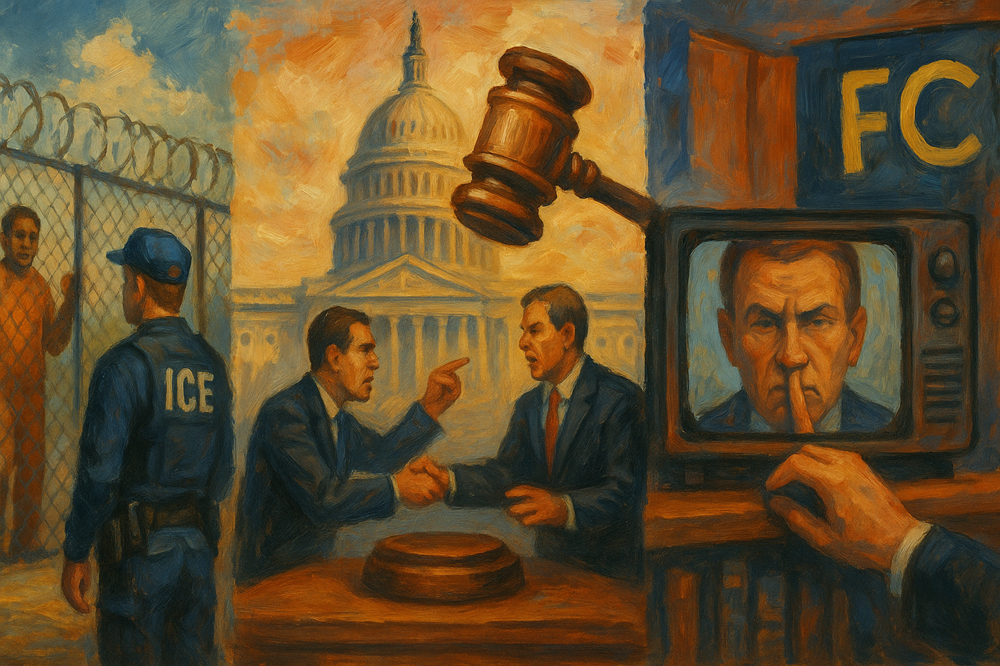

<!-- Generated by build_publish_week_v1 (appendix post) -->
<!-- Header image: image_wide_week57_appendix.png -->

# Week 57 Appendix: Minnesota, and the Standoff Beneath It

*A week of aggressive enforcement, funding coercion, and surveillance met courts, states, and protest with almost perfectly matched resistance.*

This was a high-pressure week defined by two simultaneous patterns: aggressive executive and enforcement overreach, and meaningful but incomplete institutional pushback. The strongest decay signals came from immigration enforcement, where ICE expansion, unlawful detentions, refugee rescreening, local-police deputization, evidence withholding, and surveillance of critics all pointed toward a security apparatus operating with weak legal restraint. A second major theme was the use of state power for political and personal ends: subpoenas aimed at Minnesota officials, federal funding coercion, luxury spending tied to deportation policy, and repeated signs of self-dealing and symbolic glorification around Trump. The information environment also worsened, especially through FCC pressure chilling broadcast interviews and through disputed transparency around Epstein-related records. At the same time, courts remained the clearest countervailing institution: judges blocked deportations, ordered bond-hearing compliance, restored historical exhibits, and the Supreme Court sharply limited unilateral tariff power. Overall, the week showed a democracy under concentrated executive strain, with the judiciary still functioning as the principal brake while Congress and agencies appeared more uneven and conflict-ridden.

Power and Authority

1. ICE expanded detention operations and planned new processing facilities (2026-02-14): The expansion increased federal coercive capacity over immigrants and widened the scale of detention with limited public accountability.

2. The Department of Justice issued subpoenas to Minnesota officials (2026-02-14): The subpoenas signaled direct federal pressure on state officials and raised concerns about using legal tools to punish political resistance.

3. Donald Trump said he would change voting rules without congressional approval (2026-02-14) *[single source]*: The statement asserted unilateral control over election rules and tested constitutional limits on executive power over voting.

4. The Trump administration scaled back immigration enforcement operations in Minnesota (2026-02-14): The drawdown showed that public protest could still affect federal enforcement tactics after a period of aggressive state action.

5. Cities, counties, and states created ICE-free zones in public spaces (2026-02-16) *[single source]*: Local governments used their own authority to limit federal immigration access to public sites and protect residents seeking services.

6. President Trump excluded governors from a bipartisan conference (2026-02-16): The exclusion narrowed intergovernmental participation and weakened norms of broad executive engagement across party lines.

7. The Office of Management and Budget withheld congressionally appropriated tunnel funding (2026-02-17) *[single source]*: The withholding tested whether the executive could use funding control to override congressional spending decisions and shape public works for political ends.

8. President Trump and his representatives filed trademark applications for an airport bearing his name (2026-02-17) *[single source]*: The filings blurred the line between public office and private commercial gain by tying presidential branding to public infrastructure.

9. The federal government bought a Georgia warehouse to convert it into a detention center (2026-02-18) *[single source]*: The purchase expanded detention capacity while bypassing local consent, concentrating federal enforcement power over a small community.

10. President Trump deployed FEMA to lead the Potomac sewage spill response (2026-02-18): The move asserted federal command during a shutdown dispute and sharpened tensions over executive control in state-federal emergencies.

11. President Trump issued an order to increase domestic glyphosate and phosphorus supply (2026-02-18): The order used emergency-style executive power to direct industrial production and shield favored producers from legal risk.

12. The CDC postponed its vaccine advisory panel meeting (2026-02-19): The postponement disrupted a key public-health decision process and increased executive influence over vaccine policy timing.

13. Health Secretary Robert F. Kennedy Jr. removed broad recommendations for six routine childhood vaccines (2026-02-19): The change shifted federal health guidance through executive control and weakened established public-health protections without legislative action.

14. The White House authorized ICE to detain refugees for aggressive rescreening (2026-02-19): The memo expanded executive detention power over legally admitted refugees and threatened due process and settled legal status.

15. President Trump announced a new global tariff under Section 122 after the Supreme Court ruling (2026-02-20): The move sought to preserve unilateral trade control after a judicial rebuke, testing how far the executive could work around constitutional limits.

16. The Department of Homeland Security considered buying a luxury jet for deportations and official travel (2026-02-20) *[single source]*: The proposal tied immigration enforcement to lavish executive spending and raised questions about priorities and misuse of public resources.

17. President Trump announced a $10 billion U.S. commitment to his Board of Peace and held its inaugural meeting (2026-02-20): The announcement claimed spending authority that belongs to Congress and concentrated diplomatic initiative in a legally disputed executive body.

18. The Trump administration proposed a U.S.-based alternative to the World Health Organization (2026-02-20): The proposal shifted global health coordination toward a new executive-led structure and risked weakening established multilateral accountability.

Institutions and Governance

1. Congress allowed a partial Department of Homeland Security shutdown after a funding impasse over immigration reforms (2026-02-14): The lapse showed how appropriations fights over enforcement accountability can disrupt governance while leaving core coercive functions intact.

2. Chuck Schumer and Hakeem Jeffries sent Republican leaders reform demands for any DHS funding bill (2026-02-14): The letter used legislative leverage to seek visible restraints and due-process rules for federal immigration agents.

3. House Oversight Committee Democrats subpoenaed the Justice Department for Epstein files (2026-02-14): The subpoena pressed an executive agency for records and tested Congress's capacity to compel disclosure in a politically sensitive matter.

4. The Justice Department dropped charges against two men after evidence undercut ICE agents' account (2026-02-14): The reversal exposed possible misconduct in federal enforcement and showed institutional correction after disputed use of force.

5. The Utah GOP struggled to advance a pro-gerrymandering ballot measure amid fraud claims (2026-02-14) *[single source]*: The confusion affected a redistricting effort that could shape representation and public trust in election rules.

6. Hakeem Jeffries and national Democrats organized counter-redistricting efforts in multiple states (2026-02-14): The effort showed parties using institutional mapmaking tools to compete for durable control of representation.

7. Senator Lisa Murkowski opposed the SAVE Act (2026-02-14): Her opposition highlighted institutional conflict over whether federal election rules should override state control and voter access concerns.

8. Civil rights groups asked a federal court to block misuse of voter data seized from Fulton County (2026-02-15) *[single source]*: The motion sought judicial protection for election records and voter privacy after federal seizure of local election data.

9. A federal judge blocked the deportation of Ruben Torres Maldonado (2026-02-15): The ruling showed courts checking immigration enforcement when removal threatened family integrity and due process.

10. A judge ruled that Ruben Torres Maldonado's arrest and detention had been illegal (2026-02-15): The decision reaffirmed that immigration arrests remain subject to legal limits and judicial review.

11. The National Trust for Historic Preservation sued to block White House ballroom construction (2026-02-15): The lawsuit challenged whether the executive could alter a historic federal site without required legal review.

12. Democratic lawmakers announced a boycott of the State of the Union address (2026-02-16): The boycott signaled a breakdown in ceremonial legislative-executive norms and public confidence in shared constitutional practice.

13. Senator Jon Ossoff warned against submission to false election narratives (2026-02-16) *[single source]*: The speech defended institutional legitimacy by rejecting narratives that weaken trust in electoral outcomes.

14. Judge Cynthia Rufe ordered the restoration of the President's House site exhibits in Philadelphia (2026-02-16): The injunction checked executive alteration of a public historic site and protected lawful process over federal memory institutions.

15. Seventeen states and the District of Columbia filed an amicus brief opposing an emergency stay in Lesly Miot v. Trump (2026-02-16): The filing showed states using the courts as an institutional counterweight to federal executive action.

16. A magistrate judge denied Minnesota's request for expedited discovery in its challenge to Operation Metro Surge (2026-02-16): The ruling slowed a state's effort to quickly investigate federal enforcement conduct, showing procedural limits on oversight litigation.

17. The Supreme Court revised its Rules of Procedure (2026-02-17): The rule changes affected how the nation's highest court manages cases and exercises institutional control over access and process.

18. House Democrats filed articles of impeachment against Kristi Noem (2026-02-17): The filing used a core legislative accountability tool to respond to alleged abuse and obstruction inside a major federal department.

19. The House Oversight Committee compelled Bill and Hillary Clinton to sit for filmed depositions (2026-02-17): The move showed Congress using subpoena power to force testimony from prominent figures in a high-profile investigation.

20. The Florida legislature advanced a plan to rename Palm Beach International Airport after Donald Trump (2026-02-17): The proposal used state legislative power to place personal political branding onto public infrastructure.

21. The American Academy of Pediatrics sued the Federal Trade Commission over a civil investigative demand (2026-02-17): The suit challenged whether a federal agency used investigative power to retaliate against protected speech beyond its lawful jurisdiction.

22. Plaintiffs in American Academy of Pediatrics v. Kennedy filed an amended complaint challenging additional HHS vaccine actions (2026-02-17): The filing used the courts to contest agency changes that could reshape public-health governance without adequate process.

23. Defendants in City of Philadelphia v. Burgum appealed the order restoring the President's House site (2026-02-17): The appeal extended an institutional fight over whether federal officials could alter a public historic site without lawful review.

24. Democracy Defenders Fund sued the FBI over an unanswered FOIA request about Thomas Homan (2026-02-17): The case tested whether federal law-enforcement agencies could evade statutory disclosure duties in politically sensitive matters.

25. The Ninth Circuit dismissed consolidated appeals in Oregon v. Trump (2026-02-17): The dismissal changed the procedural path of a challenge to federal action and showed appellate courts shaping institutional remedies.

26. Plaintiff states moved to enforce judgment against FEMA (2026-02-17): The motion showed states returning to court to force federal compliance with an existing judicial order.

27. The Census Bureau sought public comment on the Local Update of Census Addresses operation (2026-02-17): The notice supported address accuracy for the next census, which affects representation and allocation of public resources.

28. Congress nullified a District of Columbia tax amendment and enacted the Semiquincentennial Congressional Time Capsule Act (2026-02-18): One law reaffirmed Congress's control over D.C. self-government, while the other used federal lawmaking to shape national historical commemoration.

29. Les Wexner gave compelled testimony to the House Oversight Committee (2026-02-18) *[single source]*: The deposition showed Congress continuing to use investigative powers to examine elite networks and possible institutional failures.

30. Fifteen members of Congress demanded answers from Marco Rubio about a detained Palestinian-American teenager (2026-02-18): The letter used oversight to press the executive branch on protection of a U.S. citizen abroad and human-rights accountability.

31. Iowa Republican lawmakers moved to limit the governor's power ahead of the 2026 election (2026-02-18) *[single source]*: The effort suggested institutional rule changes driven by anticipated electoral risk rather than neutral governance reform.

32. Health and environmental groups sued the EPA over repeal of the greenhouse-gas endangerment finding (2026-02-18): The lawsuit challenged a major agency rollback and asked courts to police the legal basis of federal climate governance.

33. A federal judge declared a mistrial in the Texas antifa protest case (2026-02-18): The mistrial exposed how courtroom management and terrorism charges can shape the state's treatment of political protest cases.

34. Judge Sykes enforced a prior order requiring bond-hearing access for detained noncitizens (2026-02-18): The order reaffirmed that the executive must obey judicial limits in immigration detention and notify detainees of their rights.

35. Judge Frimpong allowed California cities and Los Angeles County to continue challenging federal immigration actions (2026-02-18): The ruling recognized local governments' standing to contest federal conduct and preserved an institutional check through litigation.

36. Thirteen states sued DOE and OMB over canceled energy and infrastructure funding (2026-02-18): The complaint challenged executive termination of congressionally mandated funds and defended legislative control over appropriations.

37. Judge Young dismissed State of New York v. Department of Education without prejudice after the administration withdrew its appeal (2026-02-18): The dismissal reflected how executive retreat in one case can reshape the institutional need for parallel litigation.

38. Judge Tunheim stayed consideration of a contempt motion for seven days in U.H.A. v. Bondi (2026-02-18): The stay delayed a possible judicial sanction and showed courts managing the pace of accountability disputes with the executive.

39. Governor J.B. Pritzker delivered a State of the State address criticizing withheld federal funds and outlining state policy actions (2026-02-19) *[single source]*: The address framed state government as a counterweight to federal pressure and used formal institutions to defend public services.

40. California organizers collected signatures for a billionaire tax ballot initiative (2026-02-19): The campaign used direct democracy to pursue fiscal policy outside ordinary legislative channels.

41. Oversight Chair James Comer declined to hold hearings on Trump's Epstein ties (2026-02-19): The refusal highlighted how committee gatekeeping can limit congressional accountability even when records disputes remain unresolved.

42. George Retes sued the federal government over his ICE detention as a U.S. citizen (2026-02-19) *[single source]*: The lawsuit challenged whether federal immigration agencies could detain a citizen without basic due-process protections.

43. Bard College's board hired WilmerHale to investigate its president's ties to Jeffrey Epstein (2026-02-19): The move used internal governance and outside review to address institutional integrity and donor oversight failures.

44. The American Academy of Pediatrics challenged the legitimacy of the CDC vaccine advisory committee in court (2026-02-19) *[single source]*: The case questioned whether a key federal advisory body was operating lawfully, with direct consequences for public-health governance.

45. Private plaintiffs sued to block the proposed Independence Arch in Washington (2026-02-19): The complaint argued that the executive could not bypass statutory review and legislative approval for a major commemorative project.

46. The Eighth Circuit stayed appeal proceedings in Tincher v. Noem (2026-02-19): The stay adjusted judicial oversight of a federal immigration operation after reports that the operation had ended.

47. Scientists and an engineers' association sued NASA and the Archivist to stop destruction of records and closure of archives (2026-02-19): The suit defended federal recordkeeping duties and challenged executive decisions that could erase public scientific memory.

48. Senator Susan Collins cast the decisive vote for a Trump-backed election measure (2026-02-20) *[single source]*: The vote advanced federal election legislation that critics said would narrow access and alter the balance of electoral rules.

49. California lawmakers introduced a bill to bar ICE agents from polling places and related election sites (2026-02-20): The bill used state law to protect voting from intimidation by federal immigration enforcement.

50. Congress restored funding to cultural institutions targeted for cuts (2026-02-20) *[single source]*: The funding decision showed legislative capacity to protect public cultural institutions from executive ideological pressure.

51. The Florida legislature passed a bill to rename West Palm Beach airport after Donald Trump (2026-02-20): The bill used state legislative authority to place partisan personal symbolism onto public infrastructure.

52. Donald Trump promoted the SAVE America Act in Georgia (2026-02-20): The speech backed federal election restrictions as a route to long-term partisan advantage, linking institutional rule changes to political dominance.

53. The Supreme Court ruled that Trump could not use IEEPA to impose tariffs (2026-02-20): The ruling reaffirmed that major taxing power belongs to Congress and marked a direct judicial check on unilateral executive trade authority.

54. Judge Sunshine Sykes ordered the government to notify detainees of bond eligibility and provide counsel access (2026-02-20) *[single source]*: The order enforced judicial limits on mass detention and underscored that immigration enforcement remains bound by court rulings.

55. The D.C. Circuit consolidated climate cases against the EPA (2026-02-20): The consolidation streamlined judicial review of a major federal climate rollback and shaped how institutional challenges would proceed.

56. California cities and counties sued federal departments over grant cuts tied to executive orders (2026-02-20): The complaint challenged whether the executive could use vague ideological conditions to control local funding.

57. Judge Rufe and Judge Hardiman issued competing stay rulings in the President's House site appeal (2026-02-20): The orders showed appellate and trial courts actively contesting the scope of relief over federal changes to a historic site.

58. The D.C. Circuit severed Lujan v. FMCSA and kept one case in abeyance (2026-02-20): The procedural order shaped how a challenge to federal action would move through the courts and delayed one track of review.

59. Protect Democracy Project filed an amended FOIA complaint against the Treasury Department (2026-02-20): The filing pressed a federal agency to comply with disclosure law and reinforced courts as a venue for transparency enforcement.

60. The Supreme Court granted the Solicitor General's motion to participate in oral argument in Montgomery v. Caribe Transport II (2026-02-20): The order gave the executive branch a formal voice in Supreme Court argument, shaping institutional influence over the case.

Economic Structure

1. The Trump administration withheld federal funding from Minnesota (2026-02-14): The funding pressure used federal money as leverage against a state, threatening services and state autonomy.

2. A Ford-backed battery plant idled operations in Kentucky and left 1,600 workers without jobs (2026-02-14) *[single source]*: The closure showed how federal policy shifts can quickly reshape local employment and industrial stability.

3. Home builders warned that immigration enforcement was harming the construction industry (2026-02-14) *[single source]*: The warning linked aggressive enforcement to labor shortages and higher costs, showing economic fallout from coercive immigration policy.

4. John Paulson planned to move an Ohio plant to China (2026-02-15): The offshoring plan highlighted how private capital decisions can undercut local jobs despite public claims of domestic investment.

5. Local officials and activists canceled or challenged contracts and leases that supported ICE operations (2026-02-16): The actions used local economic leverage to disrupt federal enforcement logistics and reduce dependence on private support networks.

6. Florida officials addressed labor shortages caused by deportations (2026-02-16) *[single source]*: The response showed how immigration crackdowns can destabilize labor markets and force state-level economic adjustments.

7. The FCC adopted new VoIP numbering rules and related compliance requirements (2026-02-17): The rules expanded regulatory oversight of communications providers and affected market access, public safety, and consumer protection.

8. The FCC changed the channel allotment for a Kansas PBS station (2026-02-17): The rule change affected public broadcasting infrastructure and access to educational television service.

9. The FCC launched matching programs with Pennsylvania and Indiana agencies to verify Lifeline and ACP eligibility (2026-02-17): The programs tightened administrative screening for public benefits and expanded data-sharing in access to communications subsidies.

10. The TSA restored the term "alien" in its regulations (2026-02-17): The rule changed official regulatory language in immigration-related administration and signaled a harder federal posture toward noncitizens.

11. Tricia McLaughlin and her husband's ad firm faced allegations that DHS advertising funds benefited a family-linked business (2026-02-17): The allegations suggested public spending may have been steered through insider ties, weakening trust in procurement integrity.

12. The Trump family benefited from a large UAE-linked investment in its crypto business (2026-02-17): The deal raised conflict-of-interest concerns by linking foreign money, private gain, and proximity to presidential power.

13. Eric Trump announced an investment in an Israeli drone company with a Pentagon contract (2026-02-17): The investment deepened concerns that politically connected private ventures could profit from defense relationships and public contracts.

14. The EPA rescinded the greenhouse-gas endangerment finding and related vehicle emissions standards (2026-02-18): The rollback changed the legal basis for major environmental regulation and shifted economic costs and benefits across industries and the public.

15. Banks and lenders pressed commercial real-estate borrowers as delinquency rates rose (2026-02-18): The pressure signaled financial stress in a major asset sector with possible spillover effects for local economies and public budgets.

16. The Congressional Budget Office projected a $1.85 trillion federal deficit for fiscal year 2026 (2026-02-18): The projection highlighted structural fiscal strain that shapes future public spending choices and political conflict over resources.

17. Florida's employment law contributed to labor shortages in agriculture and construction (2026-02-18): The shortages showed how immigration-related labor rules can reduce workforce supply and shift economic burdens onto employers and consumers.

18. U.S. labor markets posted weak job growth in 2025 (2026-02-18) *[single source]*: The slowdown pointed to broad economic weakness that can narrow public options and intensify political pressure over jobs and industry.

19. The FCC used investigations and guidance that affected CBS and political interview practices (2026-02-18) *[single source]*: The regulatory pressure showed how economic oversight of broadcasters can be used in ways that affect editorial independence and corporate decisions.

20. Governor J.B. Pritzker announced that Illinois had erased about $1 billion in medical debt (2026-02-19) *[single source]*: The debt relief used state policy to reduce private financial burdens and widen residents' economic security.

21. The Department of Housing and Urban Development proposed banning mixed-status families from public housing (2026-02-19) *[single source]*: The proposal threatened housing stability for immigrant families and used economic policy to intensify immigration enforcement pressure.

22. Trump Media and Technology Group launched politically branded financial products and absorbed large crypto and merger losses (2026-02-19) *[single source]*: The moves showed how a politically connected company tied speculative finance to ideological branding and concentrated risk around elite influence.

23. Federal agencies including the EPA, FDA, FCC, CDC, and OSHA issued a large set of routine regulatory notices, approvals, withdrawals, and comment requests (2026-02-17): These actions adjusted the rules for communications, food, drugs, pesticides, environmental review, and safety, shaping how public goods and markets are governed.

Civil Rights and Dissent

1. Federal immigration agents carried out aggressive operations in Minneapolis that used force on observers and detained large numbers of immigrants (2026-02-14): The operations raised due-process and bodily-security concerns by using federal force in ways that affected immigrants, residents, and bystanders.

2. Federal authorities were found by judges to have unlawfully detained immigrants thousands of times (2026-02-14): The pattern showed repeated deprivation of liberty without lawful basis, weakening due process in immigration enforcement.

3. Police and federal authorities arrested protesters and journalists during the Minnesota operations (2026-02-14) *[single source]*: The arrests burdened protest and press activity around a federal crackdown and narrowed space for public scrutiny.

4. Epstein survivors condemned the Justice Department's document release (2026-02-14): The statement argued that government disclosure choices exposed victims while shielding powerful people, raising rights and dignity concerns.

5. The Trump administration expanded the 287(g) program that deputized local police for immigration enforcement (2026-02-15) *[single source]*: The expansion increased the risk of racial profiling and blurred the line between local policing and federal immigration control.

6. Tom Homan defended masked ICE tactics and denied racial profiling (2026-02-15): The defense normalized opaque enforcement practices that affect civil liberties and public accountability in immigration policing.

7. Representative Randy Fine called for the deportation of Muslims (2026-02-16) *[single source]*: The statement targeted a religious group for exclusion and threatened equal citizenship norms in public political discourse.

8. Police officers stopped a memorial dance performance at the Kennedy Center (2026-02-16): The intervention restricted peaceful expressive activity on federal property and narrowed room for public dissent.

9. Local communities blocked ICE attempts to turn warehouses into detention centers (2026-02-16): The resistance used local action to limit expansion of detention infrastructure that would affect immigrant liberty and family security.

10. Juan Nicolás and his family were deported after the infant was hospitalized (2026-02-17) *[single source]*: The deportation of a recently hospitalized infant highlighted the harsh treatment of vulnerable families in immigration custody.

11. Andy Barr's Senate campaign and its corporate backers funded and promoted an ad using a white-supremacist-coded slogan (2026-02-17) *[single source]*: The ad injected extremist-coded racial messaging into electoral politics and risked normalizing exclusionary appeals in democratic competition.

12. Arizona Senate Republicans advanced legislation to place ICE agents at voting locations (2026-02-17): The proposal risked voter intimidation by bringing immigration enforcement into the act of voting, especially for minority communities.

13. The 50501 Movement, FLARE, and Citizens' Impeachment organized and held a national in-district lobbying day for impeachment demands (2026-02-17) *[single source]*: The coordinated action showed organized civic pressure on elected officials through peaceful constituent engagement across many districts.

14. Donald Trump issued a statement on Jesse Jackson's death centered on his own grievances (2026-02-17): The statement weakened norms of civic respect around a major civil-rights figure and shaped public discourse through personal grievance.

15. An immigration judge blocked the deportation of Mohsen Mahdawi (2026-02-17): The ruling protected a lawful resident from a deportation effort that his lawyers said retaliated against political speech.

16. A federal judge found that the government kept detaining noncitizens without required bond hearings (2026-02-18) *[single source]*: The finding showed ongoing denial of liberty protections to detained immigrants despite prior court orders.

17. The Trump administration expanded its immigration crackdown into more cities and towns (2026-02-20) *[single source]*: The broader deployment increased fear and exposure to detention in immigrant communities and intensified pressure on local dissent networks.

18. Workers at the Department of Justice hung a protest banner inside the department (2026-02-20): The action showed internal dissent by public employees against the administration's direction and use of federal power.

Information, Memory and Manipulation

1. The Department of Homeland Security used the SAVE database to flag supposed noncitizen voters and misclassified some naturalized citizens (2026-02-14): The practice risked wrongful criminal referral and voter challenges by using flawed administrative data in the democratic sphere.

2. The Department of Justice claimed it had fully complied with the Epstein Transparency Act (2026-02-14): The disputed claim raised concerns that official transparency statements were being used to close off scrutiny without full disclosure.

3. The Justice Department released records showing Steve Bannon's 2019 communications with Jeffrey Epstein (2026-02-14): The disclosure added to the public record about elite networks and the political uses of sensitive archival material.

4. The FBI refused to share evidence with Minnesota investigators in the Alex Pretti shooting case (2026-02-16): The refusal blocked outside review of a fatal federal enforcement incident and limited transparency across levels of government.

5. The Department of Homeland Security subpoenaed tech companies for identifying data on social-media accounts critical of ICE (2026-02-16): The subpoenas threatened anonymous political speech and expanded state monitoring of online dissent without judicial warrants.

6. The Pentagon considered cutting ties with an AI company over resistance to domestic surveillance use (2026-02-16) *[single source]*: The dispute showed pressure to align private technology with government surveillance aims affecting Americans' privacy.

7. CBS and the FCC blocked or chilled political candidate interviews on talk shows under new equal-time guidance (2026-02-16): The guidance and network response narrowed editorial freedom and showed regulatory pressure shaping what political speech reached mass audiences.

8. The Justice Department released emails about Jeffrey Epstein's views on Brett Kavanaugh's confirmation (2026-02-16) *[single source]*: The release added politically charged historical material to the public record and affected how past judicial confirmation battles were understood.

9. Reporters and advocates said the Epstein files were far larger than publicly disclosed (2026-02-16): The reports suggested that key records may still be withheld, deepening doubts about official transparency claims.

10. ICE tripled its use of Microsoft's cloud technology during the immigration crackdown (2026-02-17): The expansion increased the data infrastructure behind detention and deportation, strengthening surveillance capacity through private technology.

11. Federal agents raided an ICE detention facility to seize letters written by detained children (2026-02-17): The raid appeared to suppress firsthand accounts of detention conditions and limited public access to evidence of abuse.

12. The NYPD continued to withhold most surveillance contract records despite a court order (2026-02-17) *[single source]*: The noncompliance weakened public oversight of police surveillance tools and frustrated transparency law.

13. The FBI and DOJ record systems handled sexual-assault allegation records involving Trump in ways that raised transparency concerns (2026-02-18): The reporting suggested that sensitive investigative records tied to a powerful figure may have been obscured from public view.

14. The FDA removed warnings against dangerous autism treatments (2026-02-18) *[single source]*: The removal weakened public access to reliable health information and increased the risk that misinformation would guide family decisions.

15. The White House communications director mocked the Kennedy Center memorial performance on social media (2026-02-19) *[single source]*: The official ridicule sought to delegitimize protest and shape public perception of dissent through state-linked messaging.

16. Purdue University was accused of informally rejecting Chinese students from designated adversary nations (2026-02-20) *[single source]*: The reported policy showed national-security pressure spilling into academic admissions and narrowing information exchange across borders.

17. Donald Trump commented on Andrew Mountbatten-Windsor's arrest by stressing his own exoneration (2026-02-20): The remarks used a separate legal event to shape public narrative about Trump's own exposure and credibility.

