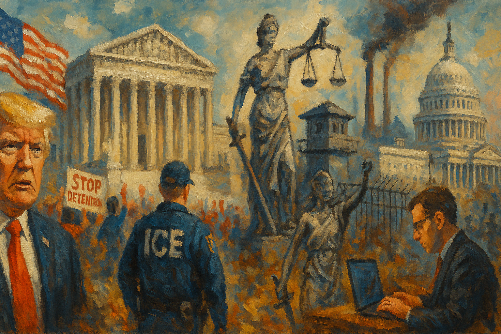

<!-- Generated by build_publish_week_v1 (appendix post) -->
<!-- Header image: image_wide_week58_appendix.png -->

# Week 58 Appendix: Tiered Citizenship as Governance

*A week of unmoved minutes in which law, bureaucracy, and algorithms deepen stratified citizenship, weaponized enforcement, and curated memory without opening a visibly new front.*

This week delivers a concentrated shock to multiple pillars of U.S. democracy. The most acute pressure comes from Trump’s open defiance of a 6–3 Supreme Court ruling on tariffs, his insistence that the decision gave him “more power,” and the rapid re‑imposition of legally dubious global tariffs. That posture, combined with a draft emergency order to federalize election administration, signals an executive willing to treat constitutional limits as negotiable. Simultaneously, immigration enforcement is weaponized: ICE quotas, abusive detention practices, whistleblower testimony about unlawful training, retaliatory prosecutions of protesters, and punitive Medicaid freezes aimed at Minnesota’s Somali community all deepen a two‑tier citizenship regime. Information control and memory manipulation accelerate around the Epstein files and Trump investigations—key DOJ documents are missing or withheld, a Trump‑appointed judge blocks release of a special counsel report, and Congress is steered toward Clinton‑centric theatrics. Environmental and public‑health safeguards are aggressively rolled back, while DHS and the Pentagon steer contracts and pressure tech firms in ways that fuse crony capitalism with security policy. Civil society pushes back—FOIA wins, state bans on ICE detention, protests, and court injunctions—but the net structural pressure this week clearly tilts toward entrenched executive impunity, selective law enforcement, and racialized exclusion.

Power and Authority

1. Trump administration ordered ICE to sharply increase immigration detentions using new arrest quotas (2026-02-21): The administration’s directive to boost ICE detentions through quotas expanded coercive executive power over noncitizens, heightening fears in immigrant communities and testing limits on humane, rights‑respecting enforcement.

2. Trump administration announced plans to terminate Temporary Protected Status for Yemeni nationals (2026-02-21): Ending TPS for Yemenis threatened lawful residents with deportation despite ongoing conflict, using executive discretion to destabilize a vulnerable diaspora and narrow humanitarian protections.

3. President Trump signed and repeatedly announced new global tariffs after the Supreme Court struck down his prior tariff regime (2026-02-21): Trump used Trade Act authorities to re‑impose broad global tariffs immediately after a 6–3 Supreme Court ruling against his IEEPA tariffs, asserting he could act without Congress and signaling defiance of judicial limits on executive economic power.

4. President Trump approved a federal emergency declaration for the Potomac River sewage spill (2026-02-21): The emergency declaration enabled federal coordination and funding for a major sewage spill affecting DC and nearby states, illustrating constructive use of executive emergency powers for public health and infrastructure.

5. President Trump pledged at a governors’ event to prioritize saving Utah’s Great Salt Lake while attacking ozone regulations (2026-02-21): Trump’s promise to aid the Great Salt Lake, framed alongside criticism of environmental rules, highlighted how disaster rhetoric can justify selective deregulation and politicized allocation of federal environmental attention.

6. President Trump threatened to block opening of the Gordie Howe International Bridge between Detroit and Canada (2026-02-21): By threatening to halt a major cross‑border bridge project after a rival bridge owner donated to a pro‑Trump PAC, Trump signaled willingness to wield federal infrastructure approvals to reward allies and pressure a foreign partner.

7. Department of Homeland Security initially suspended, then quickly reversed suspension of TSA PreCheck and Global Entry during a shutdown (2026-02-22): DHS’s abrupt halt and restoration of trusted traveler programs during a funding standoff showed how core mobility services can be used as leverage in partisan budget conflicts, directly affecting millions of travelers.

8. President Trump used the State of the Union address to deliver a campaign‑style speech attacking opponents and touting disputed achievements (2026-02-26): Trump’s State of the Union blurred governance and campaigning, using the institutional megaphone of the presidency to amplify contested claims about the economy and immigration while marginalizing opposition narratives.

9. President Trump declared a "war on fraud" led by Vice President Vance that blamed immigrants, especially Somalis, for vast economic losses (2026-02-26): Framing immigrants as massive fraud threats in a presidential address used stigmatizing rhetoric to justify intensified enforcement and fiscal measures against targeted communities, deepening stratified citizenship.

10. President Trump announced a draft executive order concept to declare a national emergency and federalize control over voting processes (2026-02-27): Circulation of a draft order to seize control of elections under a national emergency, including banning mail ballots and machines, signaled interest in using emergency powers to override state authority over voting.

11. Trump administration withheld $259 million in Medicaid reimbursements from Minnesota citing alleged fraud (2026-02-25): Freezing Medicaid funds to Minnesota, apparently tied to disputes over immigration enforcement and a large Somali population, used federal fiscal power to punish a disfavored state and jeopardized care for low‑income residents.

12. President Trump used the State of the Union to threaten Iran over its nuclear and missile programs (2026-02-25): Trump’s pledge that Iran would "never" obtain nuclear weapons, backed by a major US military buildup, signaled readiness to use or threaten force in ways that could bypass robust congressional debate.

13. President Trump publicly mused about a "friendly takeover" of Cuba amid a US‑imposed fuel blockade (2026-02-27): Trump’s suggestion of a takeover of Cuba, while US policy worsened its humanitarian crisis, reflected aggressive executive rhetoric about regime change that challenges norms of sovereignty and non‑intervention.

Institutions and Governance

1. House Oversight Committee Republicans subpoenaed Bill and Hillary Clinton to testify about Jeffrey Epstein (2026-02-21): Subpoenaing the Clintons for closed‑door Epstein depositions used congressional investigative powers in a highly politicized way, raising questions about whether oversight is being deployed for accountability or partisan spectacle.

2. Members of Congress led by Pramila Jayapal sent a letter urging DHS and ICE to release a gravely ill double amputee detainee (2026-02-21): Lawmakers’ intervention on behalf of a medically vulnerable ICE detainee highlighted congressional use of soft oversight tools to press executive agencies on detention conditions and humane treatment.

3. Illinois Governor J.B. Pritzker sent President Trump an invoice demanding reimbursement for unconstitutional tariff costs (2026-02-21): Pritzker’s symbolic invoice for billions in tariff‑related costs underscored state‑level resistance to federal economic policies deemed unlawful and highlighted tensions over who bears the burden of executive overreach.

4. U.S. Supreme Court ruled 6–3 that Trump’s IEEPA‑based global tariffs were unconstitutional (2026-02-20): The Court’s decision reaffirmed Congress’s exclusive power over taxation and tariffs, checking an expansive reading of emergency economic powers and reasserting judicial oversight of executive trade policy.

5. U.S. Fifth Circuit Court of Appeals lifted an injunction to allow Louisiana’s Ten Commandments classroom display law to take effect (2026-02-21): By allowing mandatory Ten Commandments displays in public school classrooms to proceed, the Fifth Circuit enabled a state law that tests First Amendment church‑state separation and minority religious rights.

6. Department of Justice under Attorney General Pam Bondi moved to intervene in a lawsuit challenging LAUSD’s race‑conscious resource allocation policies (2026-02-21): DOJ’s support for a suit attacking extra resources for majority‑nonwhite schools signaled a federal shift against equity‑oriented education policies, using civil‑rights enforcement to contest local desegregation efforts.

7. New Mexico Senate passed a bill banning ICE detention centers in the state (2026-02-23): New Mexico’s move to bar ICE detention facilities asserted state authority to limit participation in federal immigration enforcement infrastructure, reflecting institutional pushback against harsh detention practices.

8. Congressional Republicans expanded use of the Congressional Review Act to target agency decisions beyond formal rules (2026-02-23): Broadening CRA use to unwind long‑standing land‑protection decisions signaled a more aggressive legislative strategy to retroactively overturn agency actions, potentially destabilizing regulatory baselines.

9. House Republicans passed House Joint Resolution 140 to overturn a mining moratorium near the Boundary Waters (2026-01-21): Using the CRA to revoke a 20‑year mining ban near the Boundary Waters shifted federal land policy toward extractive interests, illustrating how Congress can rapidly dismantle environmental protections.

10. Senator Tina Smith and Roosevelt descendants led opposition in the Senate to the Boundary Waters mining resolution (2026-02-06): Smith and Roosevelt family members urged senators to reject the CRA mining rollback, invoking conservation traditions to defend public lands against short‑term industrial interests.

11. House Republicans and Speaker Mike Johnson faced internal calls for Rep. Tony Gonzales’s resignation while declining to open an ethics probe (2026-02-23): Republican leaders’ reluctance to launch a formal ethics investigation into Gonzales despite serious misconduct allegations highlighted uneven enforcement of congressional accountability norms.

12. U.S. Election Assistance Commission requested public comment on draft Voluntary National Election Audit Standards and later corrected access links (2026-02-23): By developing and seeking feedback on national audit standards, and correcting notice errors, the EAC worked to strengthen post‑election verification practices and public confidence in vote counting.

13. House Democrats introduced a resolution to release House Ethics Committee reports on sexual harassment (2026-02-24): The proposed resolution to publish past ethics reports on harassment sought to increase transparency around misconduct in Congress and reduce institutional shielding of abusive behavior.

14. Senate Democrats launched an investigation into possible FCC and CBS interference with a Stephen Colbert interview (2026-02-24): Senators’ probe into whether FCC officials and Paramount pressured CBS to block a candidate’s interview examined potential partisan manipulation of broadcast content and regulatory leverage over media.

15. House Speaker Mike Johnson acknowledged Congress lacked support to codify Trump’s proposed tariffs (2026-02-24): Johnson’s admission that there was no appetite to legislate Trump’s tariffs underscored a gap between executive trade ambitions and legislative consent, reinforcing Congress’s potential checking role.

16. House Democrats on Oversight Committee opened an investigation into DOJ’s handling of Epstein files and possible withholding of Trump‑related materials (2026-02-25): The oversight probe into whether DOJ withheld Epstein records involving Trump tested congressional capacity to enforce transparency statutes and scrutinize potential protection of powerful figures.

17. Milwaukee City Council member called for an investigation into Uline’s immigration and labor practices (2026-02-25): A local official’s push to scrutinize a major MAGA‑aligned donor’s company for possible immigration and labor abuses illustrated municipal oversight efforts targeting politically connected employers.

18. House Democrats led by Jamie Raskin and Jerry Nadler opened an inquiry into the forced resignation of antitrust chief Gail Slater (2026-02-25): Investigating whether Trump‑linked lobbyists engineered Slater’s ouster for opposing a major merger probed political interference in antitrust enforcement and the independence of competition policy.

19. Wyoming House of Representatives formed a legislative investigative committee over campaign checks handed out on the House floor (2026-02-26): Creating a committee to examine on‑floor delivery of donor checks to lawmakers signaled institutional concern about potential bribery and the integrity of state legislative processes.

20. Laramie County Sheriff’s Office opened a criminal investigation into the Wyoming House campaign check incident (2026-02-26): The sheriff’s criminal probe into campaign contributions delivered inside the statehouse complemented legislative review, reinforcing multi‑layered accountability for potential corruption.

21. Congress negotiated DHS funding with proposed restrictions on ICE and Border Patrol practices (2026-02-27): Ongoing DHS appropriations talks that tie funding to limits on warrantless arrests and enforcement at sensitive locations showed Congress using the power of the purse to shape immigration enforcement norms.

22. North Carolina Board of Elections drafted new voting rules premised on unfounded claims of noncitizen voting (2026-02-27): The MAGA‑aligned board’s proposed rules, built on the false premise of widespread noncitizen voting, risked erecting new barriers to ballot access under the guise of election integrity.

23. National Labor Relations Board withdrew its 2023 joint‑employer rule after a court vacated it and reinstated the 2020 standard (2026-02-27): By reverting to an earlier joint‑employer standard following litigation, the NLRB maintained a narrower definition of employer responsibility, affecting workers’ ability to hold multiple entities accountable.

24. Census Bureau corrected dates for the LUCA address‑update operation in a public notice (2026-02-27): Fixing LUCA schedule dates helped ensure accurate local participation in address updates, which underpin fair apportionment and resource distribution.

Economic Structure

1. Trump administration imposed and signaled increases in global tariffs that roiled markets and trading partners (2026-02-21): Sweeping, shifting global tariffs—announced at 10% then 15% with legal ambiguity—created economic uncertainty, triggered foreign retaliation, and raised consumer costs while centralizing trade power in the executive.

2. Treasury Secretary Scott Bessent refused to commit to refunding $134 billion in tariffs ruled unconstitutional (2026-02-22): Declining to promise refunds for unlawfully collected tariffs left importers and consumers bearing costs despite a Supreme Court ruling, raising concerns about economic redress and respect for judicial decisions.

3. Food and Drug Administration loosened labeling rules to allow "no artificial colors" claims despite certain dyes (2026-02-21): Allowing products with some non‑petroleum dyes to be marketed as having no artificial colors favored industry branding over strict transparency, potentially confusing consumers about food additive risks.

4. RFK Jr. and Trump administration defended an executive order to repatriate pesticide production despite toxicity concerns (2026-02-22): Backing expanded domestic pesticide production as economically necessary, even while acknowledging toxicity, prioritized agribusiness continuity over rapid transition to safer practices.

5. U.S. Trade Representative Jamieson Greer announced a new 10% global tariff with possible increases to 15% after Court defeat (2026-02-25): Greer’s rollout of a time‑limited 10% global tariff, with hints of higher rates, attempted to preserve leverage after the Court’s rebuke, deepening uncertainty for businesses and allies.

6. Trump administration repealed the EPA endangerment finding underpinning greenhouse gas regulation (2026-02-25): Eliminating the legal basis for federal greenhouse gas rules weakened climate policy architecture, likely raising emissions and energy costs while favoring fossil fuel interests.

7. Trump administration rolled back approvals and incentives for renewable power projects, especially offshore wind (2026-02-25): Halting leases and weakening incentives for renewables stalled nearly 173,000 clean‑energy jobs and slowed the energy transition, entrenching fossil‑fuel‑aligned economic structures.

8. President Trump announced "ratepayer protection pledges" tied to AI data center electricity demand (2026-02-25): Trump’s plan to negotiate with tech firms over higher power costs from AI data centers framed consumer relief around private deals, potentially fast‑tracking fossil plants and sidestepping broader regulatory solutions.

9. Trump administration cut energy‑efficiency tax credits and attempted to eliminate LIHEAP (2026-02-25): Reducing home energy credits and trying to end LIHEAP, while shutdowns delayed remaining aid, shifted rising energy burdens onto low‑income households and weakened social safety nets.

10. Trump administration awarded a DHS public relations contract to a Trump‑aligned consulting firm after a rushed bid (2026-02-26): Granting a DHS PR contract to a partisan firm after a 31‑hour bid window and loyalty requirements blurred lines between public communications and political messaging, raising procurement‑integrity concerns.

11. Pentagon threatened to cancel Anthropic’s contract and label it a supply‑chain risk unless AI safety limits were removed (2026-02-26): Pressuring Anthropic to weaken safeguards on its AI model in exchange for continued defense business showed how security contracting can be used to steer private technology toward military and surveillance uses.

12. Commodities Futures Trading Commission under Trump appointees intervened in court on behalf of Crypto.com soon after a large donation to a pro‑Trump PAC (2026-02-23): CFTC’s amicus support for Crypto.com following a $5 million MAGA Inc. donation suggested regulatory decisions may be influenced by political contributions, undermining confidence in impartial financial oversight.

13. Burger King deployed an AI chatbot to monitor employee speech and assist operations in hundreds of stores (2026-02-27): Connecting AI to worker headsets to track use of "please" and "thank you" introduced new forms of workplace surveillance that may chill worker autonomy and complicate organizing.

14. Bay Area Rapid Transit installed ticket gates that significantly reduced crime on trains (2026-02-26): BART’s fare‑gate project, which cut onboard crime by over half, showed how infrastructure and enforcement design can improve public safety on transit without broad criminalization.

15. New York Governor Kathy Hochul and other state leaders requested multi‑billion‑dollar refunds from the Trump administration for unlawful tariffs (2026-02-26): States’ refund demands following the tariff ruling highlighted the downstream fiscal harm of executive trade actions and pressed for economic accountability to affected businesses and consumers.

16. Congressional Budget Office updated projections showing earlier insolvency dates for Medicare and Social Security trust funds (2026-02-27): CBO’s revised timelines, partly attributed to Trump‑era tax cuts, underscored how fiscal policy choices can accelerate strain on core social insurance programs, shaping future redistribution debates.

17. National Labor Relations Board withdrew a broader joint‑employer rule after court action and reinstated a narrower 2020 standard (2026-02-27): Reverting to a more restrictive joint‑employer test limited workers’ ability to hold parent companies and franchisors responsible, reinforcing fragmented accountability in modern labor markets.

18. Howard Lutnick as Commerce Secretary faced scrutiny over Epstein ties and opaque investment promotion activities (2026-02-26): Questions about Lutnick’s Epstein connections and role in steering investments highlighted potential conflicts of interest at the helm of a key economic department.

19. Burger King and OpenAI piloted AI monitoring of worker‑customer interactions in 500 restaurants (2026-02-27): The Patty chatbot’s expansion illustrated how AI tools can be embedded in low‑wage workplaces, raising concerns about data use, algorithmic management, and worker privacy.

20. Trump administration froze $259.5 million in Medicaid funding to Minnesota over alleged fraud (2026-02-25): The Medicaid freeze jeopardized care for 1.2 million Minnesotans and was viewed by state officials as politically motivated, demonstrating how federal health dollars can be weaponized in intergovernmental disputes.

Civil Rights and Dissent

1. ICE and DHS officers detained and mistreated lawful travelers and long‑time residents in aggressive immigration enforcement (2026-02-21): Cases involving a British tourist with a valid visa, an Algerian resident, and others showed immigration authorities using detention powers in ways that raised due‑process and proportionality concerns.

2. ICE and DOJ prosecutors brought weak or false assault cases against protesters that were later dismissed by courts (2026-02-21): Multiple protest‑related assault prosecutions collapsed after video evidence contradicted officers’ accounts, exposing risks of criminal charges being used to chill dissent and the importance of judicial scrutiny.

3. Federal prosecutors and FBI arraigned a New Jersey group for impersonating immigration attorneys and staging sham court proceedings (2026-02-21): Charging fraudsters who exploited immigrants by faking legal processes demonstrated the justice system’s role in protecting vulnerable communities from private abuse of legal symbols.

4. ICE and DHS expanded or proposed new detention centers in North Carolina, prompting organized local opposition (2026-02-21): Plans for new ICE facilities in several NC cities spurred civil society mobilization against expanded detention capacity and its human‑rights implications.

5. Congressional Democrats and allied groups organized and joined a large boycott of Trump’s State of the Union and a parallel People’s SOTU (2026-02-24): Dozens of lawmakers and activists boycotting the official State of the Union to attend an alternative event used collective protest to challenge the legitimacy of the administration’s narrative.

6. Capitol Police and House leadership removed Rep. Al Green from the State of the Union for displaying a protest sign about racist imagery (2026-02-24): Ejecting a member of Congress for silently holding a sign condemning racist depictions of the Obamas highlighted institutional limits on protest inside the chamber and the racialized context of dissent.

7. Capitol Police forcibly removed and arrested Aliya Rahman, a disabled guest, during the State of the Union (2026-02-24): Rahman’s arrest for standing silently in the gallery raised serious concerns about suppression of peaceful protest, treatment of disabled individuals, and the criminalization of symbolic dissent.

8. Kansas legislature enacted SB 244 requiring IDs to list sex at birth and banning trans people from bathrooms matching their gender identity (2026-02-26): Kansas’s law invalidating trans residents’ existing IDs and enabling private lawsuits over bathroom use imposed sweeping restrictions on transgender people’s daily lives and legal recognition.

9. Democratic lawmakers in multiple states introduced bills to bar ICE employees from future civil service jobs (2026-02-26): Proposals to exclude ICE personnel from state civil service positions reflected intense backlash to federal immigration practices but also raised questions about employment discrimination and politicization of hiring.

10. Wyoming and Idaho legislatures and Congress in the late 19th century admitted multiple new Republican‑leaning states and manipulated census apportionment for partisan gain (1890-07-03): Historical accounts of state admissions and census manipulation in the 1880s–1890s illustrated how structural representation has long been shaped to entrench partisan advantage, informing today’s debates on democratic fairness.

11. Federal judge in Minnesota blocked a Trump policy allowing arrest and detention of certain lawful refugees after one year in the U.S. (2026-02-27): The injunction protecting Minnesota refugees from detention based solely on time since arrival reaffirmed legal limits on executive authority to reclassify admitted refugees as detainable.

12. Protect Democracy and affected observers filed a class‑action lawsuit alleging DHS labeled lawful immigration observers as "domestic terrorists" (2026-02-25): The suit challenged alleged retaliation against people recording ICE operations, arguing that branding observers as extremists violates free‑speech rights and chills oversight of law enforcement.

13. Federal judges in Minnesota documented widespread ICE disregard for court directives and lawful status in enforcement sweeps (2026-02-27): Judicial findings that ICE repeatedly ignored orders and targeted people with lawful status in Minnesota highlighted systemic civil‑rights violations and erosion of judicial authority in immigration enforcement.

14. ICE and Border Patrol conducted aggressive raids on California fast‑food workers, causing fear and job losses (2026-02-27): Workplace raids that triggered walkouts and a 5% local job decline showed how immigration enforcement can destabilize labor markets and intimidate low‑wage workers, prompting unions to assert constitutional protections.

15. Border Patrol agents in Buffalo released a nearly blind Rohingya refugee miles from home without notifying family or counsel, leading to his death (2026-02-25): Dropping a vulnerable refugee far from home without support, after a year in custody, exposed grave neglect in custody release practices and the life‑or‑death stakes of enforcement decisions.

16. ICE training leadership and whistleblower Ryan Schwank cut training hours and allegedly instructed new officers to violate constitutional limits (2026-02-23): Testimony that ICE training encouraged warrantless home entries and slashed legal instruction suggested institutionalized disregard for constitutional rights in frontline immigration enforcement.

17. North Carolina activists and property owners secured commitments not to lease facilities to ICE for detention expansion (2026-02-27): Local campaigns that persuaded landlords to refuse ICE leases demonstrated how community action can constrain the physical footprint of federal detention systems.

18. Democracy Docket and allied advocates published analyses calling for an end to felony disenfranchisement and tracking redistricting litigation (2026-02-24): Advocacy pieces on restoring voting rights to people with felony convictions and monitoring redistricting cases highlighted ongoing structural barriers to equal representation and efforts to counter them.

Information, Memory and Manipulation

1. Donald Trump publicly attacked Netflix executive Susan Rice and threatened consequences for the company unless she was removed (2026-02-21): Trump’s threats against Netflix over a board member signaled willingness to use political influence and pending regulatory decisions to pressure private media platforms and chill critical voices.

2. Guardian and Reporters Committee for Freedom of the Press won a FOIA lawsuit forcing DHS to release deportation data contradicting administration rhetoric (2026-02-22): FOIA‑released I‑213 forms showing most deportees lacked criminal convictions exposed a gap between official claims and reality, underscoring the role of transparency tools in checking narrative manipulation.

3. Department of Justice and Judge Aileen Cannon blocked public release of Special Counsel Jack Smith’s report on Trump’s classified documents case (2026-02-23): Permanently sealing Volume Two of the special counsel report, with DOJ’s non‑opposition, limited public and congressional insight into a major presidential misconduct investigation.

4. Department of Justice released Epstein files while omitting or mis‑tagging key documents, prompting internal review (2026-02-23): The Epstein files release, followed by revelations of missing FBI 302s and internal memos about flagging sensitive materials, raised concerns that records involving Trump and other elites were selectively withheld.

5. Federal judge William Porter barred DOJ from searching a Washington Post reporter’s seized devices and ordered court‑run review (2026-02-24): By interposing the court between DOJ and a reporter’s devices, the judge protected source confidentiality and checked potential overreach in national‑security investigations targeting journalists.

6. Federal Communications Commission launched a "Pledge America" patriotic programming campaign for broadcasters (2026-02-27): The FCC’s call for patriotic content tied to the nation’s 250th anniversary, amid broader efforts to shape news narratives, raised worries about subtle state steering of media agendas.

7. Donald Trump and allies called for jailing political opponents over 2020, shared fake electoral maps, and urged regulators to pressure Apple’s News app (2026-02-27): Trump’s demands to imprison rivals, promotion of fabricated maps, and suggestions to coerce tech platforms illustrated a strategy of weaponizing disinformation and regulatory threats to shape the information environment.

8. White House social media team posted an AI‑doctored video misrepresenting NHL player Brady Tkachuk’s remarks about Canadians (2026-02-26): Using an official channel to share AI‑generated false speech by a public figure demonstrated how generative tools can be deployed for propaganda, undermining trust in authentic video evidence.

9. Donald Trump made racist social media remarks telling Reps. Ilhan Omar and Rashida Tlaib to go "back" to where they came from (2026-02-25): Trump’s racist posts targeting two women of color in Congress contributed to a hostile climate for minority representatives and normalized xenophobic rhetoric from the top of government.

10. Department of Justice temporarily removed then restored an Epstein‑related photo of Commerce Secretary Howard Lutnick (2026-02-26): The brief disappearance of a Lutnick‑Epstein photo from DOJ’s site, later restored after media attention, fueled suspicion about selective sanitization of embarrassing archival material.

11. National Archives and Records Administration issued corrections and sought comment on multiple federal records schedules (2026-02-26): NARA’s corrections and public comment process for agency records schedules supported transparent, rule‑bound management of federal archives, which underpins historical accountability.

12. Democracy Docket published opinions stressing the need for strong independent media and litigation tracking to protect democracy (2026-02-27): Commentary emphasizing independent journalism and systematic tracking of election‑related cases highlighted civil‑society efforts to counter disinformation and legal erosion of democratic access.

13. Noah Smith and other economists published critiques exposing methodological errors in anti‑immigration research by George Borjas (2026-02-27): Reanalyses showing that data errors drove negative findings about H‑1B workers undermined a key empirical pillar of restrictionist arguments, illustrating how scholarly scrutiny can correct policy‑relevant misinformation.

14. Federal Communications Commission modified multiple Privacy Act systems of records and launched data‑matching programs for benefits eligibility (2026-02-25): FCC updates expanding data sharing with Treasury and state agencies for Lifeline and ACP eligibility verification increased administrative efficiency but also broadened government access to personal data.

15. Federal Communications Commission designated a hearing to examine possible unauthorized foreign control and misrepresentation by a Texas radio licensee (2026-02-24): Ordering a hearing into 97.5 Licensee TX, LLC’s ownership and candor addressed concerns about foreign influence and honesty in broadcast licensing, key to media transparency.

16. EEOC held a closed commission meeting under Sunshine Act exemptions to decide a federal discrimination appeal (2026-02-23): Closing an EEOC meeting on a federal discrimination case limited public visibility into how the agency adjudicates workplace rights, though it complied with statutory exemptions.

