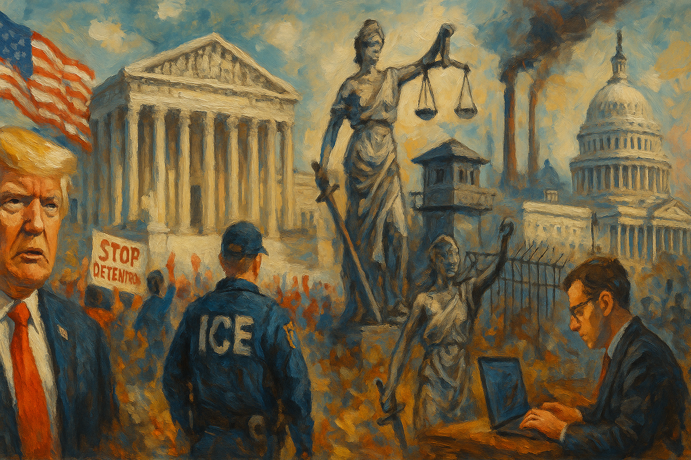

<!-- Generated by build_publish_week_v1 (appendix post) -->
<!-- Header image: image_wide_week58_appendix.png -->

# Week 58 Appendix: The Week the Clock Held Still

*A tariff ruling was defied within days, immigration enforcement widened, and records fights deepened, yet the measured week produced no net movement.*

This was a high-pressure week defined by executive defiance, politicized enforcement, and information control. The clearest structural pattern was the administration’s response to judicial limits: after the Supreme Court struck down Trump’s tariff regime, the White House immediately sought alternate authorities, publicly claimed expanded power, and continued threatening unilateral action. That dynamic sharply worsened traits tied to unchecked executive power, law as a weapon, and the weakening of separation-of-powers norms. A second major theme was immigration enforcement as a broad instrument of fear and hierarchy: detention quotas, TPS termination, refugee detention policies, warrantless or deceptive arrests, deaths and mistreatment of vulnerable migrants, and expansion of detention infrastructure all increased pressure on traits involving stratified citizenship, criminalized dissent, and politicized civil service. Third, the week showed a sustained transparency crisis around Epstein-related records and the blocked Jack Smith report, alongside direct pressure on media companies and AI-driven disinformation. Courts provided some meaningful democratic repair—especially on tariffs, refugee detention, press protections, and abusive prosecutions—but the week’s dominant force was executive and institutional hardening against accountability.

Power and Authority

1. The Trump administration ordered ICE to sharply increase detentions and daily arrests (2026-02-21): The directive expanded direct coercive state power in immigration enforcement and increased the risk of detention for migrants and travelers with limited immediate recourse.

2. The Trump administration announced plans to end Temporary Protected Status for Yemenis (2026-02-21): Ending TPS threatened lawful presence for a vulnerable immigrant group and increased executive control over residency and deportation risk.

3. President Trump approved a federal emergency declaration for the Potomac River sewage spill (2026-02-21): The declaration activated federal emergency authority to coordinate disaster response and public health protection across the capital region.

4. The Department of Homeland Security reversed its suspension of TSA PreCheck while keeping Global Entry halted (2026-02-22): The reversal showed how shutdown-era executive decisions could quickly disrupt and then selectively restore basic public-facing security services.

5. President Trump threatened military action against Iran in public remarks and in his State of the Union address (2026-02-25): The threats signaled possible unilateral use of force and raised the stakes of executive war-making power in a volatile regional crisis.

6. President Trump delivered a campaign-style State of the Union address and announced a "war on fraud" led by Vice President Vance (2026-02-26) *[single source]*: The speech used presidential authority and national messaging to frame immigrants as a threat and to shape public opinion ahead of elections.

7. The Trump administration withheld $259 million in Medicaid funds from Minnesota (2026-02-27): The funding freeze used federal spending power to pressure a state government and threatened access to health services for vulnerable residents.

8. Right-wing activists circulated a draft executive order to declare a national emergency and take federal control over voting processes (2026-02-27): The draft proposed using emergency power to override normal election administration and would have shifted core voting authority away from states.

9. Mayor Zohran Mamdani secured the release of a Columbia student from federal immigration detention in a White House meeting (2026-02-27): The release showed that executive detention decisions could be altered through direct political intervention rather than ordinary legal process alone.

Institutions and Governance

1. The House Oversight Committee subpoenaed Bill and Hillary Clinton to testify about Jeffrey Epstein (2026-02-21): The subpoenas used congressional investigative power in a politically charged inquiry, testing whether oversight was serving accountability or partisan diversion.

2. Representative Pramila Jayapal and other lawmakers urged DHS and ICE to release a medically vulnerable detainee in Georgia (2026-02-21) *[single source]*: The letter used congressional oversight to press executive agencies over detention conditions and possible abuse of a disabled detainee.

3. Governor J.B. Pritzker sent President Trump an invoice for tariff costs borne by Illinois families (2026-02-21): The move sought political accountability for federal economic actions and highlighted state resistance to disputed executive trade policy.

4. The Supreme Court ruled that President Trump's IEEPA tariff regime was unlawful (2026-02-21): The ruling reaffirmed that Congress, not the president alone, controls tariff power and imposed a direct judicial check on executive overreach.

5. The Fifth Circuit lifted an injunction and allowed Louisiana to enforce its Ten Commandments classroom law (2026-02-21) *[single source]*: The ruling let the state impose a religious display mandate in public schools, testing church-state boundaries through judicial action.

6. Federal judges in Minneapolis and Los Angeles dismissed several assault cases against protesters and immigrants after evidence undercut officers' claims (2026-02-21) *[single source]*: The dismissals exposed weak or false federal allegations and reinforced the courts' role in checking abusive prosecutions.

7. The Department of Justice moved to intervene in a lawsuit challenging LAUSD race-conscious school support policies (2026-02-21) *[single source]*: The intervention used federal legal power to attack a local equity policy, showing how civil rights enforcement can be redirected by political leadership.

8. The New Mexico Senate passed a bill to ban ICE detention centers in the state (2026-02-23) *[single source]*: The bill used state legislative power to limit detention infrastructure and push back against federal immigration enforcement practices.

9. Congressional Republicans expanded their use of the Congressional Review Act against agency actions (2026-02-23) *[single source]*: The move widened Congress's ability to undo agency decisions and shifted institutional power away from administrative expertise.

10. Republicans in Congress passed House Joint Resolution 140 to overturn the Boundary Waters mining moratorium (2026-02-23) *[single source]*: The resolution used legislative procedure to reverse an environmental protection order and weaken agency-based land safeguards.

11. Senator Tina Smith led Senate opposition to House Joint Resolution 140 (2026-02-23) *[single source]*: The opposition showed legislative resistance to using expedited congressional tools to dismantle long-term public land protections.

12. A federal judge in Texas granted a habeas petition and ordered the release of a detained five-year-old asylum-seeking child (2026-02-23) *[single source]*: The ruling checked executive detention power and affirmed judicial protection for a child's liberty and due process interests.

13. The Supreme Court agreed to hear the Suncor climate accountability case and directed briefing on jurisdiction (2026-02-23): The Court's move positioned it to shape whether state and local climate accountability suits can proceed, with broad effects on judicial access.

14. Judge Aileen Cannon permanently blocked the release of Volume Two of Jack Smith's report on the classified documents case (2026-02-23): The order restricted public and congressional access to a major investigative record, limiting transparency around alleged presidential misconduct.

15. The Supreme Court issued routine orders in several cases and barred two frequent filers from further noncriminal petitions without fees (2026-02-23): The orders reflected ordinary docket control and the Court's gatekeeping power over access to its process.

16. The Election Assistance Commission requested public comment on proposed national election audit standards and later corrected the access link (2026-02-23): The notices advanced national guidance for election auditing and public participation in election administration standards.

17. Senate Democrats opened an investigation into whether the FCC and Paramount blocked a Colbert interview for political reasons (2026-02-24) *[single source]*: The inquiry used oversight power to examine possible partisan censorship and regulatory pressure on a major media company.

18. House Speaker Mike Johnson said Congress lacked support to codify Trump's tariffs (2026-02-24): The statement underscored that the president's tariff agenda lacked legislative backing, reinforcing Congress's formal role in trade law.

19. A federal judge barred the Justice Department from searching a Washington Post reporter's seized devices (2026-02-25): The ruling protected press independence and limited executive access to journalistic materials in a national security investigation.

20. The Department of Justice sued UCLA over alleged antisemitism tied to campus protest conditions (2026-02-25): The lawsuit used federal institutional power against a public university and intensified pressure on campuses over protest governance.

21. House Democrats opened inquiries into Gail Slater's ouster and DOJ handling of Epstein files (2026-02-25): The inquiries used oversight tools to probe political interference in antitrust enforcement and possible withholding of sensitive records.

22. A federal judge in Oregon ruled against the Trump administration in the Columbia-Snake hydropower case (2026-02-26) *[single source]*: The decision rejected the administration's withdrawal from a negotiated river management framework and reaffirmed judicial review of agency reversals.

23. Representative Delia Ramirez pressed for Kristi Noem's resignation and impeachment over immigration enforcement (2026-02-26): The demand escalated legislative scrutiny of DHS leadership and framed immigration enforcement as a matter of institutional accountability.

24. Democratic lawmakers introduced bills to bar ICE employees from some state civil service jobs (2026-02-26) *[single source]*: The bills used state legislative power to resist federal immigration enforcement personnel and raised questions about state-federal institutional conflict.

25. The Kansas legislature put into effect a law requiring IDs to reflect sex at birth after overriding the governor's veto (2026-02-26) *[single source]*: The law used state legislative power to restrict transgender residents' legal recognition and access to public accommodations.

26. The Wyoming House formed an investigative committee over campaign checks handed to lawmakers on the chamber floor (2026-02-26) *[single source]*: The committee signaled institutional concern about possible bribery and the integrity of legislative conduct.

27. The Supreme Court released four opinions in ordinary cases (2026-02-24): The opinions reflected routine judicial lawmaking and the Court's continuing role in setting binding national precedent.

28. Federal courts and litigants filed, amended, consolidated, or ruled on a wide set of administrative and immigration cases (2026-02-23): The filings and rulings showed sustained judicial review of executive actions across immigration, education, housing, health, and records disputes.

29. The Congressional Budget Office updated projections showing earlier insolvency dates for Medicare and Social Security trust funds (2026-02-27) *[single source]*: The update informed legislative debate over fiscal policy and the long-term stability of major social insurance institutions.

30. House Oversight Republicans deposed Bill and Hillary Clinton in closed-door Epstein-related proceedings that were disrupted by a leaked photo (2026-02-25): The depositions and breach of hearing rules highlighted both Congress's investigative power and the erosion of procedural discipline in oversight.

31. Congress negotiated DHS funding with proposed restrictions on ICE and Border Patrol practices (2026-02-27): The talks used appropriations leverage to try to constrain immigration enforcement methods and restore institutional checks on DHS operations.

32. Republicans filed to revive the independent state legislature theory in redistricting litigation (2026-02-27) *[single source]*: The filing sought to shift election rule power toward state legislatures and away from state courts, with major implications for representation.

Economic Structure

1. President Trump imposed new global tariffs under Section 122 and then said the rate would rise from 10% to 15% (2026-02-21): The move used unilateral trade power to reshape prices and commerce after a court loss, increasing economic uncertainty and testing statutory limits.

2. The FDA loosened labeling rules for products marketed as having no artificial colors (2026-02-21) *[single source]*: The change reduced consumer clarity in food labeling and showed regulatory choices that can favor industry over transparent public information.

3. RFK Jr. defended support for Trump's order to expand domestic agricultural chemical production (2026-02-22) *[single source]*: The stance backed a policy that tied economic planning to chemical-intensive agriculture despite public health and environmental concerns.

4. Treasury Secretary Scott Bessent declined to commit to refunds for tariffs collected under the invalidated regime (2026-02-22): The refusal left unresolved whether the government would return unlawfully collected money, weakening fiscal accountability to importers and consumers.

5. President Trump granted tariff exemptions for AI data center computers and planned to scale back some steel and aluminum tariffs (2026-02-22) *[single source]*: The exemptions showed selective executive control over trade burdens and the ability to favor chosen sectors through ad hoc tariff relief.

6. The FCC invited comment on CORES registration and other routine information collections (2026-02-23): The notices affected how firms and small businesses interact with federal regulators and comply with administrative requirements.

7. The FDA issued routine determinations, vouchers, and information collection notices on drugs and compounding (2026-02-23): The actions shaped market entry, regulatory oversight, and incentives in pharmaceutical and health product sectors.

8. OMB, GSA, NASA, and the Defense Department submitted procurement-related information collection renewals on intellectual property and trade rules (2026-02-23): The renewals affected contractor obligations and the administrative framework for federal purchasing and trade compliance.

9. The CFTC supported Crypto.com in litigation shortly after a large pro-Trump political donation (2026-02-23): The intervention raised concerns that regulatory power was being used in ways that tracked donor access rather than neutral enforcement.

10. FedEx sued the federal government for refunds of tariffs the Supreme Court had found unlawful (2026-02-23): The suit sought financial redress for executive trade actions and highlighted the economic fallout of unlawful tariff policy.

11. The CDC opened comment periods on several public health data collection projects (2026-02-24): The notices shaped how federal health programs gather evidence for funding, surveillance, and performance oversight.

12. The EPA repealed 2024 amendments to hazardous air pollutant standards for coal- and oil-fired power plants (2026-02-24): The repeal weakened pollution controls and showed regulatory rollback that shifted costs from industry to public health and the environment.

13. The EPA sought comment on chemical data reporting renewal (2026-02-24): The renewal maintained a core reporting system that supports federal oversight of chemical risks and industrial compliance.

14. The FCC announced a matching program with Michigan to verify Lifeline and ACP eligibility (2026-02-24): The program used cross-agency data to police benefit eligibility and affected access to subsidized communications services.

15. The FDA renewed its Gastrointestinal Drugs Advisory Committee and sought comment on supplement manufacturing rules (2026-02-24): The actions preserved expert input into drug regulation and updated compliance expectations for supplement manufacturers.

16. The Trump administration repealed the endangerment finding and rolled back renewable energy approvals and incentives (2026-02-25) *[single source]*: The moves dismantled key climate and clean energy policy supports, shifting economic advantage toward fossil fuel interests.

17. President Trump announced "ratepayer protection pledges" tied to AI data center electricity demand (2026-02-25) *[single source]*: The plan proposed executive bargaining over energy costs and infrastructure burdens without addressing the underlying market structure.

18. The Trump administration cut energy assistance supports and hindered LIHEAP operations (2026-02-25) *[single source]*: The cuts reduced help for low-income households facing utility costs and weakened a public good that cushions economic hardship.

19. The FCC modified several records systems and launched matching programs tied to Lifeline and the Affordable Connectivity Program (2026-02-25): The changes expanded administrative data-sharing around benefit programs and affected how low-income communications aid is managed.

20. The FCC finalized 6 GHz unlicensed device rules and sought comment on several information collections (2026-02-25): The actions shaped spectrum access and compliance burdens in communications markets while opening routine regulatory review.

21. The FDA announced OMB approvals and sought comment on several drug, feed, biologics, and tobacco information collections (2026-02-25): The notices affected compliance costs and oversight across food, drug, and tobacco sectors that shape public health markets.

22. The Department of Homeland Security awarded a $250,000 public relations contract to a Trump-aligned consulting firm after a brief bidding window (2026-02-26) *[single source]*: The contract raised concerns that procurement rules were bent toward political loyalty, weakening fairness and trust in public contracting.

23. The Pentagon threatened Anthropic's contract unless it removed AI safety limits and granted broader military access (2026-02-26): The pressure used federal contracting leverage to shape private technology design, showing how state purchasing power can steer corporate conduct.

24. Governor Kathy Hochul requested a $13.5 billion refund tied to Trump's tariff regime (2026-02-26): The request sought restitution for state-level economic harm and underscored the fiscal consequences of disputed executive trade actions.

25. The EPA approved, denied, or proposed a series of air, waste, and hazardous materials regulatory actions (2026-02-26): The actions redistributed regulatory authority and compliance burdens across states and industries in environmental governance.

26. The FCC expanded delegated authority for claims settlements and sought comment on accommodation-related forms (2026-02-26): The rule changes streamlined internal administration and adjusted how the agency handles claims and accessibility paperwork.

27. The FDA issued several patent review period determinations and sought comment on investigational device reporting (2026-02-26): The determinations affected patent life and market exclusivity for medical products, shaping incentives and competition in health markets.

28. OSHA extended OMB approval for formaldehyde standard information collection (2026-02-26): The extension maintained workplace safety reporting requirements while increasing estimated compliance burdens for affected employers.

29. The EPA published environmental review notices, added a PFAS chemical to the Toxics Release Inventory, and extended greenhouse gas reporting deadlines (2026-02-27): The actions mixed stronger toxic disclosure with delayed climate reporting, affecting public oversight of industrial environmental harms.

30. The EPA finalized pesticide tolerance actions and opened comment on emergency exemptions for an unregistered rice pesticide (2026-02-27): The decisions shaped food safety and agricultural regulation by setting residue limits and considering emergency use of unregistered chemicals.

31. The FDA issued generic drug guidance notices, announced a workshop, and granted a pediatric priority review voucher (2026-02-27): The actions influenced generic drug development and incentives for rare disease treatments, with effects on access and pricing.

32. The General Services Administration requested comment on overseas employment forms and submitted an ombudsman inquiry instrument for review (2026-02-27): The notices affected administrative rules for federal employment and vendor complaints in government procurement systems.

33. OSHA announced Intertek's application to expand testing recognition to a Singapore site (2026-02-27): The application affected product testing infrastructure and the regulatory framework for safety certification in global supply chains.

34. OMB, GSA, NASA, and the Defense Department submitted a review request on contractor record examination and audit requirements (2026-02-27): The submission maintained audit access rules that support accountability in federal contracting and pricing oversight.

35. The NLRB withdrew the 2023 joint employer rule and restored the 2020 standard (2026-02-27): The withdrawal narrowed employer responsibility in labor law and weakened a regulatory framework that can protect workers in fissured workplaces.

36. Burger King announced an AI chatbot to monitor employee interactions in hundreds of restaurants (2026-02-27): The rollout expanded workplace surveillance and data-driven management in low-wage labor settings.

37. The EPA granted blanket exemptions and loosened mercury and air toxics restrictions for coal plants (2026-02-27) *[single source]*: The exemptions reduced compliance duties for coal operators while shifting pollution risks onto nearby communities and weakening regulatory credibility.

38. The Department of Homeland Security remained in a partial shutdown that disrupted services and worker pay (2026-02-25): The shutdown impaired public services and showed how budget conflict can impose economic harm on workers and service users alike.

39. Wholesale price data showed faster-than-expected inflation in January (2026-02-26): The data signaled continued cost pressure in the economy, shaping the policy environment for households and federal decision-makers.

40. The FDA requested comments on international drug scheduling recommendations (2026-02-27): The notice linked domestic regulatory practice to international narcotics control and affected future drug market restrictions.

Civil Rights and Dissent

1. Federal prosecutors arraigned four people in New Jersey for posing as immigration lawyers and officials to defraud immigrants (2026-02-21): The case addressed exploitation of immigrants through fake legal process and affected trust in access to justice for vulnerable communities.

2. ICE continued detaining immigrants and travelers in cases that raised due process concerns (2026-02-21) *[single source]*: The detentions showed how immigration enforcement can deprive people of liberty despite pending legal claims or valid travel status.

3. North Carolina activists organized campaigns and weekly protests against proposed ICE detention expansion (2026-02-21): The organizing showed sustained civil resistance to detention growth and local efforts to defend immigrant rights through protest and pressure.

4. Democratic lawmakers and the U.S. women's hockey team announced boycotts or refusals tied to President Trump's State of the Union (2026-02-22) *[single source]*: The refusals used nonattendance as peaceful dissent against presidential spectacle and political co-optation.

5. Aliya Rahman and Representative Al Green were arrested or removed after silent protest during the State of the Union (2026-02-24): The arrest and ejection showed security power being used against symbolic dissent in one of the country's most visible civic forums.

6. Protect Democracy and plaintiffs filed a class-action lawsuit against DHS over labeling legal observers of immigration raids as domestic terrorists (2026-02-25): The suit challenged retaliation against people documenting state action and defended speech and observation rights around immigration enforcement.

7. ICE whistleblower Ryan Schwank testified that ICE training had been cut and included instructions that could violate constitutional rights (2026-02-23): The testimony suggested systemic risks to civil liberties in immigration enforcement and raised concerns about unlawful home entries and arrests.

8. Border Patrol and immigration officials released a nearly blind Rohingya refugee far from home without notifying his family or lawyer, after which he was found dead (2026-02-25): The case raised grave concerns about the treatment of vulnerable refugees and the duty of care owed by immigration authorities.

9. Columbia student Elmina Aghayeva was detained by ICE and later released after political intervention (2026-02-26): The detention and release highlighted the fragility of student visa rights and the use of immigration power against campus-linked individuals.

10. A federal judge in Minnesota blocked the arrest and detention of admitted refugees based solely on failure to adjust status after one year (2026-02-27): The injunction protected refugees from a broad detention policy and reaffirmed legal limits on immigration custody power.

11. Federal authorities arrested 25 more people over a Minnesota anti-ICE church protest (2026-02-27): The arrests escalated criminal consequences for protest activity tied to immigration enforcement and tested the boundary between dissent and prosecution.

12. ICE conducted raids at California fast food workplaces that triggered fear and walkouts (2026-02-27) *[single source]*: The raids linked immigration enforcement to workplace insecurity and chilled labor organizing and daily economic participation for immigrant workers.

13. The North Carolina Board of Elections worked on new voting rules based on claims about noncitizen voting and sought public comment (2026-02-27) *[single source]*: The proposed rules threatened to narrow voting access by framing restrictions as election integrity measures.

14. Property owners in Concord, North Carolina said they would not sell or lease a facility to ICE after community pressure (2026-02-27): The decision showed local civic action successfully blocking detention expansion and limiting federal enforcement infrastructure.

15. Aidan Romain filed a lawsuit alleging sexual assault and racial harassment at Harvard-Westlake (2026-02-27) *[single source]*: The suit sought institutional accountability for alleged abuse and racial harassment in an elite school setting.

16. The California Fast Food Workers Union drafted a constitutional pledge urging employers to require judicial warrants before ICE entered private work areas (2026-02-27): The pledge used workplace organizing to defend immigrant workers' rights against warrantless or coercive enforcement practices.

17. A Milwaukee city council member called for an investigation into Uline's immigration practices (2026-02-25) *[single source]*: The call sought local accountability for possible labor and immigration abuses affecting migrant workers' rights and treatment.

18. Democratic senators sent a letter urging the administration to halt plans to expand LNG exports because of consumer cost impacts (2026-02-26) *[single source]*: The letter framed energy policy as a rights and welfare issue for households facing rising utility burdens.

Information, Memory and Manipulation

1. Donald Trump threatened Netflix over board member Susan Rice and warned the company would face consequences (2026-02-21): The threat used political pressure against a media company and risked chilling independent corporate and editorial decisions.

2. A FOIA lawsuit against DHS forced release of deportation records showing most people placed in proceedings had no criminal convictions (2026-02-22) *[single source]*: The disclosure corrected a misleading public narrative about immigration enforcement and strengthened factual accountability.

3. The Department of Justice released Epstein files that triggered resignations, reviews, and institutional fallout across universities and media (2026-02-23): The release reshaped public understanding of elite networks and forced institutions to confront hidden ties and recordkeeping failures.

4. The EEOC announced a closed commission meeting on a discrimination complaint appeal (2026-02-23): The closure limited public visibility into agency deliberation on a civil rights matter and narrowed transparency around official decision-making.

5. The Department of Justice withheld, reviewed, restored, or was accused of omitting Epstein-related records involving Donald Trump and other figures (2026-02-23): The shifting handling of the files raised sustained concerns that politically sensitive records were being selectively hidden or managed.

6. The FCC issued a hearing designation order over possible unauthorized foreign control and misrepresentation in Texas radio station transfers (2026-02-24): The order addressed transparency and candor in media ownership, a core issue for accountability in the information sphere.

7. The FCC modified several Privacy Act systems of records (2026-02-25): The changes expanded or updated government data-sharing rules and affected how communications-related personal records are managed.

8. Donald Trump posted racist remarks telling Representatives Omar and Tlaib to go back where they came from (2026-02-25): The posts used a major political platform to stigmatize elected critics and distort democratic debate through racialized messaging.

9. The White House released an AI-doctored video falsely depicting Brady Tkachuk insulting Canadians (2026-02-26): The use of fabricated audiovisual content by an official account undermined trust in public communications and normalized state-linked disinformation.

10. The National Archives and Records Administration issued a correction to an Interior records schedule and requested comments on proposed federal records schedules (2026-02-26): The notices affected how federal records are retained or discarded and preserved public input into archival governance.

11. Marco Rubio ordered U.S. officials in the Middle East to stop public commentary that could complicate Iran talks (2026-02-27): The directive tightened message discipline in diplomacy and showed executive control over official public information during sensitive negotiations.

12. The FCC promoted a "Pledge America" campaign urging broadcasters to include patriotic programming (2026-02-27): The campaign raised concerns that a federal regulator was nudging media content toward government-favored themes.

13. Donald Trump called for imprisoning political opponents, shared fabricated election maps, and suggested pressure on private news platforms (2026-02-27) *[single source]*: The statements combined disinformation with threats against critics and signaled a willingness to use state power to shape the media environment.

14. Researchers Jiaxin He and Adam Ozimek published a critique identifying errors in George Borjas's immigration research (2026-02-27) *[single source]*: The critique challenged influential anti-immigration claims and showed the democratic value of correcting flawed evidence in public debate.

15. Activists in Cary, North Carolina reported that a lease for ICE office expansion may already have been signed despite ongoing protests (2026-02-27): The report highlighted uncertainty and limited transparency around local decisions that could expand immigration enforcement capacity.

16. The Census Bureau corrected dates in a notice about the Local Update of Census Addresses operation (2026-02-27): The correction improved the accuracy of public information tied to census preparation, which underpins representation and resource allocation.

17. The Pentagon publicly denied that it had orders to send a hospital ship to Greenland after President Trump suggested otherwise (2026-02-22): The contradiction exposed a gap between presidential claims and military facts, affecting public trust in official information about force posture.

