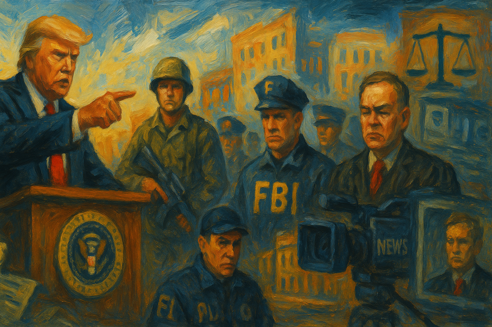

<!-- Generated by build_publish_week_v1 (appendix post) -->
<!-- Header image: image_wide_week6_appendix.png -->

# Week 6 Appendix: The Ledger Nearly Balanced

*A private advisor tested how far unelected power could reach into federal systems, while courts and resigning workers pushed back in equal measure.*

This week showed rapid, multi-front institutional erosion accompanying an unprecedented purge of military and civil service leadership, alongside a historic rupture in transatlantic alliance politics. The Pentagon leadership purge (Joint Chiefs Chairman, Navy chief, JAG lawyers) removed legal and professional checks on military power precisely as DOJ and FBI leadership were staffed with loyalists (Bongino, Patel) explicitly avoiding scrutiny of far-right extremism. Simultaneously, Musk's DOGE operation continued unchecked mass firings and data-access overreach, provoking repeated federal injunctions—yet also revealing genuine institutional resistance (mass resignations, agency defiance, judicial pushback). The Oval Office ambush of Zelensky and the US vote alongside Russia at the UN marked a dramatic pro-Kremlin tilt in foreign policy. Press freedom eroded further through AP exclusion, press-pool control, and threats of new defamation law. Courts remained an active counterweight, issuing numerous injunctions, though compliance was inconsistent (NIH funding freeze defiance).

Power and Authority

1. Trump signed executive order directing DOJ review of past criminal justice actions, creating a weaponization working group (2025-02-22): The order created a body to review past prosecutions tied to Trump, raising conflict-of-interest concerns and threatening the impartial use of federal law enforcement.

2. Trump pardoned Enrique Tarrio and roughly 1,500 other January 6 defendants (2025-02-22): Blanket pardons for insurrection participants undermine accountability for an attack on the peaceful transfer of power and may embolden further political violence.

3. Trump attempted to end birthright citizenship for children of non-permanent residents (2025-02-22) *[single source]*: The attempt to unilaterally alter a constitutional right shows executive willingness to bypass established legal process to reshape citizenship.

4. Trump administration terminated temporary protected status for Haitian immigrants and ended deportation protections for Venezuelan immigrants (2025-02-22) *[single source]*: Ending legal protections for hundreds of thousands of immigrants shifts their status abruptly, exposing them to removal and testing due process norms.

5. Trump signed executive order banning transgender athletes from women's sports and threatened funding cuts over compliance (2025-02-22): Using federal funding threats to coerce state compliance on a contested social policy raises federalism and civil-rights concerns.

6. Trump administration ordered preparation of a 30,000-bed migrant detention facility at Guantanamo Bay (2025-02-23): Using a military base for mass civilian immigration detention expands executive detention power outside the ordinary immigration system.

7. Trump designated Mexican drug cartels as terrorist organizations eligible for direct military strikes (2025-02-22): The designation opens the door to unilateral military action against organizations in a foreign sovereign country, raising war-powers and diplomatic concerns.

8. Trump ordered the Gulf of Mexico renamed the Gulf of America and directed press to comply (2025-02-22) *[single source]*: Compelling media compliance with an executive naming order and later punishing noncompliant outlets shows use of state power to control public language and press coverage.

9. Elon Musk ordered federal employees, through OPM, to report weekly accomplishments or be treated as resigned (2025-02-22): An unelected private individual issued binding employment ultimatums to the entire federal workforce, testing the limits of accountable civil-service governance.

10. Federal agencies instructed employees to ignore Musk's weekly-accomplishments email (2025-02-22): Agency heads pushed back against a private advisor's directive to their staff, revealing internal resistance to unaccountable control over the civil service.

11. Kash Patel instructed FBI staff to ignore Musk's request for weekly accomplishments (2025-02-23) *[single source]*: The FBI director's refusal to comply with a directive from an unelected advisor illustrates institutional friction over control of federal employees.

12. Elon Musk led "department of government efficiency" effort that slashed the federal government and fired thousands of workers (2025-02-23) *[single source]*: Mass firings directed by a private individual with no formal oversight role raise concerns about accountability and the rule of law governing federal employment.

13. Trump administration eliminated about 2,000 USAID positions and placed nearly all USAID personnel on paid leave (2025-02-23): Gutting USAID staffing sharply curtails the agency's capacity to deliver foreign assistance, diminishing US soft power abroad.

14. Trump administration halted NIH's ability to submit funding notices to the Federal Register in apparent violation of a court order (2025-02-23): Blocking medical research funding after a court-ordered restraining order suggests defiance of judicial checks on executive action.

15. Office of Personnel Management reversed the ultimatum requiring federal workers to justify their jobs or be treated as resigned (2025-02-25): The reversal shows institutional and legal pushback forced retreat from an improvised threat to federal employment, but only after significant disruption.

16. Trump signed memorandum suspending security clearances and directing contract review for Covington & Burling LLP employees who represented Jack Smith (2025-02-25): Punishing a law firm for lawful representation of a former special counsel signals use of executive power to retaliate against legal advocacy tied to past investigations.

17. Trump announced a plan to sell US citizenship for $5 million through a "Trump Gold Card" (2025-02-24): Proposing a cash pathway to citizenship would commodify a core democratic status, tying legal belonging to personal wealth.

18. Trump signed executive order expanding DOGE's authority over federal spending, contracts, and grants (2025-02-26): Centralizing spending oversight under an advisor's team without statutory basis concentrates budgetary control outside normal accountable channels.

19. Trump administration froze all government credit cards for 30 days, halting critical NIH research including cancer and Alzheimer's studies (2025-02-26) *[single source]*: A blunt administrative freeze disrupted ongoing federally funded medical research, showing how efficiency measures can cause direct public-health harm.

20. Elon Musk attended Trump's first Cabinet meeting despite holding no Cabinet position (2025-02-26): An unelected billionaire's prominent role at a Cabinet meeting raises questions about accountability and the boundary between private influence and formal governance.

21. OMB and OPM directed federal agencies to prepare mass layoffs and submit reorganization plans by March 13 (2025-02-26): A sweeping directive to plan large-scale reductions in force threatens the stability and institutional memory of the federal workforce.

22. Trump administration cut more than 90% of USAID foreign aid contracts and reduced roughly $60 billion in global assistance (2025-02-26): A near-total cut to foreign aid contracts sharply diminishes US capacity for international development and diplomatic engagement.

23. Trump planned executive order to make English the official language of the United States, rescinding language-assistance mandates (2025-02-28): Removing federal language-assistance requirements could reduce access to government services for non-English speakers.

24. Trump administration demanded federal agencies identify hundreds of thousands of potential layoffs by March 13 (2025-02-27) *[single source]*: A sweeping layoff-planning mandate threatens the delivery of government services and the stability of public administration.

25. White House moved to halt New York City's congestion pricing program introduced by the state's governor (2025-02-27) *[single source]*: Federal intervention to block a state transportation policy raises concerns about the balance of power between federal and state governments.

Institutions and Governance

1. Federal court granted preliminary injunction blocking Musk's DOGE team from accessing Treasury payment data (2025-02-22): A court check limited a private advisor's access to sensitive federal financial systems, protecting institutional and privacy safeguards.

2. Federal court issued nationwide injunction against Trump's executive orders targeting diversity, equity, and inclusion programs (2025-02-22) *[single source]*: The ruling found the orders likely violated constitutional protections, reinforcing judicial limits on executive anti-DEI actions.

3. Elon Musk called for the impeachment of a federal judge who blocked DEI grant terminations (2025-02-22): A call to impeach a judge over an unfavorable ruling threatens judicial independence and the separation of powers.

4. Missouri state legislature introduced a bill to create a state registry of pregnant women deemed 'at risk' of abortion (2025-02-22) *[single source]*: The proposed registry raises serious privacy concerns and represents state intrusion into reproductive decision-making.

5. Associated Press sued Trump administration officials for barring AP journalists from presidential events (2025-02-22) *[single source]*: The lawsuit tests whether the executive branch can retaliate against a news organization for editorial choices, implicating First Amendment protections.

6. Clermont city government passed a local law allowing residents to keep backyard hens amid rising egg prices (2025-02-23) *[single source]*: A local government responded to economic pressure with regulatory change affecting food security and self-sufficiency.

7. Congressional Republicans proposed deep budget cuts to healthcare and essential services to fund tax cuts for the wealthy (2025-02-23) *[single source]*: The proposal shifts fiscal burden toward vulnerable populations to finance benefits concentrated among wealthier taxpayers.

8. Federal employee unions amended lawsuit against DOGE, arguing Musk's employee ultimatum violated the Administrative Procedure Act (2025-02-23) *[single source]*: The amended suit challenges the legality of directives issued without required procedural safeguards, testing accountability limits on executive action.

9. DC police issued an arrest warrant for Rep. Cory Mills over a domestic violence incident (2025-02-23): Law enforcement action against a sitting member of Congress reflects ordinary accountability mechanisms applying to elected officials.

10. Federal judge Deborah L. Boardman issued a temporary restraining order blocking Musk's DOGE team from accessing federal employee and student data (2025-02-24): The order restrained an unaccountable private team from accessing sensitive personal data of millions of Americans, citing privacy law.

11. Judge Trevor McFadden denied the Associated Press's request to immediately restore access to presidential events (2025-02-24): The ruling let a press-access ban stand pending further litigation, delaying resolution of a First Amendment dispute over media access.

12. US Supreme Court declined to hear challenges to abortion-clinic buffer-zone ordinances (2025-02-24): By leaving buffer zones intact, the Court preserved existing protections for clinic access and protest regulation near facilities.

13. Ed Martin declared himself and DOJ colleagues to be 'President Trump's lawyers' (2025-02-24) *[single source]*: A federal prosecutor's public assertion of personal loyalty to the president undermines the constitutional independence expected of Justice Department attorneys.

14. Gerry Connolly launched an investigation into US Attorney Ed Martin for potential abuse of public office (2025-02-24): A congressional investigation into alleged misuse of prosecutorial power to silence Musk's critics tests legislative oversight of executive officials.

15. Federal employee unions and Democratic Party engaged in multiple lawsuits challenging DOGE operations, funding freezes, and mass firings (2025-02-24): Litigation over agency data sharing, worship-site immigration enforcement, and refugee admissions reflects sustained legal resistance to executive actions.

16. Elon Musk prompted mass resignation of more than 20 civil service employees from DOGE (2025-02-24) *[single source]*: Employees resigned rather than dismantle public services, showing internal resistance within government to controversial cost-cutting directives.

17. Federal department heads instructed employees to disregard Musk's directives, asserting departmental authority (2025-02-24): Institutional pushback from agency leadership reflects resistance to centralized, unaccountable control over federal personnel.

18. Trump appointed Kash Patel as FBI Director and Dan Bongino as Deputy Director (2025-02-24): Elevating a figure who has downplayed far-right extremism threats to the FBI's top ranks raises concerns about the agency's independence and priorities.

19. Federal court issued temporary restraining order preventing OPM from disclosing employee data to DOGE affiliates (2025-02-24) *[single source]*: A judicial order found the administration's data-sharing plan likely violated the Privacy Act, protecting employee information from unauthorized access.

20. American Federation of Teachers and coalition sued the Department of Education to block enforcement of new anti-DEI civil rights guidelines (2025-02-27) *[single source]*: The lawsuit challenges guidance that could restrict educational content and diversity policies, testing limits on executive reinterpretation of civil rights law.

21. Judge William Alsup temporarily blocked Trump administration mass firings of federal probationary workers (2025-02-27): A federal judge found OPM lacked authority to order the mass firings, protecting thousands of jobs pending further review.

22. Supreme Court issued an administrative stay removing a deadline for the Trump administration to release $1.5 billion in USAID payments (2025-02-27): The stay gave the administration a temporary reprieve in litigation over frozen foreign aid funding, delaying resolution of a major funding dispute.

23. Democratic Party sued the Trump administration over asserted control of the Federal Election Commission (2025-02-28) *[single source]*: The lawsuit argues executive control over an independent election agency violates federal election law and threatens agency independence.

24. SEC halted its fraud prosecution of crypto entrepreneur Justin Sun following his $75 million investment in a Trump-linked venture (2025-02-28): Pausing enforcement action against a politically connected donor raises questions about regulatory independence and equal application of the law.

25. Republicans filed a new legal argument aimed at dismantling Section 2 of the Voting Rights Act (2025-02-28) *[single source]*: The challenge threatens a core legal protection against racial discrimination in voting and could reshape minority representation nationwide.

26. House of Representatives narrowly passed a budget resolution including $4.5 trillion in tax cuts and about $1 trillion in Medicaid cuts (2025-02-25): The resolution advances large tax cuts alongside deep cuts to health coverage for low-income Americans, shifting fiscal priorities toward the wealthy.

27. Senate voted 52-48 to advance a budget resolution with $175 billion in new border-security funding and required spending cuts (2025-02-25) *[single source]*: The party-line vote advances a budget framework tying immigration enforcement funding to broader spending reductions.

28. Federal judge extended protections blocking transfer of transgender women in federal prison to men's facilities (2025-02-25): The ruling protects the safety of incarcerated transgender women against an executive order that would have exposed them to higher risk.

29. US Supreme Court heard oral arguments in a workplace 'reverse discrimination' case that could reshape discrimination-claim standards (2025-02-25) *[single source]*: The case could lower the burden of proof for majority-group discrimination claims, with broad implications for workplace diversity programs.

30. US Supreme Court ordered a new trial for death row inmate Richard Glossip, citing prosecutorial nondisclosure (2025-02-25): The ruling corrects a wrongful conviction procedure, reinforcing due-process protections in a capital case.

31. Federal court issued preliminary injunction blocking a freeze on federal loans and grants as irrational (2025-02-25): The court found the administration's funding freeze arbitrary, protecting continued disbursement of federal financial support.

32. Federal court blocked President Trump's executive order suspending the refugee admissions system (2025-02-25): The injunction preserved the legal refugee admissions process against a broad executive suspension.

33. Federal judge ordered the Trump administration to pay billions of dollars in unpaid US foreign aid (2025-02-25): The order enforces compliance with prior funding obligations that the administration had withheld despite earlier court directives.

34. White House announced it would take control of deciding which journalists and outlets can access the presidential press pool (2025-02-25): Removing the independent press association's traditional role concentrates control over media access to the president in executive hands.

35. Kathy Hochul ordered CUNY to remove a Palestinian studies faculty job posting (2025-02-26) *[single source]*: A governor's directive to remove an academic job listing raises academic freedom concerns and reflects government intervention in university hiring.

36. Gavin Newsom ordered the state parole board to assess public risk before deciding on the Menendez brothers' release (2025-02-26): A gubernatorial directive shapes the process for a high-profile parole decision, illustrating ordinary exercise of executive clemency oversight.

37. Trump administration initiated budget cuts and political oversight targeting NOAA's climate research operations (2025-02-26) *[single source]*: Proposed cuts of roughly a third of NOAA's budget threaten the agency's capacity to conduct climate and weather research vital to public safety.

38. Greenpeace filed a petition to change trial venue in a defamation case brought by Energy Transfer Partners (2025-02-26) *[single source]*: The petition raises concerns about juror bias tied to fossil-fuel industry ties, testing fairness in a high-profile environmental litigation case.

39. Pam Bondi released a first phase of declassified Epstein files and demanded the FBI turn over remaining documents (2025-02-27): The partial release of investigative files touches on public access to information about a major criminal case and questions about prior disclosure practices.

40. Department of Justice dismissed four Biden-era civil rights lawsuits against police and fire departments over hiring practices (2025-02-26): Dropping enforcement actions removes federal oversight of hiring practices alleged to have discriminatory effects, narrowing available civil rights remedies.

41. Department of Justice announced custody of 29 defendants extradited from Mexico on cartel and drug-trafficking charges (2025-02-27): The extraditions reflect ordinary cross-border law enforcement cooperation targeting organized crime, following a new cartel terrorism designation.

42. Federal Task Force to Combat Antisemitism announced visits to 10 college campuses over alleged antisemitic incidents (2025-02-27): A federal task force's campus visits signal an enforcement posture toward universities accused of failing to protect a protected class.

43. House Republican leaders advised members to stop holding town hall meetings amid constituent backlash (2025-02-28): Discouraging direct constituent engagement reduces democratic accountability and public input into representatives' decisions.

44. Federal courts issued multiple rulings on transgender military policy, funding freezes, and agency actions during the week (2025-02-26): Ongoing litigation produced mixed rulings extending, denying, or granting relief across several challenges to administration policy.

45. Federal courts issued further rulings during the week's final days on discovery, injunctions, and dismissals in administration-related litigation (2025-02-28): Continued docket activity across multiple cases shows courts actively adjudicating challenges to executive actions on immigration, funding, and personnel.

46. Department of Education sent employees a misleading buyout offer, described by staff as deceptive (2025-02-28): A confusing severance offer to federal employees raises concerns about fair treatment and transparency in workforce reduction efforts.

Economic Structure

1. Pentagon announced layoffs of 5,400 civilian workers as part of a broader 5-8% workforce reduction (2025-02-22): Sweeping defense-department layoffs shrink public-sector capacity and reflect broader efforts to reduce federal employment.

2. Trump announced sweeping cuts to the federal workforce at CPAC (2025-02-22): Broad workforce reduction announcements signal an ongoing push to shrink government capacity to deliver public services.

3. Trump proposed taxpayer rebates funded by claimed DOGE savings (2025-02-22): The rebate proposal, questioned by economists as infeasible, illustrates use of unverified savings claims to shape public economic expectations.

4. Ron DeSantis sued Target over Pride-month merchandise, alleging misled investors (2025-02-22) *[single source]*: A state government official's lawsuit against a private company over social messaging reflects ongoing conflicts between political ideology and corporate practice.

5. DOGE sought access to sensitive IRS taxpayer information systems (2025-02-22): Attempts by a private advisory team to access IRS systems raise serious concerns about taxpayer privacy and misuse of financial data.

6. FDA rehired workers previously terminated by Musk's cost-cutting effort (2025-02-22) *[single source]*: The rehiring reflects partial reversal of earlier mass firings, restoring some agency capacity in medical device oversight.

7. US fossil fuel industry groups coordinated lobbying and legal campaigns against local and state bans on gas hookups in new buildings (2025-02-24) *[single source]*: Industry-funded campaigns to override local climate policy illustrate the influence of concentrated economic interests over democratic policymaking.

8. NIH reimposed a DEI-related funding freeze despite a federal court's restraining order (2025-02-24) *[single source]*: Continuing a research funding freeze after a court order highlights direct defiance of judicial checks affecting scientific funding.

9. Coinbase made large political contributions and hired Trump-aligned staff amid favorable regulatory treatment (2025-02-25) *[single source]*: Substantial political spending alongside regulatory benefits illustrates concerns about pay-to-play influence over financial regulation.

10. FAA signed a contract to use SpaceX's Starlink internet system (2025-02-25): A federal contract benefiting a company owned by an influential advisor raises potential conflict-of-interest concerns in government procurement.

11. DoorDash agreed to pay $16.75 million to settle allegations it misappropriated delivery-worker tips (2025-02-27) *[single source]*: The settlement addresses deceptive gig-economy pay practices, restoring compensation to affected workers.

12. Jared Kushner advanced plans for Gaza redevelopment involving removal of Palestinians and foreign investment ties (2025-02-27): Kushner's involvement in a redevelopment plan tied to his private financial dealings raises conflict-of-interest and human rights concerns.

13. Trump confirmed tariffs on Mexico, Canada, and additional tariffs on China set to begin March 4 (2025-02-26): New tariffs threaten to disrupt international trade relations and raise costs, with broad economic implications for consumers and businesses.

14. Paramount announced rollback of diversity, equity, and inclusion policies amid a pending merger (2025-02-26) *[single source]*: A major media company's policy reversal reflects corporate accommodation to political pressure from the administration.

15. Trump administration announced major restructuring at the Social Security Administration, threatening large staffing cuts (2025-02-28): Potential cuts to half the agency's workforce risk undermining administration of benefits relied upon by millions of Americans.

16. Trump announced plans to cut 65% of the Environmental Protection Agency's budget (2025-02-28): A proposed drastic cut to EPA funding threatens the agency's ability to enforce environmental and public health protections.

17. SEC halted fraud prosecution of Justin Sun following his investment in a Trump-linked crypto venture (2025-02-28) *[single source]*: Pausing enforcement against a politically connected donor's alleged securities fraud raises concerns about regulatory favoritism.

Civil Rights and Dissent

1. Tom Homan criticized Boston police for lack of cooperation with ICE, threatening to bring "hell" to the city (2025-02-22) *[single source]*: Federal pressure on local police over immigration enforcement cooperation strains local autonomy and community trust.

2. DOJ accused Rep. Robert Garcia of threatening Elon Musk after critical public remarks (2025-02-22) *[single source]*: Using federal law enforcement to respond to a lawmaker's political speech raises concerns about suppression of dissent.

3. Trump administration briefly cut off legal aid for unaccompanied immigrant children before reversing the decision (2025-02-22) *[single source]*: Temporarily denying legal representation to vulnerable migrant children threatened their due process rights before public pressure forced reversal.

4. Trump falsely claimed at CPAC to have received "much more" than 77 million votes and accused Democrats of cheating (2025-02-22): Repeating baseless election-fraud claims erodes public confidence in electoral integrity and democratic institutions.

5. Janet Mills publicly defied Trump's executive order banning transgender athletes from girls' sports (2025-02-22): A governor's public refusal to comply with a federal directive highlights ongoing federal-state conflict over transgender rights.

6. Yosemite staff hung an upside-down flag on El Capitan to protest mass firings (2025-02-22) *[single source]*: A visible act of protest by park employees drew attention to the impact of federal layoffs on public lands and conservation work.

7. Dept of Education launched a Title IX investigation into Maine over its transgender athlete policy (2025-02-22) *[single source]*: A federal civil rights investigation targeting a state's compliance choices tests the boundary between federal enforcement and state autonomy.

8. Unknown perpetrator sent a bomb threat to an anti-Trump conservative conference, disrupting the event (2025-02-23): A threat of violence against a political gathering illustrates ongoing intimidation tactics tied to political discourse in the aftermath of January 6.

9. Trump administration directed ICE to deport hundreds of thousands of unaccompanied migrant children (2025-02-23): A directive to deport unaccompanied minors raises serious human rights and due process concerns for vulnerable children.

10. Protesters organized demonstrations at Tesla dealerships nationwide, including in Raleigh (2025-02-23) *[single source]*: Grassroots protests against Musk's role in government reflect civic mobilization against perceived overreach.

11. ICE detained and deported a 19-year-old Venezuelan asylum seeker despite agents reportedly knowing he was not the intended target (2025-02-24) *[single source]*: Deporting an individual to a foreign prison despite acknowledged misidentification exemplifies due-process failures in mass removal operations.

12. ICE arrested asylum seeker Gabar Choli at a mandatory check-in despite prior judicial protection from deportation (2025-02-25) *[single source]*: Arresting a protected asylum seeker and pressuring him to sign a deportation order disregards existing judicial protections.

13. Trump administration mandated USCIS registration and fingerprinting for undocumented immigrants aged 14 and older (2025-02-25) *[single source]*: The registration mandate expands state surveillance over a vulnerable population, with criminal penalties for noncompliance.

14. Trump administration issued memo ordering the Pentagon to identify and discharge transgender service members (2025-02-27) *[single source]*: The directive to remove transgender troops from the military represents a significant rollback of rights and job security for a protected group.

15. Trump administration removed the online application form for several student debt repayment plans (2025-02-27): Quietly removing debt-relief application access left millions of borrowers unable to pursue income-driven repayment options.

16. Chris Kluwe was arrested at a city council meeting after speaking against a political movement he likened to Nazism (2025-02-26): An arrest following political speech at a public meeting raises free-speech and protest-rights concerns at the local level.

17. People's Union USA organized a 24-hour nationwide economic boycott protesting corporate rollbacks of DEI policies (2025-02-28) *[single source]*: A coordinated consumer boycott illustrates grassroots resistance to corporate and government retreat from diversity commitments.

18. Rebecca Burke was detained by ICE for 19 days after being classified as an illegal alien for performing household chores in a homestay arrangement (2025-02-26) *[single source]*: The detention of a foreign tourist attempting to leave the country voluntarily illustrates aggressive immigration enforcement lacking proportionality.

19. New Orleans Police Department declined a free inspection offer for a malfunctioning security barrier prior to a deadly attack (2025-02-26): Failure to maintain critical security infrastructure raises questions about public safety negligence following a fatal attack.

20. California Department of Fish and Wildlife secured convictions in a wildlife trafficking case (2025-02-27): The prosecution demonstrates ordinary enforcement of environmental protection laws against illegal wildlife trade.

Information, Memory and Manipulation

1. Trump administration shut down the national police misconduct database created under a Biden executive order (2025-02-22): Eliminating a national tracking tool for police misconduct removes a transparency mechanism intended to prevent officer accountability evasion.

2. Trump administration barred Associated Press journalists from White House events over refusal to use "Gulf of America" (2025-02-22): Excluding a major news organization for editorial language choices undermines press freedom and government transparency.

3. Trump called MSNBC a "threat to democracy" at CPAC (2025-02-22): Labeling a critical media outlet a threat to democracy exemplifies rhetorical attacks that can undermine press freedom.

4. CIA conducted a formal review of potential damage from an unclassified email exposing intelligence officers (2025-02-23) *[single source]*: The review addresses risks to national security posed by improper handling of sensitive personnel information.

5. White House posted a video depicting shackled migrants captioned as an "ASMR" deportation flight (2025-02-23): Using official channels to depict deportation as entertainment trivializes human suffering and normalizes cruelty in public messaging.

6. White House published a release framing Sunday show appearances as evidence of the "most transparent administration in history" (2025-02-23): Official channels were used to curate and amplify favorable media appearances as evidence of transparency, shaping public narrative.

7. Trump attacked journalist Joy Reid on social media, calling her "mentally obnoxious" and untalented (2025-02-23) *[single source]*: Personal attacks on journalists following the cancellation of a critical news program can intimidate media professionals and chill coverage.

8. White House published a fact sheet citing a poll claiming massive public support for administration policies (2025-02-24): Selective use of polling data to legitimize policy without independent verification exemplifies official messaging shaping public perception.

9. Elon Musk baselessly accused USAID of supporting terrorism through funding of aid organizations (2025-02-24) *[single source]*: Unsubstantiated accusations against a federal agency can undermine its credibility and justify further disruption to its operations.

10. White House published a release attacking sanctuary city policies and naming Democratic officials over immigration enforcement (2025-02-25): Official messaging framed political opponents as enabling violent crime, using inflammatory language to shape public discourse on immigration.

11. Musk used his social media platform to repeatedly urge impeachment of judges issuing unfavorable rulings (2025-02-25): A billionaire with massive platform reach used social media to pressure judicial independence, threatening rule-of-law norms.

12. Doge quietly deleted several claimed cost-savings figures from its public tracking website after they were debunked (2025-02-25): Removing erroneous savings claims without explanation undermines transparency about government cost-cutting efforts.

13. White House published a release attacking filmmaker Michael Moore and framing immigrants as criminals (2025-02-26): Official channels amplified dehumanizing language conflating undocumented immigration with violent crime, shaping public discourse.

14. Jeff Bezos dictated a shift in the Washington Post's opinion section focus, prompting the editor's resignation (2025-02-26): An owner's direct intervention in editorial direction raises concerns about media independence at a major national newspaper.

15. Trump posted an AI-generated video depicting a fictional luxury "Trump Gaza" resort (2025-02-25): Use of AI-generated propaganda imagery to promote a controversial redevelopment plan raises concerns about distortion of reality in political messaging.

16. Trump threatened new defamation legislation targeting anonymous sources and book publishers (2025-02-26) *[single source]*: Threatening legal action against journalistic practices could chill investigative reporting and intimidate the press.

17. House Judiciary Committee posted a misleading social media link claiming to lead to Epstein files (2025-02-27) *[single source]*: Misuse of an official government communication channel for a misleading link undermines public trust in institutional transparency.

18. White House removed a TASS reporter from an Oval Office meeting while Associated Press and Reuters were excluded (2025-02-27) *[single source]*: Selective press access favoring a foreign state outlet while excluding major domestic wire services raises transparency and fairness concerns.

19. White House published a release framing Ukraine policy using selective casualty and polling data (2025-02-28): Selective presentation of data to justify a controversial foreign policy shift shapes public understanding of U.S. alliance commitments.

20. Voice of America placed veteran journalist Steven Herman on extended absence pending investigation into his social media posts (2025-02-28) *[single source]*: Sidelining a journalist over critical social media commentary raises press-freedom concerns within a government-funded outlet.

21. White House published a release promoting aluminum tariffs as essential to national security (2025-02-28): Framing trade policy in national-security terms shapes public understanding of unilateral executive action on tariffs.

22. White House published fact sheets on Apple investment claims and border-crossing statistics tied to tariff and enforcement policy (2025-02-24): Official messaging linked private investment announcements and enforcement statistics to administration achievements without independent verification.

