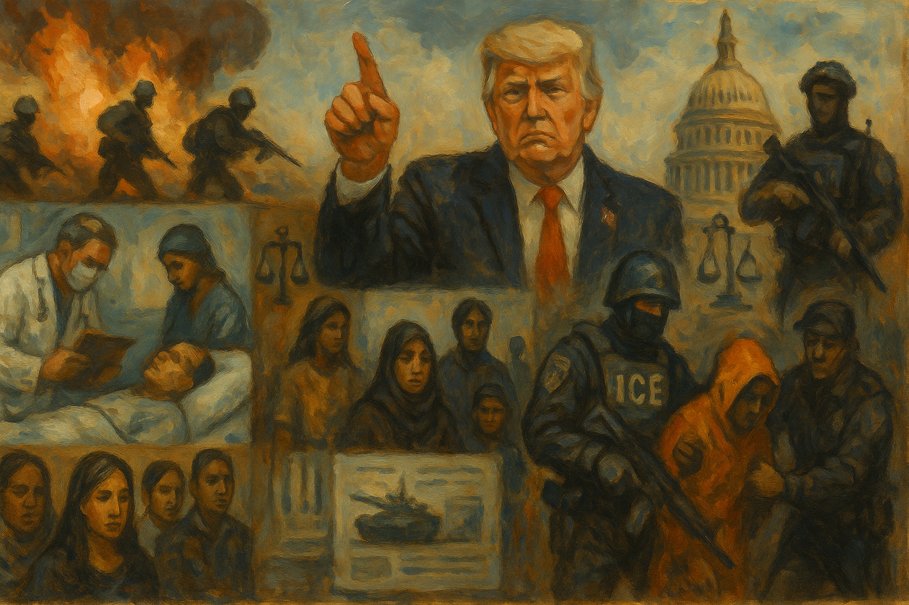

<!-- Generated by build_publish_week_v1 (appendix post) -->
<!-- Header image: image_wide_week60_appendix.png -->

# Week 60 Appendix: War Without a Vote, Clock Nearly Still

*Unauthorized war, coerced legislation, and denied civilian deaths met courts and one senator's refusal, leaving the week's net movement almost frozen.*

This week is dominated by an unauthorized presidential war against Iran that escalated into a regional crisis with global economic consequences, alongside a parallel domestic campaign to coerce Congress into passing sweeping voter-suppression legislation. Trump initiated major combat operations without congressional authorization, then made contradictory public statements about war objectives and casualty tolls while the Pentagon quietly revised casualty figures upward and disclosed billions in unplanned costs. Simultaneously, Trump threatened to block all legislation unless Congress passed the SAVE America Act, using executive leverage against legislative independence. Courts provided a partial counterweight, voiding unlawful appointments (Kari Lake, New Jersey US attorneys) and striking down tariffs, while ICE oversight offices were gutted even as human rights abuse reports mounted. Billionaire campaign spending on California's governor race and anti-tax measures illustrated concentrated wealth's grip on policy. A wave of domestic violence—synagogue attack, university shooting, Gracie Mansion bombing attempt—unfolded against a backdrop of administration rhetoric normalizing war as entertainment and dismissing accountability for civilian casualties.

Power and Authority

1. President Trump launched a military campaign against Iran without congressional authorization (2026-03-07): Unilateral initiation of major military conflict without congressional approval marked a sharp departure from precedent and raised separation-of-powers concerns.

2. Trump gave shifting definitions of unconditional surrender for Iran (2026-03-07): The president's vague, subjective war-ending criteria showed the absence of defined military objectives or accountability for the conflict's scope.

3. Trump demanded unconditional surrender from Iran and later reversed course on the war's status (2026-03-07): The president made escalatory public demands then repeatedly contradicted himself about whether the war was ending, undermining coherent civilian control of military policy.

4. Trump characterized soldier deaths and economic harm as acceptable costs of war (2026-03-08): Dismissing casualties and economic pain from unauthorized military action reflects a casual approach to the human and financial costs of executive war-making.

5. Trump wore campaign merchandise at a dignified transfer ceremony for fallen soldiers (2026-03-08): Wearing campaign gear at a solemn military ceremony blurred the line between official duty and political promotion, drawing criticism for disrespecting fallen troops.

6. Trump threatened to veto all legislation unless Congress passed the SAVE America Act (2026-03-08): The president used his signing power as leverage to coerce Congress into passing legislation that restricts voting access, testing the separation of powers.

7. Trump acknowledged expected American casualties and threatened Iran with total destruction (2026-03-09): Public threats of disproportionate retaliation against a foreign nation, absent a defined endgame, reflected unchecked escalatory rhetoric in an undeclared war.

8. Trump declined to rule out a military draft and ordered additional troops to the Middle East (2026-03-08): The White House's refusal to rule out conscription during active escalation signaled a possible expansion of executive war powers over the volunteer force.

9. Trump made contradictory public statements about the war's status while pressuring the Senate on voting legislation (2026-03-09): The president's shifting war narratives alongside a parallel demand to override Senate rules for restrictive voting legislation showed simultaneous erosion of institutional checks.

10. Trump convened a regional military coalition summit and discussed regime change in Cuba (2026-03-07): The president's discussion of military coercion against additional sovereign nations at a summit held at his private resort signaled expanding unilateral war ambitions.

11. Trump signed a proclamation and executive order creating new sanctions authority over foreign states (2026-03-09): New unilateral power to designate and sanction foreign governments over detention practices expanded executive control of foreign policy without congressional input.

12. Trump signed an executive order adjusting Defense Production Act delegations to the Secretary of Energy (2026-03-13): Redistributing emergency economic powers across agencies expanded the machinery available for unilateral executive control of national resources.

13. Trump posted inflammatory rhetoric claiming personal responsibility for killing Iranian forces (2026-03-13): The president's personalized, dehumanizing language about war casualties reflected an unchecked, entertainment-like approach to lethal military action.

14. Trump downplayed rising gas prices caused by the Iran war as beneficial to the United States (2026-03-13): Dismissing consumer economic harm from a war he initiated shows disregard for the domestic costs of unchecked executive military action.

Institutions and Governance

1. Judge Royce C. Lamberth ruled that Kari Lake unlawfully served as acting CEO of Voice of America's parent agency and voided her actions (2026-03-08): A federal court invalidated an unconfirmed official's mass layoffs and restructuring of a public media agency, reasserting Appointments Clause and Vacancies Act limits on executive personnel power.

2. Democratic senators filed War Powers Act resolutions demanding congressional authorization for the Iran conflict (2026-03-07): Senators used a core congressional check on military authority to force debate over undeclared hostilities, though Republican leaders largely sidelined the effort.

3. Judge Emily Richardson approved an Alford plea for Cop City protester John Mazurek and imposed a decade-long ban on protest participation (2026-03-07): The plea resolved a lengthy prosecution but imposed probation terms restricting political expression and association for ten years, raising First Amendment concerns.

4. Judge Lamberth granted partial summary judgment finding Kari Lake's appointment violated the Vacancies Act (2026-03-07): A federal ruling voided actions taken under an unlawful appointment, reinforcing statutory limits on acting-official authority at a federal media agency.

5. Democratic senators and Trump clashed over Senate filibuster rules and passage of the Save America Act (2026-03-08): Presidential pressure to eliminate filibuster protections for a voting-restriction bill met resistance from Senate leadership, testing institutional guardrails on legislative process.

6. Environmental groups and states sued the EPA over repeal of the greenhouse gas endangerment finding (2026-03-08): Multiple lawsuits challenged EPA's rollback of a foundational climate authority, testing judicial checks on agency deregulation.

7. Judge Matthew Brann ruled that three New Jersey prosecutors appointed by Pam Bondi were installed illegally without Senate confirmation (2026-03-10): A second court ruling this period found the administration circumvented Senate confirmation requirements for principal prosecutorial officers.

8. Utah legislature and Governor Spencer Cox expanded the state supreme court and restricted signature withdrawals from an anti-gerrymandering repeal petition (2026-03-08): Court-packing legislation and last-minute rule changes aimed at blunting a voter-approved redistricting law reflect attacks on judicial independence and electoral processes.

9. Federal three-judge panel rejected a Republican effort to block Utah's court-ordered congressional map (2026-03-10): A judicial panel preserved a voter-approved anti-gerrymandering map against a partisan effort to reinstate a prior district plan.

10. Senate Armed Services Committee members criticized the administration's lack of transparency in classified Iran war briefings (2026-03-10): Senators from both parties expressed frustration at withheld information on war costs, troop risks, and strategy, exercising oversight over unauthorized military action.

11. US Supreme Court struck down Trump's tariffs, opening the door to $175 billion in refunds (2026-03-09): A major judicial check invalidated executive tariff policy, though practical hurdles limited immediate business relief.

12. Ohio legislature proposed bills mandating local police cooperation with ICE and statewide childcare surveillance (2026-03-09): State legislation compelling immigration enforcement cooperation and mandating surveillance following ethnically targeted rumors undermines local self-governance and privacy norms.

13. House of Representatives and Senate advanced the Save America Act despite lacking a filibuster-proof Senate majority (2026-03-12): The House passed sweeping voting restrictions while Senate leadership scheduled a vote expected to fail, using the legislative process to advance a contested election narrative.

14. Federal judge Mustafa Kasubhai ruled that ICE's warrantless arrests in Oregon were unconstitutional and quota-driven (2026-03-13): A court found ICE conducted racially targeted, warrantless detentions to meet enforcement quotas, establishing a Fourth Amendment check on immigration enforcement.

15. Judge James Boasberg quashed a grand jury subpoena targeting Federal Reserve Chair Jerome Powell (2026-03-13): A federal judge found the subpoena's dominant purpose was to pressure or remove an independent official who displeased the president, protecting institutional independence.

16. Ohio State University board of trustees accepted the resignation of university president Walter Carter Jr. over an inappropriate relationship (2026-03-09): The resignation of a public university president amid governance concerns highlights institutional accountability questions at a major research institution.

17. Federal grand jury and Trump subpoenaed Arizona legislature records related to the 2020 election review (2026-03-10): Federal investigative power was deployed to revisit a settled 2020 election outcome, raising concerns about weaponized law enforcement against election integrity.

18. Senator Kevin Kiley left the Republican Party to become an Independent (2026-03-09): A House Republican's departure from the party further narrowed the GOP's already thin majority, illustrating fragility in the president's legislative support.

19. House Speaker Mike Johnson declined to condemn Republican lawmakers' anti-Muslim comments (2026-03-11): The Speaker's refusal to discipline members for explicit anti-Muslim rhetoric signals institutional tolerance for religious discrimination within Congress.

20. Ed Martin faced a DC Bar ethics complaint for coercing Georgetown Law over DEI policies (2026-03-10): A federal official allegedly weaponized his hiring authority to pressure a private law school into abandoning protected educational content, prompting a bar ethics complaint.

21. FCC and Chairman Brendan Carr threatened to revoke broadcast licenses over Iran war coverage (2026-03-13): A federal regulator threatened broadcasters' licenses based on disapproval of war reporting, a direct governmental mechanism for press censorship.

22. Trump removed Ric Grenell as Kennedy Center head and replaced him with Matt Floca (2026-03-13): A personnel change at a major cultural institution followed public controversy over politicization of the Kennedy Center's leadership and branding.

23. Trump signed executive orders on housing deregulation and 'Made in America' advertising enforcement (2026-03-13): New executive orders directed agencies to weaken environmental permitting rules for housing and expanded FTC enforcement authority over commercial claims.

24. Various federal courts issued rulings and orders in ongoing litigation challenging administration immigration, funding, and agency actions (2026-03-08): Dozens of federal court rulings this period tested administration actions on immigration enforcement, funding freezes, and agency authority, reflecting active judicial checks across many fronts.

Economic Structure

1. Trump administration implemented tariff policies contributing to reported job losses (2026-03-07): Widely reported job losses tied to tariff policy signaled economic contraction affecting employment during an already turbulent period.

2. Trump administration bypassed Congress to expedite a $650 million bomb sale to Israel (2026-03-08): Use of emergency authority to skip congressional review of a major arms sale weakened legislative oversight of military exports.

3. Global oil markets and Iran drove oil prices to their highest level since 2022 amid the war (2026-03-09): Military conflict disrupted global energy markets, spiking prices and threatening broader economic stability tied to the Strait of Hormuz closure.

4. Pentagon reported escalating war costs reaching over $11 billion in the first six days (2026-03-12): Rapidly disclosed and revised war-cost figures raised concerns about fiscal oversight and sustainability of the unauthorized military campaign.

5. Trump administration eased sanctions on Russian oil during the Iran conflict (2026-03-08): Sanctions relief benefiting an adversary at war with a US ally revealed contradictions in stated foreign policy priorities amid the Iran crisis.

6. California gas market and Trump administration saw gas prices exceed $5 per gallon amid the Iran conflict (2026-03-09): Rapid fuel price increases directly harmed consumers as a byproduct of unplanned military escalation abroad.

7. Senate Democrats introduced legislation to exempt small businesses from Trump's new tariffs (2026-03-10): A Democratic bill sought to shield small businesses from tariff-driven cost increases, though it faced steep odds in the Republican Senate.

8. Consumers and companies filed lawsuits over corporate retention of tariff surcharges after Supreme Court's ruling (2026-03-11): Consumer litigation sought to recover tariff costs passed on by retailers, testing corporate accountability following the Supreme Court's invalidation of the tariffs.

9. Republican Congress proposed a farm bill with pesticide industry liability shields and EPA veto provisions (2026-03-12): The bill would grant USDA veto power over EPA health protections and shield pesticide makers from lawsuits, weakening regulatory and legal accountability for industry.

10. Pentagon reported rapid depletion of munitions stockpiles from the Iran war (2026-03-13): Rapid consumption of advanced munitions strained defense budgets and readiness, underscoring the unplanned scale of military expenditure.

11. Commerce Department reported slower economic growth and rising inflation (2026-03-13): Weakening GDP growth combined with rising inflation reflected broader economic strain linked partly to the war's disruption of energy markets.

12. FDA acknowledged failing to perform safety reviews on over 100 food ingredients under the GRAS loophole (2026-03-07): A regulatory gap allowed companies to self-certify ingredient safety without FDA review, exposing consumers to unvetted health risks.

13. EPA repealed the endangerment finding underpinning federal greenhouse gas regulation (2026-03-08): Removing a foundational climate authority while defending federal preemption elsewhere created legal contradictions exploited by state litigants.

14. ICE targeted immigrant truck drivers with English proficiency enforcement and school closures (2026-03-10): Enforcement actions removed thousands of truck drivers from roads, disrupting freight operations and harming an immigrant-dependent economic sector.

15. Middle East oil producers halted refinery and gas production amid regional conflict escalation (2026-03-12): Cascading shutdowns of allied nations' energy infrastructure amplified global economic disruption stemming from the U.S.-Iran conflict.

Civil Rights and Dissent

1. Fulton County authorities imposed pretrial detention, house arrest, and covert surveillance on protester John Mazurek without conviction (2026-03-07): Years of pretrial detention and hidden surveillance used against a protester before any conviction raise due process and Fourth Amendment concerns.

2. Trump administration ended Temporary Protected Status for Somali nationals amid a humanitarian crisis in Somalia (2026-03-09): Terminating protections for a long-settled population facing famine and terrorism risk contradicts stated security rationale and endangers vulnerable people.

3. ICE launched 'Operation Buckeye' targeting Somali Americans in Ohio following inflammatory rhetoric (2026-03-09): Coordinated federal enforcement and intimidation targeting a specific ethnic community chilled economic and civic participation.

4. 50501 Movement investigation documented at least 15 deaths in ICE custody and drastic cuts to DHS oversight offices (2026-03-09): Rising detention deaths coincided with near-elimination of internal watchdog offices meant to investigate abuse, undermining accountability for vulnerable detainees.

5. ICE detained a Spanish-language journalist critical of the agency without displaying a warrant (2026-03-08): Detention of a journalist covering immigration enforcement without shown legal authority raises press freedom and due process concerns.

6. DOJ pressured federal prosecutors to prioritize immigration-related assault charges over corruption cases (2026-03-07): Redirecting prosecutorial resources toward politically charged immigration cases, with no convictions secured, suggests weaponized law enforcement priorities.

7. Two teenagers threw improvised explosive devices at an anti-Islam protest outside the NYC mayor's residence (2026-03-08): Political violence targeting a mayor's residence during dueling protests reflects escalating extremism and threats to democratic officials' safety.

8. ICE released two teenage mariachi musicians from detention after bipartisan backlash (2026-03-10): Public pressure secured release of asylum-seeking teens detained despite lawful status, illustrating both enforcement overreach and responsiveness to accountability.

9. Trump and House Republicans advanced the Save America Act with sweeping voter ID and citizenship documentation requirements (2026-03-13): The bill's proof-of-citizenship and ID mandates could disenfranchise tens of millions of eligible voters, particularly women whose names differ from birth records.

10. Americans nationwide organized tax resistance campaigns protesting war and immigration policies (2026-03-11): A surge in coordinated tax non-payment reflects mass civil disobedience against government war spending and enforcement priorities.

11. No Kings Coalition announced a March 28 nationwide day of action with over 3,000 planned events (2026-03-11): A large coordinated protest mobilization, including ACLU-led rights trainings, represents significant civil society organizing against administration policies.

12. Senator Tim Sheehy physically confronted and injured a protester at a Senate hearing (2026-03-12): A sitting senator's physical altercation with a constituent exercising protest rights, resulting in injury, raises accountability questions about treatment of dissent.

13. Ayman Mohamad Ghazali drove a vehicle into a Michigan synagogue and was killed by security (2026-03-12): A targeted attack on a synagogue and its school endangered children and reflected escalating political violence tied to Middle East conflict.

14. Mohamed Jalloh opened fire on ROTC students at Old Dominion University, killing one (2026-03-13): A terrorism-motivated shooting on a university campus raises questions about threat assessment and prior release decisions for extremist offenders.

15. Utah Republican legislature passed a rule blocking voters from withdrawing signatures from an anti-gerrymandering repeal petition (2026-03-08): A rushed rule change prevented voters who said they were misled from withdrawing petition signatures, undermining direct democratic participation.

Information, Memory and Manipulation

1. Trump dismissed a question about Russian support for Iran and posted false claims that Iran had surrendered (2026-03-07): Avoiding accountability questions and spreading false claims about an active conflict undermined public understanding of the war's true status.

2. HHS cancelled the first public meeting of the Interagency Autism Coordinating Committee indefinitely (2026-03-07): An unexplained cancellation of a federal advisory committee meeting undermined transparency over nearly $2 billion in autism research spending.

3. Trump falsely denied U.S. responsibility for a strike on an Iranian girls' school (2026-03-08): The president denied U.S. involvement in a strike that killed roughly 175 people, mostly children, contradicting subsequent military investigation findings.

4. White House wore campaign merchandise at a military ceremony and blocked coverage while distributing war propaganda videos (2026-03-08): Coordinated media management, including blocked footage and gamified war videos, blurred lines between entertainment and accountability for military casualties.

5. White House blocked an intelligence bulletin warning of domestic threats tied to the Iran war (2026-03-08): Suppressing a joint FBI-DHS threat warning prioritized political messaging over public safety information during an active security crisis.

6. Kari Lake announced a Voice of America partnership with pro-Trump outlet One America News (2026-03-09): Merging an independent government broadcaster with a partisan outlet threatened the institution's foundational mission of fact-based reporting.

7. White House posted QAnon-aligned messaging and gamified military strikes on social media (2026-03-09): Official government channels used conspiracy-linked language and entertainment framing for military operations, normalizing fringe narratives.

8. New York Times published an investigation on billionaire influence over federal election contributions (2026-03-09): The report documented 300 billionaire families supplying 19% of federal election contributions, skewed heavily toward one party.

9. Karoline Leavitt defended Trump's false Tomahawk missile claim as protected opinion and attacked press coverage (2026-03-10): A senior spokesperson reframed a demonstrable falsehood as opinion while attacking press scrutiny of a mass-casualty strike.

10. Energy Secretary Chris Wright falsely claimed the Navy had escorted a tanker through the Strait of Hormuz, then deleted the post (2026-03-10): A cabinet official's false claim about military operations, later retracted, spread inaccurate information before correction.

11. Fox host Lawrence Jones accused Democrats of aiding Iran through political messaging (2026-03-09): Conflating policy criticism with foreign enemy support on a national platform delegitimized domestic political opposition.

12. Pentagon revised upward its estimate of wounded U.S. troops from fewer than a dozen to about 140 (2026-03-10): Delayed and inaccurate casualty disclosure undermined congressional oversight and public understanding of the war's human costs.

13. Trump claimed ignorance of a military investigation confirming U.S. responsibility for the school strike (2026-03-11): The president's claimed lack of awareness of his own military's findings suggested evasion of accountability for civilian casualties.

14. Pentagon banned press photographers from Iran war briefings after unflattering photos of Hegseth appeared (2026-03-11): Excluding photographers to control public image restricted independent visual documentation of military briefings and war conduct.

15. White House dismissed critical reporting on Strait of Hormuz planning failures as 'fake news' (2026-03-12): Officials denied factual reporting about military planning failures, contradicting a senator's own account from a classified briefing.

16. Pete Hegseth attacked media outlets and called for a network takeover while refusing to confirm the school strike (2026-03-13): A cabinet secretary publicly pressured for changes in a news network's ownership while stonewalling questions about civilian casualties.

17. FCC Chairman Brendan Carr threatened broadcast license revocations over Iran war coverage deemed 'fake news' (2026-03-13): A federal regulator's threat to revoke licenses based on disapproved war coverage represents a direct government tool for press suppression.

18. Harvard-led researchers published a study warning Trump policies will increase lung disease and premature death (2026-03-13): Public health experts documented that healthcare cuts, environmental rollbacks, and reduced vaccine uptake will materially worsen mortality outcomes.

19. Trump claimed Iran possesses Tomahawk missiles despite limited global distribution (2026-03-09): A demonstrably false claim about weapons proliferation served to deflect responsibility for a strike that killed civilians.

20. Jared Kushner sought $5 billion or more from Middle East governments while advising on Iran war strategy (2026-03-10): A presidential adviser's undisclosed financial dealings with foreign governments while shaping military decisions represent a significant conflict of interest.

