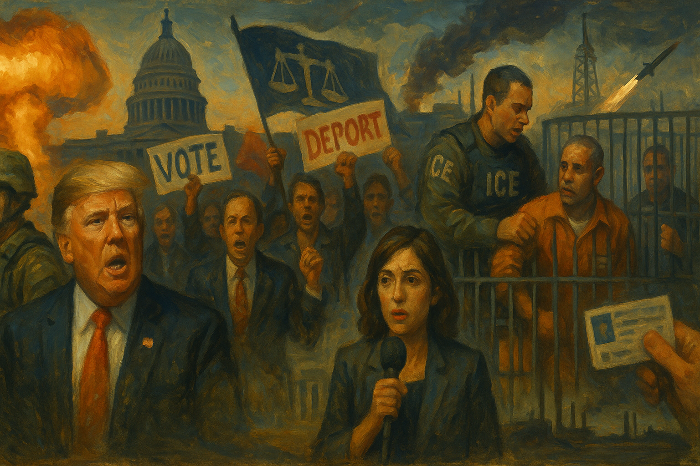

<!-- Generated by build_publish_week_v1 (appendix post) -->
<!-- Header image: image_wide_week61_appendix.png -->

# Week 61 Appendix: A War Without an Answer

*Executive power expanded on nearly every front this week, but courts, states, and a bipartisan subpoena pushed back hard enough to hold the clock nearly still.*

This week was dominated by an unplanned, escalating war with Iran that exposed the administration's improvisational and unaccountable approach to executive power. Trump repeatedly overrode military and diplomatic advice, made war-termination contingent on 'feeling it in his bones,' and directed strikes with casual, almost recreational rhetoric ('a few more times just for fun'). Simultaneously, the administration moved aggressively on multiple fronts: threatening broadcast licenses over war coverage, deploying DPA emergency powers to override California environmental law, purging dissenting national security officials (Joe Kent, Nate Swanson), and stonewalling congressional oversight on Epstein files and war costs. Congress largely abdicated its war-powers role, with Senate Republicans blocking authorization votes. Courts provided a partial counterweight—blocking vaccine committee changes, ordering VOA reinstatement, and questioning the White House ballroom project—but the DOJ's sloppy, seemingly bad-faith litigation campaign against state voter rolls and its obstruction of Senate document requests reveal both incompetence and calculated evasion. Economic fallout (soaring gas prices, oil market disruption, inflation) collided with cavalier White House messaging dismissing consumer harm.

Power and Authority

1. Chris Wright restarted the Santa Ynez offshore oil pipeline under a Defense Production Act order that superseded California law and court settlements (2026-03-14) *[single source]*: The energy secretary invoked Cold War emergency powers to override state environmental protections and a court-approved settlement, asserting federal supremacy over local law.

2. Trump said the Iran war would end when he felt it in his bones rather than based on any stated strategy (2026-03-14): The commander-in-chief refused to articulate war aims or a timeline, basing a matter of life and death on personal intuition rather than command judgment.

3. Trump overruled military advice warning that striking Iran would prompt closure of the Strait of Hormuz (2026-03-14): The president dismissed a specific warning from his Joint Chiefs chairman, and the predicted consequence occurred, exposing a gap between military counsel and presidential decision-making.

4. Trump imposed 10 percent tariffs under a different statute days after the Supreme Court ruled his earlier tariffs unconstitutional (2026-03-16): The swift pivot to an alternate legal basis for tariffs after judicial rebuke shows an executive strategy of working around adverse court rulings rather than accepting them.

5. Trump signed an executive order creating a Task Force to Eliminate Fraud with authority over state-administered benefit programs (2026-03-16): The order centralizes federal control over welfare, Medicaid, and food-assistance enforcement, expanding executive reach into programs traditionally shared with the states.

6. Trump attacked Somalia in racist terms and directed a new anti-fraud task force to investigate Rep. Ilhan Omar based on false citizenship claims (2026-03-16): The president used executive machinery to target a sitting member of Congress based on unsubstantiated claims tied to her ethnicity, raising rule-of-law and equal-protection concerns.

7. Trump attacked the Supreme Court over its tariff ruling and demanded it validate false claims about the 2020 election (2026-03-16): Public presidential attacks on the Court for an adverse ruling, paired with demands to relitigate a settled election, undermine judicial independence and the constitutional order.

8. Trump claimed sole authority to withdraw the United States from NATO without congressional approval (2026-03-17) *[single source]*: The assertion of unilateral treaty-withdrawal power, contradicted by statute, signals an attempt to bypass legislative checks on a foundational alliance commitment.

9. Trump administration cut off oil supplies to Cuba's energy grid while Trump mused publicly about taking or annexing the island (2026-03-18): Using economic strangulation to force regime change in a foreign nation, followed by presidential talk of seizing its territory, reflects an extraconstitutional assertion of power abroad.

10. Trump publicly disclosed a sitting congressman's private terminal medical diagnosis at a White House event (2026-03-16): The unauthorized disclosure of a lawmaker's confidential health information by the president raises concerns about executive restraint and misuse of privileged access to personal data.

Institutions and Governance

1. Congressional Democrats demanded a formal investigation into US strikes that killed civilians at a girls' school and filed legislation requiring congressional approval before any war with Cuba (2026-03-14): Lawmakers invoked oversight and war-powers authority to demand accountability for civilian deaths and to reassert legislative control over future military action.

2. Judge Brian Murphy invalidated the membership and decisions of RFK Jr.'s reconstituted vaccine advisory committee, restoring the prior childhood immunization schedule (2026-03-16): A federal court blocked an executive attempt to reshape a public-health advisory body by replacing experts with ideologically aligned appointees, reasserting institutional limits on health policy.

3. Congress advanced the Save America Act after Trump threatened to withhold endorsements from senators who opposed it and demanded elimination of the filibuster (2026-03-17): Presidential pressure to eliminate a core Senate procedural safeguard in order to pass a restrictive voting bill signals coercion of the legislative process by the executive branch.

4. House Oversight Committee subpoenaed Attorney General Pam Bondi over DOJ's handling of Epstein files, after which she refused to commit to sworn testimony and Democrats walked out of a closed briefing (2026-03-17): A bipartisan subpoena for sworn testimony was met with executive evasion, illustrating a breakdown in the normal functioning of congressional oversight of the Justice Department.

5. Chief Justice John Roberts publicly warned that personal attacks on judges are dangerous and must stop (2026-03-17): The head of the judiciary issued a rare public rebuke of hostility directed at judges, signaling institutional concern about pressure on judicial independence from the executive branch.

6. Judge Royce Lamberth ordered reinstatement of more than 1,000 Voice of America employees laid off when the administration attempted to dismantle the agency (2026-03-18): A federal court reversed an executive effort to shut down an independent government broadcaster, reaffirming judicial checks on unilateral agency dismantlement.

7. Judge Richard Leon signaled he may block Trump's $400 million White House ballroom project, questioning the administration's legal authority over historic federal property (2026-03-19) *[single source]*: A federal judge indicated willingness to halt an executive construction project on national historic property absent congressional approval, testing limits on presidential authority.

8. Senate voted 53-47 to block a Democratic resolution requiring congressional authorization for the Iran war (2026-03-19): A near party-line Senate vote rejected a constitutional check on executive war-making, leaving military action against Iran without formal congressional authorization.

9. FBI Director Kash Patel admitted under oath that the FBI purchases Americans' location data from commercial brokers without warrants (2026-03-19) *[single source]*: A sworn admission revealed a warrantless surveillance practice that circumvents Fourth Amendment protections through a private-data-broker loophole.

10. Director of National Intelligence Tulsi Gabbard omitted the intelligence community's conclusion that Iran posed no imminent threat from her Senate testimony and stated that only the president can determine imminence (2026-03-18): Selective omission of intelligence findings from sworn testimony obscures the factual basis for a major war and subordinates institutional threat assessment to presidential preference.

11. Joe Kent resigned as director of the National Counterterrorism Center, stating Iran posed no imminent threat and that Israeli pressure drove the war (2026-03-17): A senior national-security official's public resignation and dissent exposed internal disagreement over the factual justification for a major military operation.

12. FBI opened an investigation into Joe Kent for allegedly leaking classified information immediately after his public criticism of the war (2026-03-19): The timing of a federal investigation into a dissenting official right after his public criticism raises concerns of retaliation against a national-security whistleblower.

13. Trump dismissed the resigning counterterrorism director as weak on security and stated dissenters have no place in his administration (2026-03-19): Public presidential dismissal of a dissenting official as unfit signals intolerance for internal disagreement over the legal basis for war.

14. House Speaker Mike Johnson declined to hold public hearings on the Iran war's costs, saying operations were too sensitive for public disclosure (2026-03-17): Congressional leadership blocked public accountability for war costs, allowing continued military spending without transparent legislative scrutiny.

15. Senator Ron Wyden accused Deputy Attorney General Todd Blanche of blocking release of an unclassified DEA memo on the Epstein investigation to Congress (2026-03-19): A senator's public allegation that a senior DOJ official is concealing unclassified investigative material from Congress raises concerns about obstruction of legislative oversight.

16. DOJ invoked privilege to block release of an Epstein-related DEA memo despite a bipartisan committee subpoena of the attorney general (2026-03-20): The Justice Department's refusal to release investigative material tied to a high-profile case undermines congressional oversight and public accountability.

17. DOJ filed voter-roll lawsuits riddled with misspelled names, nonexistent statutes, incorrect state titles, missing documents, and unauthorized attorneys across multiple federal courts (2026-03-16) *[single source]*: A pattern of dozens of basic procedural failures in litigation demanding sensitive voter data from states raises doubts about the department's competence or good faith in the campaign.

18. DOJ sued West Virginia, Kentucky, New Jersey, Oklahoma, and Utah to compel disclosure of unredacted voter registration data (2026-03-16) *[single source]*: Federal litigation to force states to hand over private voter data raises constitutional questions about federal authority, state sovereignty, and voter privacy.

19. State election officials in Maine, Minnesota, New Hampshire, West Virginia, and other states refused DOJ demands for unredacted voter rolls while Ohio complied (2026-03-16) *[single source]*: Widespread state resistance to a federal demand for sensitive voter data, spanning both parties, reflects a broad pushback against perceived federal overreach into election administration.

20. Illinois federal judge struck DOJ's case-initiating documents for improper electronic filing, and other courts flagged unauthorized attorneys and missing paperwork (2026-03-16) *[single source]*: Multiple federal courts identified basic procedural violations in the DOJ's national voter-data litigation campaign, delaying and undermining the effort.

21. Illinois, California, and 14 other state attorneys general sued HUD over guidance threatening to defund fair housing agencies that protect classes beyond federal minimums (2026-03-16): A multistate lawsuit challenges federal conditions on housing funds that narrow civil-rights protections without the required rulemaking process.

22. Judge R. Brooke Jackson enjoined USDA from forcing Colorado into a mandatory SNAP recertification pilot, finding it likely punitive and unconstitutional under the Spending Clause (2026-03-16): A federal court blocked a federal agency from coercing a state into an assistance-program pilot program the judge characterized as punishment rather than policy.

23. Environmental Defense Fund sued the Energy Secretary and Acting Archivist for failing to recover federal records improperly kept in personal email accounts used to support an EPA climate-rule rescission (2026-03-17): The lawsuit challenges whether executive officials complied with federal records-preservation law tied to a major environmental rulemaking effort.

24. Minnesota sued the Trump administration alleging DHS and DOJ are withholding evidence and the identities of federal agents involved in fatal shootings of US citizens (2026-03-18): A state's lawsuit alleges the federal government is shielding its own agents from criminal accountability for fatal shootings, raising federalism and rule-of-law concerns.

25. New Jersey and the Township of Roxbury sued DHS and ICE for establishing a large detention facility without required environmental review or local consultation (2026-03-20): State and local officials challenged federal detention-facility siting for bypassing environmental and intergovernmental-cooperation statutes.

26. Judge Mustafa Kasubhai ruled that HHS Secretary Robert F. Kennedy Jr. exceeded his authority in declaring gender-affirming care for minors unsafe without following proper procedure (2026-03-20): A federal court found a cabinet secretary bypassed administrative procedure to restrict access to medical care, reasserting limits on unilateral agency action.

27. Senate Committee on Homeland Security and Governmental Affairs advanced Markwayne Mullin's nomination for DHS secretary on a near party-line vote despite concerns over his truthfulness and past comments on political violence (2026-03-20): A contested cabinet confirmation vote, decided by a single crossover Democrat, advanced a nominee criticized for lacking transparency about a role overseeing border and civil-liberties enforcement.

28. Supreme Court granted certiorari before judgment and consolidated two immigration-related cases for expedited April argument (2026-03-16): An extraordinary procedural move bypassing lower courts signals the justices view the underlying questions as requiring urgent resolution.

Economic Structure

1. Jared Kushner solicited up to $5 billion in new foreign investment for his private equity firm while serving as a Trump administration Iran policy envoy (2026-03-14): A presidential family member and active foreign-policy negotiator sought billions from governments with a direct stake in the same negotiations, raising Foreign Emoluments Clause concerns.

2. Trump administration officials created a pardon-brokering market in which connected lobbyists charge up to $1 million to advance clemency petitions (2026-03-15) *[single source]*: The emergence of a pay-to-play clemency system undermines equal administration of justice by turning presidential pardons into a purchasable commodity.

3. Market forces drove US gasoline to nearly $3.90–3.90 a gallon and diesel above $5, the sharpest monthly rise in three decades, as the Iran war disrupted oil supply (2026-03-15) *[single source]*: War-driven fuel-price spikes squeeze household budgets and threaten cascading inflation across food, transport, and consumer goods.

4. Kevin Hassett stated on live television that consumer harm from the war is the last of our concerns (2026-03-17) *[single source]*: A top White House economic adviser's public dismissal of consumer hardship during a war-driven price surge reflects administration priorities that deprioritize ordinary Americans' economic wellbeing.

5. Treasury Secretary Scott Bessent announced the administration may lift sanctions on roughly 140 million barrels of stranded Iranian oil to ease prices (2026-03-19): A unilateral move to ease sanctions on an adversary nation's oil assets raises questions about consistency in sanctions policy and possible indirect funding of a hostile regime.

6. Scott Bessent granted a 30-day waiver allowing sale of Russian oil already at sea despite sanctions intended to isolate Russia over Ukraine (2026-03-16): Easing sanctions enforcement against Russia during the Iran war benefits an adversary financing its own war in Ukraine, undercutting stated sanctions policy.

7. Sergey Brin donated $45 million total to political committees fighting a proposed California wealth tax on billionaires (2026-03-19): A single billionaire's massive spending to defeat a tax measure funding education and healthcare illustrates how concentrated private wealth can shape state fiscal policy.

8. Senator Sheldon Whitehouse and Rep. Ro Khanna proposed a windfall tax on oil companies profiting from war-driven price spikes (2026-03-18) *[single source]*: Lawmakers responded to corporate profiteering from wartime energy disruption by proposing to redirect excess profits to households facing higher living costs.

9. Iraq, Kuwait, and Bahrain declared force majeure on foreign-operated oilfields as the Strait of Hormuz closure caused the largest oil-supply disruption in market history (2026-03-20): An intergovernmental energy body confirmed the war caused unprecedented global supply disruption, with severe economic consequences extending well beyond the conflict zone.

10. Trump administration slashed diversity and inclusion funding for nonprofits, including Asian American organizations, reducing capacity to respond to hate incidents (2026-03-16) *[single source]*: Defunding civil-society organizations serving marginalized communities weakens grassroots capacity to document and respond to discrimination.

11. Federal Reserve data showed producer prices rising 3.4 percent over the year, the fastest pace in a year, even before the full impact of the Iran war reached markets (2026-03-18): Pre-existing inflationary pressure combined with war-driven energy disruption threatens sustained price increases and reduced purchasing power.

Civil Rights and Dissent

1. Judge Katherine Menendez ordered ICE to release a Minneapolis asylum seeker held unlawfully for 50 days despite a court order barring his removal from the state (2026-03-14) *[single source]*: A federal court found ICE defied a judicial order and detained an asylum seeker without legal basis, exposing systemic due-process violations in immigration enforcement.

2. ICE detained a documented Canadian citizen and her autistic seven-year-old daughter for weeks in substandard conditions despite valid work-visa status (2026-03-14): The prolonged detention of a legally authorized foreign national and a disabled child raises due-process concerns and highlights coercive pressure to abandon lawful status.

3. Nine defendants were convicted of providing material support to terrorists after a peaceful protest at an ICE detention facility (2026-03-14): The first federal terrorism conviction of protesters alleged to be part of an antifa cell establishes precedent for prosecuting political demonstration under terrorism statutes.

4. Miami-Dade Sheriff's Office tripled its designated immigration officers and embedded federal immigration checks into routine local policing (2026-03-14): Integrating federal immigration enforcement into everyday local policing enables mass status checks during ordinary encounters and blurs the line between local and federal authority.

5. DHS deployed 3,000 federal agents to Minneapolis in the largest immigration operation in its history, resulting in fatal shootings of two US citizens and detention of children (2026-03-14): An extraordinary mobilization of federal force in a single city, resulting in citizen deaths and child detentions, represents a breakdown of proportionality in civilian law enforcement.

6. Wyoming legislature passed a six-week abortion ban that the governor signed while acknowledging its constitutional vulnerability (2026-03-15) *[single source]*: Enacting a law widely expected to be unconstitutional restricts reproductive rights and signals disregard for a prior state supreme court ruling.

7. ICE detained a teenager who died in custody in Florida, one of at least ten deaths in ICE detention in 2026 (2026-03-16): A pattern of deaths in immigration custody, including of a minor, raises urgent questions about conditions and oversight in federal detention facilities.

8. ICE recorded arrests of Asian Americans nearly four times higher than under the prior administration, according to a Stop AAPI Hate report (2026-03-16) *[single source]*: Disproportionate enforcement against a specific ethnic community represents targeted harm alongside a broader expansion of aggressive immigration policing.

9. University of Florida suspended its College Republicans chapter after members were photographed performing a Nazi salute, prompting a First Amendment lawsuit (2026-03-16): The case tests the boundary between institutional discipline for hate symbolism and free-speech protections for off-campus student conduct.

10. Nine anti-ICE protesters convicted of terrorism-related charges and others prosecuted for conspiracy faced federal conspiracy charges tied to protests, extended to journalists covering demonstrations and to elected officials (2026-03-20) *[single source]*: Widespread use of conspiracy charges against protesters, reporters, and officials for covering or joining demonstrations represents an expanding criminalization of political speech and assembly.

11. ICE systematically deported parents without arranging care for their children, violating the administration's own detained-parents policy (2026-03-19): A watchdog investigation found immigration agents routinely fail to ask about or safeguard children before deporting parents, causing documented family separation trauma.

12. ICE detained a Texas court interpreter with legal status for over a month without explanation or a stated deportation destination (2026-03-17) *[single source]*: Indefinite detention of a licensed court interpreter without cause undermines judicial function and raises due-process and transparency concerns.

13. Leqaa Kordia was released from ICE custody after a year of detention despite three judicial rulings that she posed no threat and could be released on bond (2026-03-17): Prolonged detention of a pro-Palestinian activist despite repeated judicial release orders suggests immigration custody was used to punish protected political speech.

14. Federal immigration judge denied asylum for a five-year-old detained preschooler and his family, who face expedited removal to Ecuador (2026-03-19): The denial and expedited removal of a young child and family whose earlier detention sparked public protest illustrates aggressive enforcement against minors.

15. Federal courts including the First Circuit dismissed multiple pro-Israel lawsuits and ruled that common pro-Palestinian protest slogans are constitutionally protected speech (2026-03-19): A series of rulings established binding precedent protecting campus political speech on Israel-Palestine, rejecting attempts to suppress protest through civil-rights litigation.

16. California prosecutors filed nearly 35,000 felony theft and drug-possession charges under Proposition 36, with severe racial disparities and minimal treatment completion (2026-03-18) *[single source]*: Aggressive prosecution of low-level offenses reversed years of criminal-justice reform, disproportionately harming Black and Latino residents while failing to deliver promised treatment.

17. Wyden and press reports documented that DHS has recruited using white nationalist imagery while rapidly expanding ICE and CBP staffing (2026-03-19) *[single source]*: Watchdog findings that federal immigration recruitment employed extremist imagery raise concerns about ideological capture within enforcement agencies.

Information, Memory and Manipulation

1. Pete Hegseth used a press briefing to attack war coverage and said the sooner a Trump ally takes over CNN, the better (2026-03-14): A senior defense official publicly called for ideological conformity in media coverage of military operations, undermining independent journalism.

2. Trump falsely claimed the US destroyed 100 percent of Iran's military capability and posted a misleading childhood military-academy photo during the war (2026-03-14): Public claims of total military victory, contradicted by ongoing Iranian strikes, misled Americans about the actual state of an active war.

3. FCC Chair Brendan Carr threatened broadcasters with license revocation over coverage of the Iran war, later endorsed publicly by Trump (2026-03-14): A federal regulator's threat to pull broadcast licenses over unfavorable war coverage, backed by the president, constitutes direct government pressure on press freedom.

4. Trump posted that the US had formed an international naval coalition to reopen the Strait of Hormuz without confirmation from any named country (2026-03-14): Unverified claims of allied military commitments misrepresented the state of international support for the war effort during active conflict.

5. Trump silenced and permanently barred an ABC reporter from asking questions after she pressed him on troop deployments and campaign fundraising using war imagery (2026-03-15): A sitting president used his platform to punish and exclude a specific journalist for asking accountability questions, chilling press access.

6. Trump attacked the New York Times and Wall Street Journal as wanting the US to lose the war and called for treason charges against outlets he deemed dishonest (2026-03-16) *[single source]*: Presidential calls for criminal prosecution of news organizations over editorial coverage of a war represent a direct assault on constitutional press protections.

7. White House communications staff produced war-promotion videos intercutting military strikes with football hits and movie clips for social media engagement (2026-03-18) *[single source]*: Gamifying and trivializing military strikes as entertainment content obscures the human cost of war and targets young audiences with attention-optimized propaganda.

8. DOJ removed more than 50 pages of Epstein-file interviews concerning Trump himself days before the war began (2026-03-17): Selective purging of politically damaging material from a court-mandated disclosure undermines transparency and public accountability for potential presidential misconduct.

9. Trump misrepresented a CNN poll as showing 100 percent overall support for the war, when the figure reflected only MAGA Republicans (2026-03-20) *[single source]*: Deliberate distortion of polling data misleads the public about the actual level of support for a war and undermines informed democratic discourse.

10. New York Times published an investigation documenting decades of sexual abuse allegations against Cesar Chavez, prompting states and unions to cancel commemorations (2026-03-18): New reporting forced a public reckoning over a celebrated historical figure, testing how institutions revise commemorative memory in light of credible abuse allegations.

