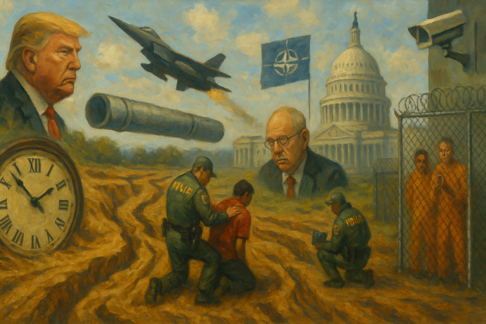

<!-- Generated by build_publish_week_v1 -->
<!-- Header image: image_wide_week61.png -->

# Week 61: A War Without an Answer

*Executive power expanded on nearly every front this week, but courts, states, and a bipartisan subpoena pushed back hard enough to hold the clock nearly still.*

The war had no announced beginning, and by Week 61 it still had no announced end. It simply continued, absorbing everything around it: the courts, the press, the dissenters inside government, the price of gasoline. This was the week's real subject — not a single scandal, but a war run by instinct, defended by omission, and left almost entirely unchecked by the branch of government built to authorize it.

The Democracy Clock stood at 7:43 p.m. at the start of the week and closed the week at 7:43 p.m. as well. That is a movement of six seconds, small enough to round to nothing on a public face built for minutes, not fractions. The stillness was not calm; it was the arithmetic of a week in which serious erosion and serious resistance nearly canceled each other out. Executive power expanded on nearly every front the record touched. But courts intervened more often than in recent weeks, a bipartisan subpoena forced a confrontation with the Justice Department, and states across party lines said no to federal demands. The clock held because the week was genuinely mixed, not because it was quiet.

Trump ran the Iran war the way he ran his first term: by feel. He told the country the war would end "when I feel it in my bones," offering no timeline, no stated objective, nothing Congress or the public could evaluate. He overruled a direct warning from his Joint Chiefs chairman that striking Iran would close the Strait of Hormuz. The strait closed. The warning had been specific, and the consequence was not hypothetical — it happened exactly as predicted. That made the overruling look less like boldness and more like a refusal to listen.

Congress had one formal chance to reassert itself. The Senate voted 53 to 47, almost entirely along party lines, to block a war-powers resolution that would have required congressional authorization for the conflict. Speaker Johnson refused to hold public hearings on the war's costs, citing operational sensitivity. Between the vote and the refusal, the legislative branch effectively opted out of its constitutional role. The war continued on executive authority alone; no vote, no hearing, no public accounting stood in its way.

Underneath the war's momentum sat a quieter problem. Nobody outside the administration could say what the intelligence actually showed. Director of National Intelligence Tulsi Gabbard testified before the Senate without volunteering the intelligence community's own conclusion that Iran posed no imminent threat. Pressed further, she said only the president determines imminence. That is not how intelligence assessments are supposed to work. The sworn record that justified the war left out the finding that undercut it.

The starkest contradiction came from inside the administration itself. Joe Kent, director of the National Counterterrorism Center, resigned and said publicly that Iran had posed no imminent threat, and that pressure from Israel had helped drive the country into war. Two days later, the FBI opened a leak investigation into him. Trump called him weak and said dissenters have no place in his administration. The sequence was hard to read as coincidence: a senior official raised the same doubt Gabbard had buried in testimony, and within days he was under federal investigation.

The war reached into the newsroom as directly as it reached into the intelligence community. FCC Chair Brendan Carr threatened broadcasters with license revocation over war coverage the administration disliked. Trump endorsed the threat publicly, and separately said the sooner a friendly owner took over CNN, the better. He floated treason charges against the New York Times and Wall Street Journal for coverage he judged insufficiently supportive. A reporter who pressed him on troop deployments was barred from further questions. None of this was subtle. It amounted to a working theory of the press: outlets exist to support the war, and those that do not face regulatory and rhetorical punishment.

Alongside pressure came fabrication. Trump claimed total destruction of Iran's military capability while strikes continued. He announced an international naval coalition to reopen the Strait of Hormuz that no named country had confirmed. He later cited a CNN poll as showing universal public support for the war, when the number reflected only Republicans aligned with him. White House staff produced promotional videos splicing real strike footage with football hits and movie clips — a wartime narrative built for social media engagement rather than public understanding. Each falsehood was small. Together they formed a manufactured record of a war the public had no reliable way to assess.

The domestic enforcement apparatus moved with comparable force. Three thousand federal agents descended on Minneapolis in the largest immigration operation in the agency's history. Two U.S. citizens were shot and killed by federal agents during the operation. Children were detained. A Canadian citizen and her autistic seven-year-old daughter, both lawfully present, were held for weeks in poor conditions. A teenager died in ICE custody in Florida, one of at least ten such deaths in the year. Minnesota sued the federal government for withholding the identities of the agents involved in the fatal shootings, alleging a cover-up rather than an investigation.

Due process failed in smaller, no less telling ways throughout the week. A federal judge found ICE had defied a court order barring an asylum seeker's removal, detaining him unlawfully for fifty days regardless. A watchdog investigation found agents routinely deported parents without confirming arrangements for their children, violating the administration's own stated policy. A Texas court interpreter with legal status was held for over a month with no explanation offered to anyone, including her own attorneys. None of these were emergency measures. They were the ordinary operation of a system that had stopped checking its own work.

Protest itself came under new legal pressure. Nine people were convicted of providing material support to terrorists for taking part in a demonstration at an ICE facility, the first such terrorism conviction of its kind. Conspiracy charges extended to journalists who had covered protests and to elected officials who had joined them. The legal machinery built to fight terrorism was now reaching into ordinary political assembly. That precedent does not need repetition to have lasting effect.

The Justice Department's conduct elsewhere in the week suggested disorganization or design, and possibly both. It filed dozens of lawsuits against states demanding unredacted voter rolls, riddled with misspelled names, citing nonexistent statutes, missing basic paperwork. Courts in Illinois and elsewhere struck filings outright for procedural defects. States across the political spectrum, red and blue alike, refused to comply. The sloppiness did not stop the campaign; it simply meant the campaign proceeded by volume rather than precision, daring states to spend resources fighting suits that might not survive scrutiny regardless.

The same department blocked release of an unclassified Epstein-related memo despite a bipartisan House Oversight Committee subpoena of the attorney general. A senator accused a deputy attorney general directly of concealing it. Days earlier, more than fifty pages of Epstein-file interviews concerning Trump himself had quietly disappeared from a court-mandated disclosure, just before the war began. Transparency law existed on paper. In practice, the department decided what Congress, and the public, were permitted to see.

Against this record, the judiciary offered the week's clearest counterweight. A federal court invalidated Robert F. Kennedy Jr.'s reconstituted vaccine advisory committee and restored the prior immunization schedule. Another ordered the reinstatement of more than a thousand Voice of America employees dismissed in an attempt to dismantle the agency outright. A judge signaled he might block the administration's four-hundred-million-dollar White House ballroom project for lacking congressional authorization. Chief Justice Roberts, in a rare public statement, warned that personal attacks on judges are dangerous and must stop. None of these rulings touched the war directly, but together they showed an institution still willing to enforce limits, even as the president publicly attacked the Court over an adverse tariff ruling and pivoted to new statutory grounds within days of losing.

The war's economic cost arrived quickly and without official concern. Gasoline approached four dollars a gallon, diesel passed five, the sharpest monthly rise in three decades, as the Strait of Hormuz closure triggered the largest oil-supply disruption in market history. White House economic adviser Kevin Hassett said on live television that consumer harm was "the last of our concerns." The administration eased sanctions on Iranian oil to bring prices down, then separately granted a waiver allowing sale of already-sanctioned Russian oil, easing pressure on the same country financing its own war in Ukraine. Lawmakers proposed a windfall tax on oil companies profiting from the disruption. Nothing in the record suggests the idea advanced further than proposal.

Smaller currents ran through the week without demanding the same space. A pardon-brokering market emerged in which access to clemency could reportedly be bought for up to a million dollars. New College of Florida's trustees purged LGBTQ+ staff and eliminated its gender studies department. FBI Director Kash Patel admitted under oath that the bureau buys Americans' location data from commercial brokers to avoid the warrant process entirely. Each of these, on its own, might have been the week's leading story in a quieter period. Here, they were one thread among several, evidence that the pattern extended well past the war itself.

The Senate Homeland Security Committee advanced Markwayne Mullin's nomination for DHS secretary on a near party-line vote despite unresolved questions about his candor. It was a routine confirmation that nonetheless placed a contested figure atop the agency running both the Minneapolis operation and the voter-roll campaign. It closed one more door through which oversight might have entered, quietly, in a week already full of louder failures.

Week 61 did not mark a new descent. It marked the maturing of an old one: a war conducted by presidential instinct, a Congress that declined its constitutional role twice in one week, an intelligence official who shaded testimony to match the president's preference, and a dissenting official investigated within days of speaking against it. Courts held some lines. States refused some demands. None of it reversed the war, and none of it forced an accounting of how it began. The pattern from recent weeks did not break. It simply repeated itself, with slightly more resistance and no less momentum, at a plateau that neither collapsed further nor meaningfully recovered.

<!-- Synopses for cross-posting -->
Long Synopsis: Week 61 measured a war with no announced beginning or end. Trump ran the Iran conflict by instinct, overruling a specific military warning that came true when the Strait of Hormuz closed. The Senate blocked a war-powers resolution 53-47, and Congress refused public hearings on the war's costs. The Director of National Intelligence omitted a key threat assessment from sworn testimony, while a dissenting official who contradicted it publicly was placed under FBI investigation within days. The FCC threatened broadcaster licenses over war coverage. Three thousand federal agents descended on Minneapolis, killing two citizens. Yet courts intervened repeatedly, blocking a politicized vaccine panel and reinstating fired Voice of America staff, and states across party lines refused federal demands. The clock closed exactly where it began: 7:43 p.m.
Short Synopsis: An unauthorized war deepened as Trump overruled military advice, Congress declined its constitutional role, and dissenters were investigated within days of speaking out. Courts and bipartisan resistance held some lines. The clock moved six seconds, a stillness born of near-equal erosion and resistance.

