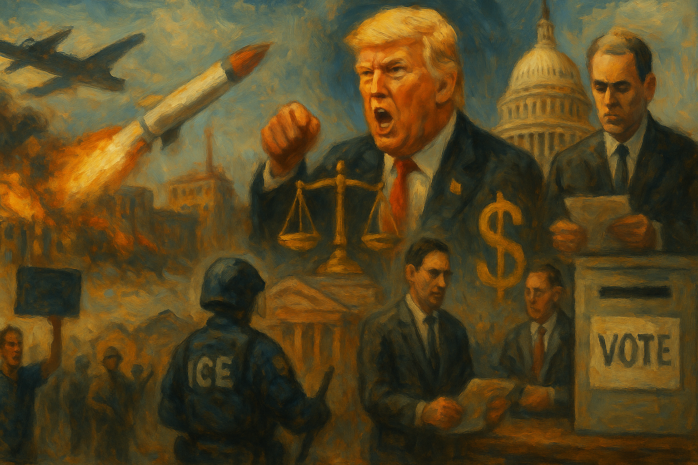

<!-- Generated by build_publish_week_v1 (appendix post) -->
<!-- Header image: image_wide_week64_appendix.png -->

# Week 64 Appendix: War, Data, and the Quiet Capture

*Iran conflict, voter databases, and politicized agencies deepened executive control and crony governance while courts, cities, and organizers mounted constrained but real resistance.*

This was an acute crisis week in which authoritarian drift and war-making fed directly into domestic institutional erosion. Trump’s escalating threats against Iran—including explicit nuclear and genocidal rhetoric—combined with real strikes on civilian infrastructure to normalize war crimes talk and sideline Congress on questions of war and peace. House Republicans repeatedly blocked war-powers votes while $350 billion in defense spending moved through reconciliation, underscoring a legislature reduced to performance as the presidency operates with minimal oversight. Simultaneously, the administration advanced a multi-front assault on electoral integrity and equal citizenship: weaponizing the flawed SAVE database, suing states for voter data, and tying immigration enforcement to voter rolls, while anti‑Muslim legislation in Florida and harsh immigration practices deepened stratified citizenship. Crony capitalism and agency capture were visible in Golden Dome contracting, CFTC and SEC interventions favoring politically connected firms, and conflicted Pentagon AI deals. Civil service restructuring at the Forest Service and politicized firings in the military further hollowed neutral administration. Against this, pockets of resistance—federal court injunctions, Wisconsin’s pro‑democracy supreme court result, surveillance rollbacks by cities, and active voting‑rights litigation—showed institutional antibodies, but they were outweighed by concentrated executive power, disinformation, and rights‑eroding policy.

Power and Authority

1. Trump administration renamed the Department of Defense to the Department of War (2026-04-04): Renaming the defense department to the Department of War signaled a more openly militaristic posture, shaping how executive power frames and justifies the use of force to the public and other institutions.

2. Secretary of Homeland Security Kristi Noem waived environmental and historic protection laws to speed border wall construction in Big Bend (2026-04-05): By sweeping aside environmental and historic protections to build a border wall, DHS concentrated executive discretion over protected lands and limited legal and community checks on a high‑impact security project.

3. President Trump threatened military action against Iran over the Strait of Hormuz on social media (2026-04-05): Trump’s public threats to use force against Iran over shipping access asserted expansive unilateral war‑making authority, pressuring foreign policy decisions outside normal congressional authorization channels.

4. President Trump repeatedly threatened to attack Iranian civilian infrastructure and suggested such strikes would not be war crimes (2026-04-05): Trump’s threats to bomb Iranian civilian infrastructure, while dismissing war‑crimes concerns, challenged international humanitarian norms and signaled willingness to wield U.S. power outside legal constraints.

5. President Trump accepted and then partially suspended a two‑week ceasefire with Iran while keeping forces in place (2026-04-08): Trump’s acceptance and conditional suspension of a short ceasefire with Iran, while maintaining forward‑deployed forces, kept the presidency in control of war tempo with limited legislative input.

6. President Trump threatened to withdraw the United States from NATO over allies’ stance on Iran (2026-04-05): Threats to pull the U.S. out of NATO over Iran policy used alliance commitments as leverage for personal strategic aims, concentrating foreign‑policy power in the presidency and unsettling long‑standing security arrangements.

7. President Trump signed an executive order directing DHS to use the SAVE database to define eligible voters and DOJ to prosecute ballot distribution outside that list (2026-04-06): Ordering use of an error‑prone immigration database to police voter eligibility and criminalize ballot distribution centralized control over the franchise in the executive branch and risked large‑scale disenfranchisement.

8. President Trump promised mass pardons to staff who had been near the Oval Office (2026-04-10): Promising blanket pardons for insiders signaled that loyalty to the president could shield officials from legal accountability, weakening deterrence for abuses of power within the executive branch.

9. President Trump used a White House Easter Egg Roll appearance to discuss the Iran conflict with children (2026-04-05): Injecting wartime messaging into a ceremonial children’s event blurred civic ritual with militarized propaganda, reinforcing a personalized narrative of presidential strength in conflict.

10. President Trump made false claims about his role in killing Osama bin Laden and asserted secret Iran war plans (2026-04-07): Trump’s fabricated accounts of past counterterrorism decisions and undisclosed war plans undermined truthful communication from the commander in chief, complicating democratic oversight of national‑security choices.

11. President Trump repeatedly declared victory in the Iran war despite ongoing setbacks (2026-04-07): Declaring victory in an unresolved conflict allowed the president to claim success while avoiding accountability for costs and failures, distorting public understanding of war outcomes.

12. President Trump threatened to relocate U.S. troops away from NATO allies deemed unhelpful in the Iran war (2026-04-08): Using troop basing as punishment for allied governments’ policy choices turned security commitments into tools of presidential coercion, weakening predictable alliance governance.

13. President Trump pledged to use U.S. economic resources to support Hungarian Prime Minister Viktor Orbán during elections (2026-04-09): Promising U.S. economic backing for Orbán’s reelection bid blurred lines between American foreign policy and partisan intervention in another country’s democratic process.

14. President Trump lashed out at NATO and threatened pressure over military commitments in the Strait of Hormuz (2026-04-09): Publicly berating NATO and tying alliance value to compliance with his Iran strategy personalized collective‑security decisions and strained multilateral checks on U.S. power.

15. President Trump used graphic, violent social media content attacking immigrants and a political rival (2026-04-10): Posting violent imagery that vilified Haitian immigrants and a former president normalized dehumanizing rhetoric from the head of state, heightening polarization and potential justification for harsh policies.

16. President Trump publicly denounced former allies who opposed his Iran policy as not true supporters (2026-04-10): Labeling critics of his war policy as disloyal reinforced a leader‑centric standard of loyalty over institutional debate, discouraging dissent within his coalition.

17. President Trump endorsed Steve Hilton in the California governor’s race and promised federal help (2026-04-06): Trump’s endorsement of a gubernatorial candidate, coupled with promises of federal assistance, signaled potential use of national resources to bolster aligned state‑level political figures.

18. President Trump claimed he was popular enough to run for president of Venezuela (2026-04-05): Trump’s boast about his popularity in Venezuela reflected his personalized approach to foreign politics, though it did not itself change formal power structures.

19. President Trump announced plans for a $400 million White House ballroom built with foreign steel (2026-04-09): Using substantial public funds and foreign materials for a prestige White House project highlighted the president’s ability to direct state resources toward personal symbolic projects.

20. President Trump threatened to jail journalists who refused to reveal a source about a missing airman (2026-04-06): Threatening imprisonment for reporters who protect confidential sources used presidential power to intimidate the press, undermining protections essential for investigative reporting on national‑security matters.

21. President Trump directed HHS under Robert F. Kennedy Jr. to cut immunization funding and target gender‑affirming care payments (2026-04-06): Executive‑driven cuts to vaccination programs and moves to end federal payments for pediatric gender‑affirming care used health policy levers to reshape access to basic services for vulnerable groups.

22. President Trump used executive orders to threaten tariffs on fuel suppliers to Cuba, creating an oil blockade (2026-04-06): Tariff threats that effectively blockaded fuel to Cuba weaponized U.S. economic power against a foreign population, causing humanitarian harm while bypassing broader diplomatic processes.

23. President Trump announced a tentative ceasefire with Iran that quickly unraveled amid allied disputes (2026-04-10): Trump’s poorly coordinated ceasefire announcement, which collapsed as Israel rejected its terms, illustrated personalized crisis management that sidelined coherent multilateral planning.

24. President Trump claimed a joint U.S.–Iran venture to charge tolls in the Strait of Hormuz despite Iranian mockery (2026-04-08): Floating an unsubstantiated joint toll scheme with Iran added confusion to already fraught negotiations, complicating public understanding of who controls critical trade routes.

25. President Trump criticized CNN’s reporting on the Iran conflict as fraudulent and demanded retraction (2026-04-08): Attacking CNN’s war coverage as fraudulent sought to delegitimize independent reporting that challenged the administration’s narrative of success in Iran.

26. President Trump used social media to threaten that an entire Iranian civilization could be destroyed in one night (2026-04-07): Threatening civilizational destruction on social media escalated nuclear‑tinged rhetoric and highlighted how a single leader’s statements can destabilize global security without institutional checks.

27. President Trump publicly disputed a CNN report that Iran had achieved a significant victory after a ceasefire (2026-04-08): By branding unfavorable battlefield assessments as fraudulent, Trump further blurred the line between legitimate criticism and alleged disinformation, complicating accountability for war outcomes.

28. President Trump directed HHS and CMS to withhold FOIA responses on data‑sharing with immigration agencies, prompting litigation (2026-04-09): Refusing to release records on health‑immigration data sharing limited public insight into how federal power links social programs with enforcement, weakening transparency around rights‑affecting policies.

Institutions and Governance

1. House Republicans shut down a pro forma session to block a war powers vote on Iran (2026-04-06): By ending a pro forma session to prevent a war‑powers vote, House Republicans kept Congress from asserting its constitutional role over war, leaving presidential military actions less checked.

2. House Republican leadership blocked Democrats’ unanimous‑consent resolution to curb Trump’s Iran war powers (2026-04-09): Refusing to recognize Democrats seeking a unanimous‑consent vote on Iran war powers showed how procedural control can be used to shield executive war‑making from legislative constraint.

3. Congressional Democratic members called for recalling both chambers to address the Iran war and consider removing Trump (2026-04-08): Democrats’ push to reconvene Congress and explore removal options highlighted legislative concern over unchecked presidential war threats, even as leadership kept chambers in recess.

4. House Judiciary Committee ranking member Jamie Raskin requested a presidential cognitive exam from the White House physician (2026-04-09): A formal request for Trump to undergo a cognitive exam used institutional channels to question his fitness, testing norms around medical transparency and presidential capacity oversight.

5. Congress narrowly rejected measures requiring approval for military operations against Iran (2026-04-07): By rejecting resolutions to require authorization for Iran operations, both chambers effectively acquiesced to expanded presidential war powers, weakening statutory checks on armed conflict.

6. Congress advanced $350 billion in defense spending through budget reconciliation with limited oversight (2026-04-07): Routing a large share of defense funding, including Golden Dome, through reconciliation reduced debate and amendment opportunities, limiting Congress’s ability to scrutinize long‑term military commitments.

7. House Ethics Committee opened an investigation into Representative Tony Gonzales over alleged misconduct with staffers (2026-04-06): The ethics probe into Tony Gonzales’s relationships with aides showed congressional mechanisms for policing member behavior, with implications for workplace safety and public trust.

8. House Oversight and Government Reform Committee subpoenaed former Attorney General Pam Bondi over Epstein files, prompting DOJ resistance (2026-04-08): The clash over Pam Bondi’s deposition on Epstein records pitted congressional oversight against DOJ’s effort to shield a former top official, testing accountability for high‑profile abuse cases.

9. House Oversight ranking member Robert Garcia called for a public hearing with Epstein survivors (2026-04-08): A push for public testimony from Epstein survivors sought to use congressional hearings to surface abuse and evaluate institutional failures in handling the case.

10. New York City Mayor Zohran Mamdani released videos highlighting city workers and services to promote transparency (2026-04-07): Showcasing municipal operations through public videos aimed to build trust in local government and model transparent, service‑oriented governance.

11. U.S. Department of Agriculture and Trump administration announced a restructuring of the U.S. Forest Service that closed regional offices and created politically appointed state directors (2026-04-10): Centralizing Forest Service leadership into 15 political appointees and closing regional offices weakened professional management of public lands and raised legal concerns about politicizing a key civil service agency.

12. Defense Secretary Pete Hegseth fired the U.S. Army chief of staff and other generals amid Iran war planning (2026-04-05): Removing senior generals during disagreement over Iran strategy suggested political interference in military leadership, potentially discouraging internal resistance to questionable orders.

13. Centers for Disease Control and Prevention renewed the Advisory Committee on Immunization Practices charter (2026-04-06): Extending ACIP’s charter preserved an expert advisory body that guides national vaccination policy, supporting evidence‑based public‑health governance.

14. Federal district court judges across the United States issued multiple rulings against Trump administration policies on immigration, tariffs, and prosecutions (2026-04-06): A series of lower‑court decisions curbing administration initiatives underscored the judiciary’s role as a check on executive overreach, even as the White House attacked judges and sought emergency relief.

15. U.S. Supreme Court vacated Steve Bannon’s contempt of Congress conviction and remanded the case (2026-04-06): The Court’s decision to unsettle Bannon’s conviction for defying a congressional subpoena weakened a high‑profile enforcement of legislative oversight and raised concerns about elite impunity.

16. Federal judge in California ruled that border agents violated a prior order by conducting warrantless arrests in Sacramento (2026-04-06): Finding that border agents ignored a court order on warrantless arrests reaffirmed judicial authority over immigration enforcement and protections against unlawful detention.

17. Massachusetts federal court blocked termination of Temporary Protected Status for Ethiopians (2026-04-06): Halting TPS termination for Ethiopians preserved legal status for thousands of immigrants and demonstrated courts’ willingness to scrutinize abrupt changes in humanitarian protections.

18. U.S. District Court for the District of Columbia received a complaint challenging an OLC opinion that declared the Presidential Records Act unconstitutional (2026-04-06): Historians and transparency advocates sued to stop the administration from abandoning Presidential Records Act obligations, seeking to preserve archival records essential for future accountability.

19. Federal courts issued several procedural rulings in challenges to Trump administration policies, including on TPS, agency directives, and protests (2026-04-07): Preliminary injunction and motion decisions in multiple cases adjusted the legal landscape around TPS, civil‑service directives, and protest policing, shaping how far executive policies can go while litigation proceeds.

20. U.S. Court of Appeals for the D.C. Circuit denied Anthropic’s emergency stay request but expedited its challenge to Department of War AI contracting (2026-04-08): The D.C. Circuit’s deference to the Pentagon’s AI procurement during active conflict, while expediting review, balanced corporate claims against wartime executive discretion in a new technological domain.

21. Federal district court in D.C. compelled the Department of Defense to comply with an order protecting press access and struck down a revised leak‑solicitation policy (2026-04-09): By rejecting the Pentagon’s attempt to rebrand an unconstitutional leak‑solicitation ban and closing press corridors, the court reinforced judicial limits on executive efforts to restrict reporters.

22. American Library Association and the Trump administration settled litigation to restore IMLS funding operations and rescind staff reductions (2026-04-09): A settlement ensuring continued library‑related federal funding and reversing staff cuts preserved institutional support for public information infrastructure.

23. National Health Law Program sued HHS and CMS for failing to respond to FOIA requests about data‑sharing with DHS and ICE (2026-04-09): The FOIA suit sought transparency on how health agencies share Medicaid data with immigration authorities, challenging secrecy around cross‑agency practices that affect vulnerable populations.

24. Democracy Forward Foundation filed a FOIA lawsuit against the Department of Justice over voter registration and election integrity records (2026-04-10): Litigation to obtain DOJ communications on voter data and election integrity aimed to expose how federal law enforcement is shaping election rules and potential voter purges.

25. Senator Chris Murphy and other lawmakers publicly raised the possibility of invoking the 25th Amendment against Trump (2026-04-06): Calls for cabinet members to consider the 25th Amendment highlighted constitutional mechanisms for addressing presidential incapacity amid escalating nuclear‑tinged threats.

26. House Judiciary Committee Democrats requested a cognitive evaluation of Trump following alarming public statements (2026-04-09): Seeking a medical assessment of the president’s cognition used institutional tools to question his capacity, though without binding force, reflecting concern over decision‑making in crisis.

27. Florida Governor Ron DeSantis signed anti‑Sharia legislation into law (2026-04-09): Florida’s anti‑Sharia law codified suspicion of Muslim communities into state statute, signaling state‑level willingness to legislate against a particular faith tradition.

28. Kamala Harris warned that weakening Voting Rights Act Section 2 would erode protections for minority voters (2026-04-10): Harris’s speech highlighted how a pending Supreme Court decision on Section 2 could limit legal tools to challenge racially discriminatory voting laws, reshaping electoral protections.

29. Eswatini Supreme Court ruled that four men deported from the U.S. had the right to meet with local legal counsel (2026-04-10): The Eswatini court’s decision to grant counsel access to U.S.‑deported detainees underscored international judicial checks on how deportees are treated after U.S. removal actions.

30. Texas Court of Criminal Appeals overturned the death sentence of Clarence Curtis Jordan due to intellectual disability (2026-04-10): Vacating a decades‑old death sentence for an intellectually disabled man reinforced constitutional limits on capital punishment and highlighted long‑term failures in providing competent defense.

31. Israeli judiciary scheduled the resumption of Prime Minister Netanyahu’s corruption trial and received a request to delay testimony (2026-04-10): Resuming Netanyahu’s corruption trial amid regional conflict, and his request to delay testimony, illustrated tensions between legal accountability and claims of security exigency.

32. House Democrats and voting‑rights litigators tracked and pursued dozens of election‑related court cases nationwide (2026-04-08): Ongoing litigation in scores of election cases, as highlighted by Democracy Docket, showed courts as central arenas for defining voting rules and access.

Economic Structure

1. Amazon announced a 3.5% surcharge on third‑party sellers due to rising fuel costs from the Iran war (2026-04-04): Passing war‑driven logistics costs onto small sellers showed how geopolitical conflict and energy shocks cascade through private platforms, affecting economic opportunity and consumer prices.

2. United States Postal Service announced an 8% fuel surcharge in response to higher oil prices from the Iran conflict (2026-04-04): USPS’s fuel surcharge illustrated how war‑related energy spikes raise the cost of a basic public service, disproportionately affecting small businesses and low‑income communities.

3. Lyptus Research reported rapid growth in AI offensive cybersecurity capabilities that could threaten financial systems (2026-04-05): Findings that AI‑driven hacking power is doubling quickly raised concerns that attackers could erase or steal wealth at scale, undermining trust in digital financial infrastructure.

4. Analysts of AI in finance warned that extensive AI‑driven quant trading could waste resources without adding real economic value (2026-04-05): Concerns that AI quant trading may become a zero‑sum arms race highlighted how capital and computing power can be diverted from productive uses into speculative competition.

5. Survey researchers and the Census Bureau reported a plateau or decline in workplace AI adoption (2026-04-05): Evidence that AI use at work has stalled suggested limits to promised productivity gains, with implications for labor markets and narratives justifying rapid automation.

6. Trump administration implemented a chaotic tariff policy of repeatedly imposing and retracting duties on many countries (2026-04-07): Erratic tariffs on dozens of countries created uncertainty for global trade and domestic industries, showing how executive trade policy can destabilize economic planning.

7. Trump administration allocated at least $17.5 billion to the Golden Dome space‑based missile defense system (2026-04-07): Massive funding for Golden Dome, despite feasibility doubts and ties to political allies, directed public money into a long‑term defense project with limited oversight and high patronage risk.

8. Trump administration and congressional Republicans channeled $350 billion of the military budget, including Golden Dome, through reconciliation (2026-04-07): Using reconciliation to move a large defense package reduced transparency and bipartisan input on major military investments, entrenching big‑ticket spending with minimal debate.

9. SpaceX and Palantir positioned to receive major Golden Dome contracts after large donations from their leaders to Trump (2026-04-07): Expected Golden Dome contracts for firms tied to major Trump donors highlighted how defense procurement can reward political allies, blending national‑security spending with crony capitalism.

10. Commodity Futures Trading Commission sued three states to block their regulation of political prediction markets (2026-04-09): The CFTC’s unprecedented suits against states to protect prediction markets, some tied to Trump allies, asserted federal control over a quasi‑gambling sector with direct links to politics.

11. Trump administration ended an SEC investigation into Crypto.com, a company with close ties to Trump’s media ventures (2026-04-09): Terminating an SEC probe into a politically connected crypto firm without enforcement action raised concerns that regulatory decisions were influenced by campaign donations and business relationships.

12. Pentagon under Emil Michael entered an AI services agreement with Elon Musk’s xAI despite Michael’s financial interest (2026-04-09): The Pentagon’s AI deal with xAI, negotiated while its senior official held and then divested stock, raised conflict‑of‑interest questions about how critical defense technology contracts are awarded.

13. Iranian government required oil tankers to pay cryptocurrency tolls for passage through the Strait of Hormuz (2026-04-08): Iran’s demand for crypto tolls on a vital shipping lane leveraged control of a chokepoint to extract revenue and complicate sanctions enforcement, affecting global trade flows.

14. Iranian Revolutionary Guard Corps tightened control over the Strait of Hormuz and charged fees for vessel passage (2026-04-10): IRGC control and tolls on Hormuz traffic pushed oil prices above $100 per barrel, demonstrating how regional power struggles can directly raise global energy costs and inflation.

15. Iranian government closed or restricted the Strait of Hormuz in response to conflict and Israeli strikes (2026-04-07): Iran’s closure and restriction of a key oil transit route weaponized geography in geopolitical bargaining, triggering global price spikes and supply disruptions.

16. Trump administration reduced oil sanctions on Iran in an attempt to influence its behavior over Hormuz (2026-04-07): Easing oil sanctions to coax Iran into reopening Hormuz showed how economic tools were adjusted mid‑conflict, with mixed success and potential windfalls for Iran’s revenues.

17. U.S. Department of Health and Human Services and CDC sought public comment on multiple disease surveillance and overdose data collections (2026-04-07): CDC’s requests for input on surveillance systems and overdose data reflected ongoing investment in public‑health information infrastructure that underpins policy decisions.

18. Environmental Protection Agency issued several air‑quality and chemical‑tolerance rules and information‑collection notices (2026-04-06): EPA’s technical rulemakings on ozone attainment, sulfur emissions, pesticide inert ingredients, and community right‑to‑know reporting adjusted environmental standards that shape industrial costs and public health protections.

19. Federal Communications Commission modernized suspension and debarment rules and advanced several information‑collection efforts (2026-04-09): FCC updates to debarment procedures and data collections aimed to protect program integrity and secure communications networks, while also shaping compliance burdens for providers.

20. Food and Drug Administration announced new data standards for drug safety reports and sought comment on multiple regulatory information collections (2026-04-06): FDA’s moves on safety‑report standards, color additives, petitions, device approvals, and drug withdrawals refined regulatory processes that govern market access and safety oversight.

21. Transportation Security Administration extended information collection for its canine adoption program (2026-04-09): Maintaining data collection for TSA’s canine adoption program ensured continued civilian placement of retired working dogs, a minor but transparent use of administrative process.

22. Trump administration used foreign steel in constructing a costly White House ballroom project (2026-04-09): Choosing foreign steel for an expensive White House project undercut protectionist rhetoric and raised questions about whose economic interests presidential building projects serve.

23. California Attorney General Rob Bonta filed felony charges against 21 people in a $267 million hospice fraud scheme (2026-04-09): Prosecuting large‑scale hospice fraud protected public health funds and signaled state willingness to pursue complex financial crimes that exploit vulnerable patients and taxpayers.

24. Bureau of Labor Statistics and economic analysts reported a surge in inflation and record‑low consumer sentiment driven by war‑related energy costs (2026-04-09): Rising gas, fuel oil, and airfare prices, alongside collapsing consumer confidence, showed how foreign policy choices and supply shocks translated into domestic economic strain.

25. Iranian government retaliated against Saudi and Kuwaiti energy and water infrastructure after an attack on its refinery (2026-04-08): Strikes on Gulf energy and desalination facilities escalated regional economic warfare, threatening critical infrastructure that underpins basic services and global markets.

26. Commodity and financial markets saw oil prices rise above $100 per barrel as Iran controlled Hormuz and war continued (2026-04-10): Sustained high oil prices due to conflict and chokepoint control underscored how geopolitical crises can become profit opportunities for energy producers and traders close to power.

Civil Rights and Dissent

1. U.S. federal agents and Secretary of State Marco Rubio revoked green cards and arrested two women claimed to be relatives of Qassem Soleimani for deportation (2026-04-04): Revoking lawful permanent residence and detaining alleged Soleimani relatives, amid disputed family ties, suggested immigration powers being used punitively against people associated with foreign adversaries.

2. Indivisible and allied organizers announced plans for a nationwide May 1 general strike against authoritarianism (2026-04-04): The planned general strike under the banner “No Work, No School, No Shopping” represented a large‑scale civil society effort to pressure political leaders through coordinated economic disruption.

3. Electronic Frontier Foundation revealed that Flock license plate reader data had been used to search for vehicles at protest events (2026-04-08): Evidence that ALPR systems were queried around protests showed how networked surveillance tools can be used to monitor demonstrators, chilling free assembly and expression.

4. Dozens of U.S. cities rejected, deactivated, or canceled contracts with Flock Safety over privacy concerns (2026-04-08): More than 50 cities ending or limiting Flock ALPR contracts showed local pushback against pervasive vehicle surveillance and unauthorized federal access to location data.

5. Department of Homeland Security agents shot a college student in the eye with a projectile during the No Kings protest in Los Angeles (2026-04-08): A DHS projectile that cost a protester his eye, despite an injunction limiting force, highlighted excessive federal responses to demonstrations and potential violations of First Amendment protections.

6. ICE agents at Fort Polk detained and later released the Honduran wife of a U.S. soldier based on an old in‑absentia removal order (2026-04-07): Detaining a soldier’s spouse with no criminal record as he prepared for deployment showed how rigid enforcement can destabilize military families and deter immigrants from engaging with legal processes.

7. City of Minneapolis released video contradicting ICE’s account of a shooting involving two Venezuelan men, leading to dropped charges (2026-04-07): Video evidence undermining ICE’s narrative of a prolonged struggle before a shooting, and the subsequent dismissal of charges, underscored the importance of independent records in checking federal enforcement claims.

8. ICE officers in California shot Carlos Ivan Mendoza Hernandez during a traffic stop under disputed circumstances (2026-04-09): Conflicting accounts and dashcam footage around an ICE shooting of a driver raised concerns about excessive force, false gang allegations, and accountability in immigration policing.

9. Border agents near Buffalo abandoned a nearly blind Rohingya refugee who later died, in a case ruled a homicide (2026-04-06): The homicide ruling in the death of a disabled Rohingya man left in a parking lot by border agents highlighted severe neglect in handling vulnerable migrants.

10. ICE and detention‑center operators in Dilley, Texas held families in conditions alleged to be inhumane and harmful, according to a detailed report (2026-04-09): Reports of poor food, inadequate medical care, and psychological harm at Dilley detention center, which DHS disputed, pointed to systemic rights violations in family immigration detention.

11. Board of Immigration Appeals issued a final removal order for activist Mahmoud Khalil after restructuring under Trump (2026-04-09): Ordering deportation of an activist who alleged political retaliation, in a system reshaped by the administration, raised fears that immigration courts were being used against dissenters.

12. ICE in Texas detained a Canadian mother and her seven‑year‑old daughter for nearly three weeks in harsh conditions (2026-04-10): Holding a mother and child in degrading conditions with ankle monitors and strict check‑ins after release illustrated the human costs of aggressive family detention practices.

13. National Health Law Program and Democracy Forward filed FOIA suits to uncover data‑sharing between health agencies and immigration enforcement and DOJ election practices (2026-04-09): Civil‑society litigation sought to expose how social‑service and justice agencies share data that can affect immigrants and voters, using courts to defend privacy and democratic participation.

14. Glisten and participating students and workers organized the 30th annual Day of Silence to protest anti‑LGBTQ+ harassment in schools (2026-04-10): The Day of Silence mobilized students and allies to highlight discrimination against LGBTQ+ youth, using symbolic non‑speech to defend inclusive educational environments.

15. First Lady Melania Trump publicly denied ties to Jeffrey Epstein and called for congressional hearings for survivors (2026-04-10): Melania Trump’s statement distancing herself from Epstein while urging hearings placed the White House in the center of a high‑profile abuse narrative, with implications for how survivors’ voices are used politically.

16. Epstein survivors criticized Melania Trump’s statement and DOJ’s partial compliance with the Epstein Transparency Act (2026-04-08): Survivors’ response highlighted ongoing dissatisfaction with federal transparency and accountability around Epstein‑related records, emphasizing that victims felt burdened and politicized.

17. National Health Law Program and immigrant advocates challenged data‑sharing that could expose Medicaid enrollees to immigration enforcement (2026-04-09): FOIA litigation over Medicaid‑ICE data‑sharing sought to protect low‑income immigrants from having health information repurposed for enforcement, defending access to care without fear.

18. Center for Biological Diversity sued federal wildlife officials for failing to finalize an endangered species listing (2026-04-07): The lawsuit over delayed protection for the coal darter fish used courts to enforce environmental statutes, indirectly supporting communities that depend on healthy ecosystems.

19. Benitez plaintiffs filed a class‑action suit alleging DHS and other agencies targeted Latinos for stops and arrests based solely on ethnicity (2026-04-08): Claims that federal agents systematically stopped people perceived as Latino without reasonable suspicion challenged racially discriminatory enforcement practices under the Constitution and APA.

20. African Communities Together and allied plaintiffs won an order postponing the end of Ethiopia’s TPS designation due to likely APA violations (2026-04-07): The court’s finding that TPS revocation for Ethiopians likely violated consultation requirements preserved humanitarian protections and checked pretextual efforts to dismantle the program.

21. Coalition for Spiritual and Public Leadership secured a ruling requiring daily clergy access to an ICE detention facility (2026-04-07): Ordering ICE to allow daily clergy visits at Broadview detention center protected detainees’ religious rights and limited blanket security justifications for restricting spiritual support.

22. National Action Network convention attendees heard Kamala Harris urge vigilance against erosion of voting rights and Section 2 of the VRA (2026-04-10): Harris’s call for voters to check registration and prepare for potential VRA weakening mobilized civil society to defend access to the ballot for racial minorities.

23. Democracy Docket published analysis and opinion pieces tracking 30 key election cases and broader democracy litigation (2026-04-08): By cataloging and explaining major voting and redistricting cases, Democracy Docket equipped advocates and voters with information needed to contest restrictive election rules.

24. Wisconsin voters elected Chris Taylor to the state supreme court, expanding the liberal majority (2026-04-06): Voters’ choice of a liberal justice in Wisconsin strengthened a court likely to protect voting rights, fair maps, and labor protections in a pivotal swing state.

25. Department of Justice Civil Rights Division opened an investigation into Cassidy Hutchinson for allegedly lying to Congress about Jan. 6 (2026-04-07): Assigning a Jan. 6‑related probe of a key Trump critic to the civil rights division, unusually, raised fears that DOJ tools were being used to intimidate a whistleblower witness.

26. National Health Law Program and allied advocates challenged secrecy around Medicaid data‑sharing with ICE that could chill enrollment (2026-04-09): Seeking transparency on whether Medicaid data is used for immigration enforcement aimed to protect immigrants from avoiding health coverage out of fear of deportation.

27. Do No Harm advocacy group sued to challenge the Native Hawaiian Health Scholarship Program’s eligibility criteria (2026-04-09): The lawsuit against a scholarship reserved for Native Hawaiians questioned targeted remedies for historic health disparities, potentially reshaping how equity programs are designed.

Information, Memory and Manipulation

1. Meidas and other reporters reported that Trump threatened to jail a journalist over a leak about a missing airman (2026-04-05): Coverage of Trump’s threat to imprison a reporter for protecting a source highlighted direct presidential pressure on the press, risking self‑censorship on sensitive security stories.

2. Researchers Lermen et al. demonstrated that large language models can deanonymize pseudonymous online accounts with high precision (2026-04-05): Findings that AI can link pseudonymous accounts to real identities threatened online anonymity, increasing risks of doxxing and retaliation against those who speak out under pseudonyms.

3. Quantum computing researchers at Caltech and Google reported advances that could eventually break widely used cryptography (2026-04-05): Progress toward breaking standard encryption raised the prospect that secure communications and data protection could be undermined, with major implications for privacy and secure civic organizing.

4. Social media users and propagandists circulated an AI‑generated image of a U.S. airman’s rescue in Iran that went viral (2026-04-06): A fake AI image of a rescue scene, widely shared during wartime, illustrated how synthetic media can quickly distort public perceptions of military events.

5. Trump administration repeatedly declared victory in the Iran war despite contrary evidence and media reports (2026-04-07): Insisting on victory narratives in the face of setbacks and critical reporting showed how official messaging can be used to mask strategic failures and manage domestic opinion.

6. EPA Administrator Lee Zeldin gave a keynote speech at a climate‑denial conference praising repeal of the endangerment finding (2026-04-08): Zeldin’s endorsement of climate‑denial positions and rollback of the endangerment finding signaled that environmental policy was being reshaped around ideological narratives rather than scientific consensus.

7. Department of Justice blocked Pam Bondi’s deposition and limited disclosure about Epstein files (2026-04-08): DOJ’s move to prevent Bondi’s testimony about Epstein records restricted information flow to Congress and the public on a major abuse scandal, fueling perceptions of selective secrecy.

8. Melania Trump announced lawsuits against individuals spreading allegations about her ties to Epstein (2026-04-08): Threatening defamation suits over Epstein‑related claims used civil litigation to deter critics and shape the narrative around the first family’s associations.

9. Trump administration Office of Legal Counsel issued an opinion declaring the Presidential Records Act unconstitutional, prompting litigation (2026-04-06): The OLC opinion attacking the PRA signaled an intent to weaken legal obligations to preserve presidential records, threatening the integrity of the historical record.

10. Democracy Docket published an opinion emphasizing the importance of tracking election litigation for democracy (2026-04-08): By explaining how court cases shape voting rules, Democracy Docket contributed to public understanding of legal battles that can expand or restrict democratic access.

11. Heather Cox Richardson and other commentators documented Trump’s social media attacks on CNN and former allies over Iran coverage (2026-04-08): Chronicling Trump’s efforts to discredit unfavorable media and ostracize dissenting allies provided a counter‑narrative to official messaging and preserved a record of rhetorical escalation.

12. New York Times and CBS journalists reported survivor accounts that contradicted Pentagon narratives of Iranian attacks (2026-04-08): Investigative reporting that disputed official descriptions of battlefield incidents highlighted the press’s role in checking military spin and informing the public about war risks.

13. New York Times and humanitarian organizations verified that U.S.–Israeli strikes damaged numerous schools and health facilities in Iran (2026-04-10): Independent verification of civilian infrastructure damage in Iran countered official narratives and documented potential violations of international law for future accountability.

14. Federal Bureau of Investigation arrested a former Fort Bragg employee for allegedly leaking classified information to a journalist (2026-04-09): Charging a former special operations employee for leaks about soldier misconduct underscored the government’s readiness to prosecute disclosures that enable investigative reporting on the military.

15. Centers for Medicare & Medicaid Services and HHS failed to respond to FOIA requests about data‑sharing with DHS and ICE, prompting suit (2026-04-09): Non‑response to FOIA requests about health‑immigration data‑sharing limited public insight into how personal information might be used for enforcement, raising transparency concerns.

16. Department of Defense attempted to replace a struck‑down press policy with a similar interim rule and restricted press access corridors (2026-04-09): DoD’s effort to reframe an unconstitutional leak‑solicitation ban and close press corridors, later rebuked by a court, showed institutional resistance to transparency around defense operations.

17. Environmental Protection Agency published a notice of availability for multiple Environmental Impact Statements (2026-04-10): Making EIS documents publicly available with comment periods supported informed debate on major projects, reinforcing procedural transparency in environmental decision‑making.

18. Federal Communications Commission required licensees to disclose foreign adversary ownership or control of communications networks (2026-04-10): New FCC disclosure rules on foreign adversary control aimed to increase transparency about who influences U.S. communications infrastructure, balancing security with market openness.

19. Noah Smith and other analysts argued that Trump’s economic and war narratives downplayed inflation and strategic setbacks (2026-04-09): Commentary highlighting gaps between official claims and economic or military realities helped counter narrative management that might otherwise obscure policy failures.

20. CDC and FDA invited public comment on multiple data‑collection and regulatory processes (2026-04-07): Health agencies’ use of notice‑and‑comment procedures for surveillance and regulatory data collections maintained channels for public input into technical governance.

