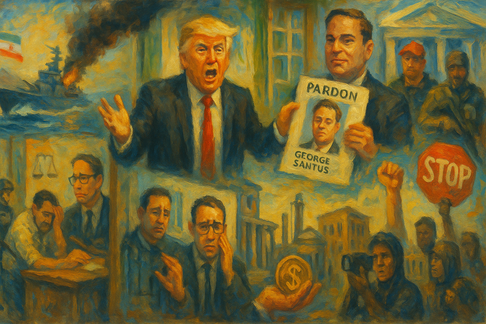

<!-- Generated by build_publish_week_v1 (appendix post) -->
<!-- Header image: image_wide_week65_appendix.png -->

# Week 65 Appendix: The Clock Holds, Barely

*A week of unchecked war powers, whistleblower retaliation, and religious spectacle ends where it began, held level only by scattered resistance.*

This week was defined by a collision of institutional rupture and executive spectacle: a unilateral naval blockade of the Strait of Hormuz that collapsed within days, a failed diplomatic mission followed by contradictory victory claims, and a president publicly attacking the Pope while posting AI-generated messianic imagery of himself. Simultaneously, the DOJ moved to erase January 6 seditious conspiracy convictions, fired immigration judges who ruled against the administration, and DNI Gabbard issued retaliatory referrals against a whistleblower and IG tied to Trump's first impeachment. Congress narrowly failed to check war powers (214-213) while passing bipartisan TPS protections and forcing two ethics-driven resignations (Swalwell, Gonzales). Hungary's decisive electoral rejection of Orbán—despite active Trump-administration campaigning for him—stood as a rare democratic counterpoint. The week reveals an administration simultaneously testing the limits of unchecked war-making, retaliating against internal accountability structures, and struggling with historically low approval ratings amid self-inflicted economic damage from the conflict.

Power and Authority

1. Trump promised mass pardons to advisers and officials near the Oval Office (2026-04-11): Blanket pre-emptive pardon promises to loyal officials would strip accountability from those closest to power and reward loyalty over lawfulness.

2. Trump ordered a naval blockade of the Strait of Hormuz and threatened to destroy Iranian infrastructure (2026-04-12): A unilateral executive order to blockade a critical waterway and threaten civilian infrastructure bypassed congressional war powers and risked global economic disruption.

3. Trump declared the Iran war over and claimed sweeping Iranian concessions on social media (2026-04-17): Repeated unverified victory claims, directly contradicted by Iranian officials, misrepresented the state of a major national security negotiation to the public.

4. Trump administration impounded congressionally appropriated PEPFAR and global health funds (2026-04-15) *[single source]*: Withholding funds Congress lawfully appropriated, found by GAO to violate federal impoundment law, undermines the constitutional separation of budgetary power.

5. Sean Duffy withheld $73.5 million in federal transportation funding from New York over an immigration dispute (2026-04-16): Using federal funding as a coercive tool against a state government over policy disagreement threatens fiscal federalism and punishes political opposition.

6. Trump threatened to fire Federal Reserve Chair Jerome Powell (2026-04-16): Threatening to remove the head of an independent monetary authority tied to an ongoing criminal investigation raises concerns about coercion and central bank independence.

7. Trump administration canceled an $11 million Catholic Charities contract serving migrant children (2026-04-16): Cutting funding for a decades-old charitable program shortly after religious leaders criticized war policy suggests retaliation against a critic using federal resources.

Institutions and Governance

1. Department of Justice terminated six immigration judges who ruled against the administration in deportation cases (2026-04-13) *[single source]*: Firing judges after adverse rulings against pro-Palestinian student deportations signals retaliation for judicial independence and chills future decisions.

2. DOJ moved to dismiss seditious conspiracy convictions of Proud Boys and Oath Keepers members from January 6 (2026-04-15): Erasing convictions for organized violent conspiracy against the Capitol removes legal accountability for an attack on the constitutional transfer of power.

3. Tulsi Gabbard issued criminal referrals against the 2019 Ukraine whistleblower and former Inspector General Michael Atkinson (2026-04-15): Targeting a whistleblower and the inspector general who lawfully processed his complaint threatens the independence of oversight mechanisms and chills future disclosures.

4. Pam Bondi defied a congressional subpoena and failed to appear for testimony on Epstein files handling (2026-04-14): A former attorney general's refusal to honor a lawful subpoena, and DOJ's claim it lapsed with her office, undermines congressional oversight power.

5. Anna Paulina Luna, House Democrats, House ethics committee moved to expel or investigate Reps. Eric Swalwell and Tony Gonzales over misconduct allegations (2026-04-13): Bipartisan expulsion proceedings against two sitting members reflect institutional self-policing power, though the underlying misconduct signals accountability gaps.

6. Rep. Eric Swalwell resigned from Congress amid sexual assault allegations (2026-04-13): A sitting congressman's resignation under threat of expulsion for serious misconduct allegations tests congressional accountability mechanisms.

7. Rep. Tony Gonzales resigned from Congress amid expulsion threat over an extramarital affair with a staffer who later died by suicide (2026-04-14): A second same-week congressional resignation under threat of expulsion reflects institutional consequences for misconduct, though highlights failures that preceded accountability.

8. 50 House Democrats led by Jamie Raskin introduced legislation to establish a 25th Amendment commission on presidential capacity (2026-04-14): A formal proposal to assess presidential fitness under the Constitution represents an extraordinary institutional check triggered by concerns over erratic conduct.

9. Jamie Raskin, Dave Min, Elizabeth Warren, Chuck Schumer introduced the Ban Presidential Plunder of Taxpayer Funds Act (2026-04-16) *[single source]*: Legislation targeting conversion of public funds via litigation settlements seeks to close a loophole enabling self-dealing by sitting officials.

10. House Democrats created a task force to investigate Trump family self-dealing and corruption (2026-04-16): Formal congressional investigation into potential presidential family self-dealing represents an oversight function checking executive corruption.

11. House Democrats led by Rep. Yassamin Ansari filed six articles of impeachment against Defense Secretary Pete Hegseth (2026-04-16): Impeachment articles alleging unauthorized war-making, war crimes, and retaliation against a senator invoke a constitutional check on military and executive misconduct.

12. Jamie Raskin launched a House Judiciary Committee investigation into Jared Kushner's conflicts of interest (2026-04-16) *[single source]*: Oversight investigation into a senior official's dual government and private financial roles addresses potential self-dealing during sensitive foreign negotiations.

13. Ketanji Brown Jackson publicly criticized the Supreme Court's use of emergency orders favoring the Trump administration (2026-04-15): A sitting justice's public rebuke of the Court's emergency docket practices signals internal institutional fracture over politicized judicial process.

14. California Supreme Court upheld the disbarment of Trump attorney John Eastman for his role in overturning the 2020 election (2026-04-16): Professional discipline of a key architect of the fake-elector scheme establishes rare accountability for efforts to subvert a presidential election.

15. Judge Richard Leon halted above-ground construction of a White House ballroom project (2026-04-16): A federal court limited an executive construction project after finding national-security justifications did not exempt it from legal review, and Trump publicly attacked the judge.

16. Kentucky Supreme Court and West Virginia judges blocked legislative attempts to impeach judges over unfavorable rulings (2026-04-15) *[single source]*: Courts affirmed judicial independence by halting legislative impeachment efforts targeting judges for their decisions, reinforcing separation of powers.

17. North Carolina, Pennsylvania, Tennessee, and Utah legislators threatened or attempted to impeach or remove judges over rulings on gerrymandering and voting access (2026-04-15) *[single source]*: Repeated legislative threats against judges who ruled on redistricting and voting access reflect a pattern of retaliation aimed at influencing judicial outcomes.

18. Russell Vought denied illegally withholding congressionally appropriated funds during Senate testimony (2026-04-16): The budget director's denial of documented impoundment practices, challenged by senators from both parties, tested congressional power of the purse.

19. House of Representatives narrowly rejected War Powers Resolutions seeking to constrain military action against Iran (2026-04-16) *[single source]*: A one-vote failure to invoke war powers oversight reflects the fragility of congressional checks on unilateral military escalation.

20. Bernie Sanders led a failed Senate effort to block weapons sales to Israel (2026-04-16) *[single source]*: A growing but still minority bloc of senators sought to constrain executive arms transfers, reflecting expanding congressional scrutiny of military aid policy.

21. House of Representatives passed bipartisan legislation extending Temporary Protected Status for Haitians (2026-04-16): A rare bipartisan legislative rebuke of the administration's deportation agenda protects hundreds of thousands from removal, pending Senate action.

22. House of Representatives initiated expulsion proceedings against multiple members amid misconduct scandals (2026-04-12): Announced expulsion votes for several representatives across party lines reflect an institution grappling with an accumulation of unresolved misconduct allegations.

23. Rep. Mike Turner declined to answer oversight questions on the Iran conflict, deferring to presidential tweets (2026-04-12) *[single source]*: A senior Armed Services and Oversight committee member's refusal to seek public accountability for a costly war reflects congressional abdication of war-powers scrutiny.

24. North Carolina Supreme Court declined to uphold the Leandro education-funding standard (2026-04-12) *[single source]*: A state high court's refusal to enforce established school-funding protections follows years of defunding public education in favor of private-school subsidies.

25. North Carolina General Assembly allocated $19 million to Crisis Pregnancy Centers without accountability oversight (2026-04-12) *[single source]*: Public funding for facilities providing no medical services and lacking oversight mechanisms raises fiscal transparency and accountability concerns.

26. Missouri voters approved a constitutional referendum mandating Kansas City spend 25% of its budget on policing (2026-04-12) *[single source]*: A statewide vote overriding a city's clear local preference on police spending constrains municipal fiscal autonomy and self-determination.

27. Harmeet Dhillon demanded Michigan election records from a county the president lost (2026-04-14) *[single source]*: A DOJ demand for election records targeting a Democratic-leaning jurisdiction, framed around unsubstantiated fraud claims, risks undermining confidence in vote administration.

28. Hennepin County Attorney charged an ICE agent with felony assault for pointing a gun at highway occupants (2026-04-17): A state prosecution of a federal immigration officer for alleged unlawful force affirms that no government actor is exempt from criminal accountability.

29. Todd Blanche declared the DOJ finished releasing Epstein-related documents (2026-04-14): An assertion that document production is complete, despite a statutory deadline miss and ongoing congressional demands, limits public and legislative access to records.

30. Democracy Defenders Fund, Colombo Hurd PL, Center for Biological Diversity, Democracy Forward Foundation, ACLU filed FOIA enforcement lawsuits against federal agencies for withholding records (2026-04-13): Multiple civil society lawsuits challenging agency non-compliance with transparency law seek to compel disclosure of records on visas, regulatory rollbacks, and election data sharing.

31. Federal courts issued a series of rulings on immigration, environmental, and detention-related lawsuits against the administration (2026-04-13): Ongoing litigation across multiple courts tested the legality of administration actions on deportation, historic preservation, press access, and detention facility construction.

32. Election Assistance Commission convened Standards Board and Local Leadership Council meetings addressing election administration threats (2026-04-16) *[single source]*: Federal election officials flagged uncertainty from a pending Supreme Court mail-ballot ruling and a proposed federal voter data-sharing network as threats to orderly election administration.

33. Supreme Court scheduled and structured oral argument in consolidated TPS and other pending cases (2026-04-17): Procedural orders allotting argument time in major immigration and product-liability cases shape how the Court will resolve challenges to administration policy.

34. Markwayne Mullin announced the departure of acting ICE Director Todd Lyons after criticism of enforcement conduct (2026-04-16): The exit of ICE's acting director amid allegations of unlawful force and constitutional violations reflects ongoing pressure over agency accountability.

Economic Structure

1. American farmers reported inability to afford fertilizer amid rising costs (2026-04-11) *[single source]*: Widespread farmer distress over unaffordable fertilizer reflects economic strain from tariff and trade policy failing a core constituency.

2. Labor Department, Bureau of Labor Statistics released data showing inflation rose to 3.3% and wholesale inflation to 4%, tied to war-driven fuel costs (2026-04-13) *[single source]*: Rising consumer and wholesale prices linked directly to military conflict show the domestic economic cost of unauthorized executive war-making.

3. Trump administration delayed refunding approximately $175 billion in illegally collected tariffs (2026-04-13) *[single source]*: Postponing repayment of tariffs a court found unlawful, while interest accrues at taxpayer expense, delays remedy for an invalidated executive action.

4. Trump threatened 50% tariffs on China over alleged arms shipments to Iran (2026-04-12): Threatened tariffs tied to unverified military allegations show trade policy used as an escalatory tool amid an active regional conflict.

5. Guardian reporting on gas price impacts documented gas prices rising to $4-5 per gallon nationally, straining vulnerable populations (2026-04-16): War-driven fuel price increases are degrading disabled, elderly, and low-income Americans' access to medical care, food, and employment.

6. Kevin Hassett stated oil company profits are an upside to painful inflation at the pump (2026-04-14) *[single source]*: A top economic adviser openly framing corporate profit gains as compensation for consumer price pain reveals administration priorities during an economic squeeze.

7. Popular Information reporting documented over $1 trillion in corporate tax breaks under the One Big Beautiful Bill alongside Medicaid and ACA cuts (2026-04-15) *[single source]*: Massive corporate tax reductions paired with health coverage losses for millions redistribute the tax burden away from capital toward vulnerable populations.

8. Sinan Kanatsiz solicited $500,000 donations for private meetings with Trump and threatened business exclusion for non-alignment (2026-04-16) *[single source]*: Selling direct presidential access for large political contributions, while warning of consequences for non-alignment, exemplifies pay-to-play governance.

9. US Senate voted to repeal a 20-year mining moratorium near Minnesota's Boundary Waters wilderness (2026-04-17): Reversing environmental protections to benefit a foreign-owned mining company prioritizes extractive industry profit over public lands stewardship.

10. Trump administration repealed the endangerment finding underpinning US climate regulations (2026-04-14): Eliminating the legal basis for federal greenhouse gas regulation removes decades of climate governance and rejects established scientific evidence.

11. Trump administration cancelled a California offshore wind project after a request from a climate-denial advocacy group (2026-04-14): Cancelling renewable energy investment at the direct request of a fringe science-denial organization shows special-interest capture of energy policy.

12. CO2 Coalition successfully nominated an unqualified ophthalmologist to a federal air pollution advisory committee (2026-04-14) *[single source]*: Placing an individual lacking relevant expertise on a scientific advisory body reflects the politicization of federal environmental and health governance.

13. Justin Sun accused Trump-linked World Liberty Financial of freezing his crypto accounts and blocking asset sales (2026-04-17): Allegations that a Trump-family crypto venture froze an investor's holdings raise questions of fraud and inadequate regulatory oversight of insider-controlled ventures.

14. 50501 movement, Consumer Financial Protection Bureau reported the administration terminated the CFPB's headquarters lease and sought to shrink the agency by two-thirds (2026-04-17): Dismantling a post-2008 consumer financial protection agency's infrastructure and staffing rolls back regulatory capacity built to prevent predatory practices.

Civil Rights and Dissent

1. ICE placed officers on leave after surveillance video contradicted their account of a shooting (2026-04-11): Video evidence exposing false statements by federal agents in a shooting case triggered rare potential accountability measures against ICE personnel.

2. State Department revoked green cards and arrested three Iranian nationals based on family ties to regime figures (2026-04-11) *[single source]*: Terminating legal residency status based on family association with foreign officials raises due process and guilt-by-association concerns.

3. We Are America March organizers and participants launched a 160-mile, multi-week march from Philadelphia to Washington (2026-04-11): A sustained public march to the capital demonstrates organized civic mobilization defending democratic norms through visible, nonviolent collective action.

4. Unite Here Local 11 threatened a strike during the World Cup over labor conditions and ICE presence (2026-04-11) *[single source]*: A labor union's strike threat tied to demands for excluding immigration enforcement from a global event links worker organizing to immigrant rights protection.

5. Philz Coffee announced then reversed a policy removing Pride flags after worker and public backlash (2026-04-11) *[single source]*: A corporate decision to remove LGBTQ+ symbols, later reversed under public pressure, reflects broader contested terrain over queer visibility amid hostile federal policy.

6. Jewish Voice for Peace, About Face: Veterans Against the War organized a sit-in protest at senators' offices demanding limits on weapons sales to Israel (2026-04-14) *[single source]*: Nearly a hundred arrests during civil disobedience aimed at congressional war-powers accountability reflect sustained anti-war organizing pressuring lawmakers.

7. AIDS activists and former USAID employees disrupted a congressional budget hearing protesting PEPFAR funding cuts (2026-04-15) *[single source]*: Protesters disrupting testimony over deadly global health funding cuts, resulting in arrests, highlight civil society resistance to policy causing mass preventable deaths.

8. Friends Committee on National Legislation organized a Capitol Hill lobby day opposing war funding (2026-04-15) *[single source]*: A coordinated constituent lobbying effort pressured Congress to exercise war-powers authority and oppose further military funding escalation.

9. 50501 movement, Coalition for Action in Higher Education organized a national day of action defending higher education from political interference (2026-04-17) *[single source]*: Nationwide campus mobilization responded to funding freezes and administrative pressure threatening academic freedom and institutional independence.

10. 50501 movement organized nationwide Tax Day protests against war funding, deportations, and private detention (2026-04-15) *[single source]*: Coordinated multi-city protests connected fiscal policy to immigration enforcement and military spending, applying visible public pressure on budget priorities.

11. ICE, De-ICE Citizens Bank campaign organized shareholder pressure targeting a bank financing private detention operators (2026-04-16) *[single source]*: Targeted corporate accountability campaigns sought to constrain private financial support for immigration detention infrastructure through shareholder pressure.

12. Ramsey County Attorney opened an investigation into ICE detention of a US citizen as potential kidnapping and false imprisonment (2026-04-14) *[single source]*: DHS's refusal to cooperate with a local investigation into unlawful detention of a citizen tests whether federal agents can evade state accountability.

13. ICE detained the wife of an active-duty US Army sergeant despite her legal protection status (2026-04-14): Detaining a legally protected immigrant married to a serving soldier, contrary to stated enforcement priorities, raises due process concerns for military families.

14. Florida Division of Emergency Management guards at a detention facility cut off phone access and used force against detainees in defiance of court orders (2026-04-17) *[single source]*: Detention personnel openly defying judicial protections for detainee communication and using force represent direct contempt of constitutional due process rulings.

15. DOJ applied a FACE Act religious-freedom provision to charge church protesters and a journalist for the first time (2026-04-16) *[single source]*: Selective enforcement charging anti-ICE protesters under a statute while abandoning its original reproductive-rights protections shows partisan weaponization of law.

16. ICE coordinated unauthorized 'wellness checks' by local police at Cincinnati schools without warrants (2026-04-15) *[single source]*: Federal-local coordination targeting immigrant children at schools without legal process chills access to education for vulnerable families.

17. Kentucky, North Carolina, Pennsylvania, Tennessee, Utah faced or issued threats to impeach judges over rulings protecting voting access and fair redistricting (2026-04-15) *[single source]*: A pattern of state-level legislative retaliation against judges enforcing voting rights and fair maps threatens electoral fairness nationwide.

18. North Carolina Board of Elections voted to send voter registration data to DHS for citizenship verification against a flawed federal database (2026-04-15) *[single source]*: Transmitting state voter data for cross-checking against an error-prone federal system risks disenfranchising eligible voters ahead of elections.

19. Tyler Bowyer proposed a coordinated relocation strategy to concentrate Republican voters in swing states (2026-04-12) *[single source]*: A proposal to engineer artificial electoral concentration through mass relocation undermines representative democracy based on genuine community residence.

Information, Memory and Manipulation

1. Trump posted mocking and inflammatory content about Iran during active peace negotiations (2026-04-11): Presidential social media conduct undermining the credibility of an ongoing diplomatic negotiation signals bad faith and damages the negotiating team's standing.

2. Trump posted, then deleted, an AI-generated image depicting himself as Jesus Christ, later falsely claiming it showed him as a doctor (2026-04-13): Using divine religious imagery for self-portrayal, then offering an implausible cover story, blurs sacred and political authority and normalizes public falsehood.

3. Trump posted an AI-generated image of a Trump Tower on the moon and an image of himself as Pope (2026-04-13): A rapid succession of surreal self-promotional images alongside religious content suggests deteriorating norms around presidential communication and reality itself.

4. Trump attacked Pope Leo XIV over criticism of the war, calling him weak and refusing to apologize (2026-04-12): Public presidential attacks on a major religious leader for criticizing military policy demonstrate intolerance of independent moral authority and attempts to control messaging.

5. Iranian government, pro-Iran social media accounts mocked Trump on state and pro-regime social media over the failed blockade and other claims (2026-04-13): Foreign state and aligned accounts mocking a failed U.S. military posture and spreading targeted propaganda demonstrates erosion of American credibility abroad.

6. DoorDash, White House staged a promotional photo op presenting a rehearsed delivery to Trump as a spontaneous encounter (2026-04-14) *[single source]*: Presenting a coordinated corporate-political stunt as an authentic encounter misleads the public about the nature of White House messaging.

7. Pete Hegseth attacked the press as unpatriotic and compared journalists to biblical Pharisees while restricting briefings to conservative outlets (2026-04-16): A senior defense official's religiously framed attacks on press scrutiny, combined with restricting access to friendly media, undermine independent oversight of military operations.

8. Trump posted unverified casualty figures about Iran protest deaths without evidence (2026-04-15): Disseminating unverified statistics to shape public and diplomatic narratives undermines factual governance and the information environment.

9. Peter Baker, New York Times reported that retired generals and diplomats expressed alarm over Trump's erratic conduct (2026-04-13): Mainstream reporting on concerns about presidential mental fitness from national security figures raises constitutional questions about capacity for office.

10. Trump made an unsubstantiated health claim comparing diet soda's grass-killing effect to curing cancer (2026-04-14) *[single source]*: A reported irrational medical claim recounted by a presidential adviser contributes to broader concerns about decision-making capacity affecting public health matters.

11. Objection.ai, Aron D'Souza, Peter Thiel launched a private AI-based tribunal to grade journalists and adjudicate media disputes (2026-04-17) *[single source]*: A billionaire-funded AI arbitration system pressuring journalists to submit source information for scoring threatens source protection and press independence.

12. RFK Jr. made false and racially charged statements about Black children and psychiatric medication during congressional testimony (2026-04-16): Documented statements characterizing Black children on medication as prone to violence and needing removal from families raise serious concerns about bias in public health leadership.

13. Trump administration installed election deniers in key government positions while removing officials who resisted 2020 overturn efforts (2026-04-17): Placing individuals who worked to overturn a legitimate election result into positions affecting election administration threatens future electoral integrity and memory of 2020.

14. Vance, Kushner, Witkoff reported classified diplomatic information from Iran talks daily to a foreign leader (2026-04-13) *[single source]*: A vice president's daily briefings on sensitive nuclear negotiations to a foreign prime minister raise concerns about handling of classified information and chain-of-command integrity.

15. Hungarian foreign minister shredded confidential government documents amid alleged ties to Russia (2026-04-14) *[single source]*: Destruction of official records by an outgoing foreign official obscures evidence of coordination with a foreign adversary and undermines post-election accountability.

