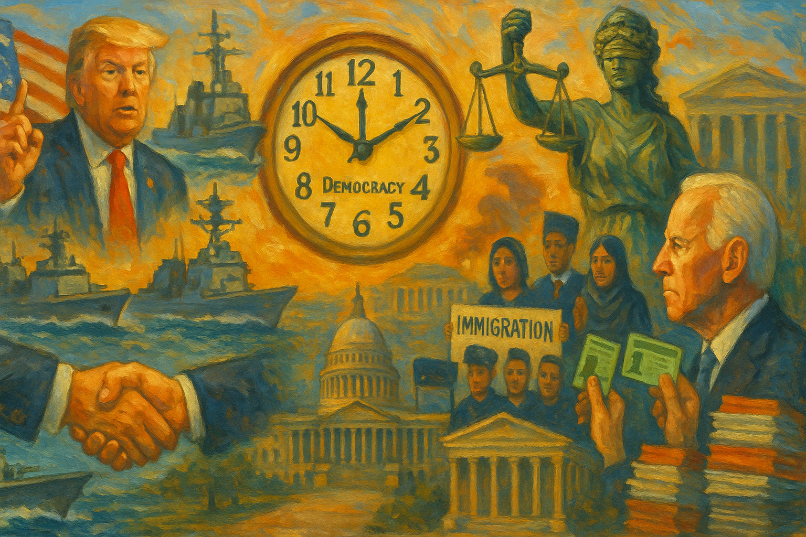

<!-- Generated by build_publish_week_v1 -->
<!-- Header image: image_wide_week65.png -->

# Week 65: Normalized Emergency Powers, Tiered Justice

*War by decree, elite-friendly clemency, and donor-shaped economics deepen an already high-risk authoritarian baseline, even as courts, Congress, and civil society fight defensively.*

> Authoritarianism often arrives not as a single rupture, but as the normalization of tools once reserved for emergencies. — Contemporary democratic observer
> When law becomes a favor for friends and a weapon for enemies, the republic has already changed its form. — Adapted from classical republican thought
> The danger is not only in what power does today, but in what tomorrow’s rulers will inherit as precedent. — Modern constitutional scholar

The sixty-fifth week of Trump’s second term unfolded as a study in consolidation rather than rupture. The tools that had defined earlier months—emergency powers, selective clemency, economic favoritism, and pressure on independent actors—were used again, but with a steadier hand. Foreign war, domestic law, and economic policy were treated as linked instruments, each available for personal bargaining and partisan gain. Against this, Congress, courts, and civil society mounted visible efforts to resist, yet mostly in a defensive posture. The Democracy Clock registered this as a week of deepening patterns rather than new descent.

At the close of the prior period, the Democracy Clock stood at 8:13 p.m. It remained at 8:13 p.m. at the end of Week 65, a net change of zero minutes. The stillness in the measure did not reflect stasis in events. It captured something else: the way entrenched practices—war by presidential fiat, law as shield for allies, economic design for donors, secrecy around power—continued without sharp escalation. Institutions pushed back in scattered ways, from disbarment of an election subverter to new protections for Haitian residents, but these efforts met a presidency already comfortable operating at the edge of constraint. That edge held firm.

Nowhere was that comfort more visible than in the Iran crisis. Early in the week, Trump warned that “a whole civilization will die tonight” if Iran defied him, language that moved beyond deterrence into the realm of annihilation. Within days he announced a complete U.S. naval blockade of Iranian ports and the Strait of Hormuz, a step with sweeping implications for global trade and energy prices. He then claimed that U.S. forces had obliterated most of Iran’s navy, boasting of sunk ships and broken capacity. These moves were not framed as war in the constitutional sense. They were presented as the president’s prerogative to act.

The pivot came just as abruptly. After days of blockade rhetoric and boasts of destruction, Trump announced a ceasefire framework that included joint management of the Strait of Hormuz with Iran. A waterway that had been treated as a flashpoint for confrontation was recast as a venue for personal dealmaking. The same voice that had threatened civilizational death now offered partnership, without a clear public account of terms, legal basis, or long‑term strategy. Major security arrangements, with direct effects on allies and markets, turned on the president’s own bargaining rather than on a visible process of debate and consent. The shift was sudden and opaque.

The domestic costs of this improvisational war posture were felt in prices and uncertainty. Inflation data showed consumer prices rising, with analysts tying the spike to energy shocks from the Middle East conflict. Producer prices climbed as well, feeding through to food and goods. At the same time, Iran continued to ship oil and negotiate over frozen funds, including talk of up to $20 billion in assets. The blockade’s limits were exposed even as its economic fallout spread at home. Yet when lawmakers pressed OMB Director Russ Vought for the war’s fiscal cost, he refused to give a clear number, leaving tens of billions of dollars in military spending shrouded in evasive testimony. The bills were real. The accounting was not.

Congress tried to reassert its role, but its tools fell short. War powers resolutions in both chambers sought to constrain Trump’s Iran operations, with a House measure failing by a single vote. Senator Bernie Sanders forced votes on resolutions to block U.S. weapons sales to Israel, drawing notable support but not enough to change policy. House Democrats filed six articles of impeachment against Defense Secretary Pete Hegseth, accusing him of unauthorized strikes, mishandling classified information, and retaliation against a senator. These actions signaled concern and offered a record of dissent, yet none altered the course of the war. Emergency powers were treated as normal, and Congress performed oversight more than it imposed it.

The same logic of personal discretion and factional loyalty shaped the week’s most consequential domestic legal moves. Trump commuted the prison sentence of George Santos, a political ally convicted of fraud and identity theft, and pardoned Binance founder Changpeng Zhao for anti–money laundering failures. Both acts were framed as corrections of past injustice or overreach, but their effect was to relieve well‑connected figures of full legal consequence. In parallel, Trump repeated his promise to pardon virtually everyone who had worked near him in the White House, describing clemency as an “absolute” power he would use to protect insiders. Loyalty, not law, was the through‑line.

The treatment of January 6 organizers marked a sharper break with prior accountability. Trump commuted the sentences of leading Oath Keepers and Proud Boys convicted for their roles in the attack on the Capitol, signaling that those who used violence to keep him in power would not bear the penalties imposed by courts. The Justice Department then moved to vacate seditious‑conspiracy convictions for Proud Boys and Oath Keepers leaders, reversing years of work by prosecutors and judges. Taken together, these steps told a clear story: organized political violence in service of Trump would be forgiven, even retroactively, while the machinery of law remained fully available for ordinary defendants. The double standard was stark.

Congressional hearings probed the broader pattern. Committees called Health Secretary RFK Jr. to testify about pardons for health‑care fraudsters and questioned whether contributions or proximity had shaped clemency decisions. Lawmakers also scrutinized Trump’s $1.5 trillion defense budget request, asking whether war spending and domestic cuts reflected coherent priorities or political theater. Courts, for their part, showed that some boundaries still held. Judges dismissed Trump’s multibillion‑dollar defamation suit against the Wall Street Journal and Trump Media’s case against the Guardian, reinforcing actual‑malice standards and signaling that civil litigation could not be used without limit to punish critical reporting. The courts drew a line.

One of the week’s rare, clear accountability moments came from the legal profession itself. The California Supreme Court disbarred John Eastman for his role in the 2020 election subversion effort, finding that his deceptive legal work to overturn results violated core duties of candor and integrity. In a landscape where many architects of that scheme had faced few consequences, Eastman’s disbarment stood out. It did not undo the broader pattern of clemency and DOJ reversals, but it showed that some institutions still insisted on truthfulness as a condition of professional power. That insistence mattered.

Beneath these headline acts, the administration worked to reshape the people and structures that interpret and apply law. The Justice Department fired several immigration judges who had blocked deportations of pro‑Palestinian students, replacing them after rulings that had granted protection. These judges occupied quasi‑judicial roles, meant to apply asylum law independently. Their removal sent a message that decisions disfavored by the administration could cost a career. At the same time, Republican lawmakers floated proposals to impeach judges whose rulings they opposed, turning a constitutional safeguard into a threat of partisan discipline. Judicial independence was treated as negotiable.

Other officials turned to the courts to contest their own ousters. Alvin Brown, removed from the National Transportation Safety Board, filed a quo warranto petition alleging that his dismissal was unlawful and racially motivated. His case asked judges to define the limits of presidential power to purge protected appointees. In Missouri, state leaders mandated that Kansas City devote a quarter of its budget to policing and restored state control over St. Louis police, curbing local authority over public safety priorities. These moves shifted power upward, away from communities and toward state and federal actors more aligned with the ruling coalition. Local checks grew weaker.

The consequences of this re‑aligned system were visible on the ground. In Minneapolis, surveillance video contradicted ICE agents’ account of a shooting, undermining their claim of a rapid, threatening confrontation and leading to dismissal of charges. The episode highlighted how official narratives can diverge from recorded fact, and how much depends on external oversight. Immigration authorities also revoked green cards from several Iranian nationals based on family ties to former regime figures, applying collective suspicion to legal residents. The D.C. Circuit, for its part, granted mandamus to halt a district court’s criminal‑contempt inquiry into deportation flights to El Salvador, prioritizing executive deliberative secrecy over a lower court’s effort to enforce its own orders. Democracy Docket and allied litigants responded with suits against mid‑decade gerrymanders and commentary on judge‑impeachment threats, while federal courts issued procedural rulings in labor, immigration, and press‑access cases. Independent actors still fought, but under growing pressure.

Information about how power was used became harder to obtain. Under Acting Attorney General Todd Blanche, the Justice Department stopped releasing Jeffrey Epstein files, despite a congressional subpoena and prior disclosures. The halt limited public insight into networks of elite misconduct and raised fears that politically sensitive material was being selectively buried. House Democrats moved toward holding former Attorney General Pam Bondi in contempt after she skipped a subpoenaed appearance on the same issue, underscoring how difficult it had become for Congress to enforce oversight even when formal tools were invoked. Subpoenas no longer guaranteed answers.

Across the executive branch, agencies faced multiple FOIA lawsuits for failing to respond to records requests. Litigants sued OMB, DHS, State, Commerce, USCIS, HHS, ORR, and the Election Assistance Commission, alleging systemic delays and inadequate searches on matters ranging from environmental designations to immigration programs and election practices. Specific cases challenged EPA air‑quality decisions, OMB’s handling of environmental and immigration records, and DHS’s “Gold Card” visa program. Democracy Docket published an explainer on tracking election‑related litigation, trying to give the public a map of how rules were being changed in court. The National Archives invited comment on proposed records schedules, offering a formal channel for citizens to weigh in on what should be preserved or destroyed. Yet even as these procedural avenues remained open, other governments offered a warning: in Hungary, whistleblower Péter Magyar alleged that Viktor Orbán’s outgoing administration had misused funds to support CPAC and shredded confidential documents, showing how regimes can blend public money with partisan projects and erase incriminating archives. The stakes of record‑keeping were plain.

The judiciary’s own transparency came under scrutiny. Justice Ketanji Brown Jackson publicly criticized the Supreme Court’s expanded use of unexplained emergency orders, warning that the “shadow docket” had repeatedly enabled controversial Trump policies without full briefing or reasoned opinions. Her remarks, echoed in coverage of the Court’s internal debate, highlighted how opaque procedures at the highest level could shape national policy while leaving little for the public record. Congress, meanwhile, passed a ten‑day extension of FISA Section 702, preserving broad warrantless surveillance authority while deferring reforms meant to protect Americans’ communications. Senators questioned Russ Vought about alleged illegal impoundment of funds and opened an investigation into Jared Kushner’s Middle East dealings, but these efforts again met a wall of partial answers and slow process. Visibility lagged far behind power.

Economic policy over the week made clear who benefited most from the state’s choices. The One Big Beautiful Bill cut deeply into Medicaid and Affordable Care Act funding, pushing millions off coverage and tying access to health care more tightly to employment and income. At the same time, the law granted generous corporate tax breaks—100 percent bonus depreciation, immediate expensing of research and development—that drove a sharp drop in federal corporate tax receipts and allowed many profitable firms to pay no federal income tax at all. The fiscal chassis shifted further toward capital, constraining resources for public goods and increasing economic precarity for those at the bottom. Inequality was built in.

The administration paired these structural shifts with symbolic gestures. A White House event, heavily backed by DoorDash, promoted a “no tax on tips” policy, featuring a gig worker as its face. The measure offered modest relief to a narrow slice of workers while leaving intact the low‑wage, unstable labor model that made tips essential. Meanwhile, Anschutz Corporation made seven‑figure donations to MAGA‑aligned Republican groups, amplifying corporate influence over agendas that included harsh immigration enforcement and anti‑LGBTQ measures. Turning Point USA’s political arm went further, soliciting $500,000 donations in exchange for a one‑on‑one meeting and private photo with Trump. Access to the president was not just informally linked to wealth; it was priced. The paywall was explicit.

Regulatory capacity was trimmed in ways that favored industry. The administration terminated the Consumer Financial Protection Bureau’s headquarters lease years early and moved to cut its staff to roughly one‑third of prior levels, sharply reducing federal ability to police consumer‑finance abuses. States restricted Medicaid coverage for GLP‑1 weight‑loss drugs, limiting access to obesity treatments for low‑income residents and trading short‑term budget savings for likely higher long‑term health costs. Inflation tied to the Iran conflict squeezed households, while survey data showed most farmers struggling to afford fertilizer. Hampshire College announced its permanent closure due to financial distress and low enrollment, illustrating how non‑elite higher‑education institutions were being pushed to the brink. Local governments and states offered partial counter‑moves—New York City approved a tax on ultra‑wealthy second‑home owners, Utah raised fines for retailers that chronically overcharged customers, and Congress passed a small‑business support act—but these steps were modest beside the scale of federal tax and spending redesign. The center of gravity stayed with donors and firms.

Immigration and citizenship policy reflected the same stratifying logic. Revoking green cards from Iranians based on family ties to former regime figures treated heritage as a proxy for threat. ICE’s Minneapolis shooting, where video undercut agents’ story, showed how lethal force could be justified through narratives later contradicted by evidence. Activists organized a national day of action against ICE warehouse detention, under the banner “Communities Not Cages,” protesting the expansion of carceral infrastructure in quasi‑industrial spaces. TSA tightened vetting rules for cybersecurity coordinators in surface transportation, requiring non‑U.S. citizens to hold trusted‑traveler status, a move framed as security but with implications for who could hold key technical roles. Status and trust were fused.

Surveillance powers remained broad. Congress’s short‑term extension of FISA Section 702 kept warrantless collection in place while debates over reform were postponed. Islamophobic rhetoric from Republican figures, including claims that Muslims “don’t belong in American society” and warnings about Sharia law, cast certain religious minorities as inherent threats. In Missouri, state takeover of big‑city policing and mandated police‑budget shares reduced local control in communities with large Black populations. The Justice Department’s firing of immigration judges who had protected pro‑Palestinian students added another layer, signaling that even within the legal system, outcomes for non‑citizens and dissenting voices would be shaped by ideological alignment. The House’s vote to extend Temporary Protected Status for about 350,000 Haitians, over administration objections, stood as a counter‑example: a legislative attempt to shield a vulnerable group from deportation in the face of executive hostility. Protection and punishment moved side by side.

Despite these pressures, formal institutions did not simply yield. Eastman’s disbarment, the House’s TPS extension, and Raskin‑led bills to create a standing 25th Amendment capacity commission all aimed to constrain executive power through law. The D.C. Circuit and a district judge limited White House ballroom construction, allowing underground security‑related work but blocking above‑ground expansion, showing that courts could still check presidential self‑aggrandizement. Bipartisan moves to expel Representatives Eric Swalwell and Tony Gonzales over alleged sexual misconduct, along with ethics investigations into both, demonstrated some willingness to police behavior within Congress itself. Self‑correction was uneven but present.

Legislation and litigation addressed other fronts. Congress enacted the Holocaust Expropriated Art Recovery Act of 2025, facilitating restitution of art stolen during the Holocaust and using law to address historical injustice. Lawmakers introduced bills to refund consumers for costs of illegal tariffs, seeking to repair harms from earlier executive overreach in trade policy. Federal courts processed election‑related and environmental suits involving the administration, while routine criminal cases—from the Gilgo Beach murders to a Florida manslaughter indictment and the January 6 pipe‑bomb suspect—showed that ordinary accountability continued alongside politicized matters. The FCC advanced a drone‑dominance initiative aligned with Trump executive orders, and Congress voted to overturn a Biden‑era mining ban near Minnesota’s Boundary Waters, prioritizing extraction over environmental protection. Senate questioning of Russ Vought over alleged illegal impoundment of funds, and McConnell’s public criticism of right‑wing fascination with Hungary’s elections, revealed that even within the same institutions, impulses toward restraint and capture coexisted uneasily. The struggle ran through, not just around, the state.

Civil society and culture formed the backdrop and, at times, the leading edge of resistance. The We Are America March, a 160‑mile trek from Philadelphia to Washington, D.C., sought to build visible, sustained opposition to authoritarian tendencies, using the act of walking together as a form of civic courage. A National Day of Action for higher education brought campus teach‑ins and protests against political interference and austerity, framing universities as key sites for democratic learning and dissent. Hampshire College’s closure gave these efforts a stark context: the institutions most committed to critical inquiry and progressive education were among the most financially vulnerable. The contrast was sharp.

Other groups organized along similar lines. The ACLU’s California arm held rapid‑response training on defending rights and institutions. Grassroots organizations staged Tax Day protests to highlight oligarchy and war spending, linking fiscal choices to democratic representation. Indivisible and allies planned “Communities Not Cages” protests against ICE warehouse detention, while North Carolina activists organized an anti‑war demonstration and a Day of Advocacy for public education at the state legislature. Students at Columbia filed a complaint alleging deceptive fossil‑fuel influence at a university think tank, pressing for honest academic inputs into climate policy. Bernie Sanders and New York City’s mayor launched the Union Now initiative to expand labor organizing in response to automation and inequality. Networks of resistance thickened.

Cultural figures and consumers added their own pressure. Bruce Springsteen used a Los Angeles concert to call for defending democracy and the Constitution, leveraging his platform to encourage vigilance against corruption and authoritarianism. Mass protests in Hungary against Viktor Orbán’s government, including anti‑Russian slogans, offered a foreign mirror of public mobilization against illiberal rule. Employees and customers of Philz Coffee forced the company to reverse a decision to remove Pride flags from its stores, showing how collective action could defend visible support for LGBTQ+ inclusion. At the same time, the administration’s own culture‑war messaging intensified: RFK Jr., as Health Secretary, defended anti‑vaccine positions and rolled back CDC pro‑vaccine outreach in a contentious hearing, while Trump attacked Pope Leo XIV’s peace‑oriented stance and circulated an image depicting himself as Jesus. Islamophobic rhetoric from GOP figures completed a picture in which religion and public health were tools in a broader struggle over identity and loyalty. Culture was a battleground, not a backdrop.

Around the edges of these larger currents, policy‑adjacent developments filled out the landscape. California YIMBY advocates promoted zoning and design reforms to enable denser, more appealing housing, seeking to broaden access to urban living. The DEA processed applications to import or manufacture controlled substances for research, reflecting a controlled but expanding space for work with psychedelics and cannabis. OSHA assumed safety authority at certain Department of Energy sites and revoked an obsolete marine‑terminal standard, rebalancing workplace protections and compliance costs. Reporting on lewd messages by a University of Michigan regent, in the context of campus protest tensions, raised questions about the credibility of officials shaping responses to dissent. Each of these items was small in isolation, but together they showed a society still arguing over how power should be used and who should be protected. The argument itself was a form of resilience.

No major, date‑certain decisions were scheduled that would immediately alter this balance, but several processes were in motion: war‑powers debates over Iran, FOIA and transparency suits across agencies, the Kushner investigation, and the 25th Amendment commission bills all moved through their respective channels, their outcomes uncertain yet structurally important. The near future was open, but not evenly so.

In the arc of Trump’s second term, Week 65 did not introduce new methods of control. It deepened those already in use. War was waged and paused through personal decree. Law was bent to favor allies and violent loyalists. Economic rules were written for donors and corporations, while social protections shrank. Information about these choices became harder to obtain, even as courts, Congress, and civil society worked to pry it loose. The Democracy Clock’s stillness captured a sobering reality: the system had settled into a higher‑risk state where authoritarian tools were normalized, and resistance, though real, operated on ground already tilted against it. The hour did not move, but the habits of power did.

<!-- Synopses for cross-posting -->
Long Synopsis: Week 65 of Trump’s second term saw consolidation rather than a fresh plunge. The Democracy Clock stayed at 8:13 p.m., reflecting not calm but the normalization of high-risk practices. Trump escalated and then abruptly de-escalated an Iran crisis—threatening civilizational annihilation, ordering a naval blockade, boasting of obliterating Iran’s navy, then announcing a joint management deal for the Strait of Hormuz—while refusing to disclose war costs as inflation rose. At home, clemency for George Santos, Changpeng Zhao, and January 6 leaders, plus Justice Department moves to vacate Proud Boys and Oath Keepers convictions, entrenched a two-tier justice system. Immigration judges were fired for protecting pro-Palestinian students, green cards were revoked from Iranians based on family ties, and FOIA stonewalling and halted Epstein disclosures deepened opacity. The One Big Beautiful Bill slashed health coverage while showering corporations and donors with tax advantages and access. Courts, Congress, and civil society registered real but mostly defensive resistance.
Short Synopsis: With the clock frozen at 8:13 p.m., Week 65 entrenched emergency war-making, elite-friendly clemency, politicized courts, and donor-driven economics, while fragmented institutions and civil society fought to preserve remaining constraints.

