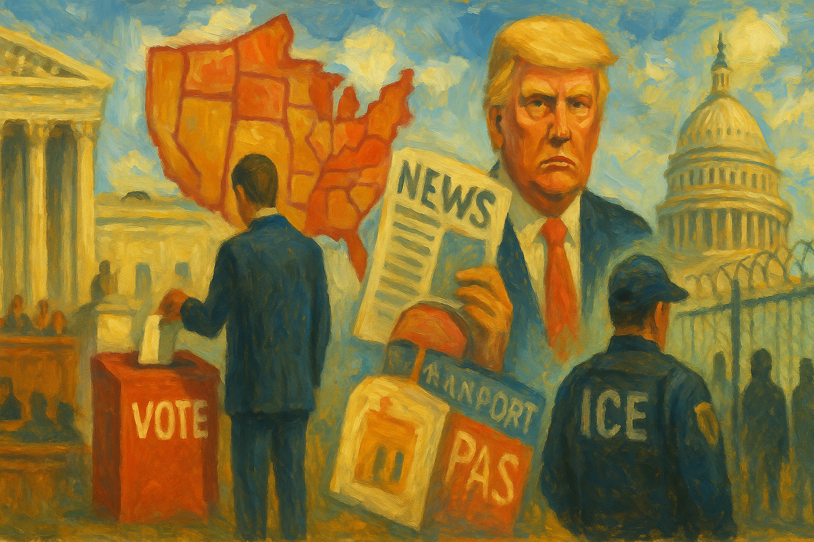

<!-- Generated by build_publish_week_v1 (appendix post) -->
<!-- Header image: image_wide_week67_appendix.png -->

# Week 67 Appendix: Maps, Monuments, and Leverage

*A voting-rights ruling, a president's building project, and selective legal pressure turned formal process into a method of democratic narrowing.*

This was a high-pressure week for democratic structure, defined less by one singular rupture than by the convergence of several authoritarian methods at once: legal retaliation, electoral restructuring, media intimidation, and executive aggrandizement. The most consequential development was the Supreme Court’s weakening of the Voting Rights Act, which immediately triggered partisan redistricting moves, election suspensions, and open efforts to dilute Black representation across multiple southern states. At the same time, the Justice Department appeared increasingly usable as a political instrument, with the Comey indictment, pressure on the National Trust over Trump’s ballroom, and the SPLC indictment all suggesting law deployed as leverage rather than neutral constraint. A parallel theme was personalization of the presidency: taxpayer-backed ballroom funding, Trump-branded passports, and continued use of office to advance family or personal interests. Immigration enforcement also intensified structurally through detention expansion, deaths in custody, inexperienced immigration judges, and major new funding without accountability safeguards. The week’s pattern is not simple chaos; it is coordinated pressure on oversight, pluralism, and the boundary between public power and private ruler interest.

Power and Authority

1. ICE planned a family detention facility at England Airpark in Louisiana on a contaminated site (2026-04-25): Placing detained families and children on a toxic site showed coercive state power over migrants with weak safeguards for health and bodily security.

2. President Trump pushed for a new White House ballroom after the White House Correspondents' dinner shooting (2026-04-26): The president used a security incident to press a major personal infrastructure project, expanding executive leverage over public space and spending priorities.

3. The Trump administration issued green card guidance that could penalize criticism of Israel and participation in pro-Palestinian protests (2026-04-25): The policy tied immigration status to political expression, using executive power to chill speech by noncitizens.

4. The Trump administration issued an executive order treating glyphosate production as a national security issue (2026-04-27): The order used emergency-style executive framing to protect a private industry, weakening normal regulatory and accountability checks.

5. President Trump justified military action against Iran without congressional approval by citing an imminent threat (2026-04-27): The move tested war-powers limits by asserting unilateral authority for armed conflict despite disputed intelligence and absent legislative approval.

6. The Trump administration blocked two permitted wind projects and redirected incentives toward oil and gas investment (2026-04-28): The decision used executive control over permits and subsidies to favor fossil fuels over already approved renewable projects.

7. The U.S. government announced America250 passports featuring Donald Trump's image (2026-04-28): Putting the president's image into a national identity document personalized state symbolism and blurred the line between public office and leader branding.

8. The Pentagon asked Congress to rename the Defense Department the Department of War (2026-04-29): The request signaled a more openly martial posture and sought to formalize it through state branding and structure.

9. President Trump issued an executive order establishing TrumpIRA.gov (2026-04-30): The order created a federal retirement platform by direct executive action, expanding presidential control over a new public-facing program.

10. President Trump issued an executive order to shift federal contracting toward fixed-price contracts (2026-04-30): The order used presidential authority to reshape procurement rules across agencies, affecting how public money is controlled and spent.

11. The Trump administration told Congress that hostilities with Iran had terminated while U.S. forces remained engaged in the region (2026-04-30): The claim sought to avoid war-powers constraints by redefining an ongoing conflict through executive assertion rather than congressional consent.

12. The Pentagon signed agreements with seven AI companies for military use of their technology (2026-05-01): The agreements expanded executive military capacity through private AI systems, raising accountability concerns over automated state power.

Institutions and Governance

1. Faith groups sued the Trump administration over ending immigration enforcement protections for places of worship (2026-04-25): The suit asked courts to review whether executive immigration policy unlawfully burdened religious practice and sanctuary efforts.

2. Do No Harm sued the federal government over the Native Hawaiian Health Scholarship Program (2026-04-25): The case challenged a congressionally created race-conscious program, putting judicial review over remedial public policy at issue.

3. Judge Kendrick Guidry recused himself from a Catholic church abuse case after a conflict of interest was disclosed (2026-04-25): The recusal highlighted the need for judicial disclosure and impartiality in cases involving powerful local institutions.

4. The U.S. Attorney's Office closed its criminal investigation into Federal Reserve Chair Jerome Powell (2026-04-25): Ending the case reduced immediate legal pressure on the central bank and affected perceptions of institutional independence.

5. Lawmakers proposed legislation to fund a White House ballroom with public money and customs fees (2026-04-29): The bills would have directed taxpayer resources to a president-backed project, testing legislative stewardship of public funds.

6. Congress enacted a resolution disapproving a Bureau of Land Management land-withdrawal rule in Minnesota (2026-04-27): The law showed Congress using formal review powers to reverse an agency rule on federal land management.

7. California organizers qualified a billionaire tax proposal for the November ballot (2026-04-27): The measure advanced through direct democracy, giving voters a formal role in deciding a major fiscal policy question.

8. Governor Ron DeSantis unveiled a plan to redraw Florida's congressional map (2026-04-27): The proposal used state institutional power to reshape representation before the midterms and set up a partisan redistricting fight.

9. House and Senate committees requested Secret Service briefings after the White House Correspondents' dinner shooting (2026-04-27): The requests asserted legislative oversight over a major security failure at an event involving top officials and the press.

10. The New York State Assembly considered the New York for All Act to limit local cooperation with federal immigration enforcement (2026-04-27): The bill would have used state law to set boundaries on local participation in federal immigration policing.

11. The House of Representatives considered a Farm Bill amendment to remove liability shields for chemical manufacturers (2026-04-27): The amendment tested whether Congress would preserve state warning laws and private lawsuits as tools of corporate accountability.

12. House Democrats called on President Trump to seek congressional approval for military action against Iran (2026-04-27): The demand defended Congress's constitutional role in authorizing war and checking unilateral executive force.

13. The Department of Justice pressured the National Trust for Historic Preservation to drop its lawsuit over Trump's ballroom (2026-04-27): The department used its institutional weight to push against litigation challenging a president-backed project, raising rule-of-law concerns.

14. The Tennessee attorney general halted a challenge to the state's abortion ban through a last-minute appeal (2026-04-27): The appeal delayed a trial over reproductive rights and showed how procedural moves can block judicial fact-finding on major rights claims.

15. The Supreme Court heard arguments in Monsanto v. Durnell over whether federal law preempted state glyphosate suits (2026-04-27): The case tested whether federal regulation would block state-level consumer lawsuits against a major chemical company.

16. Katie Phang sued the Department of Justice over alleged noncompliance with the Epstein Files Transparency Act (2026-04-27): The case sought judicial enforcement of disclosure duties and challenged executive withholding of records of public interest.

17. The Department of Justice indicted James Comey over an Instagram post with the numbers 86 47 (2026-04-28): The prosecution raised concerns that criminal process was being used against a political adversary over ambiguous expression.

18. The Senate Banking Committee prepared to vote on Kevin Warsh's nomination to chair the Federal Reserve (2026-04-28): The nomination fight centered on whether a key economic institution could remain independent from presidential pressure.

19. The Supreme Court heard cases on ending Temporary Protected Status for Haitians and Syrians (2026-04-29): The arguments tested judicial review of executive immigration decisions affecting hundreds of thousands of lawful residents.

20. The Oregon Supreme Court required dismissal of charges when defendants waited too long for appointed counsel (2026-04-28): The ruling enforced the right to counsel and exposed structural failure in the state's criminal defense system.

21. The D.C. Circuit held AFSCME's case against Trump in abeyance pending related appeals (2026-04-28): The order changed the pace of a challenge to administration action and showed how appellate procedure can delay institutional review.

22. A Nigerian medical student sued USCIS over an indefinite hold on her work authorization application (2026-04-28): The case challenged agency delay and asked courts to police statutory limits on immigration administration.

23. Judge Oliver denied the administration's motions in the prison-locals case and let the suit proceed (2026-04-28): The ruling preserved judicial review of claims that executive action retaliated against protected union activity.

24. Judge Furman denied the government's motion to dismiss Maurene Comey's wrongful-removal case (2026-04-28): The decision kept a civil service removal dispute in federal court and limited the administration's effort to reroute review.

25. The Second Circuit affirmed habeas relief for Ricardo da Cunha and held that his detention allowed bond review (2026-04-28): The ruling constrained mandatory immigration detention and reinforced judicial oversight of custody rules.

26. The House Oversight Committee filed a civil contempt resolution against Pam Bondi after she skipped a deposition (2026-04-29): The move asserted Congress's power to enforce subpoenas and compel testimony in an executive-branch investigation.

27. The Senate Banking Committee advanced Kevin Warsh's nomination for Federal Reserve chair (2026-04-29): The vote moved forward a nominee whose independence from the president was under dispute, affecting confidence in central bank autonomy.

28. The House Armed Services Committee held a hearing with Pete Hegseth (2026-04-29): The hearing used congressional process to question military leadership and executive conduct in wartime matters.

29. A federal judge dismissed the DOJ's lawsuit seeking Arizona voter-roll data (2026-04-29): The ruling protected voter privacy and limited federal attempts to compel state election records without clear legal authority.

30. Federal prosecutors moved to detain Cole Tomas Allen pending trial (2026-04-29): The filing showed the courts processing a major political-violence case through ordinary pretrial detention procedures.

31. Acting Attorney General Todd Blanche moved to dissolve the injunction blocking Trump's ballroom construction (2026-04-29): The motion pressed the courts to clear a president-backed project despite ongoing legal objections about process and authority.

32. Protect Democracy Project sued the IRS over records tied to directives designating Antifa as a domestic terrorist organization (2026-04-29): The FOIA suit sought court enforcement of disclosure duties around politically sensitive internal directives.

33. The EEOC announced a closed meeting to discuss participation in civil litigation (2026-04-30): The notice showed an agency using lawful closed-session procedures while limiting public visibility into enforcement strategy.

34. Congress set a deadline for the temporary extension of FISA Section 702 (2026-04-30): The deadline forced lawmakers to confront whether to renew broad surveillance powers and under what safeguards.

35. Congress enacted the Homeland Security and Further Additional Continuing Appropriations Act (2026-04-30): The law restored funding continuity for a major department and ended a damaging institutional standoff over appropriations.

36. The Senate Armed Services Committee questioned Pete Hegseth about the Iran war and military conduct (2026-04-30): The hearing tested whether Congress could obtain accurate information and exercise oversight over an unauthorized conflict.

37. President Trump signed a bipartisan bill ending the Department of Homeland Security shutdown (2026-04-30): The law restored agency operations after a long funding impasse, showing how budget brinkmanship can disrupt core governance.

38. Congress extended and reauthorized FISA Section 702 surveillance powers (2026-05-01): Lawmakers renewed warrantless surveillance authority despite unresolved privacy objections, expanding the state's information-gathering powers.

39. The House Ethics Committee opened an investigation into Representative Chuck Edwards (2026-04-30): The inquiry showed Congress using internal ethics machinery to examine alleged misconduct by a sitting member.

40. The Supreme Court issued a ruling in Louisiana v. Callais that weakened Section 2 of the Voting Rights Act (2026-04-29): The decision narrowed a core federal protection against racial vote dilution and shifted power toward state mapmakers.

41. The Second Circuit refused to rehear Donald Trump's appeal in the E. Jean Carroll defamation case (2026-04-30): The court left in place a major verdict against a former president, reinforcing that high office does not erase civil accountability.

42. Judge Brown dismissed a detention-conditions case after the administration agreed to improve conditions at the Central Islip Hold Room (2026-04-30): The dismissal reflected court pressure producing administrative changes in detention practices without a full merits ruling.

43. The Fifth Circuit restricted access to mifepristone by blocking mail distribution and restoring in-person dispensing rules (2026-05-01): The ruling curtailed nationwide access to abortion medication and narrowed the practical reach of federal drug regulation.

44. The ACLU, voting-rights groups, and Lindsey Garcia filed state and federal suits to restore Louisiana's suspended congressional primaries (2026-05-01): The lawsuits asked courts to stop executive disruption of an active election and enforce state and federal election rules.

45. Judge Ho postponed the termination of Yemen's Temporary Protected Status in two cases (2026-05-01): The orders checked executive immigration action by requiring lawful consultation and reasoned decision-making before ending protections.

Economic Structure

1. Utah's Military Installation Development Authority approved reduced tax rates for Kevin O'Leary's data center project (2026-04-25): The subsidy decision showed public authorities using tax policy to favor a large private project with broad resource impacts.

2. The FDA announced a public advisory meeting on the 2026-2027 COVID-19 vaccine formula (2026-04-27): The notice opened a federal health-policy decision to public comment and expert review, supporting accountable rulemaking.

3. The FDA renewed the Anesthetic and Analgesic Drug Products Advisory Committee (2026-04-27): Renewing the committee preserved expert input into federal drug regulation and public-health oversight.

4. OSHA clarified that federal OSHA would enforce safety rules for private-sector work on federal property in Maryland (2026-04-27): The notice defined regulatory jurisdiction for worker safety and clarified which level of government would enforce protections.

5. The Trump administration awarded a $17.4 million no-bid contract for Lafayette Park fountain repairs (2026-04-27): Using an urgency exception for a costly no-bid contract weakened procurement transparency and accountability for public spending.

6. EPA Administrator Lee Zeldin defended the agency's deregulatory agenda at a House hearing (2026-04-27): The hearing highlighted how regulatory rollback and possible industry ties can shift agencies away from public-protection goals.

7. U.S. fuel markets reached a four-year high in gas prices amid the Strait of Hormuz deadlock (2026-04-27): The price spike showed how conflict and executive foreign-policy choices can quickly impose broad economic costs on the public.

8. Kalshi and Polymarket faced scrutiny over claims that they had prevented or detected insider trading (2026-04-27): The dispute exposed weak self-policing in prediction markets and raised questions about oversight of new financial platforms.

9. The House Appropriations Interior and Environment Subcommittee heard testimony on proposed EPA budget cuts of about 52% (2026-04-28): The proposed cuts threatened the state's capacity to enforce environmental rules and provide public-health protections.

10. The CDC submitted an overdose-data collection request to OMB (2026-04-28): The request maintained a federal data system used to track overdose trends and guide public-health policy.

11. The CDC submitted a chest x-ray data collection request for miners to OMB (2026-04-28): The request supported occupational health surveillance and the state's ability to monitor mining-related disease risks.

12. The DEA rescheduled FDA-approved marijuana products to Schedule III (2026-04-28): The rule changed the federal regulatory framework for approved cannabis medicines and affected research and market access.

13. The EPA released interim PFAS destruction and disposal guidance for public comment (2026-04-28): The guidance opened a hazardous-waste policy question to public input and shaped future environmental enforcement standards.

14. OSHA revoked the Open Fires in Marine Terminals Standard (2026-04-28): The repeal reduced a workplace safety rule and reflected a broader deregulatory approach to labor protections.

15. OSHA sought comments on revising information collection for the Voluntary Protection Programs (2026-04-28): The notice adjusted how workplace-safety compliance data would be gathered, balancing oversight with administrative burden.

16. The Trump administration loosened export controls on AI chips to China (2026-04-28): The policy shifted the balance between industrial strategy, national security, and commercial access in a key technology sector.

17. Maryland lawmakers passed legislation to limit utility CEO pay (2026-04-29): The law used state regulation to respond to rising utility costs and strengthen consumer accountability in a concentrated sector.

18. The EPA approved Missouri's partial delegation of a Clean Air Act risk-management program (2026-04-29): The approval shifted some enforcement authority to the state while preserving federal oversight over other hazards.

19. The EPA published findings allowing certain new chemicals and significant new uses to proceed (2026-04-29): The findings let manufacturers move ahead under federal chemical law, shaping how precaution and market access are balanced.

20. The FCC opened several information-collection reviews and submissions under the Paperwork Reduction Act (2026-04-29): The notices adjusted compliance and reporting rules for communications firms, affecting regulatory burden and transparency.

21. The FDA requested information on an AI-enabled early-phase clinical trials pilot program (2026-04-29): The request explored how AI could be folded into drug development under federal oversight, with implications for safety and speed.

22. President Trump used the presidency to promote family business interests repeatedly (2026-04-29): The pattern blurred public office and private gain, weakening confidence that economic policy and presidential messaging were separated from self-enrichment.

23. The EPA released its draft FY 2027 Evidence Plan for public comment (2026-04-30): The plan invited outside input on how the agency would build evidence for future policy choices, supporting procedural accountability.

24. The FDA renewed the Pharmacy Compounding Advisory Committee (2026-04-30): The renewal preserved expert review in a technical area of drug regulation that affects safety and market oversight.

25. The EPA announced a proposed settlement for the Goodrich Asbestos Superfund Site (2026-04-30): The settlement used federal cleanup law to recover some costs from a responsible party and maintain environmental accountability.

26. The FCC issued radio and broadband technical rules and paperwork notices (2026-04-30): The actions adjusted communications infrastructure rules that shape market access, local service, and compliance costs.

27. The FDA issued several device classifications and drug determinations and opened multiple regulatory dockets (2026-04-30): The actions changed market pathways for medical products and showed routine federal control over safety, evidence, and competition.

28. OSHA extended information-collection approvals for anhydrous ammonia handling (2026-04-30): The extension maintained a federal reporting regime tied to hazardous workplace practices and safety enforcement.

29. Donald Trump Jr. and Eric Trump acquired a stake in a U.S.-backed mining venture that had received major administration support (2026-04-30): The deal deepened concerns that state-backed economic policy was benefiting the president's family network.

30. President Trump removed tariffs on Scottish whiskey (2026-04-30): The tariff change altered trade policy through executive action and affected favored industries and cross-border market access.

31. The Trump administration prepared a Qatari jet for Donald Trump with taxpayer-funded upgrades (2026-04-30): Using public funds to upgrade a luxury aircraft tied to the president raised conflict-of-interest and public-spending concerns.

32. California's YIMBY movement and state lawmakers advanced housing reforms that expanded accessory dwelling units and new housing construction (2026-05-01): The reforms showed state policy being used to loosen local barriers and increase housing supply through legislative change.

33. States enacted school phone bans (2026-05-01): The laws used state regulatory power to shape school conditions and respond to social harms linked to digital platforms.

34. The DEA placed four synthetic cannabinoids into Schedule I (2026-05-01): The rule expanded federal drug controls over substances deemed dangerous, affecting criminal penalties and market access.

35. The EPA published a notice of available environmental impact statements (2026-05-01): The notice supported public access to environmental review materials that inform federal project decisions.

36. The FDA opened several notices on device exemptions, patient-focused drug development, compounding, and obesity dosing (2026-05-01): The notices shaped how medical products would be regulated and how public input would enter federal health policy.

37. OSHA announced construction safety meetings and extended fire-brigade information collection approval (2026-05-01): The actions maintained federal workplace-safety processes and public participation in rulemaking for hazardous jobs.

38. The TSA extended information collection for the Reimbursable Screening Services Program (2026-05-01): The extension preserved a program that lets public and private entities buy federal screening services, shaping security markets and access.

39. President Trump announced new 25% tariffs on European cars and trucks (2026-05-01): The tariffs used executive trade power to reshape prices and international commercial relations with broad domestic spillovers.

40. AI adoption reduced employment growth in coding jobs (2026-05-01): The shift showed how new technology can alter labor markets faster than institutions adapt, with consequences for economic security.

41. The United States reached a level of public debt above 100% of GDP (2026-05-01): The milestone underscored long-term fiscal strain and the limited political capacity to address structural budget pressures.

42. The Trump administration dismantled most of the EPA's research arm and aligned remaining work with administration priorities (2026-05-01): The cuts weakened independent scientific capacity inside a regulator and made evidence production more vulnerable to political control.

43. Host cities and public agencies committed taxpayer support for FIFA World Cup costs (2026-05-01): The subsidies shifted financial risk from a wealthy private event organizer onto the public with uncertain local return.

44. The Trump administration issued guidance that deemphasized contraceptives and favored natural family planning (2026-05-01): The guidance used federal health policy to steer access and information in ways that could reduce practical reproductive autonomy.

Civil Rights and Dissent

1. An Egyptian family of six was taken back into ICE custody before a judge blocked its deportation (2026-04-25): The case showed how immigration enforcement can threaten family unity and due process until courts intervene.

2. Faith leaders were arrested while protesting ICE operations at the Minneapolis airport (2026-04-25): The arrests showed protest activity colliding with immigration enforcement and raised concerns about the policing of dissent.

3. All four Black House Republicans announced plans to leave Congress next year (2026-04-25): Their departure reduced Black representation within one party caucus and highlighted narrowing descriptive diversity in Congress.

4. ICE resumed detaining immigrant families, including children, at the Dilley center in Texas (2026-04-27): The policy expanded coercive detention of families and children, increasing rights and welfare concerns for migrants.

5. Protest organizers held more than 200 demonstrations against ICE detention facilities across the country (2026-04-27): The protests showed broad civil-society mobilization against detention expansion and immigration enforcement practices.

6. Wizards of the Coast employees filed for a union election (2026-04-27): The filing used labor law to seek collective bargaining power over layoffs, remote work, and AI-related workplace change.

7. The Senate advanced a budget resolution for major new ICE and Border Patrol funding without added accountability measures (2026-04-28): The vote moved toward expanding enforcement capacity while rejecting safeguards tied to warrants, identification, and abuse review.

8. The Florida legislature passed a new congressional map after the Supreme Court's voting-rights ruling (2026-04-29): The map used weakened federal protections to reshape representation in ways critics said would dilute minority voting power.

9. Senator Marsha Blackburn urged Tennessee lawmakers to redraw the state's congressional map (2026-04-29): The call sought to use redistricting to erase a Democratic and historically Black district, threatening minority political voice.

10. Georgia Attorney General Chris Carr brought new charges against three Cop City protesters (2026-04-29): The prosecution revived criminal exposure for activists and raised concerns about using legal process to deter protest movements.

11. Alabama officials said they would apply the Supreme Court's voting-rights ruling to redistricting (2026-04-30): The response signaled rapid state use of the ruling to revisit maps affecting Black representation.

12. Louisiana officials postponed congressional primaries after the Supreme Court's voting-rights ruling (2026-04-30): Delaying an active election disrupted voter expectations and tied ballot access to a rushed redistricting process.

13. Mississippi Governor Tate Reeves called a special session on redistricting (2026-04-30): The move opened the door to map changes that civil-rights groups feared would weaken Black voting power.

14. Governor Brian Kemp said Georgia would not redistrict before the 2026 midterms (2026-04-30): The decision preserved existing maps for the coming election cycle and delayed another round of representation changes.

15. The House advanced a budget resolution paving the way for about $70 billion in new immigration enforcement funding (2026-05-01): The vote moved toward a large expansion of detention and border enforcement capacity with major civil-liberties implications.

16. The California Democratic Party chair called for changes to the state's open primary system (2026-05-01): The proposal reflected concern that election rules could distort party competition and representation under the current system.

17. May Day organizers planned nationwide rallies, marches, walkouts, and labor actions (2026-05-01): The mobilization showed large-scale collective action around labor rights, immigrant rights, and economic inequality.

Information, Memory and Manipulation

1. Major media outlets misreported key facts about the White House Correspondents' dinner shooting (2026-04-25): The errors showed how fast-moving crises can distort the public record and weaken trust in shared facts.

2. President Trump attacked Norah O'Donnell in an edited 60 Minutes interview (2026-04-26): The episode combined hostility toward a journalist with concerns about edited presentation of a politically sensitive interview.

3. The FCC forced ABC and Disney to accelerate broadcast license renewals after pressure tied to Jimmy Kimmel's comments (2026-04-28): The move used regulatory power against a media company after criticism of the president's family, raising retaliation concerns.

4. President Trump commented on the Van Dyke insider-trading case in ways that downplayed misuse of classified information (2026-04-27): The remarks risked normalizing official corruption by softening public judgment about profiteering from secret state information.

5. The FCC announced an open commission meeting on telecom security, robocalls, and related issues (2026-04-28): The notice set a public agenda for communications policy that affects access, security, and the information environment.

6. The FBI announced a meeting of the CJIS Advisory Policy Board (2026-04-28): The meeting concerned governance of national criminal-information systems that shape how state data is shared and used.

7. The FCC sought comments on information collection for Text-to-911 service (2026-04-29): The notice addressed emergency communications access and how public information systems serve disabled users and the wider public.

8. President Trump delivered a speech redefining American identity around ancestry and heritage (2026-04-29): The speech used presidential rhetoric to recast national identity and public memory in exclusionary terms.

9. Objection AI launched an AI system to judge complaints against journalists and media outlets (2026-04-30): The project sought to insert a private, opaque scoring system into public trust in journalism and source protection.

10. Satellite imagery contradicted President Trump's claims about collapsing Iranian oil infrastructure (2026-05-01): The mismatch highlighted the role of independent evidence in checking official narratives about war and economic pressure.

