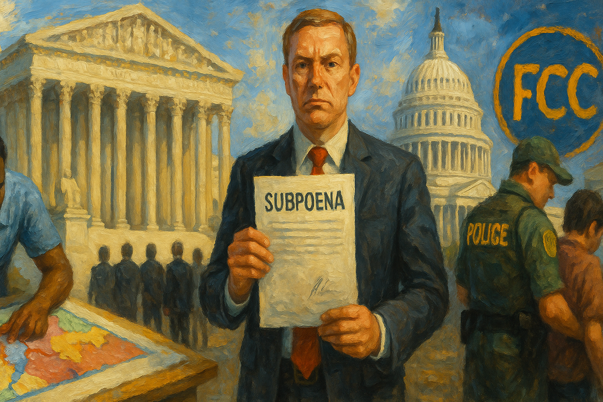

<!-- Generated by build_publish_week_v1 (appendix post) -->
<!-- Header image: image_wide_week68_appendix.png -->

# Week 68 Appendix: The Ruling That Moved in Days

*A single voting-rights ruling reshaped congressional maps within a week while courts and critics scrambled to keep pace with the damage.*

This was a rupture week in which the Supreme Court's Callais decision gutting Section 2 of the Voting Rights Act cascaded into immediate, coordinated state action to eliminate minority representation. Louisiana suspended an active election; Tennessee repealed a 50-year redistricting law in a single day to dismantle its only Black-majority district; Alabama and other states moved in parallel. Simultaneously, the administration escalated retaliatory prosecution (Comey, SPLC, Patel's lawsuit against journalists), continued an undeclared and increasingly incoherent war with Iran (blockade contradictions, a 24-hour ultimatum followed by reversal, CIA assessments contradicting public claims), and normalized presidential self-glorification (AI imagery, monument insertion, ballroom funding). Courts offered mixed resistance—blocking mifepristone restrictions and Arizona voter-data seizure, but also striking down Virginia's voter-approved maps. The week shows redistricting as the era's dominant authoritarian mechanism, paired with executive impunity and information manipulation.

Power and Authority

1. Harmeet Dhillon and DOJ officials signaled the Justice Department will use the Callais ruling to attack voting rights and redraw maps nationwide (2026-05-02) *[single source]*: Federal officials moved quickly to weaponize a Supreme Court ruling against districts protecting minority voting power, showing coordinated federal intent to reshape representation nationwide.

2. Trump urged states to redraw congressional maps mid-election cycle for partisan gain (2026-05-03) *[single source]*: A sitting president explicitly pushed states to change electoral maps while voting was underway, undermining the principle of stable, neutral election administration.

3. Trump administration claimed the Iran war had "terminated" to avoid War Powers Resolution compliance despite continuing a naval blockade (2026-05-03): The administration asserted an ongoing military blockade did not constitute war, evading congressional war-powers oversight and testing separation-of-powers limits on military action.

4. Trump expanded the National Garden of American Heroes monument project beyond congressional appropriation (2026-05-03): A federally funded monument project grew far beyond its $40 million congressional approval, raising concerns about unchecked executive spending on personal legacy projects.

5. Trump administration took control of a public D.C. golf course to build a private championship course and sculpture park without congressional approval (2026-05-04): Public recreational land was converted for a presidential vanity project without legislative authorization or public review, illustrating executive overreach into public resources.

6. Trump characterized the naval blockade of Iran as the "greatest military maneuver in history" and threatened to destroy Iranian ships (2026-05-04): Public threats of massive military force against a foreign power, paired with contradictory legal claims that the war had ended, reflect unstable and unchecked exercise of executive military authority.

7. Trump issued a 24-hour ultimatum to Iran threatening a massive air strike (2026-05-04): A public presidential ultimatum threatening large-scale war escalation raises constitutional questions about unilateral war-making power without congressional authorization.

8. Defense Department withdrew 5,000 troops from Germany as apparent retaliation for the German chancellor's criticism of Iran policy (2026-05-03): Reallocating military forces in apparent response to an ally's criticism undermines alliance stability and shows military decisions driven by personal grievance rather than strategy.

9. Trump announced and then abruptly halted "Project Freedom," a major military operation to escort ships through the Strait of Hormuz (2026-05-06): A large-scale military operation was announced without consulting key allies, then reversed within 36 hours after Saudi Arabia blocked base access, revealing incoherent and unilateral military decision-making.

10. Trump threatened an escalated bombing campaign against Iran if it did not agree to U.S. demands (2026-05-06): Continued public threats of major military escalation against a foreign nation, without congressional authorization, sustain unchecked executive control over war decisions.

11. Tennessee General Assembly and Gov. Bill Lee called a special session, repealed a 1972 law banning mid-decade redistricting, and passed a new map within days to eliminate the state's only majority-Black district (2026-05-07) *[single source]*: A state government used emergency procedure to erase minority representation with minimal public input, exemplifying rapid, coordinated executive-legislative action against voting rights nationwide.

12. Alabama governor Kay Ivey called for redistricting despite a federal court injunction forbidding it before 2030 (2026-05-07) *[single source]*: A governor urged defiance of a standing federal court order to redraw maps and eliminate minority districts, undermining judicial authority and the rule of law.

13. Louisiana officials (Gov. Jeff Landry) suspended an active congressional primary election midstream to allow redistricting (2026-05-02): A state suspended an ongoing election to enable partisan map redrawing, disrupting electoral continuity and testing the boundary of executive authority over voting.

14. Trump posted repeatedly attacking Hakeem Jeffries, calling for his impeachment despite no legal basis, and invoking his own past impeachments (2026-05-04) *[single source]*: Presidential attacks calling for the improper impeachment of a congressional leader, paired with grievance-driven rhetoric, degrade norms of institutional respect between branches of government.

15. JD Vance threatened to withhold federal Medicaid and Medicare funding from states that do not comply with administration-directed fraud audits (2026-05-08): Coercive threats to cut off health funding for noncompliance with executive-directed investigations raise separation-of-powers concerns and endanger healthcare access for millions.

Institutions and Governance

1. Wes Allen (Alabama Secretary of State) filed motion to expedite Alabama's redistricting case following the Callais ruling (2026-05-02) *[single source]*: A state official sought accelerated court review to reshape congressional maps in the administration's favor, using new precedent to weaken minority voting protections.

2. Florida court delayed a pending racial gerrymandering ruling to reconsider it under the new Callais standard (2026-05-02) *[single source]*: A court paused a near-final decision protecting minority voters to reassess it under a weaker legal standard, showing how one ruling destabilized ongoing voting rights litigation nationwide.

3. Indiana state defendants filed motion to dismiss a voting rights case using the Callais precedent (2026-05-02) *[single source]*: State officials moved swiftly to dismantle a pending voting rights claim, showing how quickly a single court ruling can be used to eliminate protections for minority voters nationwide.

4. Voting rights plaintiffs filed lawsuit alleging Louisiana unlawfully nullified votes by suspending its primary (2026-05-02) *[single source]*: Civil society groups challenged a state's suspension of an active election as unconstitutional vote nullification, testing judicial limits on executive control over elections.

5. Mississippi federal court ordered new briefing on a settled Voting Rights Act case following the Callais decision (2026-05-02): A previously decided win for minority voters was reopened for reconsideration, illustrating the destabilizing reach of a single Supreme Court ruling into settled litigation.

6. Louisiana redistricting plaintiffs urged courts to swiftly implement a new map to prevent further electoral disruption (2026-05-02): Voting rights advocates pushed courts to act quickly to limit harm from the legal uncertainty created by the weakened Voting Rights Act standard.

7. ACLU and Louisiana voting rights groups filed suit to block the governor's suspension of the congressional primary (2026-05-02) *[single source]*: Civil rights organizations sought a court order preventing an unprecedented executive suspension of an active election, testing whether state courts can check gubernatorial overreach.

8. Federal court blocked mail access to mifepristone (2026-05-02): A court restricted access to a medication used in most U.S. abortions, directly affecting reproductive healthcare access nationwide.

9. SCOTUS issued the Callais v. Louisiana decision gutting Section 2 of the Voting Rights Act (2026-05-03): The Supreme Court imposed a stricter standard on voting rights claims that legal experts say renders core protections against racial vote dilution unenforceable in practice.

10. Alabama and Louisiana legislatures moved to redraw congressional maps eliminating majority-minority districts held by Black Democrats (2026-05-03) *[single source]*: Two states acted immediately after a Supreme Court ruling to erase districts that had protected Black representation in Congress, reducing minority political power.

11. Todd Blanche (Acting Attorney General) announced DOJ has evidence for trial against James Comey (2026-05-03) *[single source]*: The Justice Department pressed forward with a prosecution widely viewed as weak, raising concerns about politicized use of federal prosecutorial power against a critic.

12. Senator Raphael Warnock criticized the Supreme Court's decision weakening protections for majority-minority districts (2026-05-03): A sitting senator publicly challenged the Court's ruling as prioritizing complaints about remedies over the underlying problem of racism in redistricting.

13. Republican lawmakers (Alabama and Louisiana) began redrawing congressional maps to eliminate all majority-minority districts in their states (2026-05-03): State legislators moved rapidly to erase districts that gave Black voters the power to elect representatives of choice, directly reducing minority representation.

14. Senator Wicker and Representative Rogers (Armed Services Committee chairs) issued a joint statement expressing concern over the Germany troop withdrawal (2026-05-03) *[single source]*: Republican committee leaders publicly challenged an executive military decision, asserting congressional oversight authority over U.S. force posture in Europe.

15. Senator Thom Tillis stated publicly that posting "86 47" is not a crime, contradicting DOJ's prosecution theory against Comey (2026-05-03): A Republican senator publicly broke with the administration's justification for prosecuting a former FBI director, exposing selective and questionable application of the law.

16. Rep. Robert Garcia requested that Attorney General Bondi's testimony in the Epstein case be videotaped and made public (2026-05-04) *[single source]*: A House Oversight member sought to ensure transparent, compelled testimony from a Cabinet official regarding a controversial case, reinforcing legislative accountability tools.

17. Senate Republicans released a $72 billion reconciliation package funding ICE and CBP, including funds tied to the White House ballroom project (2026-05-04) *[single source]*: A major funding package used procedural shortcuts to fund immigration enforcement without accountability reforms while directing public money toward a presidential project.

18. Mifepristone manufacturer filed emergency Supreme Court motion to block a Fifth Circuit restriction on the drug (2026-05-04): A pharmaceutical manufacturer sought Supreme Court intervention to preserve nationwide access to a widely used medication abortion drug.

19. SCOTUS (Justice Alito) administratively stayed the Fifth Circuit's mifepristone restriction pending further review (2026-05-04): The Court temporarily preserved medication abortion access nationwide, though it left the underlying legal dispute unresolved and access uncertain.

20. Democracy Forward filed lawsuit to stop the administration from converting a public golf course into a private facility (2026-05-04): A watchdog group sued to block executive conversion of public recreational land for a presidential vanity project without proper authorization.

21. Conservation Law Foundation and allied groups filed complaint challenging Trump's proclamation revoking marine monument fishing protections (2026-05-04): Environmental groups sued to challenge presidential authority to unilaterally revoke federal environmental protections, raising separation-of-powers questions.

22. Pseudonymous plaintiff (John Doe) filed complaint challenging a DHS summons seeking to unmask a political critic's identity via Google records (2026-05-04): A critic sued to block a federal agency's attempt to use customs authority to identify and potentially chill anonymous political speech.

23. SCOTUS denied a motion to recall judgment in Louisiana v. Callais (2026-05-06): The Court closed a procedural avenue for reconsidering its voting rights ruling, leaving the weakened standard in place.

24. SCOTUS expedited process allowed the Louisiana voting rights ruling to take effect ahead of schedule to enable faster redistricting (2026-05-05): The Court accelerated implementation of a ruling weakening voting rights protections, giving Republican-led states a faster path to redraw maps before the midterms.

25. Department of Justice sued Washington D.C. and 30 states for refusing to provide voter registration data including Social Security numbers (2026-05-05) *[single source]*: Federal prosecutors sought sensitive personal voter data from states without clear legal authority, raising privacy and surveillance concerns tied to electoral administration.

26. Carla Espinoza filed civil rights complaint alleging discriminatory termination as an immigration judge (2026-05-05): A former immigration judge sued alleging she was fired for discriminatory and viewpoint-based reasons, testing civil service and First Amendment protections against executive personnel actions.

27. Federal courts (multiple rulings) issued a series of preliminary injunctions and summary judgments against Trump administration actions on grant terminations, FTC retaliation, and ICE detention standards (2026-05-05): Courts found the administration likely violated First Amendment and statutory protections in multiple cases involving academic grants, medical associations, and detained immigrants, reinforcing judicial checks on executive overreach.

28. Howard Lutnick testified before House Oversight Committee without being under oath regarding ties to Jeffrey Epstein (2026-05-06): A Cabinet secretary gave unsworn testimony about previously undisclosed ties to a convicted sex offender, illustrating weakened congressional oversight mechanisms for accountability.

29. SCOTUS (expedited ruling) allowed Louisiana to cancel its primary and redraw maps before the midterm election (2026-05-06) *[single source]*: Justice Jackson dissented sharply as the Court departed from normal procedure to expedite a ruling that enables rapid map redrawing disadvantaging minority voters.

30. Todd Blanche sought Supreme Court intervention to substitute DOJ for Trump as defendant in the E. Jean Carroll defamation case (2026-05-06): The Justice Department attempted to use federal government substitution to dismiss a jury verdict against the president, converting a public institution into a personal legal shield.

31. Federal court (Poe v. DOJ complaint) reviewed a challenge to DOJ's suspension of PREA protections for transgender incarcerated people (2026-05-06): A transgender detainee sued alleging sexual assault after protections were suspended without proper rulemaking, testing agency compliance with administrative law.

32. NAACP Tennessee State Conference filed emergency lawsuits challenging Tennessee's new congressional map and the repeal of redistricting protections (2026-05-07) *[single source]*: Civil rights advocates moved swiftly to challenge a map eliminating Black representation, testing whether courts will intervene against rapid partisan redistricting.

33. Steve Marshall (Alabama Attorney General) filed emergency petition to revert Alabama to a map previously struck down as racially gerrymandered (2026-05-07) *[single source]*: State officials sought Supreme Court permission to reinstate a map found unlawful for diluting Black voting power, using the new precedent to reverse prior civil rights protections.

34. Emory University sued by three tenured professors over 2024 police response to campus protests (2026-05-07) *[single source]*: Faculty challenged a university's decision to call state police to forcibly clear a peaceful protest, raising questions about institutional protection of free expression.

35. Judge Tony Graf ruled cameras will be permitted in the courtroom for the trial in the killing of Charlie Kirk (2026-05-07) *[single source]*: A judge upheld press access to a high-profile murder trial, affirming public transparency in judicial proceedings against a defense request for restriction.

36. Court of International Trade ruled Trump's global tariffs illegal (2026-05-08): A federal court found the president's tariff regime exceeded legal authority, constraining executive power over trade policy while Trump threatened to appeal and escalate against allies.

37. Virginia Supreme Court struck down a voter-approved congressional redistricting map on procedural grounds (2026-05-08): A partisan 4-3 court ruling nullified a map approved by nearly 3 million voters, restoring maps that favor Republicans and undermining a direct democratic remedy to gerrymandering.

38. Chief Justice John Roberts publicly defended the Supreme Court's impartiality amid criticism of Trump-aligned rulings (2026-05-08): The Chief Justice asserted the Court is not a political actor even as recent rulings favoring the administration drew sharp public and judicial criticism.

39. Samuel Alito relied on misleading DOJ voter turnout data in the majority opinion gutting the Voting Rights Act (2026-05-08) *[single source]*: A landmark ruling dismantling voting rights protections was found to rest on a manipulated statistical methodology, undermining the factual basis of the decision.

40. Federal judge (Richard Leon) blocked Trump administration sanctions against UN expert Francesca Albanese (2026-05-08): A court found the administration likely violated a UN official's free speech rights by imposing sanctions in retaliation for her criticism of Israel's actions in Gaza.

41. South Carolina Supreme Court overturned Alex Murdaugh's murder convictions due to jury interference (2026-05-08): A state high court corrected trial misconduct by ordering a new trial, reinforcing judicial safeguards for fair trial rights when institutional interference is discovered.

42. National Trust for Historic Preservation accused DOJ of making false statements to the court in litigation over the White House ballroom project (2026-05-08) *[single source]*: A preservation group alleged the government misrepresented facts to a federal court to justify continued construction on a contested presidential project, raising rule-of-law concerns.

43. Virginia Attorney General Jay Jones filed petition seeking to stay the redistricting ruling pending appeal to the U.S. Supreme Court (2026-05-08): The state's attorney general sought to preserve a voter-approved map while pursuing federal appeal, attempting to protect a direct democratic remedy to partisan gerrymandering.

Economic Structure

1. California state government proposed a one-time 5% wealth tax on billionaires (2026-05-02) *[single source]*: A state-level wealth tax proposal to fund health, education, and food programs raises questions about tax fairness and fiscal sustainability affecting the ultra-wealthy.

2. Market conditions gas prices increased more than thirty cents per gallon in one week, reaching an average of $4.446 (2026-05-03): War-driven fuel price spikes reflect the direct economic burden of the Iran conflict on household budgets nationwide.

3. American Farm Bureau reported 70% of farmers cannot afford needed fertilizer amid war-driven oil price increases (2026-05-03) *[single source]*: Rising fuel costs from ongoing war are cascading into agricultural production constraints, threatening food supply and farmer economic viability.

4. Spirit Airlines ceased operations after 34 years, eliminating about 17,000 jobs, citing war-driven fuel costs (2026-05-03) *[single source]*: A major airline's collapse due to war-related fuel costs illustrates the direct economic harm of military conflict on employment and consumer markets.

5. PGA Tour event at Trump golf course held a poorly attended tournament at Trump's Miami property (2026-05-03): Low public turnout at a Trump-branded golf event suggests limited public enthusiasm for presidentially associated commercial ventures.

6. Senate Republicans released budget reconciliation bill including $1 billion for a White House ballroom (2026-05-05): A public appropriations bill directed taxpayer funds toward a private presidential construction project, raising concerns about self-enrichment through public spending.

7. Senate Republicans proposed a $1 billion appropriations package tied to security upgrades for the Trump ballroom project (2026-05-06): Federal appropriations nominally for security were structured to subsidize a private presidential construction project, raising constitutional concerns about self-enrichment.

8. Shell reported a 24% profit increase amid the Iran war and rising gas prices (2026-05-07): A major oil company's soaring wartime profits, alongside record consumer gas prices, highlight how the war's economic burdens fall unevenly on corporations versus ordinary Americans.

9. Whirlpool reported a recession-level industry decline attributed to the Iran war (2026-05-07): A major domestic manufacturer warned of higher consumer prices resulting from war-driven economic disruption, showing direct harm to household purchasing power.

10. California Department of Insurance filed enforcement action against State Farm for mishandling wildfire insurance claims (2026-05-07): A state regulator pursued accountability against a major insurer for systemic failures serving disaster survivors, demonstrating consumer-protection enforcement capacity.

11. Gasoline market reached a new high of $4.56 per gallon, with 81% of Americans reporting financial strain (2026-05-07): Sustained record gas prices amid war are producing broad public financial hardship, with even some Republican officials acknowledging political risk ahead of midterms.

12. U.S. airlines spent 56% more on jet fuel in March compared to February due to war-driven oil price spikes (2026-05-07): Sharp increases in airline fuel costs from military conflict threaten to raise consumer travel costs and strain the broader transportation economy.

13. American public (polling) showed only 28% approval of Trump's ballroom project (2026-05-07): Low public approval for a taxpayer-funded presidential vanity project reflects skepticism about the use of public office for personal business ventures.

14. University of Michigan Survey of Consumers recorded a record-low consumer sentiment reading of 48.2, citing gas prices and tariffs (2026-05-08): Record-low consumer confidence reflects direct economic harm to households from war-related costs and administration trade policy, undermining public economic security.

15. Trump administration projected a $2.1 trillion federal deficit for fiscal year 2026, driven by defense spending (2026-05-08) *[single source]*: A rising federal deficit driven by military spending raises questions about long-term fiscal sustainability and prioritization of defense over domestic needs.

16. Wall Street concentrated market gains among a small number of tech stocks, raising fragility warnings (2026-05-08): Extreme stock market concentration in a handful of companies signals systemic economic risk masked by narrow gains, raising concern about underlying economic weakness.

17. General Motors settled California lawsuit for $12.75 million over illegal sale of drivers' location data (2026-05-08) *[single source]*: A major automaker was held accountable for selling consumer location data without consent, reinforcing regulatory enforcement of privacy rights against corporate data practices.

18. Trump administration dumped contaminated demolition debris from the White House East Wing at a public golf course, bypassing environmental review (2026-05-08) *[single source]*: The administration circumvented environmental regulations to dispose of toxic construction waste at a public facility, showing disregard for regulatory process.

Civil Rights and Dissent

1. North Carolina General Assembly advanced multiple anti-DEI, anti-public school, pro-ICE, and anti-trans bills alongside a firearms constitutional amendment (2026-05-02) *[single source]*: A state legislature pursued a coordinated package of bills restricting diversity programs, public education, immigrant protections, and transgender rights, narrowing civil rights protections broadly.

2. DOJ indicted former FBI Director James Comey over an apologized-for social media post, timed after a violent incident (2026-05-02): A politically charged indictment against a prominent critic, based on a deleted and apologized-for post, exemplifies prosecutorial power used to intimidate dissent.

3. ICE announced plans to expand detention warehouse infrastructure using for-profit prison contractors (2026-05-02): Plans to massively expand immigrant detention capacity through private prison contracts raise concerns about indefinite detention and profit-driven incarceration of vulnerable populations.

4. University of Michigan president condemned a faculty member's brief pro-Palestinian commencement remarks amid calls for funding cuts (2026-05-02) *[single source]*: Institutional condemnation of protected faculty speech, paired with political threats to cut federal funding, created a chilling effect on academic expression.

5. FBI seized Cyber Ninjas 2020 election audit data from Arizona's state senate president under subpoena (2026-05-03): Federal seizure of sensitive election data, including possible ballot images, raises concerns about privacy violations and misuse of election records for political purposes.

6. Homeland Security Investigations reopened investigation into the settled 2020 Arizona election result (2026-05-03): Federal investigators relitigated a five-year-old, legally settled election, undermining finality and using law enforcement resources to sustain unfounded fraud claims.

7. DOJ sued Arizona for voter roll data and lost when a federal judge dismissed the case (2026-05-03) *[single source]*: A federal judge rejected the sixth attempt by the administration to compel states to hand over sensitive voter data, protecting citizen privacy against federal overreach.

8. Trump signed executive order restricting mail-in voting by creating a national voter file (2026-05-03): An executive order centralizing control over mail ballots threatens to disrupt voting access in states like Arizona where mail voting is dominant, raising constitutional challenges.

9. ICE conducted enforcement operation and detained an individual at a Brooklyn hospital, sparking clashes with protesters and police (2026-05-04) *[single source]*: Federal immigration enforcement inside a hospital triggered a public confrontation, raising questions about the limits of enforcement and potential violations of local sanctuary protections.

10. DOJ attorney (Kevin Bolan) apologized to a federal judge for a false DHS press release accusing her of releasing a violent criminal (2026-05-04) *[single source]*: DHS spread a false public accusation against a sitting federal judge, endangering her safety and exemplifying weaponization of government communications against the judiciary.

11. ICE denied adequate medical care to multiple detainees, including surgical, emergency, and chronic conditions (2026-05-04) *[single source]*: Documented cases show systemic denial of essential medical care to detained immigrants following termination of medical reimbursements, raising serious human rights concerns.

12. Multiple Republican-led states moved to redraw congressional maps eliminating majority-minority districts following the Callais ruling (2026-05-03): A coordinated wave of redistricting across Alabama, Louisiana, Tennessee, and others systematically eliminated districts protecting minority representation nationwide.

13. Trump posted false claims that Democrats "RIGGED" the 2020 election and demanded election "safeguards" after a Democratic local win (2026-05-04) *[single source]*: Renewed baseless election fraud claims following a Democratic electoral victory sought to delegitimize elections and justify further voting restrictions.

14. Multiple synagogues and homes vandalized were spray-painted with swastikas and antisemitic messages in Queens, New York (2026-05-04) *[single source]*: Coordinated antisemitic vandalism targeting religious institutions and homes represents organized hate intimidation against a religious minority community.

15. Tom Homan announced mass deportations and increased ICE deployment to non-cooperative jurisdictions (2026-05-05) *[single source]*: A White House border advisor publicly announced an escalation of immigration enforcement affecting millions of immigrants and mixed-status families.

16. Dan Bishop (U.S. Attorney) issued subpoena for Fulton County poll worker contact information from the 2020 election (2026-05-05) *[single source]*: A federal subpoena demanded personal contact details of election workers years after their service, raising fears of intimidation and chilling future election worker participation.

17. Indiana primary voters (Trump-aligned campaign) ousted five of seven state senators who had defied Trump's demand to gerrymander Democratic seats (2026-05-05): A Trump-aligned primary campaign punished elected officials for resisting partisan gerrymandering, demonstrating enforced party loyalty over constituent representation.

18. Department of Justice closed a major San Francisco immigration court, relocating cases and worsening backlogs (2026-05-06) *[single source]*: Closure of an immigration court after removing most of its judges threatens years-long delays for asylum seekers and migrants, undermining fair and timely case resolution.

19. FBI raided the offices of Virginia state senator L. Louise Lucas, a leader in redistricting reform, with apparent advance media coordination (2026-05-06): A raid on a Black state legislator who led voting-rights redistricting reform, seemingly leaked to media in advance, suggests weaponization of law enforcement against political opponents.

20. Southern Poverty Law Center was indicted and pleaded not guilty to fraud and money laundering charges viewed by experts as weak (2026-05-07): A civil rights organization faced federal prosecution widely characterized as weak, raising concern that law enforcement is being used to target critics of extremism and the administration.

21. U.S. Attorney's Office (Northern District of Texas) subpoenaed NYU Langone Health for records of transgender minors' gender-affirming care (2026-05-07) *[single source]*: Federal prosecutors sought sensitive medical records of minors receiving gender-affirming care, raising privacy and medical autonomy concerns for a targeted population.

22. Federal judge (Tucson) ordered release of an 18-year-old U.S. citizen's parents from ICE custody; the citizen died of cancer one day after reunion (2026-05-07) *[single source]*: A terminally ill U.S. citizen's parents were detained by ICE for weeks despite his medical crisis, illustrating the severe human cost of aggressive immigration enforcement on families.

23. Zeteo/ProPublica reporting documented a 50% increase in children entering foster care due to parental immigration detention (2026-05-07): A sharp rise in family separations from immigration enforcement shows systemic harm to children resulting from aggressive detention and deportation policy.

24. Tennessee state troopers cleared the House gallery of protesters during the redistricting vote (2026-05-07) *[single source]*: Removal of protesters observing a legislative vote on a map eliminating Black representation restricted public witness of a democratically consequential proceeding.

25. Justin Jones (Tennessee state representative) burned a Confederate flag in the Capitol rotunda in protest of the redistricting map (2026-05-07) *[single source]*: A legislator's dramatic protest against a map erasing Black representation demonstrated organized political resistance to racial gerrymandering.

26. Tom Homan publicly inflated the undocumented immigrant population estimate to justify aggressive enforcement (2026-05-07): Exaggerated population figures were used to justify mass arrests, distorting public understanding of the scale and proportionality of immigration enforcement.

27. Trump immigration officials used tear gas and pepper spray against at least 79 children, including an infant, during enforcement operations (2026-05-07) *[single source]*: Documented use of chemical weapons against children in immigration enforcement raises severe human rights and constitutional concerns about proportionality and cruelty.

28. Pew Research Center found 52% of Americans, including a quarter of Trump voters, believe immigration enforcement is too harsh (2026-05-07) *[single source]*: Majority public opposition to the administration's immigration crackdown, including among past supporters, signals eroding backing for aggressive enforcement policy.

29. Lu Jianwang found guilty of operating as an unregistered Chinese agent running a secret police station targeting a dissident (2026-05-08): A federal conviction for transnational repression demonstrates enforcement against foreign efforts to surveil and intimidate political dissidents on U.S. soil.

30. Circuit Court Judge Randall G. Johnson sentenced pardoned January 6 rioter Zachary Alam to prison for a subsequent Virginia burglary (2026-05-08) *[single source]*: A state prosecution proceeded independently of a federal pardon for Capitol riot participation, showing limits of presidential clemency on separate state crimes.

31. Los Angeles County jury found a police officer not liable in the wrongful death of a 14-year-old killed by a stray bullet (2026-05-08) *[single source]*: A civil verdict shielding an officer from liability in a teenager's death raises questions about accountability standards for police use of force resulting in civilian deaths.

Information, Memory and Manipulation

1. Trump accused Eric Holder of "treasonous" conduct without evidence on Truth Social (2026-05-02) *[single source]*: Baseless treason accusations against a political opponent working on voting rights escalate rhetoric intended to intimidate defenders of democratic institutions.

2. Trump posted a rapid series of AI-generated and self-aggrandizing images, including himself on Mount Rushmore, in gold, and alongside foreign leaders (2026-05-03) *[single source]*: A concentrated burst of fabricated and self-promotional imagery normalized synthetic propaganda and personalist symbolism in official presidential communication.

3. Trump posted a derogatory, racially charged image and caption attacking Rep. Hakeem Jeffries (2026-05-03) *[single source]*: Dehumanizing rhetoric and imagery targeting a Black congressional leader degrades democratic discourse and normalizes racial animus in presidential communication.

4. Aziz Ansari satirized FBI Director Kash Patel's job performance on Saturday Night Live (2026-05-03) *[single source]*: Public satire of a federal law enforcement leader's competence reflects ongoing media scrutiny and cultural commentary on government performance.

5. Trump administration officials blamed the Biden administration for Spirit Airlines' collapse despite the stated cause being fuel prices (2026-05-03): Coordinated messaging deflecting responsibility for an airline's failure onto a predecessor administration, despite acknowledged war-driven fuel costs, distorts public understanding of economic causation.

6. Trump characterized an active naval blockade of Iran as "very friendly" despite ongoing hostilities (2026-05-03) *[single source]*: Euphemistic minimization of an active military blockade obscures the true nature of ongoing hostilities from the public and Congress.

7. Trump made contradictory public statements about Iran deal negotiations within 24 hours (2026-05-03): Rapidly shifting and self-contradictory statements about diplomatic negotiations undermine public understanding of actual foreign policy positions.

8. Trump pressured Fox News to stop featuring commentator Bill Maher (2026-05-03): A president publicly pressured a media outlet to exclude a critical commentator, illustrating attempts to shape media coverage through intimidation.

9. Todd Blanche addressed selective prosecution concerns over "86 47" posts, stating enforcement depends on individual investigations (2026-05-03) *[single source]*: The Attorney General's evasive response to questions about uneven prosecution highlights concerns about politically selective application of criminal law.

10. Todd Blanche promoted voter ID requirements while defending the SAVE Act (2026-05-03) *[single source]*: Advocacy for stricter voter ID requirements, framed as common sense, obscures documented disproportionate impacts on voting access for marginalized populations.

11. U.S. government asked satellite imagery providers to withhold publication of Middle East military damage during the war (2026-05-06): Government pressure on commercial satellite providers to suppress imagery of military damage undermines public accountability for the true costs and outcomes of the war.

12. FDA blocked publication of multiple peer-reviewed, taxpayer-funded vaccine safety studies (2026-05-06) *[single source]*: Suppression of taxpayer-funded research finding vaccines safe undermines scientific transparency and public trust in health institutions' evidence base.

13. Kash Patel filed $250 million defamation lawsuit against The Atlantic and journalist Sarah Fitzpatrick over reporting on his conduct (2026-05-06): A law enforcement director's lawsuit against journalists reporting on his behavior functions to chill critical press coverage of government officials.

14. FBI investigated New York Times reporter Elizabeth Williamson over critical coverage of an official's security arrangements (2026-05-07) *[single source]*: An investigation into a journalist covering a senior official's personal security suggests law enforcement is being used to intimidate reporters covering government conduct.

15. FBI launched a criminal leak investigation targeting journalist Sarah Fitzpatrick's sources (2026-05-06): An unusual criminal probe into a reporter's confidential sources represents a direct attack on press freedom and the public's ability to learn about government misconduct.

16. Trump attacked Pope Leo XIV publicly for criticizing U.S. Iran policy and immigration enforcement (2026-05-07): Presidential attacks on a religious leader for advocating peace attempt to delegitimize moral criticism of administration foreign and immigration policy.

17. CIA delivered a confidential analysis contradicting Trump and Hegseth's public claims of Iran's economic collapse (2026-05-07): Intelligence findings undermining administration claims about an active war reveal a significant gap between official statements and actual battlefield and economic conditions.

18. Trump cabinet members claimed gas prices were acceptable despite prices exceeding $4.55 per gallon (2026-05-07) *[single source]*: Cabinet-level denial of visible economic hardship contradicts lived experience of consumers, undermining public trust in official economic messaging.

19. Kash Patel distributed personalized branded whiskey bottles to FBI staff and civilians using federal aircraft (2026-05-07): A federal law enforcement director's distribution of branded merchandise using government resources raises ethics questions about the blending of personal and official conduct.

20. Trump posted an AI-generated image depicting a reflecting pool and Mother's Day event framed with self-promotional messaging (2026-05-08) *[single source]*: Continued use of fabricated propaganda imagery around public monuments and events blends governance with personal glorification and distorted public memory.

21. Trump berated and insulted ABC reporter Rachel Scott, calling her question "stupid" and using a demeaning slur (2026-05-08) *[single source]*: Public personal attacks and gendered insults directed at a journalist asking a policy question represent an attack on press freedom and accountability journalism.

22. Anonymous account ("The Oak") posted coordinated antisemitic attacks against Axios reporter Barak Ravid over his Iran reporting (2026-05-08) *[single source]*: Coordinated antisemitic harassment of a journalist aimed to silence and delegitimize independent reporting on the war, condemned by media and civil rights leaders.

