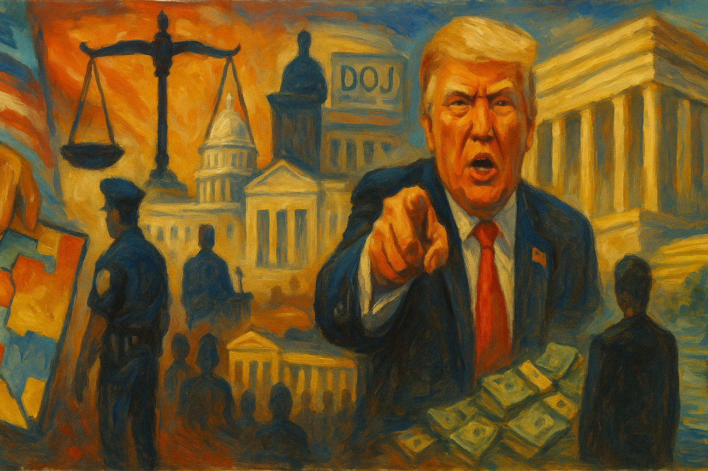

<!-- Generated by build_publish_week_v1 (appendix post) -->
<!-- Header image: image_wide_week69_appendix.png -->

# Week 69 Appendix: The Week the Clock Stood Still

*A Supreme Court ruling opened the door; six states walked through it within days, while the public clock barely moved at all.*

This week showed accelerating structural pressure across nearly every dimension of democratic decay, anchored by the aftermath of the Callais decision gutting Section 2 of the Voting Rights Act. Republican-controlled states (Tennessee, Louisiana, Alabama, Georgia, Mississippi, South Carolina, Florida) moved in rapid, coordinated fashion to eliminate Black-majority districts, suspend active elections, and punish dissenting legislators by stripping committee assignments—actions targeting representation itself. Simultaneously, the FDA commissioner's ouster over political interference in vaccine and drug approvals, a stream of AI-generated propaganda and treason accusations from the president, a court-packing demand, refusal to seek War Powers authorization for the Iran war, no-bid contracts benefiting Trump-linked firms, and a proposed $1.7 billion insider compensation fund for January 6 defendants collectively depict an executive operating with diminishing institutional restraint. Countervailing signals—SCOTUS protecting mifepristone access, some judicial pushback, Hungary's peaceful democratic transition—were present but marginal against the week's dominant thrust toward entrenchment, personalization of power, and erosion of minority representation.

Power and Authority

1. Trump administration invoked a never-before-used Clean Air Act national security exemption to suspend pollution rules for over 180 facilities (2026-05-09) *[single source]*: The administration bypassed the EPA and Congress to grant polluters a two-year compliance pause, citing an unprecedented national security rationale rather than established regulatory process.

2. Trump pressured the FDA commissioner to approve fruit-flavored vapes after scientists had halted the decision (2026-05-09): Direct presidential intervention overrode agency scientists on a specific drug approval, demonstrating executive interference with independent regulatory judgment.

3. Trump administration directed FEMA to deny disaster aid to Democratic-led states while accelerating aid to Republican states (2026-05-09): Partisan allocation of federal disaster relief converts a public safety agency into an instrument of political reward and punishment, undermining equal treatment under law.

4. Trump awarded a no-bid contract to a golf-club-connected firm to repaint the Lincoln Memorial Reflecting Pool (2026-05-09): Bypassing standard federal procurement review to award a lucrative contract to a company with personal ties to the president illustrates use of public resources for private benefit.

5. Trump continued Iran war operations past the 60-day War Powers Act deadline without seeking congressional authorization (2026-05-11): The refusal to seek congressional approval for continued military action after the statutory deadline expired directly bypasses constitutional checks on war-making power.

6. Pentagon considered renaming Iran military operations to restart the War Powers Act's 60-day authorization clock (2026-05-13): Renaming an ongoing war to evade a legal deadline for congressional authorization would circumvent a core constitutional check on unilateral war-making.

7. Trump called for packing the Supreme Court and demanded loyalty from justices he appointed (2026-05-12): A sitting president publicly urging court-packing and loyalty from sitting justices directly threatens judicial independence and separation of powers.

8. Pete Hegseth threatened a military tribunal against Senator Mark Kelly for public remarks on weapons stockpiles (2026-05-11): A defense secretary threatening a sitting senator with military tribunal over protected speech represents an extraordinary breach of civilian oversight of the military.

9. Pete Hegseth referred Senator Mark Kelly to Pentagon lawyers over disclosure of information Hegseth himself had made public (2026-05-12): Referring a senator for legal review after he criticized military policy, using information the defense secretary had already disclosed, suggests retaliation against oversight rather than genuine security concern.

10. Trump announced consideration of making Venezuela the 51st U.S. state (2026-05-11) *[single source]*: A stated willingness to annex a sovereign foreign nation departs sharply from international law and norms governing national sovereignty.

11. Jared Landry declared a state of emergency to halt an active congressional primary election after a court invalidated a district (2026-05-14) *[single source]*: Suspending an in-progress election disenfranchised tens of thousands of already-cast ballots, exercising executive power to disrupt an ongoing democratic process.

12. Trump stated he would 'do anything necessary' regarding deployment of National Guard or ICE at polling locations (2026-05-12) *[single source]*: An ambiguous presidential statement about deploying armed federal forces near polling places raises concern about intimidation of voters and interference with election administration.

13. Jared Polis commuted the prison sentence of election-crime convict Tina Peters following sustained pressure from Trump (2026-05-15): A governor's commutation of an election-tampering sentence under explicit presidential pressure signals possible impunity for future attacks on voting infrastructure.

14. Trump negotiated a $1.7 billion taxpayer-funded compensation fund for allies including January 6 defendants (2026-05-15): Using public funds to compensate individuals convicted in the Capitol attack, with minimal transparency and unilateral executive control, rewards political violence with public money.

15. DOJ entered settlement talks to drop Trump's $10 billion IRS lawsuit and considered ending mandatory presidential tax audits (2026-05-13): A settlement in which the president's own DOJ negotiates a lawsuit against an agency he oversees, potentially eliminating mandatory audits, undermines checks on presidential financial accountability.

Institutions and Governance

1. Tennessee legislature changed redistricting rules to entrench a possible 9-0 Republican congressional delegation (2026-05-09): Unilateral mid-decade alteration of redistricting rules to lock in one-party advantage undermines competitive elections and fair representation.

2. Josh Hawley introduced a bill to remove FDA approval of mifepristone (2026-05-09): Legislative effort to overturn a drug approval on political rather than scientific grounds tests regulatory independence and access to approved medication.

3. Ron Johnson initiated an investigation into FDA rejections of rare disease treatments (2026-05-09) *[single source]*: Congressional investigation into specific regulatory decisions may reflect legitimate oversight or political pressure on agency independence.

4. Federal court rejected a Republican lawsuit challenging California's voter-approved congressional map (2026-05-09): The ruling upheld a voter-approved redistricting measure against partisan legal challenge, protecting a direct-democracy outcome.

5. Republican-backed litigants filed lawsuits to block Virginia's voter-approved redistricting referendum (2026-05-09): Legal challenges sought to overturn a referendum approved by more than three million voters, testing the durability of direct-democracy redistricting reforms.

6. Utah Supreme Court revived a challenge to the legislature's repeal of a voter-approved anti-gerrymandering initiative (2026-05-09) *[single source]*: The ruling affirmed that citizen-enacted government reforms are constitutionally protected from legislative override, offering a model for defending direct democracy.

7. Virginia Supreme Court struck down the voter-approved congressional redistricting plan (2026-05-09): Invalidating a referendum approved by millions of voters ahead of the midterms delivered a partisan advantage and undercut the outcome of direct democracy.

8. Voting rights groups sued Florida over Governor DeSantis's new congressional gerrymander (2026-05-09) *[single source]*: The lawsuit challenges an attempt to override voter-approved anti-gerrymandering protections in the state constitution.

9. Illinois Senate President Don Harmon shelved a proposed constitutional amendment strengthening voting rights protections after the Callais ruling (2026-05-09) *[single source]*: Even pro-voting lawmakers pulled back a ballot measure due to a chilling effect from a Supreme Court decision weakening federal voting-rights law.

10. Missouri appeals court rewrote a misleading state-drafted ballot summary for a redistricting veto referendum (2026-05-09) *[single source]*: Judicial correction of biased official ballot language protected voters' ability to make informed decisions on a gerrymandering referendum.

11. Missouri Attorney General Catherine Hanaway sued to block a veto referendum on a mid-decade congressional gerrymander (2026-05-09) *[single source]*: The lawsuit attempts to prevent voters from using a direct-democracy tool to reject a partisan gerrymander.

12. Merit Systems Protection Board ruled it had no jurisdiction to review mass terminations of immigration judges (2026-05-09): Removing a key civil-service check on politically motivated dismissals of judges weakens protections against executive purges of the judiciary.

13. FDA leadership cycled through multiple directors of the Center for Drug Evaluation and Research within months (2026-05-09) *[single source]*: Rapid turnover among senior regulators with industry ties or short tenures destabilized institutional expertise at a key public-health agency.

14. Trump approved a plan to fire FDA Commissioner Marty Makary (2026-05-09): Signing off on removal of an agency head following disputes over drug and vaccine decisions signals politicization of regulatory leadership.

15. Trump administration fired and rehired the CBER vaccine director multiple times (2026-05-09) *[single source]*: Repeated termination cycles of a senior vaccine regulator created institutional instability affecting public confidence in vaccine oversight.

16. Sean Duffy took a seven-month leave from Transportation Secretary duties to film a personal television series (2026-05-09): A cabinet secretary's extended absence to pursue a private commercial project raises questions about public accountability and use of office.

17. Anna Paulina Luna denied considering a run for Speaker of the House while appearing to position herself for the role (2026-05-10) *[single source]*: The apparent self-promotion for House leadership signals internal Republican jockeying and potential instability in House governance.

18. Mark Kelly criticized the administration's $1.5 trillion defense budget request as excessive (2026-05-10): A senator's public criticism of a near-doubling of defense spending highlights unresolved fiscal priority disputes in Congress.

19. Judge Jennifer L. Hall dismissed a defamation lawsuit against Fox News for lack of proof of actual malice (2026-05-10) *[single source]*: The dismissal protects press freedom in defamation law but leaves unresolved whether broadcasters face accountability for airing conspiracy theories.

20. Virginia Democrats proposed lowering the mandatory judicial retirement age to force out the state Supreme Court (2026-05-10): A plan to remove sitting justices through age-based retirement rules to overturn a redistricting ruling represents an institutional attack on judicial independence.

21. Jay Bhattacharya declined to confirm whether the FDA commissioner retained the president's confidence (2026-05-10) *[single source]*: A CDC director's non-answer about a fellow official's job security reflects uncertainty surrounding politically motivated removal of health leadership.

22. Sean Duffy filmed a reality television show sponsored by companies regulated by his own department (2026-05-10): A transportation secretary's entertainment project funded by regulated industries raises conflict-of-interest concerns amid high gas prices and safety issues.

23. Péter Magyar was sworn in as Prime Minister of Hungary after defeating the incumbent authoritarian leader (2026-05-10): The peaceful electoral defeat of an authoritarian leader and pledge to restore checks and balances represents a reversal of democratic backsliding in a NATO state.

24. House Democrats (40 members) sent a letter demanding FAA transparency on secretive ICE deportation flights (2026-05-12) *[single source]*: Congressional oversight requesting detailed flight data and humanitarian conditions tests executive transparency on immigration enforcement operations.

25. House Oversight Committee Democrats held a field hearing on the Epstein scandal and released a report on prosecutorial failures (2026-05-12) *[single source]*: Congressional oversight of a major sex-trafficking scandal and warnings against clemency for a convicted trafficker test accountability for elite impunity.

26. Chuck Schumer announced Senate Democratic opposition to $1 billion in reconciliation-bill funding for White House ballroom security (2026-05-12): Legislative resistance to diverting public funds toward a presidential personal project tests separation of public and private benefit in appropriations.

27. Cameron Sexton stripped all House Democrats of committee assignments after protests over a redistricting vote (2026-05-12) *[single source]*: Removing an entire minority caucus, including every Black legislator, from committee work punishes dissent and silences nearly two million constituents.

28. AFL-CIO released a poll showing overwhelming worker support for union-backed AI workplace protections (2026-05-12): Strong worker demand for AI regulation, with unions trusted far above elected officials, signals potential pressure for future labor legislation.

29. US Supreme Court vacated a lower-court injunction and allowed Alabama to use a congressional map found to intentionally dilute Black votes (2026-05-12): Allowing an unexplained reversal of a finding of intentional racial discrimination undermines the Voting Rights Act and equal representation.

30. DOJ initiated then dropped a criminal investigation into Fed Chair Jerome Powell that a judge called a pretext to pressure interest rates (2026-05-12): Using criminal investigation as leverage over an independent monetary authority undermines institutional independence and the rule of law.

31. Eileen Wang resigned as mayor after pleading guilty to acting as an illegal foreign agent of China (2026-05-12): A sitting local official's conviction for covert foreign influence reveals vulnerability of democratic institutions to hidden foreign interference.

32. Senate advanced Kevin Warsh's Federal Reserve nomination on a party-line vote following the dropped Powell investigation (2026-05-12): The first fully partisan Fed Chair nomination vote raises concerns about executive pressure eroding the Federal Reserve's political independence.

33. Trump nominated Kari Lake as ambassador to Jamaica after a court found her prior appointment unlawful (2026-05-12) *[single source]*: Nominating a figure whose earlier post was voided for lacking Senate confirmation, following mass layoffs at Voice of America, tests civil-service accountability.

34. Kash Patel testified before Senate hearings denying allegations of intoxication, misuse of security details, and personal branding conflicts (2026-05-12): Senate questioning of the FBI Director's fitness and conduct, met with counterattacks against senators, tests institutional checks on federal law enforcement leadership.

35. Jay Hurst testified that Iran war costs had reached $29 billion, with the figure shifting during testimony (2026-05-12) *[single source]*: Inconsistent cost figures presented to Congress during oversight hearings undermine legislative capacity to conduct informed budgetary review of war spending.

36. US Senate rejected a war powers resolution to end US involvement in the Iran conflict for the seventh time (2026-05-13): Repeated failure to invoke war powers authority reflects a breakdown of congressional oversight and constitutional constraints on military conflict.

37. Louisiana legislature advanced a congressional map eliminating one of two Black-majority districts (2026-05-13): The map directly implements the Callais decision to reduce Black representation, part of a coordinated multi-state effort after the ruling.

38. Second US Circuit Court of Appeals paused Trump's $83.3 million defamation payment to E Jean Carroll pending Supreme Court review (2026-05-13): A sitting president obtaining a stay on a major judgment while appealing raises questions about equal application of law regardless of office.

39. Linda McMahon testified before the House on a new student loan cap rule amid concerns it would worsen a nursing shortage (2026-05-14) *[single source]*: Congressional questioning revealed potential conflicts between administration education policy and workforce development needs.

40. Scott Turner testified before the Senate on homelessness without providing concrete performance data (2026-05-14) *[single source]*: The HUD Secretary's inability to demonstrate measurable progress on homelessness under oversight questioning undermines executive branch accountability.

41. Supreme Court remanded Alabama's redistricting case for reconsideration in light of the Callais decision, potentially reducing Black-majority districts (2026-05-14) *[single source]*: The remand creates an opening for Alabama to cut majority-Black districts from two to one, directly diluting Black voting power.

42. Constitutional Accountability Center filed an emoluments-clause lawsuit over land transferred to Trump for a presidential library (2026-05-14) *[single source]*: The lawsuit tests whether a sitting president can constitutionally receive valuable public land as a personal gift under the domestic emoluments clause.

43. US Supreme Court upheld nationwide mail-order mifepristone access in a 7-2 decision (2026-05-14): The ruling preserved uniform federal regulatory authority over medication access, preventing a single state from overriding national drug policy.

44. South Carolina House advanced a proposal targeting Rep. Jim Clyburn's district, later blocked by the state Senate (2026-05-14): The proposal to redraw a senior Black representative's district reflects immediate use of weakened voting-rights protections, though the Senate block provided a procedural check.

45. Georgia Governor Brian Kemp called a special legislative session to redraw congressional maps following Callais (2026-05-13) *[single source]*: The session aims to lock in Republican-leaning maps while Republicans control the legislature, part of a coordinated multi-state redistricting push.

46. Louisiana state senate passed a bill eliminating one of two majority-Black congressional districts (2026-05-14): The bill reshapes a historic Black-majority district into a predominantly white one, potentially giving Republicans a 5-1 congressional majority.

47. Mississippi Governor Tate Reeves canceled a special session on court redistricting while pledging to eliminate the state's only Democratic congressional seat (2026-05-14) *[single source]*: Explicit targeting of the state's longest-serving Black elected official's seat, coordinated with the federal administration, represents an attack on fair representation.

48. South Carolina Governor Henry McMaster was expected to call a special session to eliminate the state's only Black-majority district (2026-05-14): The anticipated action represents coordinated multi-state use of executive power to eliminate minority representation following the Callais ruling.

49. Tennessee governor and legislature signed and approved a new congressional map eliminating the state's only majority-Black district (2026-05-14): Dividing Memphis to eliminate Black representation directly dilutes minority voting power following the weakened federal voting-rights standard.

50. House leadership (Johnson and Jeffries) announced a bipartisan taskforce to combat sexual misconduct in Congress (2026-05-15) *[single source]*: The initiative responds to congressional resignations over misconduct allegations, aiming to reform reporting processes and workplace protections.

51. Providence city council approved a rent stabilization ordinance capping annual increases at 4%, then was vetoed by the mayor (2026-05-15) *[single source]*: Grassroots-driven tenant protection legislation was blocked by mayoral veto, setting up a direct democratic conflict over housing policy.

52. Virginia Governor Abigail Spanberger vetoed legislation restoring collective bargaining rights to 500,000 public sector workers (2026-05-15) *[single source]*: The veto reverses an explicit campaign commitment and blocks restoration of labor rights for half a million workers.

53. Jim Jordan dismissed constituent concerns about record gas prices as 'that's life' then denied saying it (2026-05-15): A lawmaker's dismissal and subsequent denial of economic hardship reflects diminished accountability to constituents facing material hardship.

54. Mike Johnson declined to review or engage with the substance of Trump's Taiwan defense ambiguity with China (2026-05-15) *[single source]*: The Speaker's refusal to engage with a major shift in Taiwan defense policy signals a failure of congressional oversight of executive foreign policy.

55. League of Conservation Voters and allied watchdog groups petitioned the Senate to investigate Justice Alito over oil stock conflicts of interest (2026-05-15): Allegations that a Supreme Court justice ruled on cases benefiting industries in which he holds financial stakes threaten public confidence in judicial impartiality.

56. Minnesota House Democratic caucus staged an overnight sit-in after the Republican speaker blocked a vote on a gun violence prevention bill (2026-05-15) *[single source]*: Legislators used a procedural protest to pressure the speaker into allowing a floor vote before the session's end, challenging control of the legislative agenda.

57. Alabama petitioned the Supreme Court to reconsider a requirement for two majority-Black congressional districts (2026-05-15): The petition seeks to overturn a prior order protecting Black representation, using the weakened Section 2 standard from Callais.

Economic Structure

1. White House announced a National Drug Control Strategy while simultaneously cutting funding for its core components (2026-05-10) *[single source]*: Announcing an expansive public health strategy while proposing $10 billion in cuts to the same programs undermines coherent governance and public trust.

2. Pentagon estimated Iran war costs at $25-50 billion (2026-05-10): Wide-ranging and uncertain cost estimates for an ongoing war signal fiscal risk and complicate congressional budget oversight.

3. Kevin Hassett predicted oil price declines and 6% GDP growth without realistic economic basis (2026-05-10): Unfounded economic projections timed to the election cycle, later contradicted by fact-checkers, reflect politically motivated rather than evidence-based forecasting.

4. Spirit Airlines ceased operations amid a spike in fuel costs tied to the Iran war (2026-05-10) *[single source]*: The airline's collapse illustrates direct economic harm to consumers and businesses from the ongoing war-driven energy crisis.

5. Trump used a UFC event on the White House lawn as an undisclosed fundraising vehicle with $1 million-plus sponsorships (2026-05-11): Sponsorship packages sold for major sums with no disclosure of fund destinations obscure the flow of money to the president, raising quid pro quo concerns.

6. Trump administration awarded a no-bid contract that ballooned 88% to $13.1 million for reflecting pool repairs (2026-05-11): A significant cost overrun on a federal project awarded to a politically connected contractor raises concerns about fiscal waste and self-dealing.

7. Kevin Hassett attributed record-low consumer sentiment to the pace of Trump's policy changes (2026-05-11): The administration's chief economist acknowledged that policy volatility itself is driving loss of public economic confidence.

8. Trump administration seized Russian oil tankers (2026-05-11): Unilateral economic coercion against Russian assets demonstrates use of financial power as a tool of foreign policy.

9. Trump administration proposed rescinding 2024 EPA rules on ethylene oxide, a carcinogen 60 times more dangerous than previously assessed (2026-05-13) *[single source]*: The rescission would save companies $50 million annually while forgoing cancer-risk assessments affecting 2.3 million people, prioritizing industry cost savings over public health.

10. Trump used a UFC event on his birthday at the White House to solicit corporate sponsorships without disclosure (2026-05-11): Corporate sponsorships tied to a personal celebration on public grounds obscure influence-buying and blur lines between office and personal enrichment.

11. Trump pledged to suspend the federal gas tax pending congressional action (2026-05-11) *[single source]*: A major fiscal policy announcement addressing war-driven inflation requires congressional approval and would remove roughly half a billion dollars weekly from federal revenue.

12. Anna Paulina Luna and Josh Hawley introduced companion bills in the House and Senate to suspend the federal gas tax (2026-05-11) *[single source]*: Legislative alignment with the president's stated fiscal goal illustrates rapid coordination between executive and legislative branches on a costly tax measure.

13. Department of Labor released inflation data showing April 2026 inflation at its highest level since 2023 (2026-05-13): Rising inflation amid ongoing military operations reveals a disconnect between the administration's priorities and the economic hardship experienced by Americans.

14. Trump administration paid nearly $2 billion to halt wind energy projects and stalled dozens of renewable energy initiatives (2026-05-12): Using federal funds to block renewable development during an energy crisis increases costs and diverts public resources toward ideological objectives.

15. Customs and Border Protection scheduled tariff refunds to go to the 'trade community' rather than consumers who paid higher prices (2026-05-12) *[single source]*: Directing tariff refunds to industry intermediaries rather than the consumers who bore the cost demonstrates a systematic tilt of policy benefits toward corporate interests.

16. Trump administration implemented tariffs and deportations that caused farm bankruptcies to rise 46 percent (2026-05-12) *[single source]*: Combined tariff, immigration enforcement, and foreign aid cancellation policies caused measurable economic harm to the agricultural sector.

17. Bureau of Labor Statistics reported April 2026 inflation at 3.8 percent, the highest in nearly three years, driven by the Iran war (2026-05-12) *[single source]*: War-driven energy costs pushed prices to rise faster than wages for the first time since 2023, directly affecting Americans' cost of living.

18. Trump received a 70 percent disapproval rating on economic handling with majorities blaming the Iran war and tariffs (2026-05-12): Historic disapproval of economic stewardship reflects widespread public perception that presidential policies worsened financial conditions.

19. Pentagon applied outdated munitions replacement costs, understating war expenses by hundreds of millions of dollars (2026-05-14) *[single source]*: Accounting methodology that records munitions at original rather than replacement cost systematically understates the true fiscal burden presented to Congress.

20. Jules Hurst acknowledged the Pentagon's war cost estimate excluded documented damage to US military bases and was uncertain about arms transfer costs (2026-05-14) *[single source]*: Omitting known cost categories from an official war estimate presented to Congress undermines legislative oversight of military spending.

21. Vice President Vance announced withholding of $1.3 billion in Medicaid payments from California (2026-05-14): Withholding federal healthcare funds from a state affects millions of Medicaid beneficiaries and raises questions about the proportionality of fiscal enforcement actions.

22. Jared Kushner raised $5 billion from Middle Eastern investors while serving as chief US negotiator in the region (2026-05-15): A senior official's simultaneous foreign diplomacy and private fundraising from foreign governments creates direct conflicts of interest.

23. Trump family accumulated approximately $4 billion through cryptocurrency ventures and defense-adjacent business interests (2026-05-15) *[single source]*: Presidential family enrichment through business ventures, including defense contracts to companies with family financial ties, raises constitutional emoluments concerns.

24. Trump raised more than $2 billion from wealthy donors for personal projects, with some receiving pardons and jobs (2026-05-15): Systematic fundraising in exchange for pardons, jobs, and access creates a pay-to-play system undermining equal treatment under law.

25. Pentagon reported Iran war costs at $29 billion while independent estimates placed the figure at $50-72 billion (2026-05-15): Significant discrepancy between official and independent war cost estimates, largely unchallenged by media, obscures the true fiscal burden from Congress and the public.

Civil Rights and Dissent

1. Prasad overruled FDA scientists to limit Covid vaccine access and initially rejected a flu vaccine (2026-05-09) *[single source]*: A senior regulator overriding scientific staff on vaccine decisions demonstrates politicization of public health protections.

2. Box Elder Accountability Referendum filed a referendum application to reverse county approval of a massive datacenter project (2026-05-10) *[single source]*: Grassroots residents mobilized formal democratic mechanisms to contest a major development decision affecting local resources.

3. Robert Jeffress endorsed military action against Iran, framing government's role as divinely sanctioned protection (2026-05-10) *[single source]*: Religious endorsement of military conflict demonstrates the use of faith to legitimize war and undermine diplomatic alternatives.

4. Six people were found dead inside a boxcar at a rail yard near the Texas-Mexico border (2026-05-11): The deaths reflect ongoing humanitarian risks tied to border crossings and immigration enforcement conditions.

5. ACLU filed a federal lawsuit alleging racial discrimination and First Amendment retaliation in Tennessee's redistricting (2026-05-11) *[single source]*: The complaint links the redistricting to a broader pattern of state retaliation against Black political expression in Memphis, raising constitutional discrimination claims.

6. Cole Tomas Allen pleaded not guilty to charges of attempting to assassinate President Trump (2026-05-11): Criminal proceedings following an alleged assassination attempt directly implicate national security and the rule of law.

7. Federal agencies removed civil rights history from government websites and programs (2026-05-11) *[single source]*: The removal of civil rights content from federal platforms represents government control over public memory ahead of the nation's 250th anniversary.

8. State education authorities rewrote school curricula nationwide to remove civil rights and struggle history (2026-05-11) *[single source]*: Curriculum revision removing content on civil rights struggles narrows students' understanding of the nation's history and ongoing fight for equality.

9. Federal government slashed funding for cultural institutions that present the full history of civil rights and struggle (2026-05-11) *[single source]*: Defunding institutions that tell a comprehensive history narrows the range of narratives available to the public.

10. Louisiana suspended an ongoing primary election to redraw congressional maps following the Callais decision (2026-05-11): The suspension halted an in-progress election and allowed the state to implement new district lines without prior voting-rights constraints.

11. Memphis City Council voted unanimously to oppose the state redistricting plan diluting Black political voice (2026-05-12) *[single source]*: Unanimous local opposition demonstrates municipal consensus against a state redistricting plan that harms minority representation.

12. Jen Kiggans agreed on radio with a racist 'cotton-picking' remark targeting a Black congressional leader (2026-05-13): A sitting congresswoman's public agreement with racially offensive language targeting a Black congressional leader undermines norms of equal treatment.

13. William Paul delivered an antisemitic and anti-gay tirade at a Washington DC bar (2026-05-13) *[single source]*: The remarks by a senator's son, even when disavowed, reflect rising bigoted rhetoric circulating within political circles.

14. Louisiana State Police and Union Parish Sheriff's Office settled a wrongful death lawsuit for the 2019 killing of Ronald Greene (2026-05-13) *[single source]*: The $4.85 million settlement reflects systemic failures in police accountability and excessive force against a Black motorist.

15. Congressional Democrats urged Trump officials to end Guantánamo migrant detention and rule out military action against Cuba (2026-05-13) *[single source]*: The letter warns that further pressure and detention policy tied to Cuba risks unlawful military action and humanitarian crisis.

16. Demster and three co-plaintiffs filed a lawsuit alleging systematic retaliation against Memphis residents documenting task force enforcement activity (2026-05-13): The complaint challenges retaliation against citizens exercising their right to observe and record government law enforcement conduct.

17. Tennessee Republican lawmakers approved a congressional map dismantling the state's only majority-Black district (2026-05-15): Splitting Black voters across three majority-white districts reduces minority political representation in violation of the Voting Rights Act.

18. Mississippi Republican legislators and officials threatened redistricting to eliminate the state's only Black congressional district (2026-05-15) *[single source]*: Coordinated state-level action targeting a specific racial group for political disadvantage directly attacks equal representation.

19. Minority Veterans of America filed a lawsuit challenging the reinstated VA abortion services ban for veterans (2026-05-15): The lawsuit tests whether the executive branch followed proper administrative procedure when restricting reproductive healthcare access for a federal beneficiary population.

20. Social Circle town officials filed a federal lawsuit challenging an ICE plan for a 10,000-capacity detention facility (2026-05-15): The lawsuit raises concerns about environmental review, infrastructure overload, and lack of local consultation in immigration enforcement expansion.

21. Federal judges ruled against ICE detention practices in approximately 90 percent of cases reviewed (2026-05-15) *[single source]*: A high rate of judicial rejection of detention practices demonstrates systematic executive disregard for constitutional constraints on immigration enforcement.

22. Knox County Schools removed Alex Haley's Roots from library shelves under a state age-appropriate materials law (2026-05-15) *[single source]*: Removing a Pulitzer Prize-winning novel documenting slavery from school libraries constrains students' access to significant historical literature.

23. Voting rights groups and Republican-aligned litigants advanced competing lawsuits and ballot measures over redistricting nationwide following Callais (2026-05-15) *[single source]*: The gutting of Voting Rights Act Section 2 protections triggered simultaneous state actions and legal battles over minority representation across multiple states.

Information, Memory and Manipulation

1. FDA suppressed publication of peer-reviewed vaccine safety research (2026-05-09): Blocking publication of scientific findings on vaccine safety undermines transparency and public trust in health regulation.

2. Virginia Supreme Court overturned a voter-approved redistricting decision (2026-05-09): A characterization of the ruling as institutional capture highlights concerns about judicial respect for democratic outcomes.

3. Trump posted AI-generated images and false historical claims attacking Iran and past administrations (2026-05-10) *[single source]*: Presidential use of fabricated imagery and distorted history to justify military action degrades factual public discourse.

4. Trump posted AI-generated images attacking political opponents and state officials (2026-05-10): Using fabricated imagery to attack a sitting governor and a prosecuted former FBI director weaponizes propaganda against domestic critics.

5. Trump posted images of the renovated reflecting pool exaggerating cost and timeline claims (2026-05-10): Public communications misrepresenting infrastructure costs blur the line between official messaging and personal promotion.

6. Trump posted extensive self-promotional content claiming historic approval and leadership (2026-05-10) *[single source]*: Heavy use of official communication channels for self-praise reflects use of the presidency for personal image management over governance.

7. Seb Gorka dismissed criticism of the Iran war strategy as 'fake news' while offering shifting justifications (2026-05-10): Dismissing accountability questions with unsubstantiated claims undermines transparency in crisis management.

8. 50501 Movement report documented federal agencies scrubbing civil rights history from websites (2026-05-11) *[single source]*: Systematic removal of civil rights content from government platforms represents state control over public memory.

9. House Oversight Chair James Comer defended Trump's use of AI-generated war imagery as normal presidential communication (2026-05-11) *[single source]*: A senior lawmaker's endorsement of fabricated military imagery normalizes disinformation in official presidential messaging.

10. HCR reporting documented signs thanking Trump appearing throughout Washington, D.C. (2026-05-11): Signage attributing manufactured gratitude to the president represents an effort to create a false impression of public support during a crisis period.

11. Trump posted fifty-five times over three hours accusing political opponents of treason and demanding indictments (2026-05-12) *[single source]*: A high-volume campaign of false accusations against former officials, including a fabricated quote falsely attributed to a senator, degrades shared factual discourse.

12. Trump berated a female reporter and later labeled another reporter's coverage of Iran as 'virtual treason' (2026-05-12): Verbal intimidation and accusations of disloyalty against journalists undermine press freedom and accountability journalism.

13. Trump posted racist AI-generated memes targeting a congressman and a governor (2026-05-12): The distribution of racially charged fabricated content amplifies disinformation and normalizes racial mockery in political discourse.

14. Trump made repeated false claims that violent crime in Democratic-led cities was rising despite documented declines (2026-05-12) *[single source]*: Sustained false public claims contradicted by official crime data undermine factual governance and public understanding of urban safety.

15. Trump posted false claims about reflecting pool renovation costs and AI images attacking political opponents (2026-05-13): Fabricated imagery and false claims about infrastructure projects used to attack opponents normalize disinformation as an executive communication tool.

16. Advance Local misrepresented mass-produced gambling promotion articles as unique, editorially reviewed journalism (2026-05-13) *[single source]*: Newsrooms deceived readers about editorial standards by presenting affiliate-marketing content as original journalism across a Pulitzer-winning network.

17. Major media outlets reported the Pentagon's undocumented $29 billion Iran war cost estimate without independent scrutiny (2026-05-14) *[single source]*: Uncritical repetition of an unverified government cost figure by major outlets undermined public understanding of war expenditures.

18. Trump refused to acknowledge or address a US missile strike on a girls' school in Iran that killed over 160 children (2026-05-15) *[single source]*: Deflecting accountability for a strike on a civilian school by attacking the reporting outlet undermines transparency about the human cost of military operations.

19. Todd Blanche sought subpoenas targeting reporters' records following presidential complaints about media leaks (2026-05-15) *[single source]*: Using federal legal authority to target journalists' records for reporting on sensitive matters represents a direct threat to press freedom.

20. Trump attacked a reporter aboard Air Force One as 'treasonous' for accurate reporting on Iran (2026-05-15) *[single source]*: Labeling accurate journalism as treasonous continues a pattern of intimidation against reporters covering military affairs.

21. Trump dismissed verified US military intelligence on Iran's missile capabilities as 'fake news' (2026-05-15) *[single source]*: Dismissing credible intelligence reporting undermines the factual basis for national security decision-making and public trust in official sources.

22. Trump misrepresented a foreign leader's criticism of American decline as praise for his own presidency (2026-05-15) *[single source]*: Distorting a foreign leader's remarks to shift blame to a prior administration undermines honest public discourse about foreign relations.

23. Robert F. Kennedy Jr. directed federal scientists to examine his pre-existing anti-vaccine theory linking vaccines to chronic disease (2026-05-15) *[single source]*: A cabinet secretary directing government science toward a predetermined ideological conclusion politicizes public health research.

24. Trump posted an image of a golden statue of himself at his Doral resort (2026-05-15) *[single source]*: Public promotion of personal monuments echoing authoritarian imagery raises concerns about normalization of personality-cult symbolism.

25. Trump announced plans for a 'National Garden of American Heroes' on public waterfront land (2026-05-15) *[single source]*: Taxpayer-funded statues reflecting the president's personal choice of historical figures represent use of public space to shape national memory.

26. Missouri secretary of state issued a ballot description of a redistricting referendum that a court found included biased and misleading claims (2026-05-09) *[single source]*: State-drafted ballot language misrepresenting a gerrymander to voters threatened the integrity of direct-democracy processes before judicial correction.

