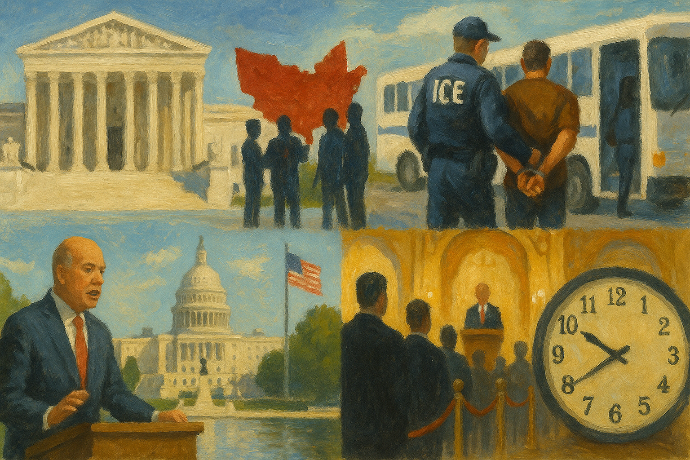

<!-- Generated by build_publish_week_v1 -->
<!-- Header image: image_wide_week69.png -->

# Week 69: Maps as Emergency Rule

*Court openings, halted elections, bent agencies, and prestige spending turned legal permission into operational power without moving the public clock.*

> The forms of freedom can remain after its substance has been drained away. — Anonymous
> Power is of an encroaching nature, and it ought to be effectually restrained from passing the limits assigned to it. — James Madison
> The most dangerous creation of any society is the man who has nothing to lose. — James Baldwin

Week 69 was a week of conversion. Legal openings became political action with unusual speed. A court ruling narrowed one set of protections, and state officials moved at once to redraw maps, halt voting, and weaken rivals. At the same time, agencies that still looked intact from the outside were pressed to serve political ends from within. Public money, too, was bent toward display and favor. The pattern was not collapse. It was use.

At the close of the last period, the Democracy Clock stood at 8:13 p.m. It ended Week 69 at 8:13 p.m., a net change of 0 minutes. The stillness did not mark relief. It marked consolidation. The week added pressure across elections, law, administration, and information, mostly by extending lines already laid down. Power widened in ways that were real and cumulative, yet not quite enough to shift the public measure. The record showed a regime growing more practiced, not more hesitant.

The clearest story began in the courts and moved south through statehouses. The Supreme Court weakened Voting Rights Act protections in Louisiana v. Callais, and the practical meaning of that ruling appeared almost at once. Alabama was allowed to use a congressional map that had earlier been blocked for racial discrimination. In Virginia, a voter-approved redistricting referendum was struck down. These were not abstract holdings. They changed what mapmakers could now attempt with less fear of reversal.

Tennessee moved first and most plainly. State officials enacted and signed a new congressional map that split Memphis and dismantled the state’s only majority-Black district. The legislature had already passed a map that could produce a delegation with no Democratic seat at all. The ACLU and allied groups sued on behalf of Memphis voters, and the Memphis City Council voted to oppose the plan. But the structural fact came first. Representation was altered before the next election cycle. The burden of repair was pushed onto those who had just lost ground.

Louisiana showed a harsher use of power. Governor Jeff Landry declared an emergency to halt the state’s congressional primary, even after ballots had been sent and some had already been cast. The state then advanced a map that would eliminate a Black-majority district. Here emergency rule and redistricting worked together. One changed who could vote and when. The other changed what those votes could mean. The winners were partisan officials testing the outer edge of control. The losers were voters, especially Black voters, whose place in the system was made more contingent.

Georgia and South Carolina showed the spread of the method. Governor Brian Kemp called a special session to redraw Georgia’s maps. South Carolina prepared for one of its own, though the state senate blocked one proposal aimed at Representative Jim Clyburn’s district. Mississippi, by contrast, canceled an expected special session on redistricting. That mattered too. The week did not show one uniform advance. It showed a region in motion, with executive timing, court doctrine, and legislative will all used to seek durable partisan gain.

The deeper change lay in speed and confidence. Mid-decade redistricting, once treated as exceptional, was handled as ordinary hardball. Emergency authority, once tied to storms or disorder, was used to stop an election already underway. The legal language remained procedural. The effect did not. Opposition parties remained on the ballot, but the field around them grew narrower, and the cost of minority representation rose.

A second development ran through immigration, where coercion on the ground was matched by redesign inside the courts. The administration intensified its mass deportation campaign. It expanded the use of Guantánamo Bay for migrant detention, moving people to a site with weaker public scrutiny and thinner ordinary protections. The human cost appeared in smaller scenes as well, including the investigation of six deaths in a train car near the Texas-Mexico border. Enforcement was not only a policy. It was a climate of fear.

At the same time, the venues meant to judge that enforcement were remade. The administration closed the San Francisco immigration court and shifted its work to a smaller site. It fired or pushed out more than 113 immigration judges. It also authorized military lawyers to serve as temporary immigration judges. That step mattered beyond staffing. It blurred the line between civilian adjudication and command culture. A court system already under strain was brought closer to the priorities of the executive branch that appears before it.

The fast-tracked removal order against Mahmoud Khalil showed how this new posture worked in practice. The Board of Immigration Appeals accelerated his case and issued a final order with unusual speed. Elsewhere, House Democrats demanded answers from the FAA about secretive ICE deportation flights, and local bodies in Arizona and Tucson tried to limit how federal enforcement could use public property. North Carolina activists campaigned against new ICE facilities. These were signs of resistance. They were also signs that ordinary checks now had to fight uphill against a system being tuned for removal.

There were still pockets of restraint. A federal judge ordered the release of Kevin González’s parents from ICE custody. Tucson voted to block ICE from using city property without a judicial warrant. Cincinnati schools became the site of attempted ICE-linked wellness checks by out-of-jurisdiction officers, an episode that showed how easily coercive habits can spread beyond lawful bounds. The week’s balance was plain. Enforcement gained reach, while review, access, and local autonomy had to defend themselves case by case.

A third development centered on the agencies of health and environment, especially the FDA. President Trump pressured the FDA to approve fruit-flavored vapes and backed a plan to remove Commissioner Marty Makary. The same week, the FDA halted publication of vaccine safety research that had already been accepted by a journal. Political pressure and scientific suppression met in one place. The agency still had forms, staff, and notices. What changed was the distance between expert judgment and political demand.

The environmental side of the record widened the same pattern. The administration granted more than 180 facilities a two-year pause from Clean Air Act compliance. It then announced plans to rescind 2024 ethylene oxide pollution rules. These were broad moves, not one-off favors. They shifted the practical meaning of regulation from rule-bound enforcement toward selective relief for regulated interests. Industry gained room. Communities exposed to pollution lost protection. The state’s own standards became less binding on those with access.

Yet the agencies did not stop working. That was part of the week’s meaning. The FDA issued guidance on pregnancy safety studies, tuberculosis drug development, unauthorized tobacco products, susceptibility testing, and drug repurposing. It opened meetings and comment periods. The Supreme Court temporarily extended access to mail-order mifepristone, while Senator Josh Hawley introduced legislation to revoke the drug’s approval. Routine administration continued beside direct political interference. This was not administrative collapse. It was degradation under pressure, where normal work persisted but no longer guaranteed independence.

The same logic touched personnel. The Senate prepared to vote on Kevin Warsh’s nomination to the Federal Reserve, a reminder that posts built to stand apart from day-to-day politics were being drawn into partisan struggle. In immigration courts, military lawyers were brought in as judges. At the FDA, leadership itself came under threat. The lesson was plain. Expertise remained useful, but only if it bent.

A fourth development concerned money, display, and favor. President Trump awarded a no-bid contract for repairs to the Lincoln Memorial Reflecting Pool, a project already marked by presidential preference. The cost rose to $13.1 million. Former Justice Department employees and preservation groups sued to halt the work, arguing that required review had been bypassed. The project was small beside the federal budget. Its meaning was larger. Public space, public memory, and public contracting were being joined to presidential will.

Congress supplied a second piece. The Senate Judiciary Committee included $1 billion for White House ballroom security in an immigration spending bill, and Senate Democrats vowed to oppose the measure. A large enforcement package moved through reconciliation while carrying money tied to a president-linked prestige project. Budget procedure became a shelter for symbolism. The state was not merely funding security. It was funding grandeur through channels meant for other ends.

The same week brought conflict-of-interest concerns around Trump Mobile and T-Mobile, where a president-linked business stood near a firm exposed to federal regulation. Trump Mobile also collected deposits for phones it had not delivered and changed its terms after the fact. Elsewhere, a cabinet secretary appeared on a reality show backed by sponsors tied to his department, and Trump-aligned committees sat on a vast war chest with unclear plans. These were not identical acts. Together they showed a governing class in which public office, private gain, and family brand were hard to separate.

The winners in this arrangement were insiders, contractors, and businesses close to power. The losers were procurement rules, budget clarity, and the old line between state purpose and personal prestige. Patronage no longer needed to arrive in envelopes. It could move through contracts, appropriations, and regulatory exposure while keeping the look of ordinary administration.

A fifth development was rhetorical on the surface and coercive in effect. President Trump accused the media of treason over its Iran war coverage. He warned the Supreme Court to rule in his favor on birthright citizenship. He called for the prosecution of political opponents in a late-night barrage and kept posting false claims about election fraud and rivals. He also warned that he could deploy the National Guard or ICE at voting locations. Each statement stood on its own. Taken together, they blurred the line between criticism, crime, and disloyalty.

This mattered because presidential speech is never only speech. When a president brands journalism as treason, pressures judges in public, and treats rivals as proper targets for prosecution, he changes the working climate around institutions that depend on independence. The Court of International Trade ruled against his global tariffs, and Trump criticized an adverse Supreme Court tariff ruling as well. Major city crime data contradicted his claims about urban disorder. None of that stopped the flood. The point of the barrage was not coherence. It was dominance through repetition and threat.

Even the promise to release files on UFOs and extraterrestrial life fit the pattern. It was a spectacle of disclosure that redirected attention while more consequential fights over records, maps, prosecutions, and war powers were underway. Chaos did not replace policy. It accompanied it. The effect was to crowd the field, making scrutiny harder and making each abuse seem like one more item in a stream too wide to hold.

A sixth development turned to war powers and the limits of congressional control. Trump said he was relying on a ceasefire to avoid seeking congressional approval for continued military action in Iran. The Senate then rejected a war powers resolution to end U.S. involvement. Hearings continued. Pete Hegseth testified to Congress about the reported costs of the war. But the practical balance did not change. The executive kept the initiative, and Congress remained mostly a forum for after-the-fact argument.

The accountability story that followed was also telling. The Pentagon gave Congress a $29 billion estimate for the cost of the Iran war. Major media outlets repeated that figure with little scrutiny. A contested official number moved quickly into public circulation, narrowing debate before fuller accounting could catch up. Oversight existed in form. It did not yet bite. The week showed how military action can proceed under a cloud of hearings, estimates, and objections while the underlying freedom to act remains with the executive.

A seventh development lay inside legislatures themselves. Senate Republicans advanced a $72 billion enforcement package through reconciliation, using a procedure that narrowed the need for bipartisan support and reduced ordinary scrutiny. At the same time, Tennessee House Speaker Cameron Sexton removed Democratic lawmakers from committee assignments after their protest. By the end of the sequence, all Tennessee House Democrats had been stripped from committees. This was not a quarrel over tone. It was a reduction of the opposition’s working power inside the chamber.

Congress still held hearings. Oversight committees examined the Epstein scandal, released testimony, and held sessions on the accountability of Trump administration officials. Kash Patel testified before the Senate. These acts mattered. But they also showed the gap between hearing and power. The more decisive moves of the week came through procedure: reconciliation at the national level, committee punishment at the state level. Rules that once organized debate were used instead to narrow it.

That is why the Tennessee episode carried more than local meaning. A legislature can remain open, televised, and formally plural while ceasing to function as a place of shared lawmaking. Committee assignments are where bills are shaped, records are built, and scrutiny is applied. To strip them from one party is to leave representation standing in name while weakening it in fact. Millions of voters remained represented on paper. Their leverage inside the chamber was cut down.

The final development concerned the information field in which all the others had to be understood. Public Employees for Environmental Responsibility sued the Department of the Interior over unanswered FOIA requests tied to Freedom250. Interior Secretary Doug Burgum refused to provide Congress with requested information and defended no-bid contracts. The House Oversight Committee pursued records tied to the Epstein scandal and non-prosecution decisions. The problem was not one sealed archive. It was a pattern of delay, omission, and selective release that made timely accountability harder.

The same pattern appeared in public communication and media. The Department of Health and Human Services issued a statement on hantavirus cruise ship passengers that omitted key details. Advance Local newspapers published thousands of gambling promotion articles presented as journalism. Democracy Docket responded by launching a live redistricting tracker and publishing election-law analysis, while outside reports from Freedom House and V-Dem documented wider democratic decline. The week contained both degradation and repair. But repair had to work against a field already clouded by bad labeling, incomplete disclosure, and official stonewalling.

The result was not silence. It was noise with weak anchors. Records still existed. Hearings still occurred. Agencies still published notices. Yet the public had to work harder to know what was happening, who was responsible, and which claims could be trusted. That burden itself is a form of power. It favors those who can delay, flood, and rename.

Week 69 did not produce a single break in the constitutional order. It showed something more durable. Court doctrine, executive pressure, legislative procedure, and information disorder were made to reinforce one another. Elections were narrowed where law had been weakened. Agencies were bent without being broken. Oversight continued without full effect. Public money served display as well as state need. The period held the clock in place, but only because the erosion came as extension rather than leap. That, too, belongs in the record.

<!-- Synopses for cross-posting -->
Long Synopsis: Week 69 showed how quickly legal openings can become governing practice. After the Supreme Court weakened Voting Rights Act protections, Southern officials moved to redraw maps, suspend a primary already underway, and narrow Black representation with unusual speed. At the same time, the administration intensified deportation policy while remaking immigration courts through closures, judge removals, and temporary military-lawyer appointments. Pressure on the FDA and environmental regulators deepened the sense that agencies were being used, not dismantled: routine work continued, but political demand pressed closer to expert judgment. Public money and contracting were also bent toward presidential display, from the Reflecting Pool fight to ballroom security funding. The Democracy Clock stayed at 8:13 p.m., a net change of 0 minutes, reflecting consolidation rather than relief: erosion spread across many systems, but mostly by extending patterns already in place.
Short Synopsis: A week of consolidation rather than rupture: voting-rights setbacks were converted into redistricting and election control, agencies were bent toward political ends, and oversight remained active but weak.

