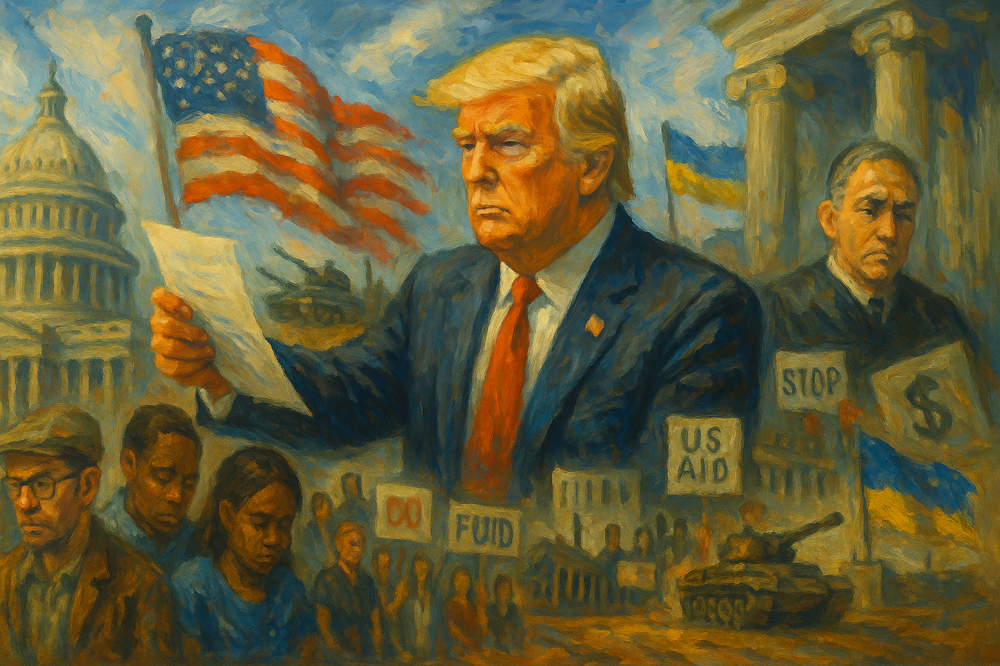

<!-- Generated by build_publish_week_v1 (appendix post) -->
<!-- Header image: image_wide_week7_appendix.png -->

# Week 7 Appendix: Tools As Habit, Not Exception

*Executive orders, mass layoffs, and curated information flows turned once‑extraordinary tools into routine methods for rewarding allies, disciplining dissent, and thinning the state.*

This week shows an aggressive consolidation of executive power, heavy politicization of the civil service, and deepening fusion of crony capitalism with state policy. Trump’s team used executive orders and agency directives to reshape foreign policy toward Russia, hollow out regulatory and social-welfare capacity, and advance ideologically driven attacks on immigrants, LGBTQ people, racial equity, and universities. Mass layoffs and buyouts across Education, Social Security, VA, IRS, USDA, State, and USPS, combined with the effective shutdown of CFPB and restructuring of USAID and IAF, exert major structural pressure on traits 1, 16, 22, and 38. Simultaneously, the creation of a crypto reserve and non-enforcement of anti–money laundering rules entrench elite self-dealing and financial opacity. On the rule-of-law side, courts repeatedly checked executive overreach on foreign aid, firings, workforce cuts, and research funding, modestly strengthening separation-of-powers traits even as the administration retaliated against judges and prosecutors. Internationally, the U.S. moved further away from its democratic allies toward Russia, while pausing or weaponizing aid to Ukraine and South Africa. Civil society mobilization and some state-level protections for LGBTQ rights persisted, but were outweighed by systemic authoritarian drift.

Power and Authority

1. President Trump and the General Services Administration ordered closure of the 18F office and layoffs of its staff (2025-03-01): Shuttering 18F, which built tools like IRS Direct File, reduced in‑house federal digital capacity and advanced broader workforce cuts that weaken the state’s ability to deliver and modernize public services.

2. President Trump issued an executive order designating English as the official language of the United States (2025-03-01): Making English the official federal language and revoking prior language‑access rules narrowed access to government services for non‑English speakers, entrenching unequal participation in public life.

3. President Trump ordered investigations and tariff options on timber and lumber imports (2025-03-01): Directing a national‑security investigation into timber and lumber imports positioned trade tools for potential protectionist use, expanding executive leverage over key resource markets.

4. President Trump ordered immediate expansion of American timber production on federal lands (2025-03-01): Mandating rapid increases in logging and expedited approvals on federal lands used executive power to override environmental safeguards, shifting policy toward extractive interests with limited oversight.

5. Secretary of State Marco Rubio invoked emergency authorities to send $4 billion in arms to Israel without normal congressional review (2025-03-01): Bypassing Congress on a large arms transfer concentrated war‑making discretion in the executive branch and weakened legislative checks on foreign military commitments.

6. President Trump approved a nearly $3 billion arms sale to Israel while bypassing congressional review (2025-03-02): Authorizing major weapons sales without standard congressional oversight expanded unilateral executive control over foreign conflicts and reduced democratic accountability for their humanitarian impact.

7. President Trump issued executive orders tightening tariff rules at the northern and southern borders to address illicit drugs (2025-03-02): Adjusting de minimis tariff treatment at both borders under prior emergency‑style authorities further normalized using trade tools as unilateral security instruments with limited legislative input.

8. President Trump announced and then formalized creation of a federal strategic cryptocurrency reserve (2025-03-04): Ordering a strategic crypto reserve and digital asset stockpile gave the presidency direct control over large speculative holdings, raising conflict‑of‑interest risks and blurring public policy with private gain.

9. President Trump impounded congressionally approved aid to Ukraine (2025-03-04): Freezing Ukraine aid that Congress had appropriated challenged statutory limits on impoundment and reasserted executive control over spending decisions reserved to the legislature.

10. President Trump directed mass layoffs and restructuring across multiple federal agencies including IRS, VA, Social Security, Education, USPS, State, and others (2025-03-04): Coordinated workforce cuts and restructurings across core agencies centralized power in political appointees, hollowed neutral capacity, and made public services more dependent on loyalists and contractors.

11. President Trump celebrated clampdowns on immigration and asylum and called for more funding for border crackdowns (2025-03-05): Using a high‑profile address to champion harsher immigration and asylum enforcement framed restrictive border policies as central to national policy, reinforcing executive latitude over migrants’ rights.

12. President Trump renamed Anahuac National Wildlife Refuge after Jocelyn Nungaray via executive order (2025-03-05): Renaming a federal refuge after a crime victim allegedly killed by undocumented immigrants used symbolic executive power to embed an anti‑immigrant narrative in public space and policy messaging.

13. President Trump reversed a plan to deport Ukrainian asylum seekers with temporary legal status (2025-03-05): Walking back a planned mass removal of Ukrainians after public backlash showed how sweeping executive control over humanitarian status can abruptly reshape the security of large migrant groups.

14. President Trump issued executive orders adjusting tariffs on Canadian and Mexican goods to address drug flows while easing impacts on auto parts (2025-03-06): Tweaking border duties by decree to balance drug‑control rhetoric with auto‑industry concerns highlighted how tariff levers are wielded unilaterally for both security and economic aims.

15. President Trump issued an executive order targeting Perkins Coie LLP’s security clearances and federal business (2025-03-06): Ordering reviews and suspensions of clearances and contracts for a specific law firm that had represented political opponents used state power in a personalized way that risks politicizing security and procurement.

16. President Trump signed a memo urging agencies to require upfront fees from those suing the administration (2025-03-06): Pushing agencies to demand upfront fees from litigants seeking to challenge federal actions threatened to price many individuals and groups out of court, weakening judicial checks on executive power.

17. President Trump issued an executive order revising Public Service Loan Forgiveness eligibility to exclude certain organizations (2025-03-07): Redefining which public‑service employers qualify for loan forgiveness allowed the administration to financially pressure organizations engaged in disfavored work, narrowing who can sustainably serve in civil society roles.

18. President Trump signed an executive order pausing tariffs on USMCA trade with Canada and Mexico until April 2 (2025-03-07): Temporarily suspending newly announced USMCA tariffs underscored how abrupt executive trade moves can unsettle markets and allies, with little predictable legislative input.

19. President Trump told cabinet secretaries they, not Elon Musk, were in charge of their departments (2025-03-07): Reassuring cabinet officials about their authority implicitly acknowledged concerns over an unelected adviser’s influence, highlighting blurred lines between formal and informal power in executive governance.

20. President Trump established a White House Task Force on the 2026 FIFA World Cup (2025-03-07): Creating a presidential task force to coordinate World Cup preparations centralized oversight of a major international event, illustrating routine but expansive use of White House coordinating structures.

Institutions and Governance

1. Representative Eli Crane filed articles of impeachment against Judge Paul Engelmayer (2025-03-01): Targeting a judge who ruled against the Department of Government Efficiency signaled partisan efforts to intimidate the judiciary for decisions adverse to administration policy.

2. Elon Musk urged Republicans to impeach federal judges who rule against DOGE (2025-03-01): Calling for impeachment of judges over policy disagreements encouraged using constitutional tools to punish independent adjudication, undermining judicial independence.

3. A federal judge ruled that the head of the Office of Special Counsel could not be fired before his term ended (2025-03-01): Blocking the administration’s attempt to remove the whistleblower‑protection chief reinforced statutory limits on at‑will dismissal of independent oversight officials.

4. House of Representatives passed a budget resolution launching reconciliation to extend Trump‑era tax cuts and cut safety‑net programs (2025-03-02): Advancing a budget that pairs extended high‑end tax cuts with Medicaid and benefit reductions showed Congress using fiscal tools to shift resources upward and constrain social supports.

5. Melania Trump and Senator Ted Cruz promoted legislation to criminalize AI‑generated deepfake pornography (2025-03-02): Backing a bill against non‑consensual deepfake porn used federal lawmaking to address emerging digital harms and protect individuals’ autonomy and privacy.

6. Election Assistance Commission sought public comment on the National Mail Voter Registration Form (2025-03-04): Reviewing the national mail registration form through notice‑and‑comment maintained procedural channels that shape how easily citizens can register and update voter records.

7. Senate of the United States confirmed Linda McMahon as Secretary of Education (2025-03-03): Confirming a close Trump ally with limited education background to lead a department the administration aims to dismantle aligned federal education governance with partisan objectives over expertise.

8. Representative Mike Johnson removed Representative Mike Turner from the House Intelligence Committee (2025-03-03): Ousting the Intelligence Committee chair after he contradicted administration claims on Russia signaled partisan discipline over independent national‑security oversight.

9. American Bar Association issued a statement condemning intimidation of judges by political actors (2025-03-03): The ABA’s warning about threats to judges underscored professional concern that political attacks were eroding judicial independence and the rule of law.

10. U.S. Merit Systems Protection Board ordered temporary reinstatement of thousands of fired USDA probationary employees (2025-03-05): Reinstating nearly 6,000 Agriculture employees pending review signaled that mass terminations likely violated civil‑service protections and checked executive attempts to purge staff.

11. U.S. Supreme Court rejected the Trump administration’s attempt to freeze nearly $2 billion in foreign aid (2025-03-04): By upholding lower‑court orders to unfreeze appropriated foreign aid, the Court reaffirmed congressional control over spending and limited unilateral executive impoundment.

12. Judge Amy Berman Jackson ordered a senior CFPB official to testify about the agency’s compliance with its statutory duties (2025-03-04): Compelling testimony on whether the CFPB was actually performing its legal functions strengthened judicial scrutiny of attempts to quietly disable a consumer‑protection agency.

13. A federal court issued an injunction halting mass firings of Education Department probationary employees (2025-03-04): Stopping large‑scale Education layoffs pending litigation checked an executive effort that could have rapidly weakened federal support for disadvantaged students.

14. Judge John McConnell and other federal judges extended and issued orders preventing the administration from freezing congressionally approved funds and requiring release of some foreign aid (2025-03-06): District courts’ injunctions against funding freezes and orders to release aid reinforced that the executive cannot unilaterally override appropriations decisions.

15. Supreme Court of the United States denied as moot an emergency application in Bessent v. Dellinger over firing the Special Counsel (2025-03-06): Declining to intervene after a temporary stay expired left unresolved questions about protections for the Special Counsel, illustrating procedural limits on rapid judicial checks of removals.

16. A federal judge issued a preliminary injunction blocking drastic cuts to medical research funding (2025-03-05): Protecting medical research funds from abrupt executive cuts preserved scientific capacity and signaled judicial willingness to scrutinize politically driven budget reductions.

17. A federal court ruled that President Trump’s firing of NLRB member Gwynne Wilcox was illegal and ordered her reinstatement (2025-03-06): Finding that the president lacked authority to remove an NLRB member at will reinforced statutory limits on executive interference with independent labor adjudication.

18. Newsmax agreed to pay $40 million to settle Smartmatic’s defamation lawsuit over 2020 election lies (2025-03-07): A large settlement for broadcasting false election claims showed courts can impose meaningful costs on media outlets that spread disinformation undermining electoral legitimacy.

19. Judge John McConnell ruled that President Trump lacked authority to freeze congressionally appropriated funding in New York v. Trump (2025-03-07): Holding that the president could not unilaterally halt appropriated funds reaffirmed separation of powers and Congress’s exclusive power of the purse.

Economic Structure

1. President Trump announced and implemented sweeping tariffs on imports from Canada, Mexico, and China, then partially suspended or delayed them (2025-03-04): Imposing and then adjusting broad tariffs on key trading partners disrupted supply chains, raised consumer prices, and injected uncertainty into the global trading system.

2. Haltbakk Bunkers banned fuel sales to U.S. companies and military forces in Norway (2025-03-01): A Norwegian fuel supplier’s boycott of U.S. entities in protest of Ukraine policy illustrated how foreign firms can use economic leverage to signal disapproval of U.S. actions.

3. Department of Government Efficiency cut budgets for national parks and forests, reducing services and staffing (2025-03-01): Austerity measures that lengthened lines, reduced hours, and caused layoffs in parks and forests weakened public access to shared natural resources and civic spaces.

4. President Trump halted fraud prosecution of Chinese crypto magnate Justin Sun (2025-03-02): Stopping a fraud case against a crypto investor who had enriched Trump’s holdings suggested that prosecutorial discretion was being used to protect a financial benefactor.

5. U.S. Treasury Department announced it would not enforce a Biden‑era anti‑money‑laundering rule targeting shell companies (2025-03-02): Choosing not to enforce rules against anonymous shell companies weakened safeguards against money laundering and reduced transparency in corporate ownership.

6. Environmental Protection Agency issued several Superfund and hazardous‑waste regulatory actions and settlements (2025-03-03): Updating hazardous‑waste exclusions, proposing Superfund settlements, and deleting cleaned sites from the National Priorities List showed ongoing use of environmental law to manage industrial pollution and cost recovery.

7. U.S. Department of Education and DOGE cut nearly $1 billion from education research and canceled $900 million in student data contracts (2025-03-03): Slashing funding for education statistics and research undermined the data infrastructure needed to evaluate school performance and equity, weakening evidence‑based policy.

8. Irving Oil and other fuel suppliers raised fuel prices in response to new U.S. tariffs (2025-03-03): Passing tariff costs through to consumers in the U.S. Northeast highlighted how trade policy quickly translated into higher everyday costs and potential inflationary pressure.

9. Federal Communications Commission advanced multiple information‑collection and broadband rules affecting communications markets (2025-03-04): FCC actions on paperwork reduction, emergency alerts, broadband mapping, spectrum, telehealth, schools, and IoT labeling shaped regulatory burdens and infrastructure for communications and internet access.

10. State Street ended board diversity mandates for companies in its index funds (2025-03-04): Dropping requirements for gender and demographic disclosure and thresholds on boards signaled retreat by a major asset manager from using its leverage to promote corporate diversity.

11. Federal Reserve Bank of Atlanta forecasted a 2.8% annualized contraction in U.S. GDP for Q1 2025 (2025-03-04): A sharp downgrade from expected growth to contraction indicated that recent policy shocks, including tariffs, were contributing to broader economic instability.

12. Consumer Financial Protection Bureau leadership under Russell Vought placed most CFPB staff on indefinite leave and instructed them to ignore legal mandates (2025-03-04): Effectively sidelining CFPB operations while telling courts the agency remained functional hollowed a key consumer watchdog and undermined truthful reporting to the judiciary.

13. State Street, DJI, Alipay, Ehang, and Chinese technology sectors expanded or exemplified market power in areas like diversity policy, drones, payments, batteries, 5G, and air taxis (2025-03-05): Developments in Chinese tech leadership and State Street’s governance shift illustrated how private and foreign actors shape global economic structures and standards outside direct democratic control.

14. Social Security Administration announced major staff cuts and office consolidations (2025-03-04): Reducing SSA staff and closing regional offices risked delays and errors in benefit delivery, shifting administrative burdens onto elderly and disabled claimants.

15. State Street and other corporate actors retreated from diversity, equity, and inclusion commitments in response to political pressure (2025-03-04): Scaling back DEI expectations in corporate governance reflected how political backlash can reshape private‑sector norms around representation and accountability.

16. Congressional Budget Office reported that House Republicans’ budget instructions would require large Medicaid cuts (2025-03-05): CBO’s analysis showed that proposed savings to fund tax cuts and other priorities could not be achieved without slashing core health programs, clarifying distributional stakes of the budget.

17. Drug Enforcement Administration processed applications for importing controlled substances for pharmaceutical use (2025-03-06): DEA’s review of methamphetamine, Thebaine, and DMT import applications illustrated routine gatekeeping over controlled substances used in legitimate drug development.

18. Food and Drug Administration denied approval of a supplemental new drug application for HETLIOZ and refused a hearing request (2025-03-07): Rejecting an insomnia indication for HETLIOZ for lack of evidence showed the FDA maintaining evidentiary standards in drug approvals despite sponsor challenges.

19. Federal Communications Commission expanded unlicensed use of the 6 GHz band and allocated spectrum for space launches and tribal radio (2025-03-06): Opening additional spectrum for unlicensed devices, space launches, and tribal broadcasting supported innovation and media access while requiring careful interference management.

20. Trump administration cut off $400 million in federal grants to Columbia University over alleged antisemitism (2025-03-07): Terminating large research and program grants to a university for perceived political failings used federal funding as leverage over academic institutions’ internal governance.

21. Billionaire donors including Elon Musk and others poured large sums into state‑level Republican campaigns and judicial races (2025-03-05): Heavy billionaire spending in state legislative and court contests amplified wealthy actors’ influence over policy on abortion, education, labor, and election rules.

Civil Rights and Dissent

1. Trump administration and DOGE fired or threatened mass layoffs of federal workers across agencies including IRS, VA, SSA, Education, USDA, State, and CDC (2025-03-04): Large‑scale removals and buyouts of career staff weakened neutral implementation of law, chilled internal dissent, and made public employment more politically precarious.

2. Trump administration mobilized federal law enforcement and the military to conduct mass deportations and reopened a migrant family detention center (2025-03-04): Deploying broad law‑enforcement and military resources for mass removals and family detention expanded coercive control over non‑citizens and raised due‑process and human‑rights concerns.

3. Immigration and Customs Enforcement detained a German tourist indefinitely after denying her entry (2025-03-03): Holding a visa‑waiver tourist for weeks, including in solitary confinement, over disputed work‑intent allegations highlighted expansive detention powers and limited recourse for foreign visitors.

4. Trump administration and Congress advanced or prepared measures that could restrict voting and representation, including the SAVE Act and billionaire‑funded judicial races (2025-03-02): Proposed ID rules likely to disenfranchise name‑changing women and heavy elite spending in court races threatened equal access to the ballot and impartial adjudication of election law.

5. Bishop William Barber and allied groups organized a march from St. Mark’s Episcopal Church to the Supreme Court calling for moral resistance (2025-03-05): Faith‑led protest at the Supreme Court exemplified organized civic resistance to perceived injustice, asserting moral claims in the public square despite rising official hostility to dissent.

6. Protesters in Iowa and the 50501 movement held large demonstrations against anti‑trans legislation and broader anti‑democratic policies (2025-03-02): Mass protests opposing removal of transgender civil‑rights protections and other policies showed robust grassroots mobilization to defend minority rights and democratic norms.

7. Trump administration and Republican lawmakers faced protests over DOGE cuts and treatment of Ukraine’s president (2025-03-01): Constituents confronting members of Congress about domestic cuts and Ukraine policy reflected public pushback against decisions perceived as undermining social services and alliances.

8. U.S. Senate Democrats blocked a bill to ban transgender athletes from women’s sports (2025-03-04): Defeating a nationwide ban on trans athletes preserved existing protections against categorical exclusion of transgender people from school sports.

9. Republican state lawmakers in Oklahoma and Idaho introduced measures challenging same‑sex marriage and offering benefits only to heterosexual couples (2025-03-03): State bills seeking to undermine Obergefell and restrict tax benefits to straight couples aimed to roll back marriage equality and LGBTQ rights through state‑level lawmaking.

10. Alabama Attorney General Steve Marshall defended the state’s ability to prosecute people who help women travel out of state for abortions (2025-03-05): Arguing that assisting interstate travel for abortion could be criminalized tested the reach of state power over reproductive rights and freedom of movement.

11. Trump administration and Ed Martin, interim U.S. attorney for D.C. threatened to withhold DOJ hiring from institutions that maintain DEI programs and pressured Georgetown to end DEI efforts (2025-03-06): Conditioning federal legal‑career opportunities on universities abandoning DEI initiatives used state power to chill academic freedom and equity work.

12. U.S. Department of Justice opened a Title VII investigation into the University of California over alleged antisemitic hostile work environment (2025-03-06): Launching a system‑wide civil‑rights probe into UC’s handling of Gaza‑related protests tested how federal enforcement balances protection from discrimination with academic freedom and protest rights.

13. Trump administration and State Department began revoking visas of foreign students flagged by AI as Hamas supporters based on social media (2025-03-07): Using AI‑assisted social‑media scans to cancel student visas for perceived political views fused surveillance with immigration control, chilling speech among non‑citizens.

14. Trump administration planned to revoke temporary legal status and deport about 240,000 Ukrainians (2025-03-07): Preparing mass deportations of Ukrainians who had met strict entry criteria signaled that humanitarian protections could be withdrawn for geopolitical or domestic political reasons.

15. Texas Governor Greg Abbott and Texas Real Estate Commission mandated removal of gender pronouns from state email signatures and fired an employee who refused (2025-03-06): Banning pronouns in official communications and dismissing a resister curtailed workplace expression for LGBTQ and gender‑nonconforming staff and enforced a narrow state‑sanctioned identity norm.

16. Trump administration pursued broad rollbacks of federal diversity, equity, and inclusion measures and related civil‑rights protections (2025-03-06): Systematically dismantling DEI programs and weakening civil‑rights enforcement reduced institutional support for addressing discrimination in federal programs and beyond.

17. California Black lawmakers introduced a package of state reparations bills (2025-03-06): Proposals to prioritize admissions, revise curricula, and require racial‑equity analysis represented a state‑level effort to address historical injustice despite a hostile federal climate.

18. Montana legislature defeated bills to ban drag shows and Pride marches and to remove transgender children from parents (2025-03-07): Bipartisan rejection of sweeping anti‑trans measures preserved expressive and family rights for LGBTQ people in the state.

19. Trump administration and Congress censured Representative Al Green and removed him from the chamber for protesting Trump’s address (2025-03-05): Physically removing and later censuring a member for vocal protest during a presidential speech used decorum rules to constrain dissent within the legislature.

20. President Trump threatened to cut federal funding and expel or arrest students at colleges that allow what he called illegal protests (2025-03-04): Linking campus funding and student status to suppression of protests framed dissent as illegality and pressured institutions to police political expression.

21. Trump administration and DOJ placed Manhattan prosecutors handling the Eric Adams corruption case on administrative leave (2025-03-07): Sidelining prosecutors in a high‑profile corruption case raised concerns that law‑enforcement personnel were being disciplined for pursuing politically sensitive investigations.

22. Trump administration and Social Security Administration banned employees from accessing news websites on work devices (2025-03-06): Restricting staff access to news sites limited workers’ ability to stay informed for their jobs and narrowed internal exposure to independent information sources.

23. Trump administration and Department of Veterans Affairs planned to fire over 80,000 VA employees and faced backlash (2025-03-06): Proposed deep VA staffing cuts threatened veterans’ access to care and suggested a shift toward privatization of core services for a politically less powerful constituency.

24. Trump administration and Elon Musk cut nearly $1 billion from the Department of Education and moved to dismantle the agency (2025-03-04): Plans to abolish or drastically shrink the Education Department and its data functions threatened federal support for equal educational opportunity and civic literacy.

25. Trump administration and Bureau of Prisons transferred transgender women to men’s prisons despite court rulings and restricted gender‑affirming care (2025-03-07): Moving trans women into men’s facilities and limiting treatment in defiance of court orders endangered a vulnerable group and signaled selective compliance with judicial decisions.

Information, Memory and Manipulation

1. Trump administration and CISA deprioritized monitoring of Russian cyber threats and election interference (2025-03-03): Instructing analysts not to track Russian cyber activity, including against election systems, reduced institutional awareness of a known threat and impaired defenses for democratic infrastructure.

2. Defense Secretary Pete Hegseth and U.S. Cyber Command ordered or implemented a halt to planning and operations against Russia in cyberspace (2025-03-02): Pausing offensive cyber operations against Russia, amid conflicting public statements, created uncertainty about U.S. cyber posture and potentially emboldened a hostile actor.

3. Trump administration and Department of Education cut funding for the Institute of Education Sciences and NCES data collection (2025-03-03): Canceling contracts that maintain national education statistics degraded public data on student outcomes, making it harder to evaluate policy and hold systems accountable.

4. Inter-American Foundation under Peter Marocco took its website offline amid leadership changes and staff leave (2025-03-04): Removing the IAF website and sidelining staff reduced public visibility into U.S. foreign‑aid projects, limiting external scrutiny of program changes.

5. President Trump delivered a nationally televised address to Congress filled with false claims on key issues (2025-03-04): Using a joint‑session speech to repeat major factual inaccuracies about Ukraine aid, social security, immigration, and the economy spread disinformation from the highest office.

6. Associated Press amended its lawsuit challenging the White House ban from the press pool over naming the Gulf of Mexico (2025-03-04): AP’s suit against exclusion for refusing to adopt the term “Gulf of America” highlighted executive attempts to enforce preferred language and punish noncompliant media.

7. Kingsley Wilson, Pentagon spokesperson tweeted comments disputing Leo Frank’s innocence using white‑supremacist talking points (2025-03-05): A senior defense communicator amplifying revisionist narratives about an antisemitic lynching showed how officials can legitimize extremist reinterpretations of history.

8. Honda publicly refuted President Trump’s claim about a new Indiana plant (2025-03-05): A major manufacturer contradicting a presidential jobs claim underscored the administration’s use of inaccurate economic boasts and the role of private actors in correcting them.

9. Trump administration delayed release of a report on Jeffrey Epstein (2025-03-06): Postponing publication of the Epstein report limited public access to information about a high‑profile abuse network involving powerful figures, raising suspicion of elite protection.

10. President Trump requested that the Declaration of Independence be moved to the Oval Office (2025-03-06): Seeking to relocate a foundational document from archival custody to the Oval Office raised concerns about preservation, symbolism, and personalized control over national artifacts.

11. Trump administration was accused of potentially manipulating economic statistics to obscure tariff‑related damage (2025-03-06): Warnings that officials might massage or suppress negative economic data highlighted risks that official statistics could be politicized to hide policy costs.

12. Federal Election Commission scheduled a closed Sunshine Act meeting on compliance and civil actions (2025-03-06): Holding a closed meeting on enforcement matters balanced confidentiality with limited transparency in how federal campaign‑finance rules are applied.

13. John Amanchukwu and allied donors conducted a book‑banning tour using inflammatory rhetoric against LGBTQ content at school boards (2025-03-06): A donor‑funded campaign to pressure school boards into removing LGBTQ‑inclusive books used disruptive tactics and viral media to narrow acceptable curricula and public discourse.

14. Social Security Administration banned employees from viewing news websites on government devices (2025-03-06): Blocking access to news sites for SSA staff constrained their ability to consult independent information sources while performing public duties.

15. Trump administration and DOJ pressured Georgetown and other universities over DEI and opened a broad investigation into the University of California (2025-03-06): Using hiring threats and civil‑rights probes to challenge DEI and protest‑related practices at major universities leveraged federal power to shape campus speech and governance.

16. Trump administration returned boxes of classified documents to Donald Trump from DOJ custody (2025-03-07): Allowing a former president to retake possession of previously seized classified materials raised questions about record‑keeping, security, and equal application of secrecy rules.

