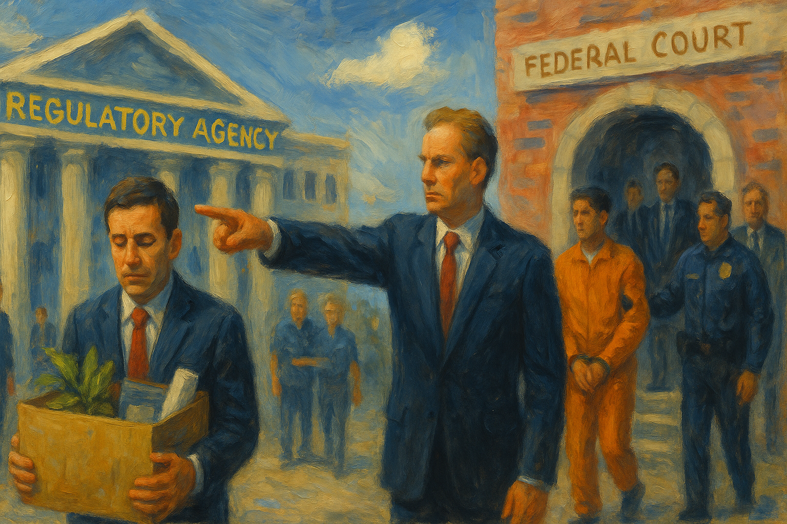

<!-- Generated by build_publish_week_v1 (appendix post) -->
<!-- Header image: image_wide_week70_appendix.png -->

# Week 70 Appendix: Patronage, Voting, and Public Myth

*Executive protection, weaker voting safeguards, and leader-centered commemoration advanced together while courts and lawmakers offered only partial resistance.*

This was a high-pressure week centered on executive self-protection, patronage-style use of public resources, and the conversion of legal and symbolic state machinery into instruments of personal rule. The dominant event cluster was the Justice Department’s creation of the $1.776 billion “Anti-Weaponization Fund” alongside agreements barring future tax scrutiny of Trump and related entities. That package strongly worsened traits tied to unchecked executive power, weaponized law, elite impunity, transparency failure, and crony capitalism. A second major theme was electoral and representational degradation: the Supreme Court’s weakening of Voting Rights Act protections, South Carolina’s move toward map redrawing, and North Carolina’s pending suppression rules all increased pressure on voter suppression and minority disenfranchisement. A third theme was memory politics and symbolic domination, with the Freedom 250 Christian-nationalist programming and approval of a Trump triumphal arch showing state-backed historical revision and personal glorification. Courts and some legislators did provide pockets of resistance, but the week’s raw structural force came mainly from attempts to entrench executive immunity, redirect public money to allies, and subordinate institutions to personal and ideological loyalty.

Power and Authority

1. Texas officials placed buoys along the Rio Grande near Eagle Pass (2026-05-16): The barrier used state power to deter border crossings through a physical hazard that affected migrants' movement and safety.

2. The Department of Justice created a $1.776 billion Anti-Weaponization Fund after Trump dropped his IRS lawsuit (2026-05-18): The fund redirected public money through executive control to compensate favored claimants, raising concerns about patronage, selective redress, and weak oversight.

3. Acting Attorney General Todd Blanche barred the government from pursuing tax-related claims against Trump, his family, and affiliated companies (2026-05-18): The order used executive legal power to shield the president and related entities from future scrutiny, weakening equal enforcement and accountability.

4. The Trump administration eased federal refrigerant rules for grocery stores and air-conditioning companies (2026-05-18): The rollback showed executive use of regulatory power to relax environmental limits in the name of prices, shifting public-risk decisions away from stricter safeguards.

5. The EPA proposed weakening federal drinking-water protections for several PFAS chemicals (2026-05-18): The proposal used executive rulemaking to reduce or delay health protections, affecting how the state safeguards communities from contamination.

6. The CDC re-established the Advisory Committee on Immunization Practices charter (2026-05-19): The action restored an expert advisory body that shapes vaccine policy, preserving a formal channel for evidence-based public health guidance.

7. The Trump administration launched TrumpRx and a Medicare pilot expanding access to GLP-1 obesity drugs (2026-05-19): The policy used executive health authority to shape drug access while raising conflict concerns because it could benefit companies tied to the president's investments.

8. President Trump held a press event at his planned Golden Ballroom construction site (2026-05-19): The event used presidential attention and security framing around a personal monument project, blurring public office with private glorification.

9. The Department of Health and Human Services issued an advisory on children's screen time (2026-05-21): The advisory showed routine executive use of public-health guidance to shape family and school behavior without direct legislative action.

10. The U.S. Commission of Fine Arts approved the design for Trump's triumphal arch in Washington (2026-05-21): The approval advanced a leader-centered monument through executive appointees, showing how state-controlled design bodies can shape public memory and symbolism.

11. President Trump called for Senate Republicans to replace the Senate parliamentarian (2026-05-21): The demand pressed a legislative gatekeeper to align with presidential goals, testing the independence of internal checks on majority power.

12. The Department of Homeland Security required many green card applicants to apply from their home countries (2026-05-22): The policy used executive immigration power to make status adjustment harder and more disruptive, increasing state leverage over families and vulnerable applicants.

13. The FDA announced a public advisory committee meeting on Moderna's MFLUSIVA vaccine (2026-05-22): The notice preserved a formal public process for expert review of a vaccine, supporting accountable regulatory decision-making.

14. The CDC suspended entry of certain non-U.S. citizens from Ebola-affected countries for 30 days (2026-05-18): The order used emergency health authority to restrict entry by nationality and status, showing how public-health powers can reshape mobility rights.

Institutions and Governance

1. The Senate parliamentarian stripped a $1 billion ballroom provision from the DHS bill (2026-05-16): The ruling enforced Senate procedure against an unrelated spending item, showing an internal rule-based check on appropriations maneuvering.

2. The First Circuit partly stayed and partly left in place orders requiring the VA to restore its union agreement (2026-05-16): The ruling preserved part of a lower-court check on agency action while narrowing judicial enforcement, shaping how labor rights are protected inside government.

3. Governor Henry McMaster called a special South Carolina legislative session on congressional redistricting (2026-05-17): The move opened a fast institutional path to redraw representation in a way critics said could weaken Black voting power.

4. The Supreme Court weakened protections for Black-majority districts under the Voting Rights Act (2026-05-17): The ruling reduced a key legal barrier against vote dilution, shifting power over representation toward state mapmakers.

5. House Democrats filed an amicus brief challenging any settlement tied to Trump's IRS lawsuit (2026-05-17): The filing used institutional oversight through the courts to contest executive use of taxpayer funds and defend constitutional spending limits.

6. The New York City Council failed to hold a promised vote on the No More 24 Act (2026-05-18): The delay showed how legislative inaction can stall labor protections even after public commitments, weakening accountability to affected workers.

7. Utah lawmakers advanced a state effort to ban prediction markets (2026-05-18): The move asserted state regulatory authority over a contested market area, highlighting institutional conflict over who sets the rules.

8. The Trump administration took control of America250 planning and redirected funds toward Freedom 250 (2026-05-18): The shift moved a national civic commemoration from a bipartisan structure toward a more centralized and politicized institutional arrangement.

9. Senate Democrats questioned Todd Blanche about the Anti-Weaponization Fund and planned an amendment against similar commissions (2026-05-18): The scrutiny used legislative oversight to challenge opaque executive spending and test whether Congress could limit future patronage-style funds.

10. The New York Times sued the Pentagon over its revised press access policy (2026-05-18): The case asked the courts to review whether an executive access rule unlawfully restricted reporting on a major public institution.

11. Geoff Duncan testified in the Georgia racketeering case against Trump and his allies (2026-05-18): The testimony supported a criminal accountability process involving a former president, reinforcing the role of courts in checking political actors.

12. Judge Gregory Carro suppressed some evidence and admitted other evidence in the Luigi Mangione trial (2026-05-18): The ruling showed routine judicial gatekeeping over police conduct and trial fairness, which is central to due process.

13. The South Carolina Supreme Court vacated Alex Murdaugh's murder conviction because of jury-related misconduct (2026-05-18): The decision showed appellate courts correcting trial corruption to protect the integrity of verdicts, even in a notorious case.

14. Federal judges in Maine and Wisconsin dismissed Justice Department lawsuits seeking detailed voter data (2026-05-19): The rulings limited federal demands for sensitive voter records and reinforced state control and privacy protections in election administration.

15. A coalition led by Maryland sued the Department of Education over graduate borrowing limits (2026-05-19): The lawsuit used federal courts to challenge a nationwide education rule, testing agency authority and procedural legality.

16. Judge Lamberth renewed an injunction protecting transgender plaintiffs from transfer and treatment changes (2026-05-19): The order kept judicial limits on executive detention policy in place, preserving court oversight over bodily safety and medical care.

17. Todd Blanche testified before a Senate appropriations subcommittee on the Justice Department budget and the Anti-Weaponization Fund (2026-05-19): The hearing put a controversial executive fund under formal legislative questioning, testing whether appropriators could force disclosure and limits.

18. The Senate advanced a war powers resolution to curb Trump's Iran operations (2026-05-19): The vote asserted Congress's constitutional role over war-making and challenged unilateral executive military action.

19. The Department of Defense inspector general opened an inquiry into U.S. airstrikes during Operation Southern Spear (2026-05-19): The investigation activated an internal accountability mechanism over lethal force, testing whether military procedures and legal standards were followed.

20. Representatives Brian Fitzpatrick and Tom Suozzi drafted legislation to block the Anti-Weaponization Fund (2026-05-20): The bipartisan bill sought to reclaim congressional control over spending and stop executive compensation of politically favored claimants.

21. Senate Republicans revolted against the Anti-Weaponization Fund and stalled related legislation (2026-05-20): The backlash showed internal institutional resistance to a presidentially aligned fund and disrupted the majority's legislative agenda.

22. Two January 6 officers sued Trump, Todd Blanche, and Scott Bessent over the Anti-Weaponization Fund (2026-05-20): The suit asked the courts to review whether executive officials exceeded legal authority by creating a fund that could reward Capitol attackers.

23. Judge Kathleen Williams dismissed Trump's IRS lawsuit after its withdrawal (2026-05-20): The dismissal underscored that courts still control case closure and can note the absence of a lawful settlement record in a politically sensitive dispute.

24. Judge Bates ordered the White House and vice president's office to comply with the Presidential Records Act (2026-05-20): The injunction reinforced statutory recordkeeping duties and judicial authority to preserve the documentary basis for future oversight and history.

25. Judge Birotte stayed ICE guidance that rescinded victim-centered enforcement policies (2026-05-20): The order checked an immigration policy change through administrative law and due process review, preserving protections during litigation.

26. Judge Leon denied a partial stay pending appeal in L.C. v. Trump (2026-05-20): The ruling kept a lower-court constraint on executive action in place while the appeal moved forward.

27. The Lansing City Council rejected a proposed hyperscale AI data center (2026-05-21): The vote showed local government using land-use authority to block a major project after public concerns about costs and environmental effects.

28. Sarah Kellen testified before the House oversight committee about Jeffrey Epstein's network (2026-05-21): The testimony fed a congressional inquiry into a high-profile federal investigation, using oversight powers to gather facts outside criminal court.

29. The Senate refused to move an ICE funding bill tied to ballroom spending and the Anti-Weaponization Fund fight (2026-05-21): The impasse showed appropriations as a site of institutional resistance when executive-linked spending became politically and procedurally toxic.

30. Representative Jamie Raskin introduced a bill to block taxpayer-funded settlement slush funds (2026-05-21): The bill sought to restore congressional control over federal payouts and prevent executive use of public money for political allies.

31. Senate Judiciary Committee Democrats demanded preservation of documents related to the January 6 fund agreement (2026-05-21): The request aimed to secure an evidentiary record for oversight, a basic institutional safeguard when executive actions are disputed.

32. Colorado Democrats censured Governor Jared Polis (2026-05-21): The censure showed a party using an internal accountability tool to publicly rebuke one of its own officeholders.

33. The National Federation of the Blind filed suit against the Department of Justice (2026-05-21): The complaint opened another judicial channel for reviewing executive conduct and rights enforcement.

34. The Fourth Circuit left in place an injunction protecting funding for providers of gender-affirming care for minors (2026-05-21): The decision preserved a court check on executive funding pressure against healthcare providers, keeping a rights-protective order in force.

35. Judge Evanson denied states' motion to enforce prior education grant orders (2026-05-21): The ruling declined to expand an existing injunction while warning about agency conduct, showing a court balancing restraint with continued supervision.

36. House Republican leaders pulled a vote on a war powers resolution over Iran (2026-05-22): The cancellation delayed a direct congressional check on military action, showing leadership control over whether oversight reaches the floor.

37. Federal prosecutors in Chicago dropped the remaining charges against the Broadview Six after misconduct findings (2026-05-22): The dismissal showed courts and prosecutors correcting a tainted protest case, reinforcing procedural fairness in politically charged prosecutions.

38. A federal appeals court upheld a ruling that kept Mahmoud Khalil detained and eligible for deportation (2026-05-22): The decision narrowed judicial relief for a permanent resident challenging detention, shaping how immigration courts and appeals constrain executive power.

39. Judge Crenshaw dismissed the indictment against Kilmar Ábrego García as vindictive prosecution (2026-05-22): The ruling used due process doctrine to block retaliatory criminal charging, reaffirming that courts can police abuse of prosecutorial power.

40. The D.C. Circuit granted an administrative stay pending appeal in L.C. v. Trump (2026-05-22): The stay temporarily shifted the balance back toward the government while appellate review continued, showing how higher courts can quickly alter protections.

Economic Structure

1. AutoZone warned of a potential 40% drop in lubricating fluid supply (2026-05-16): The warning pointed to supply fragility in a basic consumer market, showing how disruptions can affect daily economic security and service access.

2. The White House considered an executive order on beef tariffs as ground beef prices rose (2026-05-16): The discussion showed executive willingness to use trade tools to manage food prices, linking household costs to centralized economic intervention.

3. Reports on President Trump's golf travel showed taxpayer costs reaching about $148.4 million (2026-05-16): The spending highlighted how routine presidential travel choices can impose large public costs with limited direct public benefit.

4. The EPA granted contractors access to confidential business information for records work (2026-05-18): The move delegated sensitive regulatory data handling to private contractors, raising questions about accountability in outsourced state functions.

5. The FCC sought comments on an information collection tied to numbering resources and robocall enforcement (2026-05-18): The notice continued a routine regulatory process that affects how communications markets are administered and monitored.

6. Freedom 250 solicited corporate sponsorship tied to access to Trump (2026-05-18): The fundraising blurred public commemoration with donor access, showing how money can shape state-adjacent programs and influence.

7. President Trump made stock purchases that aligned with later or same-day public praise of Apple, Dell, Micron, and Thermo Fisher (2026-05-18): The trades raised conflict concerns by linking presidential speech and policy visibility to personal market activity.

8. The Investing in All of America Act of 2025 became law (2026-05-19): The enactment used federal law to direct investment policy, showing Congress still shaping regional economic development through statute.

9. The FCC issued a final rule strengthening competitive bidding in the E-Rate program (2026-05-19): The rule added documentation and portal requirements to reduce waste and improve accountability in a major public connectivity program.

10. The 30-year Treasury yield rose to its highest level since 2007 (2026-05-19): The jump signaled stress in borrowing conditions that can affect public finance, mortgage costs, and the government's fiscal room.

11. The CDC submitted information collection requests for national health care surveys and maternal mortality review data (2026-05-20): The requests supported the data systems that inform public spending and health policy, preserving state capacity to measure outcomes.

12. The U.S. government drew down the Strategic Petroleum Reserve (2026-05-20): The drawdown used federal energy reserves in a way critics said could sway markets, highlighting the state's power over price-sensitive resources.

13. The EPA invited or submitted multiple information collections and renewals on wastewater, chemicals, emissions, oil response, pesticides, and asbestos (2026-05-21): The notices kept routine regulatory systems running across environmental and school safety programs, sustaining the administrative backbone of public protections.

14. The FDA submitted or announced multiple information collections and guidances on cigarette warnings, drug manufacturing, patent restoration, animal drugs, generic drugs, clinical protocols, infant formula, and hepatitis delta designation (2026-05-21): The actions maintained routine federal rulemaking and guidance that shape drug safety, competition, and public-health markets.

15. OSHA gave preliminary approval to expand Intertek's testing recognition (2026-05-22): The move broadened a private lab's role in safety certification, showing how regulatory systems rely on recognized outside testers.

16. Reynolds American gave $5 million to Trump's super PAC before a favorable vape policy change (2026-05-22): The timing raised concerns that large donations could buy policy access or outcomes, weakening confidence in fair rulemaking.

17. The EPA published environmental impact statement notices and finalized several chemical and air rules (2026-05-22): The actions advanced routine environmental review and compliance systems that govern industrial activity and public exposure to risk.

18. The FCC sought comments and OMB review on spectrum and 4.9 GHz public safety data collections (2026-05-22): The notices continued administrative control over communications infrastructure that supports both markets and emergency services.

Civil Rights and Dissent

1. Long Island Rail Road unions went on strike and shut down the commuter rail system (2026-05-16): The strike exercised collective labor power in a major public system, showing workers' ability to disrupt services to press bargaining demands.

2. Women's March expanded an ad campaign urging ICE agents to reconsider their roles (2026-05-16): The campaign used protected advocacy to challenge immigration enforcement practices and defend immigrant communities through public persuasion.

3. Thousands of demonstrators gathered in Selma and Montgomery to defend voting rights (2026-05-17): The mobilization showed civil society responding to legal threats to representation by using protest to defend equal political participation.

4. North Carolina advocacy groups organized a rally against ICE detention expansion (2026-05-17): The planned protest used public assembly to oppose detention growth and defend immigrant communities from expanded coercive enforcement.

5. An ICE officer in Minnesota was charged over the shooting of a Venezuelan man during an immigration crackdown (2026-05-18): The charges created a rare accountability path for force used in immigration enforcement, where federal secrecy had hindered review.

6. Authorities investigated the San Diego mosque shooting as a hate crime (2026-05-18): The case highlighted the threat of targeted violence against a religious minority and the state's duty to protect equal security and worship.

7. A federal judge in New York barred ICE from making routine arrests in or around three Manhattan immigration courthouses (2026-05-19): The ruling protected access to court by reducing fear of arrest at hearings, strengthening due process for immigrants.

8. The California Department of Justice reported severe overcrowding, poor care, and abuse in ICE detention facilities (2026-05-19): The findings documented rights and health harms inside detention, exposing how immigration enforcement conditions can undermine bodily security.

9. The NAACP launched a campaign urging Black athletes to withhold commitments from Southern programs (2026-05-20): The campaign used organized economic and cultural pressure to protest policies seen as discriminatory, extending civil-rights advocacy beyond elections.

10. A University of Michigan student sued the university over alleged surveillance and retaliation tied to Gaza protests (2026-05-21): The suit challenged alleged monitoring and punishment of campus activism, testing whether protest rights were chilled by institutional power.

11. Governor Bill Lee granted Tony Carruthers a one-year stay of execution (2026-05-21): The stay paused an irreversible punishment after procedural and medical concerns, showing executive intervention in a life-and-death rights matter.

12. The Supreme Court left in place a ruling that barred Alabama from executing an intellectually disabled man (2026-05-21): The decision preserved a constitutional limit on capital punishment and reinforced protections for a vulnerable defendant.

13. ICE agents in Oregon were found to have made unlawful warrantless arrests of farm workers using facial recognition (2026-05-21): The case showed immigration enforcement using surveillance and force in ways a judge said likely violated civil liberties and due process.

14. The Department of Justice charged 15 people in Minnesota with a $90 million healthcare fraud scheme (2026-05-21): The case sought to protect public programs serving vulnerable people by prosecuting large-scale theft from government-funded care.

15. The Trump administration continued large-scale immigration raids that a study said did not help native-born workers (2026-05-21): The raids imposed coercive state power on immigrant communities without the promised public benefit, deepening rights costs for a targeted group.

16. A Chicago alderperson sued the United States over federal agents' alleged assault and detention of her at a hospital (2026-05-18): The complaint challenged federal force used during immigration enforcement and defended the rights of both an elected official and detained constituents.

Information, Memory and Manipulation

1. President Trump posted rants and conspiracy theories on Truth Social (2026-05-16): The posts amplified false or unverified claims from a major political figure, adding noise and distrust to the public information sphere.

2. President Trump and his advisers made thousands of stock trades without using a qualified blind trust (2026-05-16): The disclosures showed weak separation between public office and private financial knowledge, limiting transparency about possible conflicts of interest.

3. Todd Blanche said the Justice Department was focused on proving the 2020 election was stolen (2026-05-17): The statement put state credibility behind a false election narrative, risking further damage to trust in electoral facts and institutions.

4. The North Carolina Board of Elections prepared to vote on a new set of election rules critics called suppressive (2026-05-17): The pending rules were framed as election integrity measures, showing how administrative control of voting can be paired with contested public narratives.

5. President Trump retaliated against Republicans who pushed for release of Epstein-related files (2026-05-17): The retaliation signaled pressure against transparency demands inside his own party, discouraging disclosure of politically sensitive information.

6. Government organizers and allied speakers staged the Rededicate 250 event and promoted a Christian nationalist account of the nation's founding (2026-05-18): The event used public ceremony and official voices to reshape national memory around an exclusionary historical narrative.

7. The Brookings Institution reported that more than 145,000 U.S. children had experienced parental detention under current immigration enforcement (2026-05-18): The report highlighted a major gap in official family-separation data and pressed the government to disclose the human effects of its policies.

8. Todd Blanche and the Anti-Weaponization Fund agreement gave conflicting accounts of whether payouts would be publicly disclosed (2026-05-18): The contradiction obscured who would receive public money and weakened confidence in the transparency of a major executive fund.

9. Reports on government waste, fraud, and abuse said such losses had risen 13% under Trump and DOGE (2026-05-19): The reported increase raised accountability concerns by suggesting weaker internal controls over public spending and administration.

10. The FCC announced a public meeting of its Consumer Protection and Accessibility Advisory Committee (2026-05-20): The notice supported open participation in communications policy, preserving a formal channel for public input and accessible information.

11. The DNC released its 2024 election autopsy and drew criticism over its handling (2026-05-21): The report shaped how a major party explains electoral failure, affecting internal accountability and the information base for future strategy.

12. New York City Mayor Zohran Mamdani launched a Twitch show to speak directly with constituents (2026-05-21): The move used a digital platform to widen direct public communication, showing how political information channels are shifting outside traditional media.

13. The Trump administration tried to ban widely used voting machines by casting their components as national-security risks (2026-05-21): The failed effort showed how security claims can be used to cast doubt on election infrastructure and unsettle trust in vote counting.

14. The release of Jeffrey Epstein's alleged suicide note added new material to public debate over his death and the jail investigation (2026-05-18): The disclosure affected a long-running contested information environment around a high-profile death and official credibility.

