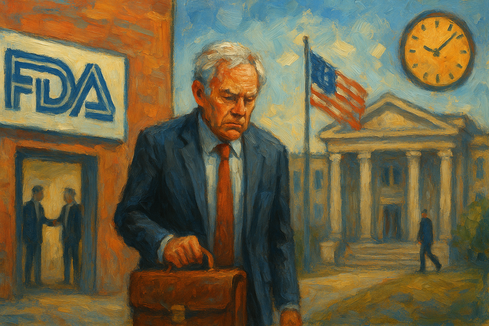

<!-- Generated by build_publish_week_v1 -->
<!-- Header image: image_wide_week70.png -->

# Week 70: Instability as Governance

*Leadership churn at the FDA showed how executive personnel power can weaken expert independence without changing the law or moving the clock.*

> The most dangerous power is the power that learns to hide inside routine. — Anonymous
> Institutions are not only built by laws, but by the habits that let people speak honestly within them. — Anonymous
> The spirit of liberty is the spirit which is not too sure that it is right. — Learned Hand

Week 70 was quiet on the surface. No broad campaign spread across the state. No new doctrine was announced. What mattered instead was smaller, and more telling: power used through personnel inside a technical agency, in a way that left the formal shell of government intact while weakening confidence that expertise could stand on its own. This was a week about administrative insecurity. It showed how a government can change the conduct of the state without changing the law.

At the close of the last period, the Democracy Clock stood at 8:13 p.m. It remained at 8:13 p.m. by the end of Week 70, a net change of 0 minutes. The hold did not mean stillness. It meant the week’s main development confirmed an existing pattern rather than opening a new stage of decay. A key regulator was further unsettled by leadership removal and churn. That deepened risks already present in the system: weaker agency independence, a more pliable civil service, and a stronger sense that high office depends on alignment as much as competence. At the same time, a terrorism case moved through ordinary federal court channels. That helped keep the week’s overall measure in place.

The central event came at the Food and Drug Administration. The acting drug chief, Tracy Beth Høeg, was fired during a broader leadership shake-up. Other senior officials were also pushed out, and the agency remained without permanent top leadership. That sequence mattered more than any single name. In a technical regulator, continuity is part of the work. Expertise does not live only in statutes or manuals. It lives in the settled expectation that judgment can be exercised without sudden political penalty.

The immediate winners were those at the executive center who could use removal power to make the agency’s upper ranks more alert to political will. The immediate losers were the officials whose authority depended on professional standing rather than personal favor. But the deeper loss fell on the agency itself. A regulator charged with hard, expert decisions works best when its senior staff believe that disagreement, caution, and delay in the face of pressure are allowed. Once that belief weakens, the agency may still function. But it functions under a different sky.

Nothing in the record shows a formal rewrite of the FDA’s mission. That is part of the point. The week’s change came through disruption, not decree. No statute had to be amended. No public doctrine had to be defended. A firing, paired with wider churn and the absence of stable confirmed leadership, was enough to alter the balance inside the building. It told senior staff that tenure was uncertain, that acting status could stretch on, and that the line between expert judgment and political acceptability had grown thinner.

This is why the event registered as more than ordinary management turnover. Agencies always have personnel changes. Democracies can absorb them. What gave this week its weight was the pattern described by the record: a broader purge of senior FDA leadership, an acting official who said she was fired after refusing to resign, and no settled leadership structure to replace what had been removed. Instability itself became the fact to notice. In a technical agency, instability is not neutral. It can become a method of rule.

That method works by changing incentives before it changes outcomes. A commissioner or acting chief does not need to issue a blunt order if subordinates already know that independence carries risk. The lesson spreads fast. Staff become more careful about resisting pressure, more cautious about slowing a preferred decision, and more aware that their place may depend on pliancy. The agency’s public face remains lawful. Its inner life grows more guarded.

The structural effect reaches beyond one office. The FDA is not a symbolic body. It is a regulator whose decisions touch health, commerce, and public trust. When its leadership turns unstable, the risk is not only that one policy will change. The larger risk is that outside interests, political or private, gain a better chance to shape decisions because the people meant to resist them are less secure. Capture often begins this way. Not with an open handover, but with a weakening of the people who can say no.

Week 70 therefore added to a long-running problem in the modern state: the ease with which executive personnel power can reach into institutions that depend on some distance from politics. That distance is never absolute. Nor should it be. Agencies are part of the constitutional order, not outside it. But there is a real difference between lawful supervision and a climate in which expert authority appears contingent on obedience. The week moved within that difference. It did not cross into spectacle. It did not need to.

The same event also bore on the civil service more broadly. The record points to loyalty-based disruption of expert administration at a major federal regulator. That is a narrower claim than saying the whole service was remade. It is also a serious one. A merit-based administrative state rests on the idea that skilled officials can carry out public duties under law even when their judgments do not flatter the wishes of political superiors. Remove enough senior people under conditions like these, and that idea begins to fray.

Here again, the winners were not simply the replacements, whoever they might be. The winners were those who benefit from a service that feels provisional. A civil service becomes easier to steer when its upper ranks believe they serve at sufferance in more than the ordinary sense. The losers were career norms, internal candor, and the habit of expert resistance. Those losses are hard to count. They rarely appear in a single order. Yet they shape what the state can do with honesty and steadiness.

The week’s evidence supports a modest but real worsening of that condition. The record does not show a formal purge across government. It shows something smaller and more precise: a major regulator where senior officials were forced out, where an acting chief said she was fired after refusing to resign, and where permanent leadership remained absent. That is enough. It deepens the sense that public service at high levels is becoming more exposed to political will. The damage is structural. It lies in the changed terms of service.

Such changes also affect those who remain. A bureaucracy learns from examples. One firing can teach more than many memos. If the lesson drawn inside the FDA is that disagreement with the line from above may end a career, then future disputes may never fully surface. Advice will be softened. Warnings will be delayed. Records may still be written, but with less force. The public may never see the missing argument. That is how state capacity declines while procedure stays in place.

The week’s third movement was smaller, but it belonged to the same chain. The removal of multiple FDA leaders and the installation of another acting replacement strengthened the sense that key posts turn on political alignment rather than settled expertise and continuity. This was not a story of wealth in the crude sense. It was a story of loyalty and replaceability. Acting status can be useful in emergencies. Used over time, it can also make authority more dependent and less secure.

That matters because appointments do more than fill chairs. They set the moral weather of an institution. A permanent, respected official can sometimes absorb pressure and protect subordinates. An acting official, especially in a churned environment, often governs under a shadow. The office exists, but the holder knows its limits. Others know them too. In such settings, the executive center gains leverage without issuing many commands. The possibility of removal does the work.

The result is a subtle transfer of power upward. Not upward through law, but through uncertainty. Senior public roles begin to look less like entrusted offices and more like revocable placements. Once that view takes hold, the pool of people willing to serve may change. Those most ready to accept insecure terms are often those most ready to adapt themselves to power. The state then loses not only independence in the present, but quality in the future.

This was why the week could remain still on the clock while still revealing something important. The event did not widen the map of democratic damage. It thickened one part of it. The pattern was already known: executive leverage through personnel disruption rather than formal legal change. Week 70 supplied another clear instance. It showed that pressure on democratic governance can come through the weakening of competent administration, not only through attacks on elections, courts, or speech.

There was one other notable event in the record, and its significance lay in its limits. The Justice Department charged Mohammad Baqer Saad Dawood al-Saadi in federal court with terrorism-related offenses. On the facts provided, the case moved through ordinary prosecutorial and judicial channels. It did not present itself as an exceptional security action, or as a visible use of emergency logic to bypass normal process. That distinction mattered.

The existence of a terrorism case does not by itself tell a democratic story. Much depends on how the case is handled. Here, the record points toward standard rule-of-law function rather than politicized security practice. Prosecutors charged a defendant. A federal court received the case. No special erosion signal was attached to it. That did not repair the week’s administrative damage, but it did help explain why the overall measure held. Not every exercise of state force marks decay. Some remain within ordinary law.

That contrast sharpened the week’s meaning. The more visible coercive arm of the state, at least on the facts available here, appeared to operate through regular channels. The quieter administrative arm showed the more troubling sign. This is often how democratic weakening proceeds in mature systems. The courthouse may still look normal. The paperwork may still be proper. Yet inside agencies, where expertise and continuity should check impulse, insecurity spreads and judgment bends.

Week 70 therefore belongs to the record not as a week of rupture, but as a week of confirmation. It showed again that a democracy can lose strength through the thinning of professional independence inside the state. A regulator need not be abolished to be weakened. It need only be made unsure of itself. Once that happens, power gathers at the center, private pressure finds easier purchase, and the public meets a government that still speaks in the language of law while acting in the mood of command.

In the larger arc of the term, this period marked a pause in movement but not in meaning. The week did not deepen erosion through spectacle or force. It did so through a quieter lesson in how institutions are made compliant. The forms of government remained. The habits that give those forms substance were pressed again. That is how fragility grows: not only when rules are broken in public, but when the people charged with carrying them out learn, step by step, that independence has become a risk.

<!-- Synopses for cross-posting -->
Long Synopsis: Week 70 centered on a quiet but consequential form of democratic strain: administrative destabilization inside a technical agency. The firing of the FDA's acting drug chief, amid broader leadership churn and the absence of permanent top leadership, reinforced a pattern in which expert authority appears increasingly contingent on political acceptability. The main institutional effect was not a formal change in law, but a weakening of confidence that senior officials can exercise independent judgment without penalty. That modestly worsened traits tied to agency capture risk, politicized civil service, and loyalty-based appointments. At the same time, a terrorism case proceeded through ordinary federal court channels, offering a counterexample of routine rule-of-law function rather than exceptional executive action. The Democracy Clock held at 8:13 p.m., reflecting confirmation of an existing erosion pattern rather than a new break.
Short Synopsis: A week of surface calm revealed a deeper pattern: instability at the FDA made expert administration look more contingent on loyalty than competence. The clock did not move, but the record thickened around politicized governance inside the state.

