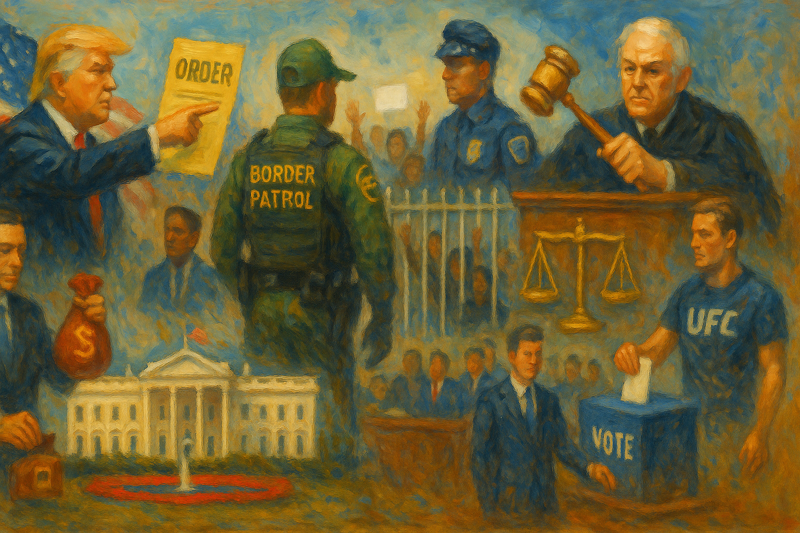

<!-- Generated by build_publish_week_v1 (appendix post) -->
<!-- Header image: image_wide_week71_appendix.png -->

# Week 71 Appendix: Personal Rule Through State Power

*Immigration coercion, patronage fights, symbolic glorification, and secrecy deepened together as courts and some local officials mounted reactive resistance.*

This was a high-pressure week defined by the fusion of personalist rule, retaliatory law enforcement, and symbolic state capture. The strongest pattern was the use of executive and justice machinery for loyalty enforcement and enemy punishment: executive orders and DOJ actions targeted critics, activists, media-adjacent figures, and Trump’s past adversaries, while immigration enforcement repeatedly appeared as both a coercive policy domain and a theater of force against protesters and oversight officials. A second major theme was corruption moving from allegation toward governing method: the anti-weaponization fund, donor-linked regulatory favors, Pentagon loans and contracts benefiting Trump-linked interests, and the White House/UFC spectacle all pointed to public office being used for enrichment and glorification. Elections also came under notable pressure through North Carolina voting restrictions, deceptive PAC activity, AI-enabled manipulation, and loyalty purges inside Republican primaries. Courts provided meaningful counterpressure in several cases—blocking the slush fund, protecting speech, stopping discriminatory maps, and checking memorial renaming—but the week overall showed a system where democratic safeguards are increasingly forced into reactive defense against executive abuse rather than setting the terms of governance.

Power and Authority

1. Governor Gavin Newsom declared a state of emergency over the Orange County chemical tank threat (2026-05-23): The declaration activated emergency powers and state resources to manage a mass evacuation and public safety crisis affecting tens of thousands of residents.

2. President Trump issued executive orders targeting Andrew Weissmann (2026-05-24): Using presidential power against a named critic tested whether executive authority could be used for personal retaliation rather than neutral governance.

3. The Trump administration approved the sale of higher-ethanol fuel to ease gas prices (2026-05-24): The move used executive regulatory power to blunt war-linked fuel costs, showing how emergency economic pressure can drive fast policy changes with public health tradeoffs.

4. The White House began building a UFC arena on the White House grounds (2026-05-25): Using presidential grounds for a leader-linked spectacle blurred the line between public property, official symbolism, and personal promotion.

5. The Trump administration announced a rule requiring many temporary visa holders to leave the United States to pursue green cards abroad (2026-05-25): The rule used executive immigration power to make legal status more precarious for lawful residents and workers, increasing dependence on discretionary state decisions.

6. President Trump was reported to have used his office for insider trading and a $1.776 billion settlement benefiting allies (2026-05-25): The reported conduct suggested direct use of presidential power for self-enrichment and patronage, weakening the boundary between public office and private gain.

7. The FDA renewed the Drug Safety and Risk Management Advisory Committee (2026-05-26): Renewing the committee preserved expert input inside executive decision-making, supporting accountable regulation in a technical public health area.

8. The FDA renewed the Pulmonary-Allergy Drugs Advisory Committee (2026-05-26): Renewing the committee maintained expert oversight within executive regulation, helping keep specialized drug decisions tied to public process and expertise.

9. The Department of Transportation implemented a rule restricting many immigrant truck drivers from obtaining or renewing commercial licenses (2026-05-26): The rule used executive licensing power to narrow lawful work access for immigrants, affecting both equal treatment and economic security.

10. The National Park Service allocated $67 million in park entrance fees for Washington beautification projects (2026-05-27): Directing public funds to symbolic capital projects raised questions about executive spending priorities and the use of state resources for image-making.

11. DHS Secretary Markwayne Mullin announced plans to withdraw customs agents from airports in sanctuary cities (2026-05-27): The plan used federal operational power to pressure local governments on immigration policy, testing the limits of coercion against disfavored cities.

12. The Trump administration proposed a $250 bill bearing Donald Trump's portrait (2026-05-28): The proposal used executive influence over national symbols for leader glorification and challenged legal norms that limit personal use of state imagery.

13. Mayor Brandon Johnson signed an executive order directing Chicago departments to resist federal immigration raids (2026-05-29): The order used local executive power to protect residents' rights and assert municipal autonomy against threatened federal immigration enforcement.

Institutions and Governance

1. Congress was described as having created the National Foundation on the Arts and Humanities (2026-05-23): The entry described Congress creating cultural institutions that support civic life and public knowledge through durable federal structures.

2. Congress was described as having passed the Civil Rights Act of 1964 (2026-05-23): The entry described Congress strengthening equal protection through landmark anti-discrimination law, a core institutional safeguard for democratic inclusion.

3. Congress was described as having passed the Economic Opportunity Act of 1964 (2026-05-23): The entry described Congress building antipoverty institutions that broadened access to public support and democratic participation.

4. Congress was described as having passed the Elementary and Secondary Education Act of 1965 (2026-05-23): The entry described Congress expanding federal support for schooling, reinforcing the institutional basis for equal opportunity and civic capacity.

5. Congress was described as having passed the Food Stamp Act of 1964 (2026-05-23): The entry described Congress using federal law to support basic welfare, showing how institutions can widen material access needed for democratic participation.

6. Congress was described as having passed the Higher Education Act of 1965 (2026-05-23): The entry described Congress expanding access to higher education, strengthening the institutional foundations of an informed public.

7. Congress was described as having passed the Social Security Act of 1965 (2026-05-23): The entry described Congress creating major health coverage programs, reinforcing the role of public institutions in protecting social welfare.

8. Congress was described as having passed the Water Quality Act of 1965 (2026-05-23): The entry described Congress setting federal environmental standards, showing institutional responsibility for public health and shared resources.

9. A U.S. district judge dismissed Michael Wolff's preemptive lawsuit against Melania Trump (2026-05-23): The ruling reinforced procedural limits on forum shopping and showed courts policing how litigants use judicial process.

10. The DHS inspector general opened an audit into detention-facility warehouse purchases and contracts (2026-05-23): The audit represented internal oversight of large federal spending decisions and tested whether watchdog institutions could check misuse of public funds.

11. Representative Brian Fitzpatrick introduced a bill to bar federal payments to Trump's Anti-Weaponization Fund (2026-05-25): The bill was a legislative attempt to reassert control over federal spending and block partisan use of public money.

12. The South Carolina Senate rejected a proposal to redraw congressional districts before the midterms (2026-05-26): The vote showed a state legislature refusing a rushed map change that could have altered representation during an active election cycle.

13. House Speaker Mike Johnson sent House members home early to avoid a war powers vote on Iran (2026-05-26): The move weakened Congress's ability to check military action and highlighted procedural control as a tool in separation-of-powers conflicts.

14. Former President Biden filed suit against the Department of Justice to block release of interview audio and transcripts (2026-05-26): The case tested how courts balance privacy claims against executive disclosure decisions and oversight demands.

15. Judge Gallagher extended the settlement agreement in J.O.P. v. Department of Homeland Security (2026-05-26): The order kept court supervision in place after a policy change affected asylum adjudications, preserving judicial oversight of agency conduct.

16. Judge Seibel enjoined West Point from enforcing its prior-approval policy on civilian faculty speech (2026-05-26): The ruling protected academic speech against institutional controls that the court found likely aimed at suppressing dissenting views.

17. Judge Lamberth extended an injunction against the prison ban on gender-affirming treatment for class members (2026-05-26): The order required a federal institution to maintain prescribed care, showing courts checking executive restrictions inside prisons.

18. The National Archives and Records Administration requested public comments on proposed federal records schedules (2026-05-26): The notice preserved a public process for records management, supporting accountability in how government documents are retained or disposed of.

19. Tulsi Gabbard announced her resignation as director of national intelligence (2026-05-26): The departure signaled instability at the top of the intelligence system and raised questions about political pressure on national security leadership.

20. FBI Director Kash Patel fired a top FBI intelligence official (2026-05-26): Removing a senior analyst over a politically sensitive assessment threatened the independence of professional law enforcement analysis.

21. A federal court panel blocked Alabama from using its new congressional map for the 2026 midterms (2026-05-26): The ruling checked discriminatory districting and showed courts enforcing representation rules against state manipulation.

22. Two fair lending nonprofits and two consultancy firms sued the CFPB over a rule eliminating disparate-impact liability under the Equal Credit Opportunity Act (2026-05-27): The suit challenged whether an agency could narrow anti-discrimination protections and whether its acting leadership had lawful authority.

23. Judge Chutkan partly dismissed and partly allowed claims in the consolidated Council for Opportunity in Education cases (2026-05-27): The rulings narrowed some claims but preserved constitutional APA challenges, keeping judicial review over education policy alive.

24. The White House pushed Congress to approve a $250 bill with Trump's image (2026-05-28): The effort sought legislative approval for a leader-centered change to national currency, testing how institutions handle personalist symbolism.

25. A coalition of 22 attorneys general filed suit to protect states' authority over election administration (2026-05-28): The lawsuit used the courts to defend state control over voting procedures against federal interference claims.

26. New York's highest court rejected legal personhood and liberty claims for the elephant Happy (2026-05-28): The ruling marked a boundary on judicial expansion of rights and showed courts defining the reach of legal personhood.

27. The Supreme Court ruled for Terry Pitchford in a case involving racial bias in jury selection (2026-05-28): The decision reinforced constitutional limits on discriminatory jury selection and affirmed judicial review as a check on biased trials.

28. Allison Gill filed suit challenging the creation of the Anti-Weaponization Fund (2026-05-28): The complaint argued that a major federal fund was created without proper procedure, testing administrative law limits on executive action.

29. Judge Nichols denied preliminary injunction requests against Executive Order 14399 in three election cases (2026-05-28): The rulings left the order in place for now by finding the challenges premature, delaying judicial review of election-related executive directives.

30. A federal court ordered Donald Trump to respond to retired judges' filing over the Anti-Weaponization Fund (2026-05-28): The order advanced judicial scrutiny of a disputed settlement structure and signaled that courts were taking the challenge seriously.

31. A federal judge ruled that the Kennedy Center could not be renamed for Donald Trump without an act of Congress (2026-05-28): The ruling enforced statutory limits on a federal institution and affirmed that major symbolic changes require legislative authority.

32. Congress enacted the Medal of Sacrifice Act (2026-05-28): The law showed routine legislative action continuing through formal process to create a new military honor.

33. Pam Bondi testified before the House Oversight Committee about the Epstein files (2026-05-29): The hearing tested congressional oversight of the Justice Department's handling of sensitive records and exposed disputes over transparency and procedure.

34. Two families filed a class-action lawsuit against New York City's child welfare agency over emergency child removals (2026-05-29): The suit challenged an alleged practice of bypassing court review in family separations, raising due process and equal protection concerns.

35. Judge Waverly Crenshaw dismissed charges against Kilmar Ábrego García (2026-05-27): The dismissal showed courts checking alleged vindictive prosecution and limiting misuse of criminal process in an immigration-related case.

36. A federal judge temporarily blocked the Anti-Weaponization Fund while litigation proceeds (2026-05-29): The injunction prevented disputed public money from being transferred or spent before courts could review the fund's legality.

37. Thirty-five former federal judges filed papers seeking to reopen Trump's IRS case and challenge the settlement fund (2026-05-28): The filing used institutional credibility to argue that the court process itself may have been manipulated in a high-stakes settlement.

38. Judge Cooper denied a preliminary injunction in the DC Preservation League case over Kennedy Center renovations (2026-05-29): The ruling left renovation plans in place for now while preserving the court's role in reviewing future changes to a federal cultural institution.

39. A judge set a hearing in Katie Phang's lawsuit seeking more Epstein files (2026-05-29): Scheduling the hearing kept judicial pressure on the government to justify its handling of contested records.

40. A federal judge dismissed charges against six Chicago-area protesters because of prosecutorial misconduct (2026-05-29): The dismissal showed courts policing prosecutorial abuse and protecting the integrity of criminal proceedings tied to protest activity.

41. A Texas jury convicted Anthony Odiong of sexual assault (2026-05-29): The conviction showed the justice system holding a religious authority figure accountable for abuse of power over vulnerable people.

42. A tourist in Hawaii was charged with harassing an endangered monk seal (2026-05-27): The case reflected routine legal enforcement and the continued operation of courts in applying protective laws.

43. Anthony Odiong went on trial in Texas on sexual assault charges (2026-05-27): The trial tested whether courts could address alleged abuse of authority inside a religious institution through ordinary criminal process.

Economic Structure

1. Democrats proposed tax cuts for the upper middle class (2026-05-23): The proposal highlighted how fiscal choices can shift burdens and benefits upward even amid debt and budget pressure.

2. The U.S. government was described as borrowing more to cover interest payments on existing debt (2026-05-23): The reported borrowing pattern pointed to fiscal strain that can narrow future democratic choices over public spending.

3. The Trump administration was described as maintaining a high budget deficit (2026-05-23): Sustained deficit spending at higher interest rates increased pressure on future budgets and the state's capacity to fund public goods.

4. The United States was described as having national debt above 100 percent of GDP (2026-05-23): The debt level was presented as a structural fiscal risk that could constrain democratic policymaking and public investment.

5. The CFTC under the Trump administration reduced crypto enforcement and sidelined officials who raised concerns about Trump-linked firms (2026-05-24): Weakening enforcement in a volatile market suggested regulatory capture and reduced accountability for politically connected financial actors.

6. President Trump was reported to have proposed a taxpayer-backed fund for supporters accused of crimes (2026-05-25): The proposal would have redirected public money toward politically favored claimants, blurring compensation policy with partisan patronage.

7. The EPA finalized a rule adjusting hydrofluorocarbon phasedown requirements (2026-05-26): The rule showed routine regulatory governance balancing environmental standards, industry compliance, and public accountability.

8. The FDA requested public comments on information collection for human drug compounding (2026-05-26): The notice preserved public participation in technical regulation, supporting transparent rulemaking in a health-related market.

9. Reynolds American donated to MAGA Inc. before Trump and FDA officials changed guidance on fruit-flavored vapes (2026-05-26): The sequence suggested donor influence over public health regulation, raising concerns that money could shape policy outcomes.

10. Donald Trump promoted an unregulated online casino after its co-owner donated to MAGA Inc. (2026-05-26): The promotion raised conflict-of-interest concerns by linking political fundraising to support for a business facing regulatory and legal scrutiny.

11. Kamal Ghaffarian donated $1 million to MAGA Inc. while leading a major government contractor (2026-05-26): The donation highlighted how campaign finance loopholes can let contractor-linked money seek influence around federal business.

12. The CDC invited comments on renewing the AVERT violence and mental health data collection (2026-05-27): The notice maintained public input into federal data systems that inform resource allocation and public policy.

13. The CDC submitted the National Firefighter Registry for Cancer information collection to OMB for review (2026-05-27): The action supported continued federal data gathering on occupational health risks, informing public policy and worker protection.

14. The Department of Labor canceled the 2026 inflation adjustment for civil monetary penalties (2026-05-27): Keeping penalties flat reduced the deterrent force of enforcement and could weaken accountability for regulated actors.

15. The EPA allocated 2026 hydrofluorocarbon allowances after no inhaler applications were filed (2026-05-27): The allocation showed routine administrative control over scarce regulatory allowances in an environmentally sensitive market.

16. The FDA withdrew hearing requests for certain estrogen-androgen drug products and barred shipment without approval (2026-05-27): The action enforced efficacy standards and showed regulatory institutions limiting market access for unsupported products.

17. The Bureau of Prisons awarded LEO Technologies a $106 million contract to monitor prisoners' calls with AI (2026-05-27): The contract raised concerns about politically connected vendors gaining state surveillance work through federal procurement.

18. The Pentagon expedited a $620 million loan to a startup linked to Donald Trump Jr. (2026-05-27): The loan suggested that political ties could shape access to major public financing, weakening confidence in neutral allocation of state resources.

19. The United States reported inflation at its highest level in three years (2026-05-27): Rising prices and weaker savings reduced household security and can narrow the practical freedom needed for democratic participation.

20. Treasury Secretary Scott Bessent addressed questions about inflation, savings, and interest rates (2026-05-27): The briefing showed executive economic stewardship under scrutiny as households faced worsening financial pressure.

21. The United States revised first-quarter GDP growth down to 1.6 percent (2026-05-27): The weaker growth figure added to signs of economic strain that can shape public confidence and policy capacity.

22. The FCC requested comments on an information collection review (2026-05-28): The notice preserved a public comment channel in communications regulation, supporting procedural accountability.

23. The FDA announced a public meeting on lot-level food traceability (2026-05-28): The meeting invited public input on food safety regulation, reinforcing participatory rulemaking in a key public health market.

24. The FDA classified an endoscopic suturing device for weight loss as a class II device with special controls (2026-05-28): The classification showed routine regulatory gatekeeping over medical devices, balancing access and safety through formal standards.

25. The FDA extended the comment period for its AI clinical trials pilot program (2026-05-28): The extension widened public participation in a rulemaking process about AI use in drug development.

26. Donald Trump bought stock in UFC's parent company before promoting a White House UFC event (2026-05-28): The purchase raised conflict-of-interest concerns by linking personal financial holdings to official promotion of a related event.

27. The Department of Justice and ten state attorneys general were described as suing RealPage and private equity firms over rent-setting collusion (2026-05-28): The case targeted alleged algorithmic collusion that could distort housing markets and burden renters, showing antitrust enforcement against concentrated power.

28. Private equity firms were described as exploiting low-income housing tax credits to raise rents after restrictions expired (2026-05-28): The reported strategy showed how financial actors can use public subsidy structures to extract value while weakening affordable housing goals.

29. Private equity firms were described as increasing their ownership of U.S. apartments (2026-05-28): Growing concentration in rental housing was linked to higher rents and weaker tenant conditions, shifting power from residents to large investors.

30. The EPA approved California air plan revisions for volatile organic compound emissions (2026-05-29): The approval showed routine federal-state regulatory coordination on pollution controls that affect public health and local accountability.

31. The EPA approved negative declarations for certain air quality facilities in the District of Columbia (2026-05-29): The action adjusted regulatory obligations through formal process, showing ordinary environmental governance at work.

32. The EPA approved Virginia's repeal of stationary source regulations where no applicable sources remained (2026-05-29): The approval reflected routine updating of state environmental rules through federal review.

33. The EPA approved a New York plan revision for nitrogen oxide controls at the Athens Generating Plant (2026-05-29): The action showed federal oversight of state emissions controls through established regulatory channels.

34. The EPA approved South Carolina's emissions control plan for solid waste incineration units (2026-05-29): The approval demonstrated cooperative federalism in environmental regulation and enforcement.

35. The EPA approved Indiana revisions allowing an alternative control device for volatile organic compound emissions (2026-05-29): The decision reflected routine federal review of state compliance choices under national air quality law.

36. The EPA issued a clean data determination for the Baltimore ozone area (2026-05-29): The determination changed regulatory obligations based on measured compliance, showing data-driven environmental governance.

37. The EPA exempted certain plant-incorporated proteins from pesticide tolerance requirements (2026-05-29): The rule altered food and agriculture regulation through formal administrative process, affecting market standards and oversight.

38. The EPA established pesticide tolerances for propylene oxide on several crops (2026-05-29): The rule set legal residue limits through administrative procedure, shaping food regulation and producer compliance.

39. The EPA partially approved and partially disapproved Hawaii's regional haze plan (2026-05-29): The decision showed federal review balancing environmental goals, grid concerns, and legal constraints in state planning.

40. The EPA updated materials incorporated by reference into Idaho's state implementation plan (2026-05-29): The update maintained accurate federal records for state environmental rules, supporting enforceability and public access.

41. The FCC requested comments on another information collection review (2026-05-29): The notice continued routine public participation in communications regulation and paperwork oversight.

42. The FDA issued final guidance on statistical approaches to bioequivalence (2026-05-29): The guidance updated the technical rules for drug approval, shaping how regulators and firms demonstrate product equivalence.

43. OSHA granted an interim order allowing deviations from certain safety standards for a tunnel project (2026-05-29): The order showed regulatory flexibility in workplace safety while keeping the project under federal oversight.

Civil Rights and Dissent

1. ICE released Rodney Taylor from detention after prolonged confinement (2026-05-23): The release highlighted the rights and bodily security stakes of immigration detention, especially for a disabled lawful resident with unresolved status.

2. Federal officials issued subpoenas to Hasan Piker and Medea Benjamin in a Cuba sanctions investigation (2026-05-23): The subpoenas raised concerns that national security and sanctions tools were being used in ways that could chill activism and dissent.

3. ICE was reported to have received funding for deportations and alleged political targeting (2026-05-23): The report suggested immigration enforcement could be used not only against migrants but also as a coercive tool against political opponents.

4. The North Carolina Board of Elections took actions that could remove legitimate voters from the rolls (2026-05-23): The reported actions threatened lawful voter access by increasing the risk of erroneous disenfranchisement through election administration.

5. The North Carolina Senate voted to cut early voting from 17 days to 10 days (2026-05-23): Reducing early voting narrowed access to the ballot and increased the burden on voters who rely on flexible voting windows.

6. Orange County authorities issued and expanded evacuation orders over the chemical tank threat (2026-05-23): The orders directly affected residents' bodily security and freedom of movement during a large-scale public safety emergency.

7. Florida officials announced that the Alligator Alcatraz immigration jail would close (2026-05-24): Closing the facility responded to sustained criticism of detention conditions and reduced exposure to an allegedly abusive confinement setting.

8. The Third Circuit Court of Appeals temporarily blocked the re-detention of Mahmoud Khalil (2026-05-26): The order protected a green card holder from renewed detention while courts reviewed a case tied to speech, activism, and deportation risk.

9. Ken Paxton pursued legal actions against an Islamic center development in Texas (2026-05-26): The litigation raised concerns that state power was being used in a way that burdened a religious minority community.

10. Federal agents used pepper spray and other force against protesters outside Delaney Hall in Newark (2026-05-25): The repeated use of force against demonstrators and an oversight visit tested protest rights and the treatment of people challenging detention conditions.

11. The National Fair Housing Alliance and other plaintiffs sued the CFPB over a rule narrowing fair lending protections (2026-05-27): The suit sought to preserve anti-discrimination safeguards in credit markets, where rule changes can directly affect equal access and civil rights.

12. ICE was reported to have reached a record number of suicides in custody (2026-05-27): The reported deaths raised severe concerns about detainee safety, conditions of confinement, and the state's duty to protect people in custody.

13. The CDC requested comments on rape prevention and education program data collection (2026-05-27): The notice supported federal efforts to improve prevention of sexual violence through data and public input.

14. Utah officials released a voter roll audit showing most registered voters were confirmed citizens (2026-05-29): The audit fed an ongoing dispute over voter data and election integrity claims, with direct implications for access to the franchise.

15. A federal jury convicted three ICE protesters of felony conspiracy charges (2026-05-29): The verdict risked chilling protest by treating anti-ICE demonstration activity as serious criminal conspiracy.

16. The Justice Department filed charges against a protester accused of assaulting an ICE officer at Delaney Hall (2026-05-29): The prosecution showed the federal government escalating its legal response to protest activity around an immigration detention site.

17. An ICE agent was arrested over the shooting of a Venezuelan man in Minnesota (2026-05-29): The arrest marked a rare instance of accountability for alleged violence by a federal immigration officer against a migrant.

18. New Jersey officials assigned state police to replace federal agents outside Delaney Hall and create a protected protest zone (2026-05-29): The move aimed to reduce clashes and protect demonstrators' ability to gather near a contested detention facility.

Information, Memory and Manipulation

1. The Department of Justice removed January 6 criminal case press releases from its website (2026-05-23): Deleting official records about January 6 altered the public archive of a major anti-democratic event and weakened access to state-held information.

2. President Trump posted social media content about Iran including AI-generated war imagery and disputed claims (2026-05-26): The posts used presidential reach to shape public understanding of war and diplomacy through spectacle and contested information.

3. President Trump proposed a triumphal arch near Arlington Memorial Bridge (2026-05-24): The proposal sought to reshape public memory and civic space through a leader-centered monument in a highly symbolic national setting.

4. The Office of Personnel Management proposed nondisclosure agreements for federal workers (2026-05-26): The proposal threatened to restrict what public employees could share, reducing transparency and making it harder for the public to learn about government conduct.

5. New York City officials reassessed the city's press credentialing process after controversy over trial credentials (2026-05-25): Revisiting press access rules affected who can report from public proceedings and how media legitimacy is defined by government.

6. The Department of Homeland Security denied that a hunger strike at Delaney Hall was real and called it a political stunt (2026-05-27): The statement contested detainees' and advocates' accounts, showing how official messaging can shape or suppress public understanding of abuse claims.

7. The Noah source article reported a rise in AI-generated news articles (2026-05-27): The reported trend pointed to growing risks to media reliability and the public's ability to distinguish verified reporting from automated content.

8. The Noah source article reported a rise in AI-generated court filings (2026-05-27): The reported trend raised concerns that automated legal content could degrade accuracy and trust in judicial information systems.

9. The Noah source article reported the use of AI-generated political influencers in campaigns (2026-05-27): The reported tactic suggested new forms of synthetic persuasion that can manipulate voters without clear disclosure or accountability.

10. Popular Information reported that Lead Left was tied to a Republican operative while spending in Democratic primaries (2026-05-27): The report described deceptive campaign branding and hidden partisan influence that could mislead voters about who was shaping primary contests.

11. A study found that abortion restrictions hindered miscarriage care (2026-05-28): The findings mattered to democratic accountability because policy claims about abortion were shown to affect access to accurate medical care and information.

12. Donald Trump refiled a $10 billion lawsuit against the Wall Street Journal over an Epstein report (2026-05-28): The suit continued a high-cost legal attack on a news outlet, increasing pressure on press freedom and investigative reporting.

13. Pam Bondi testified about the Epstein files while refusing key questions and acknowledging redaction errors (2026-05-29): The testimony deepened concerns that officials were controlling sensitive records in ways that obstructed public understanding and oversight.

14. Two super PACs posing as progressive groups were reported to be linked to House Republicans and to have obscured their backing through shell structures (2026-05-29): The reported scheme suggested deliberate deception in campaign messaging and funding, making it harder for voters to judge who was trying to influence them.

15. The Noah source article described a historical Roosevelt-era media campaign promoting national unity (2026-05-29): The entry concerned state use of media to shape civic narratives and public memory, making it relevant to how governments influence the information sphere.

