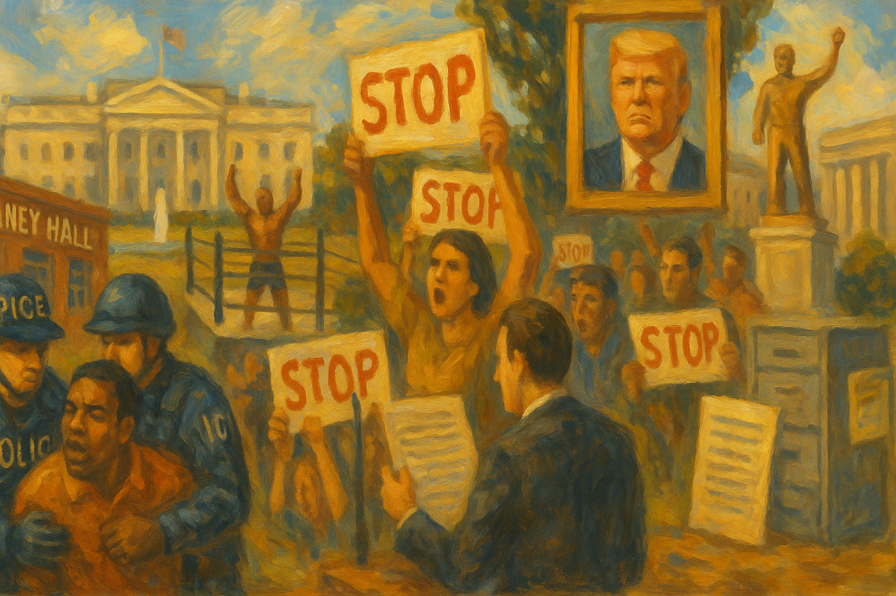

<!-- Generated by build_publish_week_v1 -->
<!-- Header image: image_wide_week71.png -->

# Week 71: Personal Rule Through State Power

*Immigration coercion, patronage fights, symbolic glorification, and secrecy deepened together as courts and some local officials mounted reactive resistance.*

Week 71 was marked by a hardening of method. Power did not move through one grand break. It moved through repeated acts that made the state more personal, more punitive, and less open. Immigration enforcement became a field for force and hierarchy. Public symbols bent toward the leader. Money and access shaped rulemaking and contracts with less disguise than before. Courts still answered, and some state and local officials did too. But they answered after the fact. That was the week’s shape.

At the close of the last period, the Democracy Clock stood at 8:13 p.m. By the end of Week 71, it stood at 8:14 p.m., a net shift of 0.2 minutes. The movement was slight because the week brought less novelty than confirmation. It still moved forward. Several lines of erosion deepened at once: retaliatory uses of law, tighter secrecy, more open personal glorification, and a broader use of immigration policy as pressure. The record also showed resistance. Federal judges blocked, enjoined, and limited. State and local actors drew some lines of their own. But the balance of the week lay in how often democratic safeguards were forced into reactive defense.

Delaney Hall became the clearest place where several pressures met. Federal agents used pepper spray and other force against protesters outside the detention site in Newark. The clashes did not remain a single day’s disorder. They stretched across several days and reports, with repeated accounts of force against demonstrators and during an oversight visit. The site became more than a jail. It became a stage where federal power answered scrutiny with coercion.

The struggle over what was happening inside the facility ran beside the struggle outside it. The Department of Homeland Security denied that a hunger strike at Delaney Hall was real and called it a political stunt. At the same time, reports described a record number of suicides in ICE custody. The state’s message and the detainees’ condition moved in opposite directions. One side denied abuse claims. The other supplied the human cost that made those claims hard to dismiss.

Then the legal pressure widened. A federal jury convicted three ICE protesters of felony conspiracy charges, and the Justice Department filed charges against another protester accused of assaulting an ICE officer at the site. Protest was not only dispersed. It was recast as serious criminal conduct. The winners in that shift were the agencies that could define dissent as threat. The losers were protesters, watchdogs, and the wider public claim that assembly near a detention site remains protected even when unwelcome.

New Jersey then stepped into the breach. State officials assigned state police to replace federal agents outside Delaney Hall and created a protected protest zone. The move did not undo the week’s force or prosecutions. It did something narrower and still important. It showed that a state government could reduce direct federal confrontation and preserve space for assembly when federal enforcement had made that space combustible. The intervention mattered because it was concrete. It also mattered because it was exceptional.

Immigration policy widened legal precarity in quieter but broader ways. The administration announced a rule requiring many temporary visa holders to leave the United States and pursue green cards from abroad. The Department of Transportation also restricted many immigrant truck drivers from obtaining or renewing commercial licenses. These were not border actions in the narrow sense. They reached into lawful residence and lawful work. They made status more contingent and daily life more dependent on executive discretion.

That same logic appeared in the threat against sanctuary cities. The administration announced plans to withdraw customs agents from airports in cities that would not cooperate with federal immigration policy. This was not a debate over abstract federalism. It was a plan to use federal capacity as leverage against local policy choices. The gain in power went to the executive branch, which sought to make local autonomy costly. The loss fell on cities, travelers, and the principle that federal services are not a weapon used to discipline disfavored jurisdictions.

There were counter-moves, but they came at the edges. The Third Circuit temporarily blocked the re-detention of Mahmoud Khalil while courts reviewed a case tied to speech, activism, and deportation risk. Judge Gallagher extended court supervision in an asylum case after a policy change. Chicago’s mayor signed an order directing city departments to resist federal immigration raids. ICE released Rodney Taylor from detention after prolonged confinement, and Florida officials announced the closure of the Alligator Alcatraz immigration jail. These acts mattered. They showed that courts and local executives could still protect named people and limit named abuses. But they did not alter the wider federal effort to make lawful presence, work, and local noncooperation more precarious.

The week also made personal rule visible in stone, paper, and spectacle. The White House began building a UFC arena on its grounds. That might once have been dismissed as gaudy taste. Here it carried a sharper meaning. Public property, official ceremony, and a leader-linked entertainment brand were brought together in one place. The presidency was not merely hosting an event. It was lending state space to a form of personal display.

That display spread outward. Trump proposed a triumphal arch near Arlington Memorial Bridge. The administration pushed a $250 bill bearing Trump’s portrait, and the White House pressed Congress to approve it. The National Park Service allocated $67 million in park entrance fees for Washington beautification projects that fit the same symbolic turn. These were not isolated vanity projects. They formed a cluster. Public money, civic space, and national imagery were being redirected toward the leader’s image and mood.

The business edge of the spectacle was visible too. Trump bought stock in UFC’s parent company before promoting a White House UFC event. That detail linked personal financial interest to official promotion. The winners were the leader, allied brands, and the idea that state symbolism can serve as a private amplifier. The losers were the old boundaries between office and self, between national symbols and personal branding.

Courts drew one line. A federal judge ruled that the Kennedy Center could not be renamed for Donald Trump without an act of Congress. Another ruling left renovation plans in place for the moment, but the main point held. Statutory limits still existed. They could still be enforced. Yet even here the pattern was plain. The executive side acted first, and the courts were left to say where the law still stood after the attempt.

The Anti-Weaponization Fund offered the week’s sharpest fight over patronage. A proposal for a taxpayer-backed fund for Trump supporters accused of crimes moved from idea to institutional conflict with unusual speed. Representative Brian Fitzpatrick introduced a bill to bar federal payments to the fund. Allison Gill filed suit challenging its creation. A federal court ordered Trump to respond to retired judges’ filings over the arrangement. The issue was not only whether the fund was lawful. It was whether public money could be routed into a structure that rewarded political allies under color of state action.

The legal system answered with uncommon clarity. A federal judge temporarily blocked the fund while litigation proceeded, preventing money from moving before review. Thirty-five former federal judges filed papers seeking to reopen Trump’s IRS case and challenge the settlement structure. Their intervention gave the dispute rare internal weight. It signaled that, within the legal profession itself, the fund looked less like ordinary policy than like a distortion of process.

This mattered beyond the fund. It brought several traits into one frame: patronage, procedural abuse, and the use of public resources for partisan ends. The winners, had the fund stood, would have been regime allies and the executive actors who could reward them. The losers would have been Congress’s spending power, neutral administration, and the public claim that state money is not a private reserve for the leader’s camp. The injunction did not settle the matter. It did show that some institutional brakes still engaged when the design became too plain to ignore.

Cronyism spread across agencies and sectors with less need for concealment. The CFTC reduced crypto enforcement and sidelined officials who raised concerns about Trump-linked firms. Reynolds American donated to MAGA Inc. before Trump and FDA officials changed guidance on fruit-flavored vapes. A major government contractor leader gave $1 million to MAGA Inc. while holding federal business. The pattern was not subtle. Money and political relationship sat close to rulemaking and enforcement outcomes.

Public financing and procurement followed the same line. The Pentagon expedited a $620 million loan to a startup linked to Donald Trump Jr. The Bureau of Prisons awarded LEO Technologies a $106 million contract to monitor prisoners’ calls with AI. The DHS inspector general opened an audit into detention-facility warehouse purchases and contracts, which showed that some watchdog capacity remained. But the need for that audit told its own story. State coercive functions, from detention to surveillance, were being outsourced through contracts that raised questions about competence, price, and political connection.

Trump’s own business promotion sat inside the same pattern. He promoted an unregulated online casino after its co-owner donated to MAGA Inc. Reports also described use of office for insider trading and a large settlement benefiting allies. Taken together, these episodes made corruption look less like a scandal at the edge of governance than like a pipeline through it. The winners were donors, contractors, and politically connected firms. The losers were professional regulators, rival firms without access, and the public expectation that enforcement and allocation follow rules rather than favor.

Election pressure came through both access and information. In North Carolina, the Board of Elections took actions that could remove legitimate voters from the rolls, and the state senate voted to cut early voting from seventeen days to ten. These were formal acts, not street intimidation. That was their force. They narrowed the franchise through administration and schedule while speaking the language of integrity. The burden fell on lawful voters who rely on time, flexibility, and accurate rolls.

The information side of elections darkened at the same time. Reports described AI-generated political influencers being used in campaigns. Popular Information reported that Lead Left was tied to a Republican operative while spending in Democratic primaries. Two super PACs posing as progressive groups were reported to be linked to House Republicans and to have hidden their backing through shell structures. Here the winners were actors with money, data, and deceptive branding. The losers were voters asked to judge candidates in an environment where the speaker could be synthetic and the sponsor disguised.

There was some institutional resistance. A coalition of twenty-two attorneys general sued to protect states’ authority over election administration. A federal court panel blocked Alabama from using a new congressional map for the midterms, and the South Carolina Senate rejected a rushed redistricting proposal. Utah officials released a voter roll audit showing that most registered voters were confirmed citizens. These responses mattered. They were also piecemeal. They defended parts of the field while new distortions entered through other gates.

Secrecy and retaliation formed another strong line. The Department of Justice removed January 6 criminal case press releases from its website. That was more than non-disclosure. It altered the official archive of a central anti-democratic event. At the same time, the Office of Personnel Management proposed nondisclosure agreements for federal workers, a step that would formalize silence across the bureaucracy. The state was not only withholding. It was revising memory and narrowing what insiders could safely share.

Oversight of sensitive records showed the same turn. Pam Bondi testified about the Epstein files while refusing key questions and acknowledging redaction errors. A judge set a hearing in Katie Phang’s lawsuit seeking more files, which kept pressure on the government to explain itself. But the week’s main fact was obstruction in practice. Oversight existed. It was met with evasion. The winners were officials who controlled the files and the pace of disclosure. The losers were Congress, the press, and the public’s ability to know what the government held and why it withheld it.

Legal pressure against critics also widened. Trump issued executive orders targeting Andrew Weissmann. He refiled a $10 billion lawsuit against the Wall Street Journal over an Epstein report. Federal officials issued subpoenas to Hasan Piker and Medea Benjamin in a Cuba sanctions investigation. The forms differed, but the logic was shared. Critics, adversaries, and media figures were made to bear the cost of process. Law became less a limit on power than a means of directing pressure toward those who challenged it.

Courts remained the chief brake, though mostly after the move had been made. Judge Seibel enjoined West Point from enforcing a prior-approval policy on civilian faculty speech. Judge Lamberth extended an injunction against a prison ban on gender-affirming treatment for class members. A federal judge dismissed charges against six Chicago-area protesters because of prosecutorial misconduct. Another judge dismissed charges against Kilmar Ábrego García, checking what appeared to be vindictive prosecution in an immigration-related case. The Supreme Court ruled for Terry Pitchford in a case involving racial bias in jury selection. These were real limits. They protected speech, due process, medical care, and fair trial rights.

But the week also showed how narrow and reactive that resilience had become. House Speaker Mike Johnson sent members home early to avoid a war powers vote on Iran, weakening Congress’s checking role before it could be exercised. Tulsi Gabbard resigned as director of national intelligence, and FBI Director Kash Patel fired a top intelligence official. Those moves suggested a national security structure shaped less by independent judgment than by political alignment. Even where courts held, other institutions often yielded, delayed, or stepped aside.

A hearing has been set in Katie Phang’s lawsuit seeking more Epstein files, and the litigation over the Anti-Weaponization Fund remains active after the temporary block. Those are the named proceedings already on the calendar. They matter because they keep two of the week’s central questions inside formal review: whether records can be withheld without adequate account, and whether public money can be turned into a patronage device before the law catches up.

Week 71 did not depend on one shock. Its force came from convergence. Immigration policy, public symbolism, procurement, campaign deception, secrecy, and retaliatory law all moved in the same direction. Courts still imposed limits, and some states and cities still acted as counterweights. But the deeper fact was that they were increasingly called on to rescue boundaries that executive power had already crossed. That is how erosion looks in a mature phase. The forms remain. The burden of defending them grows heavier, more constant, and less evenly shared.

<!-- Synopses for cross-posting -->
Long Synopsis: Week 71 showed democratic erosion through accumulation rather than rupture. Federal power was used more personally and punitively across several fronts at once. Immigration enforcement became a site of force, legal precarity, and pressure on dissent, most visibly around Delaney Hall, where protesters faced repeated coercion and later prosecutions. At the same time, the administration widened insecurity for lawful residents and workers, threatened sanctuary cities, and tightened secrecy through archive scrubbing and proposed nondisclosure rules for federal employees. Personalist symbolism also intensified, with White House UFC plans, a proposed Trump portrait bill, and monument-style projects redirecting public space and money toward leader glorification. Donor-linked regulatory shifts, contracts, and financing reinforced a broader pattern of crony governance. Courts, attorneys general, and some state and local officials still imposed limits, but mostly after executive overreach had already advanced.
Short Synopsis: Week 71 brought a small but real forward move as immigration coercion, secrecy, patronage, and leader glorification deepened together. Courts and some state and local officials still checked abuses, but mainly in reactive defense after federal power had already crossed new lines.

