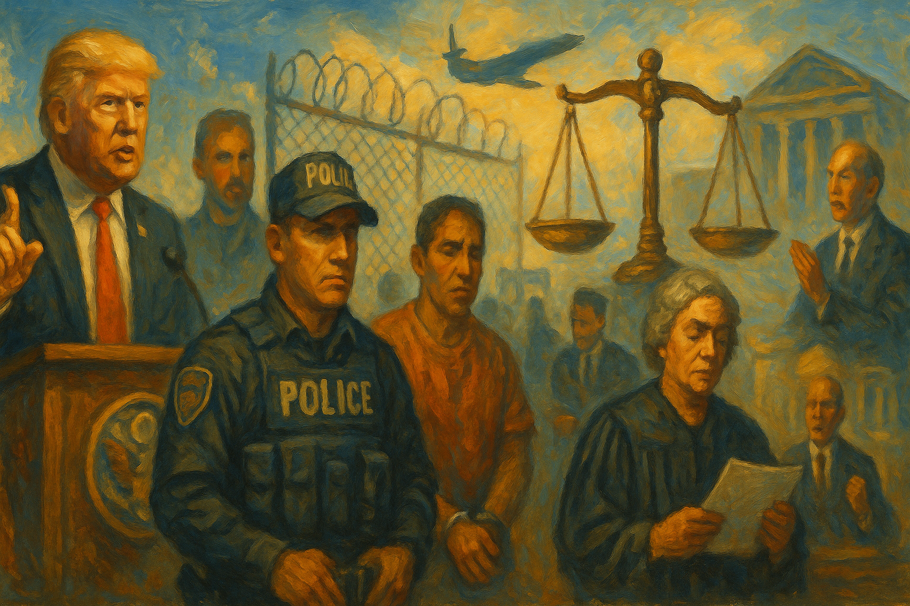

<!-- Generated by build_publish_week_v1 (appendix post) -->
<!-- Header image: image_wide_week73_appendix.png -->

# Week 73 Appendix: Entrenchment Through Process

*Congress enlarged coercive immigration power while courts imposed real limits, leaving the Democracy Clock unchanged but the underlying structure harder.*

This was a high-pressure week centered on executive aggrandizement, politicized immigration enforcement, and the fusion of public authority with personal or factional benefit. The most structurally important development was the enactment of the $70 billion immigration law, which not only expands coercive enforcement capacity but also locks in resources through 2029, increasing both immediate abuse potential and future difficulty of reform. Alongside that came repeated signs of executive contempt for institutional limits: DOJ arguments that courts cannot meaningfully restrain completed executive actions, Trump’s push to fire the Senate parliamentarian, unilateral war rhetoric around Iran, and patronage-style nominations for attorney general and intelligence leadership. A second major theme was selective legality: pardons for allies, alleged political referrals to DOJ, the FBI raid on an Ohio voting-rights group, and continued opacity around Epstein files. Courts provided some democratic repair by blocking the anti-weaponization fund, striking down the H-1B fee, and enforcing limits around the Kennedy Center, but the week overall showed a presidency pressing to convert discretion into durable governing structure while using immigration, information, and symbolic politics as key instruments.

Power and Authority

1. President Trump pardoned former Representative Stephen Buyer (2026-06-06): The pardon used presidential clemency to erase a corruption conviction, showing how executive power can override a completed criminal case.

2. President Trump signed an executive order to explore changes to the childhood immunization schedule (2026-06-07): The order asserted direct presidential influence over vaccine policy, testing how far executive power could steer scientific and public-health decisions.

3. The Trump administration reduced federal refugee cash assistance (2026-06-08): The cut used executive control over benefits to make refugee resettlement harder and to shape who could safely remain and integrate.

4. The Department of Defense removed about 180 faith traditions from its recognized religion list and later revised the list after backlash (2026-06-09): The policy showed executive control over military classifications touching religious identity, raising concerns about state power over belief and recognition.

5. President Trump signed the Secure America Act (2026-06-10): The signing turned a major enforcement bill into law and expanded executive capacity over immigration and related federal power.

6. The EEOC canceled a scheduled open meeting after resolving matters by notation vote (2026-06-11): The cancellation shifted agency business away from a public meeting, narrowing visible deliberation around enforcement priorities.

7. The Trump administration suspended federal funding to the Los Angeles Homeless Services Authority (2026-06-12): The funding suspension used federal leverage over a local agency, affecting public services while intensifying executive pressure on a disfavored jurisdiction.

8. The Trump administration waived environmental and historic-preservation laws for border wall work in Big Bend National Park (2026-06-12): The waivers used executive authority to bypass normal legal checks on federal construction in protected public land.

Institutions and Governance

1. The New York legislature approved a one-year moratorium on large datacenters (2026-06-06): The bill showed a state legislature using formal lawmaking to slow a fast-growing industry and require more public review and standards.

2. The Justice Department argued that courts could not stop completed executive construction after the fact (2026-06-06): The argument pressed a broad theory against judicial review, testing whether courts could still check unlawful executive action once carried out.

3. Residents and an advocacy group filed a lawsuit against the Stratos datacenter project in Utah (2026-06-06): The suit challenged a state development authority on constitutional and public-input grounds, using courts to contest insulated decision-making.

4. Acting Attorney General Todd Blanche said the administration was not moving forward with the anti-weaponization fund (2026-06-07): The statement signaled an executive retreat under legal and political pressure over a fund that raised accountability concerns.

5. Senate Democrats offered amendments during reconciliation to limit Trump funding powers (2026-06-07): The amendments used legislative procedure to try to constrain executive spending discretion and preserve congressional control of appropriations.

6. Senate Republicans blocked Democratic proposals to limit Trump's funding powers (2026-06-07): The votes preserved broader executive room over disputed spending and weakened a legislative attempt to impose guardrails.

7. Senate Republicans passed about $70 billion in additional funding for ICE and CBP (2026-06-07): The measure expanded enforcement agencies through multi-year funding while rejecting reform demands, shifting institutional power toward coercive administration.

8. Senator Andy Kim said he was denied access to speak with detainees at Delaney Hall (2026-06-07): The denial obstructed congressional oversight of detention conditions and limited a lawmaker's ability to inspect executive conduct.

9. A federal judge temporarily blocked the anti-weaponization fund (2026-06-07): The order checked a proposed executive fund tied to January 6 defendants and preserved judicial review over a contested use of public money.

10. Judge Lamberth granted a preliminary injunction protecting named transgender prisoners' housing placements (2026-06-07): The ruling limited enforcement of an executive order and reaffirmed the courts' role in protecting litigants while a case proceeds.

11. Judge Sorokin struck down the Trump administration's $100,000 H-1B fee (2026-06-07): The ruling held that the executive branch could not impose a major fee as a tax without Congress, reinforcing separation of powers.

12. Senators Mitch McConnell and Susan Collins criticized using reconciliation for defense funding (2026-06-08): The criticism exposed internal resistance to using a narrow budget process for long-term defense policy, highlighting procedural strain inside Congress.

13. Thirty-five Democratic senators demanded the legal basis for claims that hostilities with Iran had ceased (2026-06-08): The letter asserted Congress's oversight role over war powers and challenged executive claims affecting statutory limits on military action.

14. The House Oversight Committee continued its Epstein investigation with testimony from Lesley Groff (2026-06-08): The hearing extended congressional fact-finding into a high-profile abuse network and the handling of related records and accountability.

15. Representative Jim Jordan and the House Judiciary Committee held a hearing on the Southern Poverty Law Center (2026-06-08): The hearing used congressional process to scrutinize a civil-society group, raising questions about oversight being used for partisan pressure.

16. President Trump called for firing the Senate parliamentarian over a Byrd Rule ruling on the SAVE America Act (2026-06-08): The demand targeted a nonpartisan procedural referee and pressed to bend Senate rules for a favored bill.

17. The Kennedy Center removed Trump's name from its website after a court order (2026-06-08): The change showed a public institution complying with a judicial ruling that limited unauthorized executive influence over its name and governance.

18. The House of Representatives passed the Secure America Act (2026-06-09): The vote locked in large immigration-enforcement funding and showed Congress strengthening executive enforcement capacity with limited oversight conditions.

19. President Trump urged Republicans to pass a $350 billion reconciliation bill carrying the SAVE America Act (2026-06-09): The push sought to use budget procedure to advance voting restrictions, straining normal legislative boundaries around election law.

20. House Oversight Chair James Comer refused to subpoena Todd Blanche in the Epstein investigation (2026-06-09): The refusal narrowed Congress's willingness to compel testimony in a politically sensitive inquiry, weakening oversight leverage.

21. California, Rhode Island, and Wisconsin sued the Department of Education over discontinued disability-training grants (2026-06-09): The states used litigation to challenge an agency funding decision they said violated statutory and procedural limits.

22. President Trump announced Bill Pulte as acting Director of National Intelligence (2026-06-09): The move placed a politically connected official without intelligence experience atop a key oversight post, intensifying concerns about patronage in national security.

23. President Trump nominated Todd Blanche for attorney general (2026-06-09): The nomination put Trump's former personal lawyer forward to lead the Justice Department, testing norms of prosecutorial independence.

24. The House Judiciary Committee opened an investigation into the Environmental Law Institute and its Climate Judiciary Project (2026-06-10): The inquiry used congressional oversight to examine outside influence on judges, while also raising concerns about pressure on legal advocacy.

25. Representative James Comer said the House panel would seek testimony from Alan Dershowitz about Jeffrey Epstein (2026-06-10): The planned testimony request extended congressional oversight into the federal handling of the Epstein and Maxwell cases.

26. The Public Integrity Project filed a lawsuit against the White House UFC event (2026-06-10): The suit asked courts to review whether executive officials had misused federal property and resources for a private commercial event.

27. The House Judiciary Committee issued a subpoena to an attorney in climate litigation (2026-06-10): The subpoena extended congressional pressure into ongoing climate lawsuits and tested the boundary between oversight and interference.

28. HIV care providers and national associations sued over Ryan White grant conditions affecting transgender patients (2026-06-10): The case challenged federal grant terms as unlawful and discriminatory, asking courts to police agency limits and rights protections.

29. The ACLU sued immigration agencies for records about policies on filming enforcement activity (2026-06-10): The suit used FOIA litigation to force disclosure about how agencies treat public documentation of state power.

30. The AFL-CIO sued the Department of Labor over a new union reporting rule (2026-06-10): The complaint challenged a fast-moving labor rule as procedurally unlawful, asking courts to review burdens placed on organized labor.

31. Environmental groups sued over the Boca Chica land exchange (2026-06-10): The case asked courts to review whether federal agencies had exceeded legal limits in a land transfer affecting conservation and historic protections.

32. California and Santa Clara County sued over an ICE holding facility in Gilroy (2026-06-10): The suit challenged federal repurposing of property without required review or consultation, testing agency compliance with procedural law.

33. Nineteen states and the District of Columbia sued over rapid implementation of anti-DEI federal contract terms (2026-06-10): The complaint asked courts to review whether agencies had lawfully imposed new contract conditions with broad effects on public contractors.

34. Judge Leon denied a temporary restraining order in the anti-weaponization fund case after DOJ said it would abandon the fund (2026-06-10): The ruling reflected how executive representations can alter judicial posture while leaving accountability dependent on later verification.

35. A judicial nominee refused to say who won the 2020 presidential election during confirmation hearings (2026-06-10): The refusal raised institutional concerns about whether a future judge would affirm basic electoral facts central to public trust in courts.

36. House Democrats said they would call JD Vance to testify on the administration's handling of Epstein files (2026-06-11): The move sought testimony from a senior political figure to expand congressional oversight of a records and accountability dispute.

37. The House of Representatives failed to pass a short-term extension of Section 702 of FISA (2026-06-11): The failed vote showed legislative resistance to renewing surveillance powers amid concerns about executive appointments and oversight.

38. JD Vance said he would refer Minnesota officials to the Justice Department for a fraud investigation (2026-06-11): The referral threatened to draw federal law enforcement into a politically charged dispute, testing norms against using institutions against opponents.

39. Trump and his allies pushed Congress to pass a resolution expunging his impeachments (2026-06-11): The effort sought symbolic legislative revision of formal accountability actions, using Congress to recast the institutional record.

40. The Democracy Forward Foundation sued the FBI and DOJ for records about FBI Director Kash Patel's conduct (2026-06-11): The FOIA suit asked courts to compel records from law-enforcement agencies, reinforcing transparency as a check on institutional abuse.

41. The Washington National Opera sued the Kennedy Center over more than $17 million in assets (2026-06-11): The case brought a governance and contract dispute at a major public cultural institution into federal court.

42. WuXi AppTec sued the Department of Defense over its designation as a Chinese military company (2026-06-11): The suit challenged a national-security designation that affects federal contracting, asking courts to review executive labeling power.

43. Chief Judge McConnell entered partial final judgment in favor of plaintiffs challenging four USCIS policies (2026-06-11): The order made an earlier vacatur immediately appealable and required a compliance report, strengthening judicial supervision of agency action.

44. President Trump nominated Jay Clayton as Director of National Intelligence (2026-06-11): The nomination continued a turbulent reshaping of intelligence leadership and kept questions open about expertise, loyalty, and oversight.

45. House Democrats demanded records about Ghislaine Maxwell's transfer and a policy allowing attorney general overrides of prison placement (2026-06-12): The request used oversight tools to probe whether prison administration had been altered in a way that weakened neutral process.

46. A federal judge extended the block on the anti-weaponization fund and later granted a preliminary injunction against it (2026-06-12): The orders barred creation or operation of the fund and required sworn declarations, marking a strong judicial check on executive spending plans.

47. The Democracy Docket tracker reported a voting-rights opinion and related election-law analysis (2026-06-12): The tracked litigation reflected ongoing court action over election rules and access, showing how judicial decisions continue to shape representation.

48. Defendants in the Dorcas International case appealed the Rhode Island USCIS ruling to the First Circuit (2026-06-12): The appeal moved a challenge to immigration-related agency policies into the next judicial stage, extending review of executive action.

49. Judge Cooper denied a stay of the Kennedy Center injunction pending appeal (2026-06-12): The denial kept a ruling against unlawful government action in force and underscored that public interest did not favor delay.

50. Judge Talwani denied without prejudice a preliminary injunction motion in Ethical Society of Police v. Bondi (2026-06-12): The ruling shifted the case toward summary judgment and showed courts managing the pace and posture of a challenge to federal action.

51. Judge Boasberg refused to vacate his opinion quashing grand jury subpoenas targeting Jerome Powell (2026-06-12): The decision protected an independent institution from what the court described as politically driven legal pressure.

Economic Structure

1. Commentators and health experts criticized Medicaid recertification changes that added paperwork and more frequent reviews (2026-06-06): The changes risked cutting vulnerable people off from coverage through administrative burden, affecting access to a basic public good.

2. Texas barbecue restaurants closed amid rising costs and a beef shortage (2026-06-06): The closures showed how inflation and supply strain can weaken small businesses and local economic resilience.

3. European leaders considered trade barriers against Chinese goods (2026-06-06): The discussion reflected how states use trade policy to reshape industrial dependence and protect strategic sectors.

4. CalCog Inc. applied for DEA registration to import certain Schedule I substances for clinical trials (2026-06-08): The application entered a tightly regulated federal process that governs access to controlled substances for research and public-health use.

5. The EPA revised taconite emission limits for a Minnesota facility (2026-06-08): The rule adjusted industrial pollution standards through federal regulation, affecting how public health and production costs are balanced.

6. The FBI revised its fee schedule for criminal history record checks (2026-06-08): The higher fees changed the cost of background checks used for jobs and licenses, affecting access to work and regulated activity.

7. The FCC sought comments on information collections affecting political advertising rates (2026-06-08): The notice touched election-related media pricing rules that shape candidate access to broadcast advertising markets.

8. The FCC sought comments on proposed information collections to reduce paperwork burdens (2026-06-08): The notice showed routine regulatory review of compliance burdens that affect small firms and communications operations.

9. The FDA said protamine sulfate products were not withdrawn for safety or effectiveness reasons (2026-06-08): The determination preserved a path for generic approvals, affecting drug availability and pricing in a regulated market.

10. Ohio implemented restrictive driver's license rules for non-citizens (2026-06-08): The rules imposed new economic and mobility barriers on non-citizens, limiting access to work, transport, and daily life.

11. Chinese companies shifted manufacturing to Morocco amid higher Western tariffs (2026-06-08): The relocation showed how trade barriers can redirect industrial growth and jobs across borders.

12. Analysts reported on India's infrastructure boom and disputed growth figures (2026-06-08): The report linked state-led development and contested economic data, showing how public investment and measurement shape policy legitimacy.

13. The Department of Justice investigated George Santos over suspicious prediction-market trades (2026-06-08): The investigation highlighted integrity risks in lightly regulated political betting markets and the need for fair market rules.

14. The DEA finalized a rule expanding access to medication-assisted treatment for opioid use disorder (2026-06-09): The rule widened treatment access through federal regulation, affecting public health and the distribution of medical services.

15. ProPublica and other outlets reported that a foreign-linked investment flowed into a Trump Jr.-connected startup after favorable policy decisions (2026-06-09): The reports raised concerns that economic policy and sanctions decisions may have overlapped with private family business interests.

16. The Trump administration planned to transfer frozen Iranian assets to Gulf allies (2026-06-09): The plan would redirect foreign state assets through executive action, raising questions about conflicts of interest and control over public economic power.

17. Congress enacted the Veterans Affairs Major Medical Facility Authorization Act (2026-06-09): The law authorized major medical facility funding, showing routine legislative control over long-term public infrastructure spending.

18. Congress enacted the Gerald E. Connolly Esophageal Cancer Awareness Act (2026-06-09): The law used federal legislation to support public-health education, reflecting how Congress shapes health priorities through statute.

19. The CDC invited comments on National Death Index data collection (2026-06-10): The notice supported mortality research infrastructure that informs public policy and health planning.

20. The CDC submitted an information collection request for NHANES development projects (2026-06-10): The request supported federal health-data systems that shape evidence-based policy and resource decisions.

21. OSHA extended OMB approval for training program forms (2026-06-10): The extension maintained a federal compliance system for workplace safety training and administration.

22. The TSA granted a temporary exemption for certain bus operators during the FIFA World Cup (2026-06-10): The exemption eased regulatory burdens for event transport, showing how agencies can temporarily reshape compliance rules for major events.

23. The Trump family reportedly made large profits from cryptocurrency licensing ventures (2026-06-10): The reported gains raised concerns about private enrichment tied to political prominence and weak separation between office and business.

24. The Department of Labor reported that inflation reached 4.2% in May (2026-06-10): The report showed rising prices eroding purchasing power, affecting economic security and public confidence in governance.

25. The Department of Agriculture was blamed for funding cuts linked to a screwworm outbreak in Texas cattle (2026-06-10): The reported cuts tied public funding choices to agricultural risk, showing how state capacity affects food systems and local economies.

26. Illinois Governor JB Pritzker paused new data center tax exemption applications (2026-06-10): The pause showed a state reconsidering costly subsidies after concerns that tax incentives were draining public revenue.

27. Ohio Governor Mike DeWine paused tax breaks for new data centers (2026-06-10): The pause responded to a large budget hit from subsidies, highlighting how corporate incentives can reshape public finances.

28. Texas lawmakers and advocates debated data center tax exemptions after large state revenue losses (2026-06-10): The debate showed how long-term tax breaks for major firms can shift public resources away from other state needs.

29. Virginia lawmakers and advocates faced debate over data center tax breaks after major revenue losses (2026-06-10): The dispute highlighted the fiscal cost of corporate incentives and the influence of lobbying on state tax policy.

30. Wisconsin faced more than $2 billion in lost sales tax revenue from data center exemptions (2026-06-10): The projected loss showed how subsidy policy can transfer large public value to private projects through the tax code.

31. The CDC proposed data collection for hantavirus monitoring (2026-06-10): The proposal supported outbreak response capacity through federal data collection and public-health planning.

32. The EPA approved Connecticut air-quality and adhesive regulations (2026-06-11): The approval made state environmental rules federally enforceable, showing routine regulatory coordination over public health and industry.

33. The EPA approved New York's metropolitan air-quality maintenance plan (2026-06-11): The approval confirmed continued compliance with federal standards and reflected ongoing regulatory oversight of a major urban economy.

34. The EPA denied California's request to extend the San Joaquin Valley PM2.5 attainment date (2026-06-11): The denial enforced federal air rules and required a stronger state plan, showing how environmental regulation can compel policy change.

35. The FCC submitted an information collection request for OMB review (2026-06-11): The filing reflected routine federal regulation of communications-sector paperwork and compliance burdens.

36. The FDA classified a spinal muscular atrophy newborn screening test system as class II (2026-06-11): The classification shaped market entry and safety rules for a medical device with public-health implications.

37. The FDA extended the comment period for a drug repurposing information request (2026-06-11): The extension widened participation in a regulatory process that could affect how existing drugs are reused for unmet needs.

38. The FDA reopened the comment period on guidance for scale-up and postapproval changes (2026-06-11): The reopening prolonged public input into rules that affect pharmaceutical production and compliance costs.

39. The FDA submitted a proposal for traceability records on high-risk foods (2026-06-11): The proposal aimed to strengthen food-safety oversight by improving records needed to trace outbreaks.

40. The TSA submitted a real-time airport wait-time data collection request for OMB review (2026-06-11): The request supported operational transparency and management in a federal security system that affects public mobility.

41. Economic reports showed producer prices and gas prices surging (2026-06-11): The price increases pointed to worsening household cost pressure and broader economic instability with political consequences.

42. Iranian state-backed media said Iranian decision-makers had expanded targets to include Elon Musk-linked regional assets (2026-06-11): The threat showed how geopolitical conflict can spill into private economic holdings and cross-border commercial risk.

43. Interior Secretary Doug Burgum canceled funded wind turbine projects (2026-06-11): The cancellations redirected federal support away from renewable energy and showed executive influence over industrial development choices.

44. The CDC submitted traveler-based genomic surveillance for OMB review (2026-06-12): The program expanded disease-monitoring infrastructure at airports, linking public-health surveillance to federal administrative capacity.

45. The Census Bureau sought comments on workforce development data collection (2026-06-12): The notice supported evidence gathering for federal training programs that shape labor and regional development policy.

46. The EPA published a notice of availability for environmental impact statements (2026-06-12): The notice maintained public disclosure in environmental review, supporting accountability in federal project planning.

47. Trump-branded properties failed multiple health inspections (2026-06-12): The inspection failures raised questions about compliance with public-health rules at businesses tied to a political family brand.

48. GEO Group sued Colorado over a law requiring regular health inspections of detention facilities (2026-06-12): The suit challenged a state oversight law and tested whether private detention operators could avoid stronger public-health regulation.

Civil Rights and Dissent

1. Officials and relatives conducted and described an oversight visit to Delaney Hall during a detainee hunger strike (2026-06-06): The visit brought public attention to detention conditions and the bodily security of immigrants held by the state.

2. Protesters at Delaney Hall were pepper-sprayed during a demonstration (2026-06-06): The use of force against demonstrators showed how protest around immigration detention can be met with coercive policing.

3. The State Department released refugee admissions data showing that nearly all recent admissions were white South Africans (2026-06-06): The data pointed to unequal refugee selection with direct effects on who received protection and entry to the United States.

4. Judge Lamberth blocked the transfer of named transgender prisoners to men's facilities while litigation proceeds (2026-06-07): The injunction protected a vulnerable group from immediate custodial harm and preserved rights claims during the case.

5. ICE abandoned a policy requiring reports and investigations of detainee deaths within 30 days of release (2026-06-07): The change reduced accountability around deaths tied to detention and weakened protections for people in immigration custody.

6. A whistleblower said officials planned to falsely mark immigrants dead to force self-deportation and moved thousands into a harmful database (2026-06-07): The reported plan showed administrative systems being used to strip immigrants of services and pressure them out of the country.

7. Tom Homan threatened to increase ICE presence in New York City after a state noncooperation law (2026-06-08): The threat signaled retaliatory federal enforcement aimed at a sanctuary jurisdiction, increasing fear and exposure for immigrant communities.

8. The Supreme Court upheld Alabama's congressional district map (2026-06-08): The ruling preserved a map criticized as racially unfair, affecting minority voting power and representation.

9. Protesters in Albania demonstrated against the Trump-Kushner island project (2026-06-08): The mass protest showed organized public resistance to a project seen as threatening public land, process, and national control.

10. New York City Mayor Zohran Kwame Mamdani organized a free Knicks watch party after closures tied to Trump's visit (2026-06-08): The event offered a civic response to security disruptions that had limited public access around a major gathering.

11. Lakota activists and communities won a legal and direct-action fight in the Black Hills (2026-06-08): The victory showed Indigenous communities using protest and law to defend land, culture, and local self-determination.

12. Activists in Winton, North Carolina protested the conversion of a private prison into a detention center (2026-06-08): The protest challenged expansion of detention infrastructure and defended the rights and treatment of future detainees.

13. Community organizers in Pacoima installed air-quality sensors for a neighborhood monitoring program (2026-06-09): The project gave residents tools to document environmental harm and press for fair treatment in a heavily burdened community.

14. Brad Lander stood trial over an elevator-blocking protest at an immigration court building (2026-06-10): The prosecution tested how far the state could criminalize protest tied to oversight of immigrant detention conditions.

15. Survivors of Jeffrey Epstein faced threats after the release of their names (2026-06-10): The threats showed how exposure of sensitive records can chill participation in justice processes and endanger vulnerable people.

16. Former FBI agents formed the FBI Support Network for agents pushed out or pressured to resign (2026-06-11): The network reflected organized resistance to perceived politicization inside a federal law-enforcement institution.

17. ICE carried out high or severe enforcement activity across multiple states (2026-06-11): The reported activity showed broad, intensified immigration enforcement affecting daily safety, detention risk, and community life for immigrants.

18. Brad Lander was acquitted of blocking an elevator at a federal building housing an ICE office (2026-06-11): The acquittal limited the criminalization of a protest tied to immigrant detention oversight and protected space for dissent.

19. Chicago police and the FBI released images of a person of interest in a Grant Park cross burning (2026-06-11): The investigation treated a racist intimidation symbol as a serious public-safety and civil-rights matter.

20. ICE detained babies and toddlers and deported parents of many U.S.-born children (2026-06-12): The reported practices showed immigration enforcement reaching deeply into family integrity and the bodily security of very young children.

21. Women and men detained at Delaney Hall continued and expanded a hunger strike over detention conditions (2026-06-12): The strike was a direct act of dissent by detainees seeking basic rights and safer treatment inside an immigration facility.

Information, Memory and Manipulation

1. The FBI released documents showing a Butler County deputy had emailed Thomas Crooks before the 2024 assassination attempt (2026-06-06): The disclosure raised questions about law-enforcement transparency and whether key facts had been withheld from the public.

2. The USDA secretary deleted an announcement about a second screwworm detection in Texas after posting it (2026-06-06): The deletion removed timely public information about a biosecurity threat and weakened trust in official disclosure.

3. Defense Secretary Pete Hegseth used D-Day remarks to attack immigration and reject a broad public-welfare view of government (2026-06-07): The speech repurposed a historic civic memory event to push a divisive political narrative through official messaging.

4. President Trump walked out of an NBC interview after being challenged on election-fraud claims (2026-06-07): The exit paired false election claims with an attack on media credibility, undermining accountability in the public information sphere.

5. Scott Pelley said CBS leadership had pushed changes to make anti-ICE protesters look more violent (2026-06-08): The account suggested political pressure on newsroom framing, raising concerns about manipulation of protest coverage.

6. The White House launched an 'Aliens' website portraying undocumented immigrants in dehumanizing terms (2026-06-08): The site used official government communication to stigmatize a vulnerable group and shape public opinion through loaded language.

7. Polymarket and Kalshi sponsored or partially removed influencer posts spreading false claims about the Los Angeles mayoral election (2026-06-08): The paid amplification of election falsehoods showed private platforms and markets helping distort public understanding of vote counting.

8. The White House social media team posted a digitally altered image mocking Hakeem Jeffries (2026-06-09): The post used official channels for manipulated imagery, blurring the line between government communication and propaganda-style ridicule.

9. President Trump claimed his event crowd was larger than the crowd at Martin Luther King Jr.'s speech (2026-06-10): The claim used a false comparison to inflate personal support and distort a major civic memory for political image-making.

10. The Department of Justice failed to release all Epstein files required by law (2026-06-10): The incomplete release weakened statutory transparency and left a major public-accountability record only partly visible.

11. The New York Times reported on internal White House handling of the Epstein crisis (2026-06-10): The investigation exposed how officials managed a politically damaging records controversy, informing public scrutiny of executive secrecy.

12. President Trump claimed the United States was secretly taking oil from Iran (2026-06-11): The statement spread an unverified account of military-related conduct, muddying public understanding of war and state action.

13. Stephen Miller announced the release of new UFO files (2026-06-12): The release added to the administration's management of sensitive records and public attention through selective disclosure.

14. NARA proposed reinstating information collections for civilian service records and biomedical archival research access (2026-06-12): The notices concerned how people and researchers obtain government-held records, affecting access to the public archive.

15. Democratic lawmakers requested a GAO audit of Venezuelan oil proceeds (2026-06-12): The request sought an independent accounting of foreign-resource handling, using audit tools to push for transparency in executive conduct.

