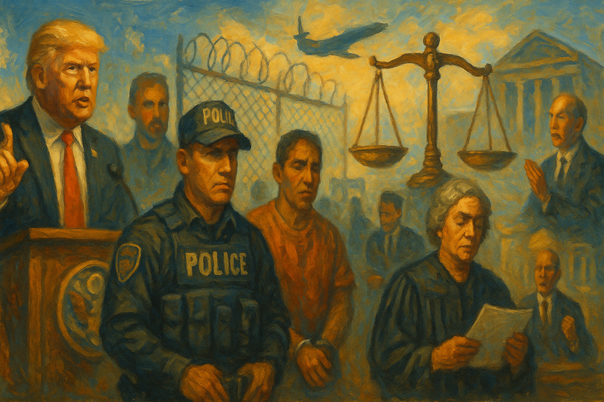

<!-- Generated by build_publish_week_v1 (appendix post) -->
<!-- Header image: image_wide_week73_appendix.png -->

# Week 73 Appendix: A Week Balanced on the Edge

*Unauthorized war-making, loyalist appointments, and diverted funds met courts, senators, and a jury that mostly held the line.*

This was an extraordinarily dense week combining active war-powers abuse, financial self-dealing, judicial defiance, and institutional capture. Trump unilaterally announced, then cancelled, strikes on Iran without congressional authorization, while making contradictory public claims about a peace deal that other parties disputed—demonstrating both war-powers overreach and a collapse of executive credibility. Simultaneously, the administration pushed a $1.776 billion 'anti-weaponization' slush fund benefiting January 6 defendants (later blocked by courts), attempted to install unqualified loyalists (Pulte, then Clayton) atop the intelligence community, and nominated Trump's own former defense lawyer as Attorney General. Courts pushed back repeatedly—on the H-1B visa fee, the Kennedy Center renaming, and the slush fund—while the administration slow-walked compliance. Congress passed $70 billion in unrestricted ICE/CBP funding without any accountability reforms, even as evidence emerged of DOGE-created disease outbreaks, falsified death records for immigrants, and detainee hunger strikes met with force. Media capture (CBS/Bari Weiss), Hegseth's politicization of the military, and normalization of election-fraud rhetoric rounded out a week revealing systemic strain across every branch.

Power and Authority

1. Trump announced plan to revive a $1.776 billion discretionary fund his own acting attorney general had called dead (2026-06-06): The president signaled intent to revive a previously abandoned discretionary fund, raising questions about transparency and possible misuse of public money for political allies.

2. Trump posted about golf course renovations and self-promotional AI videos during an active military crisis with Iran (2026-06-06): During live combat between the U.S. and Iran, the president publicly focused on personal grievances and self-promotion rather than crisis leadership, raising doubts about the seriousness of executive command.

3. Immigration and Customs Enforcement refused to allow Senator Andy Kim to speak with detainees during a congressional oversight visit to Delaney Hall (2026-06-06) *[single source]*: A federal agency blocked an elected senator from performing congressional oversight of a detention facility, undercutting the legislature's constitutional check on executive detention practices.

4. Senate Republicans blocked Democratic amendments to prevent a presidential slush fund, dual agency leadership by one appointee, and unauthorized ballroom spending (2026-06-07): Senate Republicans defeated three separate amendments meant to check executive discretion over funds, personnel, and property, removing built-in restraints on presidential power.

5. Trump signed an executive order directing review of the childhood immunization schedule (2026-06-07): The order signaled possible unilateral changes to vaccine policy despite an existing judicial hold on related agency actions, raising public health and rule-of-law concerns.

6. Trump declined to rule out compensating January 6 defendants who assaulted police using a federal fund (2026-06-08): The president's refusal to foreclose paying convicted assailants of law enforcement signals possible impunity for political violence and misuse of executive funds.

7. Tom Homan threatened to send an unprecedented surge of ICE agents to New York City in apparent retaliation for a sanctuary law (2026-06-08) *[single source]*: A federal official openly framed immigration enforcement as political retaliation against a state, weaponizing federal power against a jurisdiction that limited cooperation with ICE.

8. Trump urged the Senate to fire the Senate Parliamentarian after she ruled against a voter-restriction bill (2026-06-08): The president called for removal of a nonpartisan Senate officer solely because her ruling blocked a voting-restriction measure, threatening the independence of internal legislative safeguards.

9. Vance referred Minnesota's governor and attorney general to the Justice Department for fraud investigation based on unsubstantiated claims (2026-06-09): A federal official used the threat of prosecution against opposition-party state officials, raising concerns about politically motivated law enforcement targeting disfavored jurisdictions.

10. Trump threatened seizure of Iranian oil infrastructure and announced then cancelled planned military strikes within hours (2026-06-11): Rapid, unilateral reversal of military strike orders without congressional consultation illustrates unchecked presidential control over war powers and volatile foreign policy decision-making.

11. Trump demanded Congress pass a $350 billion military spending bill and the SAVE America Act restricting voting, bypassing normal negotiation (2026-06-10): The president pressured Congress to fast-track major spending and voting-restriction legislation, testing legislative independence and raising voting-rights concerns.

12. Trump administration redirected $352 million in Secret Service funds to White House ballroom construction after Congress refused to appropriate money for the project (2026-06-12): Public funds were shifted to a presidential vanity project after Congress explicitly declined to authorize it, circumventing legislative control of the purse.

13. Trump pressed Congress to pass a resolution symbolically expunging his two prior impeachments (2026-06-12) *[single source]*: A push to erase the formal record of past impeachments would rewrite constitutional accountability history without any actual legal effect on the underlying findings.

Institutions and Governance

1. DOJ argued in court that judges lack power to review executive demolition of federal property, including hypothetically the Statue of Liberty (2026-06-06) *[single source]*: The Justice Department claimed courts cannot check executive destruction of federal landmarks after the fact, threatening judicial review of major executive actions on public property.

2. National Trust for Historic Preservation sued to block the White House ballroom project as lacking congressional authorization (2026-06-06): A preservation group challenged whether the executive branch can bypass Congress to demolish and rebuild federal property, testing separation-of-powers limits.

3. Public Integrity Project filed federal lawsuits seeking to block a UFC event at the White House tied to Trump's financial interests (2026-06-07): Watchdogs sued to stop a private, for-profit event on federal grounds in which the president holds a financial stake, raising emoluments and rule-of-law concerns.

4. Judge Leo Sorokin struck down Trump's $100,000 H-1B visa fee as an unlawful tax requiring congressional authorization (2026-06-08): A federal court invalidated an executive attempt to impose a major financial burden on visa applicants, reaffirming that only Congress may levy taxes.

5. Judge Christopher Cooper ordered removal of Trump's name from the Kennedy Center and blocked a related renovation project (2026-06-08): A federal court enforced statutory limits on renaming a congressionally chartered institution, checking unilateral presidential control over public cultural monuments.

6. House Oversight Committee heard closed-door testimony from Bill Gates on his ties to Jeffrey Epstein (2026-06-10): Congress exercised oversight authority to question a prominent public figure about past associations with a convicted sex offender.

7. House appropriations committee rejected an amendment that would have blocked border wall funding in Big Bend National Park (2026-06-10) *[single source]*: Congress declined to restrict executive spending on environmentally destructive border wall construction in a protected national park, weakening legislative checks on agency discretion.

8. US House of Representatives failed to reauthorize Section 702 of the Foreign Intelligence Surveillance Act before its expiration (2026-06-11) *[single source]*: Congress allowed a major surveillance law to lapse amid disputes over a controversial intelligence nominee, leaving warrantless surveillance authority in legal limbo.

9. Department of Homeland Security issued a waiver suspending major environmental and historic preservation laws to build border wall infrastructure in Big Bend National Park (2026-06-11) *[single source]*: An agency invoked emergency-style authority to bypass statutory environmental and cultural protections, expanding executive power to override congressional law through waivers.

10. Center for Biological Diversity filed a constitutional challenge to DHS's border wall waiver authority in Big Bend National Park (2026-06-12) *[single source]*: Advocacy groups sued to test the constitutional limits of executive waiver power used to override statutory environmental protections.

11. Judge Leonie Brinkema extended an injunction blocking Trump's $1.8 billion discretionary fund and required sworn declarations that it would not proceed (2026-06-12): A federal court maintained judicial oversight of a controversial executive fund benefiting political allies, rejecting the administration's assurances as insufficient.

12. Kennedy Center board amended bylaws to threaten financial collapse of the institution rather than comply with a court order to remove Trump's name (2026-06-12): A federally chartered board attempted to use financial coercion to circumvent a court order, undermining judicial authority over a public cultural institution.

13. D.C. Circuit Court of Appeals denied Trump's emergency motion to stay the Kennedy Center name-removal order (2026-06-12): An appellate court upheld judicial enforcement of a lower court order despite executive resistance, reaffirming limits on presidential naming authority over public institutions.

14. Washington National Opera sued the Kennedy Center alleging misappropriation of $17 million in restricted donor funds (2026-06-11): A resident arts organization accused a federally chartered institution of unlawfully withholding and using its funds as collateral, raising fiduciary and accountability questions.

15. Judge Boasberg declined to vacate his ruling protecting Federal Reserve Chair Jerome Powell from politically motivated grand jury subpoenas (2026-06-12): A federal court reaffirmed protection of an independent agency head from prosecutorial harassment tied to political displeasure, upholding institutional independence.

16. Judge Amit Mehta ruled that the White House UFC event could proceed despite a pending legal challenge (2026-06-12): A court allowed a private, for-profit event on federal grounds tied to presidential financial interests to proceed, finding the challenge untimely.

17. Democracy Forward Foundation filed a FOIA lawsuit against the FBI over records concerning Director Kash Patel's conduct in office (2026-06-11) *[single source]*: A watchdog group sued to compel disclosure of records on a senior law enforcement official's conduct, testing federal transparency obligations.

18. American Civil Liberties Union filed a FOIA lawsuit seeking DHS and ICE records on policies toward people who photograph immigration enforcement (2026-06-10) *[single source]*: Advocates sued to compel disclosure of agency practices toward citizens documenting immigration enforcement, testing transparency and First Amendment protections.

19. 35 Democratic Senators sent a letter demanding the legal basis for Trump's claim that hostilities with Iran had ceased under the War Powers Resolution (2026-06-08) *[single source]*: Senators pressed the executive to justify claims used to sidestep statutory limits on unauthorized military action, asserting a congressional check on war powers.

20. House Democrats demanded records from the Federal Bureau of Prisons on a policy change enabling Ghislaine Maxwell's transfer to lower security (2026-06-12): Lawmakers sought accountability for a prison policy shift that may have retroactively justified favorable treatment for a convicted offender.

21. House Democrats called for Vice President Vance to testify on the administration's handling of the Epstein files (2026-06-11) *[single source]*: Lawmakers sought testimony on internal executive-branch deliberations over disclosure of sensitive records, pressing for accountability on transparency commitments.

22. James Comer refused to subpoena Todd Blanche despite a formal committee request in the Epstein investigation (2026-06-09): A committee chair blocked a subpoena for a key witness in an ongoing investigation, limiting the reach of congressional oversight.

23. Trump nominated Todd Blanche, his former personal defense lawyer, as permanent Attorney General (2026-06-09): The president elevated his own criminal defense attorney to head the Justice Department, blurring the line between personal loyalty and independent law enforcement.

24. Trump insisted on installing loyalist Bill Pulte as acting Director of National Intelligence despite his lack of national security experience (2026-06-09): An unqualified political ally was pushed into a top intelligence post, prompting bipartisan Senate pushback over politicization of national security leadership.

25. Trump withdrew the Pulte nomination and nominated Jay Clayton, who lacks intelligence experience, as permanent DNI (2026-06-11): After bipartisan resistance, the administration replaced one unqualified nominee with another for a top intelligence post, with an unusually rushed confirmation schedule.

Economic Structure

1. Trump administration exceeded budget on Lincoln Memorial Reflecting Pool repairs, from $1.8 million to at least $14.2 million with an inflated no-bid contract (2026-06-06): A federal renovation project vastly exceeded projected costs under a no-bid contract with an inflated profit margin, raising concerns about wasteful spending and procurement corruption.

2. Senate Republicans passed $70 billion in supplemental funding for ICE and CBP without addressing calls for enforcement reforms (2026-06-07): Congress massively expanded funding for immigration enforcement agencies without accountability conditions, locking in resources through the rest of the president's term.

3. Trump signed the Secure America Act allocating $70 billion for ICE and CBP through 2029 (2026-06-10): The president signed sweeping immigration enforcement funding into law without accountability measures, expanding an agency with documented deaths and civil rights violations.

4. Frederick Cooper donated $1 million to a pro-Trump super PAC while his company faced an active FDA enforcement action (2026-06-08) *[single source]*: A pharmaceutical executive's large political donation during a federal enforcement action raises questions about influence-buying to affect regulatory outcomes.

5. Jared Kushner received $2 billion from Saudi Arabia for his private company while advising on Middle East policy (2026-06-07): A senior presidential adviser's receipt of billions from a foreign government while shaping related U.S. policy presents a stark conflict of interest.

6. HUD suspended federal funding to the Los Angeles Homeless Services Authority amid fraud allegations (2026-06-12) *[single source]*: The federal government cut funding to a major homelessness agency in a Democratic-led state, jeopardizing housing stability for vulnerable residents amid a broader pattern of targeted funding cuts.

7. Mukesh Ambani / Reliance Industries invested $100 million in a startup linked to Donald Trump Jr. around the same time it secured sanctions relief and tariff exemptions (2026-06-09) *[single source]*: A foreign billionaire's investment in a company tied to the president's son coincided with major favorable policy decisions, suggesting a potential pay-for-access arrangement.

8. Trump family made at least $2.3 billion in cryptocurrency licensing ventures since the start of the second term, with over $2.3 billion in investor losses (2026-06-10): A Reuters investigation found the president's family profited massively from crypto ventures while more than a million investors suffered losses, raising corruption concerns.

9. Trump administration implemented new Medicaid recertification requirements expected to cause coverage losses among vulnerable populations (2026-06-07) *[single source]*: New administrative hurdles for Medicaid enrollment are projected to strip healthcare access from vulnerable people through bureaucratic burden rather than policy debate.

10. Doug Burgum cancelled already-funded wind turbine projects citing a fabricated national security rationale tied to Trump's personal grievance (2026-06-12): A cabinet secretary cancelled funded renewable energy projects using an implausible security pretext apparently rooted in the president's personal dispute over a wind farm.

11. Trump administration reduced federal refugee cash assistance from 12 months to 4 months (2026-06-08) *[single source]*: A cut to refugee financial support shortened the safety net period for newly arrived refugees, creating hardship even among the administration's own prioritized cohort.

12. Oil executives privately warned the White House that gasoline prices could reach $5 per gallon amid the Iran conflict (2026-06-11): Industry warnings of sharply higher energy prices during an active war suggest the administration withheld information about economic risk from the public.

13. Bureau of Labor Statistics reported the Producer Price Index rose to 6.5% year-over-year, the highest since November 2022 (2026-06-11) *[single source]*: Elevated wholesale inflation data signaled looming consumer price increases amid an active military conflict, with analysts warning of much higher inflation ahead.

14. Trump administration allocated over $60 million in federal resources and staff time to a private, for-profit UFC event on White House grounds (2026-06-11): Tens of millions in taxpayer resources supported a private commercial sporting event tied to the president's financial and personal interests.

15. EEOC / Department of Justice issued an opinion concluding EEOC disparate-impact guidelines under Title VII are unconstitutional (2026-06-09): A legal opinion narrowed protections against workplace discrimination based on outcome-based evidence, raising the bar for proving employment bias claims.

Civil Rights and Dissent

1. Department of Government Efficiency planned to falsely declare 2.7 million immigrants dead in federal records to force self-deportation (2026-06-07): A federal agency devised a scheme to falsify government death records affecting immigrants and citizens, cutting off wages, banking, and services as a coercive enforcement tactic.

2. Immigration and Customs Enforcement abandoned a policy requiring reporting of detainee deaths within 30 days of release (2026-06-07): ICE eliminated a reporting safeguard amid record detention deaths, weakening congressional and public oversight of conditions that may be causing preventable deaths.

3. State Department admitted almost exclusively white South African refugees over an eight-month period, with only three refugees from another country (2026-06-07) *[single source]*: Refugee admissions data revealed stark racial skewing, raising questions about whether humanitarian criteria are being applied neutrally.

4. St. Anthony of Padua Church reversed course to add abuse survivors to prayer intentions after removing a convicted priest's name following victim objections (2026-06-07) *[single source]*: Public pressure prompted a religious institution to shift recognition from a convicted abuser to his victims, reflecting accountability driven by advocacy.

5. New York Knicks canceled public watch parties due to security requirements for Trump's attendance at an NBA Finals game (2026-06-07): Presidential attendance at a sporting event forced cancellation of public gatherings, restricting ordinary civic assembly to accommodate executive security needs.

6. Brad Lander was found not guilty of obstruction for attempting to inspect ICE detention conditions at 26 Federal Plaza (2026-06-11): A federal judge acquitted a protester who sought to inspect immigration detention conditions, affirming that peaceful civil disobedience is not criminal obstruction.

7. Detained women at Delaney Hall initiated a hunger and labor strike demanding release of vulnerable detainees and improved conditions (2026-06-12) *[single source]*: Nearly 40 detained women launched a coordinated strike protesting inhumane detention conditions, exercising collective action from within federal custody.

8. New Jersey state police and Newark police deployed teargas and arrested dozens of protesters supporting striking ICE detainees (2026-06-12): Law enforcement used chemical agents and mass arrests against demonstrators supporting detained immigrants, suppressing peaceful assembly in support of a vulnerable population.

9. ICE and Geo Group retaliated against striking detainees by canceling visitations, removing communication devices, and transferring roughly 90 detainees (2026-06-11) *[single source]*: Detention operators punished detainees for participating in protest, denying family contact and other privileges in apparent retaliation for protected dissent.

10. U.S. Attorney's Office (Eastern District of Michigan) unsealed a federal indictment against eight pro-Palestinian activists for alleged intimidation of university officials (2026-06-11): Federal prosecutors charged pro-Palestinian activists in a case that tests the boundary between protected protest and criminal intimidation.

11. Unknown suspect burned a cross in Chicago's Grant Park, prompting an FBI investigation into a potential hate crime (2026-06-10): A cross burning, a symbol historically tied to racial terror, prompted federal investigation and a large community reward for information.

12. Merlin Lu was charged with hate crimes for burning a cross in Chicago's Grant Park as an alleged protest against Trump (2026-06-09): A prosecution over a cross burning during a political protest tests the line between constitutionally protected expression and criminal intimidation.

13. Pete Hegseth removed all three women and two Black officers from a Navy promotion list, resulting in zero female one-star admirals promoted this year (2026-06-07): A defense secretary's intervention systematically excluded women and minorities from military promotions, raising concerns about politicization and discrimination in the armed forces.

14. Judge Emily C. Marks permanently blocked Alabama from executing an inmate by nitrogen gas as unconstitutional (2026-06-09) *[single source]*: A federal court barred a state execution method found to violate the Eighth Amendment's ban on cruel and unusual punishment, upholding a core constitutional safeguard.

15. Judge (Western District of North Carolina) found the defendant in a high-profile killing incompetent to stand trial and ordered hospitalization (2026-06-09) *[single source]*: A court applied standard due-process safeguards to ensure a defendant can meaningfully participate in his own defense before trial proceeds.

16. DHS denied documented substandard conditions at Delaney Hall despite data showing most detainees had no criminal conviction (2026-06-07) *[single source]*: A federal agency dismissed independently verified findings about detention conditions, undermining transparency and public trust in official statements about immigration enforcement.

17. Bossier Parish jury awarded $1.1 billion in damages to a survivor of childhood sexual abuse under Louisiana's lookback law (2026-06-12) *[single source]*: A jury verdict under a reform law restoring access to justice for long-silenced abuse survivors demonstrates expanded judicial accountability for historic wrongs.

18. Brooklyn state supreme court jury convicted a defendant of manslaughter as a hate crime in the killing of an LGBTQ dancer (2026-06-10) *[single source]*: A jury affirmed hate-crime protections for LGBTQ victims, reinforcing legal accountability for violence motivated by anti-LGBTQ animus.

19. Federal judge (Maryland) declined to certify a nationwide class action against DOJ subpoenas for transgender minors' medical records, though similar subpoenas were rejected elsewhere (2026-06-12) *[single source]*: While a nationwide protective order was denied, courts across multiple jurisdictions continued rejecting government subpoenas seeking transgender patients' medical records.

20. ICE detained parents of roughly 14,450 U.S.-born children and held at least 500 babies and toddlers in custody (2026-06-12) *[single source]*: Reporting revealed mass detention of parents of citizen children and record numbers of infants in ICE custody, far exceeding prior-administration levels.

21. Justice Department filed 17 civil denaturalization complaints against naturalized citizens accused of serious crimes (2026-06-08): A large batch of citizenship-revocation actions raises questions about the scale and framing of a stepped-up denaturalization enforcement campaign.

22. Alliance for a Better Utah filed a lawsuit challenging Utah's development authority approval of a large AI data center project without adequate public input (2026-06-07) *[single source]*: A civic group sued over a state authority's grant of broad land-use and tax powers for a major project, arguing citizens were denied meaningful participation.

23. Justice Department launched a compliance review of four California school districts over gender-identity instruction and policies (2026-06-08): Federal civil rights enforcement targeted local school curricula and policies on gender identity, signaling potential constraint on local educational authority.

24. Justice Department announced an investigation of alleged race discrimination in the University of California Davis medical school admissions program (2026-06-10): Federal civil rights enforcement targeted a race-conscious admissions program, signaling a shift in enforcement priorities following recent Supreme Court precedent.

25. Alabama circuit court judge Ralph Wilson dismissed a murder charge against a sheriff candidate after authorities lost key video evidence (2026-06-06) *[single source]*: A dismissal tied to lost evidence raises questions about evidence-handling integrity in a case involving a candidate poised to lead local law enforcement.

Information, Memory and Manipulation

1. Pete Hegseth invoked the Great Replacement conspiracy theory at a D-Day commemoration and politicized the ceremony around immigration (2026-06-06): A senior defense official used a solemn military commemoration to promote white nationalist rhetoric equating migration with invasion, degrading the military's apolitical standing.

2. Trump cited a statistic on Black unemployment he himself acknowledged not knowing the source of (2026-06-06): The president publicly used an admittedly unverified statistic to support policy claims, normalizing casual disregard for factual accuracy in official discourse.

3. Trump denied ever promising to avoid foreign wars despite documented 2024 campaign statements (2026-06-06): A president's explicit denial of a well-documented campaign promise exemplifies contradiction between public record and current statements amid an ongoing war.

4. Trump walked out of a Meet the Press interview after being pressed for evidence of election fraud claims (2026-06-06): The president abandoned a major televised interview rather than substantiate repeated claims of rigged elections, avoiding press accountability.

5. Brooke Rollins blamed the prior administration for a screwworm outbreak despite the timeline being scientifically implausible (2026-06-07): A cabinet official's public claim shifted blame for a public health issue in a way inconsistent with the disease's known incubation period.

6. Judicial Watch / Tom Fitton posted a false claim mischaracterizing FBI documents on the Trump assassination attempt shooter (2026-06-07) *[single source]*: A prominent right-wing organization deliberately misrepresented FBI records to construct a false narrative about a presidential assassination attempt, which the FBI publicly disputed.

7. Jesse Watters, Laura Ingraham, Greg Gutfeld, Eric Schmitt, Randy Fine echoed unsubstantiated claims that a California election was rigged (2026-06-07) *[single source]*: Media personalities and elected officials repeated baseless election-fraud claims about a state election, eroding public confidence in electoral legitimacy without evidence.

8. Bari Weiss directed CBS editorial staff to falsely portray protesters as more violent and misrepresent a shooting victim's actions (2026-06-07): A news director allegedly pressured editorial staff to align coverage of a fatal shooting with the administration's disputed narrative rather than video evidence.

9. CBS News fired veteran correspondent Scott Pelley after he refused to falsify reporting on an ICE-related shooting (2026-06-08): A major news organization terminated a longtime journalist for resisting editorial pressure to align coverage with a disputed government narrative.

10. White House published a website depicting undocumented immigrants using dehumanizing extraterrestrial imagery (2026-06-08) *[single source]*: Official government messaging used dehumanizing propaganda framing to characterize immigrants, employing rhetoric that departs from ordinary policy communication.

11. Polymarket / Kalshi sponsored posts by far-right influencers spreading unsubstantiated claims of election fraud in a mayoral race (2026-06-08): Prediction-market companies funded promotional content casting unfounded doubt on a local election's legitimacy, illustrating corporate-backed spread of disinformation.

12. Trump called an interviewer 'crooked or stupid' and stormed out after being fact-checked on election claims (2026-06-07): The president's hostile dismissal of press questioning about election integrity reflects contempt for journalistic accountability of official claims.

13. Trump called the Los Angeles mayoral primary 'rigged' despite his own U.S. Attorney's Office disputing the claim (2026-06-08) *[single source]*: The president made baseless election-fraud allegations contradicted by his own administration's law enforcement officials, undermining confidence in electoral outcomes.

14. CENTCOM posted a false statement that the Strait of Hormuz remained open for transit despite it being closed since February (2026-06-11) *[single source]*: A military command issued a demonstrably false public statement about a critical shipping route during an active conflict, misleading the public about military and economic conditions.

15. Department of Homeland Security publicly denied documented hunger strikes and abuse allegations at Delaney Hall, calling reports a 'hoax' (2026-06-12) *[single source]*: An agency dismissed credible, documented accounts from detainees and advocates as a hoax, suppressing acknowledgment of conditions inside a federal detention facility.

16. One Nation operated a network of fake local news websites publishing fabricated pro-Republican content ahead of Senate races (2026-06-10) *[single source]*: A dark-money political group ran deceptive fake news sites disguising partisan messaging as independent journalism across multiple Senate battleground states.

17. Customs and Border Protection repeatedly revised its public plans for Big Bend border wall construction, creating shifting and unclear communications (2026-06-11): An agency's changing public statements about infrastructure plans limited transparency for citizens and officials affected by a major national park construction project.

18. Interior Department withheld information about a heat-related death in the Grand Canyon, preceding two more heat deaths on the same trail (2026-06-12): Suppression of a public safety warning by a federal agency contributed to additional preventable deaths from a known hazard.

19. Trump made unverified claims about secretly extracting oil from Iran and denied prior deal terms leaked by Iranian state media (2026-06-10): The president's contradictory and unverified claims about wartime operations and diplomatic terms undermined public understanding of ongoing negotiations and military actions.

20. Trump compared his July 4th crowd size to Martin Luther King Jr.'s 'I Have a Dream' speech, claiming his was larger (2026-06-10): A false comparison trivializing a landmark civil rights event for self-promotion reflects continued distortion of historical memory.

21. USDA / Brooke Rollins confirmed new screwworm cases while blaming immigration despite scientific inconsistency and prior program cuts (2026-06-08): Federal officials attributed a disease outbreak to immigration policy without evidentiary support, obscuring the outbreak's actual link to defunded prevention programs.

