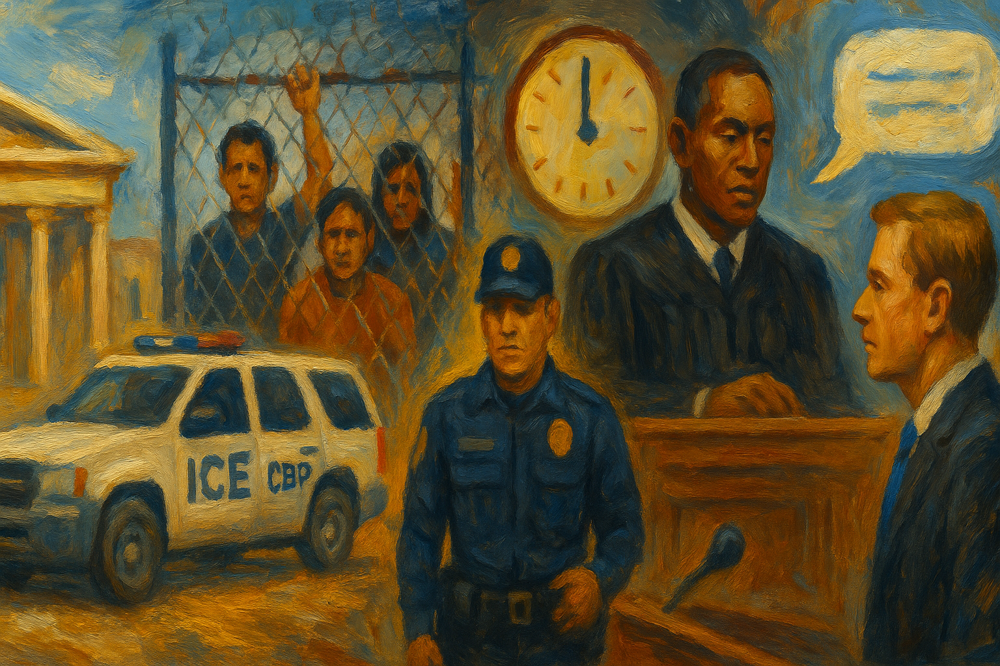

<!-- Generated by build_publish_week_v1 -->
<!-- Header image: image_wide_week73.png -->

# Week 73: Entrenchment Through Process

*Congress enlarged coercive immigration power while courts imposed real limits, leaving the Democracy Clock unchanged but the underlying structure harder.*

Week 73 was a week of entrenchment. The most important acts were not sudden breaks with law or open declarations of emergency. They were votes, signatures, nominations, deletions, threats, and refusals. Each came wrapped in process. Together they showed a government trying to turn discretion into structure: more money for coercion, fewer checks on its use, more loyal hands where law and intelligence meet, and a rougher public language meant to make all this seem ordinary.

At the close of the last period, the Democracy Clock stood at 8:14 p.m. It ended this week at 8:14 p.m., a net change of zero minutes. The stillness did not mean calm. It meant the week’s harms mostly deepened lines already cut: executive reach widened, immigration power hardened, and the information sphere grew dirtier, even as courts kept drawing real limits. The balance held on the dial because consolidation and resistance advanced at the same time.

The clearest act of consolidation came in immigration. Senate Republicans passed about $70 billion in added funding for ICE and CBP, the House followed, and Trump signed the measure into law. That sequence mattered. It took a field of power that had often grown through raids, directives, and improvisation and gave it a long budget horizon. Enforcement was not merely defended. It was endowed.

The winners were plain. ICE, CBP, and the White House gained money, time, and room to act. Congress, instead of fencing that power, enlarged it with few visible guardrails. The losers were plain too: detainees, migrants, local communities, and future overseers who will now face a larger and better-funded enforcement state. A budget can outlast a scandal. That was the structural fact beneath the week’s votes.

The human meaning of that funding was already visible. At Delaney Hall, officials and relatives described detention conditions during a hunger strike. Protesters there were pepper-sprayed. Senator Andy Kim said he was denied access to speak with detainees, a small but telling obstruction of oversight. In North Carolina, activists protested the conversion of a private prison into a detention center. In California, the state and Santa Clara County sued over an ICE holding facility in Gilroy, while GEO Group sued Colorado over a law requiring regular health inspections of detention sites. The machinery was expanding in public view. So were the fights over who could inspect it.

By midweek, reports described high or severe ICE activity across multiple states. Then came accounts that babies and toddlers had been detained and that parents of many U.S.-born children had been deported. Detainees at Delaney Hall widened their hunger strike. These were not side stories to the funding bill. They were its lived meaning. The week showed what happens when a coercive system gains new permanence just as its conduct grows harder to defend.

A second development showed how that enlarged machinery was being aimed. Refugee admissions data showed that nearly all recent admissions were white South Africans. The administration also reduced federal refugee cash assistance, making resettlement harder for those admitted under less favored terms. This was not only a question of border control. It was a sorting system. Protection, entry, and support were being distributed by a hierarchy the state was making more visible.

That hierarchy reached into daily life. Ohio imposed restrictive driver’s license rules for non-citizens, adding barriers to work, travel, and ordinary movement. ICE abandoned a policy that required reports and investigations of detainee deaths within 30 days of release, cutting one more line of accountability around custody. A whistleblower said officials planned to falsely mark immigrants dead to force self-deportation and had moved thousands into a harmful database. If true, that was administration as pressure campaign. Records were being used not to describe reality, but to make life unlivable.

The punitive logic also turned outward toward places that resisted. Tom Homan threatened to increase ICE presence in New York City after a state noncooperation law. By week’s end, the administration had suspended federal funding to the Los Angeles Homeless Services Authority. These acts did not arise from neutral allocation. They showed federal leverage used against disfavored jurisdictions. The point was not only to enforce immigration law. It was to teach states and cities that policy disagreement could bring operational or fiscal pain.

There was some counterforce. A federal court entered partial final judgment for plaintiffs challenging four USCIS policies, and the government appealed a Rhode Island immigration ruling to the First Circuit. Those cases showed that legal review still existed. But they also showed its posture. Courts were being asked to step in after policies had been launched, after records had been altered, after fear had spread. The state acted first. Review followed behind.

The week’s third major development lay in the executive’s treatment of limits themselves. The Justice Department argued that courts could not stop completed executive construction after the fact. That was more than a litigation tactic. It was a theory of power: act quickly, finish the work, and then claim review has become useless. If accepted, such a view would turn unlawful action into a race against remedy.

Trump pressed the same spirit inside Congress. After a Byrd Rule ruling on the SAVE America Act, he called for firing the Senate parliamentarian. He then urged Republicans to pass a large reconciliation bill carrying that same measure. The target was not only one bill. It was the idea that a nonpartisan referee, or a chamber’s own rules, could slow a favored outcome. Procedure was treated as sabotage when it did not serve the executive’s will.

The personnel choices fit the same pattern. Trump announced Bill Pulte as acting Director of National Intelligence, then moved to nominate Jay Clayton for the post, while also nominating Todd Blanche for attorney general. Blanche had been Trump’s former personal lawyer. Pulte lacked intelligence experience. Clayton raised the same question in a different form: whether expertise and distance still mattered less than trust and alignment. These were not routine appointments. They placed loyalty at the hinge points of justice and intelligence.

Other signals reinforced the point. A judicial nominee refused to say who won the 2020 presidential election during confirmation hearings. JD Vance said he would refer Minnesota officials to the Justice Department for a fraud investigation. Trump pardoned former Representative Stephen Buyer, using clemency to erase a corruption conviction. Each act had its own setting. Together they suggested a state in which law could protect allies, menace opponents, and be interpreted by people chosen less for independence than for usefulness.

Yet this was also the week in which courts kept answering back. A federal judge extended the block on the anti-weaponization fund and then granted a preliminary injunction against it, barring its creation or operation and requiring sworn declarations. Earlier in the week another judge had temporarily blocked the fund, and Judge Leon later adjusted his posture after the Justice Department said it would abandon the plan. The details mattered. They showed judges forcing the executive to speak under oath and to live within the record it made.

Another judge struck down the administration’s $100,000 H-1B fee, holding that the executive could not impose a major fee as a tax without Congress. That was a clean separation-of-powers ruling. It did not depend on motive. It depended on authority. In the same week, Judge Lamberth granted a preliminary injunction protecting named transgender prisoners’ housing placements and blocked transfers while litigation proceeded. In those cases, the courts did not repair the broader political climate, but they did stop immediate harms.

The Kennedy Center cases made the same point in a different register. After a court order, the institution removed Trump’s name from its website. Judge Cooper then denied a stay of the injunction pending appeal, keeping the ruling in force. Judge Boasberg also refused to vacate his opinion quashing grand jury subpoenas targeting Jerome Powell, protecting an independent institution from what the court had described as politically driven legal pressure. States and civil groups filed more suits as well, over disability-training grants, Ryan White conditions, anti-DEI contract terms, and other federal actions. The courts remained open. But they were working in reactive mode, trimming or blocking overreach after it had already been attempted.

A fifth development centered on records, secrecy, and the Epstein matter. The Department of Justice failed to release all files required by law. Reporting then described internal White House handling of the crisis, making clear that the issue was no longer only the contents of the files. It had become a test of whether politically dangerous records would be disclosed fully, delayed, or managed through selective release.

Congress responded unevenly. The House Oversight Committee continued its investigation with testimony from Lesley Groff. James Comer said the panel would seek testimony from Alan Dershowitz. House Democrats said they would call JD Vance to testify on the administration’s handling of the files and later demanded records about Ghislaine Maxwell’s transfer and a policy allowing attorney general overrides of prison placement. These were real oversight moves. They showed that some members still meant to widen the record.

But restraint and selectivity were visible too. Comer refused to subpoena Todd Blanche in the same broad inquiry. That refusal narrowed Congress’s leverage at a politically sensitive point. The result was familiar: oversight existed, but not evenly. It pressed where it could and stopped where it might cut too close to power. That unevenness is one way secrecy survives.

The human cost surfaced in the threats faced by survivors after the release of their names. Records fights are often described as abstract contests over disclosure. They are not abstract for the people inside them. In this case, incomplete release, selective inquiry, and public exposure combined to damage trust in process while putting vulnerable people at risk. A transparency failure had become a safety failure.

The sixth development concerned the information sphere itself. The White House launched an “Aliens” website that portrayed undocumented immigrants in dehumanizing terms. This was not stray rhetoric at a rally. It was official communication, built and published by the state. It used government voice to mark a vulnerable group as less than fully human and to shape public feeling before any policy argument began.

Private actors helped dirty the same field. Polymarket and Kalshi sponsored or partly removed influencer posts spreading false claims about the Los Angeles mayoral election. The important fact was not only that falsehoods spread. It was that they were paid for, amplified, and tied to market actors with money and reach. Election lies were not merely organic rumor. They were becoming a funded product.

The pressure on narrative extended into mainstream media and official symbolism. Scott Pelley said CBS leadership had pushed changes to make anti-ICE protesters look more violent. Defense Secretary Pete Hegseth used D-Day remarks to attack immigration and reject a broad public-welfare view of government. Trump walked out of an interview after being challenged on election-fraud claims. The White House social media team posted a digitally altered image mocking Hakeem Jeffries, and Trump falsely compared his own crowd to the crowd at Martin Luther King Jr.’s speech. These acts varied in scale. They worked in the same direction: degrade shared fact, stigmatize opponents, and turn public memory into raw material for factional use.

A quieter but important part of this same story lay in records management. The USDA secretary deleted an announcement about a second screwworm detection in Texas after posting it. The Justice Department still had not fully released required Epstein files. Democratic lawmakers requested a GAO audit of Venezuelan oil proceeds. These were separate matters, but they pointed to one habit: information was being withheld, trimmed, or released on terms set by power. The archive was not closed. It was being curated.

The seventh development was corruption in its now familiar form: not one scandal, but repeated overlap between family business, state action, and public resources. Reports said a foreign-linked investment flowed into a Trump Jr.-connected startup after favorable policy decisions. There were also reports of plans to transfer frozen Iranian assets to Gulf allies, raising conflict questions because Jared Kushner stood near both business and policy channels. The exact facts of each matter may yet be contested. The pattern was already visible.

That pattern widened through other reports. The Trump family was said to have made large profits from cryptocurrency licensing ventures. Trump-branded properties failed multiple health inspections, a smaller item but one that kept the family brand inside the public record as both business and political symbol. None of this proved a single unified scheme. It did show how hard it had become to separate private gain from public standing.

The most visual example was the planned UFC event on White House grounds. The Public Integrity Project sued over the event, asking courts to review whether federal property and resources had been misused for a private commercial spectacle. That lawsuit mattered because it made concrete what can otherwise seem diffuse. A state residence and seat of executive power was being bent toward personal branding and commercial theater. Public symbols were being rented, in effect, to the ruler’s image.

The final development came from the states, far from the week’s louder fights, but it belonged to the same story of power and capture. New York approved a one-year moratorium on large data centers. Illinois paused new data center tax exemption applications. Ohio paused tax breaks for new data centers. Residents and an advocacy group sued over the Stratos project in Utah. In Texas, Virginia, and Wisconsin, lawmakers and advocates fought over large revenue losses tied to such subsidies. These were not isolated local disputes. They formed a multi-state backlash against a style of development in which private firms gained speed, land, and tax favors while public review lagged behind.

What these fights exposed was the fiscal cost of subsidy politics. States had been giving away large sums, often with weak public input and uncertain public return. The winners were firms able to secure exemptions and fast-track treatment. The losers were taxpayers, local communities, and other public needs crowded out by the deal. In a week dominated by immigration and executive power, this was a quieter reminder that democratic erosion also grows through ordinary bargains that move wealth upward and decision-making away from the public.

One scheduled matter remained in view at week’s end: defendants in the Dorcas International case had appealed the Rhode Island USCIS ruling to the First Circuit, moving that challenge into its next judicial stage.

Week 73 did not move the clock, but it did clarify the shape of the period. Congress gave coercive power a longer life. The executive pressed against referees and stocked key posts with trusted hands. Courts kept intervening, though mostly after the state had already lunged. Records were withheld, language grew harsher, and public symbols were bent toward private use. The stillness on the dial was not peace. It was a tug held in balance, not a danger passed.

<!-- Synopses for cross-posting -->
Long Synopsis: Week 73 was defined by entrenchment rather than rupture. Congress passed and President Trump signed roughly $70 billion in added funding for ICE and CBP, giving immigration enforcement a longer budget horizon and fewer practical constraints just as detention abuses, hunger strikes, and aggressive multi-state enforcement became more visible. The administration also sharpened a hierarchy of belonging through refugee policy, benefit cuts, and threats against noncooperating jurisdictions. At the same time, Trump pressed against institutional referees, attacked Senate procedure, and advanced loyalty-centered nominations for justice and intelligence posts. Records fights deepened around the Epstein files, while official messaging and paid amplification further degraded the information sphere. Yet courts repeatedly blocked or narrowed executive overreach, from the anti-weaponization fund to immigration fees and institutional interference. The clock did not move because consolidation and resistance advanced together.
Short Synopsis: Congress locked in major new immigration enforcement funding, the executive pressed against oversight and procedure, and the information sphere worsened. Courts still imposed meaningful checks, so the Democracy Clock held at 8:14 p.m. even as coercive power became more durable.

