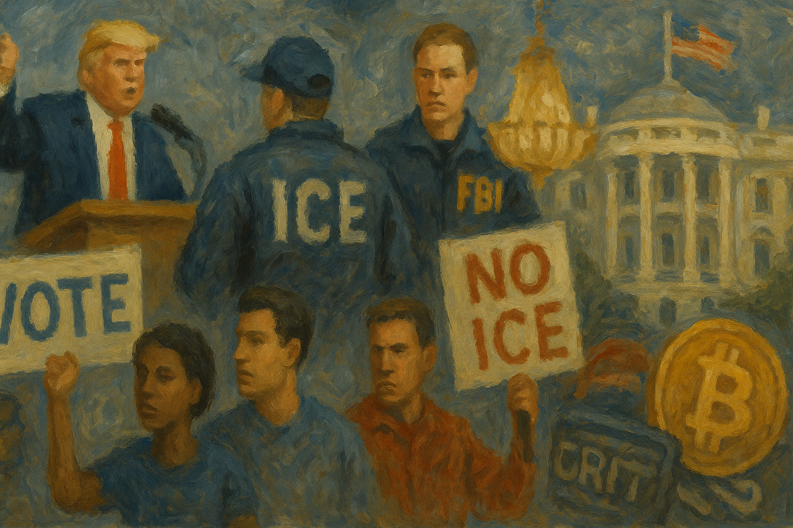

<!-- Generated by build_publish_week_v1 (appendix post) -->
<!-- Header image: image_wide_week74_appendix.png -->

# Week 74 Appendix: Spectacle and Stalemate at Eighty

*A birthday cage fight, weighed emergency powers, and a judiciary still willing to say no left the Democracy Clock frozen at 7:41 p.m.*

This week combined grotesque spectacle with substantive institutional erosion. The White House hosted a corporate-sponsored UFC event and crypto sponsorship on Trump's 80th birthday, while a $70bn immigration enforcement bill, a considered suspension of habeas corpus, and a DOJ-directed investigation of a political rival (Newsom) revealed deepening weaponization of federal power against opponents. The FBI raided a voting-rights group, ICE ended death-reporting requirements, and an unqualified loyalist took over the intelligence community while a major surveillance law lapsed amid dysfunction. Courts pushed back repeatedly—ordering Kennedy Center name removal, blocking a slush fund, restoring historical exhibits, and freeing a detained imam—showing judicial resistance remains functional. Congress showed intermittent independence (war powers resolution, Georgia GOP refusing redistricting) but also revealed corruption (FBI bonus 'slush fund'), a chaotic Iran deal signed without transparency, and continued monetization of the presidency (emoluments, crypto, no-bid contracts). The week is a study in simultaneous decay and resistance.

Power and Authority

1. Trump hosted a UFC fight event on the White House South Lawn funded partly by federal agencies and a Trump family crypto venture (2026-06-13): The president used the White House grounds and federal resources for a commercial sporting spectacle tied to his own financial interests, raising emoluments and public-resource concerns.

2. Trump administration began building a 250-foot triumphal arch on federal land without congressional approval, using no-bid contracts (2026-06-13): The administration bypassed normal congressional and contracting oversight to build a monument, raising separation-of-powers and public-spending concerns.

3. Trump administration awarded nearly $103 million in 250th-anniversary celebration contracts to politically connected entities (2026-06-13) *[single source]*: Federal funds appropriated for a national commemoration were redirected largely to allies of the administration, raising conflict-of-interest concerns.

4. Trump signed a $70 billion Department of Homeland Security funding bill extending mass deportation operations through 2029 without added oversight measures (2026-06-13): A multi-year immigration enforcement appropriation removed congressional accountability mechanisms, expanding executive latitude over deportation operations.

5. Trump ordered a military strike killing a Venezuelan gang leader and publicized the operation on social media (2026-06-13): The president announced an extraterritorial lethal strike via social media, raising questions about the scope of unilateral executive war powers.

6. Trump deployed military ceremonial units, including the Army Herald Trumpets, for a private UFC press event (2026-06-13) *[single source]*: Use of military ceremonial assets for a commercial entertainment event blurred lines between state ceremony and personal spectacle.

7. Trump considered suspending habeas corpus to speed mass deportations before adopting a policy workaround instead (2026-06-15): Senior officials seriously weighed suspending a core constitutional protection to bypass judicial review of deportations, then achieved a similar effect through administrative reclassification.

8. Trump administration directed the Department of Justice to investigate Governor Gavin Newsom and his wife (2026-06-15): Federal law enforcement was directed against a potential 2028 political rival, raising concerns about weaponized prosecution of opponents.

9. Stephen Miller, J.D. Vance pushed to invoke the Insurrection Act to suppress protests against ICE operations after federal agents killed two civilians (2026-06-16): Senior officials considered using military authority to suppress domestic dissent following fatal federal enforcement shootings, testing constitutional limits on military power over civilians.

10. Trump threatened Senator Lindsey Graham with unspecified consequences over his skepticism of the Iran deal (2026-06-16): A presidential threat against a sitting senator for policy disagreement represents an attempt to coerce legislative compliance through intimidation.

11. Trump administration sent federal agencies and law enforcement to relocate detainees, pursue immigration crackdowns, and expand ICE funding while announcing a July 4 rally at national monuments (2026-06-15): The administration converted a nonpartisan national holiday celebration into a campaign rally using federal monuments, extending the pattern of merging official and partisan activity.

12. Trump cancelled the Senate confirmation hearing for DNI nominee Jay Clayton via social media hours before it was scheduled (2026-06-17): The president unilaterally blocked a Senate confirmation process to ensure a loyalist remained in an acting intelligence leadership role, bypassing legislative oversight.

13. Acting Secretary of Labor Keith Sonderling threatened to withhold unemployment insurance administrative funds from 53 states and territories based on unsubstantiated fraud claims targeting Democratic-led states (2026-06-17): Federal funding was threatened against states based on unsupported partisan claims, testing federalism and using fiscal leverage against political opponents.

14. Trump accepted a Qatari-donated jet as a personal Air Force One replacement, stating he intends to keep it after leaving office (2026-06-19): Acceptance of a foreign government's aircraft for personal presidential use raises constitutional emoluments concerns and questions about foreign influence over the presidency.

15. Trump signed a memorandum of understanding with Iran granting immediate sanctions relief, unfreezing billions in assets, and committing to a $300 billion reconstruction fund without congressional disclosure (2026-06-17): A major foreign policy and financial commitment was made unilaterally by the executive without public or congressional review, raising separation-of-powers concerns over war-and-peace authority.

Institutions and Governance

1. House of Representatives passed an Iran war powers resolution 215–208 (2026-06-13): Congress asserted its constitutional war powers authority over presidential military action, sending the measure to the Senate for further consideration.

2. Judge Christopher Cooper and appellate courts ordered and enforced removal of Trump's name from the Kennedy Center facade after rejecting emergency appeals (2026-06-13): Courts reaffirmed that only Congress can rename a congressionally designated institution, checking an executive attempt at unilateral rebranding of public property.

3. Judge Angel Kelley struck down the administration's removal of slavery, civil rights, and Indigenous history exhibits from national parks, ordering their restoration (2026-06-13) *[single source]*: A federal court found the administration's historical erasure order constituted censorship, ordering restoration of educational material at national monuments.

4. Kennedy Center Board resisted and delayed compliance with the court order to remove Trump's name before ultimately certifying compliance (2026-06-16): A Trump-appointed board's initial defiance of a judicial order, followed by delayed compliance, illustrates friction between executive loyalists and court authority.

5. Judge Leonie Brinkema issued a preliminary injunction blocking a $1.8 billion fund intended to compensate Trump allies including January 6 defendants (2026-06-13): A federal judge halted use of a taxpayer-funded settlement pool that could have rewarded political allies, checking a potential conversion of public funds into partisan patronage.

6. New Jersey Attorney General sued GEO Group to force health inspections at the Delaney Hall immigration detention facility (2026-06-13): State legal action sought to enforce oversight of a federally contracted detention facility amid abuse allegations, prompting some detainee releases.

7. Congress allowed Section 702 of the Foreign Intelligence Surveillance Act to expire after failing multiple votes to extend it (2026-06-13) *[single source]*: A major warrantless surveillance authority lapsed after lawmakers, distrustful of a politically loyal acting intelligence director, refused to renew it, creating legal uncertainty.

8. House Committee on Energy and Commerce requested NIH records following mpox smuggling charges against two agency scientists (2026-06-16) *[single source]*: Congressional oversight examined whether NIH was aware of or authorized researchers who allegedly smuggled dangerous pathogens, testing agency accountability.

9. House Judiciary Committee Democrats launched an investigation into FBI Director Kash Patel's alleged diversion of over $1 million in bureau funds to loyalist agents (2026-06-16) *[single source]*: Lawmakers opened an inquiry into whether the FBI director used public funds as a personal reward system, raising rule-of-law concerns about politicized federal law enforcement.

10. Senator Lindsey Graham asserted that any final Iran nuclear agreement must be sent to Congress for review and a vote (2026-06-16): A senator asserted congressional authority over a major foreign-policy agreement, signaling potential legislative pushback against executive unilateralism.

11. Republican senators (Cassidy, Cruz, Tillis, Graham, Marshall) publicly criticized the Iran memorandum of understanding as a major foreign policy failure (2026-06-17): Multiple Republican senators publicly broke with the president over a major war-ending agreement, demonstrating congressional dissent over executive foreign policy.

12. Georgia House of Representatives declined to redraw the state's congressional map despite pressure from Trump following a Supreme Court ruling weakening Voting Rights Act protections (2026-06-18): A state legislature resisted presidential pressure to exploit a weakened Voting Rights Act for partisan redistricting gain, preserving a more deliberative process.

13. Jamie Raskin issued formal records requests to Harvard and Bard College over their historical ties to Jeffrey Epstein (2026-06-18) *[single source]*: Congressional oversight sought accountability from universities over alleged institutional complicity in facilitating a convicted sex offender's activities.

14. Adam Schiff introduced legislation to bar January 6 defendants from receiving federal compensation payouts (2026-06-17) *[single source]*: A senator proposed closing a legal avenue that allowed convicted insurrectionists to seek taxpayer-funded compensation, pushing back against politicized use of federal funds.

15. Judge Amit P. Mehta rejected a lawsuit challenging the White House UFC event for lack of standing (2026-06-13): A federal court declined to review alleged conflicts of interest in a private corporate event held on White House grounds, foreclosing judicial scrutiny of potential misuse of federal resources.

Economic Structure

1. DOJ Antitrust Division approved a $111 billion merger between Paramount Skydance and Warner Bros Discovery (2026-06-13) *[single source]*: A major media merger was cleared by a politically aligned antitrust division, raising concerns about competitive harm and editorial independence at merged news outlets.

2. Elon Musk became the world's first trillionaire following SpaceX's public share offering (2026-06-13): A major political donor's unprecedented wealth accumulation followed sustained political spending, raising questions about links between political investment and financial reward.

3. Trump administration awarded a $14.2 million no-bid contract to renovate the Lincoln Memorial Reflecting Pool to a firm with prior ties to Trump's golf properties (2026-06-16): A no-bid public works contract went to a company with prior business ties to the president, and the project failed, prompting costly remediation and raising crony-capitalism concerns.

4. UFC and World Liberty Financial arranged for fighter bonuses to be paid in a Trump family cryptocurrency at the White House event (2026-06-14) *[single source]*: A federal event was used to promote and distribute a cryptocurrency tied to the president's family business, raising emoluments and self-dealing concerns.

5. Trump administration understated the cost of the White House East Wing ballroom renovation, which grew from a promised $200 million to an estimated $600 million, more than half funded by taxpayers (2026-06-16): Public misrepresentation of a massive cost overrun for a presidential residence project raises concerns about misuse of public funds and lack of transparency.

6. Senator Kevin Cramer publicly defended the president's personal financial involvement in cryptocurrency policy as pro-growth (2026-06-16): A sitting senator defended presidential self-dealing in cryptocurrency, signaling legislative acceptance of conflicts of interest tied to crypto regulation.

7. Trump administration granted Iran immediate sanctions relief and access to a $300 billion reconstruction fund as part of the memorandum of understanding (2026-06-16): A major economic concession to a foreign adversary was made without congressional approval or public disclosure of terms, raising transparency and oversight concerns.

8. California Secretary of State certified that a billionaire wealth-tax ballot initiative qualified for the November 2026 ballot (2026-06-19): A direct-democracy measure to tax extreme wealth advanced to the ballot despite well-funded opposition from tech billionaires, testing the influence of elite spending on policy outcomes.

9. ConocoPhillips prepared to sign the first major American energy contract with Syria's new government (2026-06-16): A major U.S. energy company's entry into Syria signals a significant shift in American economic and diplomatic engagement with a previously sanctioned regime.

10. Department of Justice filed a proposed settlement against OhioHealth Corporation over anticompetitive healthcare contract terms (2026-06-16): Antitrust enforcement targeted a healthcare system's contract restrictions that raised costs for patients, testing the department's capacity to police market abuses.

11. Federal agencies and UFC invested at least $60 million toward a White House cage-fight event benefiting a business in which the president holds a financial stake (2026-06-13) *[single source]*: Federal and private funds were jointly directed to a spectacle event tied to presidential financial interests, raising emoluments concerns.

Civil Rights and Dissent

1. FBI raided the office of the Ohio Organizing Collaborative, a grassroots voter registration group, and interviewed affiliated individuals statewide (2026-06-13): Federal agents searched a voter registration organization ahead of midterm elections, raising concerns about intimidation of civic engagement groups.

2. Senatobia, Mississippi police officer shot into a vehicle during a shoplifting response, killing one-year-old Kohen Wiley (2026-06-14): A police shooting during a minor incident killed an infant, prompting protests and demands for accountability and transparency about the use of force.

3. ICE ended its policy requiring reporting of deaths occurring within 30 days of release from detention (2026-06-13): The agency reduced transparency around detention-related deaths just as its funding and enforcement scope expanded, weakening oversight of custodial safety.

4. Delaney Hall / ICE enforced an arbitrary dress code that repeatedly barred family visitors, including young children, from an immigration detention facility (2026-06-15): Inconsistent visitor rules blocked family contact with detainees, functioning as an additional barrier for vulnerable populations navigating detention.

5. ICE/Border Patrol shot and killed civilians Renee Good and Alex Pretti in Minnesota without facing charges (2026-06-16): Federal agents killed two civilians during immigration enforcement operations without subsequent prosecution, contrasting with aggressive charges brought against protesters.

6. U.S. Attorney Daniel Rosen charged fifteen people with conspiracy to impede federal immigration officers following protests in Minneapolis (2026-06-16): Federal prosecutors charged protesters with conspiracy after a crackdown that killed two civilians, raising concerns about criminalizing dissent against enforcement operations.

7. federal government dropped 18 of 36 prior conspiracy cases against Minnesota protesters while filing new charges against others, including journalists (2026-06-16): A pattern of dismissed and refiled prosecutions against immigration-enforcement protesters, including journalists, suggests weaponized and inconsistent use of federal charging authority.

8. Trump administration categorized the decentralized "antifa" movement as a domestic terror organization, later invoked in prosecutions of protesters (2026-06-16): Labeling a loosely defined political movement as terrorism enabled prosecution of protest activity, blurring the line between dissent and criminal conspiracy.

9. Judge James Patrick Hanlon ordered the release of a Wisconsin mosque president detained by ICE in apparent retaliation for Palestinian rights advocacy (2026-06-19) *[single source]*: A federal judge found ICE likely detained a legal resident in retaliation for protected political speech, reaffirming First Amendment protections against retaliatory detention.

10. Florida Attorney General James Uthmeier filed a civil lawsuit against TikTok for allegedly violating Florida's child social media restriction law (2026-06-16) *[single source]*: A state enforcement action tested whether a major platform must comply with child-protection statutes limiting minors' social media access.

11. DOJ Office of Legal Counsel issued a memo arguing federal disability law does not require states to provide community-based care over institutionalization (2026-06-18) *[single source]*: A legal opinion signaled potential rollback of nearly 30 years of disability-rights enforcement enabling community living over institutionalization.

12. DOJ charged five men with conspiracy to attack the White House UFC event using drones and snipers (2026-06-15): Federal authorities disrupted an alleged mass-casualty plot targeting a high-profile government event, demonstrating law enforcement's protective function.

13. outloud reported federal prosecutors indicted fifteen anti-ICE protesters in Minneapolis after infiltrating their encrypted Signal chats (2026-06-19) *[single source]*: Federal investigators' infiltration of encrypted protest-organizing communications raises concerns about surveillance chilling protected assembly and speech.

14. North Carolina legislature advanced HB 1038 and HB 958, bills reshaping electoral districts and election administration seen as diluting Black voter power and restricting ballot access (2026-06-19) *[single source]*: State legislation targeting Black representation and voter access advanced despite organized opposition, threatening equal electoral participation.

15. North Carolina Board of Elections and General Assembly adopted new partisan election rules and advanced an omnibus bill restricting early voting, campaign finance transparency, and turnout encouragement (2026-06-14) *[single source]*: Sweeping state election legislation curtailed voting access and politicized election administration ahead of upcoming contests.

16. Shasta County voters approved Measure B, ending most mail-in and early voting and requiring strict photo ID (2026-06-15): A local ballot measure sharply restricted voting access, prompting a state lawsuit over whether counties can override statewide election rules.

17. Democracy Docket reporting documented a pattern of local voting restrictions, including Huntington Beach's photo ID measure, Luzerne County drop box removal, Nye County hand counts, Otero County certification refusal, and Wausau's drop box removal, alongside court rulings against several (2026-06-17) *[single source]*: A cataloged pattern of local voting restrictions across multiple states shows a coordinated effort to narrow ballot access, with courts intervening in several instances.

18. Alaska elections director Carol Beecher barred a candidate sharing the incumbent senator's name from the primary ballot, finding the candidacy intended to confuse voters (2026-06-16): An election official removed a ballot-confusion candidate from a competitive Senate primary, testing the boundaries of ballot access regulation.

19. Trump Justice Department ramped up denaturalization efforts, planning at least 250 cases by October after filing 29 in under two months (2026-06-18) *[single source]*: A sharp acceleration in denaturalization filings threatens the citizenship security of naturalized Americans, expanding a controversial legal tool.

20. ICE purchased immigrants' tax identifier records from a data broker in an apparent workaround of a court order restricting such access (2026-06-17) *[single source]*: Circumventing a judicial restriction through third-party data purchases expands surveillance of immigrants while undermining court authority.

21. zeteo reported that deaths in ICE detention more than doubled under the current administration compared to prior years (2026-06-17) *[single source]*: A sharp rise in detention-related mortality signals systemic failures in custodial conditions and oversight of immigration enforcement facilities.

22. Department of Homeland Security announced relocation of detainees from the Alligator Alcatraz facility and cancellation of a planned Georgia detention center after sustained local opposition (2026-06-17) *[single source]*: Local and legal pressure over detention conditions and expansion plans contributed to reversals in immigration detention infrastructure, though transparency about detainee whereabouts remained limited.

23. House oversight and judiciary committees visited a federal prison to investigate alleged preferential treatment for Ghislaine Maxwell, reporting obstruction by Bureau of Prisons leadership (2026-06-17) *[single source]*: Congressional oversight of prison conditions for a high-profile inmate was reportedly obstructed, raising accountability and transparency concerns in the federal prison system.

24. January 6 defendants pursued federal tort claims seeking millions in compensation for their prosecutions, following administration settlements for other Trump allies (2026-06-17): Convicted assailants of police officers sought taxpayer compensation through an unchecked federal process, raising rule-of-law and equal-justice concerns.

25. outloud reported that North Carolina HB 437 effectively criminalizes homelessness (2026-06-19) *[single source]*: Legislation converting housing insecurity into a criminal matter extends punitive policy against a vulnerable population.

26. 50501 reported tear gas deployed against protesters demanding accountability for the police killing of an infant (2026-06-17) *[single source]*: Law enforcement's use of tear gas against demonstrators seeking answers about a fatal police shooting raises concerns about the policing of protest and dissent.

Information, Memory and Manipulation

1. Trump posted a series of disinformation-laden social media images, including a false depiction of the Obama Presidential Center and AI-generated propaganda imagery (2026-06-13): The president used social media to spread disinformation and demean a predecessor's institution, illustrating continued use of official channels for propaganda.

2. popinfo revealed that a PAC posing as progressive, Progressive Champions PAC, was covertly linked to Republican House leadership infrastructure (2026-06-13) *[single source]*: A deceptive campaign-finance structure disguised as progressive was found to be GOP-aligned, illustrating manipulation of Democratic primaries through concealed funding.

3. meidas reported Trump falsely claimed the Strait of Hormuz had reopened despite vessel-tracking data showing no such change (2026-06-15): Official claims about a major global shipping route's status contradicted independent tracking data, exemplifying gaps between public statements and verifiable fact.

4. Kash Patel posted details of a sealed, ongoing FBI investigation on social media, allegedly to claim personal credit (2026-06-16): The FBI director's premature disclosure of court-sealed investigative details risked compromising a prosecution and reflected politicized use of law enforcement information.

5. meidas reported that conservative media falsely blamed algae contamination in the renovated Reflecting Pool on political sabotage rather than filtration failure (2026-06-14): A verifiable engineering failure was recast by media allies as intentional sabotage, illustrating disinformation used to obscure government mismanagement.

6. meidas reported the White House delayed release of a government report on voting machine vulnerabilities ahead of the midterm elections (2026-06-19) *[single source]*: Suppression of an election-security report, amid stated intent to pursue unfounded fraud claims, threatens public confidence in and oversight of election integrity.

7. meidas reported that RNC Chair Joe Gruters made a grossly false claim that the White House UFC event outdrew the Super Bowl in viewership (2026-06-19): A senior party official's dissemination of a wildly inaccurate viewership claim about a White House event reflects normalized fabrication in official political messaging.

8. meidas reported that Iran's Foreign Ministry and other officials contradicted the Trump administration's public characterization of the memorandum of understanding's terms (2026-06-15) *[single source]*: Conflicting official narratives about a major diplomatic agreement's actual terms obscured the public's ability to assess a significant foreign policy commitment.

9. meidas reported the Iran memorandum's text was withheld from Congress, the press, and Israel despite promises of disclosure (2026-06-16) *[single source]*: Withholding the text of a major international agreement from Congress and an allied government prevented informed public and legislative debate on its terms.

10. meidas reported Trump publicly reversed his stated rationale for the Iran war and praised Iranian leadership he had previously sought to overthrow (2026-06-16) *[single source]*: A public reversal of the administration's stated justification for military conflict, made without explanation, undermines democratic accountability for war decisions.

11. meidas reported Trump made false public statements about Italian Prime Minister Meloni's conduct at the G7 summit (2026-06-19): Fabricated claims about a diplomatic interaction with an allied leader damaged transatlantic relations and prompted a diplomatic protest cancellation.

