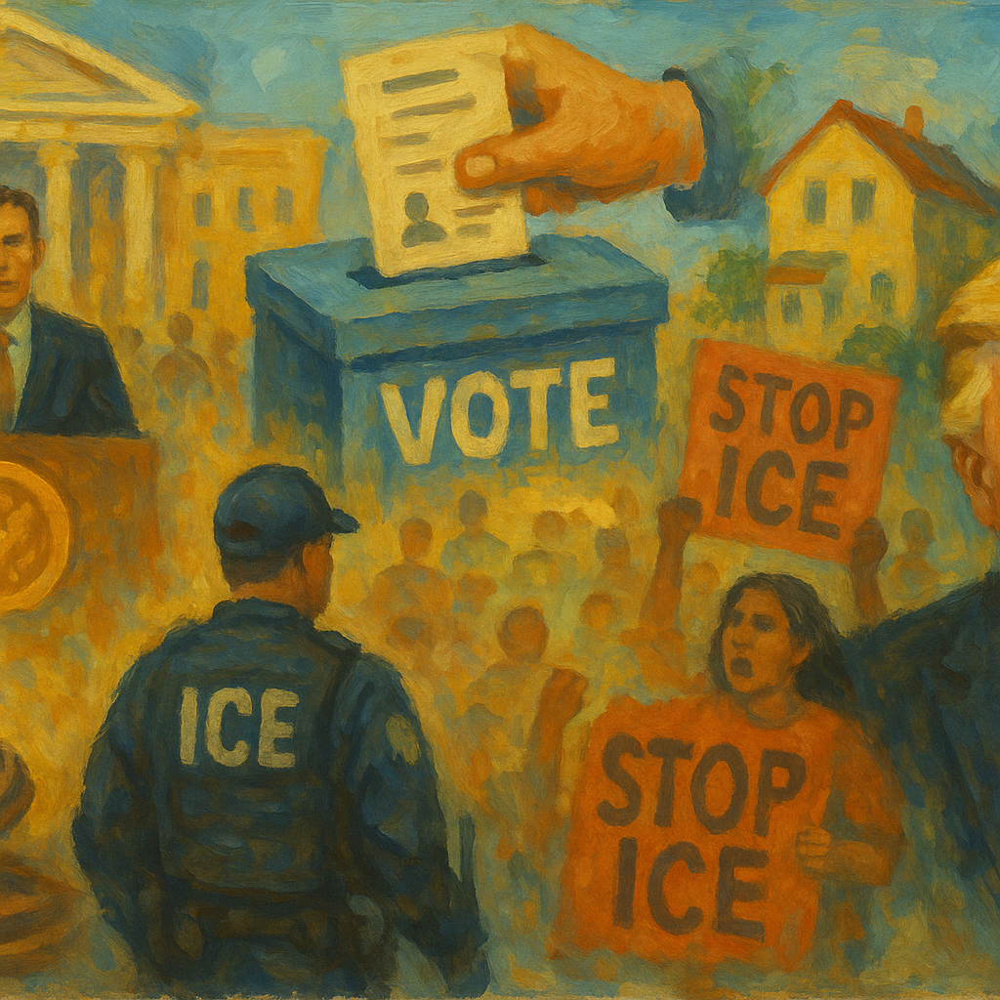

<!-- Generated by build_publish_week_v1 (appendix post) -->
<!-- Header image: image_wide_week75_appendix.png -->

# Week 75 Appendix: A Frozen Clock, A Dozen Fractures

*The Democracy Clock held still this week, but beneath that stillness a presidency tested courts, Congress, and truth itself at once.*

This week was defined by an extraordinary convergence of executive coercion, judicial deference to executive immigration authority, and open contempt for legislative independence, set against the surreal backdrop of a failed reflecting-pool renovation used as pretext for arrests and militarized security theater. The Supreme Court delivered two major rulings stripping TPS protections from Haitians and Syrians and authorizing asylum turn-backs, while separately overturning Humphrey's Executor to give the president unchecked removal power over independent agency heads. Trump held bipartisan housing legislation hostage to force passage of a voter-restriction bill (SAVE Act), conditioned FISA reauthorization on the same demand, and berated senators who exercised war-powers authority over the Iran conflict—prompting a stunning capitulation when the Senate reversed its own resolution under direct presidential pressure. Meanwhile, courts issued a string of rulings blocking federal voter-roll seizures and mail-ballot restrictions, and eight Texas protesters received 30-100 year sentences on terrorism charges for a 2025 anti-ICE demonstration, signaling aggressive criminalization of dissent alongside institutional resistance.

Power and Authority

1. Trump made false and escalating claims that vandals damaged the Lincoln Memorial reflecting pool (2026-06-20): The president fabricated an inflating vandalism narrative to deflect blame for a failed renovation, using state authority to punish an invented enemy.

2. US Park Police and National Guard arrested and detained citizens at the reflecting pool, including a 67-year-old Olympic canoeist held incommunicado for five hours (2026-06-21): Federal and deputized state officers arrested civilians for minor contact with a defective public installation, raising due process and proportionality concerns.

3. US Marshals Service deployed out-of-state law enforcement officers to conduct detainments at the reflecting pool (2026-06-21) *[single source]*: Federal deputization of out-of-state police to patrol a national monument raised concerns about federalized, unaccountable domestic policing.

4. Jeanine Pirro announced aggressive prosecution of anyone touching or vandalizing the reflecting pool (2026-06-21): A US Attorney's public threat of full prosecution for minor contact with public property signaled potential politicization of criminal enforcement.

5. Trump erected a fence restricting public access around the reflecting pool (2026-06-23) *[single source]*: Restricting public access to a national monument in response to fabricated vandalism claims narrowed civic space at a federal site.

6. Trump canceled the signing of a bipartisan housing bill to force passage of the SAVE America Act voter-restriction measure (2026-06-24): The president held popular, bipartisan legislation hostage to compel passage of a voting-restriction bill, using executive leverage against normal lawmaking.

7. Trump berated Republican senators for supporting a war-powers resolution on Iran (2026-06-24): The president directly pressured lawmakers exercising constitutional war-powers oversight, testing legislative independence from executive coercion.

8. Senate Republicans reversed their prior vote and rejected a binding war-powers resolution after presidential pressure (2026-06-25): Senators who had briefly asserted war-powers authority reversed course under direct intimidation from the president, weakening a core constitutional check.

9. Mike Johnson pledged to shield the Trump administration from congressional oversight if Republicans retain the majority (2026-06-26) *[single source]*: The Speaker of the House explicitly promised to block investigations into potential executive corruption, undermining the legislature's oversight function.

10. Trump instructed the Justice Department to investigate oil companies for alleged gas-price gouging (2026-06-25): The president directed federal law enforcement against a private industry based on political concern over prices, raising politicization concerns.

11. Trump called Democratic political opponents "godless communists" and "animals" at a religious conservative conference (2026-06-26): The president used dehumanizing rhetoric against political opponents ahead of midterms, escalating polarization and delegitimizing dissent.

12. Stephen Miller declared the administration's goal to end birthright citizenship (2026-06-26) *[single source]*: A senior White House official publicly announced intent to eliminate a constitutional right rooted in the 14th Amendment, escalating attacks on citizenship protections.

13. Trump called for military deployment to Chicago amid weekend shootings, over the governor's objection (2026-06-22) *[single source]*: The president pressed for federal military intervention in a Democratic-led city despite the governor's legal resistance, testing federalism limits on domestic force.

Institutions and Governance

1. SCOTUS overturned Humphrey's Executor, granting presidents power to fire independent agency leaders without cause (2026-06-24) *[single source]*: The Supreme Court eliminated a 90-year precedent insulating independent agencies from presidential removal, concentrating power in the executive branch.

2. William Pulte was installed as acting director of national intelligence and ordered mass firings at the National Counterterrorism Center (2026-06-20) *[single source]*: An unqualified loyalist took control of the intelligence community and immediately purged counterterrorism staff, threatening institutional independence and expertise.

3. Pete Hegseth fired General Chris Donahue, commander of U.S. Army Europe and Africa (2026-06-21): The removal of a bipartisan-respected military commander suggested loyalty purges over merit-based leadership decisions in the armed forces.

4. Federal judge (New York) barred most ICE arrests at immigration courthouses in New York City (2026-06-20): A court restrained federal immigration enforcement tactics found to be potentially unconstitutional, asserting judicial oversight of executive agency conduct.

5. Judge Gary Brown condemned ICE practices as "abhorrent and illegal" in a court ruling (2026-06-20) *[single source]*: A Trump-appointed federal judge publicly denounced systematic illegal conduct by federal agents, reinforcing judicial checks on law enforcement abuse.

6. Texas Supreme Court ruled that environmental groups lack standing to challenge SpaceX beach closures (2026-06-21) *[single source]*: The ruling removed a legal remedy for enforcing constitutionally protected public beach access, letting a private company restrict public land with no recourse.

7. Chief Judge Patrick J. Schiltz quashed DOJ subpoenas against Minnesota officials, finding them politically motivated retaliation (2026-06-23) *[single source]*: A federal court rejected the executive branch's use of subpoena power to punish state officials for sanctuary policies, reaffirming limits on federal coercion of states.

8. SCOTUS blocked a Rastafarian prisoner's damages lawsuit over forced head-shaving, limiting religious-rights remedies (2026-06-23): The Court narrowed statutory protections for incarcerated people's religious rights, removing a deterrent against official abuse.

9. US Senate passed a war-powers resolution requiring congressional approval to continue Iran hostilities (2026-06-23): A bipartisan Senate majority asserted constitutional war-powers authority over unilateral executive military action, a rare institutional check.

10. US District Judge Sparkle Sooknanan blocked use of the SAVE database to screen state voter rolls (2026-06-23): A federal court halted a system with a documented high error rate from being used to purge voters, protecting the right to vote from executive overreach.

11. Sixth Circuit Court of Appeals rejected the Trump administration's lawsuit seeking Michigan's voter rolls (2026-06-24) *[single source]*: An appellate court denied a federal attempt to seize state voter data, part of a pattern of judicial rejection of centralized election control.

12. US District Judge Denise Casper permanently blocked provisions of Trump's executive order asserting federal power over elections (2026-06-24): A federal court ruled the president has no specific constitutional authority over elections, blocking a proof-of-citizenship voter mandate nationwide.

13. US District Judge Indira Talwani ruled Trump's executive order restricting mail-in voting unconstitutional (2026-06-25): A federal court struck down a plan to condition mail-ballot delivery on states surrendering voter data, protecting mail-voting access nationwide.

14. Judge Christopher Cooper ordered the Trump administration to explain a tarp obscuring the Kennedy Center facade after a court-ordered name removal (2026-06-25) *[single source]*: A federal judge pressed the administration over apparent noncompliance with a prior order to remove Trump's name from the Kennedy Center.

15. Judge Tony Graf held a state prosecutor in contempt for violating a gag order in the Charlie Kirk murder case (2026-06-25) *[single source]*: A state judge enforced fair-trial protections against prosecutorial misconduct, reinforcing due process in a high-profile criminal case.

16. SCOTUS allowed the Trump administration to end Temporary Protected Status for roughly 350,000 Haitians and thousands of Syrians (2026-06-25): The Court removed judicial review of executive decisions revoking humanitarian legal status from vulnerable populations, expanding unchecked immigration authority.

17. SCOTUS cleared the way for asylum seekers to be physically blocked at the U.S.-Mexico border (2026-06-25): The Court authorized a policy that lets officials deny entry to asylum seekers without processing claims, narrowing statutory refugee protections.

18. Senate blocked a second, binding war-powers resolution after presidential lobbying (2026-06-25): The chamber reversed its earlier assertion of authority over Iran hostilities following direct executive pressure on wavering senators.

19. House Republican leadership and Rep. Anna Paulina Luna shut down House floor operations to pressure the Senate on the SAVE Act (2026-06-25) *[single source]*: A member's procedural obstruction paralyzed the House, illustrating breakdown of normal legislative function amid a voting-rights standoff.

20. Judge Denise Casper permanently barred a proof-of-citizenship voter registration order (2026-06-25) *[single source]*: A court struck down another element of federal control over voter eligibility, reinforcing that election administration authority rests with states.

21. James Comer issued subpoenas to Leon Black after he refused to answer questions on Epstein-related NDAs (2026-06-26): A House committee used compulsory process to press a witness on documents tied to Jeffrey Epstein, testing congressional investigative authority.

22. Judge Emmet Sullivan ordered the Trump administration to advance transparency measures in the Epstein Files case (2026-06-25): A federal judge compelled the executive branch to comply with disclosure obligations, preventing indefinite secrecy over Epstein-related records.

23. US House and Senate passed the bipartisan 21st Century Road to Housing Act (2026-06-22) *[single source]*: Congress advanced legislation to lower housing costs with strong bipartisan support, a functioning example of legislative deliberation.

24. 50501 movement and disability-rights coalition condemned a DOJ memo threatening Olmstead-based disability protections (2026-06-22) *[single source]*: Major disability-rights organizations mobilized against a federal memo perceived as weakening 27-year-old protections for community living.

Economic Structure

1. National Park Service awarded a no-bid $1.7 million contract for reflecting pool repairs to a firm owned by a Trump donor (2026-06-21): A government contract for a failed renovation project went to a politically connected donor without competitive bidding, raising conflict-of-interest concerns.

2. Trump administration issued Medicaid work-requirement rules under the One Big, Beautiful Bill Act (2026-06-22) *[single source]*: New Medicaid rules threaten to strip health coverage from millions of low-income Americans, including people with HIV who depend on continuous treatment.

3. US House proposed a $225 million cut to the Ryan White HIV/AIDS program (2026-06-22) *[single source]*: A proposed funding cut threatens care access for roughly half of all Americans living with HIV, compounding pressure on already-strained state assistance programs.

4. Trump administration froze HIV research funding in South Africa and proposed eliminating CDC HIV-prevention funding (2026-06-22) *[single source]*: Cuts to domestic and international HIV programs disproportionately affect marginalized communities and undermine decades of public health progress.

5. Scott Bessent (Treasury Secretary) issued a 60-day general license waiving Iranian oil sanctions (2026-06-22): A sweeping unilateral reversal of oil sanctions on Iran, issued without congressional approval, restored billions in economic access to a nuclear-armed adversary.

6. Tech-backed Super PACs spent more than $24 million on a single New York congressional primary over AI regulation (2026-06-24): Massive corporate spending concentrated in one primary race demonstrates how industry money can dominate electoral contests and shape policy outcomes.

7. White House requested $87.6 billion in supplemental funding, including $67.1 billion for Iran war costs (2026-06-25) *[single source]*: A large funding request for a conflict initiated without prior congressional authorization raises separation-of-powers and fiscal accountability questions.

8. California Secretary of State certified a billionaire wealth-tax ballot measure for the November election (2026-06-25) *[single source]*: A statewide ballot measure on wealth taxation advanced to voters despite well-funded opposition, testing direct democracy against concentrated wealth.

9. Silicon Valley billionaires (Sergey Brin, Chris Larsen, and others) placed competing ballot measures to block the wealth tax (2026-06-26) *[single source]*: Billionaires used concentrated wealth to place counter-initiatives designed to preempt a popular tax measure, illustrating money's influence on direct democracy.

10. Gavin Newsom proposed a national billionaires tax and federal AI equity stakes (2026-06-26): A sitting governor's proposal to tax extreme wealth and take public equity in AI firms signals a policy shift addressing economic concentration.

11. Congress prepared to approve an $11 billion farmer bailout following Trump tariffs (2026-06-26): A second major bailout compensates farmers for tariff-driven market losses, with critics noting disproportionate benefit to the largest agricultural operations.

12. Trump commissioned a $1 billion-plus set of construction projects including a triumphal arch, funded partly through diverted taxpayer funds (2026-06-25): Major taxpayer-funded construction and commemorative projects raised questions about self-aggrandizement and misuse of public resources.

Civil Rights and Dissent

1. ICE conducted racially targeted street arrests, with 93% of New York and New Jersey arrests targeting Latinos (2026-06-20) *[single source]*: An investigation of over 1,200 lawsuits found systemic racial profiling in federal immigration enforcement, disproportionately affecting Latino communities.

2. Brenden Cuni (ICE supervisor) was named in multiple lawsuits alleging excessive force and racial slurs during arrests (2026-06-20) *[single source]*: A pattern of alleged abuse by a named federal officer, paired with agency denial, points to accountability failures in immigration enforcement.

3. NYCLU and immigrant advocacy groups filed a class action lawsuit challenging ICE racial profiling (2026-06-20) *[single source]*: Civil rights organizations sought judicial relief against systematic racial profiling in federal immigration arrests.

4. New York state legislature enacted a civil liability law allowing retroactive suits against federal agents for constitutional violations (2026-06-20) *[single source]*: A state created a legal remedy for individuals harmed by federal agents' constitutional violations, asserting state power to check federal overreach.

5. Minnesota prosecutors filed state felony charges against two federal immigration agents (2026-06-20) *[single source]*: A rare instance of state criminal accountability for federal immigration enforcement officers' alleged misconduct.

6. Activists established a citywide ICE tracking hotline and organized rapid-response protests (2026-06-20) *[single source]*: Community organizing created rapid legal intervention capacity to protect immigrants from arrest, demonstrating civil-society resistance.

7. Christian Miles was arrested on an obscenity charge for berating security personnel near the reflecting pool (2026-06-23): A citizen documenting police activity was arrested under a federal obscenity statute, raising free-speech and protest-rights concerns.

8. Federal judges (Mark Pittman and Reed O'Connor) sentenced nine anti-ICE protesters to 30-100 years in prison on terrorism charges (2026-06-24) *[single source]*: Extraordinarily long sentences for a 2025 protest, exceeding those for January 6 defendants, signal aggressive criminalization of political dissent.

9. ICE and CBP expanded surveillance technology spending to a record $513 million in 2026 (2026-06-24) *[single source]*: Massive growth in AI-powered surveillance tools for immigration enforcement raises constitutional concerns about consent, warrants, and database creation.

10. SCOTUS granted border officials broad discretion to deport lawful permanent residents without clear evidentiary standards (2026-06-24): The ruling allows deportation of green-card holders suspected of crimes without requiring clear and convincing evidence, weakening due process protections.

11. Senator Ron Wyden accused HHS of planning expedited removal of over 500 unaccompanied migrant children without statutory authority (2026-06-25) *[single source]*: Allegations of a plan to deport children without legal basis or adequate representation raise serious due process and child-welfare concerns.

12. FBI attempted to recruit detained ICE-facility protesters as informants (2026-06-26) *[single source]*: Targeting arrested protesters for informant recruitment raises First Amendment concerns about chilling lawful assembly and dissent.

13. Justice Department (Executive Office for Immigration Review) failed to ensure legal representation for over half of children facing deportation hearings (2026-06-26) *[single source]*: Data showing 57% of children in deportation proceedings lack counsel highlights systemic due process failures for vulnerable minors.

14. Trump administration paused refugee admissions except for white South Africans and halted processing for 39 mostly African and Middle Eastern countries (2026-06-26) *[single source]*: A refugee policy explicitly favoring white applicants raises equal-protection concerns and represents racially discriminatory immigration enforcement.

15. Markwayne Mullin announced migrants must formalize permanent status or accept deportation with financial incentives to leave (2026-06-25) *[single source]*: The administration operationalized the TPS ruling into an explicit deportation ultimatum affecting hundreds of thousands of people.

16. Tom Emmer made public statements that Somalis "don't assimilate" and should "go back to where they came from" (2026-06-26) *[single source]*: A senior House Republican's ethnic denunciation and deportation rhetoric signals normalization of exclusionary language in mainstream leadership.

17. anonymous caller filed a false child-welfare report against Pete Buttigieg, triggering a 24-hour family separation (2026-06-26): Weaponizing child-protective systems against a political figure demonstrates abuse of government mechanisms to harass and intimidate.

Information, Memory and Manipulation

1. Amazon and Goodreads restricted or disabled reviews of JD Vance's memoir following negative feedback (2026-06-21): Suppression of public book reviews following criticism raises concerns about information visibility manipulation tied to a political figure.

2. Trump proposed renaming ICE to NICE, stating the change would "discombobulate" reporters (2026-06-21): A proposal explicitly designed to confuse press reporting on a federal agency represents an attempt to manipulate the information environment.

3. Trey Yingst broadcast inflammatory rhetoric about seizing the Strait of Hormuz just before US-Iran talks began (2026-06-21): Media amplification of military threats immediately preceding diplomatic negotiations contributed to Iran's walkout from talks.

4. JD Vance claimed a nuclear inspection agreement with Iran that Iranian officials publicly denied (2026-06-21) *[single source]*: The vice president's premature and contested claims about diplomatic terms misled the public about the actual state of negotiations.

5. Trump attacked the New York Times as "treasonous" and threatened a multi-billion-dollar lawsuit over Iran war coverage (2026-06-23) *[single source]*: The president's characterization of critical journalism as treasonous and threats of massive litigation directly target press freedom.

6. Harmeet Dhillon announced a DOJ civil rights investigation into a Brooklyn coffee shop over political speech (2026-06-23) *[single source]*: Federal civil rights enforcement targeting private speech critical of a political figure raises concerns about weaponized law enforcement against dissent.

7. MAGA influencers spread a viral hoax claiming the FBI raided an "Antifa chemical weapons lab" (2026-06-23) *[single source]*: Amplification of a fabricated law-enforcement story by politically aligned influencers degraded the public information environment.

8. Trump made false claims about Iran nuclear agreement terms and past predecessor spending on the reflecting pool (2026-06-23): Fabricated claims about a foreign agreement and prior administrations' spending misled the public on both diplomacy and domestic accountability.

9. ODNI withheld a report identifying vulnerabilities in the nation's voting machines ahead of midterms (2026-06-23): Suppressing a completed election-security report prevents public knowledge of vulnerabilities affecting the integrity of upcoming elections.

10. Interior Department attributed reflecting pool damage to "leftist activists" without evidence to justify fencing installation (2026-06-25) *[single source]*: A federal agency used an unsubstantiated partisan narrative to justify restricting public access to a national landmark.

11. Karoline Leavitt announced Trump would sign the housing bill hours before he canceled the signing (2026-06-25): A contradicted White House statement about imminent executive action undermined the credibility of official communications.

12. Frank Lands (National Park Service) filed a court declaration alleging vandalism damage to the reflecting pool liner (2026-06-25): An official government filing supporting unsubstantiated vandalism claims raises questions about accuracy in court submissions used to deflect accountability.

13. Trump administration directed the CDC to impose new funding-contingent priorities deprioritizing harm reduction and overdose prevention (2026-06-26) *[single source]*: Subordinating evidence-based public health programs to political messaging threatens funding for proven overdose-prevention efforts nationwide.

14. Washington Post published an investigation into Tulsi Gabbard's ties to a religious figure alleged to have shaped her political positions (2026-06-21): Reporting raised questions about external influence on a former intelligence official's public decisions, relevant to trust in intelligence leadership.

