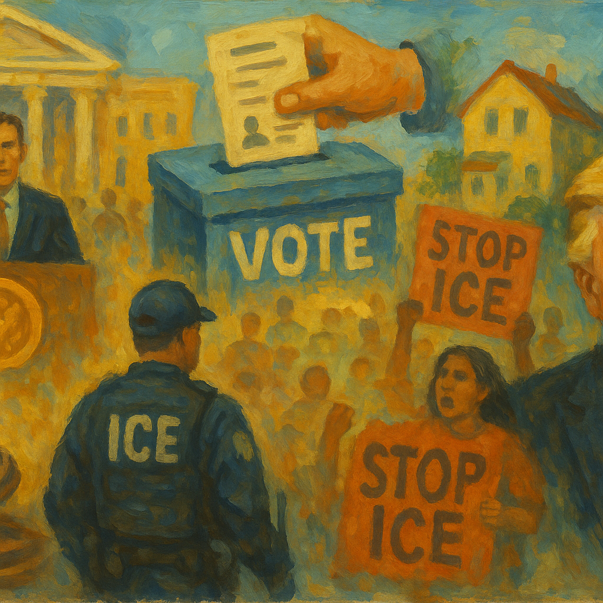

<!-- Generated by build_publish_week_v1 (appendix post) -->
<!-- Header image: image_wide_week75_appendix.png -->

# Week 75 Appendix: A Frozen Clock, A Dozen Fractures

*The Democracy Clock held still this week, but beneath that stillness a presidency tested courts, Congress, and truth itself at once.*

This week combined a striking immigration-law rollback, an extraordinary presidential hostage-taking of bipartisan legislation to force voting restrictions, a war-powers showdown that Trump won through intimidation, and an absurdist scandal (the Reflecting Pool) that nonetheless triggered arrests, National Guard deployment, and threatened decade-long prison sentences for touching peeling paint. SCOTUS delivered a trifecta of immigration rulings (TPS termination, asylum turn-backs, deportation discretion) stripping judicial review and expanding executive discretion over vulnerable populations, while also overturning Humphrey's Executor to let presidents fire independent agency heads at will. Simultaneously, courts blocked several administration voting-related overreaches (SAVE database, mail-ballot restrictions), and extraordinarily severe sentences (50-100 years) for anti-ICE protesters signaled criminalization of dissent. Trump's use of executive leverage—blocking housing legislation and FISA reauthorization to extract voting restrictions, and berating senators into reversing a war-powers vote—revealed the collapse of normal legislative-executive boundaries even as courts and some Republicans pushed back.

Power and Authority

1. Trump canceled a bipartisan housing bill signing to force passage of a voting-restriction bill (2026-06-24): The president withheld his signature from bipartisan housing legislation to pressure Congress into passing a bill requiring proof of citizenship and curbing mail voting, using executive leverage over unrelated policy to reshape election law.

2. Trump conditioned surveillance-law renewal on passage of a voting-restriction bill (2026-06-25): The president tied reauthorization of a key intelligence-gathering law to passage of the SAVE Act, using national-security tools as leverage over election legislation.

3. Trump confronted and pressured senators over their war-powers vote (2026-06-24): The president berated Republican senators, calling them disloyal, after they voted to limit his authority to continue military action against Iran, prompting a reversal of the Senate's position the next day.

4. William Pulte ordered mass firing of National Counterterrorism Center staff on his first day as acting DNI (2026-06-21): An unqualified political loyalist installed atop the intelligence community ordered roughly 300 firings within a day of taking office, raising concerns about degraded national-security capacity driven by personal loyalty.

5. Trump renewed calls to deploy National Guard troops in Chicago over a Democratic governor's objection (2026-06-22): Following a weekend of shootings, the president again pressed for military deployment in a Democratic-led city despite the governor's legal and political resistance, reviving a federalism dispute over domestic use of troops.

6. US Marshals Service deployed out-of-state law enforcement officers to a Washington monument site (2026-06-21) *[single source]*: Officers from multiple states were deputized and stationed at a national monument to make detainments over an unsubstantiated vandalism claim, raising questions about federalizing local policing functions.

7. US Park Police arrested a citizen for touching a peeling pool liner (2026-06-21): An elderly Olympic canoeist was detained for hours by park police and National Guard troops for touching a defective installation, an example of disproportionate state force applied to minor civilian conduct.

8. Mike Johnson pledged to shield the administration from congressional oversight if Republicans retain control (2026-06-26) *[single source]*: The Speaker of the House told a political audience he would use his committee chairs to block investigations into the president's family, cabinet, and donors, an explicit statement of intent to obstruct legislative accountability.

9. Trump labeled Democratic opponents as communists and animals at a campaign speech (2026-06-26): The president used dehumanizing language against political rivals ahead of midterm elections, escalating rhetoric that frames legitimate opposition as an existential and ideological threat.

Institutions and Governance

1. SCOTUS overturned Humphrey's Executor, granting presidents power to fire independent agency leaders at will (2026-06-24) *[single source]*: The Supreme Court eliminated a 90-year-old precedent protecting independent regulatory agencies from presidential removal power, concentrating executive control over bodies Congress designed to be insulated from political pressure.

2. Senate passed then blocked a war-powers resolution on Iran within days (2026-06-23): The Senate first passed a resolution limiting the president's authority to continue military action against Iran, then reversed course two days later after presidential pressure, showing fragile legislative independence.

3. House Freedom Caucus / Rep. Anna Paulina Luna obstructed House floor procedures to pressure Senate action on voting legislation (2026-06-25): A House member shut down floor business, halting all legislative activity, to force Senate consideration of a restrictive voting bill demanded by the president, illustrating legislative paralysis driven by executive priorities.

4. Judge Denise Casper permanently blocked Trump's executive order asserting federal control over voter citizenship verification (2026-06-24): A federal judge ruled that the Constitution grants the president no specific authority over elections, striking down a key provision of an executive order attempting to centralize control over voter rolls.

5. Judge Indira Talwani ruled unconstitutional an executive order restricting mail-in voting and directing postal delivery holds (2026-06-25): A federal judge invalidated provisions requiring the Postal Service to withhold mail ballots from states that refused to submit voter rolls, protecting mail-voting access from unilateral executive interference.

6. Judge Sparkle Sooknanan blocked use of a federal immigration database to purge state voter rolls (2026-06-23): A court barred the administration from using a repurposed immigration-verification system, with a documented 14 percent error rate, to screen and remove eligible voters from state rolls.

7. US Postal Service proposed rule requiring states to surrender voter mail-ballot data or lose ballot delivery (2026-06-24): The Postal Service proposed conditioning mail-ballot delivery on states handing over voter data, a measure Democratic senators warned would disenfranchise millions before courts later blocked its core provisions.

8. Chief Judge Patrick J. Schiltz quashed federal subpoenas against Minnesota officials as politically motivated (2026-06-23) *[single source]*: A federal court found that DOJ subpoenas targeting a governor and other officials were issued to coerce and harass state leaders over sanctuary policies, not for a legitimate investigatory purpose.

9. New York state legislature enacted law allowing retroactive civil suits against federal agents for constitutional violations (2026-06-20): New York included legislation in its state budget letting individuals sue federal agents for rights violations dating back to January 2025, creating a state-level accountability mechanism for federal enforcement conduct.

10. New York Civil Liberties Union and immigrant advocacy groups filed and pursued class action lawsuits over ICE racial profiling (2026-06-20) *[single source]*: Civil rights organizations sued over systematic racial profiling in immigration arrests, one part of a broader wave of litigation testing the legality of ICE enforcement tactics.

11. State of New York sued DOJ, DHS, and ICE over federal refusal to comply with state mask-ban and 287(g) restrictions (2026-06-22): New York challenged federal agencies' stated refusal to obey a state law barring masked enforcement and local cooperation agreements, testing the limits of federal preemption over state police power.

12. SCOTUS denied review and barred future filings from an incarcerated petitioner as abusive (2026-06-22): The Court restricted an indigent litigant's access to future filings absent fees, over a dissent objecting to the bar, narrowing avenues for court access in noncriminal matters.

13. James Comer issued subpoenas to a billionaire financier who refused to answer questions about Epstein-related NDAs (2026-06-26): A House committee chair compelled testimony and document production after a witness declined to discuss nondisclosure agreements connected to a major sex-trafficking case, testing congressional investigatory power.

14. Judge Emmet Sullivan ordered the administration to advance transparency measures in Epstein-files litigation (2026-06-25): A federal judge compelled the administration to defend redactions, produce records, and publish a required disclosure log, enforcing statutory transparency obligations against executive resistance.

15. Judge Christopher Cooper ordered the administration to explain a tarp obscuring the Kennedy Center after a court-mandated name change (2026-06-25) *[single source]*: A federal judge sought explanation for apparent obstruction of a court order requiring removal of the president's name from a cultural institution, testing compliance with judicial rulings.

16. Judge Sullivan (7th Circuit) and DC Circuit ordered DOJ to slow Wisconsin voter-roll actions and revived contempt proceedings against the administration (2026-06-23) *[single source]*: Appellate courts constrained federal voter-roll enforcement in Wisconsin and reopened contempt proceedings in a separate case, signaling judicial pushback against alleged noncompliance with prior orders.

17. Democracy Docket / federal courts issued a ninth consecutive ruling against DOJ efforts to obtain state voter files (2026-06-23): A federal judge in Maryland ruled against the Justice Department's attempt to compel state voter-file disclosure, part of a losing streak in 31 related cases that observers say blunts a national voter-database effort.

Economic Structure

1. Trump instructed DOJ to investigate oil companies for alleged price gouging (2026-06-25): The president directed federal law enforcement to probe a private industry over gas prices, an action civil-society observers characterized as politically motivated pressure on a sector he blamed for economic conditions.

2. National Park Service awarded a no-bid $1.7 million contract to a firm owned by a Trump donor (2026-06-21): A contract for reflecting-pool water purification went without competitive bidding to a company tied to a major presidential donor, raising conflict-of-interest concerns over public procurement.

3. Treasury Department (Scott Bessent) issued a 60-day general license waiving Iranian oil sanctions (2026-06-22): The administration unilaterally reversed sanctions policy toward Iran without congressional approval or verified compliance, restoring dollar-based oil transactions and access to billions in frozen assets.

4. Pentagon requested approximately $80 billion in supplemental war funding for the Iran conflict (2026-06-23): The Defense Department sought a massive supplemental appropriation after underestimating war costs, raising fiscal-transparency questions about an unauthorized military engagement.

5. Trump administration issued Medicaid work-requirement rules threatening coverage for millions (2026-06-22) *[single source]*: New rules require low-income Americans to prove 80 hours of monthly work or activity to keep Medicaid, with projections of 5–10 million losing coverage, disproportionately harming people with HIV who depend on continuous treatment.

6. US House proposed a $225 million cut to the Ryan White HIV/AIDS program (2026-06-22) *[single source]*: A proposed cut to a program serving roughly half of Americans with HIV would compound existing pressure on state drug-assistance programs already forcing patients onto waitlists.

7. NIH froze HIV research funding in South Africa (2026-06-22) *[single source]*: Researchers attributed the funding freeze in a country with the world's largest HIV epidemic to racial bias within the administration, cutting off support for research on marginalized populations.

8. Conservative Americans PAC / American Prosperity Alliance secretly funded ostensibly progressive super PACs to interfere in Democratic primaries (2026-06-21) *[single source]*: A Republican dark-money network funded PACs disguised as progressive groups, spending over $4.3 million to support weaker Democratic primary candidates across several states, obscuring the true source of political influence.

9. Tech-backed Super PACs (Leading the Future and others) spent over $24 million to sway a single congressional primary over AI regulation (2026-06-22) *[single source]*: Corporate-funded super PACs concentrated massive spending in one New York primary to defeat a candidate who sponsored AI safety legislation, illustrating how industry money can dominate a single race's outcome.

10. Congress prepared an $11 billion farmer bailout following tariff-driven market losses (2026-06-26) *[single source]*: Congress readied additional agricultural aid after tariff policy closed export markets, with lawmakers noting nearly 40 percent of prior bailout funds went to the largest farms while thousands of small farms closed.

11. California voters and legislature qualified a billionaire wealth-tax ballot measure for the November election (2026-06-25): A one-time 5 percent tax on billionaires' wealth qualified for the ballot after gathering double the required signatures, setting up a direct democratic contest over wealth concentration.

12. Silicon Valley billionaires filed counter-ballot measures to block the California wealth tax (2026-06-26): Tech billionaires spent tens of millions to place competing initiatives on the same ballot, using concentrated wealth to manipulate the direct-democracy process itself.

13. Trump commissioned a 250-foot triumphal arch and other construction projects exceeding $1 billion in taxpayer cost (2026-06-25): A New York Times analysis found 18 major construction projects undertaken during the president's second term, including the arch and other monuments, carry over $1 billion in potential public cost despite claims of private funding.

14. Interior Department transferred taxpayer funds to a Trump-branded national celebration (2026-06-25) *[single source]*: Public money was routed to the National Park Foundation to support a partisan-branded celebration, blurring the line between government resources and political events.

Civil Rights and Dissent

1. Federal judges (Mark Pittman, Reed O'Connor) sentenced nine anti-ICE protesters to 30–100 years in prison on terrorism charges (2026-06-24) *[single source]*: Protesters convicted after a 2025 demonstration at an ICE detention center received sentences far exceeding those given to January 6 defendants, in what advocates called a test of using terrorism law to punish dissent.

2. ICE conducted racially targeted street arrests documented in New York and New Jersey (2026-06-20) *[single source]*: An investigation of over 1,200 lawsuits found 93 percent of ICE street arrests targeted Latinos despite comprising only 66 percent of the undocumented population, indicating systematic racial profiling in enforcement.

3. Brenden Cuni (ICE supervisor) was named in multiple lawsuits alleging excessive force during arrests (2026-06-20) *[single source]*: A federal agent faced repeated allegations of beating and Tasering detainees while using racial slurs, part of a documented pattern of abuse during immigration enforcement operations.

4. Human Rights Watch documented unlawful killings and roughly 4,000 detentions during a Minnesota immigration operation (2026-06-20) *[single source]*: A report found two unlawful killings and mass detention of people mostly without criminal records during a federal immigration crackdown, calling for high-level accountability.

5. Judge Gary Brown condemned ICE practices as "abhorrent and illegal" on a widespread basis (2026-06-20): A Trump-appointed judge found that agents grossly abused their authority in a wrongful-arrest case, stating the practices extended well beyond the case before him.

6. Federal judge (Boston) barred most ICE arrests at New York City immigration courthouses (2026-06-20): A court order restrained categorical exclusion of observers and curbed arrest practices at immigration courts, affirming First Amendment access to ordinarily open hearings.

7. Minnesota prosecutors filed state felony charges against two federal immigration agents (2026-06-20): State prosecutors brought rare criminal charges against federal agents for alleged misconduct during immigration arrests, asserting state accountability over federal enforcement conduct.

8. Activists organized a citywide ICE tracking hotline and confronted enforcement operations (2026-06-20) *[single source]*: Community volunteers built rapid-response systems to monitor ICE activity and connect detainees with legal aid, while spontaneous street protests disrupted enforcement operations targeting vendors.

9. SCOTUS allowed termination of Temporary Protected Status for roughly 350,000 Haitians and thousands of Syrians (2026-06-25): A 6-3 ruling permitted the administration to strip legal status from long-resident immigrants despite documented discriminatory statements about their countries, ending judicial review of the decision.

10. SCOTUS upheld a policy allowing border officials to physically block asylum seekers from entering US soil (2026-06-25): The Court authorized a metering policy that denies asylum seekers the ability to apply for protection at the border, circumventing statutory asylum rights for vulnerable migrants.

11. SCOTUS granted border officials broad discretion to deport lawful permanent residents without clear evidence (2026-06-24): The ruling allows deportation of green-card holders suspected of crimes based on suspicion alone, removing the requirement for clear and convincing evidence before stripping legal status.

12. Federal judge (Salah Sarsour case) ordered ICE to release a detained religious leader targeted for pro-Palestinian speech (2026-06-20) *[single source]*: A judge found a lawful permanent resident was detained for 80 days based on protected speech, ruling that lawful residents retain the same constitutional protections as citizens.

13. DOJ charged 15 people with terrorism-adjacent offenses over Minnesota protest activity (2026-06-20): Federal prosecutors framed protest-linked defendants as an "antifa-tied" cell, raising concerns among civil rights advocates that political association is being treated as criminal evidence.

14. Christian Miles was arrested near a national monument for berating officers while documenting police activity (2026-06-23): A citizen was charged with a federal obscenity violation for verbally protesting a security crackdown, raising concerns about suppression of speech and documentation of government conduct.

15. ICE and CBP expanded surveillance technology spending to a record $513 million (2026-06-24) *[single source]*: Federal immigration agencies doubled AI-powered surveillance contracts within a year, deploying facial recognition, phone-hacking tools, and autonomous border towers with limited congressional oversight.

16. FBI attempted to recruit detained protesters as informants (2026-06-26) *[single source]*: At least half of about 90 people arrested for protesting an ICE detention center were contacted by agents seeking to turn them into informants, raising First Amendment concerns about retaliation for protest.

17. HHS prepared to deport over 500 unaccompanied migrant children using an unprecedented legal framework (2026-06-25): A senator alleged the agency lacked statutory authority for a plan to remove children from federal custody, bypassing legal representation and judicial oversight before a court deadline.

18. Justice Department (EOIR) failed to ensure legal representation for over half of children in deportation proceedings (2026-06-26) *[single source]*: More than 57 percent of over 750,000 children facing deportation hearings lacked legal counsel, a higher rate than for unrepresented adults, undermining due process for minors.

19. Anonymous caller filed a false child-protective-services report against a former cabinet official's family (2026-06-26): A fabricated abuse allegation triggered a 24-hour separation of a former transportation secretary from his children, an incident he called a politically motivated hoax targeting his family.

20. Trump administration directed CDC to impose funding priorities deprioritizing harm reduction and overdose prevention (2026-06-26): Health programs were told to align with new political priorities within five days or risk losing federal funding, sidelining evidence-based methods that public health experts warn will worsen the opioid crisis.

21. Trump administration selectively paused refugee admissions to favor white South Africans (2026-06-26): The administration halted nearly all refugee processing except for one racially defined group and stopped applications from people in 39 countries, largely in Africa and the Middle East.

22. Stephen Miller declared intent to end birthright citizenship (2026-06-26) *[single source]*: A senior White House official stated the country's future depends on ending constitutionally guaranteed birthright citizenship, an explicit goal to dismantle a Fourteenth Amendment protection.

23. SCOTUS blocked a Rastafarian prisoner from suing officials for forced head-shaving (2026-06-23): A 6-3 ruling found the relevant statute does not permit individual damages claims against state officials, leaving prisoners without federal monetary remedy for religious-rights violations.

24. Tom Emmer made public remarks calling for Somalis who "don't assimilate" to leave the country (2026-06-26) *[single source]*: A senior House Republican's ethnic denunciation, delivered at a political event, signaled mainstream normalization of exclusionary rhetoric within party leadership.

Information, Memory and Manipulation

1. Trump made repeated false claims of criminal vandalism at a national monument with escalating, unsubstantiated damage figures (2026-06-20): The president blamed political opponents for infrastructure failures caused by a botched renovation, fabricating details of sabotage that officials could not substantiate despite promised evidence.

2. Trump attacked the New York Times as "treasonous" and threatened a multi-billion-dollar lawsuit over critical coverage (2026-06-23): The president called reporters covering an unfavorable war assessment corrupt and criminal, explicitly objecting to press freedom while threatening massive litigation against a major news outlet.

3. Trump proposed renaming ICE to "NICE" explicitly to confuse press coverage (2026-06-21) *[single source]*: The president suggested a name change intended to hinder journalists' ability to report on the agency, an explicit attempt to manipulate the information environment surrounding immigration enforcement.

4. Harmeet Dhillon (DOJ) announced a civil rights investigation into a coffee shop for banning a pro-Israel congressman (2026-06-23): A DOJ official opened an inquiry into a private business's political speech and customer policy, raising concerns about federal power being used to chill criticism of a lawmaker.

5. White House attributed rent declines to immigration enforcement in a promotional release (2026-06-22): A White House fact sheet used charged framing and selective economic claims to credit falling rents to border policy, an example of official communications shaping public narrative without independent verification.

6. Interior Department attributed monument damage to "leftist activists" without evidence (2026-06-25): A federal spokesperson blamed unsubstantiated vandalism on a political movement to justify accelerated fencing and restricted public access to a national landmark.

7. ODNI withheld a completed report on voting-machine vulnerabilities ahead of midterm elections (2026-06-23): The intelligence community sat on findings identifying exploitable software weaknesses in the nation's voting machines, delaying public disclosure of critical election-security information.

8. JD Vance claimed victory on Iran nuclear inspections and Strait of Hormuz issues that remained unresolved (2026-06-21): The vice president publicly asserted diplomatic success on matters Iran later denied agreeing to, misleading the public about the actual status of sensitive negotiations.

9. Amazon and Goodreads restricted or disabled reviews of a vice-presidential memoir following negative feedback (2026-06-21) *[single source]*: Two major platforms limited public reader criticism of a political figure's book after a wave of negative reviews, raising concerns about suppression of visible public discourse.

10. Karoline Leavitt issued a press statement about an imminent bill signing that the president then canceled (2026-06-25): The White House Press Secretary publicly touted an impending signing hours before the president abruptly reversed course, contradicting official government communications.

11. Washington Post published an investigation into a former intelligence official's ties to a religious leader alleged to have directed her political positions (2026-06-21): The report documented parallels between instructions from a religious authority and the official's public political acts, raising questions about external influence over intelligence leadership decisions.

12. MAGA-aligned influencers spread a viral hoax claiming an FBI raid on an "Antifa chemical weapons lab" (2026-06-23) *[single source]*: Prominent online figures amplified a false story as factual, illustrating the ongoing spread of unverified disinformation through partisan media networks.

13. White House published a release celebrating the TPS ruling and listing 60 immigration enforcement actions (2026-06-26): Official communications framed a Supreme Court decision stripping legal status from hundreds of thousands of people as an unqualified victory for sovereignty, promoting an aggressive enforcement narrative.

14. Democracy Forward Foundation filed a FOIA lawsuit over the administration's denaturalization program (2026-06-26): A transparency organization sued to compel disclosure of internal records on a citizenship-revocation initiative after multiple federal agencies failed to respond to public-records requests.

15. Center for Biological Diversity sued USDA for failing to meet FOIA deadlines on a delegated wartime-authority order (2026-06-22): An environmental group challenged the agency's failure to disclose records about presidentially delegated emergency powers over agricultural chemicals, testing enforcement of statutory disclosure deadlines.

