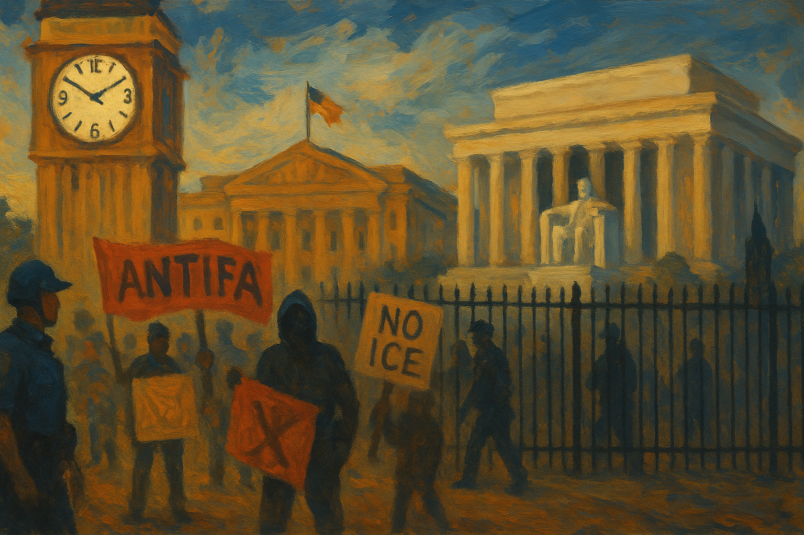

<!-- Generated by build_publish_week_v1 -->
<!-- Header image: image_wide_week75.png -->

# Week 75: A Frozen Clock, A Dozen Fractures

*The Democracy Clock held still this week, but beneath that stillness a presidency tested courts, Congress, and truth itself at once.*

Week 75 opens with the machinery of a second term running at full speed. But this week the story is not one rupture. It is about how many levers moved at once, and how little most of them had to do with one another on the surface. A courtroom in Washington rewrote the boundaries of presidential removal power. A Senate that had briefly found its spine surrendered it days later. A failed construction project became an excuse for arrests, fencing, and a donor's payday. None of these things needed each other to happen. That they happened together is what makes the week worth recording.

At the close of the prior period, the Democracy Clock stood at 7:41 p.m. It remains there now. The net movement for the week is zero minutes. The number conceals more than it reveals. Beneath a flat clock, the presence values of a dozen and a half traits moved sharply, some worsening by a fifth of a point or more. These losses were offset by an unusually persistent run of court decisions defending the mechanics of elections. The clock held still because damage and resistance arrived in the same seven days, at close to matching weight. That balance should not be mistaken for calm. It was a week of high motion inside a frozen frame.

The most significant event of the week came from the Supreme Court, not the White House. In Trump v. Slaughter, the Court overturned Humphrey's Executor, a precedent that had stood for ninety years. It had protected the heads of independent agencies from being fired at presidential whim, for reasons other than cause. That wall came down in a single ruling. Agencies built to work at arm's length from politics now answer, in practice, to the same loyalty tests as any cabinet office. The winners are obvious: a presidency that gains a lasting tool for reshaping the regulatory state without legislation. The losers are less visible but no less real. Every commissioner, every board member, every independent voice inside the bureaucracy now knows their job depends on staying in favor.

This ruling did not stand alone. In the same week, the Court ended Temporary Protected Status for roughly 350,000 Haitians and thousands of Syrians, and cleared the way for asylum seekers to be turned back at the border without their claims being heard. A third ruling gave border officials wide discretion to deport lawful permanent residents without clear evidence of wrongdoing. Together these rulings stripped away layers of due process that had constrained executive action on immigration for years. The administration wasted little time turning theory into practice. A senator's office relayed reports of an ultimatum forcing migrants to accept deportation or formalize permanent status under duress. A new policy paused refugee admissions for most nationalities while carving out an exception for white South Africans. The Court gave the executive branch room to move. The executive moved into it at once.

Enforcement on the ground showed a similar pattern beneath the surface. An investigation covering more than 1,200 lawsuits found that 93 percent of ICE arrests in New York and New Jersey targeted Latinos, a concentration that cannot be explained by chance. A named supervisor faced multiple allegations of excessive force and slurs during arrests, met by denial rather than review. At the same time, ICE and CBP surveillance spending surged to a record $513 million for the year, funding facial recognition, phone extraction tools, and autonomous monitoring towers. The tools of enforcement grew more powerful in the same week that evidence of their discriminatory use became harder to dismiss. Power gained ground here. Public trust did not.

Against this, courts and states pushed back, and the pushback was neither symbolic nor rare. It was sustained and specific. New York enacted a law letting individuals sue federal agents for constitutional violations. Minnesota prosecutors filed state felony charges against two immigration agents. A federal judge quashed DOJ subpoenas issued against Minnesota officials, ruling they amounted to political retaliation. Separately, three federal judges, Sooknanan, Casper, and Talwani, blocked distinct pieces of a coordinated federal effort to control voter rolls, impose proof-of-citizenship requirements, and restrict mail-in voting. The Sixth Circuit rejected a federal bid to seize Michigan's voter data outright. On elections specifically, the judiciary behaved as a working check rather than a rubber stamp, even as the Supreme Court moved the opposite way on immigration. The same institution can hold two different postures in a single week. This week, it did.

Dissent, meanwhile, was treated as something close to insurgency. Nine anti-ICE protesters received sentences ranging from thirty to one hundred years under terrorism statutes, for a demonstration held the previous year. These sentences exceeded those given to participants in the January 6 attack on the Capitol. A citizen who berated security personnel near a construction site was arrested on an obscenity charge. The Department of Justice opened a civil rights investigation into a Brooklyn coffee shop over a social media post critical of a political figure. The FBI reportedly tried to recruit detained protesters as informants. None of these actions alone rewrote law. Together, they narrowed the space in which criticism of power could be voiced without personal risk.

The week's strangest thread ran through a failed renovation of the Lincoln Memorial reflecting pool. The president made escalating, unsubstantiated claims that vandals had damaged the pool, a story that grew across nearly a week of public statements. Park Police and National Guard units arrested citizens for minor contact with the defective liner, including a 67-year-old Olympic canoeist held incommunicado for five hours. A US Attorney publicly promised aggressive prosecution of anyone who touched the installation. Fencing went up around the site. A National Park Service official later filed a court declaration supporting the vandalism claim, despite no independent verification. Then came the contract: a no-bid award worth $1.7 million for repairs, given to a firm owned by a Trump donor. An ordinary citizen faced arrest and threats of prison for touching a peeling liner. A donor received a contract without competition. The distance between those two outcomes says more about the week than any single ruling could.

This is not a new pattern in the term, but it deepened this week in an unusually operational way. Falsehood did not simply circulate as talk. It was written into a court filing, used to justify troop deployment, and turned into arrests. The gap between what was said and what was true stopped being a matter of dispute. It became a tool of enforcement.

Congress, for its part, offered a case study in institutional fragility. The president canceled the signing of a bipartisan housing bill, legislation with real, immediate benefit for ordinary Americans, to force passage of the SAVE Act, an unrelated voter-restriction measure. He conditioned FISA reauthorization on the same demand. The House ground to a halt when one member's procedural obstruction froze floor operations in support of the standoff. The bill eventually became law regardless of the president's signature, a small mark of resilience amid the pressure.

Far more troubling was what happened to the Senate's assertion of war-powers authority. Early in the week, a bipartisan majority passed a resolution requiring congressional approval to continue hostilities with Iran, a genuine, rare check on unilateral military action. The president responded by berating the senators responsible, applying direct pressure at a Capitol meeting. Within days, the same chamber reversed itself and rejected a second, binding version of the resolution. An institution had asserted a constitutional prerogative and then abandoned it under personal pressure, in the same week. The Speaker of the House, for his part, pledged to shield the administration from oversight investigations if his party kept its majority. It was an open statement of intent to disable the legislature's watchdog function before any wrongdoing is even alleged.

Beneath these headline confrontations, intelligence and military leadership saw its own reshaping. An unqualified loyalist was installed as acting Director of National Intelligence over the objection of members from both parties, and moved quickly to order the mass firing of roughly three hundred counterterrorism staff. Around the same time, a respected four-star general overseeing US forces in Europe and Africa was dismissed, apparently for insufficient loyalty rather than any failure of performance. Expertise and independence were swapped for demonstrated allegiance in two of the government's most sensitive institutions within days of each other.

Information itself came under sustained pressure. The president called the New York Times "treasonous" over its Iran war coverage and threatened to fold that reporting into an existing multi-billion-dollar lawsuit. A federal civil rights investigation targeted a private business owner over a social media post. A completed report on vulnerabilities in the nation's voting machines was reportedly withheld ahead of the midterms. Claims about a nuclear inspection agreement with Iran, made publicly by the vice president, were directly contradicted by Iranian officials within days. A diplomatic framework looked fragile even as it was being announced. None of these incidents alone reshaped the public's grasp of events. Together, they narrowed the space in which accurate information could reach citizens without cost to those who supplied it.

Economic power moved in familiar directions, though with less drama than the week's political fights. A no-bid contract to a political donor sat alongside more than a billion dollars in new construction projects, including a triumphal arch, funded in part through diverted public money. Tech-aligned political action committees spent more than $24 million on a single congressional primary centered on artificial intelligence regulation, a scale of spending that dwarfs the resources available to any individual voter or civic group. California's certification of a billionaire wealth-tax ballot measure, and a counter-effort by Silicon Valley billionaires to place competing initiatives blocking it, showed both the reach of concentrated wealth and its limits. Even well-funded opposition could not keep the measure off the ballot.

Not every current this week ran downward. The war-powers resolution's initial passage, however short-lived, showed that bipartisan majorities in Congress can still act against presidential preference when sufficiently provoked. The string of election-related court rulings was unusually comprehensive, touching voter rolls, citizenship verification, and mail balloting in a single week, and it held even as the same judicial system deferred to the executive on immigration. State prosecutors in Minnesota, legislators in New York, and courts in multiple circuits found room to check federal overreach without waiting for national consensus. These were not decisive victories. They were evidence that the machinery for resistance had not yet been fully taken apart.

Congressional oversight is already set to test some of this week's claims directly. The House Oversight Committee has issued subpoenas to Leon Black over his refusal to answer questions tied to Jeffrey Epstein-related non-disclosure agreements, a proceeding that will continue into future weeks. A federal judge has also ordered the administration to report back on its compliance with disclosure obligations in Epstein-related litigation, a deadline that will test whether this week's judicial resistance carries forward or fades.

Read end to end, Week 75 does not describe one dramatic seizure of power. It describes something closer to routine: an executive branch testing its reach across courts, agencies, and legislators at once, absorbing setbacks in some arenas while consolidating gains in others. The Senate's capitulation on war powers, arriving so soon after its own assertion of authority, suggests that resistance inside Congress remains real but brittle. It can appear and vanish within the same week under enough pressure. The judiciary's performance on elections, by contrast, suggests some checks still hold their ground even under comparable strain. Whether that holds is not yet settled. It is simply, for now, still contested.

<!-- Synopses for cross-posting -->
Long Synopsis: Week 75 held the Democracy Clock steady at 7:41 p.m., but the flat number concealed intense motion. The Supreme Court overturned Humphrey's Executor, ending ninety years of protection for independent agency leaders, while separately stripping due-process protections from immigrants. Enforcement data showed racially skewed ICE arrests alongside record surveillance spending. Congress folded under pressure: the Senate reversed a war-powers vote days after passing it, and the president held a housing bill hostage to force a voter-restriction measure. A fabricated vandalism story at the Lincoln Memorial reflecting pool led to arrests, fencing, and a no-bid contract for a donor. Yet courts blocked multiple federal attempts to control voter rolls and mail balloting, and states pushed back with lawsuits and prosecutions. Damage and resistance arrived in near-equal measure, leaving the clock unmoved but the system visibly strained.
Short Synopsis: The clock stayed at 7:41 p.m. as the Supreme Court expanded executive power over agencies and immigration, Congress capitulated on war powers, and a fabricated vandalism story justified arrests and donor favoritism—while courts held firm on election protections.

