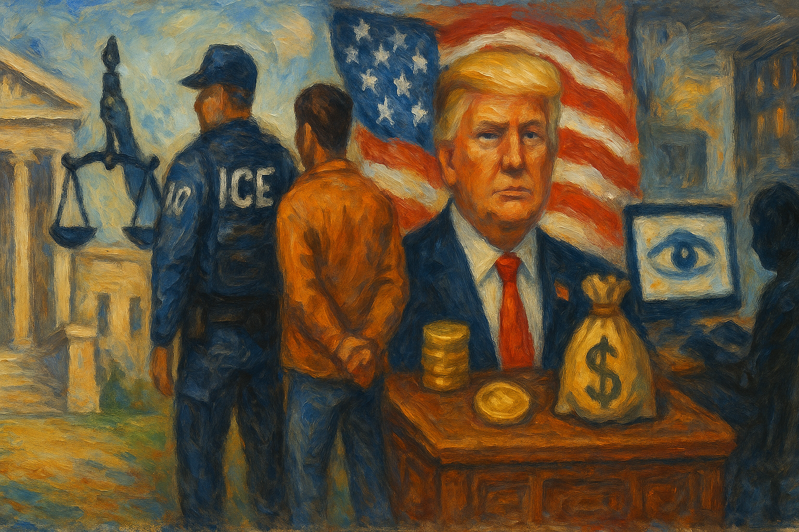

<!-- Generated by build_publish_week_v1 (appendix post) -->
<!-- Header image: image_wide_week76_appendix.png -->

# Week 76 Appendix: The Week the Wall Came Down

*A single Supreme Court sitting handed the presidency lasting new power while resistance held just enough ground to keep the ledger nearly even.*

This week was dominated by a single Supreme Court sitting that reshaped the structural balance of American governance more than any other event of the period. The Court simultaneously expanded presidential removal power over independent agencies (overturning 90-year-old Humphrey's Executor precedent), stripped TPS protections from hundreds of thousands of immigrants, upheld state bans on transgender athletes, gutted campaign finance limits, and narrowly preserved birthright citizenship by a fragile 5-4/6-3 margin that four justices signaled willingness to revisit. Alongside these rulings, reporting revealed a secretive White House-run 'National Design Studio' operating federal websites (passports, voter registration, Login.gov clones) with undisclosed tracking software outside statutory privacy and transparency requirements. Trump's $2.2 billion in disclosed 2025 earnings, family crypto ventures, park-fund diversions to personal projects, and reported pay-to-play pardon schemes point to accelerating self-enrichment. Iran strikes, ICE arrest surges, and a Speaker's threat about a 'protection program' against Democratic oversight further illustrate a week of consolidation, corruption exposure, and institutional erosion, partially offset by lower-court pushback and a competitive primary cycle.

Power and Authority

1. Trump unveiled a commemorative passport bearing his own portrait and signature (2026-06-27) *[single source]*: The White House placed the sitting president's image on an official travel document, raising concerns about blending personal branding with state identity.

2. Trump ordered a reduction of trees in Lafayette Square to match his presidency number (2026-06-28) *[single source]*: The president directed alteration of a historic public park to reflect his personal identity, illustrating use of executive authority over public spaces for self-glorification.

3. Mike Johnson warned that Democratic control of Congress would trigger investigations of the president's family, Cabinet, and donors, and promised a personal 'protection program' (2026-06-27) *[single source]*: The Speaker's remarks suggested anticipation of legal exposure and an attempt to consolidate loyalty through promises of shielding allies from accountability.

4. Trump administration conducted military strikes on Iran and Trump threatened to militarily eliminate the country (2026-06-27): Escalating unilateral military action and rhetoric toward Iran raised risks of uncontrolled conflict with limited congressional consultation.

5. Trump administration dismantled USAID and consolidated disaster assistance under the State Department (2026-06-28) *[single source]*: Gutting the foreign aid agency and cutting thousands of jobs reduced institutional capacity to respond to humanitarian crises and weakened oversight of foreign assistance.

6. Trump administration redirected $60 million in federal education funds toward 'civil discourse' initiatives explicitly tied to campus activism and a political assassination (2026-06-28) *[single source]*: Reallocating funds meant for underserved students toward messaging that frames student protest as dangerous signals use of federal money to discourage dissent on campuses.

7. Trump invoked emergency powers to restart a previously shuttered California oil pipeline over state objections (2026-06-29) *[single source]*: Unilateral use of emergency authority to override state environmental protections expanded presidential reach into energy and environmental regulation.

8. Trump administration (Commerce Department) ordered NOAA to evaluate the California Coastal Commission amid a dispute over energy production (2026-06-29) *[single source]*: Federal targeting of a state regulatory agency's authority signaled potential override of state environmental decision-making by executive fiat.

9. Trump posted celebrating the Supreme Court's ruling expanding presidential removal power as 'greatly increasing Presidential Power' (2026-06-29): The president publicly framed a court decision as a personal expansion of unchecked authority over federal agencies.

10. Trump declined to commit to signing a bipartisan housing bill unless Congress passed a voter ID law he favored (2026-06-29): Conditioning approval of popular bipartisan legislation on partisan electoral measures used presidential leverage to extract advantage over the legislative process.

11. Trump toured East Potomac Golf Links with the Interior Secretary to plan a luxury golf course renovation on public land (2026-06-29) *[single source]*: Use of a cabinet secretary's time and public parkland resources for a private golf project raised questions about blending public office with personal business interests.

12. HHS reorganized its civil rights office to elevate religious freedom and conscience protections above other enforcement priorities (2026-06-30) *[single source]*: The restructuring could enable healthcare providers to refuse services on religious grounds, potentially reducing access to reproductive, LGBTQ, and vaccine-related care.

13. Lauren Boebert called for the State Department to stop issuing visas to pregnant applicants (2026-06-30) *[single source]*: A member of Congress proposed restricting entry based on reproductive status in response to a Supreme Court citizenship ruling.

14. Trump threatened to prosecute gasoline retailers unless they lowered prices to about $2.50 per gallon (2026-06-30): A presidential threat to use prosecutorial power against private businesses over pricing decisions blurred lines between market conditions and criminal enforcement.

15. Trump discussed a mass presidential pardon initiative branded '250 pardons for 250 years' as a centerpiece of July 4th celebrations (2026-06-30) *[single source]*: Turning the constitutional pardon power into a symbolic anniversary spectacle raised concerns about politicized and potentially transactional use of clemency.

16. Trump accepted a $400 million aircraft gift from Qatar without congressional consent (2026-07-01): Accepting a foreign government gift without legislative approval tested constitutional limits on presidential emoluments and executive independence from Congress.

17. Florida Board of Education voted to bar undocumented students from all 28 state-funded colleges and universities (2026-07-01) *[single source]*: An unelected board created new restrictive policy affecting immigrant students, raising questions about whether it exceeded its rule-making authority reserved for the legislature.

18. Trump posted criticism of NATO allies claiming defense spending imbalance was 'not reciprocal' (2026-07-03): Public criticism of NATO partners by the sitting president risked straining alliance cohesion and diplomatic relationships with democratic partners.

Institutions and Governance

1. Judge Anne Hwang declared a mistrial in the federal arson case connected to the 2025 Palisades fire after a deadlocked jury (2026-06-27) *[single source]*: A hung jury in a high-profile federal prosecution tests public confidence in the courts' capacity to resolve serious criminal charges.

2. Alaska Supreme Court ordered reinstatement of a same-named primary challenger to Senator Dan Sullivan's ballot line (2026-06-28): The ruling reinstated a candidate to the state primary ballot, affecting how names are presented to voters in a competitive Senate race.

3. North Carolina General Assembly overrode gubernatorial vetoes on four bills, including two measures eliminating DEI in public education (2026-06-28) *[single source]*: The legislature asserted power over the governor to restrict diversity, equity, and inclusion programs in public schools and universities statewide.

4. SCOTUS stripped Temporary Protected Status from roughly 350,000 Haitian and thousands of Syrian nationals (2026-06-27): The ruling exposes hundreds of thousands of people to deportation, undermining humanitarian protections and rule-of-law norms around due process.

5. SCOTUS blocked Trump's removal of Federal Reserve Governor Lisa Cook, ruling he failed to provide required procedural protections (2026-06-28): The narrow ruling preserved an independent agency official's tenure and constrained executive removal power over the Federal Reserve, at least on procedural grounds.

6. SCOTUS overruled Humphrey's Executor and ruled the president may remove independent agency heads without cause (2026-06-29): The decision eliminated a 90-year-old precedent shielding independent agencies from partisan removal, fundamentally shifting power toward the executive branch and away from Congress's design.

7. SCOTUS declined to hear Trump's appeal of the E. Jean Carroll defamation verdict (2026-06-29): Leaving the $5 million jury verdict intact affirms that a sitting president cannot use the courts to escape accountability for personal misconduct.

8. SCOTUS declined to hear Dershowitz's appeal of his defamation loss against CNN (2026-06-29): Two justices' dissent signaled openness to weakening the actual-malice press-freedom standard central to reporting on public figures.

9. SCOTUS ruled geofence location-data warrants require Fourth Amendment privacy protections (2026-06-29) *[single source]*: The decision expanded constitutional privacy protections in the digital age, constraining law enforcement's ability to conduct dragnet location searches.

10. SCOTUS rejected the RNC's challenge and upheld state laws counting mail ballots postmarked by Election Day (2026-06-29): The ruling protected voting access for hundreds of thousands relying on mail ballots against a partisan effort to narrow the counting window.

11. SCOTUS declined to hear an appeal from an attorney fined $400,000 for warning a school about an abusive priest (2026-07-01) *[single source]*: Leaving the sanction in place chills whistleblowing and victim advocacy involving child safety within the judicial system.

12. SCOTUS struck down Trump's executive order attempting to end birthright citizenship, in a narrow 5-4/6-3 ruling (2026-06-30): The Court preserved a foundational constitutional guarantee against executive redefinition, though the narrow margin and Kavanaugh's conditional concurrence leave the right vulnerable to future challenge.

13. SCOTUS upheld state bans on transgender athletes in female school sports (2026-06-30): The ruling narrows Title IX protections for a vulnerable minority group and is expected to embolden similar bans in at least 25 other states.

14. SCOTUS struck down limits on coordinated political party campaign spending (2026-06-30): Removing this restriction eliminates a major campaign-finance safeguard and increases the influence of party financial advantage over federal elections.

15. House committee delayed a vote on the bipartisan Ratepayer Protection Act addressing datacenter-driven electricity costs (2026-07-01) *[single source]*: The delay slowed legislation intended to shield consumers from rising electricity costs tied to datacenter expansion, favoring industry interests in the interim.

16. Judge Emmet Sullivan blocked a USPS plan to withhold mail-ballot delivery from states that refused to share voter rolls with the federal government (2026-07-01): The ruling protected mail-voting access nationwide and marked the second judicial setback for Trump-era efforts to restrict mail-in voting.

17. US Court of Appeals for the First Circuit ruled the Trump administration need not reinstate removed climate, immigration, and slavery materials in national parks (2026-07-02) *[single source]*: The ruling permits permanent removal of historical content about slavery, climate change, and immigration from public monuments, enabling state-directed sanitization of history.

18. New Orleans grand jury indicted Louisiana Attorney General Liz Murrill on 16 counts of intimidation and malfeasance (2026-07-03): The indictment arose from a political conflict between state Republicans and New Orleans Democrats, later halted by the state supreme court over grand-jury procedural defects.

19. Louisiana Supreme Court granted a stay in the criminal indictment against Attorney General Liz Murrill, citing grand jury procedural defects (2026-07-03): The court found the trial judge violated state law requiring open-court grand jury returns, raising questions about prosecutorial impartiality in a politically charged case.

20. Bill Cassidy publicly accused Trump of treating Congress as 'merely an appendage' over an Iran war briefing dispute (2026-06-29): A Republican senator's public challenge to presidential treatment of Congress signals potential fracture in party unity over separation of powers in military decision-making.

21. House Speaker Mike Johnson was forced to adjourn the House without passing the National Defense Authorization Act after a member blocked the rule over an unrelated voter-ID demand (2026-06-30): Legislative obstruction delayed critical military funding legislation, illustrating dysfunction in Congress's core appropriations functions.

22. House Democratic natural resources subcommittee released a report alleging the Trump administration hijacked the nation's 250th anniversary celebration for corruption and partisan gain (2026-07-02) *[single source]*: The congressional investigation documents alleged wire fraud, pay-to-play schemes, and misuse of federal institutions for personal and ideological purposes, exercising oversight power.

23. Jamie Raskin and legal experts predicted expanded congressional investigations into administration corruption if Democrats win the House majority in the midterms (2026-07-03) *[single source]*: Legal experts and Democratic leaders described plans for oversight into alleged corruption, weaponization of DOJ, and pardon abuses, signaling continued institutional check capacity.

24. 5th Circuit Court of Appeals ruled the government cannot detain immigrants longer than 90 days without a bond hearing (2026-07-03) *[single source]*: The ruling establishes a due-process protection limiting indefinite immigrant detention without judicial review, potentially affecting thousands in three states.

25. Department of Justice refused to comply with a federal judge's order to produce Epstein files documents (2026-07-02): Defiance of a court order for document production raises questions about executive-branch respect for judicial authority and transparency obligations.

Economic Structure

1. Karen Bass announced plans for an executive order mobilizing cleanup resources after a warehouse fire destroyed 40 million pounds of frozen food (2026-06-27): Local government mobilized resources for disaster recovery affecting residents' health and environment following a major industrial fire.

2. New York City board voted to freeze rents for nearly 1 million apartments (2026-06-28): A major municipal rent freeze implements a signature affordability policy affecting a large share of the city's housing stock.

3. Trump administration diverted funding from over 900 National Park Service projects to White House and Washington D.C. personal projects (2026-06-28): Redirecting congressionally appropriated safety and maintenance funds to executive vanity projects endangered public safety and misused public resources.

4. Department of Transportation withdrew a nearly $427 million grant for a California offshore wind project (2026-06-29): Federal withdrawal of renewable energy funding reversed climate policy and intensified federal-state conflict over energy direction.

5. Trump proposed a $10 billion Washington beautification project alongside a 31 percent cut to National Park Service staff (2026-06-28): The budget proposal favored capital-city adornment over park maintenance and safety, disproportionately allocating scarce resources.

6. New York State ended health coverage for nearly 450,000 residents on the Essential Plan due to federal Medicaid cuts and expiring subsidies (2026-07-01) *[single source]*: Federal budget cuts caused a major loss of health insurance for moderate-income residents, foreshadowing broader coverage losses nationwide.

7. CMS launched a temporary Medicare pilot program discounting GLP-1 weight-loss drugs to $50 per month for eligible seniors (2026-07-01) *[single source]*: The federal program expands drug access for seniors but raises sustainability concerns given its temporary nature and administrative capacity limits.

8. Kevin Warsh signaled the Federal Reserve would hold interest rates steady despite inflation above 4 percent and Trump's push for cuts (2026-07-01): The Fed chair's public stance constrained executive economic ambitions and preserved independent monetary policy authority.

9. Trump administration directed over $8.9 billion in federal funding to companies with ties to the Trump and Lutnick families (2026-07-01): Reporting identified at least fourteen family-connected companies benefiting from taxpayer-funded mining deals, raising self-enrichment concerns.

10. Trump earned approximately $2.3 billion from cryptocurrency ventures while investors in the same ventures lost a comparable amount (2026-07-01): The pattern demonstrates a direct transfer of wealth from retail investors to the president's family through crypto schemes.

11. Senate banking committee voted down, along party lines, an amendment barring the president and Congress from owning or promoting crypto businesses (2026-07-02) *[single source]*: Rejecting conflict-of-interest safeguards for officials' crypto holdings demonstrates partisan resistance to institutional checks on self-enrichment.

12. Adam Schiff led a congressional inquiry into Binance over alleged Iran sanctions evasion tied to World Liberty Financial (2026-07-02) *[single source]*: The inquiry addresses potential sanctions violations connected to Trump family crypto ventures, raising national security enforcement concerns.

13. Trump disclosed $2.2 billion in 2025 income, including $1.4 billion from cryptocurrency ventures (2026-07-02): The financial disclosure reveals unprecedented personal enrichment while serving as president, prompting Democratic calls for tighter congressional rules.

14. Trump took out an undisclosed $50 million loan without stated purpose, collateral, or repayment terms (2026-07-01): The lack of transparency around a major presidential loan prevents public assessment of potential conflicts of interest.

15. Trump purchased stocks the day before announcing a tariff pause that caused a historic market rally (2026-07-01): Trading based on advance knowledge of his own policy announcement raises insider-trading concerns and conflicts between personal wealth and public office.

16. Trump held substantial stock positions in NVIDIA and Amazon while setting policy affecting those companies (2026-07-01) *[single source]*: Maintaining major equity stakes in companies subject to his administration's regulatory decisions creates ongoing conflicts of interest.

17. Trump Jr. and Eric Trump became linked to investments in at least 10 military-contractor companies that received $3.7 billion in federal funds (2026-07-02) *[single source]*: Family members without official government roles profited from defense contracts, raising pay-to-play concerns in federal procurement.

18. Trump administration used $68 million in taxpayer funds through an allied contractor to produce the July 4 celebration (2026-07-03) *[single source]*: Substantial public funds routed to a company with direct administration ties raise concerns about lack of competitive bidding and potential graft.

19. Iran surged oil exports by over 40 million barrels following the ceasefire agreement (2026-06-28): A rapid increase in oil exports shifted global energy markets and reflected Iran's economic response to the ceasefire.

20. Dr. Oz dismissed the significance of 5 million Americans losing health insurance after ACA subsidies were terminated (2026-06-29) *[single source]*: A senior health official minimized mass loss of insurance coverage, reflecting administration reluctance to address the policy's human impact.

21. Scott Bessent claimed the economy 'powered through' the Iran conflict while signaling government monitoring of gas retailer pricing (2026-06-30) *[single source]*: Official economic messaging downplaying strain amid rising costs was contradicted by congressional criticism of cost-of-living pressures.

22. Washington Post revealed a $500 million no-bid contract for Trump's White House ballroom (2026-06-30): A no-bid government contract bypasses competitive procurement safeguards, raising concerns about favoritism and self-enrichment.

Civil Rights and Dissent

1. Senatobia police department deployed teargas and repeatedly obstructed a protest march demanding justice for a one-year-old killed by police (2026-06-27) *[single source]*: Police use of force against protesters and systematic obstruction of their march route undermines First Amendment rights to assemble and petition for redress.

2. 50501, Women's March, and allied organizers organized a national day of action challenging the official narrative of the country's 250th anniversary (2026-06-27) *[single source]*: Large-scale coordinated protest asserted a counter-historical memory of struggle and inclusion against a sanitized founding narrative.

3. Next250 coalition held a Declaration of Interdependence rally in Washington DC with over 1,000 attendees (2026-06-27) *[single source]*: Grassroots mobilization asserted democratic values, including voting rights and reproductive freedoms, at a moment organizers say basic rights are under attack.

4. Unidos MN launched democracy defense trainings ahead of the midterm elections in response to federal immigration enforcement and election-interference concerns (2026-06-28) *[single source]*: Community organizing to prepare citizens for voter protection and election monitoring reflects deep institutional distrust and grassroots preparation for federal overreach.

5. North Carolina Senate passed a bill effectively criminalizing homelessness and homeless service providers (2026-06-28) *[single source]*: Converting homelessness into a criminal offense restricts civil society's capacity to aid unhoused people and limits their right to exist in public space.

6. North Carolina General Assembly mandated local sheriff cooperation with ICE and required State Highway Patrol training as ICE agents (2026-06-28) *[single source]*: Blurring local policing with federal immigration enforcement expands surveillance reach and reduces trust among immigrant communities.

7. Chris Murphy criticized Trump's proposed national voter ID list as a form of election rigging (2026-06-28) *[single source]*: A senator's public criticism articulated concerns that a national voter ID requirement could manipulate electoral outcomes and undermine voting access.

8. Roger Marshall defended voter ID requirements without providing evidence of fraud they would have prevented (2026-06-28) *[single source]*: A senator's unsubstantiated justification for voting restrictions illustrates use of unproven claims to advance measures that narrow ballot access.

9. North Carolina Senate advanced a bill cutting the early voting period from 17 days to 10 days (2026-06-28) *[single source]*: Shortening the early voting window restricts access for working, elderly, and mobility-limited voters, narrowing the effective franchise.

10. Markwayne Mullin defended deportations to Haiti despite a State Department 'do not travel' advisory, and Gov. Mike DeWine publicly opposed the policy (2026-06-28) *[single source]*: Administration officials pressed forward with deportations to a country deemed unsafe for U.S. citizens, prompting bipartisan pushback over humanitarian risk.

11. RFK Jr. ordered the CDC to remove its flu vaccine promotion campaign during an active season with significant child mortality (2026-06-28): Removing public health messaging during a deadly flu season prioritizes ideology over disease prevention and undermines institutional public-health guidance.

12. Zohran Mamdani and Katie Wilson took office as Democratic socialist mayors of New York City and Seattle, implementing rent freeze and affordability policies (2026-06-28): The elections and early governance of these mayors signal a significant ideological shift in urban Democratic politics on housing and worker protections.

13. Stephen Miller dismissed healthcare workforce concerns from Ohio's governor by disparaging Haitian immigrant nurses (2026-06-30) *[single source]*: Dismissive rhetoric toward immigrant healthcare workers minimized legitimate public health workforce concerns tied to mass deportation policy.

14. Todd Blanche directed DOJ prosecutors to target 'birth tourism' with fraud charges one day after the Supreme Court upheld birthright citizenship (2026-07-02): Using fraud prosecutions to circumvent a Supreme Court ruling on citizenship threatens to narrow a constitutionally protected right through selective enforcement.

15. ICE arrested approximately 10,000 people over five days, roughly doubling the prior daily arrest rate under White House pressure (2026-07-01): A dramatic surge in immigration arrests following White House pressure signals escalating mass detention as policy, affecting families and communities nationwide.

16. ICE arrested a record 43,138 immigrants in June, the highest monthly total since Trump took office (2026-06-30) *[single source]*: Record-scale enforcement targeting non-citizens, including many without criminal records, represents a major expansion of detention and deportation capacity.

17. Major Jason Watson stood on the Capitol steps in uniform calling for impeachment of Trump and Vance, prompting an Air Force investigation and gag order (2026-07-01) *[single source]*: An active-duty officer's uniformed political protest and the subsequent military investigation and gag order test the boundaries of free speech and dissent within the armed forces.

18. David Mytych filed suit challenging the National Park Service's denial of a permit for a counter-demonstration near the July 4 event (2026-07-01): The lawsuit challenges alleged viewpoint discrimination in restricting protest access near a major presidential event, testing First Amendment assembly rights.

19. Atlanta city government disposed of unhoused people's belongings at a public park without warning, contradicting established protective procedures (2026-07-01) *[single source]*: Discarding tents, medication, and identification without notice undermines protections for vulnerable populations established after a prior death.

20. Zohran Mamdani delivered an Independence Day speech countering administration messaging by defending asylum seekers and framing dissent as patriotic (2026-07-03) *[single source]*: A high-profile Democratic official articulated an alternative vision of national identity centered on inclusion, directly opposing official 250th-anniversary messaging.

Information, Memory and Manipulation

1. National Design Studio built and operated federal websites for passports, voter registration, prescription pricing, and children's savings accounts outside statutory agency control (2026-06-28) *[single source]*: A White House office staffed by DOGE veterans took over sensitive federal data infrastructure without required privacy filings, undermining institutional accountability.

2. National Design Studio installed undisclosed visitor-tracking software on federal websites without required privacy impact assessments (2026-06-28) *[single source]*: Undisclosed tracking on sites handling sensitive personal data centralizes citizen data collection in White House-controlled infrastructure outside legal oversight.

3. National Design Studio concealed spending and contracts from federal databases with no inspector general oversight (2026-06-28) *[single source]*: The absence of financial disclosure prevents Congress and the public from auditing taxpayer spending, contracts, and staffing at this White House office.

4. Fox News broadcast false claims about crowd size at a government-adjacent fair and later issued an on-air apology for unfounded claims about Chinese funding of project opponents (2026-06-27) *[single source]*: Coordinated misinformation and a subsequent retraction illustrate media amplification of unsubstantiated claims affecting public discourse.

5. Mississippi Department of Public Safety withheld body-camera and security footage from the police shooting of a one-year-old (2026-06-27) *[single source]*: Withholding video evidence of a child's killing by police obstructs accountability and denies the family and community facts necessary for justice.

6. Trump attacked journalists Maggie Haberman and Jonathan Swan over their book about his second term (2026-06-28): Public attacks on journalists and their reporting work to delegitimize independent press scrutiny of the administration.

7. Bill Pulte posted an unsubstantiated claim that Federal Reserve Governor Lisa Cook would be indicted for mortgage fraud (2026-06-29): A senior intelligence official's unsupported criminal prediction about a federal official blurs the line between intelligence authority and partisan attack.

8. Sean Davis published proposals including nullification, court-packing, forced sterilization of foreign visitors, and dissolution of the Union in response to the birthright citizenship ruling (2026-06-30): A prominent conservative editor's extreme proposals advocate authoritarian and potentially secessionist measures in reaction to a constitutional ruling.

9. Stephen Miller made inflammatory statements framing birthright citizenship as enabling immigrants' children to 'seize' citizens' inheritance and characterizing Democratic governance as electing communists (2026-06-30): Rhetoric designed to inflame public opinion against a constitutional ruling and delegitimize the opposition undermines informed democratic discourse.

10. NPR prematurely reported and then retracted a story claiming Justice Alito had retired (2026-06-30): A false report about a Supreme Court justice's retirement, even briefly published, spreads misinformation and raises questions about editorial verification.

11. White House officials deleted aerial images showing sparse crowds at Trump's National Mall speech (2026-07-02): Deletion of official documentation to conceal unfavorable crowd-size data represents suppression of factual information and manipulation of the public record.

12. Judge Leon Roche sealed his courtroom during a grand jury indictment return in violation of state open-court law, after which journalists were handcuffed for protesting the closure (2026-07-03): Sealing a courtroom against legal requirements and detaining journalists for seeking transparency undermines press freedom and public access to judicial proceedings.

13. Institute of Museum and Library Services funded 'Freedom Trucks' presenting an ideologically curated, sanitized version of American history omitting slavery and civil rights (2026-07-03) *[single source]*: Federal funds financed a selective historical narrative for the 250th anniversary that omits major struggles central to the nation's democratic development.

14. Trump participated in a prerecorded interview with Usha Vance featuring rambling commentary on past presidents (2026-07-03): The curated release of an unusual presidential interview raises questions about media management and the framing of the president's public appearances.

