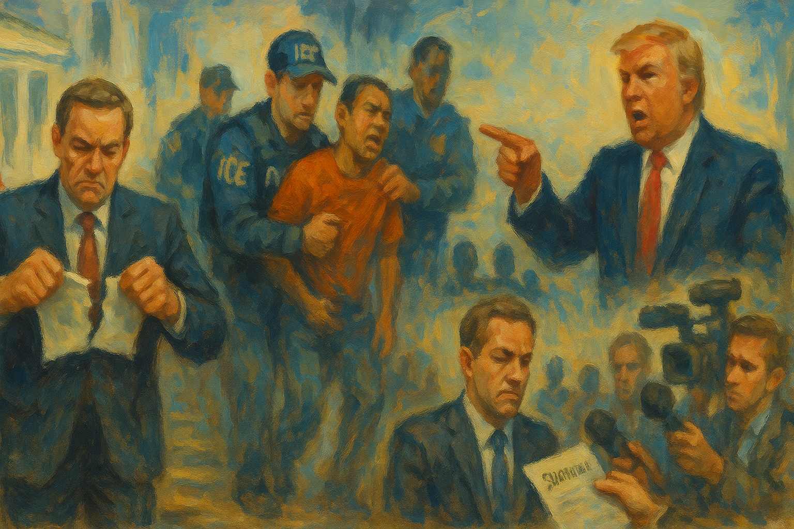

<!-- Generated by build_publish_week_v1 (appendix post) -->
<!-- Header image: image_wide_week78_appendix.png -->

# Week 78 Appendix: Consolidation Across Public Life

*Election machinery, immigration enforcement, press freedom, and public resources all faced coordinated pressure without a new formal breach.*

This was a high-pressure week defined by the fusion of election manipulation, politicized law enforcement, and executive encroachment on independent institutions. The most consequential cluster involved the dismantling and intimidation of election administration: the firing of Election Assistance Commission members, threats of criminal prosecution against state election officials, renewed pressure for the SAVE America Act, and public repetition of baseless fraud claims by top federal officials. A second major theme was coercive immigration enforcement, with multiple ICE-related killings, detention abuses, and rapid policy reversals that showed both the brutality and instability of the enforcement regime. A third theme was retaliation against accountability channels: subpoenas to journalists, a Pentagon-DOJ anti-leak taskforce, document withholding, and signs of DOJ politicization around Todd Blanche and other appointments. Courts provided some meaningful resistance, especially in voiding Trump-linked legal arrangements and staying some administration policies, but those corrective actions were outweighed by the week’s broader pattern: executive actors using personnel control, legal threats, and information warfare to weaken neutral administration and make democratic accountability harder to sustain.

Power and Authority

1. President Trump fired the remaining Democratic members of the Election Assistance Commission (2026-07-11): The removals weakened an independent election body and expanded direct presidential control over federal election administration before the midterms.

2. President Trump refused to sign a bipartisan housing bill to pressure Congress on the Save America Act (2026-07-11): The move used executive leverage to tie unrelated legislation to voting restrictions, testing whether policy approval could be conditioned on election-law demands.

3. The Trump administration planned permanent fencing and fortification around the White House and Lafayette Square (2026-07-11): The security buildout narrowed public access to core civic space near the presidency and raised barriers around a major site for protest and public presence.

4. President Trump signed proclamations shrinking Bears Ears and Grand Staircase-Escalante national monuments (2026-07-13): The proclamations used unilateral executive power to cut land protections, disband tribal-linked stewardship, and open former monument land to extraction.

5. President Trump announced and then quickly reversed a cargo-fee plan for the Strait of Hormuz (2026-07-13): The abrupt announcement and reversal showed volatile executive decision-making on war-adjacent trade powers with major diplomatic and economic stakes.

6. President Trump notified Congress that U.S. strikes on Iran had resumed and claimed continued authority under the War Powers Act (2026-07-14): The notice asserted broad presidential control over military escalation and tested Congress's role in authorizing sustained hostilities.

7. President Trump announced the reinstatement of an Iranian blockade and a U.S. security-fee role in the Strait of Hormuz (2026-07-14): The announcement asserted sweeping wartime and trade authority with limited visible congressional buy-in, raising separation-of-powers concerns.

8. The White House overruled a DHS pause on most ICE traffic stops (2026-07-15): The reversal showed direct political control over enforcement tactics after fatal shootings, favoring aggressive state power over internal restraint.

9. The President continued the national emergency on transnational criminal organizations for another year (2026-07-16): The extension kept emergency authorities in place as a standing tool of governance rather than a short-term response.

10. President Trump announced the declassification and release of election-security intelligence documents (2026-07-16): The release used presidential control over intelligence to shape election narratives and press for new investigations into past officials.

11. President Trump began construction of a helipad on White House grounds without seeking congressional approval or reviews (2026-07-17): The project bypassed normal oversight channels and used executive control over federal space in a way that raised accountability concerns.

Institutions and Governance

1. The 21st Century ROAD to Housing Act became law without the president's signature (2026-07-11): The outcome showed Congress could still enact major legislation despite presidential refusal, preserving a core institutional check.

2. Democratic lawmakers opened an investigation into the Lincoln Memorial reflecting pool project (2026-07-11): The inquiry tested whether Congress could force disclosure about spending, contracting, and possible favoritism in a federal project.

3. Judge Timothy Kelly dismissed the Proud Boys seditious conspiracy case at the Justice Department's request (2026-07-11): The dismissal ended a major January 6 accountability case and raised concerns about political influence over prosecution decisions.

4. The FBI assisted local authorities in the investigation of Senator Lindsey Graham's death (2026-07-11): Federal involvement in a high-profile death inquiry underscored the role of national law enforcement in politically sensitive investigations.

5. South Carolina officials began the process to fill Senator Lindsey Graham's vacant seat after his death (2026-07-11): The vacancy triggered appointment and special-election rules that directly affected Senate representation and balance of power.

6. President Trump called on the Senate to prioritize the Save America Act (2026-07-12): The pressure campaign sought to steer the legislative agenda toward national voting restrictions rather than ordinary appropriations or policy work.

7. Judge Kathleen Williams voided Trump's IRS settlement and sanctioned lawyers tied to the deal (2026-07-12): The ruling blocked a non-adversarial arrangement that the court found lacked legal basis, reinforcing judicial checks on executive misuse of litigation.

8. The House of Representatives had already approved the Save America Act earlier in the year (2026-07-13): The prior House passage established a live institutional vehicle for nationwide voting restrictions and shaped the week's legislative standoff.

9. The foreign surveillance law expired after Congress failed to renew it (2026-07-13): The lapse showed how disputes over intelligence leadership and oversight can disable core statutory authorities.

10. Twelve Democratic-led states sued to block the Paramount-Warner Bros. Discovery merger (2026-07-13): The case used state courts to contest media concentration and defend institutional checks on corporate consolidation.

11. Justices Elena Kagan and Amy Coney Barrett testified before Congress and requested more security funding for the Supreme Court (2026-07-14): The testimony reflected active legislative oversight of the judiciary and concern that threats to judges can impair independent adjudication.

12. The Supreme Court denied a stay of execution and certiorari in Sochor v. Florida (2026-07-14): The order let a death sentence proceed and illustrated the Court's gatekeeping power over final criminal review.

13. Senate Democrats blocked advancement of the defense authorization bill over Trump's Iran hostilities (2026-07-14): The vote used Senate procedure to push back on executive war policy and assert legislative leverage over defense business.

14. The House of Representatives passed the Sunshine Protection Act (2026-07-14): The vote showed routine legislative capacity on a broad domestic issue outside the week's main constitutional conflicts.

15. Mahmoud Khalil filed suit against Trump officials and allied groups over alleged targeting for pro-Palestinian advocacy (2026-07-14): The case asked the courts to review whether state actors and private groups coordinated to punish protected political speech.

16. Public health and conservation groups, counties, and tribes filed multiple lawsuits challenging federal policy changes (2026-07-14): The filings used judicial review to contest agency actions on vaping enforcement, endangered species, and teen pregnancy funding.

17. Judge Boasberg stayed a State Department policy targeting noncitizens involved in misinformation and content-moderation work (2026-07-14): The order checked a policy the court found likely to discriminate by viewpoint, preserving judicial review over executive immigration tools.

18. The House of Representatives passed a spending bill with the Save America Act attached (2026-07-15): The tactic used must-pass budgeting to advance voting restrictions, showing how procedure can be used to reshape election rules.

19. The Senate Judiciary Committee held Todd Blanche's confirmation hearing for attorney general (2026-07-15): The hearing became a test of whether the Senate would check concerns about politicization, purges, and personal loyalty at the Justice Department.

20. Ramsey County officials and advocacy groups filed lawsuits over DHS records and ICC-related sanctions (2026-07-15): The suits sought court review of federal secrecy and sanctions powers, pressing institutional limits on executive action.

21. Chief Judge McConnell denied the government's stay request in an immigration-benefits case (2026-07-15): The ruling kept pressure on the government to process benefits without delay, showing courts enforcing administrative obligations.

22. The Trump administration asked the Supreme Court to have a lower court reconsider protected status for Venezuelan and Haitian nationals (2026-07-15): The request sought judicial help to narrow immigration protections, placing major status decisions back before the courts.

23. House Republicans released a $95 billion budget framework with war, farm, and Save America funding (2026-07-16): The framework showed how reconciliation and budget design could be used to fund both military escalation and election-law priorities with limited bipartisan input.

24. Liz Oyer testified against Todd Blanche's nomination and accused him of using the Justice Department for political favors (2026-07-16): The testimony sharpened Senate scrutiny of whether the department would serve law or presidential patronage.

25. The parties and courts resolved or narrowed several pending cases involving public media, immigrant advocates, and Pentagon press access (2026-07-16): The rulings and stipulations changed the legal posture of ongoing challenges to executive actions affecting media and immigration institutions.

26. A panel of federal judges and the Trump administration appointed and then removed Roger Rogoff as U.S. attorney in Seattle (2026-07-17): The rapid appointment and firing highlighted conflict over statutory limits, judicial appointment power, and executive control of prosecutors.

27. The Office of Government Information Services announced its annual public meeting (2026-07-13): The notice preserved a formal venue for public engagement on access-to-records oversight under FOIA.

28. The Democracy Docket entry provided only a generic analysis listing without a discrete event (2026-07-16): The item did not describe a specific development but still marked election-law monitoring as an active institutional domain this week.

Economic Structure

1. The FTC investigated medical associations over guidance on care for transgender youth (2026-07-11): The probe used regulatory power to pressure professional guidance and could reshape access to care through agency intervention.

2. Health Secretary Robert F. Kennedy Jr. and the Trump administration pushed a campaign against antidepressant use (2026-07-11): The campaign signaled that federal health policy could be steered by ideology and private ties rather than stable medical standards.

3. The CDC scaled back foodborne-illness surveillance and left cyclospora and other pathogens untracked (2026-07-13): The rollback weakened public-health monitoring capacity and reduced the state's ability to detect and respond to outbreaks.

4. Trump administration officials delayed funding for screwworm research (2026-07-13): The delay showed how staffing cuts and funding bottlenecks can weaken agricultural protection and public capacity.

5. Governor Gavin Newsom signed California laws on electric vehicles, business incentives, and affordable housing (2026-07-13): The package used state economic policy to shape housing supply and clean-energy markets through public incentives.

6. The CDC opened comment periods on HIV monitoring and World Trade Center health-program feedback collection (2026-07-13): The notices maintained federal data systems that guide health services and resource allocation for vulnerable populations.

7. Federal regulators and state agencies moved toward approving more carbon sequestration projects backed by subsidies (2026-07-12): The approvals showed how public subsidy and permitting choices can shift environmental risk and economic benefit toward large energy firms.

8. The Trump administration planned to repeal poultry-farmer pay, anti-retaliation, and transparency rules (2026-07-13): The planned repeals would increase processor leverage over growers and reduce protections for farmers who report abuse or organize.

9. Federal regulators implemented an English-proficiency rule for commercial drivers (2026-07-13): The rule changed labor-market access in a way that could disproportionately burden immigrant workers in a regulated industry.

10. The EPA and FDA issued routine rules and guidance on pesticides, psychedelic drugs, OTC meetings, and topical corticosteroids (2026-07-14): The actions reflected ordinary federal rulemaking that shapes market access, compliance costs, and public-health standards.

11. Reports on Donald Trump Jr. and Eric Trump showed they had invested in defense startups benefiting from Pentagon priorities (2026-07-14): The overlap between family investments and federal spending priorities raised conflict-of-interest concerns about who gains from state procurement.

12. The Trump administration and the U.S. International Development Finance Corporation announced a Hormuz cargo-fee plan and tanker-loss insurance (2026-07-14): The measures used state economic power to manage war-related trade disruption, with major effects on shipping risk and energy prices.

13. Congress had previously passed the One Big Beautiful Bill Act funding border-wall expansion (2026-07-15): The law committed large public funds to a major enforcement infrastructure project with lasting budget and land-use effects.

14. Erica Schwartz faced a Senate confirmation hearing to lead the CDC (2026-07-15): The hearing mattered for whether a key public-health agency would retain scientific independence under political pressure.

15. The EPA designated new air-monitoring methods (2026-07-15): The update affected how states measure pollution and enforce national air-quality standards.

16. Trump-appointed Justice Department officials overrode career antitrust lawyers who wanted merger reviews (2026-07-16): The intervention weakened internal checks on concentration and suggested political appointees could ease scrutiny for large corporate deals.

17. The Department of Transportation proposed a national framework and safety-rule changes for autonomous vehicles (2026-07-16): The deregulatory push could preempt state rules and adapt federal safety standards to fit favored automated-vehicle designs.

18. Federal agencies including the DEA, EEOC, and EPA issued a large set of notices on controlled substances, air rules, remediation, and employment procedures (2026-07-16): The notices reflected routine administrative governance that shapes compliance burdens, environmental standards, and regulated markets.

19. Treasury Secretary Scott Bessent announced plans for a commemorative coin featuring Trump's likeness (2026-07-17): The plan used a national economic symbol in a way that blurred public currency functions with personal political branding.

20. FCC commissioners accepted gifts from CBS and Paramount while considering a merger involving Paramount (2026-07-17): The gifts raised conflict-of-interest concerns around regulatory neutrality in a major media-merger review.

21. The EEOC, EPA, FCC, and FDA issued additional notices on reporting rules, environmental review, broadband support, and medical-device and food oversight (2026-07-17): The notices showed the continuing reach of federal administrative power over labor data, communications, environmental review, and consumer safety.

Civil Rights and Dissent

1. Houston city officials repealed an ordinance limiting police cooperation with ICE after state funding pressure (2026-07-11): The repeal reduced local limits on immigration enforcement and showed how higher-level coercion can narrow local protections for immigrant residents.

2. ICE agents fatally shot Lorenzo Salgado Araujo in Houston even though he was not the intended target (2026-07-11): The killing raised acute concerns about lethal force, accountability, and bodily security for immigrant communities during enforcement operations.

3. The Department of Justice warned election officials nationwide that they could face criminal prosecution over noncitizen voting and voter-roll practices (2026-07-11): The letters threatened local election administrators with federal punishment and risked chilling independent election management.

4. Federal immigration authorities detained and removed unaccompanied minors at sharply increased rates (2026-07-11): The surge in enforcement against children showed how immigration policy can directly reduce due-process protection for vulnerable people.

5. Atlanta city employees discarded unhoused people's tents, medication, and identification without warning (2026-07-12): The sweep deprived vulnerable residents of basic property and documents, raising due-process and equal-treatment concerns in local governance.

6. ICE agents shot and killed Johan Sebastián Durán Guerrero in Biddeford, Maine, though he was not the target of the operation (2026-07-13): The shooting intensified concerns about force, mistaken targeting, and the safety of immigrants during routine enforcement actions.

7. The Department of Justice opened a grand jury investigation into UAW president Shawn Fain (2026-07-12): The probe affected a major labor organization during an internal election and raised questions about pressure on worker representation.

8. DHS and ICE paused most non-urgent vehicle stops after the Maine and Texas shootings (2026-07-13): The pause showed public pressure could force a temporary retreat from a tactic seen as dangerous to immigrant communities.

9. Physicians for Human Rights and the Human Rights Center at UC Berkeley reported widespread misuse of crowd-control weapons against anti-ICE protesters (2026-07-14): The findings documented repeated force against demonstrators and highlighted risks to the right to protest without serious injury.

10. The Aurora ICE processing center reported a tuberculosis outbreak among detainees (2026-07-14): The outbreak exposed health and confinement risks inside immigration detention and raised oversight concerns about detainee treatment.

11. A man fleeing an ICE and Homeland Security Investigations operation died after being struck by a tractor-trailer in St. Augustine, Florida (2026-07-14): The death added to scrutiny of enforcement tactics that can create lethal danger even without direct use of firearms.

12. Jesús Manuel Arenas-Silva died while being transferred between ICE detention facilities in Georgia (2026-07-15): The death in custody deepened concerns about medical care, transport conditions, and accountability inside the detention system.

13. ICE agents killed two men who were not targets of enforcement actions in Maine and Texas (2026-07-15): The paired killings showed a broader pattern of enforcement harm extending beyond intended targets and undermining trust in lawful process.

14. ICE increased arrests to record levels as the White House pushed for mass deportations (2026-07-16): The surge expanded the scale of coercive immigration enforcement and heightened fear and instability for immigrant communities.

15. DHS Secretary Markwayne Mullin announced mandatory election-security conditions for states seeking federal grants (2026-07-16): The plan used federal funding leverage to pressure state election systems and threatened penalties for noncompliance.

16. Two men kidnapped U.S. Forest Service employees before being arrested (2026-07-17): The hostage-taking highlighted threats faced by federal workers carrying out public duties in the field.

17. Democratic lawmakers called for an investigation into the ICE officer involved in the Maine shooting (2026-07-17): The demand sought accountability for lethal enforcement and scrutiny of hiring and vetting inside ICE.

18. Deportation flights reportedly proceeded in defiance of a judge's orders (2026-07-17): The reported flights suggested immigration enforcement was operating against judicial limits, threatening due process and court authority.

19. ICE arrested asylum-seeking Chinese human rights lawyer Wu Shaoping despite his pending claim (2026-07-17): The detention raised concerns that asylum protections could be overridden by aggressive enforcement even when legal claims were active.

20. An off-duty Geo Group employee shot a woman who had protested outside an ICE facility and was later arrested (2026-07-17): The shooting linked private detention operations to violence against a protest participant and raised concerns about safety around dissent.

21. Republican lawmakers in North Dakota, South Dakota, and Utah proposed raising ballot-measure approval thresholds to 60% (2026-07-17): The proposals would make direct democracy harder to use by requiring supermajorities for citizen-backed measures.

22. Civil society groups organized protests and accountability actions over ICE killings and voting rights (2026-07-15): The mobilizations showed continued public use of assembly and advocacy to contest state violence and election restrictions.

23. Community and political groups used cultural and gaming events to raise funds and support for political causes (2026-07-16): The organizing reflected nontraditional civic participation channels for communities responding to immigration and LGBTQ-related threats.

24. The CDC continued a 30-day suspension of entry for certain travelers from Ebola-affected countries (2026-07-13): The order used public-health authority to restrict entry, directly affecting mobility and rights for people from named countries.

Information, Memory and Manipulation

1. The Trump administration subpoenaed New York Times journalists over reporting on security concerns involving Trump's aircraft (2026-07-11): The subpoenas used criminal process against reporters and threatened source protection and press independence.

2. CNBC published repeated coverage of Kalshi without consistently disclosing its financial relationship (2026-07-11): The undisclosed tie risked misleading audiences about the independence of business news shaping public understanding of markets and politics.

3. President Trump attacked journalists and claimed he would win in a landslide (2026-07-12): The message sought to discredit independent reporting while pre-framing electoral legitimacy around his own narrative.

4. Defense Secretary Pete Hegseth announced a Pentagon-DOJ task force to identify and prosecute leaks to the press (2026-07-13): The task force formalized a stronger state response to unauthorized reporting and increased pressure on sources and journalists.

5. Iranian state media released satellite images claiming damage to U.S. military assets (2026-07-14): The release formed part of wartime narrative competition aimed at shaping public perception of military effectiveness.

6. FCC Chair Brendan Carr suggested broadcasters could lose licenses if they did not air President Trump's speech (2026-07-15): The warning implied state punishment for editorial choices and threatened the independence of licensed media outlets.

7. The White House and FBI leadership pursued a leak investigation into reporting on a Qatari-gifted airplane (2026-07-15): The probe blurred political and law-enforcement lines in a way that risked chilling internal disclosure and press scrutiny.

8. President Trump announced a primetime speech alleging a 2020 election data breach and foreign access to voter data (2026-07-16): The planned address revived unproven election claims and risked undermining confidence in past and future election outcomes.

9. President Trump repeated 2020 election claims in a national address and called for revoking ABC and NBC licenses (2026-07-16): The speech combined election disinformation with direct pressure on broadcasters, linking media punishment to political narrative control.

10. Secretary Markwayne Mullin repeated unsupported claims about noncitizen voting and threatened grant consequences for states (2026-07-17): A cabinet official used the authority of office to amplify unverified election claims, risking public trust in election administration.

11. President Trump released declassified intelligence documents during a primetime address (2026-07-17): The release used intelligence material as a political communication tool and raised concerns about selective disclosure to shape public belief.

12. Todd Blanche withheld Epstein-related documents despite court pressure and transparency demands (2026-07-15): The continued withholding limited public access to records in a high-profile case and raised concerns about selective secrecy at the Justice Department.

13. The Trump administration turned over previously withheld evidence in fatal-shooting cases to Minnesota investigators (2026-07-14): The delayed disclosure showed how control over records can shape accountability timelines in cases involving state violence.

