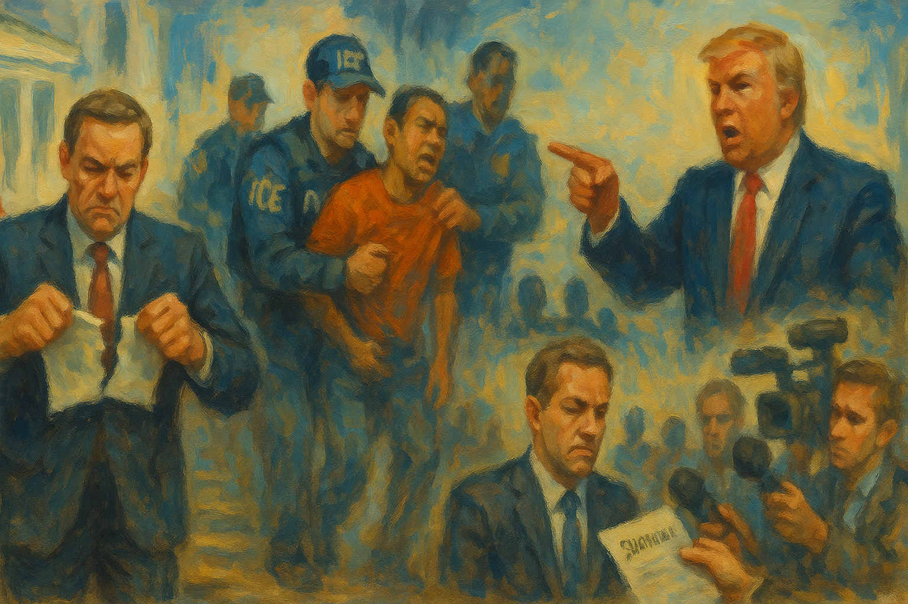

<!-- Generated by build_publish_week_v1 (appendix post) -->
<!-- Header image: image_wide_week78_appendix.png -->

# Week 78 Appendix: The Week the Clock Held Its Breath

*Fatal ICE shootings, a war resumed without authorization, and a primetime bid to relitigate 2020 nearly offset each other to a standstill.*

This week combined an active foreign military conflict, an unprecedented assault on election legitimacy, and a cascade of law-enforcement lethality that together reveal an executive branch increasingly unconstrained by institutional checks. Trump's refusal to sign bipartisan legislation absent voter-restriction concessions, his circumvention of War Powers Act notice requirements for renewed Iran strikes, and his prime-time address recycling debunked 2020 election fraud claims (backed by DHS threats of criminal prosecution against state election officials) collectively signal deliberate groundwork for contesting future election outcomes. Simultaneously, ICE's expanding, poorly vetted enforcement apparatus produced multiple fatal shootings of non-target civilians within days, prompting a policy reversal driven not by accountability concerns but by MAGA-base pressure. DOJ subpoenas of NYT journalists, judicial sanctioning of a manufactured Trump-IRS settlement, and the sudden firing of a judicially-appointed U.S. attorney reveal a Justice Department alternately weaponized against critics and shielding the president. Death of Senator Graham and rapid family-based succession, alongside emoluments-adjacent stories (Kushner land deals, defense-contract enrichment for Trump's sons), rounded out a week defined by institutional strain across nearly every branch.

Power and Authority

1. Trump refused to sign a bipartisan housing bill unless Congress passed a voting-restriction measure (2026-07-11): The president used his signature power as leverage to force voting restrictions, letting a bipartisan bill become law only through the pocket-veto mechanism.

2. Trump notified Congress of resumed strikes on Iran under a reinterpreted War Powers Act clock (2026-07-11): The administration claimed a fresh 60-day window for military action without new congressional authorization, sidestepping constitutional war powers.

3. Trump held a secret Camp David meeting with select House Republicans to build a budget package bypassing Democrats (2026-07-11): Excluding moderate members and confiscating phones during closed-door budget talks weakened transparent, inclusive legislative process.

4. Trump posted threats of massive military strikes against Iran on social media (2026-07-11): Presidential threats of large-scale destruction, issued informally via social media, escalated tensions without deliberative process.

5. Trump tied renewal of a foreign surveillance law to passage of the voting-restriction Save America Act (2026-07-13): Conditioning national security legislation on partisan electoral measures represents coercion of Congress by the executive.

6. Trump ordered airstrikes on Iran and announced a naval blockade of Iranian shipping (2026-07-12) *[single source]*: Unilateral military escalation, including a blockade equivalent to an act of war, proceeded without apparent congressional authorization.

7. Trump ousted three members of an independent federal election-administration commission (2026-07-13): Removing independent election commissioners ahead of midterms signals executive interference with nonpartisan election oversight.

8. Trump recommended Lindsey Graham's sister for the vacated South Carolina Senate seat, overriding a sitting senator's own preference (2026-07-13): The president's direct intervention in a state appointment shows executive influence reaching into supposedly independent state Senate succession decisions.

9. Trump directed the Department of Justice to dismiss seditious conspiracy convictions against Proud Boys leaders (2026-07-11): A Trump-appointed judge reluctantly granted the dismissal, acknowledging it was driven by political motive rather than law, undermining accountability for January 6 violence.

10. Trump constructed a helipad on the White House South Lawn without congressional review or zoning process (2026-07-16): Building major infrastructure on federal grounds outside statutory review, funded partly by a defense contractor, bypassed legislative and regulatory checks.

11. Trump announced a nationally televised address relitigating the 2020 election with claims of foreign interference (2026-07-16): The president used a formal presidential platform to promote debunked election-fraud claims explicitly to pressure passage of voter-restriction legislation.

12. Trump ordered the Department of Homeland Security to direct states to purge noncitizens from voter rolls using a tool federal courts have repeatedly blocked (2026-07-17) *[single source]*: The directive revives a mechanism courts found unreliable and unconstitutional sixteen times, overriding judicial determinations to pressure state election systems.

13. Trump demanded Congress pass the SAVE America voter-restriction act, framing refusal as evidence of cheating (2026-07-17) *[single source]*: Public pressure delegitimizing legislative independence tied election-restriction passage to unsubstantiated accusations against opponents.

14. Trump fired a judicially appointed U.S. attorney within an hour of his swearing-in (2026-07-17): Removing a prosecutor appointed unanimously by federal judges demonstrates executive assertion of unilateral control over supposedly independent law enforcement appointments.

15. Trump administration overturned a DHS memo halting ICE traffic stops after two fatal shootings within days (2026-07-15): Executive override of an agency safety pause, driven by political pressure rather than accountability findings, prioritized enforcement volume over documented civilian deaths.

Institutions and Governance

1. Judge Timothy Kelly dismissed seditious conspiracy convictions against Proud Boys leaders at DOJ's request (2026-07-11): A federal judge, while disagreeing with the decision, found himself bound to dismiss convictions tied to the January 6 Capitol attack, undermining accountability for political violence.

2. U.S. District Judge Stephen Wilson awarded Hunter Biden $1.7 million in punitive damages in a defamation case against Patrick Byrne (2026-07-11): Judicial enforcement of defamation law against fabricated political claims reinforced rule-of-law protections against bad-faith disinformation campaigns.

3. Colt Gray scheduled for a non-negotiated plea hearing in the Apalachee school shooting case (2026-07-12) *[single source]*: A judicial proceeding in a mass-shooting case tests how courts handle sentencing and accountability for underage offenders.

4. Indiana legislature enacted law stripping landowners of the right to reject carbon sequestration projects on their property (2026-07-12) *[single source]*: State law removed consent rights for landowners facing industrial injection projects, undermining property rights and informed consent despite documented safety risks.

5. House Republicans used procedural obstruction to pressure the Senate on voting-restriction legislation (2026-07-13) *[single source]*: Blocking routine House business to coerce Senate action on partisan voting measures reflects weaponization of legislative procedure over institutional norms.

6. Judge Kathleen Williams voided a $1.776 billion DOJ settlement designed to shield Trump and family from tax audits, sanctioning his lawyers (2026-07-13): A federal judge found the settlement was manufactured to gain false judicial legitimacy for an unconstitutional immunity scheme, sanctioning attorneys and referring some for discipline.

7. Democratic states coalition sued to block the Paramount–Warner Bros. Discovery merger (2026-07-13) *[single source]*: Twelve states challenged a major media merger on antitrust grounds, seeking to preserve competitive markets and protect consumers.

8. Trump signed proclamations shrinking Bears Ears and Grand Staircase-Escalante national monuments by roughly 90 percent each (2026-07-13): Unilateral reductions of protected federal lands opened nearly three million acres to extraction, reversing prior protections without congressional input.

9. House of Representatives passed the Sunshine Protection Act to make daylight saving time permanent (2026-07-15) *[single source]*: Bipartisan passage of a routine policy change reflects ordinary legislative function unrelated to democratic stakes.

10. Ilhan Omar introduced a resolution urging U.S. membership in the International Criminal Court (2026-07-15) *[single source]*: Congressional pushback against executive plans to dismantle an international justice institution signals a democratic check on unilateral foreign-policy power.

11. Senate Democrats blocked advancement of the National Defense Authorization Act to protest Trump's Iran hostilities (2026-07-15): Senators used procedural leverage to assert congressional oversight of executive war-making, denying the defense bill the votes needed to proceed.

12. Elena Kagan and Amy Coney Barrett testified before Congress requesting a $14.6 million security budget increase amid rising threats (2026-07-14): Escalating threats against sitting justices highlight the security burden imposed by political polarization on judicial independence.

13. House Republicans released a $95 billion budget framework tying military spending, farm bailouts, and voter-suppression funding through reconciliation (2026-07-15): Bypassing bipartisan appropriations processes to fund an unpopular war and voter-restriction measures undermines normal legislative deliberation.

14. House of Representatives voted 314-104 to reject an amendment cutting military aid to Israel, with over 100 Democrats breaking ranks (2026-07-16) *[single source]*: A significant fracture in bipartisan consensus on Israel aid signals shifting Democratic positions ahead of midterm primaries.

15. House of Representatives passed the Save America Act tied to a State Department spending bill (2026-07-16) *[single source]*: Linking voting restrictions—including bans on mail-in ballots—to unrelated spending authorization advances partisan electoral rule changes ahead of midterms.

16. Trump administration DOJ appointees overruled career antitrust attorneys' recommendations to review corporate mergers (2026-07-16) *[single source]*: Political appointees suppressed antitrust scrutiny of mergers, allowing potential consumer harm to proceed unchecked, according to internal reporting.

17. Todd Blanche underwent Senate confirmation hearing for attorney general amid allegations of retaliation against a DOJ pardon attorney (2026-07-15) *[single source]*: Testimony alleged Blanche fired an official for refusing a political favor for a Trump ally, raising concerns about weaponization of DOJ leadership.

18. Todd Blanche confirmed as attorney general despite documented concerns about fitness and prior weaponization of DOJ (2026-07-17): The elevation of Trump's former personal attorney to head federal law enforcement consolidates politicized control atop the Justice Department.

19. Jay Clayton refused to answer whether Trump won the 2020 election during his DNI confirmation hearing (2026-07-16) *[single source]*: A nominee for the top intelligence position declined to affirm basic electoral fact, signaling potential politicization of intelligence oversight.

20. Human Rights Watch and Physicians for Human Rights released a study finding 52 deaths in ICE custody over 500 days, quadruple the prior administration's rate (2026-07-13) *[single source]*: Independent documentation revealed systemic failures in oversight and accountability for detained persons in federal custody.

Economic Structure

1. Congress enacted the 21st Century ROAD to Housing Act (2026-07-11): Bipartisan housing legislation became law, addressing federal regulatory measures affecting housing affordability and market access.

2. Doug Burgum awarded repeat no-bid contracts for Lincoln Memorial reflecting pool repairs (2026-07-11): Bypassing competitive bidding for a high-cost public project raises concerns about fiscal accountability and favoritism toward repeat contractors.

3. Congress enacted the Emergency Conservation Program Improvement Act of 2025 (2026-07-12): New federal conservation and disaster-preparedness frameworks affect environmental protection capacity within existing federal authority.

4. EPA approved dozens of carbon sequestration projects funded by billions in tax credits despite documented safety risks and community opposition (2026-07-12) *[single source]*: Fossil-fuel-linked carbon capture projects received regulatory approval and massive public subsidies over objections from affected residents citing contamination and earthquake risks.

5. Trump Jr. and Eric Trump invested in defense technology start-ups that collectively received at least $3.2 billion in government contracts (2026-07-12): Presidential sons' financial stakes in firms benefiting from Pentagon spending raise conflict-of-interest and self-dealing concerns.

6. Trump administration granted two years of EPA regulatory relief to chemical manufacturers for semiconductors, medical devices, and defense materials (2026-07-13): Suspending environmental enforcement for critical industries under national-security framing bypasses statutory environmental standards through executive proclamation.

7. Trump administration planned to repeal transparency and anti-retaliation rules protecting poultry farmers from processor abuse (2026-07-13) *[single source]*: Rolling back protections for farmers against large processors favors corporate interests over vulnerable producers, tied to major campaign donors.

8. Justice Department blocked TransDigm's acquisition of a rival defense contractor to preserve competition (2026-07-13): An antitrust enforcement action preserved competitive supply chains for critical military components, protecting taxpayer and national-security interests.

9. Trump administration prepared new tariffs on allies and trading partners to circumvent court-imposed limits on protectionist trade policy (2026-07-14) *[single source]*: Threatened tariffs against major allies represent executive weaponization of trade policy for political leverage beyond judicial constraints.

10. Marco Rubio imposed 25 percent tariffs on Brazil timed with a contested election involving the Bolsonaro family (2026-07-15): Tariffs framed as trade enforcement coincided with a foreign election, suggesting weaponization of trade policy to influence outcomes favoring an allied political family.

11. Trump administration Department of Transportation proposed deregulating vehicle safety standards to accommodate Tesla's driverless Cybercab (2026-07-16) *[single source]*: Regulatory changes benefiting a specific ally's company would eliminate steering-wheel and pedal requirements without demonstrated safety evidence.

12. CNN investigation found Trump made at least 44 stock purchases before posting complimentary messages about those companies (2026-07-16) *[single source]*: A pattern suggesting potential market manipulation tied to presidential social-media activity raises conflict-of-interest and insider-trading concerns.

13. Republican Congress enacted the One Big Beautiful Bill Act cutting over $1 trillion from social programs while extending $4.5 trillion in tax breaks for the wealthy (2026-07-16) *[single source]*: The law shifted government priorities toward wealth concentration, resulting in millions losing food assistance including at least one million children.

14. Trump administration dismissed climate change as a 'scam' amid wildfire smoke exposing 115 million Americans to hazardous air quality (2026-07-16): Denial of climate-related public health risks left the nation unprepared to respond to an air-quality crisis affecting a large share of the population.

15. Gabriel Perez used inside knowledge of Trump's speeches to place over $100,000 in bets on a prediction market (2026-07-16): A White House staffer's alleged insider trading using non-public presidential information raises accountability and conflict-of-interest concerns.

16. Pentagon internally estimated Iran war costs at approximately $100 billion, nearly triple the figure given to Congress (2026-07-14): A major discrepancy between congressional testimony and internal cost estimates undermines informed legislative oversight of military spending.

17. FCC commissioners accepted expensive gala tickets from companies under active merger review (2026-07-17) *[single source]*: Regulators accepting gifts from a company whose merger they were evaluating compromises the independence and integrity of the review process.

Civil Rights and Dissent

1. ICE fatally shot Lorenzo Salgado Araujo, a business owner not targeted in the operation (2026-07-11) *[single source]*: A federal immigration agent killed a non-target civilian, prompting community demands for accountability amid a wave of fatal ICE encounters.

2. ICE arrested immigrants at a record rate of 1,474 per day amid rapid, poorly vetted agent hiring (2026-07-11) *[single source]*: Record enforcement levels combined with unqualified new agents created conditions for abuse and undermined due process protections.

3. ICE detained and removed unaccompanied minors at three times the rate of the previous administration (2026-07-11) *[single source]*: A sharp rise in enforcement against unaccompanied minors raises human-rights concerns about treatment of vulnerable immigrant children.

4. Trump promoted a poll claiming overwhelming support for the Save America voter-suppression bill (2026-07-11) *[single source]*: Using dubious polling data to pressure the Senate on restrictive voting legislation undermines informed public discourse on voting access.

5. Atlanta city government fenced off public parks used by unhoused people ahead of the World Cup (2026-07-12) *[single source]*: Removing public spaces accessible to unhoused people disrupted access to services and concentrated vulnerable populations in less-served areas.

6. ICE shot and killed Johan Sebastián Durán Guerrero in Maine, a second non-target fatality within a week (2026-07-13): A second fatal ICE shooting of a non-target civilian in six days, with no body-camera footage, deepened accountability concerns.

7. Maine community members organized rapid protests in multiple cities after Johan's killing (2026-07-13) *[single source]*: Large-scale, rapid community mobilization against a fatal ICE shooting demonstrated organized civil-society pressure on federal enforcement.

8. Mahmoud Khalil filed a civil conspiracy lawsuit alleging coordinated government-private targeting of pro-Palestinian speech (2026-07-14): A former detainee alleged a public-private conspiracy under the Ku Klux Klan Act to suppress protected political speech through immigration enforcement.

9. Physicians for Human Rights documented 412 incidents of crowd-control weapon misuse against ICE protesters, causing 203 injuries (2026-07-14) *[single source]*: A yearlong pattern of excessive force against protesters, including blindings and brain injuries, represents a direct attack on the right to peaceful assembly.

10. ICE pepper-sprayed New Jersey Senator Andy Kim during a protest at a detention center (2026-07-14) *[single source]*: Use of force against a sitting senator during lawful protest illustrates indiscriminate crowd-control tactics against protected persons.

11. Trump fired Merit Systems Protection Board member Cathy Harris following a Supreme Court ruling on removal power (2026-07-14): Removing an official from the agency meant to protect merit-based hiring enables politicization of civil-service protections.

12. Jesús Manuel Arenas-Silva died in ICE custody during a facility transfer after alleged denial of necessary medication (2026-07-14) *[single source]*: The 22nd ICE custody death of the year highlights systemic failures in detainee medical care under aggressive enforcement policies.

13. A man in Florida was struck and killed by a truck while fleeing an ICE enforcement encounter (2026-07-14): A fatal outcome during an ICE stop, occurring the same day enforcement pauses were announced, raised further safety concerns about enforcement tactics.

14. ICE and Geo Group failed to contain a tuberculosis outbreak at the Aurora detention facility, sickening at least 12 detainees (2026-07-14) *[single source]*: Reported failure to isolate infected detainees and inoperative air conditioning demonstrate neglect of detained immigrants' health and safety.

15. Bipartisan coalition (No Big Bend Wall) submitted a petition with over 150,000 signatures opposing the Big Bend border wall (2026-07-15) *[single source]*: Cross-party grassroots mobilization and litigation demonstrated organized resistance to a federal border-wall project on ecological and community grounds.

16. ICE paused, then within 24 hours resumed under presidential pressure, vehicle stops following fatal shootings (2026-07-15) *[single source]*: A rapid reversal of a safety pause, driven by political pressure rather than accountability review, prioritized enforcement continuity over documented civilian deaths.

17. Two advocacy groups sued the Trump administration alleging ICC-related sanctions violate First Amendment rights (2026-07-15) *[single source]*: Advocacy organizations challenged executive sanctions restricting civil-society engagement with international justice mechanisms as unconstitutional viewpoint suppression.

18. Pete Hegseth announced mandatory testosterone-deficiency screening for service members over 30, excluding consideration of women's health needs (2026-07-15): A militarized health directive framed around masculinity raises questions about equitable treatment of all service members, including women.

19. Trump publicly criticized New York's datacenter moratorium and demanded its immediate reversal (2026-07-16): Presidential pressure on a state governor to reverse a lawfully enacted policy raises federal-state relations concerns beyond direct federal authority.

20. Republican lawmakers proposed raising ballot-measure approval thresholds to 60 percent in three states (2026-07-17) *[single source]*: Supermajority thresholds for ballot initiatives can override simple-majority voter preferences, as demonstrated by a prior failed abortion-rights measure in Florida.

21. Markwayne Mullin threatened state election officials with criminal prosecution for refusing federal voter-roll demands (2026-07-17) *[single source]*: Coercive threats against state officials over voter-roll compliance disregard repeated federal court rulings blocking such demands, undermining federalism and election administration independence.

22. FBI ceased investigating confrontations involving ICE agents (2026-07-17) *[single source]*: Removal of an independent investigative check on ICE use-of-force incidents eliminates accountability mechanisms for federal immigration enforcement.

23. ICE arrested asylum-seeking Chinese human-rights lawyer Wu Shaoping despite a pending legal claim (2026-07-17) *[single source]*: Detention of an asylum applicant with proof of legal status raises concerns about enforcement priorities and risks to vulnerable refugees.

24. Brandon Booth shot and injured a protester outside an ICE detention facility (2026-07-17) *[single source]*: An armed private contractor employee's shooting of a protester exercising constitutional rights raises concerns about violence against dissent at federal facilities.

25. 50501 Movement and partner organizations organized a nationwide weekend of civic action honoring John Lewis across 600 communities (2026-07-17) *[single source]*: Large-scale coordinated civic mobilization emphasized voter registration and civic education amid concerns over voting rights and ICE accountability.

26. three unidentified individuals impersonated federal officers, forcibly detained and assaulted an Oregon driver (2026-07-17) *[single source]*: Armed individuals falsely claiming ICE authority assaulted a civilian, exposing vulnerabilities in verifying law enforcement identity during immigration-enforcement operations.

27. Venezuelan deportees sued aviation contractors for transporting them to an alleged torture prison in El Salvador (2026-07-17) *[single source]*: Litigation against private contractors alleges complicity in unlawful deportation and human-rights abuses despite a judicial order to return the men.

Information, Memory and Manipulation

1. Trump attacked journalist Maggie Haberman and other reporters over coverage of his statements and fitness (2026-07-11): Personal presidential attacks on journalists for reporting undermine press freedom and independent scrutiny of the executive.

2. Department of Justice subpoenaed New York Times journalists to testify before a grand jury over Air Force One security reporting (2026-07-11): Federal subpoenas targeting reporters for national-security coverage, following an FBI leak investigation, represent an escalation against press freedom.

3. CNBC failed to disclose financial ties to prediction market Kalshi in 22 of 58 articles promoting it (2026-07-11) *[single source]*: Undisclosed financial conflicts of interest in media coverage undermine transparency and can mislead audiences about impartiality.

4. Trump falsely claimed credit for Walmart beef price cuts that reflected routine seasonal rollbacks (2026-07-12): The president's false claim of credit for corporate action already planned distorts public understanding of economic conditions and policy effectiveness.

5. Ron Filipkowski (reporter) found no evidence of a reported '350-foot gash' at the Lincoln Memorial reflecting pool after it was drained (2026-07-13) *[single source]*: Absence of claimed structural damage contradicts earlier official statements about the extent of damage to a national monument.

6. Senator Ron Johnson questioned the authenticity of a McConnell 'proof of life' hospital photo, then retracted the claim (2026-07-13): Unsubstantiated public speculation about the authenticity of official imagery, later withdrawn, shows how misinformation spreads and is later corrected.

7. Trump made false public claims about opposing the 2003 Iraq invasion (2026-07-14): A verifiably false statement about the president's own historical record undermines accountable public discourse on matters of war and peace.

8. Trump administration secretly influenced the Merit Systems Protection Board's ruling on presidential removal power (2026-07-14) *[single source]*: Covert influence over an independent agency's decision-making, without transparency or adversarial process, undermines the integrity of federal administrative institutions.

9. Kash Patel and Susie Wiles orchestrated a sprawling leak investigation, seizing officials' phones on White House grounds (2026-07-16) *[single source]*: A White House-directed investigation into internal leaks demonstrates politicized control over federal law enforcement's independence.

10. FCC Chair Brendan Carr suggested broadcasters could lose licenses for not airing Trump's speech (2026-07-16) *[single source]*: Threatening broadcast licenses over editorial coverage decisions represents regulatory coercion against independent media judgment.

11. Trump announced a primetime speech claiming China accessed 2020 election data and the CIA concealed it (2026-07-16): The announcement previewed unsubstantiated election-fraud claims timed before midterms, targeting the legitimacy of prior Democratic wins.

12. Trump delivered a primetime address with declassified documents claiming foreign election interference and called for revoking NBC and ABC broadcast licenses (2026-07-16): Selective declassification paired with threats to punish networks for editorial decisions combined election disinformation with attacks on press freedom.

13. Trump called for revocation of NBC and ABC broadcast licenses over their decision not to air his speech (2026-07-16): Direct presidential threats to punish networks for editorial independence constitute retaliation against press freedom.

14. John Solomon acknowledged the intelligence community has no evidence of foreign vote-flipping in 2020, 2022, or 2024 (2026-07-16) *[single source]*: The author of the report underlying Trump's election-fraud claims publicly conceded the absence of supporting evidence, undermining the speech's factual basis.

15. Fox News limited live coverage of Trump's speech to three minutes and declined to evaluate his claims (2026-07-16) *[single source]*: A major sympathetic outlet's restrained coverage and explicit refusal to validate the president's claims marked a departure from typical amplification.

16. CNN and Senator Mark Warner publicly debunked specific claims in Trump's election-interference speech (2026-07-16): Media and congressional fact-checking demonstrated capacity to counter presidential misinformation despite pressure to amplify it uncritically.

17. Secretary of State Marco Rubio convened a State Department meeting framing left-wing activism as terrorism equivalent to jihadism (2026-07-17): Officially reframing domestic political opposition as terrorism creates rhetorical justification for expanded surveillance and suppression of lawful dissent.

18. Stephen Miller dehumanized political opponents as physically 'deformed' in a public speech (2026-07-17): A senior White House official's rhetoric mirrored historical dehumanizing language used against political adversaries, escalating official dissent-suppression framing.

19. Markwayne Mullin repeated baseless claims of noncitizen voter registration and voting-machine vulnerabilities at a press conference (2026-07-17): A cabinet secretary amplified unsubstantiated election-fraud claims, undermining public confidence in democratic processes and threatening coercion of states.

20. Tom Homan made false public statements claiming body cameras were purchased on time, contradicted by contracting documents (2026-07-14): A senior official's demonstrably false claim about ICE accountability measures undermined public trust in official statements on enforcement oversight.

21. Trump made repeated false claims that the U.S. controlled the Strait of Hormuz (2026-07-17): Dozens of false presidential claims about a major military and geopolitical fact distorted public understanding of an ongoing conflict.

22. White House published a fact sheet framing declassified intelligence as evidence of 'deep state' suppression (2026-07-17): Framing declassified intelligence release as exposing institutional betrayal delegitimizes independent oversight bodies and concentrates informational authority in the presidency.

23. Todd Blanche withheld documents required for release under the Epstein Files Transparency Act despite a court order (2026-07-15) *[single source]*: Continued defiance of a federal court ruling and statutory transparency requirements undermines rule of law and public access to information of significant interest.

24. Zeteo reporting characterized Stephen Miller's speech launching a global anti-left campaign as apocalyptic and authoritarian (2026-07-16) *[single source]*: A senior official's framing of domestic opposition as a global threat signals potential targeting of civil society and protest movements.

